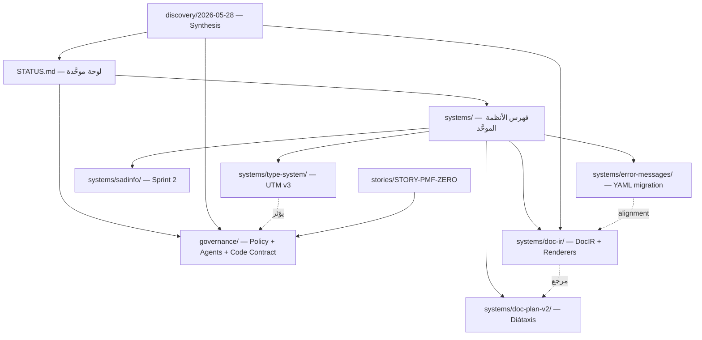

---
title: فهرس أنظمة _bmad-output
date: 2026-05-30
author: Amelia (bmad-agent-dev)
purpose: |
  وثيقة مرجعية موحَّدة تشرح كل نظام/مجلد داخل `_bmad-output/`،
  ودوره في دورة حياة لغة ص، ومصادر الحقيقة (SoT) المرتبطة به.
relatedDocuments:
  - _bmad-output/STATUS.md
  - _bmad-output/governance/README.md
  - _bmad-output/governance/ARCHITECTURE.md
  - .github/copilot-instructions.md
---

# 🗂️ فهرس أنظمة `_bmad-output/`

> هذا المجلد هو **مستودع آثار التخطيط والحوكمة والتنفيذ** الناتجة عن منهجية
> BMAD (Breakthrough Method for Agile AI-Driven Development) في مشروع لغة ص.
> كل مجلد يمثّل **نظاماً مستقلاً** بمصدر حقيقة (SoT) خاص به، ويُفهرس مركزياً
> عبر [STATUS.md](STATUS.md) لتجنّب status drift.

> 🆕 **تحديث 2026-05-30:** المجلدات الثلاثة `agents/`, `codeRolePlan/`, `management/`
> تم **توحيدها** تحت [`governance/`](governance/) كنظام واحد بثلاث طبقات.
> لمعرفة الأسباب التفصيلية وفحص الواقع الفعلي مقابل الادعاءات الوثائقية،
> راجع [`governance/ARCHITECTURE.md`](governance/ARCHITECTURE.md) و
> [`archive/2026-05-30-governance-unification/`](archive/2026-05-30-governance-unification/).

---

## 0. نقطة الدخول الموحَّدة

| الملف | الدور |
|---|---|
| [STATUS.md](STATUS.md) | **لوحة الحالة الموحَّدة** — فهرس لتقارير الحالة الموزَّعة، يمنع تكرار التفاصيل ويحدّ من drift. ابدأ هنا دائماً. |
| [governance/README.md](governance/README.md) | **بوابة الحوكمة** — Policy + Agents + Code Contract في نظام واحد. |

---

## 1. خريطة المجلدات (نظرة سريعة)

| المجلد | النوع | الحالة | المسؤولية |
|---|---|---|---|
| [governance/](governance/) | حوكمة | نشط (PMF v1.9.1) | **النظام الموحَّد** — Policy + Agents + Code Contract |
| [discovery/](discovery/) | استكشافي | نشط | تقارير اكتشاف PM (synthesis موحَّد) |
| [systems/](systems/) | **النظام الموحَّد** | نشط (2026-05-30) | **فهرس موحَّد لكل أنظمة لغة ص** — error-messages, type-system, doc-ir, doc-plan-v2, sadinfo (95 ملف، 6 أنظمة) |
| [implementation-artifacts/](implementation-artifacts/) | مخصَّص | فارغ | مساحة محجوزة لمخرجات التنفيذ المستقبلية |
| [party-sessions/](party-sessions/) | مراجعة | فارغ | مساحة لجلسات الذكاء الجماعي (BMAD party mode) |
| [planning-artifacts/](planning-artifacts/) | تخطيطي | مختلط | خطط قديمة + sadinfo v2 النشطة + خطط VS Code |
| [stories/](stories/) | تنفيذي | محدود | ستوريات مستقلة جذرية (STORY-PMF-ZERO) |
| [test-artifacts/](test-artifacts/) | مخصَّص | فارغ | مساحة محجوزة لمخرجات الاختبار المستقبلية |

> **ملاحظة:** المجلدات السابقة `agents/`, `codeRolePlan/`, `management/` لم تعد
> موجودة كمجلدات منفصلة — محتواها انتقل تحت [`governance/`](governance/).

---

## 2. شرح تفصيلي لكل نظام

### 2.1. `governance/` — نظام الحوكمة الموحَّد ⭐

**الغرض:** نظام واحد بثلاث طبقات يجيب على ثلاثة أسئلة مختلفة دون تكرار:

| الطبقة | السؤال | الموقع |
|---|---|---|
| ⚖️ **1-policy** | ما هي القواعد؟ (PMF + THRESHOLDS + BACKLOG) | [governance/1-policy/](governance/1-policy/) |
| 👥 **2-agents** | من ينفّذ ضمن أي نطاق؟ (5 وكلاء α/β/γ/δ/ε) | [governance/2-agents/](governance/2-agents/) |
| 🔧 **3-code-contract** | كيف نُلزم الكود تقنياً؟ (SAD_INVARIANT + clang-tidy) | [governance/3-code-contract/](governance/3-code-contract/) |

#### نقاط الدخول السريعة

| تحتاج… | الموقع |
|---|---|
| الدستور التشغيلي | [governance/1-policy/PROJECT_MANAGEMENT_FRAMEWORK.md](governance/1-policy/PROJECT_MANAGEMENT_FRAMEWORK.md) |
| الستوريات المعتمدة | [governance/1-policy/execution/BACKLOG.md](governance/1-policy/execution/BACKLOG.md) |
| السبرنت الحالي | [governance/1-policy/execution/SPRINT_CURRENT.md](governance/1-policy/execution/SPRINT_CURRENT.md) |
| خارطة الطريق | [governance/1-policy/execution/ROADMAP.md](governance/1-policy/execution/ROADMAP.md) |
| العتبات الرقمية | [governance/1-policy/THRESHOLDS.json](governance/1-policy/THRESHOLDS.json) |
| مواثيق الوكلاء | [governance/2-agents/](governance/2-agents/) |
| خطة Contract-as-Code | [governance/3-code-contract/contract-as-code-plan.md](governance/3-code-contract/contract-as-code-plan.md) |
| المراجعات العدائية | [governance/1-policy/critiques/](governance/1-policy/critiques/) |
| حالة وقت التشغيل | [governance/1-policy/runtime-state/](governance/1-policy/runtime-state/) |

#### نسب التنفيذ الفعلي (تحقق Amelia — 2026-05-30)

| الطبقة | وثائق | تنفيذ فعلي | الفجوة الرئيسية |
|---|---|---|---|
| ⚖️ 1-policy | 100% | ~30% | 5 سكريبتات مفقودة، `monthly-pmf-check.yml` غير موجود |
| 👥 2-agents | 100% | ~40% | لا CODEOWNERS فعّال، لا فرض تقني لنطاقات الوكلاء |
| 🔧 3-code-contract | 100% | **~5%** 🔴 | `sad_invariant.h` غير موجود، 0 من 156 ثابت، 0 من 34 death test |

> **التفاصيل الكاملة** في [governance/ARCHITECTURE.md](governance/ARCHITECTURE.md) §5.

---

### 2.2. `discovery/` — اكتشاف الحالة الراهنة

**الغرض:** تقارير استكشاف منظَّمة بقيادة PM (John) لاستخراج الحقيقة الفعلية
من قاعدة الكود، وكشف status drift، وتحديد الأولويات (P0/P1/P2).

| الموقع | المحتوى |
|---|---|
| [discovery/2026-05-28/](discovery/2026-05-28/) | جلسة الاكتشاف الرئيسية الحالية |
| `00_SYNTHESIS.md` | الخلاصة الموحَّدة من 10 ورش (W1-W10) |
| `A01_governance.md` … `A10_tools_tests_misc.md` | 10 تقارير اكتشاف بحسب النطاق |
| `INDEX.md` | فهرس داخلي |

**اكتشاف P0 #1 (2026-05-28):** ADR-006a Status Drift كارثي — حُلَّ في 2026-05-29
عبر استرداد 37 ملف Python من `pycache` (راجع `RECOVERY_FINAL_REPORT.md`).

---

### 2.3. `systems/doc-ir/` — DocIR + Renderers (ADR-006b)

> 📦 **انتقل (2026-05-30):** هذا النظام كان في `_bmad-output/docplan/` ثم انتقل تحت
> [`systems/doc-ir/`](systems/doc-ir/) ضمن [توحيد الأنظمة](SYSTEMS_ARCHITECTURE_PROPOSAL.md).

**الغرض:** نظام التوثيق المُولَّد آلياً من YAML/AST عبر تمثيل وسيط (DocIR)
ثم عدة renderers (vitepress, lsp, repl, man, tutorials).

| المقياس | القيمة المُدعاة | الواقع |
|---|---|---|
| نسبة الإنجاز | 88% (15/17 منجَز) | يحتاج تحقق |
| القنوات | vitepress, lsp, repl, **man** ✅, tutorials | محركات موجودة |
| `scripts/codegen/*.py` | 37 ملف مُسترد | ✅ **38 ملف** |
| `docs/generated/man/*.1` | 34 صفحة (Story 3.3) | 🔴 **المجلد غير موجود** |
| اختبارات pytest | 190 pass / 247 skip / 0 fail | يحتاج تشغيل للتأكيد |
| الفجوات | Story 5.2 (توسيع tutorials/AI) + إعادة توليد man | |

**الملفات الرئيسية:**
- [ADR-006b-epics.md](systems/doc-ir/ADR-006b-epics.md) — **SoT للستوريات**
- [ADR-006b-spec.md](systems/doc-ir/ADR-006b-spec.md) — المواصفات التقنية
- [ADR-006_توحيد_نظام_التوليد.md](systems/doc-ir/ADR-006_توحيد_نظام_التوليد.md) — قرار التوحيد
- [REVIEW-2026-05-19-docplan-status.md](systems/doc-ir/REVIEW-2026-05-19-docplan-status.md) — مراجعة هندسية
- `story-*.md` — ستوريات منفصلة (1.4, 2.0, 3.1, 4.3, 5.1, 5.2, 5.3, utm-6.3..6.7)

---

### 2.4. `systems/doc-plan-v2/` — خط التوثيق Diátaxis (sadinfo + MkDocs)

> 📦 **انتقل (2026-05-30):** هذا النظام كان في `_bmad-output/doc_plan/` ثم انتقل تحت
> [`systems/doc-plan-v2/`](systems/doc-plan-v2/). **ليس تكراراً لـ `doc-ir/`** — هو طبقة منتج/UX مكمّلة.
> الدمج مع `doc-ir/` مؤجَّل لجلسة خاصة.

> ⚠️ **مختلف عن `doc-ir/`** — هذا نظام التوثيق الأقدم المنظَّم
> وفق دورة حياة Diátaxis (PRD → Architecture → Stories → Gap → UX → Testing).

| المجلد | المرحلة |
|---|---|
| `01_prd/` | اكتشاف — `prd-docs-system-v2.md` |
| `02_architecture/` | تصميم — `architecture-docs-system-v2.md` |
| `03_epics_stories/` | تخطيط — `epics-docs-system-v2.md` + ستوريات Story 0.0, 1.2 |
| `04_gap_analysis/` | تقييم |
| `05_ux/` | تصميم بصري — مكونات Vue |
| `06_testing/` | ضمان جودة |
| `07_party_sessions/` | مراجعات BMAD party mode |
| `08_implementation_artifacts/` | محجوز للتنفيذ |
| `99_arabic_misc/` | أرشيف عربي |
| [INDEX.md](systems/doc-plan-v2/INDEX.md) | فهرس داخلي |

---

### 2.5. `systems/error-messages/` — Epic EM (ترحيل رسائل الأخطاء)

> 📦 **انتقل (2026-05-30):** هذا النظام كان في `_bmad-output/error_system/` ثم انتقل ضمن
> [توحيد الأنظمة](SYSTEMS_ARCHITECTURE_PROPOSAL.md) إلى `_bmad-output/systems/error-messages/`.

**الغرض:** تحويل قاموس رسائل الأخطاء من C++ صلب (843 سطر تاريخياً في
`error_codes.cpp`) إلى مصدر حقيقة YAML قابل للتوسعة بلغة عربية كاملة.

**الواقع (تحقق 2026-05-29):** الترحيل تم فعلياً بدرجة كبيرة:

- `shared/errors/src/error_codes.cpp` = **314 سطر** (هبط من 843)
- `shared/errors/src/error_catalog_init.cpp` = **247 سطر**
- `data/language/error_messages.yaml` = **231 entry** (تجاوز هدف 203)

| الستوري | الوصف | SP | الحالة المُقدَّرة |
|---|---|---|---|
| EM-1 | استخراج SOT (YAML + Schema + 203 entry) | 8 | ✅ مُنفَّذ (231 entry) |
| EM-2 | المولِّد + CMake + Baseline | 5 | ✅ مُنفَّذ (`migrate_error_messages.py`) |
| EM-3 | تكامل + تقليص C++ | 8 | 🟡 جزئي (314 سطر، هدف ≤250) |
| EM-4 | اختبارات الإثبات + golden test | 3 | ❓ يحتاج تحقق |
| EM-5 | sadinfo --errors (اختياري) | 3 | ❓ يحتاج تحقق |

**الملفات:**
- [prd-error-messages.md](systems/error-messages/prd-error-messages.md)
- [epic-error-messages.md](systems/error-messages/epic-error-messages.md)
- [tech-spec-error-messages.md](systems/error-messages/tech-spec-error-messages.md)
- [stories/](systems/error-messages/stories/) — EM-1 … EM-5
- [_alignment_with_docplan.md](systems/error-messages/_alignment_with_docplan.md)

---

### 2.6. `eroor_system/` — ❌ حُذف (2026-05-30)

> 🗑️ **حُذف نهائياً** — كان نسخة طبق الأصل من `error_system/README.md` (تحقَّقنا بـ SHA-256).
> أُرسل إلى سلة المهملات في 2026-05-30 ضمن [توحيد الأنظمة](SYSTEMS_ARCHITECTURE_PROPOSAL.md).

---

### 2.7. `implementation-artifacts/` — محجوز

مجلد فارغ مُهيَّأ لاستقبال مخرجات التنفيذ المستقبلية (تقارير بناء،
لقطات IR، تقارير اختبارات قبل/بعد). لا يحتاج إجراء حالياً.

---

### 2.8. `party-sessions/` — جلسات الذكاء الجماعي

مجلد فارغ محجوز لاستضافة جلسات BMAD party mode (مناقشات متعددة الوكلاء
بقيادة Saleh). الجلسات الحالية موزَّعة داخل `doc_plan/07_party_sessions/`
و `type_system/party_round2/`.

---

### 2.9. `planning-artifacts/` — خطط مختلطة

> ⚠️ مجلد تاريخي يحوي **خططاً قديمة + خطط نشطة (sadinfo v2)**.
> راجع جدول 1.4 في [STATUS.md](STATUS.md#14-planning-artifacts) للتمييز.

#### خطط تاريخية / مدمَجة
- `epics.md` — مدمج في `governance/3-code-contract/`
- `epics-phase2.md` — تاريخي
- `compiler_restructure_plan.md` — منجَز (`compiler/` موجود)

#### خطط VS Code Extension (نشطة)
- `prd-vscode-extension.md`
- `architecture-vscode-extension.md`
- `epics-vscode-extension.md`
- `implementation-readiness-vscode-*.md`
- `user-journeys-vscode-prd.md`
- `ux-design-specification.md`

#### sadinfo v2 — 📦 انتقل إلى `systems/sadinfo/` (2026-05-30)
> لم يعد ضمن `planning-artifacts/` — راجع القسم 2.13 أدناه أو
> [`systems/sadinfo/`](systems/sadinfo/) مباشرةً.

#### ملفات أخرى
- `prd-contract-as-code.md` — يكمّل `governance/3-code-contract/`
- `architecture-sadui.md` — معمارية sad_ui
- `innovation-strategy-2026-04-24.md` — استراتيجية ابتكار
- `S-007-E-scope-decision-story.md` — قرار نطاق S-007 Part E

---

### 2.10. `stories/` — ستوريات جذرية مستقلة

| الملف | الوصف |
|---|---|
| [STORY-PMF-ZERO.md](stories/STORY-PMF-ZERO.md) | الستوري الصفرية لتأسيس تتبع PMF |

---

### 2.11. `test-artifacts/` — محجوز

مجلد فارغ مُهيَّأ لمخرجات الاختبار المستقبلية (تقارير coverage،
golden test outputs، performance baselines). لا يحتاج إجراء حالياً.

---

### 2.12. `systems/type-system/` — UTM v3 (توحيد Dispatch)

> 📦 **انتقل (2026-05-30):** هذا النظام كان في `_bmad-output/type_system/` ثم انتقل تحت
> [`systems/type-system/`](systems/type-system/).

**الغرض:** خطة Reality-Based لتوحيد منظومة استدعاء الدوال المدمجة
ومعالجة التناقضات في `builtin_registry.h`.

**الاكتشاف الرئيسي:** `BUILTIN_REGISTRY` و`TYPE_METHOD_BUILTINS` موجودان
لكن غير مُطبَّقَين — الـ Dispatch في المفسر يستخدم 94 `if-string` بدلاً من
`findBuiltinByName()`. كما توجد تناقضات: `الطول` (مصفوفة) vs `طول` (نص)
vs `حجم` (خريطة)، و49 طريقة ناقصة لـ Channel/Mutex/Future/WaitGroup.

| الملف | الوصف |
|---|---|
| [00_README.md](systems/type-system/00_README.md) | المقدمة + الواقع المُكتَشَف |
| `01_audit.md` | تدقيق الحالة الراهنة |
| `02_architecture.md` + `02_canonical_names.md` | المعمارية المستهدفة |
| `03_architecture.md` | معمارية مُحدَّثة |
| `04_stories.md` | 5 ستوريات (بدلاً من 7 في خطط سابقة) |
| `05_quality_gates.md` | بوابات الجودة |
| [party_round2/](systems/type-system/party_round2/) | جلسة BMAD round 2 — قرار + 4 مخرجات (Amelia/Murat/Quinn/Winston) |

**التقدير:** 2.5 أسبوع (مقابل 4 أسابيع في الخطط السابقة).

---

### 2.13. `systems/sadinfo/` — أداة sad-info (Sprint 2)

> 📦 **انتقل (2026-05-30):** هذا النظام كان في `_bmad-output/planning-artifacts/sadinfo/`
> ثم انتقل تحت [`systems/sadinfo/`](systems/sadinfo/).

| المقياس | القيمة |
|---|---|
| Sprint 0 | ✅ مكتمل |
| Sprint 1 | ✅ مكتمل (3/3) |
| Sprint 2 | 60% (S-004 ✅، S-007 Parts A/C/D/E1 ✅) |
| الاختبارات | `ctest -L sadinfo`: **142/142 PASS** (hash:38 + state:49 + lock:43 + manager:12) |

**الملفات:** [epic.md](systems/sadinfo/epic.md) ·
[sprint-plan.md](systems/sadinfo/sprint-plan.md) ·
[DATA_SCHEMA_CONTRACTS.md](systems/sadinfo/DATA_SCHEMA_CONTRACTS.md) ·
[test-strategy.md](systems/sadinfo/test-strategy.md) ·
[stories/](systems/sadinfo/stories/).

---

## 3. علاقات النظم (Dependency Map)

---

## 4. كيف تستخدم هذا المجلد؟

1. **ابدأ من [STATUS.md](STATUS.md)** — لمعرفة الحالة الكلية.
2. **اقرأ [governance/README.md](governance/README.md)** — لفهم نظام الحوكمة بثلاث طبقاته.
3. **افتح [discovery/2026-05-28/00_SYNTHESIS.md](discovery/2026-05-28/00_SYNTHESIS.md)** — لفهم الأولويات الحالية.
4. **راجع [governance/1-policy/PROJECT_MANAGEMENT_FRAMEWORK.md](governance/1-policy/PROJECT_MANAGEMENT_FRAMEWORK.md)** — للدستور التشغيلي.
5. **افتح [governance/1-policy/execution/SPRINT_CURRENT.md](governance/1-policy/execution/SPRINT_CURRENT.md)** — لمعرفة العمل النشط.
6. **اختر النظام المعني** من جدول 1 بحسب مهمتك.

---

## 5. مبادئ تنظيمية (مأخوذة من STATUS.md)

1. **مصدر الحقيقة الوحيد** لكل نظام هو `epics.md` أو `implementation_status.md`
   الخاص به — `STATUS.md` فهرس فقط.
2. **عند إنجاز story:** يُحدَّث (أ) ملف epics المعني (ب) الجدول الموجَز في `STATUS.md`.
3. **لا تكرار:** تفاصيل التنفيذ تبقى في تقرير النظام الفرعي فقط.
4. **مراجعة دورية:** عند تجاوز 10 إنجازات بدون مراجعة، أنشئ
   `REVIEW-YYYY-MM-DD-<plan>-status.md` جديد.

---

## 6. ملاحظات للوكلاء (Amelia / Winston / John …)

- لا تكتب في `eroor_system/` (مهجور).
- لا تكتب في `party-sessions/`, `implementation-artifacts/`, `test-artifacts/`
  بدون موافقة PM (محجوزة).
- التعديلات على [`governance/1-policy/THRESHOLDS.json`](governance/1-policy/THRESHOLDS.json) تتطلب توقيع GPG (راجع
  [STORY-PMF-V17-ENFORCE-GPG](governance/1-policy/STORY-PMF-V17-ENFORCE-GPG.md)).
- التعديلات على [`governance/1-policy/LAYERS.json`](governance/1-policy/LAYERS.json) تتطلب موافقة Saleh (Guarded).
- **لا تنشئ مجلدات `agents/` أو `codeRolePlan/` أو `management/` من جديد** — كلها انتقلت إلى [`governance/`](governance/) في 2026-05-30.

---

## 7. سجل التغييرات المعمارية

| التاريخ | التغيير | المرجع |
|---|---|---|
| 2026-05-30 | **توحيد الحوكمة:** نقل `agents/` + `codeRolePlan/` + `management/` تحت [`governance/`](governance/) | [archive/2026-05-30-governance-unification/](archive/2026-05-30-governance-unification/) |
| 2026-05-29 | فحص واقعي شامل (Reality Check) للوثائق مقابل الكود | [governance/ARCHITECTURE.md §5](governance/ARCHITECTURE.md) |
| 2026-05-28 | جلسة اكتشاف كاملة (10 ورش W1-W10) | [discovery/2026-05-28/](discovery/2026-05-28/) |
