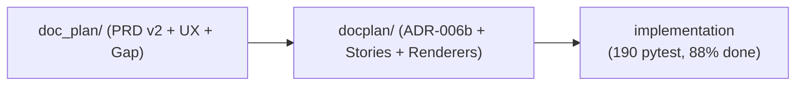

# مقترح بنية أنظمة لغة ص

> **🔄 تحديث 2026-05-30 (بعد الفحص العميق — قسم 1.5):**
> - **`eroor_system/`** نسخة طبق الأصل (SHA-256 مُطابق لـ `error_system/README.md`) → **حذف آمن**.
> - **`doc_plan/`** ليس مكرَّراً لـ `docplan/` — هو **طبقة معلوماتية مكمِّلة** تحوي PRD v2 + UX + gap analysis + party session غير موجودة في `docplan/`.
> - **🔒 سياسة جديدة (2026-05-30 — أمر المستخدم):** **لا دمج لمحتوى `doc_plan/` و `docplan/`**. يُنقل كل مجلد **كما هو** إلى `systems/` تحت اسمين منفصلين. الدمج يحتاج **جلسة منفردة بتفاصيل دقيقة** ومراجعة PM لاحقاً (انظر §4.5).

## 1. المشكلة

حالياً وثائق الأنظمة الفرعية للغة ص **مبعثرة على جذر `_bmad-output/`** بدون نمط موحَّد:

```text
_bmad-output/
├── error_system/          ← نظام رسائل الأخطاء (PRD + 5 stories + tech-spec)
├── eroor_system/          ← 🔴 خطأ إملائي + نسخة قديمة لـREADME (مكرَّر)
├── type_system/           ← نظام الأنواع (audit + architecture + party_round2)
├── docplan/               ← نظام التوثيق (DocIR + 5 renderers)
├── doc_plan/              ← 🟡 نسخة قديمة / مكرَّر بـ underscore
├── planning-artifacts/
│   └── sadinfo/           ← نظام معلومات اللغة (sadinfo v2) — مدفون تحت "planning"
├── stories/               ← قصص متفرقة (بعضها لأنظمة بعينها)
└── …
```

### المشاكل الملموسة

| # | المشكلة | الأثر |
|---|---|---|
| P1 | لا يوجد مكان قياسي لإضافة "نظام جديد" | كل مهندس يخترع تنظيمه |
| P2 | مكرَّرات إملائية (`eroor_system`، `doc_plan`) دون حذف | إرباك + روابط مكسورة محتملة |
| P3 | `sadinfo` مدفون تحت `planning-artifacts/` رغم أنه نظام رئيسي | اكتشاف صعب |
| P4 | لا قالب موحَّد لـ PRD/Architecture/Stories/Status | كل نظام بتسمية ملفات مختلفة |
| P5 | لا فهرس واحد لكل الأنظمة | يجب فحص الجذر يدوياً |
| P6 | تداخل مفاهيمي مع `governance/3-code-contract/` (هل SAD_INVARIANT نظام أم عقد؟) | غير محسوم |

---

## 1.5. الفحص العميق لـ `doc_plan/` vs `docplan/` (2026-05-30)

> هذا القسم أُضيف **بعد ملاحظة المستخدم** أن `doc_plan/` قد يكون طبقة مكمِّلة لا مكرَّر.
> الفحص أكَّد ذلك — فيما يلي الدليل.

### الجرد الكامل

| المجلد | عدد الملفات | المحتوى الرئيسي | الحقبة |
|---|---|---|---|
| `docplan/` | 23 ملف | **DocIR + Renderers** — 7 ADRs (006a/006b/007/008)، 11 stories (1.4 → utm-6.7)، ARCHITECTURE_MAP، DOC_FLOW_REALITY، YAML_UNIFIED_SCHEMA_DESIGN، REVIEW-2026-05-19، session-002، error_system/ADR-DOC-STD، sadinfo/SADINFO_TARGET_ARCHITECTURE | 2026-07 → 2026-05-29 (نشط) |
| `doc_plan/` | 13 ملف في 9 مجلدات مرقَّمة | **PRD v2 لنظام التوثيق الحي** (11 يوم عمل) — 01_prd, 02_architecture, 03_epics_stories (4 stories لـStory 1.2), 04_gap_analysis, 05_ux (مكوّنات Vue), 06_testing, 07_party_sessions, 99_arabic_misc | 2026-05-09 (سابق زمنياً) |

### المحتوى الفريد في `doc_plan/` (غير موجود في `docplan/`)

| الملف الفريد | الأهمية |
|---|---|
| `01_prd/prd-docs-system-v2.md` | 🟢 PRD رسمي بـ 11 يوم عمل، يُعرّف العلاقة بـ`C:\s_lang\website` ويربط `docs_emitter.h` بـ`sadinfo.exe` — **سياق تأسيسي لكل ADR-006b** |
| `02_architecture/architecture-docs-system-v2.md` | 🟢 معمارية v2 (sadinfo → JSON/YAML → MkDocs/LSP) — يكمل ARCHITECTURE_MAP |
| `03_epics_stories/story-1.2-detailed-plan.md` + `-v2.md` + `-agent-party-review.md` | 🟢 ثلاث وثائق تفصيل لـStory 1.2 — مفقودة من `docplan/stories/` |
| `04_gap_analysis/gap-analysis-docs-system-v2.md` | 🟢 تحليل فجوات مرجعي — لا مكافئ له في `docplan/` |
| `05_ux/ux-docs-system.md` + `ux-review-vue-components.md` | 🟢 موصافات UX ومراجعة مكوّنات Vue — مفقودة كلياً من `docplan/` |
| `06_testing/test-plan-docs-1.1-sadinfo-skeleton.md` | 🟢 خطة اختبار Story 1.1 (sadinfo skeleton) |
| `07_party_sessions/2026-05-09_documentation_system.md` | 🟢 جلسة party-mode تأسيسية بتاريخ 9 مايو 2026 |
| `99_arabic_misc/معمارية_توثيق_لغة_ص.md` | 🟡 ملف عربي تاريخي |

### الخلاصة

`doc_plan/` و `docplan/` **يخدمان نفس النظام (التوثيق)** لكن **بمحتوى مختلف وقيِّم في كليهما**:



`doc_plan/` يُمثِّل **مرحلة التخطيط الأوَّلية** (PRD/UX/gap)، و`docplan/` يُمثِّل **مرحلة التنفيذ المعمارية** (ADRs/stories/renderers). الاثنان معاً يُشكلان **سجل النظام الكامل**.

### القرار

عند المهاجرة لـ`systems/`: **يُنقل كل مجلد كما هو** إلى اسم منفصل تحت `systems/`، **دون أي دمج لمحتواهما**. الدمج (إن قُرِّر مستقبلاً) يحتاج جلسة مخصصة بمشاركة PM/Winston/Sally. التفاصيل في §4.5.

---

## 2. المبادئ الموجِّهة

1. **نظام واحد = مجلد واحد** تحت `systems/` بتسمية kebab-case إنجليزية (مفهرسة + قابلة للبحث).
2. **بنية داخلية موحَّدة** لكل نظام (template واحد) — يقلل العبء المعرفي.
3. **فهرس حي** (`systems/README.md`) يعرض حالة كل نظام في جدول واحد.
4. **فصل واضح عن الحوكمة:** `governance/` = القواعد الإدارية. `systems/` = المنتجات الهندسية.
5. **تطور تدريجي (incremental migration):** لا نكسر روابط موجودة دفعةً واحدة — نُوحِّد على دفعات مع `archive/`.
6. **اسم عربي + اسم تقني:** المجلد بالإنجليزية (للأدوات/CI)، الـREADME يُعرض الاسم العربي.

---

## 3. البنية المقترحة

```text
_bmad-output/
├── systems/
│   ├── README.md                          ← فهرس حي لكل الأنظمة + جدول حالات
│   ├── _TEMPLATE/                         ← قالب لأي نظام جديد (نسخ + استبدال)
│   │   ├── README.md
│   │   ├── prd.md
│   │   ├── architecture.md
│   │   ├── implementation_status.md
│   │   ├── stories/
│   │   │   └── _TEMPLATE-STORY.md
│   │   └── decisions/
│   │       └── ADR-000-template.md
│   │
│   ├── error-messages/                    ← (نظام رسائل الأخطاء) — من error_system/
│   │   ├── README.md
│   │   ├── prd.md                         ← prd-error-messages.md
│   │   ├── epic.md                        ← epic-error-messages.md
│   │   ├── tech-spec.md                   ← tech-spec-error-messages.md
│   │   ├── implementation_status.md       ← جديد (يحل محل أحدث ADR)
│   │   ├── stories/
│   │   │   ├── EM-1-extract-sot.md
│   │   │   ├── EM-2-generator.md
│   │   │   ├── EM-3-integration.md
│   │   │   ├── EM-4-verification.md
│   │   │   └── EM-5-sadinfo.md
│   │   └── decisions/
│   │       ├── ADR-001-yaml-migration.md  ← error_messages_yaml_migration.md
│   │       └── ADR-002-alignment-docplan.md ← _alignment_with_docplan.md
│   │
│   ├── type-system/                       ← من type_system/
│   │   ├── README.md                      ← 00_README.md
│   │   ├── prd.md                         ← (يُستخرج من 01_audit + 03_architecture)
│   │   ├── architecture.md                ← 03_architecture.md
│   │   ├── audit.md                       ← 01_audit.md
│   │   ├── canonical-names.md             ← 02_canonical_names.md
│   │   ├── quality-gates.md               ← 05_quality_gates.md
│   │   ├── implementation_status.md       ← جديد
│   │   ├── stories/                       ← من 04_stories.md (يُقسَّم لقصص فردية)
│   │   └── reviews/
│   │       └── 2026-XX-XX-party-round2/   ← party_round2/* (تواريخية)
│   │
│   ├── doc-ir/                            ← من docplan/ (ADR-006a/006b + 11 stories + renderers) — نقل كما هو
│   │   ├── (محتويات docplan/ بكاملها، مع إعادة تنظيم داخلية لاحقاً اختياري)
│   │   └── …
│   │
│   ├── doc-plan-v2/                       ← من doc_plan/ (PRD v2 + UX + gap + party) — نقل كما هو
│   │   ├── (محتويات doc_plan/ بكاملها، 9 مجلدات مرقَّمة + INDEX.md)
│   │   └── …
│   │   ⚠️ ملاحظة: قرار دمجه مع doc-ir/ مؤجَّل لجلسة منفردة (§4.5)
│   │
│   ├── sadinfo/                           ← من planning-artifacts/sadinfo/
│   │   ├── README.md
│   │   ├── prd.md
│   │   ├── architecture.md
│   │   ├── sprint-plan.md
│   │   ├── implementation_status.md
│   │   └── stories/                       ← S-001 … S-007
│   │
│   └── error-recovery/                    ← (إن لزم لاحقاً) recovery من 2026-05-29
│       └── …
│
├── governance/                            ← (موجود — بدون تغيير)
├── archive/                               ← (موجود — يستقبل دفعات المهاجرة)
│   ├── 2026-05-30-governance-unification/ ← (موجود)
│   └── 2026-XX-XX-systems-unification/    ← (مستقبلاً)
└── …
```

### قواعد التسمية الداخلية لكل نظام

| الملف | إلزامي؟ | الغرض |
|---|---|---|
| `README.md` | ✅ | اسم النظام، مالكه، الحالة، روابط سريعة |
| `prd.md` | ✅ | متطلبات المنتج (يكتبه John/PM) |
| `architecture.md` | ✅ | قرار التصميم (يكتبه Winston/Architect) |
| `implementation_status.md` | ✅ | الحالة الفعلية + النسب (تحديث دوري) |
| `epic.md` أو `epics.md` | اختياري | تقسيم المهام الكبيرة |
| `tech-spec.md` | اختياري | تفاصيل تنفيذ عميقة (يكتبه Amelia/Dev) |
| `sprint-plan.md` | اختياري | للأنظمة تحت تنفيذ نشط |
| `stories/<ID>-<slug>.md` | ✅ | قصة واحدة لكل ملف (لا تجمع في 04_stories.md) |
| `decisions/ADR-NNN-<slug>.md` | اختياري | قرارات معمارية مرقَّمة |
| `reviews/YYYY-MM-DD-<topic>.md` | اختياري | مراجعات تاريخية مؤرَّخة |

---

## 4. فهرس الأنظمة المقترح (`systems/README.md`)

```markdown
# أنظمة لغة ص — الفهرس الرئيسي

| النظام (عربي) | المجلد | الحالة | النسبة | المالك |
|---|---|---|---|---|
| نظام رسائل الأخطاء | [error-messages/](error-messages/) | 🟡 PRD مُكتمل، التنفيذ لم يبدأ | 0% | TBD |
| نظام الأنواع | [type-system/](type-system/) | 🟢 معماري + قصص جاهزة | 25% | TBD |
| نظام التوثيق (DocIR) | [doc-ir/](doc-ir/) | 🟢 منتج فعلي (ADR-006b) | 88% | TBD |
| تخطيط التوثيق v2 (مرجع PRD) | [doc-plan-v2/](doc-plan-v2/) | 📚 سياق تأسيسي (PRD + UX + gap) | — (مرجع) | TBD |
| نظام معلومات اللغة | [sadinfo/](sadinfo/) | 🟢 تحت تنفيذ نشط | 60% (S-001..S-007 ✅) | TBD |
| استرداد الأخطاء (Recovery) | [error-recovery/](error-recovery/) | 🔴 لم يبدأ توثيقه | 0% | TBD |

> 🔗 **انظر أيضاً:** [governance/3-code-contract/](../governance/3-code-contract/) — نظام Contract-as-Code/SAD_INVARIANT (يبقى تحت الحوكمة لأنه أداة فرض، ليس منتج لغة).
```

---

## 5. خطة المهاجرة (4 مراحل آمنة)

### Phase 1 — إنشاء الهيكل (لا حذف للأنظمة النشطة)
1. أنشئ `systems/_TEMPLATE/` بكل القوالب الفارغة.
2. أنشئ `systems/README.md` بالفهرس (يُشير للمجلدات القديمة مؤقتاً).
3. **حذف آمن لـ `eroor_system/`** (نسخة طبق الأصل — تأكيد SHA-256 في §1.5).
4. **`doc_plan/` يُبقى كما هو** في Phase 1 — سيُدمج في `systems/doc-ir/` خلال Phase 3 (انظر §4.5).

### Phase 2 — نقل النظام الأبسط أولاً (error-messages)
- `git mv` (أو `Move-Item` إن كان untracked) من `error_system/` إلى `systems/error-messages/` + إعادة تسمية الملفات حسب القواعد.
- استبدال جماعي للروابط في المشروع كله.
- التحقق: `grep -r "_bmad-output/error_system"` → 0.

### Phase 3 — نقل بقية الأنظمة (دفعة واحدة بعد ثبات Phase 2)
- `type_system/` → `systems/type-system/` (نقل كما هو)
- `docplan/` → `systems/doc-ir/` (**نقل كما هو** — لا دمج)
- `doc_plan/` → `systems/doc-plan-v2/` (**نقل كما هو** — لا دمج مع doc-ir)
- `planning-artifacts/sadinfo/` → `systems/sadinfo/` (نقل كما هو)

> ⚠️ **قرار صريح:** لا يحدث دمج لمحتوى أي نظامين في Phase 3. كل مجلد يُنقل بمسار `Move-Item` واحد (محافظاً على بنيته الداخلية وأسماء ملفاته)، ثم يُحدَّث الفهرس فقط.

### Phase 4 — أرشفة + تحديث STATUS.md
- نقل الوثائق التاريخية إلى `archive/2026-XX-XX-systems-unification/`.
- تحديث `STATUS.md` ليُشير للمسارات الجديدة.
- إضافة سجل في `_bmad-output/README.md` §7 (Change Log).

---

### 4.5. سياسة `doc_plan/` + `docplan/` — نقل منفصل، دمج مؤجَّل (2026-05-30)

> **🔒 القرار النهائي (بناءً على أمر المستخدم 2026-05-30):**
> **لا يُدمج محتوى المجلدين**. كل واحد يُنقل **كما هو** إلى `systems/`، محافظاً على:
> - أسماء ملفاته الأصلية
> - بنيته الداخلية (مجلدات مرقَّمة في `doc_plan/`، ملفات مسطَّحة في `docplan/`)
> - تاريخ git (عبر `git mv` إن كانت متتبَّعة، أو `Move-Item` إن لا)

#### النقل المنفصل

| المصدر | الوجهة | طريقة النقل | الناتج |
|---|---|---|---|
| `_bmad-output/docplan/` | `_bmad-output/systems/doc-ir/` | `Move-Item docplan systems/doc-ir` | 23 ملف منقول، بنية مسطَّحة محفوظة |
| `_bmad-output/doc_plan/` | `_bmad-output/systems/doc-plan-v2/` | `Move-Item doc_plan systems/doc-plan-v2` | 13 ملف في 9 مجلدات مرقَّمة، محفوظة كاملة |

#### لماذا التأجيل؟

| السبب | التفصيل |
|---|---|
| 🎯 **دقَّة الدمج تتطلب خبرة متعددة** | الدمج يحتاج PM (تحديد أيُّ PRD يبقى) + Winston (المعمارية) + Sally (UX) + Murat (الاختبارات) — ليس قراراً منفرداً |
| 🛡️ **منع فقد سياق** | بعض ملفات `doc_plan/` (party session 2026-05-09، UX review، gap analysis) قد تكون مرجع لقرارات لاحقة في `docplan/` — الدمج بدون فهم العلاقات يُضيع السياق |
| 📊 **يستحق جلسة مخصصة** | يجب جدولة "جلسة دمج DocIR" لاحقاً (party-mode محتمل) — ليس مهمة مهاجرة |
| 🚦 **مبدأ الدفعات الصغيرة** | كل phase يجب أن يكون قابلاً للتراجع. الدمج عملية معقدة تُؤجَّل لتقليل مخاطر Phase 3 |
| 🧪 **يحفظ القدرة على المقارنة** | إبقاء المجلدين منفصلين يسمح بـ`diff` بصري ومقارنة لاحقة |

#### الجلسة المؤجَّلة (TODO مستقبلي)

عندما يحين الوقت لمناقشة الدمج (مهمة منفصلة):
1. **جرد كامل** لكل ملف في كليهما (موجود في §1.5).
2. **خرائط تبعية**: أيُّ ملف يُشار إليه من ملف آخر؟ من خارج المجلدين؟
3. **حوار متعدد الأدوار**: PM/Architect/UX يتفقون على البنية النهائية الموحَّدة.
4. **إنتاج وثيقة `DOC_IR_MERGE_PLAN.md`** قبل أي حركة فعلية.
5. **مراجعة Amelia + Murat** للخطة قبل التنفيذ.

> حتى تنعقد تلك الجلسة، `systems/doc-ir/` و `systems/doc-plan-v2/` **يتعايشان كنظامين منفصلين** في الفهرس.

---

## 6. الفوائد المتوقَّعة

| الفائدة | كيف؟ |
|---|---|
| **اكتشاف فوري** | `ls _bmad-output/systems/` يعرض كل الأنظمة |
| **توسُّع منضبط** | نسخ `_TEMPLATE/` لإنشاء نظام جديد في 30 ثانية |
| **بحث أسهل** | `grep -r "..." _bmad-output/systems/` يفصل النظام عن الحوكمة |
| **تقارير حالة موحَّدة** | `implementation_status.md` بنفس البنية في كل نظام |
| **CODEOWNERS منضبط** | `_bmad-output/systems/error-messages/ @team-errors` |
| **حذف المكرَّرات** | `eroor_system`, `doc_plan` تختفيان |

---

## 7. المخاطر والاعتبارات

| الخطر | التخفيف |
|---|---|
| كسر روابط في وثائق/CI | استبدال جماعي + فحص grep قبل/بعد كل phase |
| تشتُّت Git history | استخدام `git mv` لكل ملف متتبَّع (يحفظ blame) |
| تداخل مع `governance/3-code-contract/` | قرار صريح: SAD_INVARIANT يبقى تحت الحوكمة (أداة فرض، ليس نظام لغة) |
| ضياع الوثائق التاريخية | نقل إلى `archive/` بـ README يوضح السياق |
| المقاومة من فرق أخرى | إعلان مسبق + phases صغيرة قابلة للتراجع |

---

## 8. قرار محسوم: ما لا يُنقل لـ `systems/`

| المجلد/الملف | لماذا يبقى في مكانه؟ |
|---|---|
| `governance/3-code-contract/` | أداة فرض (Contract-as-Code) — تخدم كل الأنظمة، ليست نظاماً منفصلاً |
| `discovery/` | اكتشافات أولية متعددة الأنظمة — متقاطعة |
| `stories/` (الجذر) | قصص متفرقة قبل التصنيف — تُنقل لنظامها عند الاكتشاف |
| `implementation-artifacts/` | مخرجات بناء متعددة الأنظمة |
| `test-artifacts/` | تقارير اختبار متعددة الأنظمة |
| `party-sessions/`, `agents/` (لا توجد الآن) | جلسات معمارية متقاطعة |
| `planning-artifacts/` (ما عدا sadinfo) | خطط تاريخية تُؤرشَف لاحقاً |

---

## 9. قائمة تحقُّق للموافقة

- [ ] هل تسميات الإنجليزية مقبولة؟ (kebab-case)
- [ ] هل المجلدات الستة (error-messages, type-system, doc-ir, **doc-plan-v2**, sadinfo, error-recovery) كافية للبدء؟
- [ ] هل قرار إبقاء `3-code-contract` في `governance/` صحيح؟
- [ ] هل **سياسة عدم الدمج** بين `doc_plan/` و `docplan/` (نقل منفصل، دمج مؤجَّل لجلسة منفردة) في §4.5 مقبولة؟
- [ ] هل نبدأ بـ Phase 1 فوراً (إنشاء الهيكل + حذف `eroor_system/` فقط)، أم نناقش البنية أولاً؟

---

**الخطوة التالية بعد الموافقة:** تنفيذ Phase 1 (إنشاء الهيكل + حذف مكرَّر `eroor_system` **فقط**). `doc_plan/` و `docplan/` يبقيان في مكانهما حتى Phase 3 (نقل منفصل بـ`Move-Item` بدون دمج).

**المؤلف:** Amelia (bmad-agent-dev)
**التاريخ:** 2026-05-30
