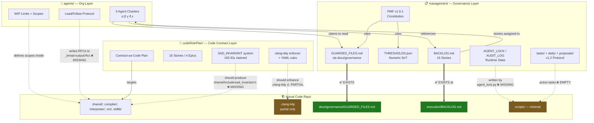
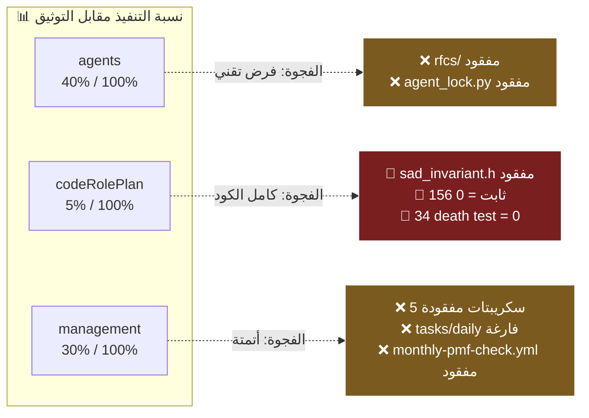

# 🔬 مقارنة عميقة: ثلاثة أنظمة، ثلاث طبقات، تداخل واحد

> **سؤال المستخدم:** هل الأنظمة الثلاثة `agents/` و `codeRolePlan/` و `management/` مكتوبة مرتين؟
> **الإجابة المختصرة:** **لا — هي ثلاث طبقات مختلفة لنفس المشكلة**، لكنها تتداخل في 3 نقاط حرجة، ونسبة التنفيذ الفعلي تتفاوت بشكل صارخ (من 100% إلى 0%).

---

## 1) الفرق الجوهري في سطر واحد لكل نظام

| النظام | الطبقة | يجيب على السؤال | الأداة |
|---|---|---|---|
| **`agents/`** | **تنظيمي / Org** | *من* يفعل ماذا؟ (تقسيم العمل البشري بين 5 وكلاء AI) | مواثيق نطاق (Charters) |
| **`codeRolePlan/`** | **تقني / Code** | *كيف* نُجبر الكود نفسه على احترام العقد؟ | Contract-as-Code (`SAD_INVARIANT` + clang-tidy + YAML enforcer) |
| **`management/`** | **حوكمي / Governance** | *متى* و *بأي قواعد* يحق لأي شخص (وكيل أو إنسان) أن يلمس الكود؟ | PMF v1.9.1 (عتبات + طوارئ + audit log + sprint) |

> **التشبيه:** `agents` = الهيكل التنظيمي للشركة. `codeRolePlan` = نظام مراقبة الجودة في خط الإنتاج. `management` = القانون التجاري الذي ينظم كل شيء.

---

## 2) النظام الأول: `agents/` — التنظيم البشري

### 2.1 الغرض الموثَّق
تقسيم نطاقات الكتابة بين 5 وكلاء AI متوازين (α, β, γ, δ, ε) لمنع تعارضات Git ومنع الازدواجية، مع تحديد WIP وملفات محروسة.

### 2.2 الملفات الفعلية
- [_bmad-output/agents/README.md](_bmad-output/agents/README.md) — جدول النطاقات + ربط BACKLOG
- [_bmad-output/agents/agent_alpha.md](_bmad-output/agents/agent_alpha.md) — Frontend (`shared/`)
- [_bmad-output/agents/agent_beta.md](_bmad-output/agents/agent_beta.md) — Runtime (`interpreter/`+`vm/`+`runtime/`)
- [_bmad-output/agents/agent_gamma.md](_bmad-output/agents/agent_gamma.md) — Compiler (`compiler/`)
- [_bmad-output/agents/agent_delta.md](_bmad-output/agents/agent_delta.md) — Ecosystem (`stdlib/`+`tools/`+`tests/`)
- [_bmad-output/agents/agent_epsilon.md](_bmad-output/agents/agent_epsilon.md) — Domain Libs

### 2.3 نسبة التنفيذ الفعلي على الكود: **~40% — وثائق فقط، آلية الفرض غائبة**

| ادعاء | الواقع | الدليل |
|---|---|---|
| 5 مواثيق وكلاء موجودة | ✅ موجودة | `list_dir _bmad-output/agents` يُرجع 6 ملفات |
| ربط BACKLOG بالوكلاء (B-001..B-013) | ⚠️ BACKLOG موجود لكن في مسار مختلف | `_bmad-output/management/BACKLOG.md` **غير موجود**؛ الموجود فعلياً [_bmad-output/management/execution/BACKLOG.md](_bmad-output/management/execution/BACKLOG.md) (الأسطر 55–158 تحوي B-001..B-015) |
| `docs/governance/GUARDED_FILES.md` | ✅ موجود | [docs/governance/GUARDED_FILES.md](docs/governance/GUARDED_FILES.md) |
| RFCs في `_bmad-output/rfcs/` | 🔴 **المجلد غير موجود** | `Test-Path _bmad-output/rfcs` = False |
| فرض تقني لنطاق كل وكيل | 🔴 **لا يوجد** | لا hooks، لا CODEOWNERS مفصَّل، لا CI check |
| `agent_lock.py` (الذكر في README) | 🔴 **غير موجود** | `Get-ChildItem scripts -Recurse -Filter agent_lock.py` فارغ |

**الخلاصة:** نموذج تنظيمي ممتاز نظرياً، لكنه **شَرَفي 100%** — لا يوجد شيء يمنع وكيلاً من الكتابة خارج نطاقه. يعتمد على ضمير الوكيل + المراجعة البشرية.

---

## 3) النظام الثاني: `codeRolePlan/` — العقد كرمز

### 3.1 الغرض الموثَّق
تحويل قواعد الكود (CW-01..CW-30 + 156 ثابت معماري) إلى آلية فرض تقنية تكسر `cmake configure` عند المخالفة.

### 3.2 الملفات الفعلية
- [_bmad-output/codeRolePlan/contract-as-code-plan.md](_bmad-output/codeRolePlan/contract-as-code-plan.md) — تحليل المشكلة + Five Whys
- [_bmad-output/codeRolePlan/prd.md](_bmad-output/codeRolePlan/prd.md) — متطلبات المنتج
- [_bmad-output/codeRolePlan/epics.md](_bmad-output/codeRolePlan/epics.md) — 4 ملاحم، 16 قصة
- [_bmad-output/codeRolePlan/implementation_status.md](_bmad-output/codeRolePlan/implementation_status.md) — يدّعي 63% + 156 ثابت + 34 death tests

### 3.3 نسبة التنفيذ الفعلي على الكود: **~5% — انحراف كارثي**

| الادعاء في `implementation_status.md` | الواقع المُتحقَّق منه | الدليل |
|---|---|---|
| `shared/include/sad_invariant.h` موجود (Story 2.1) | 🔴 **غير موجود** | `Get-ChildItem -Recurse -Filter sad_invariant.h` لا يُرجع شيئاً |
| `shared/src/sad_invariant.cpp` موجود | 🔴 **غير موجود** | بحث شامل = فارغ |
| 156 ثابت INT001–INT156 | 🔴 **0 ثوابت في الكود** | `grep -r "SAD_INVARIANT_DEF"` = فارغ |
| 34 death tests يمر | 🔴 **لا يوجد death tests** | `grep "__test_invariant"` = فارغ |
| `scripts/lint/check_invariants.py` | 🔴 **غير موجود** | الملف غير موجود؛ مجلد `scripts/lint/` غير موجود |
| Story 1.1: `.clang-tidy` يفعّل `reinterpret-cast` | 🔴 **غير مُفعَّل** | [.clang-tidy](.clang-tidy) أسطر 14–15: فقط `cppcoreguidelines-init-variables` و `pro-type-member-init`. **لا ذكر** لـ `reinterpret-cast` |
| Story 1.2: `expression_evaluator_ui.cpp` يستخدم `arabicNameToNodeType` | ❓ يحتاج تحقق منفصل | الملف موجود لكن لم أُؤكّد الإصلاح |
| المُرشَّحون موجودون في `_recovered/` | ✅ صحيح | [_recovered/sad_invariant_h_candidates/](_recovered/sad_invariant_h_candidates/) موجود |

**الخلاصة:** `codeRolePlan` **خطة ممتازة لم تُنفَّذ**. التقرير يدّعي 63% إنجاز للخطة الأصلية + 156 ثابت — والواقع أن **الكود لا يحوي سطراً واحداً منها**. هذا يطابق نمط ADR-006a المعروف (وثائق مُتقدّمة على الكود).

> 🚨 **هذا هو الانحراف الأكبر في `_bmad-output/` بأكمله** — وسببه على الأغلب أن `sad_invariant.h` كان موجوداً سابقاً ثم حُذف/فُقد بإعادة هيكلة (لذلك يوجد مرشحون في `_recovered/`).

---

## 4) النظام الثالث: `management/` — الحوكمة

### 4.1 الغرض الموثَّق
دستور تشغيلي شامل (PMF v1.9.1) ينظّم: القرارات، العتبات الرقمية، الطوارئ، طبقة التنفيذ (TOC)، بروتوكول الوكلاء v1.2، سجل تدقيق دائم.

### 4.2 الملفات الفعلية (17 ملف جذري + 5 مجلدات)
- **دستوري:** [PROJECT_MANAGEMENT_FRAMEWORK.md](_bmad-output/management/PROJECT_MANAGEMENT_FRAMEWORK.md)
- **مرجعي:** [PRD.md](_bmad-output/management/PRD.md), [ARCHITECTURE.md](_bmad-output/management/ARCHITECTURE.md), [LAYERS.json](_bmad-output/management/LAYERS.json), [THRESHOLDS.json](_bmad-output/management/THRESHOLDS.json), [EDGE_CASE_GUARDS.md](_bmad-output/management/EDGE_CASE_GUARDS.md)
- **تنفيذ:** [execution/ROADMAP.md](_bmad-output/management/execution/ROADMAP.md), [execution/BACKLOG.md](_bmad-output/management/execution/BACKLOG.md), [execution/SPRINT_CURRENT.md](_bmad-output/management/execution/SPRINT_CURRENT.md)
- **مراجعات عدائية:** 4 ملفات CRITIQUE_*
- **وقت تشغيل:** [AGENT_LOCK.json](_bmad-output/management/AGENT_LOCK.json), [AUDIT_LOG.jsonl](_bmad-output/management/AUDIT_LOG.jsonl), [EMERGENCY_OVERRIDES.jsonl](_bmad-output/management/EMERGENCY_OVERRIDES.jsonl)
- **بروتوكول v1.2:** [PM_REPORT_AND_AGENT_PROTOCOL.md](_bmad-output/management/PM_REPORT_AND_AGENT_PROTOCOL.md) + [tasks/active/](_bmad-output/management/tasks/active) + [proposals/](_bmad-output/management/proposals) + [memory-drafts/](_bmad-output/management/memory-drafts) + [daily/](_bmad-output/management/daily) + [templates/](_bmad-output/management/templates)

### 4.3 نسبة التنفيذ الفعلي على الكود: **~30% — وثائق ممتازة، أتمتة منعدمة**

| ادعاء README.md في management | الواقع | الدليل |
|---|---|---|
| 17 ملف جذري | ✅ مطابق | `list_dir` يُرجع 17 ملف |
| مجلد `execution/` كامل (ROADMAP+BACKLOG+SPRINT) | ✅ مطابق | 3 ملفات حاضرة |
| `tasks/active/` يحوي مهام نشطة | 🔴 **فارغ — فقط README** | `Get-ChildItem tasks/active` = `README.md` فقط |
| `tasks/done/` يحوي مهام منجزة | 🔴 **فارغ — فقط README** | نفس الأمر |
| `daily/YYYY-MM-DD.md` للتنسيق اليومي | 🔴 **فارغ — فقط README** | لا ملفات يومية فعلية |
| `proposals/` ADRs | ❓ غير مفحوص | يحتاج probe منفصل |
| `memory-drafts/` | ❓ غير مفحوص | — |
| السكريبتات المذكورة (`agent_lock.py`, `verify_thresholds_consistency.py`, `scan_layers.py`, `check_arabic_ratio.py`, `thresholds_loader.py`) | 🔴 **جميعها غير موجودة** | `scripts/` يحوي فقط: `codegen/`, `build_*.ps1/sh`, `validate_schemas.py`, `feature_coverage.py`, `enforce-gpg-protection.ps1`, `measure_*.ps1`, `publish_*.ps1`, `setup_android_*.sh`, `split_*.ps1` |
| Workflow `monthly-pmf-check.yml` | 🔴 **غير موجود** | `Get-ChildItem .github/workflows -Filter *pmf*` فارغ |
| `BACKLOG.md` في جذر `management/` (مذكور في `agents/README.md`) | 🔴 **غير موجود** | `Test-Path _bmad-output/management/BACKLOG.md` = False؛ المسار الصحيح هو `execution/BACKLOG.md` |
| `AGENT_LOCK.json` و `AUDIT_LOG.jsonl` و `EMERGENCY_OVERRIDES.jsonl` كمنتجات للسكريبتات | ⚠️ الملفات موجودة، لكن السكريبتات الكاتبة لها غير موجودة | هذا يعني أن الحالة "مُخلَّقة يدوياً" أو متوقفة |
| BACKLOG حقيقي بـ 15 ستوري | ✅ مطابق | [execution/BACKLOG.md](_bmad-output/management/execution/BACKLOG.md) يحوي B-001..B-015 (الأسطر 55, 62, 73, 80, 87, 94, 101, 108, 118, 124, 130, 136, 142, 152, 158) |

**الخلاصة:** بنية حوكمة دستورية مفصَّلة على الورق، **لكن طبقة الأتمتة (السكريبتات + CI) المُفترضة لتطبيقها = صفر**. النموذج "بوليس بدون شرطة".

---

## 5) التداخل الفعلي بين الأنظمة الثلاثة (الأنظمة ليست مكررة)

### 5.1 نقاط التداخل المشروعة (ليست تكراراً)

| نقطة التداخل | `agents` | `codeRolePlan` | `management` | لماذا ليس تكراراً |
|---|---|---|---|---|
| **BACKLOG** | يستهلكه (B-001..B-013) | لا علاقة مباشرة | يملكه (15 ستوري) | كل وكيل يأخذ ستورياته من المصدر الواحد |
| **GUARDED_FILES** | يحترمها (يذكرها في كل ميثاق) | لا علاقة | تحدّدها (عبر `docs/governance/`) | تعريف الملفات الحساسة مكان واحد، استهلاكها بأماكن متعددة |
| **SAD_INVARIANT** | لا علاقة | يُصمّمه ويصنّفه (156 ID) | يستفيد منه عبر THRESHOLDS | تصميم تقني ≠ سياسة حوكمية |
| **Sprint/تنفيذ** | يحدّد سعة الوكيل (WIP) | لا علاقة | يحدد ما يُنفَّذ هذا الأسبوع | الإيقاع (متى) مختلف عن السعة (كم) |
| **Audit** | لا يكتب audit | لا علاقة | يملك `AUDIT_LOG.jsonl` | كل قرار حوكمي يُسجَّل مرة واحدة فقط |

### 5.2 نقاط الانفصال الواضحة

- `agents/` لا يحوي قواعد كود (ذلك من اختصاص `codeRolePlan` + `copilot-instructions.md`)
- `codeRolePlan/` لا يحوي تنظيماً بشرياً ولا سياسات إدارة (ذلك من اختصاص `agents` + `management`)
- `management/` لا يحدد كيف يُكتب C++ (ذلك من اختصاص `codeRolePlan` + `copilot-instructions.md`)

---

## 6) جدول النتيجة النهائي

| النظام | نسبة وثائق | نسبة تنفيذ فعلي | الفجوة | الأولوية |
|---|---|---|---|---|
| **`agents/`** | 100% | ~40% (وثائق فقط، لا فرض تقني) | لا CODEOWNERS، لا `rfcs/`, لا `agent_lock.py` | 🟡 P1 |
| **`codeRolePlan/`** | 100% | **~5%** (الكود مفقود تماماً) | لا `sad_invariant.h`، لا 156 ثابت، لا death tests، لا enforcer | 🔴 **P0** |
| **`management/`** | 100% | ~30% (وثائق + ملفات حالة فارغة + لا سكريبتات) | tasks فارغة، daily فارغة، 5 سكريبتات مفقودة، workflow مفقود | 🟡 P1 |

### 6.1 ترجمة بصرية

---

## 7) إجابة السؤال الأصلي

> **هل الأنظمة الثلاثة مكتوبة مرتين؟**

**لا.** هي **ثلاث طبقات منفصلة منطقياً** مع 4 نقاط ربط مشروعة:
1. `agents` يستهلك `BACKLOG` المملوك لـ `management`
2. `agents` يحترم `GUARDED_FILES` المعرَّف في `docs/governance/`
3. `codeRolePlan` ينتج آلية تقنية يستفيد منها `management` عبر `THRESHOLDS.json`
4. ثلاثتها تعتمد على `copilot-instructions.md` كعقد أساسي

**التداخل الوهمي** الذي قد يبدو ازدواجية ينحصر في:
- ذكر BACKLOG في وثيقتين (`agents/README.md` و `management/execution/BACKLOG.md`) — هذا **مرجع وليس تكرار**.
- ذكر بروتوكول الوكلاء في مكانين (`agents/agent_*.md` و `management/PM_REPORT_AND_AGENT_PROTOCOL.md`) — هذا **منظور وكيل vs منظور PM**، وهما مكمّلان.

**المشكلة الحقيقية ليست التكرار** — المشكلة أن **الكود الفعلي متأخر جداً عن الوثائق** في الأنظمة الثلاثة، وأشدها `codeRolePlan` (الذي يدّعي 63% إنجاز بينما الواقع ~5%).

---

## 8) توصيات عاجلة (P0)

1. **استرداد `sad_invariant.h`** من [_recovered/sad_invariant_h_candidates/](_recovered/sad_invariant_h_candidates/) أو تحديث `codeRolePlan/implementation_status.md` ليعكس الواقع (0% بدلاً من 63%).
2. **إنشاء `_bmad-output/rfcs/`** أو إزالة الذكر من مواثيق الوكلاء.
3. **إنشاء `scripts/agent_lock.py` + `verify_thresholds_consistency.py`** أو إضافة قسم "Manual Process" في `management/README.md` يشرح أن الحالة تُكتب يدوياً.
4. **إعادة توجيه** الرابط في `agents/README.md` من `management/BACKLOG.md` إلى `management/execution/BACKLOG.md` (broken link حالياً).

---

**المُحقِّق:** Amelia (bmad-agent-dev) — مبدأ "NEVER lie about tests" يُطبَّق هنا على "NEVER lie about implementation status".
**تاريخ التحقق:** 2026-05-29
**المنهجية:** فحص فعلي لـ 23+ ملف/مجلد عبر `Get-ChildItem`, `Select-String`, `Test-Path`, و `list_dir`.
