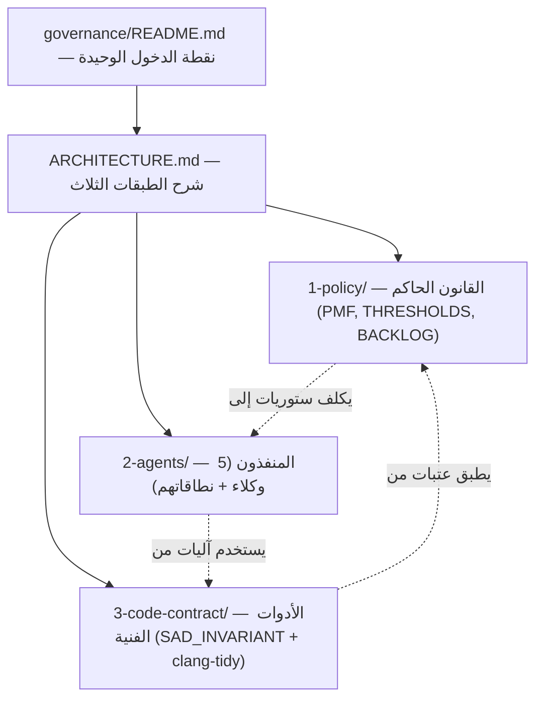

# 🏛️ اقتراح: مجلد موحَّد `governance/` بثلاث طبقات

> **المشكلة:** الأنظمة الثلاثة `agents/` + `codeRolePlan/` + `management/` تبدو منفصلة بصرياً في `_bmad-output/`، بينما هي **طبقات مترابطة لنظام حوكمة واحد**. المستخدمون الجدد يظنون أنها منتجات مستقلة.
>
> **الحل:** توحيدها تحت `_bmad-output/governance/` مع تسميات تكشف الطبقة فوراً، مع الحفاظ على كل الملفات والتاريخ.

---

## 1) الهيكل المقترح

```
_bmad-output/
├── governance/                          # 🏛️ النظام الموحَّد (الجديد)
│   ├── README.md                        # نقطة الدخول الموحَّدة + مخطط الطبقات
│   ├── ARCHITECTURE.md                  # شرح الطبقات الثلاث (policy/agents/code)
│   │
│   ├── 1-policy/                        # ⚖️ كان: management/  (Governance Layer)
│   │   ├── README.md
│   │   ├── PROJECT_MANAGEMENT_FRAMEWORK.md
│   │   ├── PRD.md
│   │   ├── ARCHITECTURE.md
│   │   ├── LAYERS.json
│   │   ├── THRESHOLDS.json
│   │   ├── EDGE_CASE_GUARDS.md
│   │   ├── PM_REPORT_AND_AGENT_PROTOCOL.md
│   │   ├── STORY-PMF-V17-ENFORCE-GPG.md
│   │   ├── STORY_ZERO_REPORT.md
│   │   ├── critiques/                   # كان: CRITIQUE_*.md ملفات متناثرة
│   │   │   ├── CRITIQUE_QUINN_2025-11-21.md
│   │   │   ├── CRITIQUE_MURAD_2026-05-22.md
│   │   │   ├── CRITIQUE_PENTESTER_2026-05-22.md
│   │   │   └── CRITIQUE_QUINN_2026-05-22.md
│   │   ├── runtime-state/               # كان: ملفات json/jsonl مختلطة بالوثائق
│   │   │   ├── AGENT_LOCK.json
│   │   │   ├── AUDIT_LOG.jsonl
│   │   │   └── EMERGENCY_OVERRIDES.jsonl
│   │   ├── execution/                   # يبقى كما هو
│   │   │   ├── ROADMAP.md
│   │   │   ├── BACKLOG.md               # ⚠️ هذا BACKLOG الوحيد المُعتمد
│   │   │   └── SPRINT_CURRENT.md
│   │   ├── tasks/                       # يبقى كما هو
│   │   ├── proposals/                   # ADRs
│   │   ├── memory-drafts/
│   │   ├── daily/
│   │   └── templates/
│   │
│   ├── 2-agents/                        # 👥 كان: agents/  (Org Layer)
│   │   ├── README.md
│   │   ├── agent_alpha.md
│   │   ├── agent_beta.md
│   │   ├── agent_gamma.md
│   │   ├── agent_delta.md
│   │   ├── agent_epsilon.md
│   │   └── rfcs/                        # 🆕 المجلد الذي كان مفقوداً
│   │       └── README.md                # placeholder
│   │
│   └── 3-code-contract/                 # 🔧 كان: codeRolePlan/  (Code Layer)
│       ├── README.md
│       ├── contract-as-code-plan.md
│       ├── prd.md
│       ├── epics.md
│       └── implementation_status.md     # ⚠️ يحتاج تحديث ليعكس ~5% بدل 63%
│
├── STATUS.md                            # يبقى — لكن يُحدَّث ليشير لـ governance/
└── README.md                            # يبقى — لكن يبسَّط
```

> **ملاحظة:** المجلدات القديمة (`agents/`, `codeRolePlan/`, `management/`) **تُحذف نهائياً** بعد النقل. **لا توافق خلفي ولا stubs** — نظام واحد، مسار واحد. أي مرجع قديم يجب تصحيحه في الخطوة 3.

---

## 2) لماذا الترقيم `1-policy/`, `2-agents/`, `3-code-contract/`؟

ترتيب الطبقات يعكس **تسلسل القراءة الصحيح** لأي عضو جديد:



**الترتيب يجيب على ثلاثة أسئلة بالترتيب:**
1. ما هي القواعد؟ → `1-policy/`
2. من ينفّذها؟ → `2-agents/`
3. كيف نتأكد تقنياً؟ → `3-code-contract/`

---

## 3) فوائد التوحيد

| القبل | البعد |
|---|---|
| ❌ 3 مجلدات منفصلة على نفس المستوى → يبدو 3 منتجات | ✅ مجلد واحد بثلاث طبقات → نظام واحد واضح |
| ❌ روابط مكسورة (`management/BACKLOG.md` بينما الموجود `management/execution/BACKLOG.md`) | ✅ مسار واحد رسمي: `governance/1-policy/execution/BACKLOG.md` |
| ❌ `agents/README.md` يذكر `_bmad-output/rfcs/` (المجلد غير موجود) | ✅ `rfcs/` بجوار `agent_*.md` مباشرة في `2-agents/rfcs/` |
| ❌ ملفات state (`AGENT_LOCK.json`) مختلطة مع الوثائق الدستورية | ✅ مجلد فرعي `runtime-state/` يفصل المتقلب عن الثابت |
| ❌ 4 ملفات `CRITIQUE_*.md` ترهق جذر `management/` | ✅ مجلد فرعي `critiques/` منظَّم زمنياً |
| ❌ لا توجد وثيقة `ARCHITECTURE.md` تشرح العلاقة بين الثلاثة | ✅ `governance/ARCHITECTURE.md` يحوي مخطط الطبقات + التداخل |
| ❌ صعوبة تحديد "من أين أبدأ" | ✅ ترقيم 1→2→3 يفرض تسلسل قراءة طبيعي |

---

## 4) خطة الهجرة (4 خطوات قابلة للعكس)

### الخطوة 1: إنشاء الهيكل بدون نقل (آمن — قابل للعكس بالكامل)
```powershell
# (AR) إنشاء المجلد الجديد فقط مع README.md و ARCHITECTURE.md
# (EN) Create new dir scaffolding only, no moves yet
New-Item -ItemType Directory _bmad-output/governance
New-Item -ItemType Directory _bmad-output/governance/1-policy
New-Item -ItemType Directory _bmad-output/governance/2-agents
New-Item -ItemType Directory _bmad-output/governance/3-code-contract
# كتابة README.md + ARCHITECTURE.md الجديدين
```

### الخطوة 2: نقل الملفات (`git mv` للحفاظ على التاريخ)
```powershell
# (AR) استخدم git mv وليس Move-Item — التاريخ ضروري للمراجعات اللاحقة
# (EN) MUST use git mv to preserve blame/history
git mv _bmad-output/management/*    _bmad-output/governance/1-policy/
git mv _bmad-output/agents/*        _bmad-output/governance/2-agents/
git mv _bmad-output/codeRolePlan/*  _bmad-output/governance/3-code-contract/

# (AR) إعادة تنظيم داخلية لـ 1-policy/
New-Item -ItemType Directory _bmad-output/governance/1-policy/critiques
New-Item -ItemType Directory _bmad-output/governance/1-policy/runtime-state
git mv _bmad-output/governance/1-policy/CRITIQUE_*.md _bmad-output/governance/1-policy/critiques/
git mv _bmad-output/governance/1-policy/AGENT_LOCK.json _bmad-output/governance/1-policy/runtime-state/
git mv _bmad-output/governance/1-policy/AUDIT_LOG.jsonl _bmad-output/governance/1-policy/runtime-state/
git mv _bmad-output/governance/1-policy/EMERGENCY_OVERRIDES.jsonl _bmad-output/governance/1-policy/runtime-state/
```

### الخطوة 3: تحديث المراجع (PowerShell جماعي)
```powershell
# (AR) استبدال شامل في جميع .md المتأثرة
# (EN) Bulk replace across all markdown
$replacements = @{
    '_bmad-output/agents/'        = '_bmad-output/governance/2-agents/'
    '_bmad-output/codeRolePlan/'  = '_bmad-output/governance/3-code-contract/'
    '_bmad-output/management/'    = '_bmad-output/governance/1-policy/'
    'management/BACKLOG.md'       = 'governance/1-policy/execution/BACKLOG.md'  # إصلاح الرابط المكسور
}
# تطبيق الاستبدالات عبر سكريبت PowerShell على:
#   docs/, _bmad-output/, .github/, /memories/repo/, README.md, CHANGELOG.md
```

### الخطوة 4: حذف المجلدات القديمة الفارغة — **إلى سلة المهملات فقط** (قابل للاسترجاع)

> 🛡️ **قاعدة أمان صارمة:** لا نستخدم `Remove-Item -Force` (حذف نهائي بلا undo).
> نستخدم API الويندوز الرسمي `Microsoft.VisualBasic.FileIO.FileSystem.DeleteDirectory` مع `SendToRecycleBin`.
> إن حدث خطأ، الاسترجاع بضغطة يمين من سلة المهملات.

```powershell
# (AR) تحميل مكتبة VisualBasic لاستخدام سلة المهملات
# (EN) Load VisualBasic assembly for Recycle Bin support
Add-Type -AssemblyName Microsoft.VisualBasic

# (AR) فحص أن المجلدات فارغة فعلاً قبل أي شيء
# (EN) Verify directories are actually empty first
foreach ($dir in @('_bmad-output/agents', '_bmad-output/codeRolePlan', '_bmad-output/management')) {
    $count = (Get-ChildItem $dir -Recurse -ErrorAction SilentlyContinue).Count
    Write-Host "$dir : $count item(s) remaining"
    if ($count -gt 0) {
        Write-Host "⛔ توقف! المجلد $dir غير فارغ — لا تحذف!" -ForegroundColor Red
        return
    }
}

# (AR) حذف آمن إلى سلة المهملات — يمكن استرجاعه بضغطة يمين
# (EN) Safe delete to Recycle Bin — recoverable with right-click
foreach ($dir in @('_bmad-output/agents', '_bmad-output/codeRolePlan', '_bmad-output/management')) {
    $fullPath = (Resolve-Path $dir).Path
    [Microsoft.VisualBasic.FileIO.FileSystem]::DeleteDirectory(
        $fullPath,
        [Microsoft.VisualBasic.FileIO.UIOption]::OnlyErrorDialogs,
        [Microsoft.VisualBasic.FileIO.RecycleOption]::SendToRecycleBin
    )
    Write-Host "✅ نُقل $dir إلى سلة المهملات" -ForegroundColor Green
}

# (AR) تأكيد الحالة في Git
# (EN) Confirm in Git
git status
```

> 🔄 **الاسترجاع لو حدث خطأ:**
> 1. افتح سلة المهملات من سطح المكتب
> 2. ابحث عن `agents` / `codeRolePlan` / `management`
> 3. يمين → استعادة (Restore)
> 4. ثم `git restore .` لإلغاء أي تغييرات Git مرتبطة

---

## 5) تحديث المراجع الإلزامية بعد النقل

| الملف | التغيير المطلوب |
|---|---|
| [_bmad-output/README.md](_bmad-output/README.md) | تحديث جدول الأنظمة 14 → 12 (مع إدخال `governance/` كنظام واحد) |
| [_bmad-output/STATUS.md](_bmad-output/STATUS.md) | تحديث كل الروابط الداخلية |
| [.github/copilot-instructions.md](.github/copilot-instructions.md) | إن كانت تُشير لأي من المسارات الثلاثة |
| `/memories/repo/pm_role_discipline.md` | تحديث المسارات |
| [docs/governance/GUARDED_FILES.md](docs/governance/GUARDED_FILES.md) | تحديث أمثلة المسارات |
| `.github/workflows/*.yml` | فحص أي workflow يقرأ هذه المسارات |

---

## 6) المخاطر والتخفيف

| الخطر | الاحتمال | التأثير | التخفيف |
|---|---|---|---|
| كسر سكريبتات تقرأ مسارات قديمة | متوسط | عالٍ | grep شامل **قبل** النقل + استبدال جماعي في الخطوة 3 |
| كسر روابط في `_bmad-output/STATUS.md` | عالٍ | متوسط | الخطوة 3 (استبدال جماعي) |
| كسر مراجع في `/memories/repo/` | متوسط | منخفض | استبدال جماعي في `/memories/` يدوياً |
| فقدان Git history لو استُخدم `Move-Item` بدل `git mv` | منخفض | كارثي | الخطوة 2 صريحة: `git mv` فقط |
| اكتشاف مرجع قديم بعد commit | منخفض | منخفض | الكسر الفوري يكشف المرجع بسرعة (مقصود — لا stubs تُخفي المشكلة) |

---

## 7) محتوى `governance/README.md` المقترح (مسودة)

```markdown
# 🏛️ نظام الحوكمة الموحَّد للغة ص

> نظام واحد، ثلاث طبقات — كل طبقة تجيب على سؤال واحد بوضوح.

## الطبقات الثلاث

| # | الطبقة | السؤال | الموقع |
|---|---|---|---|
| 1 | ⚖️ Policy | **ما هي القواعد؟** | [1-policy/](1-policy/) |
| 2 | 👥 Agents | **من ينفّذ؟** | [2-agents/](2-agents/) |
| 3 | 🔧 Code Contract | **كيف نُلزم الكود تقنياً؟** | [3-code-contract/](3-code-contract/) |

## التسلسل الصحيح للقراءة
1. اقرأ [ARCHITECTURE.md](ARCHITECTURE.md) — فهم الطبقات
2. اقرأ [1-policy/PROJECT_MANAGEMENT_FRAMEWORK.md](1-policy/PROJECT_MANAGEMENT_FRAMEWORK.md) — الدستور
3. اقرأ ميثاق وكيلك في [2-agents/](2-agents/) — نطاقك
4. ارجع لـ [3-code-contract/](3-code-contract/) عند كتابة كود يلامس عقداً معمارياً

## نقاط الدخول السريعة
- **ستوري جديدة؟** → [1-policy/execution/BACKLOG.md](1-policy/execution/BACKLOG.md)
- **سبرنت حالي؟** → [1-policy/execution/SPRINT_CURRENT.md](1-policy/execution/SPRINT_CURRENT.md)
- **ملفات محروسة؟** → [docs/governance/GUARDED_FILES.md](../../docs/governance/GUARDED_FILES.md)
- **عتبات رقمية؟** → [1-policy/THRESHOLDS.json](1-policy/THRESHOLDS.json)
```

---

## 8) محتوى `governance/ARCHITECTURE.md` المقترح (مسودة)

يحتوي:
- مخطط Mermaid الكامل (من قسم 2 أعلاه)
- شرح كل طبقة في 3 أسطر
- جدول التداخل المشروع (4 نقاط، من وثيقة COMPARISON)
- جدول نسب التنفيذ الفعلي (من Reality Check)
- مرجع لـ `copilot-instructions.md` كعقد أساسي مشترك

---

## 9) توقيت التنفيذ المقترح

| المرحلة | المدة | المنفِّذ |
|---|---|---|
| موافقة Saleh على الاقتراح | فوري | Saleh |
| تنفيذ الخطوات 1-2 (إنشاء + git mv) | جلسة واحدة | Amelia + Saleh |
| تنفيذ الخطوة 3 (استبدال جماعي للمراجع) | جلسة واحدة | Amelia |
| تنفيذ الخطوة 4 (حذف المجلدات الفارغة) | دقيقتان | Amelia |
| اختبار: قراءة `_bmad-output/README.md` + كل الروابط | جلسة واحدة | Amelia |
| commit واحد مع رسالة `chore(governance): unify agents/code/management under governance/` | فوري | Saleh |

---

## 10) قرار مطلوب من Saleh

- [ ] **APPROVE** — ابدأ الهجرة الآن
- [ ] **APPROVE_WITH_CHANGES** — اقرأ الاقتراح وعدّل أسماء الطبقات/الترقيم
- [ ] **DEFER** — أجّل حتى Sprint قادم
- [ ] **REJECT** — أبقِ الهيكل الحالي

---

**المُقترِح:** Amelia (bmad-agent-dev)
**التاريخ:** 2026-05-29
**المرجع:** [COMPARISON_agents_codeRolePlan_management.md](COMPARISON_agents_codeRolePlan_management.md)
