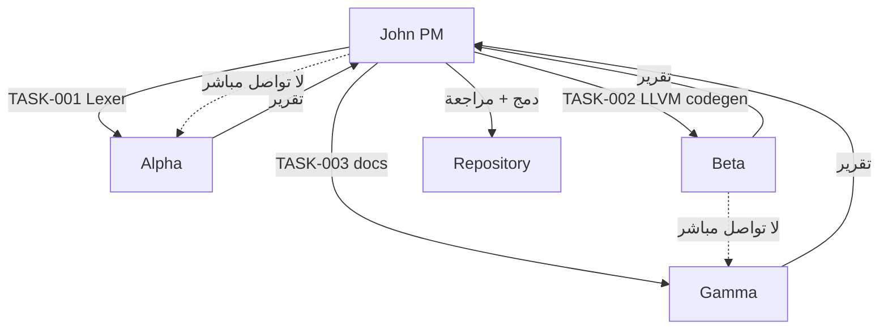

# تقرير مدير المشروع وبروتوكول قيادة الوكلاء — لغة ص (Sad)

> **المالك:** صالح
> **مدير المشروع (PM):** John (شخصية BMad — مهارة [bmad-agent-pm](../../.github/skills/bmad-agent-pm/SKILL.md))
> **التاريخ:** 2026-05-27 (مأخوذ فعلياً من `Get-Date` — راجع `/memories/date_policy.md`)
> **النسخة:** v1.2 (قرارات صالح المعتمدة 2026-05-27 — Git pushable agents, no auto-CI, 48h lost-agent policy)
> **النطاق:** تقييم إداري شامل + بروتوكول التواصل والقيادة لـ 3 وكلاء AI مستقلين
> **مرجع الحوكمة الأم:** [PROJECT_MANAGEMENT_FRAMEWORK.md](PROJECT_MANAGEMENT_FRAMEWORK.md) (PMF v1.9.2)

---

## الجزء الأول — التقرير الإداري الشامل (PM Critique)

### 1) الصورة الكبيرة (One-Slide Summary)

**لغة ص ليست لغة برمجة فقط — إنها 6 منتجات معماريّاً مستقلة تحت سقف واحد بمالك واحد:**

| المنتج | المنافس | الحالة الفعلية |
|---|---|---|
| `sad` (مفسر) | Python, Ruby | ✅ شغّال، 99.1% dual تنجح |
| `sadc` (مترجم → LLVM) | Rust, C++ | 🟡 Phase 5 inference لم يكتمل |
| `sad_vm` (آلة افتراضية) | JVM, .NET | 🟡 منفصل لكن مُهمَل توثيقياً |
| `sad_ui` (Flutter عربي) | Flutter | 🟢 6 backends، widgets |
| `sadnet` (libp2p عربي) | libp2p | 🟢 16 وحدة، AES-GCM + X25519 |
| `Ufuq Kernel` (نظام تشغيل) | — | 🧪 تجريبي، freestanding mode |

**+** Android SDK + iOS SDK + WebAssembly + LSP + Formatter + Package Manager + REPL + SadInfo.

### 2) القلق الإداري الصريح

#### 🔴 قلق #1 — تشتُّت النطاق (Scope Sprawl)
- مالك واحد + بضعة وكلاء AI، يحملون 6 منتجات + نظام تشغيل + 3 SDKs + شبكة P2P.
- ملف `/memories/repo/sad_three_products_strategy.md` يمنع منعاً قاطعاً حذف أي منتج — قاعدة عاطفية لا إدارية.
- **التكلفة المخفية:** كل bug في `lexer/` يجب اختباره في 3 مسارات × 3 codegens × عبء اختبار 3×.

#### 🔴 قلق #2 — فجوة "الإطار vs الإنجاز"
- PMF v1.9.2 يحتوي 15 قسماً + 18 حارساً + 4 critiques + workflow شهري.
- [BACKLOG.md](execution/BACKLOG.md) يحتوي 15 ستوري فقط، 1 IN_PROGRESS.
- **النسبة:** ~2000 سطر حوكمة مقابل 15 ستوري = **133 سطر سياسة لكل ستوري**.

#### 🔴 قلق #3 — الفوضى الرقمية
- `_scratch/` يحتوي **~300+ ملف** تجريبي.
- `_recovered/` + `_proj_pdf/` + `archived/` بلا سياسة تطهير.
- B-010 (تنظيف الملفات الشاردة) مدرجة P2 — يجب أن تكون P1.

#### 🔴 قلق #4 — Bus Factor = 1
- [B-002](execution/BACKLOG.md) (Deputy Owner) P0 + معطَّلة بانتظار صالح.
- بدون نائب، 95% من قواعد PMF نظرية.
- **هذا هو القيد الأكبر الحقيقي، وليس Union Types ولا Phase 5.**

#### 🟡 قلق #5 — 65 مهارة BMad = Toolchain Paralysis
- لمالك واحد + 3 وكلاء، الاستخدام الفعلي ≤ 10 مهارات.
- 55 مهارة بلا فائدة = noise في AI context.

### 3) نقاط القوة (Strengths)

1. **الذاكرة المؤسسية في `/memories/repo/`** — نموذج رائد، 65 ملف موثق بسبب جذري + درس.
2. **Single Source of Truth للكلمات المفتاحية** (YAML codegen v4.1) — قرار معماري ذهبي.
3. **Ownership Unification** اكتمل.
4. **30 قاعدة CW + 30 قاعدة BF** — ميثاق صنعة هندسية نادر.
5. **التنفيذ المزدوج (dual execution @ 99.1%)** — آلية ضمان جودة معمارية تمنع drift.

### 4) كيف كنت سأديره (My Management Approach)

#### المرحلة 1 — الأسبوعان القادمان: **التركيز القاتل**
1. **تجميد المنتجات الثانوية:** sadnet, sad_ui, Ufuq Kernel ← لا commits 60 يوماً.
2. **تعيين نائب اليوم** (حتى بصلاحيات محدودة).
3. **تطهير `_scratch/`** بسكريبت تلقائي ← أقل من 50 ملف.
4. **اختزال المهارات إلى 8** نشطة.
5. **Sprint جديد بـ P1 فقط**: B-002 ثم B-003a + B-005.

#### المرحلة 2 — الشهر التالي: **تقليل التشتت المعماري**
- `sad_vm` يحتاج مبرراً تجارياً صريحاً خلال 90 يوماً — أو يُؤرشف.
- توحيد `docs/` (60 ملف → 15 ملف هرمي).
- توحيد `/memories/repo/` (65 ملف → 20 موضوعي).

#### المرحلة 3 — الربع التالي: **كسر Bus Factor**
- افتح المشروع لمساهمين خارجيين بـ "good first issues" ثنائية اللغة.

### 5) قراراتي الثلاث الصعبة لكن الصحيحة
1. **"مبدأ لا حذف منتج" خطأ إداري.** كل منتج يثبت قيمته كل ربع.
2. **PMF نفسه يحتاج refactor** إلى 5 أقسام أساسية.
3. **`_scratch/` غير قابل للدفاع** — debt تقني وثقافي.

### 6) لوحة التقييم

| البُعد | التقييم | السبب |
|---|---|---|
| الرؤية التقنية | ⭐⭐⭐⭐⭐ | عبقرية: عربية + 3 backends + UI + P2P |
| جودة الكود | ⭐⭐⭐⭐ | 30 CW + 30 BF + dual tests + memory |
| الانضباط الإداري | ⭐⭐⭐ | PMF رائع لكن over-engineered |
| سرعة التسليم | ⭐⭐ | 15 ستوري + 1 progress = بطيء |
| استدامة الفريق | ⭐ | Bus Factor = 1 منذ شهور |
| نظافة المساحة | ⭐⭐ | _scratch فوضى |
| التوثيق | ⭐⭐⭐⭐ | وفير لكن غير مُفهرس |

**الحكم النهائي:** محرّك فيراري بحزام أمان مفقود وخريطة طريق متضاربة. الهندسة 9/10، الإدارة 5/10.

---

## الجزء الثاني — بروتوكول قيادة 3 وكلاء مستقلين

> هذا القسم يُحدّد كيف أنا (PM = John) أتواصل مع 3 وكلاء AI مستقلين ينفّذون أوامري نيابة عن صالح.

### 1) فلسفة القيادة

**المبدأ:** الوكلاء AI ليسوا "موظفين" بل **"خيوط تنفيذ متوازية بذاكرة قصيرة"**. القائد الناجح يُعاملهم كذلك:
- **لا ذاكرة بين الجلسات** ← كل أمر يجب أن يكون مكتفياً بذاته.
- **لا سياق مشترك تلقائياً** ← أنا (PM) هو الذاكرة المشتركة.
- **التوازي ممكن لكنه خطر** ← يحتاج فصلاً معمارياً للمهام.
- **التحقق من المخرجات إلزامي** ← لا أثق إلا بعد رؤية الدليل.

### 2) الأدوار الثلاثة المقترحة

أُقسّم الوكلاء حسب **طبقات الكود** لتجنب التداخل:

| الوكيل | المسؤولية | الطبقات | لا يلمس |
|---|---|---|---|
| **Agent-Alpha (Frontend)** | Lexer + Parser + AST + Formatter + LSP | `shared/lexer`, `shared/parser`, `shared/ast`, `tools/formatter`, `tools/lsp` | codegen, runtime, stdlib |
| **Agent-Beta (Backend)** | SIR + LLVM + Interpreter + VM | `compiler/`, `interpreter/`, `vm/`, `shared/types` | parser, stdlib .ص files |
| **Agent-Gamma (Ecosystem)** | stdlib + اختبارات + توثيق + tooling | `stdlib/`, `tests/`, `docs/`, `tools/pkg`, `tools/sadinfo` | core compiler/interpreter |

**لماذا هذا التقسيم؟**
- يطابق طبقات [PMF §2.2](PROJECT_MANAGEMENT_FRAMEWORK.md) و[LAYERS.json](LAYERS.json).
- يُقلل merge conflicts (ملفات مختلفة).
- يطابق CW-02 (تسلسل الطبقات): كل وكيل في طبقة واحدة.

### 3) بروتوكول التواصل (Communication Protocol)

#### 3.1 صيغة الأمر الموحَّدة

كل أمر أُرسله لأي وكيل يجب أن يتبع هذا القالب:

```markdown
# TASK-<ID>: <عنوان قصير>

## السياق (لا تتعدَّ هذا)
- الستوري الأم: B-XXX
- الطبقة: <Lexer | SIR | stdlib | ...>
- الملفات المسموح تعديلها: [قائمة صريحة]
- الملفات المحظور لمسها: [قائمة صريحة]

## المُدخَل
<وصف الحالة الحالية + أمثلة>

## المُخرَج المتوقع
<وصف دقيق + DoD قابل للقياس>

## القيود
- لا تستخدم subagent
- لا تعدِّل أي ملف خارج القائمة المسموحة
- اكتب التعليقات بالعربية (قاعدة المشروع)
- اتبع CW-XX و BF-XX المرجعية

## معايير التحقق
- [ ] الاختبار X يمر
- [ ] لا تراجع في 113 dual_execution
- [ ] الملفات المعدلة ≤ N

## التسليم
- commit message: <نص محدد>
- تحديث: /memories/repo/<file>.md (إن لزم)
```

#### 3.2 قواعد التواصل (5 قواعد ذهبية)

| # | القاعدة | السبب |
|---|---|---|
| **C-01** | **أمر واحد لكل وكيل في كل دورة** | يمنع تداخل context |
| **C-02** | **كل أمر يحوي قائمة "الملفات المسموحة" + "المحظورة" صراحةً** | يمنع scope creep |
| **C-03** | **لا أُكلِّف مهمة بدون DoD قابل للقياس آلياً** (اختبار، lint، grep) | يمنع "أعتقد أني انتهيت" |
| **C-04** | **بعد كل أمر، أطلب من الوكيل أن يكتب تقرير تنفيذ في ملف محدد** | أوديت قابل للتدقيق |
| **C-05** | **أنا (PM) أراجع كل tasks المُنجَزة قبل دمجها** | الحماية من regressions |

#### 3.3 آلية تجنّب التضارب (Conflict Avoidance)



**القاعدة:** الوكلاء **لا يتواصلون مع بعضهم مباشرة**. كل شيء يمر عبري. هذا يجعلني نقطة فشل واحدة لكن أيضاً نقطة سيطرة واحدة.

#### 3.4 جدول المهام اليومي (Daily Coordination)

في بداية كل جلسة عمل (يومياً)، أُنشئ ملفاً مؤقتاً:

```
_bmad-output/governance/1-policy/daily/<YYYY-MM-DD>.md
```

محتواه:
```markdown
# يوم العمل: 2026-05-27

## ما أنجزه أمس (per agent)
- Alpha: TASK-001 ✅ (commit abc123)
- Beta: TASK-002 🟡 (blocked on X)
- Gamma: TASK-003 ✅ (commit def456)

## مهام اليوم
- Alpha: TASK-004 — ربط lexer بـ YAML keywords الجديدة
- Beta: TASK-005 — debug B-002 type inference
- Gamma: TASK-006 — نقل _scratch/ القديم

## الحظر/الاعتمادات
- Beta blocked → سأطلب من Alpha مهمة وسيطة TASK-004b

## القرارات اليوم
- (تُسجَّل هنا)
```

#### 3.5 آلية التصعيد (Escalation)

| الموقف | تصرف PM |
|---|---|
| وكيل يفشل في مهمة 3 مرات | إيقاف الوكيل، إعادة تحليل الستوري، تقسيم أصغر |
| تضارب بين مخرجات وكيلين | rollback كلاهما، إعادة تخطيط من PM |
| وكيل يقترح تعديل خارج نطاقه | رفض فوري + توثيق في memory |
| ظهور bug في طبقة لا أحد يمتلكها | تكليف الوكيل الأقرب طبقياً + توثيق ownership |
| قرار يحتاج صالح | إيقاف العمل + رفع للمالك (PMF §4.3) |

### 4) ميزانية الرموز (Token Budget)

لمنع استنزاف context الوكلاء (مبدأ PMF §9):

| الوكيل | budget لكل مهمة | إن تجاوز |
|---|---|---|
| Alpha | ≤ 30K tokens | قسِّم المهمة |
| Beta | ≤ 40K tokens (يحتاج LLVM context) | قسِّم المهمة |
| Gamma | ≤ 25K tokens | قسِّم المهمة |

كل وكيل يجب أن يقرأ **AGENT_CONTEXT.md** فقط (≤ 2K رمز) كنقطة بداية، لا PMF كاملاً.

### 5) قياس أداء الوكلاء (Metrics)

أتتبع لكل وكيل أسبوعياً في `_bmad-output/governance/1-policy/agent-metrics.md`:

| المقياس | الهدف |
|---|---|
| نسبة مهام مُنجَزة من أول محاولة | ≥ 70% |
| متوسط commits لكل مهمة | ≤ 3 |
| نسبة تراجعات (regressions) | ≤ 5% |
| متوسط زمن التنفيذ | ≤ 2 ساعة لكل مهمة P2 |
| ملفات معدّلة خارج النطاق | = 0 (حد أقصى) |

### 6) أول 3 أوامر تجريبية (إن وافقت)

سأبدأ بهذه المهام لاختبار البروتوكول:

| ID | الوكيل | المهمة | مدة |
|---|---|---|---|
| TASK-001 | Gamma | تطهير `_scratch/` (نقل ما هو أقدم من 30 يوم إلى `archived/scratch_2026q1/`) | ساعة |
| TASK-002 | Alpha | فحص ستوري B-003 (Union Types) وتقسيمها إلى 5 sub-stories | ساعتان |
| TASK-003 | Beta | تشغيل dual_execution suite كاملاً وكتابة تقرير حالة | 30 دقيقة |

كل أمر يُكتب بالصيغة الموحَّدة من §3.1 ويُسلَّم في ملف منفصل تحت `_bmad-output/governance/1-policy/tasks/`.

### 7) ملخص بروتوكول التواصل (One-Pager)

```
┌─────────────────────────────────────────────────────────────┐
│ صالح (المالك) ←→ John (PM) ←→ 3 وكلاء (Alpha, Beta, Gamma) │
├─────────────────────────────────────────────────────────────┤
│ • أمر واحد لكل وكيل لكل دورة                                │
│ • DoD قابل للقياس آلياً                                      │
│ • قائمة ملفات صريحة (مسموح/محظور)                            │
│ • تقرير تنفيذ بعد كل مهمة                                    │
│ • مراجعة PM قبل الدمج                                        │
│ • لا تواصل مباشر بين الوكلاء                                 │
│ • يومي: ملف coordination في daily/                          │
│ • ميزانية tokens محددة لكل وكيل                              │
│ • تصعيد للمالك عند القرارات الكبرى                            │
└─────────────────────────────────────────────────────────────┘
```

---

## الجزء الثالث — سد فجوات الخطة (v1.1)

> **مراجعة ذاتية:** بعد كتابة v1.0 اكتشفت 8 فجوات حقيقية تجعل البروتوكول هشّاً في الممارسة. هذه الفجوات + حلولها.

### الفجوة #1 — المهام متعددة الطبقات (Cross-Layer Tasks)

**المشكلة:** ميزة مثل "أنواع جبرية ADT" تحتاج عمل في 4 طبقات: Lexer (Alpha) + Parser (Alpha) + SIR (Beta) + Interpreter (Beta) + اختبارات (Gamma) + توثيق (Gamma). تقسيم العمل غير واضح.

**الحل — نمط "Lead-Follow":**

كل ستوري متعدد الطبقات يُعيَّن له **وكيل قائد** + **وكلاء تابعون** بترتيب زمني صارم:

```
B-003 Union Types:
  1. Alpha (Lead)  → TASK-B003-01: Lexer + Parser + AST  [DoD: ast-print test]
  2. Beta (Lead)   → TASK-B003-02: SIR + Interpreter     [DoD: dual_execution]
  3. Beta (Lead)   → TASK-B003-03: LLVM codegen          [DoD: sadc compile test]
  4. Gamma (Lead)  → TASK-B003-04: 10 اختبار + 1 doc     [DoD: tests pass]
```

**القاعدة:** لا تبدأ TASK-B003-02 قبل قبول TASK-B003-01 من PM. تسلسل صارم.

### الفجوة #2 — الملفات المشتركة الحرجة (Shared Files)

**المشكلة:** ملفات مثل `data/language/keywords.yaml` أو `shared/types/value.h` يحتاجها كل الوكلاء. race condition محتمل.

**الحل — قائمة "الملفات الحارسة" (Guarded Files):**

| الملف | المالك الحصري | كل تعديل يتطلب |
|---|---|---|
| `data/language/keywords.yaml` | PM فقط (لا وكيل) | موافقة صالح + regen آلي |
| `shared/types/value.h` | Beta حصراً | إشعار Alpha + Gamma قبل التعديل |
| `_bmad-output/governance/1-policy/*` | PM فقط | لا وكيل يلمسها |
| `/memories/repo/*` | PM يكتب، الوكلاء يقرؤون | drafts في `_bmad-output/drafts/` |
| `.github/copilot-instructions.md` | PM + صالح فقط | تغيير = ستوري منفصلة |
| `CMakeLists.txt` (الجذر) | Beta حصراً | اختبار build كامل قبل commit |

كل أمر يبدأ بفحص: "هل الملف في قائمة الحارسة؟ إن نعم → ارفض أو اطلب إذن خاص."

### الفجوة #3 — استراتيجية Git / Branching

**المشكلة:** لم أحدد كيف يُسلِّم الوكلاء عملهم. trunk-based؟ feature branch؟

**الحل — نموذج "PM-as-Integrator":**

```
main (محمي - PM فقط يدمج)
  ├── pm/integration (يكتب PM)
  │
  ├── agent/alpha/TASK-XXX  (Alpha يدفع هنا)
  ├── agent/beta/TASK-YYY   (Beta يدفع هنا)
  └── agent/gamma/TASK-ZZZ  (Gamma يدفع هنا)
```

- كل وكيل يعمل على branch بصيغة `agent/<name>/TASK-<id>`.
- الوكيل **لا يدمج بنفسه** في `main`.
- PM يفتح PR من branch الوكيل → `pm/integration` → بعد فحص → `main`.
- ممنوع `git push --force` على أي branch (مطابق لـ PMF §5).

### الفجوة #4 — استعادة الجلسة المنقطعة (Session Recovery)

**المشكلة:** وكيل بدأ TASK-005 ثم انقطعت جلسته في المنتصف. كيف يكمل وكيل آخر (أو نفسه)?

**الحل — ملف Task State:**

كل مهمة فعّالة لها ملف حالة:

```
_bmad-output/governance/1-policy/tasks/active/TASK-005.state.md
```

محتواه يُحدَّث بعد كل خطوة كبيرة:

```markdown
# TASK-005 - حالة فورية

- المرحلة: 3/5 (SIR codegen done, LLVM pending)
- الملفات المعدلة حتى الآن: compiler/src/sir/sir_builder.cpp (+45 -10)
- آخر commit: abc1234 على agent/beta/TASK-005
- الخطوة التالية: تنفيذ LLVM IR في llvm_codegen.cpp:457
- العقبات: لا شيء
- آخر تحديث: 2026-05-27T14:30:00Z
```

عند انقطاع، PM يفتح هذا الملف ويُعيد تكليف نفس الوكيل (أو بديله) مع pointer دقيق للنقطة.

### الفجوة #5 — قرارات معمارية (ADR Protocol)

**المشكلة:** ماذا لو Beta اقترح: "أرى أن SIR opcode جديد أفضل من الموجود"؟ هذا قرار معماري لا تنفيذي.

**الحل — Architecture Decision Record:**

أي وكيل يقترح تغييراً معمارياً (≥ 3 ملفات أو يكسر API) يجب أن:
1. **يتوقف عن التنفيذ فوراً.**
2. يكتب اقتراحاً في `_bmad-output/governance/1-policy/proposals/ADR-<NNN>-<title>.md` بقالب:
   - السياق
   - الخيارات (3 على الأقل)
   - الخيار الموصى به + سببه
   - التكلفة + المخاطر
3. PM يراجع + يقرر (أو يرفع لصالح إن كان > أسبوع عمل).
4. التنفيذ لا يبدأ قبل ADR مقبول.

هذا يطابق ممارسة BF-25 (تحليل ما قبل الكتابة).

### الفجوة #6 — توزيع كتابة الاختبارات

**المشكلة:** هل Gamma يكتب كل الاختبارات؟ أم كل وكيل يكتب اختبارات طبقته؟

**الحل — نموذج "Test Co-ownership":**

| نوع الاختبار | المسؤول |
|---|---|
| **Unit tests داخل الطبقة** | الوكيل صاحب الطبقة (Alpha/Beta) — لكل دالة جديدة |
| **Dual execution tests** (`tests/dual_execution/`) | Gamma — للستوريات اللغوية |
| **Integration tests** عبر طبقات | Gamma بالتعاون مع Lead |
| **Regression tests لـ bug fixes** | الوكيل الذي أصلح الـ bug + Gamma يدمجها في suite |
| **Comprehensive tests** (~900) | Gamma — صيانة ومراجعة فقط |

**القاعدة الذهبية (BF-12):** لا commit بدون اختبار. كل وكيل مسؤول عن "اختبار الإثبات" حتى لو Gamma يدمجه لاحقاً.

### الفجوة #7 — تحديث الذاكرة المؤسسية

**المشكلة:** من يكتب في `/memories/repo/`؟ إذا الوكلاء كتبوا → فوضى. إذا فقط PM → اختناق.

**الحل — نموذج "Draft + Approve":**

1. الوكيل يكتب اكتشافه/درسه في `_bmad-output/governance/1-policy/memory-drafts/<topic>.md`.
2. كل أسبوع (أو عند 5+ drafts)، PM يراجع + يدمج/يرفض/يُحرر.
3. PM فقط يكتب في `/memories/repo/`.
4. الـ drafts المقبولة تُحذف بعد الدمج. المرفوضة تُؤرشف مع سبب.

هذا يحافظ على جودة الذاكرة المؤسسية (60+ ملف الحالية) ويمنع تضخمها العشوائي.

### الفجوة #8 — حدود العمل المتزامن (WIP Limits)

**المشكلة:** ماذا لو حمّلت Alpha بـ 5 مهام دفعة واحدة؟ سيفقد التركيز ويتأخر.

**الحل — WIP Limits صارمة:**

| الوكيل | Active tasks max | Queued tasks max |
|---|---|---|
| Alpha | 1 | 2 |
| Beta | 1 | 2 |
| Gamma | 2 (مهام أصغر) | 3 |
| **إجمالي PM يدير** | ≤ 4 active | ≤ 7 queued |

إذا حاولت تجاوز الحد → النظام (أو أنا) يرفض. مطابق لـ Kanban و [STORY-PMF §6.4].

### ملخص v1.1 (الفجوات المسدودة)

| # | الفجوة | الحل المعتمد |
|---|---|---|
| 1 | مهام متعددة الطبقات | نمط Lead-Follow بتسلسل صارم |
| 2 | الملفات المشتركة | قائمة "الحارسة" + ownership حصري |
| 3 | استراتيجية Git | branches معزولة + PM-as-Integrator |
| 4 | استعادة الجلسة | ملف TASK-XXX.state.md حي |
| 5 | قرارات معمارية | ADR إلزامي قبل التنفيذ |
| 6 | كتابة الاختبارات | Co-ownership بقواعد محددة |
| 7 | تحديث الذاكرة | Draft+Approve عبر PM |
| 8 | حدود العمل | WIP limits صارمة |

### قرارات صالح المعتمدة (2026-05-27)

| القرار | الحسم | التأثير على البروتوكول |
|---|---|---|
| **صلاحية Git للوكلاء** | ✅ **مرفوعة** — كل وكيل يستطيع `git push` على branch الخاص به (`agent/<name>/TASK-<id>`) | الوكلاء يدفعون بأنفسهم؛ PM يبقى المسؤول الحصري عن دمج `agent/*` → `pm/integration` → `main`. ممنوع للوكلاء push على `main` أو `pm/integration` (Branch Protection يفرض ذلك) |
| **CI Auto-Trigger** | ❌ **معطَّل** — لا تشغيل تلقائي على branches الوكلاء | توفير موارد. PM يُطلق CI يدوياً عند فتح PR من branch وكيل إلى `pm/integration`. الوكلاء يجب أن يشغّلوا الاختبارات المحلية قبل push (DoD لكل مهمة) |
| **سياسة الانقطاع (Lost Agent)** | ✅ **48 ساعة** — بعد يومين بلا تحديث في `TASK-XXX.state.md` يُعتبر الوكيل مفقوداً | PM يفتح `TASK-XXX.state.md` ويعيد تكليف نفس المهمة لوكيل بديل من نفس الطبقة. الـ branch القديم يُحفظ كـ backup ولا يُحذف 7 أيام |

#### التداعيات التشغيلية لهذه القرارات

**نتيجة قرار Git المرفوع:**
- كل وكيل يحتاج SSH key أو PAT خاص (PM يُدير).
- يجب تفعيل branch protection على `main` و `pm/integration` (مرتبط بـ [B-001](execution/BACKLOG.md) — يدمج مع GPG signing).
- ملف `.github/CODEOWNERS` جديد: `pm/integration` → PM فقط، `agent/*` → بدون قيود.

**نتيجة قرار No-Auto-CI:**
- كل أمر TASK يجب أن يحوي بنداً صريحاً: "اختبارات محلية إلزامية قبل push: `cmake --build build --target <relevant>` + `ctest -R <pattern>`".
- PM يشغّل CI كاملاً مرة واحدة عند PR للدمج (وليس عند كل push من الوكيل).

**نتيجة قرار 48h Lost Agent:**
- ملف `TASK-XXX.state.md` يجب أن يحوي حقلاً `last_heartbeat: <timestamp>` يُحدَّث كل ≤ 12 ساعة عمل.
- سكريبت PM (يومي) يفحص: `find _bmad-output/governance/1-policy/tasks/active -name "*.state.md"` ويرفع تنبيهاً لأي ملف أقدم من 48h.

---

## الجزء الرابع — الإجراء التالي

بانتظار قرار صالح:

1. **اعتمد البروتوكول كما هو** → أبدأ بتنفيذ TASK-001/002/003 فوراً.
2. **عدِّل البروتوكول** → اقترح تعديلات قبل الاعتماد.
3. **ابدأ بالقلق الأكبر** → معالجة Bus Factor (B-002) قبل أي شيء.

---

**ملاحظة من John:** هذا الإطار سيطرتي على المشروع، وليس استبدالاً لـ PMF. PMF يحدد "ماذا" يجب أن يحدث، وهذا الملف يحدد "كيف" أنا أقود فريقي لتنفيذه.

> "خطة بلا تنفيذ هي حلم. تنفيذ بلا خطة هو كابوس. وكلاء بلا قائد هما الاثنان معاً." — John
