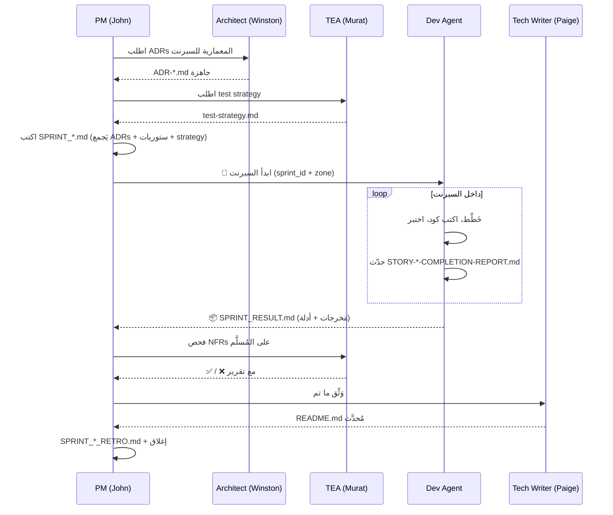

# 🎯 نظام التَنسيق v2 — Sprint-per-Dev Model

**النُسخة:** 2.0  
**التاريخ:** 2026-06-01  
**يَنسخ ويَحل محل:** [v1 (Atomic Tasks)](_archive/2026-06-01_atomic-tasks-model/WHY_ARCHIVED.md)  
**قرار مُؤطَّر:** ADR-ORCHESTRATION-2026-06-01

---

## 1. المبدأ الأساسي

> **وحدة العمل ليست مَهمة ذرية، بل سبرنت كامل.**  
> الوكيل المُطور يَملك السياق الكامل، يَأخذ سبرنتاً مُترابطاً، ويُسلِّم نتيجة مُكتملة بنفسه.

### الفَلسفة

| المبدأ | التَفسير |
|---|---|
| **PM يُخطط، لا يُنفذ** | PM يَكتب SPRINT.md ثم يَنسحب — لا تَدخل في القرارات الدقيقة |
| **Dev يَمتلك السبرنت** | المُطور يَقرر كيف يُقسِّم العمل، يَختار الأدوات، يُعيد التَخطيط داخلياً |
| **حدود واضحة** | كل سبرنت له `zone` صريح (مجلدات يَملكها فقط) لمنع التَصادم |
| **مَخرجات قابلة للتحقق** | كل سبرنت يُسلِّم: كود + اختبارات + completion reports + status update |

---

## 2. الأدوار (3 طبقات)

### الطبقة 1: القيادة (لا تَكتب كود)

| الدور | المهارة BMAD | الإنتاج |
|---|---|---|
| **مدير المشروع** | `bmad-agent-pm` (John) | `SPRINT_*.md`, `prd.md`, مراجَعة نَتائج Dev |
| **المعماري** | `bmad-agent-architect` (Winston) | `ADR-*.md` **قبل** السبرنت لكل قرار مفصلي |
| **مهندس الاختبار** | `bmad-tea` (Murat) | `test-strategy.md` لكل سبرنت، فحص NFRs بعد |

### الطبقة 2: التَنفيذ (Dev Agents — تَوازي حقيقي)

**المهارة:** `bmad-agent-dev` (Amelia) — يُمكن تَشغيل **عدة instances في وقت واحد** بشرط zones غير متَداخلة.

| Instance | السبرنت | Zone (مجلدات حصرية) |
|---|---|---|
| `dev_M0` | البنية التحتية للحوكمة | `scripts/`, `_bmad-output/governance/2-agents/` |
| `dev_M1A` | Foundation Schemas | `_bmad-output/systems/living-documentation/2-architecture/schemas/`, `tools/living-docs-loader/` |
| `dev_M1B` | Living Docs MVP | `_bmad-output/systems/living-documentation/3-implementation/poc/`, `data/_meta/` |
| `dev_kernel` | تَطوير لغة ص الأساسية | `compiler/`, `interpreter/`, `vm/`, `runtime/`, `shared/` |
| `dev_stdlib` | المكتبة القياسية | `stdlib/`, `data/stdlib/` |
| `dev_tools` | الأدوات | `tools/` |

**قاعدة Zone:** لا يَجوز تَكليف اثنين بنفس الـzone في وقت واحد. PM يَفرض هذا في `index.yaml`.

### الطبقة 3: المساندة

| الدور | المهارة BMAD | الإنتاج |
|---|---|---|
| **كاتب تقني** | `bmad-agent-tech-writer` (Paige) | README.md, INDEX.md، تَحديث الوثائق بعد كل Dev sprint |
| **مُحلل** | `bmad-agent-analyst` (Mary) | متطلبات + research عند الحاجة |

---

## 3. دورة الحياة (Sprint Lifecycle)



---

## 4. المُخرجات الإلزامية لكل سبرنت

### من PM (قبل البَدء):
```
_bmad-output/<scope>/sprints/SPRINT_<id>.md
├── §1 الهدف (1 فقرة)
├── §2 الستوريات (3-7، مع acceptance criteria صريحة)
├── §3 Zone (مجلدات حصرية)
├── §4 ADRs المرجعية (روابط)
├── §5 Test Strategy (رابط لـMurat)
├── §6 deadline + WIP limits
└── §7 Definition of Done
```

### من Dev Agent (أثناء وبعد):
```
_bmad-output/<scope>/stories/STORY-<id>.md          ← أثناء (يُحدَّث)
_bmad-output/<scope>/stories/STORY-<id>-COMPLETION-REPORT.md  ← في الإكمال
_bmad-output/<scope>/status/implementation_status.md ← يُحدَّث في النهاية
_bmad-output/<scope>/sprints/SPRINT_<id>_RESULT.md  ← تَسليم نهائي
```

### من PM (بعد الاستلام):
```
_bmad-output/<scope>/sprints/SPRINT_<id>_RETRO.md
_bmad-output/governance/1-policy/status/VERIFICATION_REPORT_<date>.md  ← مُحدَّث
```

---

## 5. قَواعد التَنسيق (OR — Orchestration Rules)

- **OR-01:** PM لا يَتَدخل داخل السبرنت إلا عند طلب الـDev صراحةً (escalation).
- **OR-02:** كل Dev instance يَملك zone حَصرياً — لا تَداخل في الكتابة.
- **OR-03:** قبل بَدء السبرنت، يجب وجود: ADRs مكتملة + test strategy + sprint plan موقَّع.
- **OR-04:** Dev مُلزَم بـTest-Path على كل افتراض قبل البَدء (تَجنب خطأ BF-25).
- **OR-05:** Dev يُسلِّم `SPRINT_*_RESULT.md` بأدلة قابلة للتدقيق (paths, line counts, test results).
- **OR-06:** TEA يَفحص قبل قبول PM للنَتيجة — لا قبول بدون TEA approval.
- **OR-07:** Tech Writer يَكتب README/INDEX قبل إغلاق السبرنت.
- **OR-08:** RETRO إلزامي (GR-03) — يَكتبه PM بعد كل سبرنت.
- **OR-09:** `_bmad-output/governance/2-agents/sprints_active.yaml` هو SoT للسبرنتات الجارية.
- **OR-10:** عند تَصادم zones، PM يَقسِّم زمنياً (sprint A ثم sprint B) أو يُقسِّم الـzone.

---

## 6. SoT للسبرنتات الجارية

ملف واحد: `_bmad-output/governance/2-agents/sprints_active.yaml`

```yaml
sprints:
  M0-INFRA:
    title: "البنية التحتية للحوكمة"
    dev_instance: dev_M0
    status: planned  # planned | in_progress | review | done | blocked
    zone: ["scripts/", "_bmad-output/governance/2-agents/"]
    stories: [S-M0-01, S-M0-02, S-M0-03, S-M0-04, S-M0-05]
    sprint_file: _bmad-output/governance/2-agents/sprints/SPRINT_M0_INFRASTRUCTURE.md
    started: null
    deadline: 2026-06-10
    adrs: [ADR-ORCHESTRATION-2026-06-01]
```

---

## 7. مَتى تُستخدم مَهام ذرية بدل سبرنتات؟

النَموذج الذَري (v1) **لم يُلغَ كلياً**، بل يُحفظ للحالات التالية فقط:

- ✅ إصلاحات عاجلة (< 2 ساعة) — hotfix
- ✅ تَوثيق نقطة واحدة — لا يَحتاج سبرنت
- ✅ مَهمة استكشافية (research spike) قبل التَخطيط

لهذه الحالات، PM يَستخدم `bmad-quick-dev` بدل `bmad-agent-dev`، ولا يَكتب `SPRINT_*.md`.

---

## 8. الفَرق عن v1 (مُلخص للوكلاء)

| البُعد | v1 (Atomic) | v2 (Sprint-per-Dev) |
|---|---|---|
| الوكيل المُنفِّذ | 5 وكلاء سياقيين (α β γ δ ε) | `bmad-agent-dev` × N instances |
| الوحدة | T-XXXX (2-6 ساعات) | SPRINT (3-7 ستوريات) |
| التَخطيط الدقيق | PM | Dev نفسه |
| ملف SoT | `tasks/index.yaml` | `sprints_active.yaml` |
| تَوازي حقيقي | 2-3 (تَبعيات) | 4-6 (zones مستقلة) |
| PM-overhead | عالي | منخفض |

---

**القرار المُعتمد:** [ADR-ORCHESTRATION-2026-06-01](../../systems/living-documentation/2-architecture/decisions/) (سيُكتب)
