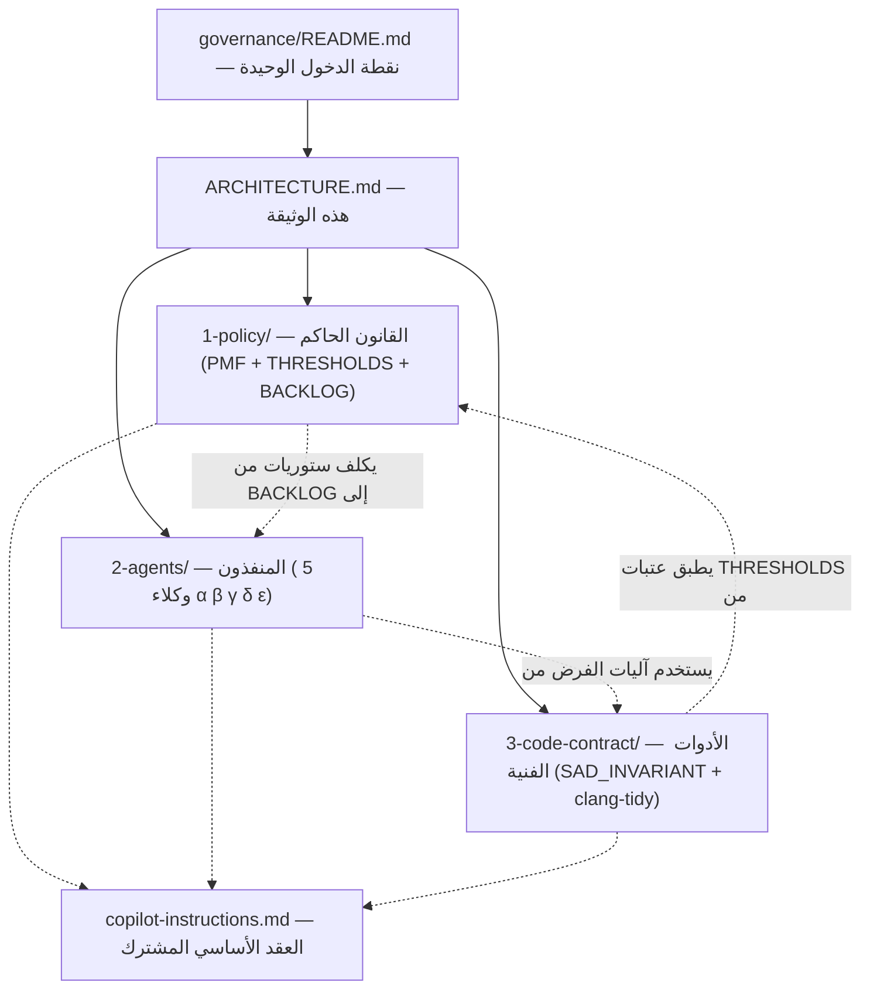

# 🏛️ معمارية نظام الحوكمة

> هذه الوثيقة تشرح **لماذا** الطبقات الثلاث مفصولة، **وكيف** تتفاعل، و**أين** ينتهي اختصاص كل واحدة.

---

## 1) المبدأ الجوهري: ثلاثة أسئلة مختلفة

لا تخلط بين **ماذا** و **من** و **كيف**. كل طبقة تجيب على سؤال واحد فقط:

| الطبقة | السؤال | الأداة | الملكية |
|---|---|---|---|
| ⚖️ **1-policy** | **ما** هي القواعد؟ | PMF + THRESHOLDS + BACKLOG + ADRs | PM (Saleh) |
| 👥 **2-agents** | **من** ينفّذ؟ | مواثيق نطاق (Charters) + WIP + Lead/Follow | الوكلاء |
| 🔧 **3-code-contract** | **كيف** نُلزم الكود تقنياً؟ | `SAD_INVARIANT` + clang-tidy + YAML rules | المهندس الفني |

> **التشبيه:** Policy = الدستور. Agents = الهيكل التنظيمي. Code Contract = نظام مراقبة الجودة في خط الإنتاج.

---

## 2) مخطط التفاعل

---

## 3) نقاط التداخل المشروعة (ليست تكراراً)

| نقطة التداخل | Policy | Agents | Code Contract | لماذا ليس تكراراً |
|---|---|---|---|---|
| **BACKLOG** | يملكه (15 ستوري) | يستهلكه (B-001..B-013) | لا علاقة مباشرة | كل وكيل يأخذ ستورياته من المصدر الواحد |
| **GUARDED_FILES** | تحدّدها (عبر `docs/governance/`) | يحترمها في كل ميثاق | لا علاقة | تعريف واحد، استهلاك متعدد |
| **SAD_INVARIANT** | يستفيد منه عبر THRESHOLDS | لا علاقة | يصمّمه ويصنّفه | تصميم تقني ≠ سياسة حوكمية |
| **Sprint/تنفيذ** | يحدد ما يُنفَّذ هذا الأسبوع | يحدّد سعة الوكيل (WIP) | لا علاقة | الإيقاع (متى) ≠ السعة (كم) |
| **Audit Log** | يملك `AUDIT_LOG.jsonl` | لا يكتب audit | لا علاقة | كل قرار حوكمي يُسجَّل مرة واحدة فقط |

---

## 4) نقاط الانفصال الواضحة (لا تخلط!)

- **`1-policy/` لا يحدّد كيف يُكتب C++** → ذلك من اختصاص `3-code-contract/` + `copilot-instructions.md`
- **`2-agents/` لا يحوي قواعد كود** → ذلك من اختصاص `3-code-contract/` + `copilot-instructions.md`
- **`3-code-contract/` لا يحوي تنظيماً بشرياً ولا سياسات إدارة** → ذلك من اختصاص `2-agents/` + `1-policy/`

---

## 5) نسب التنفيذ الفعلي (تحقق Amelia — 2026-05-30)

| الطبقة | وثائق | تنفيذ فعلي على الكود | الفجوة الرئيسية |
|---|---|---|---|
| ⚖️ 1-policy | 100% | ~30% | tasks/active فارغة، 5 سكريبتات مفقودة (`agent_lock.py`, `verify_thresholds_consistency.py`, `scan_layers.py`, `check_arabic_ratio.py`, `thresholds_loader.py`)، `monthly-pmf-check.yml` مفقود |
| 👥 2-agents | 100% | ~40% | لا CODEOWNERS، لا فرض تقني لنطاقات الوكلاء، `rfcs/` كان فارغاً |
| 🔧 3-code-contract | 100% | **~5%** 🔴 | `sad_invariant.h` غير موجود، 0 من 156 ثابت، 0 من 34 death test، `check_invariants.py` مفقود |

> **المرجع التفصيلي:** [../COMPARISON_agents_codeRolePlan_management.md](../COMPARISON_agents_codeRolePlan_management.md)

---

## 6) قواعد التطور المستقبلي

1. **لا تضف ملفاً في الطبقة الخاطئة.** إذا كان السؤال "من ينفّذ؟" → `2-agents/`. إذا كان "ما القاعدة؟" → `1-policy/`.
2. **ملفات state ليست وثائق** — أي ملف JSON/JSONL تكتبه سكريبت → في `1-policy/runtime-state/`.
3. **المراجعات العدائية** → `1-policy/critiques/` مع تسمية `CRITIQUE_<reviewer>_<YYYY-MM-DD>.md`.
4. **ADRs** → `1-policy/proposals/`. الوكلاء يفتحون، PM يقرر.
5. **RFCs** → `2-agents/rfcs/` بصيغة `B-XXX-rfc.md` (مرتبط بستوري من BACKLOG).
6. **أي تعديل على عقد معماري** يستلزم `SAD_INVARIANT` جديد في `3-code-contract/`.

---

## 7) المراجع الأساسية

- [README.md](README.md) — فهرس الطبقات الثلاث
- [1-policy/PROJECT_MANAGEMENT_FRAMEWORK.md](1-policy/PROJECT_MANAGEMENT_FRAMEWORK.md) — الدستور
- [1-policy/execution/BACKLOG.md](1-policy/execution/BACKLOG.md) — الستوريات المُعتمدة
- [3-code-contract/contract-as-code-plan.md](3-code-contract/contract-as-code-plan.md) — تصميم Contract-as-Code
- [../REORGANIZATION_PROPOSAL.md](../REORGANIZATION_PROPOSAL.md) — أسباب التوحيد
- [../COMPARISON_agents_codeRolePlan_management.md](../COMPARISON_agents_codeRolePlan_management.md) — التحليل التفصيلي
- [../../.github/copilot-instructions.md](../../.github/copilot-instructions.md) — العقد الأساسي

---

**المؤلف:** Amelia (bmad-agent-dev)
**التاريخ:** 2026-05-30
