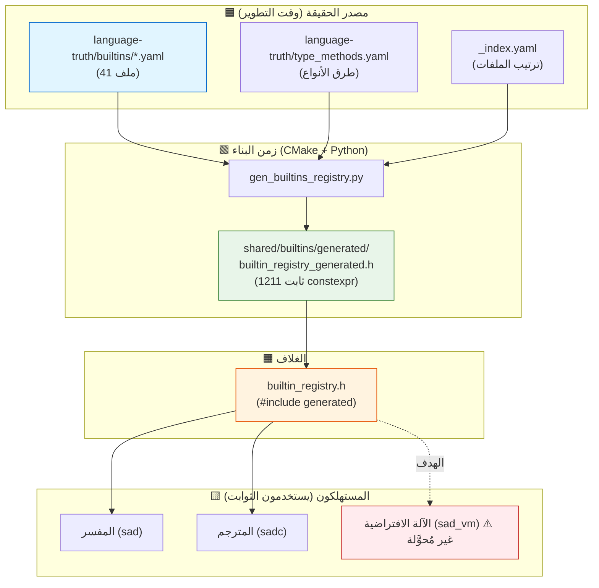
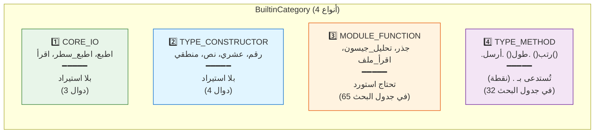
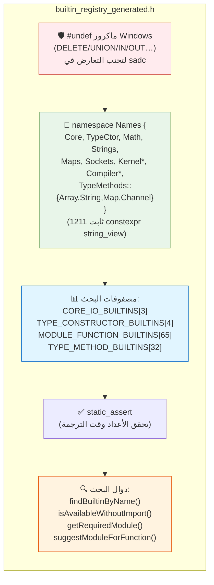
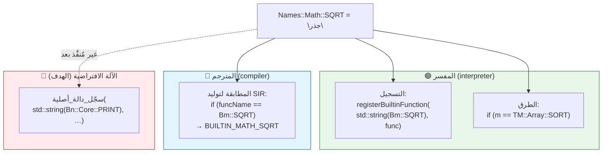
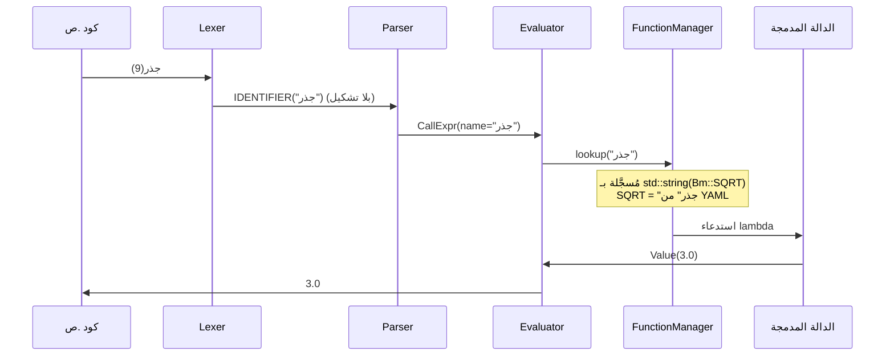
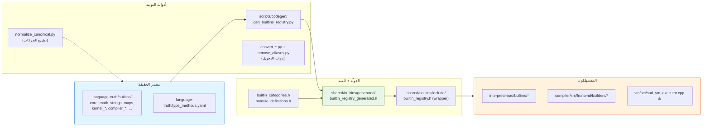

# مخطط نظام الدوال المدمجة — لغة ص

شرح مرئي لنظام الدوال المدمجة: من مصدر الحقيقة (YAML) إلى الثوابت المُولَّدة،
وكيف تستهلكها مكونات اللغة الثلاثة (مفسر/مترجم/VM).

---

## 0. التدفق العام: من YAML إلى التنفيذ

> **القاعدة:** YAML هو المصدر الوحيد. تعديل اسم = تعديل YAML → CMake يُعيد التوليد → كل المكونات تتحدث.

---

## 1. التصنيفات الأربعة للدوال المدمجة

كل دالة تنتمي لأحد أربعة تصنيفات (`builtin_categories.h`) تحدد كيف تُعامَل:

| التصنيف | الاستدعاء | يحتاج استيراد؟ | مثال |
|---------|-----------|----------------|------|
| `CORE_IO` | `اطبع(س)` | ❌ | اطبع، اقرأ |
| `TYPE_CONSTRUCTOR` | `رقم("42")` | ❌ | رقم، نص |
| `MODULE_FUNCTION` | `جذر(9)` | ✅ `استورد رياضيات` | جذر، تحليل_جيسون |
| `TYPE_METHOD` | `مصفوفة.رتب()` | ❌ | .رتب، .أرسل |

---

## 2. بنية الـ header المُولَّد (الأقسام الداخلية)

---

## 3. كيف يستهلك كل مكوّن الثوابت

---

## 4. مسار استدعاء دالة (مثال: `جذر(9)` في المفسر)

---

## 5. خريطة ملفات النظام (أين كل شيء)

---

## 6. ملخص الأقسام

| القسم | الموقع | الوصف |
|-------|--------|-------|
| **مصدر الحقيقة** | `language-truth/builtins/*.yaml` | 41 ملف YAML — تعريف كل دالة مرة واحدة |
| **طرق الأنواع** | `language-truth/type_methods.yaml` | طرق `.رتب()` `.أرسل()` |
| **المُولِّد** | `scripts/codegen/gen_builtins_registry.py` | YAML → C++ header |
| **العقد** | `builtin_categories.h` + `module_definitions.h` | enums التصنيف والوحدات |
| **المُولَّد** | `generated/builtin_registry_generated.h` | 1211 ثابت + مصفوفات بحث |
| **الغلاف** | `builtin_registry.h` | `#include` المُولَّد |
| **المفسر** | `interpreter/src/builtins/` + `visitors/oop_*` | ✅ مُحوَّل |
| **المترجم** | `compiler/src/frontend/builders/` | ✅ مُحوَّل |
| **الآلة الافتراضية** | `vm/src/sad_vm_executor.cpp` | ⚠️ غير مُحوَّلة (الخطة التالية) |
| **ربط البناء** | `cmake/codegen.cmake` | target `sad_builtin_registry_codegen` |

---

*مرجع تفصيلي للإضافة: [HOW_TO_ADD_BUILTIN.md](HOW_TO_ADD_BUILTIN.md)*
