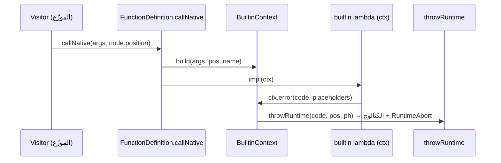

# تصميم BuiltinContext (تفصيلي)

> الواجهة الكاملة + آلية التوافق الخلفي + تغييرات نقاط الاستدعاء، مبنية على الكود الفعلي.

## 1. الأهداف وغير-الأهداف
**أهداف:**
- عقد استدعاء موحّد للدوال المضمنة يحمل: الوسائط + الموقع + أخطاء الكتالوج.
- **استبدال نظيف بلا توافق خلفي** (اللغة غير منشورة): توقيع `(BuiltinContext&)` هو الوحيد؛
  يُحذف `(args)` بالكامل.
- قابلية توسّع: إضافة قدرات لاحقاً (اسم/مكدس/مفسر) بلا تغيير التواقيع ثانيةً.

**غير-أهداف (الآن):**
- لا وصول للمفسر/GC في النسخة الأولى (الدوال المسجّلة نقيّة على الوسائط — تحقّق: لا HOF بينها؛
  map/filter مُعالَجة inline في `expression_evaluator_oop_array_methods.cpp` لا عبر `callNative`).

## 2. الواجهة الكاملة

```cpp
// shared/builtins/include/builtin_context.h  (أو interpreter/include/builtins/)
#pragma once
#include "value.h"
#include "token.h"        // Sad::Lexer::Position
#include "error_codes.h"  // Sad::Errors::ErrorCode
#include <vector>
#include <memory>
#include <map>
#include <string>
#include <string_view>

namespace Sad { namespace Builtins {

/**
 * @brief (AR) سياق استدعاء دالة مضمنة — يحمل الوسائط والموقع وأخطاء الكتالوج.
 * @brief (EN) Built-in invocation context: args, call-site position, catalog errors.
 */
class BuiltinContext {
public:
    using ValuePtr = std::shared_ptr<Data::Value>;

    BuiltinContext(const std::vector<ValuePtr>& args,
                   const Sad::Lexer::Position& pos,
                   std::string_view name) noexcept
        : args_(args), pos_(pos), name_(name) {}

    // ── الوسائط ──
    const std::vector<ValuePtr>& args() const noexcept { return args_; }
    std::size_t argCount() const noexcept { return args_.size(); }
    const ValuePtr& arg(std::size_t i) const { return args_.at(i); } // محمي بالحدود (CW-17)

    // ── الموقع ──
    const Sad::Lexer::Position& position() const noexcept { return pos_; }
    std::string_view functionName() const noexcept { return name_; }

    // ── أخطاء من الكتالوج المُولَّد (لا نص حر، CW-?) ──
    /// (AR) يبلّغ الكتالوج بموقع الاستدعاء ثم يرمي RuntimeAbort. (EN) Reports + aborts.
    [[noreturn]] void error(Sad::Errors::ErrorCode code,
                            std::map<std::string,std::string> placeholders = {}) const;

    // ── (مستقبلي — لا يُنفَّذ الآن) ──
    // const Interpreter::Core& interpreter() const;   // للدوال العليا
    // void note(...);                                 // ملاحظات إضافية
private:
    const std::vector<ValuePtr>& args_;
    Sad::Lexer::Position         pos_;
    std::string_view             name_;
};

}} // namespace Sad::Builtins
```

```cpp
// builtin_context.cpp
#include "runtime_throw.h"
void Sad::Builtins::BuiltinContext::error(
        Sad::Errors::ErrorCode code, std::map<std::string,std::string> ph) const {
    // يضيف اسم الدالة افتراضياً إن لم يُمرَّر
    if (!ph.count("func")) ph.emplace("func", std::string(name_));
    Sad::Errors::throwRuntime(code, pos_, std::move(ph));  // = الكتالوج + الموقع
}
```

## 3. تغييرات `FunctionDefinition` (توقيع واحد نظيف — لا توافق خلفي)

> **قرار المالك (2026-06-10):** اللغة **غير منشورة** → لا حاجة لتوافق خلفي. **استبدال نظيف**:
> توقيع `(BuiltinContext&)` **هو الوحيد**؛ يُحذف التوقيع القديم `(args)` بالكامل.

```cpp
using NativeCtx = std::function<ValuePtr(Builtins::BuiltinContext&)>;  // الوحيد

class FunctionDefinition {
    NativeCtx nativeImplementation_;   // (استبدل النوع القديم)
    // ...
    ValuePtr callNative(const std::vector<ValuePtr>& args,
                        const Sad::Lexer::Position& pos) const {
        if (!nativeImplementation_) return nullptr;
        Builtins::BuiltinContext ctx(args, pos, name_);
        return nativeImplementation_(ctx);
    }
};
```

`registerBuiltinFunction` يقبل `NativeCtx` فقط (يُغيَّر النوع، لا overload).

### آلية الهجرة (بلا توافق خلفي)
لأن التوقيع واحد، **كل الدوال المضمنة تُحوَّل في نفس دفعة الهجرة**؛ المشروع لا يُجمَّع حتى تكتمل
الوحدات. لإبقاء العمل قابلاً للإدارة: تُنفَّذ ستوريات EM-CPP-1..6 **متتابعةً سريعاً** (كل وحدة
تُحوَّل بالكامل)، ولا تُدمَج إلا بعد بناء أخضر شامل. (لا shim انتقالي — استبدال مباشر.)

## 4. تغييرات نقاط الاستدعاء (3 مواقع — كلها تملك موقعاً)
| الموقع | التغيير |
|--------|---------|
| `expression_evaluator_calls_dispatch.cpp:526` | `func->callNative(valuePtrs, node.position)` |
| `interpreter_core.cpp:645` | تمرير الموقع المتاح (أو موقع الاستدعاء الحالي) |
| `expression_evaluator_oop_string_map_methods.cpp:578` | تمرير موقع العقدة |

> **حالة حدّية:** إن تعذّر موقع حقيقي في موقع ما، يُمرَّر موقع «اصطناعي» (سطر 0) مؤقتاً مع TODO —
> لكن المواقع الثلاثة تملك عقدة استدعاء بموقع، فالحالة نادرة.

## 5. نمط ترحيل دالة مضمنة (للستوريات EM-CPP-1..6)
```cpp
// قبل:
auto sqrt_fn = [](const std::vector<ValuePtr>& args) -> ValuePtr {
    if (args.size()!=1 || !args[0]->isNumeric())
        throw std::runtime_error("جذر: يتطلب رقماً / sqrt requires a number");
    ...
};
mgr.registerBuiltinFunction(std::string(Bn::Math::SQRT), sqrt_fn);

// بعد:
auto sqrt_fn = [](Builtins::BuiltinContext& ctx) -> ValuePtr {
    if (ctx.argCount()!=1 || !ctx.args()[0]->isNumeric())
        ctx.error(Sad::Errors::ErrorCode::RUN_BUILTIN_REQUIRES_ARG);  // {func} محقون؛ كتالوج + موقع
    ...
};
mgr.registerBuiltinFunction(std::string(Bn::Math::SQRT), sqrt_fn);  // overload الجديد
```

## 6. تسلسل التنفيذ (mermaid)


## 7. قابلية التوسّع المستقبلية (بلا تغيير تواقيع)
- وصول المفسر للدوال العليا: إضافة حقل/دالة في `BuiltinContext` لاحقاً.
- تتبّع المكدس، فهرس الوسيط المخطئ، تحذيرات — كلها تُضاف للسياق.
- **توحيد المترجم:** `BuiltinContext` يمكن جعله واجهة (interface) يحقّقها المفسر والمترجم.

## 9. نطاق المترجم (sadc) — مختلف عن المفسر

`BuiltinContext` **خاص بالمفسر** (الدوال المضمنة lambdas). **المترجم لا يستدعي lambdas — يولّد
LLVM IR** (`MathBuiltinsCodeGen`...). فآلية أخطائه مختلفة:

| نوع خطأ المترجم | المسار | الطبقة |
|----------------|--------|--------|
| **وقت الترجمة** (عدد وسائط/نوع خاطئ أثناء codegen) | `reportError` (11) → `reportFromCatalog(ErrorCode)` | Tier 1 (غني) — EM-CPP-7 |
| **الكود المُترجَم — هدف مُضيف** | runtime مُضيف يرندر عبر `ErrorCatalog` | **Tier 1 (غني، كالمفسر)** |
| **الكود المُترجَم — freestanding** | `sad_panic(code,...)` + جدول `const char*` | Tier 2 (أدنى) — EM-CPP-T2 |

**الخلاصة (مصحَّحة):** الطبقة تُحدَّد بـ**توفّر STL** لا بمفسر/مترجم. **المترجم على هدف مُضيف يُنتج
رسائل غنية كالمفسر.** التقييد **فقط** على **freestanding**. codegen يُصدر نداءً موحَّداً
`sad_runtime_error(code,...)`؛ الـruntime المربوط يقرّر الغنى (مُضيف→كتالوج / freestanding→جدول).
راجع `ERROR_SYSTEM_GUIDE.md` §3-ب.

## 8. معايير قبول التصميم (لـ EM-CPP-0)
- `BuiltinContext` + `callNative(args, pos)` + overload التسجيل.
- التوقيعان يعملان (اختبار: دالة جديدة `(ctx)` + دالة قديمة `(args)`).
- `ctx.error` يرندر من الكتالوج بموقع الاستدعاء.
- 3 نقاط الاستدعاء تمرّر الموقع. بناء أخضر + لا تراجع.
