# دليل نظام الأخطاء في لغة ص

> توثيق شامل: المعمارية، تدفّق البيانات، الآليات الأربع للرمي، فئة الأخطاء الداخلية (ICE)،
> ودور كل ملف — بأدلة من الكود الفعلي. **المصدر الموحَّد:** `language-truth/errors/*.yaml`
> (يُولَّد منه كتالوج C++). **بعد ترحيل EM-CPP: كل خطأ يراه المستخدم — لغوياً أو داخلياً —
> يأتي من YAML؛ لا نصّ رسالة مكتوب يدوياً في C++** (الاستثناء الوحيد: "Debugger disconnected"
> وهو تدفّق تحكّم لا رسالة خطأ).

---

## 1. نظرة عامة — الفكرة الجوهرية

نظام الأخطاء **مدفوع بالبيانات وموحَّد**:
- **تعريفات الأخطاء** تعيش في YAML (مصدر واحد، **8 فئات / 84 رمزاً**) → تُولَّد إلى كتالوج C++.
- **كل موقع خطأ** يُشير إلى **رمز `ErrorCode`** (لا نص خام) + `placeholders` تحمل **بيانات فقط**
  (أسماء/قيم/مُعرِّفات) — لا نثراً.
- **الكتالوج** يرندر الرسالة النهائية ثنائية اللغة حسب مستوى الشرح واللغة.
- **المنسّق** يطبع التشخيص (caret + ألوان + تلميحات).

**القاعدة الذهبية:** نص الرسالة يعيش في YAML **وحده**. حتى أخطاء المترجم الداخلية (ICE)
وأخطاء المفسر الداخلية تأتي من الكتالوج، موسومةً «خطأ مترجم/مفسر — أبلِغ»، مع شرح للمطوّر.

| الفئة (YAML) | البادئة | عدد | أمثلة |
|------|:---:|:---:|------|
| lexical | LEX | 6 | حرف غير صالح، سلسلة غير منتهية |
| syntactic | SYN | 8 | فاصلة منقوطة ناقصة |
| semantic | SEM | 9 | متغير/دالة غير معرّف، إسناد لثابت |
| runtime | RUN | 52 | فهرس خارج النطاق، قسمة على صفر، خطأ دالة مضمنة |
| ownership | OWN | 0* | (مُصنَّفة تحت runtime في الكود) |
| import | IMP | 1* | (مرجع) |
| io | IO | 1* | (مرجع — RUN007) |
| **internal** | **INT** | **9** | **ICE: IR فارغ، operands، مرجع غير معرّف، مكدّس النطاقات** |

\* فئات مرجعية (رموزها الفعلية تحت runtime).

---

## 2. تدفّق البيانات: من YAML إلى الشاشة

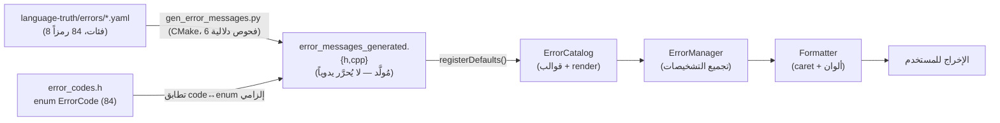

> **دليل:** `scripts/codegen/gen_error_messages.py` → `shared/errors/generated/error_messages_generated.cpp`
> (`registerDefaults` + `kErrorMessages`). مربوط في `cmake/codegen.cmake`. يُستدعى من
> `error_manager.cpp` عند التهيئة. **المولّد يفرض:** كل code في enum، تطابق id↔prefix،
> تفرّد، تغطية كاملة (V5: 9 اختبارات حارسة في `test_gen_error_messages_v5.py`).

---

## 3. الآليات الأربع للرمي/الإبلاغ — حسب الطبقة

بعد EM-CPP صار للنظام **أربع نقاط دخول موحَّدة**، كلها تنتهي إلى `ErrorCatalog`:

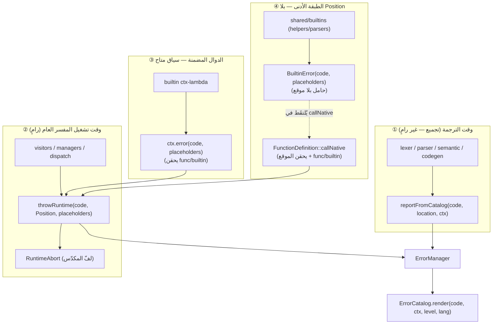

| # | الآلية | الموقع | متى | استشهاد |
|---|--------|--------|-----|---------|
| ① | `reportFromCatalog` | lexer/parser/semantic/**codegen** | تجميع (له `SourceLocation`) | `error_manager.h:387` |
| ② | `throwRuntime` | visitors/managers (له `Position`) | تشغيل عام | `runtime_throw.h:63` |
| ③ | **`ctx.error`** | lambdas الدوال المضمنة (252 موقعاً) | تشغيل، السياق متاح | `builtin_context.h:63` |
| ④ | **`BuiltinError`** carrier | shared/builtins الأدنى (47 موقعاً) | تشغيل، لا موقع | `builtin_error.h` |

> **التوزيع بعد الترحيل:** الدوال المضمنة **100%** من الكتالوج (252 `ctx.error` + 47 `BuiltinError`).
> codegen المترجم **100%** (233 موقع → رموز ICE). الرمي الخام الوحيد المتبقّي: 5×
> "Debugger disconnected" (تدفّق تحكّم، يُلتقَط بـ`catch(runtime_error)` — ليس رسالة خطأ).

### نهاية دورة الحياة: من يلتقط ويطبع؟ (مهم)

`throwRuntime` يفعل **شيئين**: (1) يُبلّغ `ErrorManager` فوراً (الرسالة تُسجَّل)، ثم
(2) يرمي `RuntimeAbort` — وهو **إشارة فارغة** للفّ المكدّس فقط (لا يحمل الرسالة).

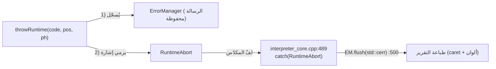

> **دليل:** `interpreter_core.cpp:489` يلتقط `RuntimeAbort` (إشارة فارغة — الخطأ مُسجَّل سلفاً)
> ثم `EM.flush(std::cerr)` @ `:500` يطبع. هذا يفصل **التسجيل** (وقت الرمي) عن **العرض** (أعلى المكدّس).

### أي آلية أختار؟ (شجرة قرار)

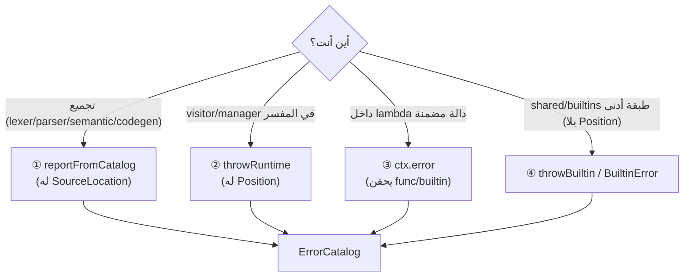

### 3-أ. لماذا آليتان للدوال المضمنة (③ و ④)؟

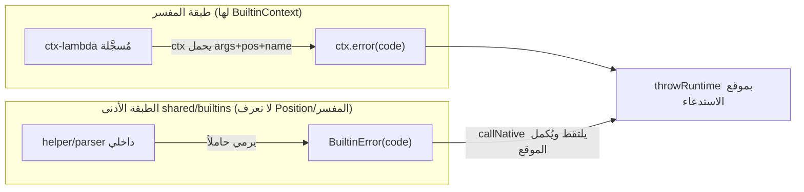

- **③ `ctx.error`**: داخل lambda مُسجَّلة تملك `BuiltinContext` (الوسائط + الموقع + الاسم).
  تحقن تلقائياً `{func}` و`{builtin}` ثم تستدعي `throwRuntime`.
- **④ `BuiltinError`**: الطبقة الأدنى (`shared/builtins`) **لا** تملك `Position` ولا `BuiltinContext`
  (طبقية). ترمي حاملاً `(code + placeholders)` بلا موقع؛ **نقطة الاختناق** `callNative` تلتقطه
  وتُكمل الموقع + تحقن `func/builtin` ثم `throwRuntime`. (انظر `function_manager.h:213-224`.)
  ⚠️ **عُرف**: أي `catch(std::exception)` واسع يلفّ استدعاء دالة مضمنة يجب أن يُعيد رمي
  `BuiltinError` أولاً (موثَّق في `builtin_error.h`).

### تسلسل خطأ دالة مضمنة (مثال `طول()` بلا وسائط)

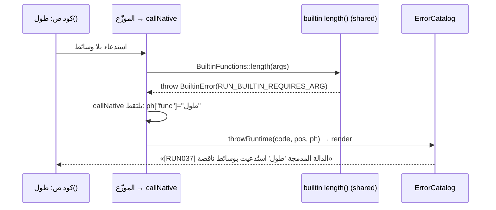

---

## 3-ب. طبقتا الأخطاء — حسب **البيئة** لا حسب مفسر/مترجم

> **مبدأ:** الطبقة تُحدَّد بـ**توفّر STL/runtime** لا بكون المسار مفسراً أم مترجماً.
> **المترجم على هدف مُضيف يحصل على الرسائل الغنية مثل المفسر تماماً.** التقييد **فقط** في **freestanding**.

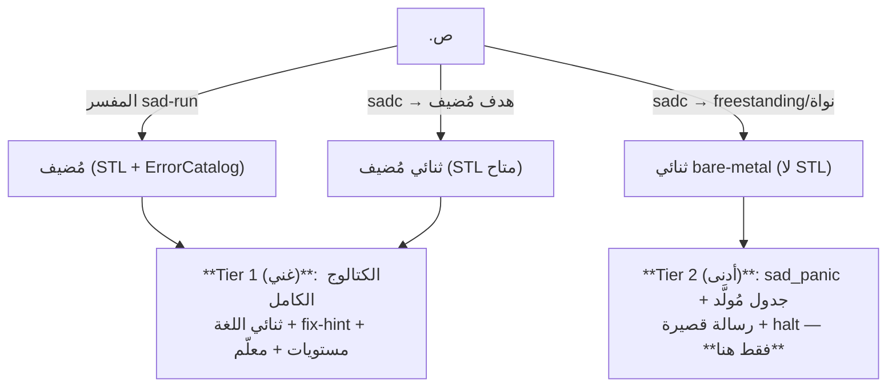

`ErrorCatalog::render` يحتاج `std::string`+`std::map`+heap — غير موجودة على bare-metal،
فأقصى ممكن هناك كتابة بايتات على VGA/UART + `hlt`. **هذا القيد يخصّ freestanding وحده.**

---

## 4. فئة الأخطاء الداخلية (ICE) — internal.yaml

أخطاء «لا ينبغي أن تحدث» في المترجم أو المفسر. **تأتي من الكتالوج** (لا نصّ يدوي)، موسومةً
صراحةً كـICE مع **شرح موجَّه للمطوّر** (لماذا + كيف يُصلحها)، و`{detail}` يحمل **مُعرِّفاً** فقط.

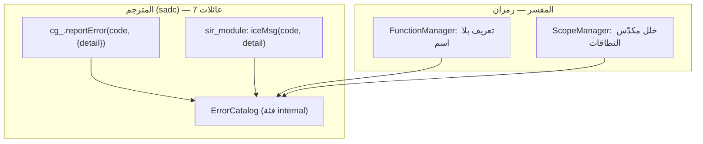

| الرمز | id | متى |
|------|:--:|-----|
| INT_COMPILER_NULL_IR | INT001 | عقدة IR فارغة في codegen |
| INT_COMPILER_INVALID_OPERANDS | INT002 | عدد معاملات تعليمة خاطئ |
| INT_SIR_OPERAND_RESOLVE | INT003 | تعذّر حلّ معامل (SSA/value map) |
| INT_SIR_UNDEFINED_REF | INT004 | سجلّ/عام/دالة/صنف غير معرّف |
| INT_SIR_FIELD_LAYOUT | INT005 | تخطيط حقل/بنية صنف |
| INT_BACKEND_EMIT | INT006 | فشل إصدار LLVM (target/file) |
| INT_SIR_TYPE_CONSTRAINT | INT007 | انتهاك قيد نوع في codegen |
| INT_INTERP_NAMELESS_DEFINITION | INT008 | تسجيل دالة بلا اسم (مفسر) |
| INT_INTERP_SCOPE_STACK | INT009 | إزالة النطاق العام / مكدّس فارغ (مفسر) |

> **دليل:** `compiler/src/backend/llvm/llvm_codegen_context.cpp` (overload `reportError(ErrorCode, placeholders)`)
> · `compiler/src/frontend/sir_module.cpp` (`iceMsg`) · `interpreter/src/managers/*` (`throwRuntime(INT_*)`).

### مبدأ `{detail}`: بيانات لا نثر

`placeholders` تحمل **مُعرِّفات/قيماً** فقط؛ الجملة الوصفية كلها في YAML. مثال من ترحيل codegen:

```cpp
// ❌ قبل (نثر إنجليزي مكتوب يدوياً في C++):
cg_.reportError("Add instruction requires 2 operands");
// ✅ بعد ({detail} = مُعرِّف التعليمة فقط؛ الجملة في internal.yaml):
cg_.reportError(::Sad::Errors::ErrorCode::INT_COMPILER_INVALID_OPERANDS, {{"detail", "Add"}});
```

---

## 4-ب. مكوّنات العرض وتجربة المستخدم (shared/errors)

طبقة العرض الذكية تحوّل الرمز + السياق إلى تشخيص تعليمي. (الكتالوج يرندر النص؛ هذه تُحسّن العرض.)

| الملف | الدور |
|------|------|
| `formatter.{h,cpp}` | طباعة موحَّدة: caret `^` + ألوان + ترتيب |
| `explanation_level.{h,cpp}` | مستوى الشرح (مبتدئ/خبير) + لغة الإخراج |
| `teacher_mode` (`smart_teacher_mode.cpp`) | وضع المعلّم — شروحات تعليمية مفصّلة |
| `error_hints.{h,cpp}` | نصائح للمبتدئين |
| `fix_suggestions` (`smart_fix_suggestions.cpp`) | اقتراحات إصلاح للأخطاء الشائعة |
| `suggestions` (`smart_suggestions.cpp`) | اقتراح ذكي بتشابه نصّي للأسماء (did-you-mean) |
| `type_explanations` (`smart_type_explanations.cpp`) | شرح تعليمي لعدم تطابق الأنواع |
| `cascade_prevention` (`smart_cascade_prevention.cpp`) | منع تسلسل الأخطاء (جذر واحد بدل أعراض) |
| `error_recovery` (`smart_error_recovery.cpp`) | استرداد المحلل النحوي لمواصلة التحليل |
| `diagnostic.{h,cpp}` · `multi_error.h` | نموذج التشخيص (fix-its/notes) + جمع أخطاء متعددة |

---

## 5. آلية الدوال المضمنة — التوقيع الموحَّد (BuiltinContext)

بعد EM-CPP، **كل** دالة مضمنة تُسجَّل بتوقيع موحَّد `(BuiltinContext& ctx)` — حُذف النوع
القديم `(args)` بالكامل (لا shim).

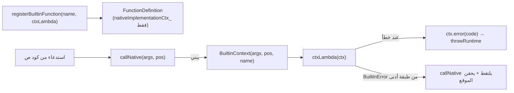

> **علة dispatch حقيقية أُصلِحت (PR #31):** `hasNativeImplementation()` كان يفحص العضو القديم
> فقط → الدوال المُحوّلة لـctx تُرى «غير أصلية» فتفشل أولوية fallback في الموزّع (SEM004).
> الإصلاح: يفحص `nativeImplementationCtx_`. (`function_manager.h`.)

---

## 6. كيف تستعمل خطأً موجوداً (حسب الطبقة)

> اختر الرمز من `error_codes.h`، ومرّر `placeholders` (**بيانات فقط**). **لا تكتب نصاً.**

### أ) المفسر — visitor/manager (له `Position`)
```cpp
#include "runtime_throw.h"
Sad::Errors::throwRuntime(
    Sad::Errors::ErrorCode::RUN_INDEX_OUT_OF_RANGE,
    node.position,
    {{"index", std::to_string(i)}, {"length", std::to_string(n)}});
```

### ب) المترجم/المعجمي/النحوي (تجميع — له `SourceLocation`)
```cpp
#include "error_manager.h"
Sad::Errors::ErrorManager::getInstance().reportFromCatalog(
    Sad::Errors::ErrorCode::SYN_MISSING_SEMICOLON, location, ctx);
```

### ج) دالة مضمنة (لها `BuiltinContext`)
```cpp
// داخل ctx-lambda — يحقن func/builtin تلقائياً:
if (ctx.argCount() < 1)
    ctx.error(Sad::Errors::ErrorCode::RUN_BUILTIN_REQUIRES_ARG);
```

### د) طبقة shared/builtins الأدنى (لا Position)
```cpp
#include "builtin_error.h"
if (args.empty())
    Sad::Errors::throwBuiltin(Sad::Errors::ErrorCode::RUN_BUILTIN_REQUIRES_ARG);
```

### هـ) خطأ مترجم داخلي (ICE) في codegen
```cpp
cg_.reportError(::Sad::Errors::ErrorCode::INT_COMPILER_INVALID_OPERANDS,
                {{"detail", "Add"}});   // {detail} = مُعرِّف التعليمة فقط
```

---

## 7. كيف تضيف خطأً جديداً (الإجراء الكامل)

> ⚠️ يُمنع تحرير `generated/` يدوياً. ابدأ من YAML + enum.

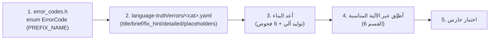

1. **الرمز** في `error_codes.h`: `<PREFIX>_<NAME>` (PREFIX ∈ LEX/SYN/SEM/RUN/OWN/IMP/IO/**INT**) + تعليق `id`.
2. **التعريف** في `language-truth/errors/<category>.yaml` (انسخ بنية خطأ شقيق):
   ```yaml
   - code: RUN_MY_NEW_ERROR
     id: RUN099                     # ^[A-Z]{2,3}\d{3}$
     category: runtime
     title:    { ar: "...", en: "..." }
     brief:    { ar: "... {param}", en: "... {param}" }
     fix_hint: { ar: "...", en: "..." }
     placeholders: [param]          # بيانات فقط
     detailed: { ar: "...", en: "..." }
   ```
   ⚠️ اقتبس أي قيمة فيها `:` (مثل "Workaround:") لتفادي خطأ YAML.
3. **أعد البناء** — `sad_error_messages_codegen` يُعيد التوليد ويفرض الفحوص.
4. **أطلِق** عبر الآلية المناسبة (القسم 6).
5. **اكتب اختباراً** (وحدة في V5 و/أو سلوكي في `tests/builtin_errors/`).

---

## 8. دروس مستفادة (تصحيحات ذاتية — GR-01)

أثناء الترحيل صُحّحت ثلاثة تشخيصات خاطئة بشفافية — مفيدة لمن يصحّح النظام:
- **«علة arity»** → كانت **module-gating سليماً** (الدوال المُبوّبة تُحمَّل بـ`استورد`).
- **«علة الاستيراد»** → الاستيراد يعمل؛ الخطأ كان **أسماء دوال خاطئة في الاختبار** (لوغ ≠ لوغاريتم).
- **«249 reportFromCatalog في المترجم»** → كان **صفراً** قبل EM-CPP-7؛ المترجم لم يكن يستخدم الكتالوج.

**العلة الحقيقية الوحيدة:** `hasNativeImplementation` (القسم 5).

---

## 8-ب. منع تسرّب placeholders (دفاع 4 طبقات)

**العلّة المكتشَفة (مؤكَّدة حيّاً):** `ErrorCatalog::substitute` كان يُبقي `{key}` حرفياً عند نقص
placeholder («keep as-is to surface bugs») — لكنه يَطفو **للمستخدم**. مثال: `ل[10]` →
«...خارج نطاق `{container}`».

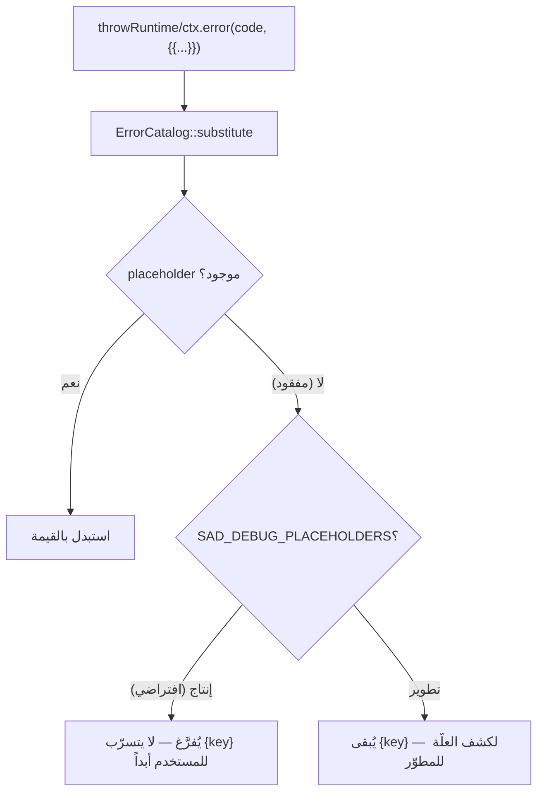

| الطبقة | الآلية | الدليل |
|--------|--------|--------|
| **1 — حاجز render** | `substitute` يُفرّغ المفقود افتراضياً؛ `SAD_DEBUG_PLACEHOLDERS` يُبقيه للمطوّر | `error_catalog.cpp::substitute` |
| **2 — تمييز اختياري** | `{suggestion_clause}` ونحوها لواحق تُلحَق-أو-تُترَك → يكفيها الحاجز | — |
| **3 — إثراء البيانات** | كل موقع يمرّر placeholders المطلوبة بقيمها الحقيقية (77/77) + تبسيط briefs مُفرطة التحديد | `runtime.yaml` + `expression_evaluator_*` |
| **4 — حارس سلوكي** | يُشغّل مسارات خطأ ويتأكّد لا `{key}` يتسرّب (regex `\{[a-z_]+\}`) | `tests/builtin_errors/test_no_placeholder_leaks.py` |

**القاعدة للمطوّر:** الحاجز **شبكة أمان لا رخصة إهمال** — مرّر **كل** placeholder يطلبه الـbrief
(`substitute` يحجب التسرّب، لكن الفراغ يُضعف الرسالة). ولا تستخدم رمزاً يتطلّب placeholders إضافية
دون تمريرها (مثل `RUN_TYPE_CHECK_FAILED`: `{expected}`/`{actual}`)؛ لفحص أرغ مضمنة استخدم
`RUN_BUILTIN_REQUIRES_ARG` (يكفيه `{func}` المحقون). **للتشخيص:** شغّل بـ`SAD_DEBUG_PLACEHOLDERS=1`
لرؤية أي `{key}` مفقود.

> **مبدأ التصميم:** صُمّمت بعض الـbriefs مُفرطة التحديد (placeholders أكثر مما تمرّره المواقع).
> الإصلاح الأنظف غالباً **تبسيط الـbrief** للمفاتيح المُمرَّرة بثبات (يُصلح عشرات المواقع بتعديل
> YAML واحد) لا تعديل كل موقع.

---

## 9. مراجع

- **المعمارية (BuiltinContext):** `docs/BUILTIN_CONTEXT_DESIGN.md` + `decisions/ADR-EM-CPP-1-BUILTIN-CONTEXT.md`.
- **الإبيك:** `epics/EPIC-EM-CPP-MIGRATION.md` · **التقدّم:** `status/em-cpp-progress.md`.
- **التكامل (المُولَّد = المصدر الحيّ):** `status/implementation_status.md` (EM-3).
- **ملفات مفتاحية:** `shared/errors/include/{error_codes.h, runtime_throw.h, builtin_error.h}` ·
  `interpreter/include/builtins/builtin_context.h` · `interpreter/include/managers/function_manager.h` ·
  `language-truth/errors/internal.yaml`.
