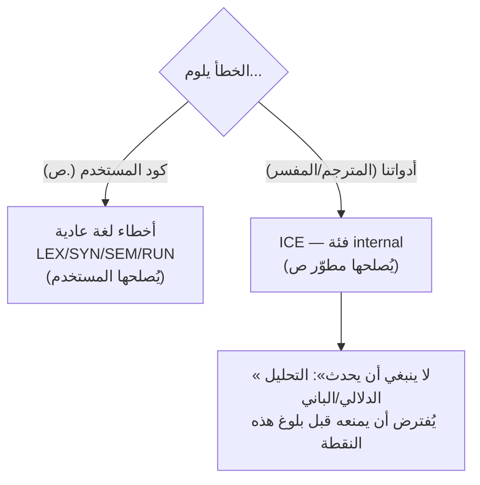
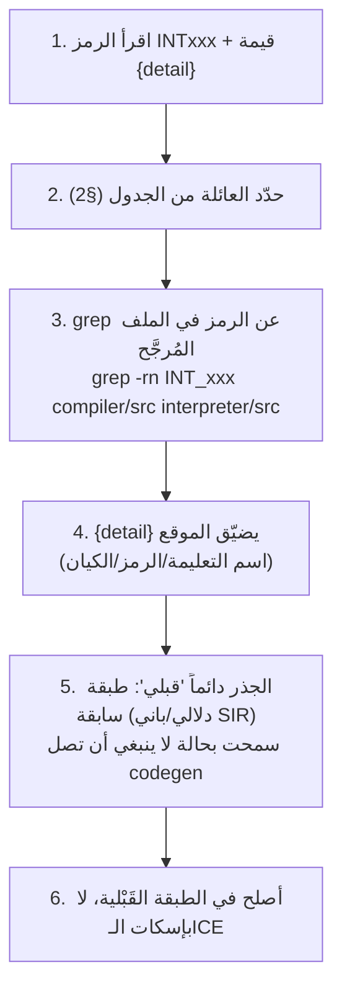
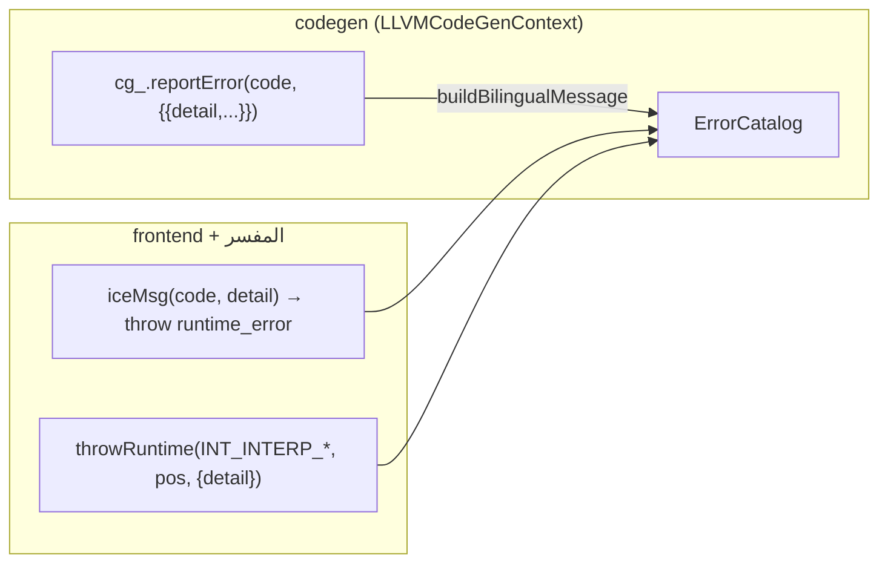

# دليل مطوّري ICE (Internal Compiler/Interpreter Error)

> **لمن؟** لمطوّري لغة ص الذين يصادفون خطأً داخلياً أثناء العمل على المترجم أو المفسر.
> **ليس** لمستخدمي اللغة. أخطاء ICE تعني **خللاً في أدواتنا** لا في كود `.ص`.

---

## 1. ما هو ICE ولماذا فئة منفصلة؟



**المبدأ (saleh):** حتى أخطاء أدواتنا تأتي من YAML (`internal.yaml`) — موسومةً «خطأ مترجم/مفسر —
أبلِغ» مع شرح موجَّه **للمطوّر** (لماذا + كيف يُصلح)، و`{detail}` يحمل **مُعرِّفاً** فقط (لا نثراً).

**كيف يبدو لك؟**
```
❌ error [INT002]: خطأ داخلي في المترجم (operands غير صالحة): Add — يُرجى الإبلاغ
💡 hint: تحقّق من باني SIR للتعليمة Add (عدد المعاملات المُصدَر) وأن التحليل الدلالي يفرض الـarity...
```
الرمز `INTxxx` + قيمة `{detail}` (هنا `Add`) يحدّدان **أين** تبدأ.

---

## 2. خريطة الرموز التسعة — أين تُطلَق وكيف تُشخَّص

> أرقام «مواقع الإطلاق» = **تكرارات** فعلية في الكود (`grep -rho`، تدقيق 2026-06-11)؛ بين قوسين
> عدد الملفات. مفيدة لقياس انتشار العائلة.

| الرمز | id | مواقع الإطلاق (ملفات) | المجلد الغالب | الجذر النمطي | أول خطوة تشخيص |
|------|:--:|:--:|---------|-------------|---------------|
| INT_COMPILER_NULL_IR | INT001 | 14 (6) | codegen + sir_module | عقدة IR/SIR = nullptr | تتبّع `{detail}` (الكيان الفارغ) لمسار بنائه |
| INT_COMPILER_INVALID_OPERANDS | INT002 | 132 (31) | arith/agg/builtins | عدد معاملات تعليمة خاطئ | افحص باني SIR للتعليمة `{detail}` (الـarity) |
| INT_SIR_OPERAND_RESOLVE | INT003 | 36 (14) | arith/array/cf | معامل غير موجود في valueMap (SSA) | تحقّق من تعريف-قبل-استخدام للقيمة المصدر |
| INT_SIR_UNDEFINED_REF | INT004 | 17 (8) | cf/functions/mem | سجلّ/عام/دالة/صنف غير مُسجَّل | افحص جداول الرموز + ترتيب الخفض |
| INT_SIR_FIELD_LAYOUT | INT005 | 9 (2) | oop/enum | بنية صنف/أسماء حقول غير مُسجَّلة | تحقّق من تسجيل تخطيط الصنف قبل emitLoad/Store |
| INT_BACKEND_EMIT | INT006 | 39 (6) | directives/output/init | فشل LLVM target/ملف الإخراج | تحقّق من تهيئة TargetMachine + صلاحيات الملف |
| INT_SIR_TYPE_CONSTRAINT | INT007 | 1 (1) | cf_return_switch | نوع معامل يخالف القيد (مثل switch‑int) | افحص فحص الأنواع قبل codegen |
| INT_INTERP_NAMELESS_DEFINITION | INT008 | 3 (1) | function_manager | تسجيل دالة باسم فارغ | افحص بناء الاسم قبل registerBuiltinFunction |
| INT_INTERP_SCOPE_STACK | INT009 | 2 (1) | scope_manager | إزالة النطاق العام / مكدّس فارغ | دقّق توازن enterScope/exitScope |

> **ملاحظة توزيع:** `INVALID_OPERANDS` (132) و`BACKEND_EMIT` (39) و`OPERAND_RESOLVE` (36) هي
> الأكثر شيوعاً — تركّز جهد المتانة على بناة SIR للحساب + تهيئة الواجهة الخلفية.

---

## 3. مسار التشخيص العملي



> **قاعدة ذهبية:** ICE عَرَض لا مرض. لا «تُسكِته» بحارس عند موقع الإطلاق — بل أصلح الطبقة التي
> سمحت بالحالة (التحليل الدلالي / باني SIR / ترتيب الخفض). إبقاء الـICE حارساً دفاعياً مقصود.

### مثال محلول: `[INT003] ... Operands` في `arith_main.cpp`
1. الرمز `INT003` = `INT_SIR_OPERAND_RESOLVE`، `{detail}` يشير لعائلة الحساب.
2. `grep -rn INT_SIR_OPERAND_RESOLVE compiler/src/backend/llvm/builders/arithmetic/` → الموقع.
3. المعنى: عند خفض تعليمة حسابية، لم تُوجَد قيمة LLVM لأحد معاملاتها في `valueMap`.
4. الجذر النمطي: القيمة المصدر **لم تُولَّد بعد** أو **لم تُسجَّل** (انتهاك SSA) — ترتيب خفض خاطئ.
5. الإصلاح: تأكّد أن باني SIR يُولّد المعامل ويُسجّله في `valueMap` **قبل** التعليمة المستهلِكة.

---

## 4. الآليتان اللتان تُطلِقان ICE



- **codegen**: overload `LLVMCodeGenContext::reportError(ErrorCode, placeholders)` —
  يرندر من الكتالوج ويرفع علم الأخطاء (`llvm_codegen_context.cpp`).
- **sir_module (frontend)**: مساعِد `iceMsg(code, detail)` يرندر ويرمي (`sir_module.cpp`).
- **المفسر (managers)**: `throwRuntime(INT_INTERP_*, Position{}, {{"detail", ...}})`.

> `{detail}` دائماً **مُعرِّف** (اسم تعليمة/رمز/كيان) — لا جملة. الجملة في `internal.yaml`.

---

## 5. كيف تضيف رمز ICE جديداً

نفس إجراء أي خطأ (راجع `ERROR_SYSTEM_GUIDE.md §7`) لكن في فئة `internal`:

1. **الرمز** في `error_codes.h`: `INT_<SUBSYSTEM>_<NAME>` + تعليق `id` (INT0xx التالي).
2. **التعريف** في `language-truth/errors/internal.yaml` — اجعل المحتوى **موجَّهاً للمطوّر**:
   ```yaml
   - code: INT_MY_NEW_ICE
     id: INT010
     category: internal
     title:    { ar: "خطأ داخلي في المترجم — ...", en: "Internal compiler error — ..." }
     brief:    { ar: "... ({detail}) — يُرجى الإبلاغ", en: "... ({detail}) — please report" }
     placeholders: [detail]
     fix_hint: { ar: "لمطوّر المترجم: ... للمستخدم: علّة مترجم — أبلِغ.", en: "Compiler dev: ..." }
     detailed: { ar: "شرح الثابت المنتهَك + الطبقة القَبْلية المسؤولة", en: "..." }
   ```
3. **أطلِق**: `cg_.reportError(INT_MY_NEW_ICE, {{"detail", "<مُعرِّف>"}})` أو `iceMsg`/`throwRuntime`.
4. **حارس V5**: أضِف الرمز لـ`test_em_cpp7_internal_ice_codes` (يتحقّق: فئة internal + `{detail}` + وسم «مترجم/مفسر»).

---

## 6. لماذا لا تُصنَّف الـICE كأخطاء مستخدِم (LEX/SYN/SEM/RUN)؟

- الكتالوج اللغوي (RUN/SEM...) **يلوم كود `.ص`** ويُرشد المستخدم لإصلاحه.
- ICE يلوم **أدواتنا** — إرشاد المستخدم لإصلاح برنامجه هنا **مُضلِّل**.
- الفصل يسمح للمستخدم بالتمييز فوراً: «هذا ليس خطئي — أبلِغ عنه».

> **سابقة (GR-01):** أخطاء المستخدم الحقيقية (دالة/طريقة غير موجودة، تعديل ثابت) رُحِّلت لرموز
> RUN/SEM؛ أمّا الفحوص الدفاعية القَبْلية (operands/null IR/مكدّس النطاقات) فلـICE. التمييز جوهري.

---

## 7. مراجع
- **الكتالوج:** `language-truth/errors/internal.yaml` (9 رموز).
- **المعمارية الكاملة:** `ERROR_SYSTEM_GUIDE.md` (§3 الآليات الأربع، §4 فئة ICE).
- **آليات الإطلاق:** `compiler/src/backend/llvm/llvm_codegen_context.cpp` ·
  `compiler/src/frontend/sir_module.cpp` · `interpreter/src/managers/{scope,function}_manager.cpp`.
- **الحارس:** `scripts/codegen/test_gen_error_messages_v5.py::test_em_cpp7_internal_ice_codes`.
