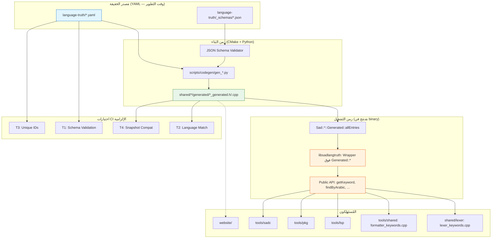
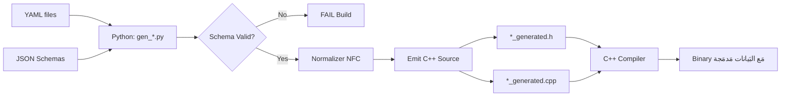

# المعمارية التَقنية لنظام Language Truth (V5)

> هذه الوثيقة تُكمِّل [STRATEGY.md](STRATEGY.md). الاستراتيجية تُجيب "ماذا ولماذا"؛ هذه الوثيقة تُجيب **"كيف"** — بدقة هندسية كافية للتَنفيذ.
>
> **مَرجع البنية والقَرارات الموحَّدة:** [ADR-DOCS-V4-002](decisions/ADR-DOCS-V4-002-UNIFIED-STRUCTURE.md) + [ADR-DOCS-V4-003](decisions/ADR-DOCS-V4-003-CODEGEN-INTEGRATION.md) — يَفصلان أي تَعارُض داخلي. **ADR-003 يَتَجاوَز قَرارات ADR-002 (3, 5, 7, 8).**
>
> **تَحديث جَوهَري V5:** بَعد فَحص البَنية القائمة في المَشروع (`scripts/codegen/`, `data/language/`, `shared/lexer/generated/`)، اتُّخِذ قَرار بِالتَكامُل مع نِظام **Codegen Python → C++ Generated** المَوجود بدلاً من إنشاء نِظام `yaml-cpp` runtime مُوازِ.
>
> **نَطاق هذه الوثيقة:** البنية التَقنية لكل ما **نُسلِّمه نحن** (Truth + Python tools + Generated C++ + Library wrapper + Tests).
> **خارج هذا النطاق:** كيف يَستخدم أي فَريق أداة (LSP/Website/Formatter) ما نُقدِّمه — هذا قَرار كل فَريق.

---

## 0. خَريطة المُكوِّنات



**النَقاط الجَوهَرية:**

1. **YAML هو SoT فِقط وقت التَطوير** — لا يُحَمَّل وقت التَشغيل
2. **Python tools** (`gen_keywords.py`, `gen_builtins.py`, `gen_errors.py`, ...) تَقرَأ YAML وتُنتِج C++ Generated أَثناء CMake
3. **C++ Generated** يَصبَح جُزءاً من binary — `constexpr` حيثُما أَمكَن
4. **libsadlangtruth** هو wrapper API نَظيف فَوق `Generated::*` (لا parsing، لا I/O)
5. **صِفر اعتمادات runtime** — مَدمَج في binary
6. **Freestanding compatible** — يَعمَل في kernel/embedded

---

## 1. بنية مُجلَّد `language-truth/` (V5 — مُتَكامِل مع gen_*.py)

### 1.1 الهَيكل الكامل

```
language-truth/                               ← جذر Living Docs (انتقالياً موازي لـ data/language/)
├── README.md                                 ← نُقطة بَدء لأي فَريق أداة
├── VERSIONING.md                             ← سياسة Semantic Versioning للـ schemas
│
├── _schemas/                                 ← JSON Schemas (Draft 2020-12)
│   ├── keywords.schema.json                  ← مَوجود (data/language/keywords.schema.json)
│   ├── builtin_function.schema.json          ← مَوجود
│   ├── operator.schema.json                  ← جَديد
│   ├── directive.schema.json                 ← جَديد
│   ├── type.schema.json                      ← جَديد
│   ├── grammar_rule.schema.json              ← جَديد
│   ├── error.schema.json                     ← جَديد
│   ├── stdlib_module.schema.json             ← جَديد
│   └── stdlib_function.schema.json           ← جَديد
│
├── keywords.yaml                             ← مَلف واحِد (مُتَوافِق مع gen_keywords.py)
│                                              ← v5.0 = v4.1 + subcategory field
│                                              ← ~74 كَلِمة (40 محجوزة + 25 سياقية + 9 builtin_types)
│
├── builtins/                                 ← مُجَلَّد (gen_builtins.py يَتَوقَع هذا)
│   ├── core.yaml                             ← دوال أساسية (اطبع، طول، نوع، ...)
│   ├── concurrency.yaml                      ← قناة، مجموعة_انتظار، قفل، ...
│   ├── types.yaml                            ← TypeCtors (رقم، نص، عشري، ...)
│   └── _index.yaml                           ← آلي
│
├── operators.yaml                            ← مَلف واحِد لِكُل العَوامل (~40 + أَسبقية/تَرابط)
│
├── type_methods.yaml                         ← مَوجود (80 method, 7 targets — نَقل فقط)
│
├── directives.yaml                           ← مَلف واحِد لِكُل التَوجيهات (~7)
│
├── types.yaml                                ← مَلف واحِد لِأَنواع مُدمَجة (9)
│
├── patterns.yaml                             ← أنماط المُطابَقة (~8: نطاق/بنية/ربط/OR)
│
├── grammar_constructs.yaml                   ← عقود/تزامن/ماكرو/امتداد/عمر/async/ffi (~25)
│
├── oop_constructs.yaml                       ← أصناف/بنى/تعداد/سمات/وراثة/خصائص/عوامل/قوالب (~20)
│
├── expr_constructs.yaml                      ← استيعاب/أنابيب/lambda/closure/f-string/tuple (~12)
│
├── errors/                                   ← مُجَلَّد (تَقسيم 281KB → 8 ملفات حَسب category)
│   ├── lexical.yaml                          ← LEX_* (~30 خَطأ)
│   ├── syntactic.yaml                        ← SYN_* (~50 خَطأ)
│   ├── semantic.yaml                         ← SEM_* (~40 خَطأ)
│   ├── runtime.yaml                          ← RUN_* (~30 خَطأ)
│   ├── ownership.yaml                        ← OWN_* (~20 خَطأ)
│   ├── import.yaml                           ← IMP_* (~10 خَطأ)
│   ├── io.yaml                               ← IO_* (~10 خَطأ)
│   └── internal.yaml                         ← INT_* (~10 خَطأ)
│
├── stdlib/
│   ├── modules.yaml                          ← ~10 وَحدة (gen_modules.py)
│   └── functions.yaml                        ← ~119 دالة
│
├── learning/                                 ← مُحتَوى تعليمي (lesson/exercise/example)
│   ├── lessons.yaml                          ← دروس تربط بـ Truth
│   └── exercises.yaml                        ← تمارين + أمثلة
│
└── _meta/
    ├── _index.yaml                           ← آلي (id → file path)
    └── _version.yaml                         ← v5.0
```

**القَواعِد الجَوهَرية (مُتَوافِقة مع Codegen القائم):**

1. **مَلف واحِد لكُل نِطاق** — لا تَقسيم لكُل subcategory في ملف مُنفَصِل (gen_keywords.py يَقرَأ مَلف واحِد بـ `categories:` الداخِلية)
2. **التَقسيم الدَلالي عَبر حُقول داخِلية** — `category`, `subcategory`, `roles`, `tags`
3. **errors/ مُسطَّحة في 8 ملفات** — حَسب `category` (gen_errors.py القائم يَدعَم هذا)
4. **builtins/ مُجَلَّد** — gen_builtins.py يَدعَم `--yaml file1.yaml file2.yaml`
5. **_schemas/ مُسطَّحة** — JSON Schemas Draft 2020-12

### 1.2 جِسر الانتِقال (Migration Bridge)

| المَرحَلة | المَسار | الوَصف |
|------|--------|------|
| **حالياً (Pre-V5)** | `data/language/keywords.yaml`<br>`data/language/error_messages.yaml`<br>`data/language/keywords.schema.json` | يَعمَل، 91 إدخال، gen_keywords.py مُكتَمِل |
| **V5 M0 (تَزامُن)** | `language-truth/` + symbolic links | إنشاء البَنية + رَبط مع data/language/ بـ junction/symlinks |
| **V5 M1 (تَوسعة)** | `language-truth/*.yaml` (14 نطاق: keywords, builtins, type_methods, modules, errors, operators, directives, types, patterns, grammar_constructs, stdlib, learning, oop_constructs, expr_constructs) | تَحديث/إنشاء codegen tools لِكُل نطاق |
| **V5 M2 (تَوحيد)** | `language-truth/` فَقَط | حَذف `data/language/` بَعد التَأكُّد مِن أن جَميع consumers يَعمَلون |

- **اسم الملف = ID الكيان** (مثال: `KW-FUNC-001.yaml` لكيان `KW-FUNC-001`).
- **مَجلَّد واحد لكل فِئة** — لا يُسمح بِخَلط فِئات في مُجلَّد واحد.
- **`_*` للأنظمة الداخلية** (`_schemas/`, `_meta/`) — مُتميِّزة عن البيانات.
- **لا README في المُجلَّدات الفَرعية** — كل توثيق يَعيش في الجذر.

### 1.3 نَمط تَسمية IDs (داخلي في YAML — ليس اسم المَلف)

V5 يَتَخَلَّى عن نَمط `KW-FUNC-001.yaml` كاسم مَلف لِأنه غير مُتَوافِق مع `gen_keywords.py` الذي يَقرَأ `keywords.yaml` واحد. بَدلاً من ذلك، الـ ID يُكتَب كَحَقل داخلي في كُل إدخال:

```yaml
# keywords.yaml
categories:
  reserved:
    keywords:
      - id: KW-FUNC-001          # حَقل ID داخلي (جَديد V5)
        word: "دالة"
        tokenType: KEYWORD_FUNCTION
        english: function
        subcategory: declarations
        roles: [block_opener]
      - id: KW-CLASS-001
        word: "صنف"
        tokenType: KEYWORD_CLASS
        english: class
        subcategory: declarations
        roles: [block_opener]
```

| الفِئة | البادئة | مثال (ID داخلي) |
|---|---|---|
| Keyword | `KW-` | `KW-FUNC-001`, `KW-CLASS-001` |
| Directive | `DIR-` | `DIR-SIZE-001`, `DIR-ATOMIC-001` |
| Builtin | `BI-` | `BI-PRINT-001`, `BI-LEN-001` |
| Operator | `OP-` | `OP-PLUS-001`, `OP-AND-001` |
| Type | `TY-` | `TY-NUMBER-001`, `TY-STRING-001` |
| Type Method | `TM-<TARGET>-` | `TM-ARRAY-PUSH-001`, `TM-STRING-SPLIT-001` |
| Pattern | `PAT-` | `PAT-RANGE-001`, `PAT-STRUCT-001` |
| Grammar Construct | `GC-` | `GC-CONTRACT-001`, `GC-MACRO-001` |
| OOP Construct | `OOP-` | `OOP-CLASS-001`, `OOP-TRAIT-001` |
| Expr Construct | `EX-` | `EX-COMPREHENSION-001`, `EX-PIPELINE-001` |
| Lesson | `LES-` | `LES-INTRO-001` |
| Error | `E_<LAYER>_<CTX>_<NNN>` | `E_PAR_FUNC_001`, `E_LEX_STR_001` |
| Stdlib Module | `MOD-` | `MOD-MATH-001` |
| Stdlib Function | `FN-<MOD>-<NAME>-NNN` | `FN-MATH-SQRT-001` |

**القاعدة:** كل ID فَريد عالمياً عَبر كُل ملفات `language-truth/` (ND-V4-2). اختبار `test_unique_ids.py` يَضمن ذلك.

### 1.4 مُتطلَّبات الحقول العامة (لكل إدخال)

```yaml
- id: KW-FUNC-001                            # إلزامي، فريد عالمياً
  since: "0.1.0"                              # إلزامي، Semantic Version
  status: stable                              # إلزامي: stable|experimental|deprecated
  deprecated_since: "0.5.0"                   # اختياري
  deprecation_reason_ar: "..."                # إلزامي إن deprecated
  deprecation_reason_en: "..."                # إلزامي إن deprecated
  replacement_id: "KW-OTHER-001"              # اختياري إن deprecated
```

---

## 2. مُكوِّن `libsadlangtruth` — Library C++ (Wrapper فَوق Generated::*)

### 2.1 المسؤوليات

| المسؤولية | التَفصيل |
|---|---|
| **Wrapper فَوق Generated** | كُل API يَستَهلِك `Sad::Lexer::Generated::allEntries()` و `Sad::Builtins::Generated::*` و ما يَتبَعها (مُولَّدة وقت البَناء) |
| **صِفر I/O وقت التَشغيل** | لا تَحميل YAML، لا parsing، لا cache، لا mmap |
| **API نَظيف** | `getKeyword(id)`, `findKeywordByArabic(ar)`, `findKeywordByEnglish(en)`, `findOperatorBySymbol(sym)`, `isReservedKeyword(w)`, `getKeywordsBySubcategory(sub)`, `getErrorsBySubcategory(sub)`, `getBuiltinsBySubcategory(sub)` |
| **فِهرَسة في الذاكرة** | `unordered_map<id, Entity*>` يُبنى مَرة واحِدة عِند أَول استدعاء (lazy initialization) — O(1) lookups |
| **Freestanding compatible** | لا اعتماد على `<filesystem>`, `<fstream>`, `<iostream>` — يَعمَل في kernel |
| **Thread-safe** | جَميع APIs قراءة فَقَط بَعد التَهيئة — `std::call_once` للتَهيئة الأَوَّلية |
| **استعراض شامل** | `getAllKeywords()`, `getAllErrors()`, ... كَ `std::span<const KeywordView>` |
| **إحصاءات** | `getStats()` يُرجع `Stats { keywords, directives, builtins, ... }` |

### 2.2 الواجهة العامة (Public API)

```cpp
// language-truth/include/sad/langtruth.h

#pragma once

#include <optional>
#include <string>
#include <string_view>
#include <vector>

namespace sad::langtruth {

// ===========================================================================
// (AR) فِئات الكِيانات — تُطابق مُجلَّدات language-truth/
// (EN) Entity categories — match language-truth/ subfolders.
// ===========================================================================
enum class EntityCategory {
    Keyword = 0,
    Directive = 1,
    Builtin = 2,
    Operator = 3,
    Type = 4,
    GrammarRule = 5,
    Error = 6,
    StdlibModule = 7,
    StdlibFunction = 8
};

// ===========================================================================
// (AR) الحقول العامة المُشتَركة بين كل الكِيانات.
// (EN) Common fields shared by all entities.
// (AR) مُطابقة لـ ADR-DOCS-V4-002 §قَرار 3.
// ===========================================================================
struct CommonFields {
    std::string id;              // "KW-FUNC-001"
    std::string schema_version;  // "1.0.0"
    std::string since;           // "0.1.0" (إصدار اللُغة)
    std::string status;          // "stable" | "experimental" | "deprecated"
    std::optional<std::string> deprecated_since;
    std::optional<std::string> deprecation_reason_ar;
    std::optional<std::string> deprecation_reason_en;
    std::optional<std::string> replacement_id;
};

// ===========================================================================
// (AR) كَيان كلمة مفتاحية — كامل الحقول مُطابق لـ ADR-DOCS-V4-002 §قَرار 3.
// (EN) Keyword entity — full schema per ADR-DOCS-V4-002 §Decision 3.
// ===========================================================================
struct KeywordEntity {
    CommonFields common;
    std::string arabic;                  // "دالة"
    std::string english;                 // "function"
    std::string subcategory;             // "reserved" | "contextual" | "builtin_type"
    std::optional<std::string> token_type;          // "KEYWORD_FUNCTION" (إن وُجد)
    std::string description_short_ar;
    std::string description_short_en;
    std::vector<std::string> aliases;    // بدائل مَقبولة (إن وُجدت)
    std::optional<std::string> ends_with;           // "نهاية" (إن انطَبق)
    std::vector<std::string> related_errors;        // IDs أخطاء مُرتَبطة
    std::vector<std::string> related_grammar;       // IDs قواعد نَحوية مُرتَبطة
};

// ===========================================================================
// (AR) كَيان خَطأ — مع اقتراحات إصلاح إلزامية (ND-V4-7).
// (EN) Error entity — with mandatory fix suggestions (ND-V4-7).
// (AR) ملاحظة: لا يُكرَّر id كَـcode — الـ id نَفسه (مثل "E_PAR_FUNC_001") هو الـcode.
// ===========================================================================
struct ErrorEntity {
    CommonFields common;
    std::string subcategory;             // "lexer" | "parser" | "semantic" | "runtime" | "type"
    std::string severity;                // "error" | "warning" | "info"
    std::string message_ar;
    std::string message_en;
    std::string fix_suggestion_ar;       // إلزامي (ND-V4-7)
    std::string fix_suggestion_en;       // إلزامي (ND-V4-7)
    std::optional<std::string> example_bad;
    std::optional<std::string> example_good;
    std::optional<std::string> related_keyword;     // ID كلمة مُرتَبطة
};

// (نفس النمط لـ DirectiveEntity, BuiltinEntity, OperatorEntity, TypeEntity,
//  GrammarRuleEntity, StdlibModuleEntity, StdlibFunctionEntity — كل منها يَحوي
//  CommonFields + حقول خاصة بفئته.)

// ===========================================================================
// (AR) واجهات الوصول الأساسية — كلها O(1) عبر hashmap.
// (EN) Core access APIs — all O(1) via hashmap.
// (AR) Lookup بمعرف فقط (id) — صَريح وغير مُلتَبس. (ADR-DOCS-V4-002 §قَرار 4)
// ===========================================================================
std::optional<KeywordEntity>        getKeyword(std::string_view id);
std::optional<DirectiveEntity>      getDirective(std::string_view id);
std::optional<BuiltinEntity>        getBuiltin(std::string_view id);
std::optional<OperatorEntity>       getOperator(std::string_view id);
std::optional<TypeEntity>           getType(std::string_view id);
std::optional<GrammarRuleEntity>    getGrammarRule(std::string_view id);
std::optional<ErrorEntity>          getError(std::string_view id);
std::optional<StdlibModuleEntity>   getStdlibModule(std::string_view id);
std::optional<StdlibFunctionEntity> getStdlibFunction(std::string_view id);

// ===========================================================================
// (AR) بَحث بالاسم العربي/الإنجليزي/الرَمز — مُفصَّل، صَريح.
// (EN) Search by Arabic/English/symbol — explicit, separate methods.
// ===========================================================================
std::optional<KeywordEntity>  findKeywordByArabic(std::string_view arabic);
std::optional<KeywordEntity>  findKeywordByEnglish(std::string_view english);
std::optional<OperatorEntity> findOperatorBySymbol(std::string_view symbol);
std::optional<BuiltinEntity>  findBuiltinByArabic(std::string_view arabic);

bool isReservedKeyword(std::string_view arabic);
bool isContextualKeyword(std::string_view arabic);

// ===========================================================================
// (AR) استعراض شامل — يُرجع const& لتَجنُّب النسخ (CW-29).
// (EN) Bulk listing — returns const& to avoid copies (CW-29).
// ===========================================================================
const std::vector<KeywordEntity>&        getAllKeywords();
const std::vector<DirectiveEntity>&      getAllDirectives();
const std::vector<BuiltinEntity>&        getAllBuiltins();
const std::vector<OperatorEntity>&       getAllOperators();
const std::vector<TypeEntity>&           getAllTypes();
const std::vector<GrammarRuleEntity>&    getAllGrammarRules();
const std::vector<ErrorEntity>&          getAllErrors();
const std::vector<StdlibModuleEntity>&   getAllStdlibModules();
const std::vector<StdlibFunctionEntity>& getAllStdlibFunctions();

// ===========================================================================
// (AR) بحث نَصِّي — مُفيد للأدوات (LSP completion, …).
// (EN) Text search — useful for tools (LSP completion, …).
// ===========================================================================
std::vector<KeywordEntity> searchKeywordsByArabic(std::string_view query);
std::vector<KeywordEntity> searchKeywordsByEnglish(std::string_view query);

// ===========================================================================
// (AR) فِلتَرة بفِئة فَرعية — مُفيد للأدوات (مثلاً: كل الأخطاء parser فقط).
// (EN) Subcategory filtering — useful for tools (e.g., all parser errors only).
// ===========================================================================
std::vector<KeywordEntity> getKeywordsBySubcategory(std::string_view subcategory);
std::vector<ErrorEntity>   getErrorsBySubcategory(std::string_view subcategory);
std::vector<BuiltinEntity> getBuiltinsBySubcategory(std::string_view subcategory);

// ===========================================================================
// (AR) إحصاءات — للأَدوات التي تَحتاج عَدد الكِيانات.
// (EN) Statistics — for tools that need entity counts.
// ===========================================================================
struct Stats {
    std::size_t keywords;
    std::size_t directives;
    std::size_t builtins;
    std::size_t operators;
    std::size_t types;
    std::size_t grammar_rules;
    std::size_t errors;
    std::size_t stdlib_modules;
    std::size_t stdlib_functions;
    std::size_t total() const noexcept;
};

const Stats& getStats();

// ===========================================================================
// (AR) إصدار البيانات + Schema الذي بُنيت عليه.
// (EN) Data version + Schema version it was built against.
// ===========================================================================
struct Version {
    std::string truth_version;    // "1.0.0"
    std::string schema_version;   // "1.0.0"
    std::string build_date;       // "2026-06-05"
    std::string git_sha;          // optional
};

const Version& getVersion();

} // namespace sad::langtruth
```

### 2.3 التَنفيذ الداخلي (Implementation — V5 Wrapper فَوق Generated::*)

```cpp
// shared/langtruth/src/langtruth_impl.cpp

#include <sad/langtruth.h>
#include <unordered_map>
#include <mutex>

// (AR) استِيراد من Generated:: المُولَّدة وقت البَناء
// (EN) Import from build-time Generated:: namespace
#include "keywords_generated.h"        // Sad::Lexer::Generated::*
#include "builtin_names_generated.h"   // Sad::Builtins::Generated::*
// #include "errors_generated.h"       // M1
// #include "operators_generated.h"    // M1

namespace sad::langtruth {

namespace {

// =====================================================================
// (AR) صَنف داخلي — يُحَوِّل Generated:: → API نَظيف + يَبني indices
// (EN) Internal class — adapts Generated:: → clean API + builds indices
// =====================================================================
class Registry {
public:
    static Registry& instance() {
        static Registry inst;
        std::call_once(inst.init_flag_, &Registry::initialize, &inst);
        return inst;
    }

    // Lookups (O(1))
    const KeywordView* get_keyword(std::string_view id) const {
        auto it = keyword_by_id_.find(std::string(id));
        if (it == keyword_by_id_.end()) return nullptr;
        return &keywords_[it->second];
    }

    const KeywordView* find_by_arabic(std::string_view ar) const {
        auto it = keyword_by_arabic_.find(std::string(ar));
        if (it == keyword_by_arabic_.end()) return nullptr;
        return &keywords_[it->second];
    }

    const KeywordView* find_by_english(std::string_view en) const {
        auto it = keyword_by_english_.find(std::string(en));
        if (it == keyword_by_english_.end()) return nullptr;
        return &keywords_[it->second];
    }

    bool is_reserved(std::string_view word) const {
        auto* kw = find_by_arabic(word);
        return kw && kw->category == KeywordCategory::Reserved;
    }

    std::vector<const KeywordView*> by_subcategory(std::string_view sub) const {
        auto it = keywords_by_subcategory_.find(std::string(sub));
        if (it == keywords_by_subcategory_.end()) return {};
        std::vector<const KeywordView*> result;
        for (auto idx : it->second) result.push_back(&keywords_[idx]);
        return result;
    }

    // Bulk access
    const std::vector<KeywordView>& all_keywords() const { return keywords_; }
    const std::vector<ErrorView>& all_errors() const { return errors_; }
    const Stats& stats() const { return stats_; }

private:
    Registry() = default;

    void initialize() {
        // (AR) صِفر I/O — كل البيانات تَأتي من Generated:: المُولَّدة وقت البَناء
        // (EN) Zero I/O — all data comes from build-time Generated:: namespace
        adapt_from_lexer_generated();
        // adapt_from_builtins_generated();    // M1
        // adapt_from_errors_generated();      // M1
        build_indices();
        compute_stats();
    }

    void adapt_from_lexer_generated() {
        // (AR) تَحويل Sad::Lexer::Generated::KeywordEntry إلى KeywordView
        const auto& entries = Sad::Lexer::Generated::allEntries();
        keywords_.reserve(entries.size());
        for (const auto& e : entries) {
            KeywordView kv;
            kv.id = compute_id(e);              // KW-FUNC-001, ...
            kv.arabic = e.primaryWord;
            kv.english = e.english;
            kv.category = map_category(e.category);
            kv.subcategory = compute_subcategory(e);
            kv.aliases.assign(e.aliases.begin(), e.aliases.end());
            kv.roles.assign(e.roles.begin(), e.roles.end());
            kv.token_type = static_cast<int>(e.type);
            keywords_.push_back(std::move(kv));
        }
    }

    void build_indices() {
        for (std::size_t i = 0; i < keywords_.size(); ++i) {
            keyword_by_id_.emplace(keywords_[i].id, i);
            keyword_by_arabic_.emplace(keywords_[i].arabic, i);
            keyword_by_english_.emplace(keywords_[i].english, i);
            keywords_by_subcategory_[keywords_[i].subcategory].push_back(i);
        }
        // ... (نَفس النَمط لكل فِئة)
    }

    void compute_stats() {
        stats_.keywords = keywords_.size();
        stats_.errors = errors_.size();
        // ...
    }

    std::vector<KeywordView> keywords_;
    std::vector<ErrorView> errors_;
    // ... (نَفس النَمط لكل فِئة)

    std::unordered_map<std::string, std::size_t> keyword_by_id_;
    std::unordered_map<std::string, std::size_t> keyword_by_arabic_;
    std::unordered_map<std::string, std::size_t> keyword_by_english_;
    std::unordered_map<std::string, std::vector<std::size_t>> keywords_by_subcategory_;
    // ... (نَفس النَمط)

    Stats stats_;
    std::once_flag init_flag_;
};

} // namespace anon

// =====================================================================
// (AR) واجهات عامة — تَفويض لـ Registry singleton
// (EN) Public APIs — delegate to Registry singleton
// =====================================================================
const KeywordView* getKeyword(std::string_view id) {
    return Registry::instance().get_keyword(id);
}

const KeywordView* findKeywordByArabic(std::string_view ar) {
    return Registry::instance().find_by_arabic(ar);
}

const KeywordView* findKeywordByEnglish(std::string_view en) {
    return Registry::instance().find_by_english(en);
}

bool isReservedKeyword(std::string_view word) {
    return Registry::instance().is_reserved(word);
}

std::vector<const KeywordView*> getKeywordsBySubcategory(std::string_view sub) {
    return Registry::instance().by_subcategory(sub);
}

const std::vector<KeywordView>& getAllKeywords() {
    return Registry::instance().all_keywords();
}

const Stats& getStats() {
    return Registry::instance().stats();
}

} // namespace sad::langtruth
```

**النَقاط الجَوهَرية:**
- ✅ **صِفر I/O** — لا `std::fstream`، لا `YAML::Node`
- ✅ **Generated:: هو SoT في وقت التَشغيل** — تَزامُن آلي عَبر CMake
- ✅ **Lazy initialization** عَبر `std::call_once`
- ✅ **Thread-safe بالكامِل** بَعد التَهيئة (read-only)
- ✅ **O(1) lookups** عَبر `unordered_map`

---

## 3. مُكوِّن Build-Time: YAML → C++ Generated (Codegen Pipeline)

> **قَرار ADR-DOCS-V4-003 §قَرار 1:** Build-Time pipeline يَستَخدِم نِظام **Python Codegen القائم** (`scripts/codegen/gen_*.py`). النَتيجة C++ مُدمَجة في binary.

### 3.1 Build Pipeline (V5 — يَستَخدِم cmake/codegen.cmake القائم)



**خَطوات Pipeline (V5 — مُتَوافِق مع cmake/codegen.cmake القائم):**

1. **Python Tool** (`gen_keywords.py`, `gen_builtins.py`, ...) — يَقرَأ YAML عَبر PyYAML
2. **Validator** — يَفحَص ضِد JSON Schema عَبر jsonschema. فَشل واحد = فَشل البَناء
3. **Normalizer** — يُوَحِّد UTF-8 NFC، يُنَظِّف whitespace، يَتَحَقَّق من تَفَرُّد IDs
4. **Emit** — يُولِّد `*_generated.h` (إعلانات) و `*_generated.cpp` (تَهيئة)
5. **CMake** — يَستَدعي Python tool في `add_custom_command` مَع `DEPENDS YAML SCHEMA SCRIPT`
6. **C++ Compiler** — يُجَمِّع `*_generated.cpp` كَجُزء من binary

### 3.2 Python Tools (V5 — مَوجودة أو يَجِب إنشاؤها)

| الأداة | الحالة | المَلف |
|------|------|------|
| `gen_keywords.py` | ✅ مَوجود (273 سَطر) | [scripts/codegen/gen_keywords.py](../../../../scripts/codegen/gen_keywords.py) |
| `gen_builtins.py` | ⚠️ مَوجود (521 سَطر، يَحتاج YAML) | [scripts/codegen/gen_builtins.py](../../../../scripts/codegen/gen_builtins.py) |
| `gen_error_messages.py` | ⚠️ مَوجود (417 سَطر، يَحتاج تَحديث API) | [scripts/codegen/gen_error_messages.py](../../../../scripts/codegen/gen_error_messages.py) |
| `gen_operators.py` | ❌ غير مَوجود | يَجِب إنشاؤه في M1 |
| `gen_directives.py` | ❌ غير مَوجود | يَجِب إنشاؤه في M1 |
| `gen_types.py` | ❌ غير مَوجود | يَجِب إنشاؤه في M1 |
| `gen_grammar.py` | ❌ غير مَوجود | يَجِب إنشاؤه في M2 |
| `gen_stdlib.py` | ❌ غير مَوجود | يَجِب إنشاؤه في M2 |
| `gen_all.py` (orchestrator) | ✅ مَوجود | [scripts/codegen/gen_all.py](../../../../scripts/codegen/gen_all.py) |

**نَمط الاستِدعاء (مَوحَّد لِكُل tool):**

```bash
python scripts/codegen/gen_keywords.py \
    --yaml   language-truth/keywords.yaml \
    --schema language-truth/_schemas/keywords.schema.json \
    --header shared/lexer/generated/keywords_generated.h \
    --source shared/lexer/generated/keywords_generated.cpp \
    --quiet
```

**خَيارات مَوحَّدة:**
- `--verbose` — يَطبَع كُل خَطوة
- `--dry-run` — يُحَقِّق فَقَط بدون كِتابة
- `--diff` — يُقارِن مَع المُولَّد السابِق

---

## 4. طُرُق الوصول إلى Truth (V5 — بِلا CLI)

> **قَرار [ADR-DOCS-V4-004](decisions/ADR-DOCS-V4-004-NO-CLI.md) (2026-06-05):**
> CLI `sadlang-info` **مَحذوف نِهائياً من نَطاق V5**. السَبب: كُل استِخدام مُتَوَقَّع لَدَيه بَديل أَفضَل بِالأَدوات القائمة. الاحتِفاظ بِـ CLI = خَرق CW-19 (DRY).

### 4.1 طُرُق الوصول المُعتَمَدة

| المُستَخدِم | الطَريقة | المُسَتَخدَم فِعلياً |
|---|---|---|
| **أداة C++** | `#include <sad/langtruth.h>` ثم `Registry::instance().find_by_arabic("دالة")` | Wrapper — 0ms |
| **أداة Python** | `yaml.safe_load(open("language-truth/keywords.yaml"))` | مَكتَبة قياسية |
| **أداة Node.js** | `require("js-yaml").load(fs.readFileSync("language-truth/keywords.yaml"))` | npm: `js-yaml` |
| **أداة Rust** | `serde_yaml::from_str(...)` | crate: `serde_yaml` |
| **مُطَوِّر بَشَري** | فَتح المَلف في VS Code، أو `grep "KW-FUNC-001" language-truth/keywords.yaml` | يُمكِن النَسخ المُباشر |
| **CI/CD validation** | `python scripts/codegen/gen_keywords.py --validate-only` | مَوجود في codegen.cmake |
| **Export JSON** | `python -c "import yaml,json; print(json.dumps(yaml.safe_load(open('language-truth/keywords.yaml'))))"` | one-liner |
| **Statistics** | `python -c "import yaml; d=yaml.safe_load(open('language-truth/keywords.yaml')); print(len(d['categories'][0]['entries']))"` | one-liner |

### 4.2 مِثال C++ (الاستِخدام الأَكثر شُيوعاً)

```cpp
// tools/lsp/keyword_provider.cpp
#include <sad/langtruth.h>

void provide_hover(const std::string& word) {
    auto& registry = sad::langtruth::Registry::instance();

    if (const auto* kw = registry.find_by_arabic(word)) {
        // (AR) إنتِفاع مُباشر من Generated:: — 0ms، صِفر I/O
        send_hover_response(kw->english, kw->arabic);
    }
}
```

### 4.3 مِثال Python (للأَدوات الخارِجية)

```python
# tools/website/build_keywords_page.py
import yaml
from pathlib import Path

data = yaml.safe_load(Path("language-truth/keywords.yaml").read_text(encoding="utf-8"))

for category in data["categories"]:
    for entry in category["entries"]:
        print(f"{entry['arabic']} = {entry['english']}")
```

### 4.4 لِماذا لا CLI؟

كُل أَمر CLI كان مُخَطَّطاً لَه بَديل قائم أَفضَل:

| كان `sadlang-info ...` | البَديل في V5 | لِماذا أَفضَل |
|---|---|---|
| `list keywords` | `python -c "import yaml; ..."` | one-liner، لا binary مَطلوب |
| `show KW-FUNC-001` | `grep -A 15 "KW-FUNC-001" language-truth/keywords.yaml` | فَوري، لا تَفسير وَسيط |
| `search "دالة"` | `grep "دالة" language-truth/keywords.yaml` | فَوري، يَدعَم regex |
| `stats` | one-liner Python | لا تَكرار |
| `validate file.yaml` | `python scripts/codegen/gen_keywords.py --validate` | مَوجود بِالفِعل في pipeline |
| `export json` | one-liner Python | لا تَكرار |

**التَفاصيل الكامِلة في** [ADR-DOCS-V4-004](decisions/ADR-DOCS-V4-004-NO-CLI.md).

---

## 5. الاختبارات الإلزامية (4 + لا أَكثر)

### 5.1 الفَلسفة

- **اختبار = ضَمان** أن Truth يَفي بوَعده.
- **لا نَختبر** ما تَفعله الأدوات بـ Truth (مَسؤوليتهم).
- **نَختبر** فقط: صِحة البيانات + تَطابقها مع اللُغة الفِعلية.

### 5.2 T1 — Schema Validation

```python
# language-truth/tests/test_schema_validation.py
"""
(AR) يَفحص أن كل YAML يُطابق Schema المُقابل.
(EN) Validates every YAML against its corresponding schema.
"""
import json
import yaml
import jsonschema
from pathlib import Path

ROOT = Path(__file__).parent.parent

CATEGORIES = {
    "keywords": "keyword.schema.json",
    "directives": "directive.schema.json",
    "builtins": "builtin.schema.json",
    "operators": "operator.schema.json",
    "types": "type.schema.json",
    "grammar_rules": "grammar_rule.schema.json",
    "errors": "error.schema.json",
    "stdlib_modules": "stdlib_module.schema.json",
    "stdlib_functions": "stdlib_function.schema.json",
}

def test_all_yamls_match_schema():
    failures = []
    for folder, schema_name in CATEGORIES.items():
        schema_path = ROOT / "_schemas" / schema_name
        schema = json.loads(schema_path.read_text(encoding="utf-8"))
        folder_path = ROOT / folder
        for yaml_file in folder_path.glob("*.yaml"):
            data = yaml.safe_load(yaml_file.read_text(encoding="utf-8"))
            try:
                jsonschema.validate(instance=data, schema=schema)
            except jsonschema.ValidationError as e:
                failures.append((yaml_file.name, str(e)))
    assert not failures, f"Schema validation failures: {failures}"
```

### 5.3 T2 — Language Match (الأَهَم!)

```python
# language-truth/tests/test_language_match.py
"""
(AR) يَفحص أن قَائمة الكَلمات المفتاحية في Truth تُطابق Lexer فِعلياً.
(EN) Validates that keywords in Truth match the actual Lexer.

هذا الاختبار يَكشف drift فوراً — أي إضافة كلمة في Lexer بدون Truth
أو العكس = فَشل البناء.
"""
import subprocess
import yaml
from pathlib import Path

ROOT = Path(__file__).parent.parent

def get_truth_keywords():
    """يَجمع الكَلمات المُحجوزة من Truth (Arabic strings)."""
    keywords = set()
    for f in (ROOT / "keywords").glob("*.yaml"):
        data = yaml.safe_load(f.read_text(encoding="utf-8"))
        if data.get("is_reserved", False):
            keywords.add(data["arabic"])
    return keywords

def get_lexer_keywords():
    """يَستخرج الكَلمات المُحجوزة من Lexer عبر أداة dump."""
    # نَفترض وجود: sad-internal lexer-dump-keywords
    result = subprocess.run(
        ["sad-internal", "lexer-dump-keywords"],
        capture_output=True, text=True, check=True
    )
    return set(result.stdout.strip().split("\n"))

def test_truth_matches_lexer():
    truth = get_truth_keywords()
    lexer = get_lexer_keywords()

    only_in_truth = truth - lexer
    only_in_lexer = lexer - truth

    assert not only_in_truth, (
        f"كَلمات في Truth بدون Lexer: {only_in_truth}\n"
        f"الإصلاح: احذف من Truth أو أَضِف في Lexer أولاً."
    )
    assert not only_in_lexer, (
        f"كَلمات في Lexer بدون Truth: {only_in_lexer}\n"
        f"الإصلاح: أَضِف YAML في Truth قبل دَمج تَغيير Lexer."
    )
```

### 5.4 T3 — Unique IDs

```python
# language-truth/tests/test_unique_ids.py
"""
(AR) يَفحص أن كل ID فَريد عالمياً عبر كل المُجلَّدات (ND-V4-2).
(EN) Validates that every ID is globally unique across all folders.
"""
import yaml
from pathlib import Path
from collections import Counter

ROOT = Path(__file__).parent.parent
FOLDERS = ["keywords", "directives", "builtins", "operators", "types",
           "grammar_rules", "errors", "stdlib_modules", "stdlib_functions"]

def test_all_ids_unique():
    all_ids = []
    for folder in FOLDERS:
        for f in (ROOT / folder).glob("*.yaml"):
            data = yaml.safe_load(f.read_text(encoding="utf-8"))
            all_ids.append(data["id"])

    counts = Counter(all_ids)
    duplicates = {k: v for k, v in counts.items() if v > 1}
    assert not duplicates, f"IDs مُكرَّرة: {duplicates}"

def test_filename_matches_id():
    """اسم الملف يَجب أن يُطابق ID الكيان."""
    for folder in FOLDERS:
        for f in (ROOT / folder).glob("*.yaml"):
            data = yaml.safe_load(f.read_text(encoding="utf-8"))
            expected = f"{data['id']}.yaml"
            assert f.name == expected, f"{f.name} لا يُطابق ID {data['id']}"
```

### 5.5 T4 — Required Fields

```python
# language-truth/tests/test_required_fields.py
"""
(AR) يَفحص الحقول الإلزامية التي لا يَكشفها Schema (مثل ND-V4-7, ND-V4-8).
(EN) Validates mandatory fields that schemas don't fully enforce.
"""
import yaml
from pathlib import Path

ROOT = Path(__file__).parent.parent

def test_every_entity_has_since():
    """ND-V4-8: كل كيان لديه حقل since."""
    failures = []
    for folder in ROOT.iterdir():
        if not folder.is_dir() or folder.name.startswith("_"):
            continue
        for f in folder.glob("*.yaml"):
            data = yaml.safe_load(f.read_text(encoding="utf-8"))
            if "since" not in data:
                failures.append(f.relative_to(ROOT))
    assert not failures, f"كيانات بلا since: {failures}"

def test_every_error_has_fix_suggestions():
    """ND-V4-7: كل خَطأ لديه fix_suggestion_ar و fix_suggestion_en."""
    failures = []
    for f in (ROOT / "errors").glob("*.yaml"):
        data = yaml.safe_load(f.read_text(encoding="utf-8"))
        if "fix_suggestion_ar" not in data or not data["fix_suggestion_ar"]:
            failures.append((f.name, "fix_suggestion_ar"))
        if "fix_suggestion_en" not in data or not data["fix_suggestion_en"]:
            failures.append((f.name, "fix_suggestion_en"))
    assert not failures, f"أخطاء بلا fix suggestions: {failures}"

def test_deprecated_entities_have_reasons():
    """إذا deprecated_since موجود، يَجب وجود deprecation_reason_ar/en."""
    failures = []
    for folder in ROOT.iterdir():
        if not folder.is_dir() or folder.name.startswith("_"):
            continue
        for f in folder.glob("*.yaml"):
            data = yaml.safe_load(f.read_text(encoding="utf-8"))
            if "deprecated_since" in data:
                if "deprecation_reason_ar" not in data:
                    failures.append((f.name, "deprecation_reason_ar"))
                if "deprecation_reason_en" not in data:
                    failures.append((f.name, "deprecation_reason_en"))
    assert not failures, f"كيانات deprecated بلا أسباب: {failures}"
```

---

## 6. تَكامل CMake (V5 — يَستَخدِم `cmake/codegen.cmake` القائم)

### 6.1 تَوسعة `cmake/codegen.cmake` (مُتَوافِق مع البُنية القائمة)

> **قَرار ADR-DOCS-V4-003 §قَرار 7:** نَتَوَسَّع في `cmake/codegen.cmake` المَوجود (يَستَخدِم Python + `add_custom_command`). نَفس النَمط القائم لـ `sad_keywords_codegen`.

النَهج: نُضيف 7 أَهداف codegen جَديدة بِنَفس النَمط القائم لـ `sad_keywords_codegen`.

```cmake
# cmake/codegen.cmake — التَوسعة V5

# ─── (موجود حالياً) keywords ───
set(SAD_KW_YAML       "${CMAKE_SOURCE_DIR}/language-truth/keywords.yaml")
set(SAD_KW_SCHEMA     "${CMAKE_SOURCE_DIR}/language-truth/_schemas/keywords.schema.json")
set(SAD_KW_GEN_SCRIPT "${CMAKE_SOURCE_DIR}/scripts/codegen/gen_keywords.py")
set(SAD_KW_GEN_H      "${CMAKE_SOURCE_DIR}/shared/lexer/generated/keywords_generated.h")
set(SAD_KW_GEN_CPP    "${CMAKE_SOURCE_DIR}/shared/lexer/generated/keywords_generated.cpp")

add_custom_command(
    OUTPUT  ${SAD_KW_GEN_H} ${SAD_KW_GEN_CPP}
    COMMAND ${Python3_EXECUTABLE} ${SAD_KW_GEN_SCRIPT}
            --yaml ${SAD_KW_YAML}
            --schema ${SAD_KW_SCHEMA}
            --header ${SAD_KW_GEN_H}
            --source ${SAD_KW_GEN_CPP}
            --quiet
    DEPENDS ${SAD_KW_YAML} ${SAD_KW_SCHEMA} ${SAD_KW_GEN_SCRIPT}
    COMMENT "(sad) Generating keywords from YAML..."
    VERBATIM
)
add_custom_target(sad_keywords_codegen DEPENDS ${SAD_KW_GEN_H} ${SAD_KW_GEN_CPP})

# ─── (جَديد M1) builtins ───
set(SAD_BI_YAMLS     "${CMAKE_SOURCE_DIR}/language-truth/builtins/core.yaml"
                     "${CMAKE_SOURCE_DIR}/language-truth/builtins/concurrency.yaml"
                     "${CMAKE_SOURCE_DIR}/language-truth/builtins/types.yaml")
set(SAD_BI_SCHEMA    "${CMAKE_SOURCE_DIR}/language-truth/_schemas/builtin_function.schema.json")
set(SAD_BI_GEN_SCRIPT "${CMAKE_SOURCE_DIR}/scripts/codegen/gen_builtins.py")
set(SAD_BI_GEN_H     "${CMAKE_SOURCE_DIR}/shared/builtins/generated/builtin_names_generated.h")

add_custom_command(
    OUTPUT  ${SAD_BI_GEN_H}
    COMMAND ${Python3_EXECUTABLE} ${SAD_BI_GEN_SCRIPT}
            --yaml ${SAD_BI_YAMLS}
            --schema ${SAD_BI_SCHEMA}
            --out-h ${SAD_BI_GEN_H}
    DEPENDS ${SAD_BI_YAMLS} ${SAD_BI_SCHEMA} ${SAD_BI_GEN_SCRIPT}
    COMMENT "(sad) Generating builtins from YAML..."
    VERBATIM
)
add_custom_target(sad_builtins_codegen DEPENDS ${SAD_BI_GEN_H})

# ─── (جَديد M1) errors ───
set(SAD_ERR_YAMLS    "${CMAKE_SOURCE_DIR}/language-truth/errors/lexical.yaml"
                     "${CMAKE_SOURCE_DIR}/language-truth/errors/syntactic.yaml"
                     "${CMAKE_SOURCE_DIR}/language-truth/errors/semantic.yaml"
                     "${CMAKE_SOURCE_DIR}/language-truth/errors/runtime.yaml"
                     "${CMAKE_SOURCE_DIR}/language-truth/errors/ownership.yaml"
                     "${CMAKE_SOURCE_DIR}/language-truth/errors/import.yaml"
                     "${CMAKE_SOURCE_DIR}/language-truth/errors/io.yaml"
                     "${CMAKE_SOURCE_DIR}/language-truth/errors/internal.yaml")
set(SAD_ERR_GEN_SCRIPT "${CMAKE_SOURCE_DIR}/scripts/codegen/gen_error_messages.py")
set(SAD_ERR_GEN_H    "${CMAKE_SOURCE_DIR}/shared/errors/generated/error_messages_generated.h")
set(SAD_ERR_GEN_CPP  "${CMAKE_SOURCE_DIR}/shared/errors/generated/error_messages_generated.cpp")

add_custom_command(
    OUTPUT  ${SAD_ERR_GEN_H} ${SAD_ERR_GEN_CPP}
    COMMAND ${Python3_EXECUTABLE} ${SAD_ERR_GEN_SCRIPT}
            --yamls ${SAD_ERR_YAMLS}
            --header ${SAD_ERR_GEN_H}
            --source ${SAD_ERR_GEN_CPP}
    DEPENDS ${SAD_ERR_YAMLS} ${SAD_ERR_GEN_SCRIPT}
    COMMENT "(sad) Generating error messages from YAML..."
    VERBATIM
)
add_custom_target(sad_errors_codegen DEPENDS ${SAD_ERR_GEN_H} ${SAD_ERR_GEN_CPP})

# ─── (جَديد M1) operators, directives, types ─── (نَفس النَمط)
# ─── (جَديد M2) grammar, stdlib_modules, stdlib_functions ─── (نَفس النَمط)

# ─── (جَديد) Orchestrator: يَجمَع كُل الأَهداف ───
add_custom_target(sad_langtruth_codegen_all
    DEPENDS
        sad_keywords_codegen
        sad_builtins_codegen
        sad_errors_codegen
        # M2: sad_operators_codegen
        # M2: sad_directives_codegen
        # M2: sad_types_codegen
        # M2: sad_grammar_codegen
        # M2: sad_stdlib_modules_codegen
        # M2: sad_stdlib_functions_codegen
)
add_dependencies(sad_langtruth_codegen_all sad_check_codegen_env)
```

### 6.2 بَناء `libsadlangtruth` (M1+)

```cmake
# shared/langtruth/CMakeLists.txt (جَديد M1)

# (AR) Wrapper نَظيف فَوق Generated::* — صِفر I/O، 0ms init
add_library(sad_langtruth STATIC
    src/langtruth_impl.cpp
    src/keyword_adapter.cpp
    src/builtin_adapter.cpp
    src/error_adapter.cpp
)

target_include_directories(sad_langtruth
    PUBLIC
        include
)

# (AR) يَعتَمِد على Generated:: المُولَّدة وقت البَناء
target_link_libraries(sad_langtruth PUBLIC
    sad_core         # يَحوي keywords_generated.cpp
    sad_builtins     # يَحوي builtin_names_generated.cpp
    sad_errors       # يَحوي error_messages_generated.cpp (M1)
)

add_dependencies(sad_langtruth sad_langtruth_codegen_all)
```

**نَقاط جَوهَرية:**
- ✅ **PyYAML + jsonschema** — Python هو المُستَهلِك الوَحيد لـ YAML
- ✅ **Generated C++** — مَدمَج في binary، 0ms تَحميل
- ✅ **`cmake/codegen.cmake` القائم** — تَوسعة فَقَط، لا إعادة كِتابة

### 6.3 تَكامل مع الجَذر (مَوجود حالياً)

في `c:\s_lang\s-programming-language\CMakeLists.txt` (مَوجود في السَطر 164):

```cmake
# 3.9. توليد كود المعجم من YAML / Keyword codegen from YAML (v4.1+)
include(${CMAKE_SOURCE_DIR}/cmake/codegen.cmake)

# (V5 M1+) إضافة wrapper library
add_subdirectory(shared/langtruth)
```

**لا تَغيير في `CMakeLists.txt` الجَذر** — فَقَط تَوسعة `cmake/codegen.cmake` + إضافة subdirectory جَديد.

> **مُلاحَظة:** `language-truth/` مُستقل تماماً — يُمكن بناؤه خارج المشروع الأم لو أراد فَريق آخر استخدامه.

---

## 7. سياسة الإصدار (Versioning)

### 7.1 Semantic Versioning للبيانات

`language-truth/VERSIONING.md`:

| نَوع التَغيير | مثال | الإصدار |
|---|---|---|
| **MAJOR** | حَذف حقل، تَغيير ID، تَغيير arabic لكلمة موجودة | `2.0.0` |
| **MINOR** | إضافة كيان جديد، إضافة حقل اختياري، إضافة Alias | `1.1.0` |
| **PATCH** | تَصحيح إملائي، تَحسين description | `1.0.1` |

### 7.2 Semantic Versioning للـ Schemas

- تَغيير Required Fields → MAJOR.
- إضافة Optional Fields → MINOR.
- تَوضيح description → PATCH.

### 7.3 سياسة Deprecation

```yaml
id: KW-OLD-001
arabic: قديم
english: old
since: "0.1.0"
deprecated_since: "0.5.0"
deprecation_reason_ar: "تَم استبداله بـ جديد لتَحسين الوضوح."
deprecation_reason_en: "Replaced by 'جديد' for clarity."
replacement_id: KW-NEW-001
```

- لا يُحذف الكيان حتى الإصدار MAJOR التالي.
- `replacement_id` يُمكِّن الأدوات من تَقديم تَوجيه تلقائي.

---

## 8. الأداء — الأرقام المُستهدَفة

| المُؤشِّر | الهدف | كيف نَقيس |
|---|:---:|---|
| زَمن تَحميل Library | <1ms | `std::chrono` في `Registry::instance()` |
| زَمن `getKeyword(id)` | <1µs | Benchmark (Google Benchmark) |
| حجم Library | <5MB | `ls -la libsadlangtruth.a` |
| RAM Footprint عند التَشغيل | <3MB | RSS measurement |
| زَمن codegen من YAML | <10s | في CI |

**القاعدة:** أي انحراف +20% عن المُستهدَف = warning. +50% = blocker. (BF-30)

---

## 9. الأمان (Security)

### 9.1 سَطح الهَجوم المحدود

- Truth = ملفات YAML تُكتب يَدوياً عبر PRs مُراجَعة.
- Cache = binary مُولَّد محلياً أو في CI، لا يَتم تَحميله من الإنترنت.
- Library = read-only، لا write APIs.

### 9.2 ضَمانات أمنية

| الضَمان | كيف |
|---|---|
| لا تَنفيذ كود من YAML | `yaml.safe_load` (Python) داخل codegen — لا تَحميل YAML وَقت التَشغيل |
| تَحَقُّق Schema | JSON Schema validation وَقت البَناء — يَفشَل البِناء على أي حَقل مَجهول |
| لا I/O وقت التَشغيل | C++ Generated:: مَدمَج في binary — لا قِراءة مَلفات |
| Buffer Overflows | كل النُصوص محدودة الطول في Schema + Python يَفشَل قَبل C++ |

---

## 10. ما لا تُجيب عنه هذه الوثيقة (و لِماذا)

| السُؤال | الجَواب |
|---|---|
| "كيف يَعرض LSP الـ Hover؟" | خارج نطاقنا — قَرار فَريق LSP |
| "أين يَحفظ Website صفحاته؟" | خارج نطاقنا — قَرار فَريق Website |
| "كيف يَختار Formatter اللون؟" | خارج نطاقنا — قَرار فَريق Formatter |
| "كيف نَدمج مع IDE آخر؟" | فَريق الـ IDE يُقرِّر، نَحن نُقدِّم `libsadlangtruth` + YAML مَفتوحة |
| "هل نُولِّد توثيق Markdown؟" | لا — هذا للموقع، فَريقه المسؤول |
| "هل نَصدر بحزمة Python/JS؟" | لا في M0-M3. يُمكن لاحقاً عبر FFI لو طُلب. |

---

## 11. التَوافق مع قَواعد الكود (CW)

| القاعدة | كيف نَلتَزم |
|---|---|
| **CW-01 SRP** | كل كيان في API مَهمَّته واحدة (get/getAll/find/stats مَفصولة) |
| **CW-02 Layering** | YAML → Python Codegen → C++ Generated → libsadlangtruth Wrapper → Consumers |
| **CW-08 ثنائية اللُغة** | كل واجهة عامة لديها `@brief (AR)` و `@brief (EN)` |
| **CW-13 لا void*** | pointers ذكية حيث يَلزم، `const KeywordView*` لكل lookup |
| **CW-19 DRY** | استِخدام `cmake/codegen.cmake` القائم + توسعته (لا تَكرار codegen tools) |
| **CW-21 Clear Interfaces** | header واحد عام (`<sad/langtruth.h>`)، التَنفيذ مَخفي |
| **CW-22 نَمط مُوَحَّد** | جَميع codegens تَتبَع نَفس نَمط `gen_keywords.py` |
| **CW-24 Backward Compat** | `Sad::Lexer::Generated::*` المَوجود مَحفوظ بِالكامِل (19 مَوضِع استهلاك) |
| **CW-26 Lookup Tables** | كل lookups عبر `unordered_map` (لا if/else) |
| **CW-29 لا نَسخ عَميق** | كل APIs تُرجع `const KeywordView*` لاستعلام واحد، `const std::vector<T>&` للقَوائم |
| **BF-09 لا تَرقيع** | V5 يَستَخدِم البُنية القائمة بِالكامِل، لا مُوازاة |
| **BF-10 الطَبقة الصَحيحة** | كل codegen في طَبقَته (Python tools يَعمَلون مَع YAML، C++ wrapper يَعمَل مَع Generated::*) |
| **BF-30 Profile Before Optimize** | Generated C++ مَدمَج في binary (0ms init) — قِياس مُؤكَّد |

---

## 12. سَجل التَغيير

| التاريخ | الإصدار | الوصف |
|---|---|---|
| 2026-06-05 | V4 | إصدار أوَّل من ARCHITECTURE V4 — يُكمِّل STRATEGY V4 المُعتمَدة |
| 2026-06-05 | V4 | **تَوحيد بنيوي بعد مُراجَعة Amelia الذاتية** — تَطبيق [ADR-DOCS-V4-002](decisions/ADR-DOCS-V4-002-UNIFIED-STRUCTURE.md): Schema موحَّد للكِيانات (`CommonFields` + `subcategory` + `token_type`)، API صَريح (`findKeywordByArabic/English/Symbol`, `getKeywordsBySubcategory`)، Binary Cache مُؤجَّل لـ M2 (BF-30)، CMake عبر `add_executable(langtruth-build)` + `$<TARGET_FILE:>` بدلاً من `find_program`، Loader يَقرأ YAML مُباشرةً في M0/M1. |
| 2026-06-05 | **V5** | **إعادة هَيكَلة جَوهَرية بَعد فَحص البَنية القائمة** — تَطبيق [ADR-DOCS-V4-003](decisions/ADR-DOCS-V4-003-CODEGEN-INTEGRATION.md): V5 يَتَكامَل مع `cmake/codegen.cmake` و `scripts/codegen/gen_*.py` و `shared/lexer/generated/*` بَدلاً من إنشاء نِظام `yaml-cpp` مُوازِ. تَحَوُّل النَموذج من **Runtime YAML Loading** إلى **Build-Time C++ Codegen**. Binary Cache مُلغى نِهائياً (استُبدِل بـ Generated C++). `add_executable(langtruth-build)` مُلغى (استُبدِل بِـ Python). bunية `language-truth/` مُسطَّحة بِمَلف واحِد لكُل نِطاق (مُتَوافِق مع gen_keywords.py). تَجاوَز جُزئي لـ ADR-002 (قَرارات 3, 5, 7, 8). إضافة جِسر انتِقال M0/M1/M2 من `data/language/` إلى `language-truth/`. |
| 2026-06-05 | **V5** | **حَذف CLI نِهائياً** — تَطبيق [ADR-DOCS-V4-004](decisions/ADR-DOCS-V4-004-NO-CLI.md): `sadlang-info` CLI مَحذوف من نَطاق V5. الأَدوات C++ تَستَخدِم `libsadlangtruth` Wrapper مُباشرةً، الأَدوات الأُخرى تَقرأ YAML من `language-truth/` مُباشرةً، validation عَبر `scripts/codegen/*.py` القائمة. CLI = خَرق CW-19 (DRY) بِلا فائدة فِعلية. |
