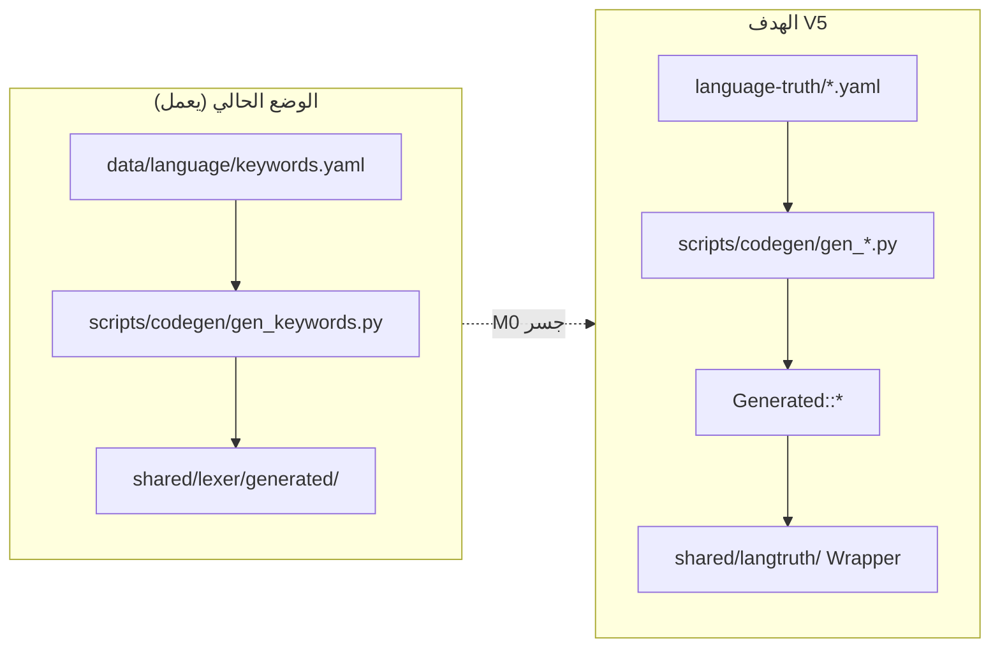
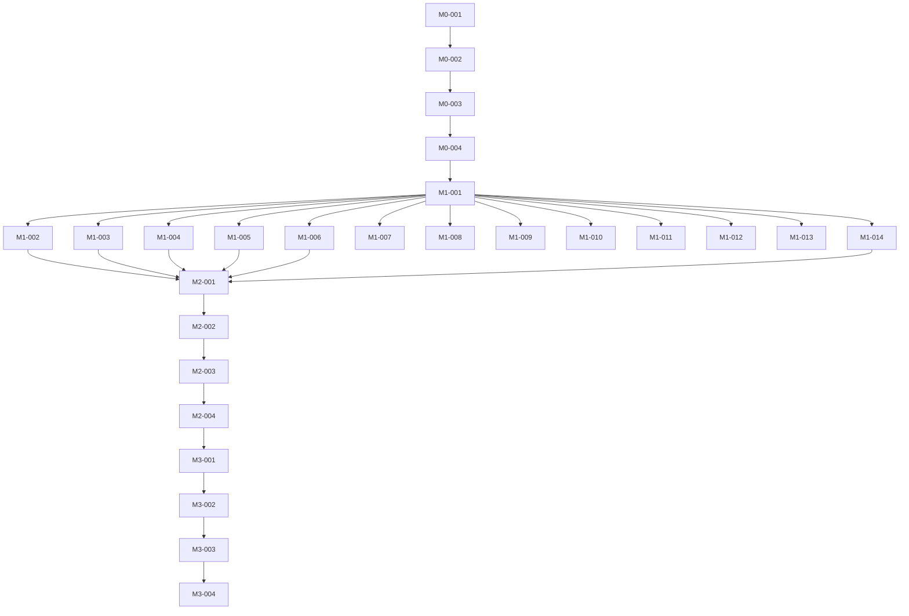

# 🛠️ خطة التنفيذ V5 — نظام التوثيق الحي للغة ص

> **هذه الوثيقة تُجيب "متى وبأي ترتيب".**
> STRATEGY تُجيب "ماذا ولماذا"؛ ARCHITECTURE تُجيب "كيف"؛ هذه الوثيقة تُجيب **"خطوة بخطوة"**.

---

## 0. المبدأ التنفيذي

نُنفِّذ V5 عَبر **جِسر انتِقالي** (Migration Bridge) لا يَكسِر البَناء في أي لَحظة (BF-12: لا إصلاح بدون اختبار).

**قاعدة ذهبية للتنفيذ:** كل ستوري يُنهي بِبناء أخضر (`cmake --build`) + اختبارات خضراء. لا ستوري يُغلَق بِبناء أحمر.

---

## 1. نظرة عامة على المراحل

| المرحلة | الهدف | الستوريات | المُخرَج |
|---|---|:---:|---|
| **M0 — Foundation** | بنية + Schemas + جسر بلا كسر | 4 | `language-truth/` يعمل بالتوازي مع `data/language/` |
| **M1 — Data Population** | ملء كل النطاقات (~600+ كيان) | 14 | كل YAML مكتمل ومُتحقَّق |
| **M2 — Library** | Wrapper + توسعة codegen | 4 | `libsadlangtruth` + `data/language/` محذوف |
| **M3 — Quality** | اختبارات Truth ↔ اللغة + كل القنوات | 4 | 5 اختبارات إلزامية خضراء |

**الإجمالي:** 26 ستوري عبر 4 مراحل.

> **مبدأ التغطية الشاملة:** كل ميزة لغوية يُنفِّذها المحلل النحوي/المفسر/المترجم يجب أن يكون لها تمثيل في Truth. الفحص الفعلي للكود (`shared/parser/src/specs/`, `scripts/codegen/gen_all.py`) يَكشف ~12 نطاقاً — لا 8.

---

## 2. M0 — Foundation (الأساس)

> **الهدف:** إنشاء `language-truth/` كَ Living Doc يعمل بالتوازي مع `data/language/` القائم — **بلا كسر البناء** (ADR-003 §قَرار 2).

### S-V5-M0-001 — إنشاء بنية `language-truth/`

**Given** المشروع يملك `data/language/keywords.yaml` يعمل
**When** نُنشئ مجلد `language-truth/` بالبنية المُعتمَدة (ARCHITECTURE §1)
**Then** المجلد يحوي الهيكل الكامل + `README.md` يشرح أنه SoT انتقالي

**المهام:**
- `mkdir language-truth/{_schemas,builtins,stdlib,tests}`
- كتابة `language-truth/README.md` (نقطة بدء لفِرَق الأدوات)
- كتابة `language-truth/VERSIONING.md` (SemVer للبيانات — ARCHITECTURE §7)

**معيار القبول:** البنية موجودة، لا تأثير على البناء الحالي.

---

### S-V5-M0-002 — نقل `keywords.yaml` عبر جسر symlink/copy

**Given** `data/language/keywords.yaml` هو SoT الحالي
**When** ننسخه إلى `language-truth/keywords.yaml` + نُبقي `data/language/` كـ pointer
**Then** البناء يستمر أخضر، `gen_keywords.py` يقرأ من المصدر الجديد

**المهام:**
- نسخ `data/language/keywords.yaml` → `language-truth/keywords.yaml`
- نسخ `data/language/keywords.schema.json` → `language-truth/_schemas/keywords.schema.json`
- تحديث `cmake/codegen.cmake`: `SAD_KW_YAML` يشير إلى `language-truth/keywords.yaml`
- بناء + تأكيد `keywords_generated.cpp` مُطابق للسابق (`--diff`)

**معيار القبول:** `cmake --build build --target sad` أخضر + الكلمات الـ91 مُولَّدة بلا تغيير.

---

### S-V5-M0-003 — JSON Schemas الأساسية

**Given** نملك `keywords.schema.json` فقط
**When** نكتب Schemas لكل النطاقات المُخطَّطة (ARCHITECTURE §1)
**Then** كل نطاق له `_schemas/<scope>.schema.json` جاهز للتحقق

**المهام (Schemas جديدة — تُعيد استخدام `data/_schemas/` القائمة حيثما أمكن):**
- `builtin_function.schema.json` (موجود في `data/_schemas/builtin.schema.json`)
- `type_method.schema.json` (موجود في `data/language/type_methods.schema.json` — يُنقَل)
- `module.schema.json` (من سجل `gen_all.py`)
- `error.schema.json` (موجود في `data/_schemas/error.schema.json`)
- `operator.schema.json`
- `directive.schema.json`
- `type.schema.json`
- `pattern.schema.json`
- `grammar_construct.schema.json`
- `stdlib_module.schema.json` + `stdlib_function.schema.json`
- `lesson.schema.json` + `exercise.schema.json` + `example.schema.json` (موجودة في `data/_schemas/`)

**معيار القبول:** كل Schema صالح (jsonschema metaschema) + يحوي `CommonFields` (id, schema_version, since, status).

---

### S-V5-M0-004 — اختبار T1 (Schema Validation) المبدئي

**Given** Schemas جاهزة + `keywords.yaml` موجود
**When** نكتب `language-truth/tests/test_schema_validation.py`
**Then** الاختبار يفحص كل YAML ضد Schema المقابل ويفشل البناء على أي انحراف

**معيار القبول:** `pytest language-truth/tests/test_schema_validation.py` أخضر على keywords، هيكل جاهز لباقي النطاقات.

---

## 3. M1 — Data Population (ملء البيانات)

> **الهدف:** ملء كل النطاقات بالكيانات الفعلية (~600+). كل نطاق يُتحقَّق بـ Schema (ND-V4-3).

| الستوري | النطاق | عدد تقديري | Codegen | المصدر في الكود |
|---|---|:---:|---|---|
| **S-V5-M1-001** | keywords (إثراء subcategory) | 91 | `gen_keywords.py` ✅ | `shared/lexer/` |
| **S-V5-M1-002** | builtins (دوال عامة + تزامن) | ~21 | `gen_builtins.py` ⚠️ | `interpreter/` |
| **S-V5-M1-003** | **type_methods (طرق الأنواع)** ⭐ | 80 | `gen_type_methods.py` ✅ | `parser/specs/types` + `interpreter` |
| **S-V5-M1-004** | **modules (الوحدات/الاستيراد)** ⭐ | ~10 | `gen_modules.py` ✅ | `parser/declarations/parser_modules` |
| **S-V5-M1-005** | errors (281KB حسب category) | ~200 | `gen_error_messages.py` ⚠️ | `shared/errors/` |
| **S-V5-M1-006** | operators (+ أسبقية/ترابط) | ~40 | `gen_operators.py` ❌ جديد | `parser/core/parser_expressions` |
| **S-V5-M1-007** | directives (@) | ~7 | `gen_directives.py` ❌ جديد | `lexer` + `parser` |
| **S-V5-M1-008** | types (أسماء الأنواع المدمجة) | 9 | `gen_types.py` ❌ جديد | `parser/specs/types` |
| **S-V5-M1-009** | **patterns (أنماط المطابقة)** ⭐ | ~8 | `gen_patterns.py` ❌ جديد | `parser/specs/patterns` |
| **S-V5-M1-010** | **grammar_constructs (عقود/تزامن/ماكرو/امتداد/عمر/async/ffi)** ⭐ | ~25 | `gen_grammar.py` ❌ جديد | `parser/specs/{contracts,async,meta,ffi}` |
| **S-V5-M1-011** | stdlib (دوال المكتبة القياسية) | ~119 | `gen_stdlib.py` ❌ جديد | `stdlib/` + `data/stdlib/` |
| **S-V5-M1-012** | **learning content (دروس/تمارين/أمثلة)** ⭐ | متغيّر | `gen_docs.py` ⚠️ | `data/_schemas/{lesson,exercise,example}` |
| **S-V5-M1-013** | **oop_constructs (صنف/بنية/تعداد/سمة/وراثة/خصائص/عامل/قوالب)** ⭐ | ~20 | `gen_oop.py` ❌ جديد | `parser/specs/oop/` |
| **S-V5-M1-014** | **expr_constructs (استيعاب/أنابيب/lambda/closure/f-string/tuple)** ⭐ | ~12 | `gen_expr.py` ❌ جديد | `parser/specs/flow/` + `parser/core/parser_expressions` |

### نمط موحَّد لكل ستوري M1

**Given** Schema النطاق جاهز (من M0-003)
**When** نكتب/ننقل YAML النطاق + نُنشئ/نُحدِّث codegen tool
**Then** الكيانات مُتحقَّقة + C++ Generated مُولَّد + البناء أخضر

**المهام القياسية:**
1. كتابة/نقل `language-truth/<scope>.yaml`
2. إضافة `subcategory`/`category` حقول للتنظيم الدلالي (ADR-003 §قَرار 4)
3. إنشاء/تحديث `scripts/codegen/gen_<scope>.py` (نمط `gen_keywords.py`)
4. ربط الهدف في `cmake/codegen.cmake`
5. تشغيل T1 (Schema) + بناء أخضر

**معيار القبول لكل M1:** YAML يطابق Schema 100% + كل كيان له ID فريد (ND-V4-2) + `since` (ND-V4-8).

> **ملاحظة errors:** `error_messages.yaml` (281KB) يُقسَّم حسب `category` field داخل YAML، لا ملفات منفصلة (ADR-003 §قَرار 8).

> **ملاحظة type_methods (M1-003):** البنية التحتية **موجودة وملتزمة في git** — `data/language/type_methods.yaml` (80 method, 7 targets) + `gen_type_methods.py` + `type_methods_generated.{h,cpp}`. هذا النطاق **نقل + تحقق فقط** (لا بناء من صفر) — أولوية عالية لأنه جاهز.

> **ملاحظة modules (M1-004):** `gen_modules.py` مُسجَّل في `gen_all.py` ويتوقع `data/language/modules.yaml` + `module.schema.json`. النطاق يوثّق الوحدات القابلة للاستيراد (رياضيات/نصوص/تشفير/شبكة...) وصادراتها.

> **ملاحظة grammar_constructs (M1-010):** يغطي أبنية القواعد المتقدمة المُنفَّذة فعلاً في `parser/specs/`: العقود (يتطلب/يضمن/حيث/عقد)، التزامن (قناة/أطلق/اختر/أجّل/مجموعة_انتظار)، الماكرو (ماكرو/!)، الامتداد (امتداد)، تعليقات العمر (`<'أ>`)، async (غير_متزامن/انتظر)، FFI (خارجي). كل بناء = كيان واحد بمثال Given/When/Then.

> **ملاحظة learning content (M1-012):** Schemas التعلّم (`lesson`/`exercise`/`example`) موجودة في `data/_schemas/`. هذا النطاق يربط المحتوى التعليمي بـ Truth — كل درس يشير إلى كيانات لغوية حقيقية (يمنع دروساً تشرح ميزات غير موجودة — GR-01).

> **ملاحظة oop_constructs (M1-013):** يغطي أكبر سطح لغوي — من `parser/specs/oop/`: الأصناف (صنف/باني/هدم/هذا/الأساس)، البنى (بنية)، التعداد (تعداد)، السمات (سمة/نفّذ)، الوراثة (يرث)، الخصائص (خاصية/احصل/عيّن)، محددات الوصول (عام/خاص/محمي/ساكن/مجرد)، تحميل العوامل (عامل)، القوالب (generics `<ت>`). الكلمات مغطاة كـ keywords (M1-001)، لكن هذا النطاق يوثّق **كيفية تركيبها** (قواعد + أمثلة).

> **ملاحظة expr_constructs (M1-014):** من `parser/specs/flow/`: الاستيعاب (list/dict comprehension)، الأنابيب (pipeline)، بالإضافة لـ lambda/closure/f-string/tuple/spread/ternary من `parser_expressions`. ميزات تعبيرية أساسية.

> **ملاحظة الآلة الافتراضية (VM):** `vm/src/sad_vm_opcodes.cpp` وأخواته هي bytecode/مُفكّك داخلي — **لا تُضيف نطاقاً لغوياً**. الـVM مربوطة بالمفسر وتشترك معه في نفس سطح اللغة؛ رموز العمليات ليست حقيقة لغوية تُوثّق في Truth.

---

## 4. M2 — Library (المكتبة)

> **الهدف:** بناء `libsadlangtruth` Wrapper فوق `Generated::*` + حذف `data/language/` نهائياً.

### S-V5-M2-001 — تصميم `libsadlangtruth` API

**Given** كل `Generated::*` مُولَّد من M1
**When** نصمم header عام `shared/langtruth/include/sad/langtruth.h`
**Then** API نظيف (`KeywordView`, `Registry`, find/get/getAll) موثَّق ثنائي اللغة

**معيار القبول:** Header كامل + كل API له `@brief (AR)` و `@brief (EN)` (CW-08).

---

### S-V5-M2-002 — تنفيذ Wrapper فوق `Generated::*`

**Given** Header مُصمَّم
**When** نُنفِّذ `keyword_adapter.cpp`, `builtin_adapter.cpp`, `error_adapter.cpp`
**Then** كل lookup عبر `unordered_map` (O(1)) + `std::call_once` للتهيئة + صِفر I/O

**معيار القبول:** `add_library(sad_langtruth STATIC)` يبني + اختبار وحدة بسيط (`find_by_arabic("دالة") == "function"`).

---

### S-V5-M2-003 — توسعة `cmake/codegen.cmake` لكل النطاقات

**Given** كل codegen tools جاهزة من M1
**When** نُضيف أهداف codegen لكل النطاقات الـ14 + `sad_langtruth_codegen_all` (ADR-003 §قَرار 7)
**Then** بناء واحد يُولِّد كل النطاقات بترتيب صحيح

**معيار القبول:** `cmake --build build --target sad_langtruth_codegen_all` أخضر.

---

### S-V5-M2-004 — حذف `data/language/` نهائياً

**Given** `language-truth/` هو SoT الوحيد + كل codegen يقرأ منه
**When** نحذف `data/language/` + نُحدِّث أي مرجع متبقٍ
**Then** البناء أخضر + لا مرجع لـ `data/language/`

**معيار القبول:** `grep -r "data/language"` = صِفر نتائج في CMake/scripts + بناء كامل أخضر.

> **تحذير GR (operationalSafety):** حذف `data/language/` يتطلب تأكيداً صريحاً قبل التنفيذ.

---

## 5. M3 — Quality (الجودة)

> **الهدف:** ضمان أن Truth يطابق اللغة الفعلية (ND-V4-6). 4 اختبارات إلزامية (ARCHITECTURE §5).

### S-V5-M3-001 — T1 Schema Validation (شامل)

كل YAML في كل نطاق يطابق Schema. توسعة اختبار M0-004 ليشمل النطاقات الـ14.

**معيار القبول:** `pytest test_schema_validation.py` يغطي كل النطاقات، أخضر 100%.

---

### S-V5-M3-002 — T2 Language Match (Truth ↔ Lexer/Parser)

**Given** Truth يدّعي أن "دالة" = `KEYWORD_FUNCTION`
**When** نقارن مع `Sad::Lexer::Generated::allEntries()` الفعلي
**Then** كل كلمة في Truth موجودة في Lexer والعكس — تطابق 100%

**معيار القبول:** اختبار يفشل إذا وُجدت كلمة في Truth غير مدعومة في اللغة (يمنع التوثيق الزائف — GR-01).

---

### S-V5-M3-003 — T3 Completeness + T4 Suggestions

- **T3:** كل كيان له `id` فريد + `since` + `status` (لا حقول ناقصة).
- **T4:** كل خطأ له `fix_suggestion_ar` و `fix_suggestion_en` (ND-V4-7).

**معيار القبول:** الاختباران أخضران + تقرير تغطية يُظهر صِفر كيانات ناقصة.

---

### S-V5-M3-004 — T5 Doc Channels Coverage (كل القنوات من Truth) ⭐

**Given** 5 مُصيّرات في `scripts/codegen/renderers/` (lsp/man/repl/tutorial/vitepress)
**When** نفحص أن كل مُصيّر يقرأ من Truth (لا hardcode لأي حقيقة لغوية)
**Then** كل قناة تُولِّد من `Generated::*` / YAML — تطابق مصدر واحد

**المهام:**
- اختبار `test_channels_source.py`: كل renderer يستهلك DocEntry من `doc_ir_builder` لا قيماً مكتوبة يدوياً
- تأكيد تطابق العدّ: كيانات Truth = كيانات كل قناة (lsp completion items = builtins+keywords count)
- ربط `check_docs_source_guard.py` القائم في البوابة

**معيار القبول:** الاختبار يفشل إذا حوى أي مُصيّر حقيقة لغوية مكتوبة يدوياً (ND-V4-4) + تطابق عدّ كل قناة مع Truth.

---

## 6. الترتيب والاعتماديات

> **نموذج التوازي:** بعد إنجاز **M1-001** (keywords — أساس Schema المشترك)، **كل** ستوريات M1 الأخرى (M1-002…M1-014) قابلة للتنفيذ **بالتوازي** (لا اعتماد متسلسل بينها). M2-001 يعتمد على اكتمال كل نطاقات M1.

**المسار الحرج:** M0-002 (الجسر) → M1-001 (keywords) → M1-003 (type_methods — جاهز) → M2-002 (Wrapper) → M3-002 (Language Match).

> **ملاحظة جاهزية:** ستوريات M1 التي تملك بنية تحتية جاهزة (M1-003 type_methods، M1-004 modules) ذات أولوية تنفيذ مبكرة لأنها نقل+تحقق لا بناء من صفر.

---

## 7. تعريف "تم" (Definition of Done)

ستوري يُعتبر "تم" فقط عند تحقُّق **كل** الآتي:

- [ ] الكود/YAML مكتوب ويتبع المعايير (CW-01..CW-30)
- [ ] `cmake --build build` أخضر (لا تراجع — BF-29)
- [ ] الاختبارات المعنية خضراء
- [ ] لا hardcode لأي حقيقة موجودة في Truth (ND-V4-4)
- [ ] التوثيق ثنائي اللغة للـ APIs العامة (CW-08)
- [ ] دليل قابل للتدقيق (grep/build) لأي ادعاء إنجاز (GR-01)

---

## 8. المخاطر والتخفيف

| الخطر | التأثير | التخفيف |
|---|---|---|
| كسر البناء أثناء نقل YAML | حظر التطوير | الجسر المزدوج (M0) + `--diff` قبل كل تبديل |
| `gen_builtins.py` يتوقع بنية مختلفة | فشل codegen | مواءمة YAML مع توقعات الأداة قبل الربط (M1-002) |
| تقسيم errors 281KB يكسر API | فشل M1-003 | الإبقاء على ملف واحد بـ `category` field (ADR-003 §8) |
| حذف `data/language/` مبكراً | كسر codegen | التأخير لـ M2-004 بعد تأكيد كل القراءات من `language-truth/` |

---

## 9. ربط ADRs

| القرار | الأثر على الخطة |
|---|---|
| **ADR-001** | يعتمد الاستراتيجية الأساسية (نطاق ضيق على حقيقة اللغة) |
| **ADR-002** | البنية المسطحة + IDs + API (قرارات 3,5,7,8 مُتجاوَزة بـ ADR-003) |
| **ADR-003** | نموذج Codegen + الجسر الانتقالي (M0-M2) + توسعة `cmake/codegen.cmake` |
| **ADR-004** | لا CLI — M2 يبني Wrapper فقط، الأدوات الأخرى تقرأ YAML مباشرة |

---

## 10. سَجل التغيير

| التاريخ | الإصدار | الوصف |
|---|---|---|
| 2026-06-05 | **V5** | إصدار أول من IMPLEMENTATION_PLAN — يُكمِّل STRATEGY V5 و ARCHITECTURE V5. 18 ستوري عبر M0→M3. يَتبع جسر ADR-003 الانتقالي + لا CLI (ADR-004). يَحل محل `_archive/LIVING_DOCS_ROADMAP.md`. || 2026-06-05 | **V5.1** | توسيع التغطية بعد فحص الكود الفعلي (المحلل النحوي/المترجم/المفسر/الآلة الافتراضية/نظام التوثيق): 18 → 26 ستوري. M1 وُسّع 7 → 14 بإضافة type_methods (80)، modules، patterns، grammar_constructs، learning content، oop_constructs، expr_constructs. M3 أُضيف T5 (تغطية قنوات التوثيق الـ5). تأكيد: الـVM bytecode لا يُضيف نطاقاً لغوياً. السبب: `gen_all.py` + `parser/specs/{oop,flow,patterns,...}` يكشفان نطاقات موجودة فعلاً. |
---

**IMPLEMENTATION_PLAN V5 مُعتمَدة ونافذة. أي تعارُض يُحَل بالأولوية: ADR-004 > ADR-003 > ADR-002 > ADR-001.**
