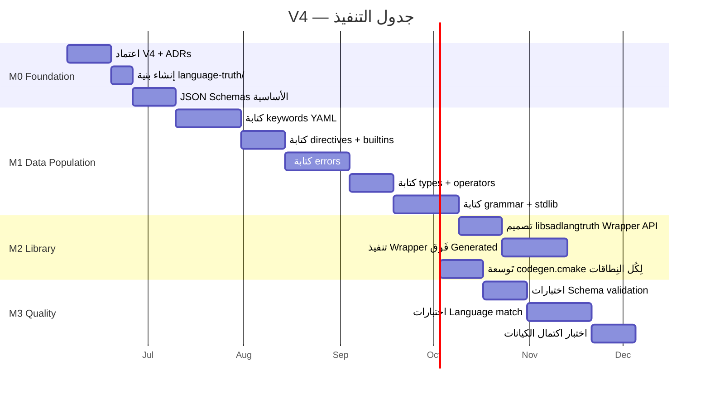

# نظام مصدر الحقيقة للغة ص

> **رؤية المالك (2026-06-04 — حرفياً):**
>
> "نحن نهتم باللغة نفسها فقط. ما تدعمه لغة ص هو الحقيقة المطلقة من خلال ملفات YAML.
>
> هذه الملفات تخبرنا ما تدعمه اللغة من:
> - الكلمات المفتاحية والتوجيهات
> - الدوال المضمنة
> - قواعد اللغة
> - الأخطاء في اللغة
>
> ومن ثم كل أداة تحصل على هذا المصدر وتقوم بتطوير التوثيق واستخدامه وفق ما تريد.
>
> كل فريق أداة هو المسؤول أن يكون توثيقه صحيحاً ولسنا نحن. لذلك نحن مسؤولون عن **توثيق اللغة نفسها فقط**. وذلك من أجل فصل المسؤولية. نحن فقط نتأكد من أن التوثيق يطابق اللغة. لا علاقة لنا كيف تستخدم الأدوات مصدر الحقيقة أو أين ستحفظ ملفاتها."

---

## 1. النطاق — ماذا نفعل وماذا لا نفعل

### نطاقنا (Scope)

```mermaid
flowchart TB
    subgraph IN["داخل نطاقنا"]
        direction TB
        S1["كتابة ملفات YAML لما تدعمه اللغة"]
        S2["كتابة JSON Schemas تفرض هيكل YAML"]
        S3["تطوير مكتبة وصول C++ Wrapper فوق Generated::*"]
        S4["توسعة scripts/codegen/*.py لإنتاج C++ Generated"]
        S5["اختبار: التوثيق يطابق اللغة الفعلية"]
        S6["مراجعة طلبات إضافة كيانات لغوية جديدة"]
    end

    subgraph OUT["خارج نطاقنا"]
        direction TB
        O1["كيف تخزن الأدوات توثيقها"]
        O2["أي صيغة تستخدم الأدوات"]
        O3["محتوى توثيق الأدوات (شرح، snippets، rules)"]
        O4["جودة توثيق الأدوات"]
        O5["موقع ملفات الأدوات في المشروع"]
        O6["دروس، تمارين، شروحات تعليمية"]
    end

    style IN fill:#cfc,stroke:#080,stroke-width:3px
    style OUT fill:#fcc,stroke:#800,stroke-width:2px
```



### القاعدة الذهبية

```text
نحن (فريق اللغة):
  - نوفر مصدر الحقيقة (Truth) في YAML مفتوحة
  - نضمن أن Truth يطابق ما تدعمه اللغة فعلياً
  - نوفر libsadlangtruth (Wrapper C++) للأدوات C++
  - YAML مفتوحة للجميع — أدوات Python/Node/Rust تقرأ مباشرةً

الأدوات (LSP، Formatter، Website، REPL، pkg، sad-doc):
  - تقرأ Truth بحرية
  - تبني توثيقها بطريقتها الخاصة
  - مسؤولة بالكامل عن جودة توثيقها
  - لا تتدخل في Truth (تفتح issue لو لزم)
```

---

## 2. ما يحتويه Truth — الكيانات اللغوية

### قائمة الكيانات

| الفئة | المحتوى | تقدير العدد |
|---|---|:---:|
| **keywords** | 40 محجوزة + 25 سياقية + 9 أنواع مدمجة | ~74 |
| **directives** | `@حجم`، `@ذري`، `@غير_آمن`، `@وقت_الترجمة`، `@متطاير`، `@تجميع` | ~7 |
| **builtins** | `اطبع`، `طول`، `رقم`، `نص`، `قناة`، `قفل`، ... | ~25 |
| **type_methods** ⭐ | طرق الأنواع: `.اضف`، `.رتب`، `.تقسيم`، `.أرسل`، ... (7 targets) | 80 |
| **operators** | `+`، `-`، `==`، `&&`، `و`، `أو`، ... (+ أسبقية/ترابط) | ~40 |
| **types** | `رقم`، `عشري`، `نص`، `منطقي`، `مصفوفة`، `خريطة`، ... | 9 |
| **patterns** ⭐ | أنماط المطابقة: حرفي/شامل/نطاق/بنية/ربط/OR | ~8 |
| **grammar_constructs** ⭐ | عقود/تزامن/ماكرو/امتداد/عمر/async/ffi | ~25 |
| **oop_constructs** ⭐ | أصناف/بنى/تعداد/سمات/وراثة/خصائص/عوامل/قوالب | ~20 |
| **expr_constructs** ⭐ | استيعاب/أنابيب/lambda/closure/f-string/tuple | ~12 |
| **errors** | E_LEX_*، E_PAR_*، E_RT_* | ~200 |
| **modules** ⭐ | `رياضيات`، `نصوص`، `تشفير`، `شبكة`، ... | ~10 |
| **stdlib_functions** | دوال داخل المكتبات | ~119 |
| **learning** ⭐ | دروس/تمارين/أمثلة مربوطة بـ Truth | متغيّر |

**الإجمالي المتوقع:** ~600+ كيان عبر 14 نطاقاً (مُكتشَفة من فحص `parser/specs/` و `gen_all.py` — الآلة الافتراضية لا تُضيف نطاقاً).

> **مَرجع البنية والـ Schema:** [ADR-DOCS-V4-002](decisions/ADR-DOCS-V4-002-UNIFIED-STRUCTURE.md) هو المَرجع الحاسم لكل حقول YAML ونَمط IDs. الأمثلة أدناه مُطابقة له.

### مثال على كيان (keyword)

```yaml
# keywords/KW-FUNC-001.yaml
id: KW-FUNC-001
schema_version: "1.0.0"
arabic: دالة
english: function
since: "0.1.0"
status: stable
subcategory: reserved              # reserved | contextual | builtin_type
token_type: KEYWORD_FUNCTION
description_short_ar: تَعريف دالة قابلة لإعادة الاستخدام
description_short_en: Define a reusable function
aliases: []
ends_with: نهاية
related_errors:
  - E_PAR_FUNC_001
related_grammar:
  - GR-FUNC-DECL-001
```

**ملاحظة:** هذا كل ما يحويه Truth لكلمة `دالة`. ما تفعله الأدوات بهذه المعلومات (شرح، snippets، spacing rules) **ليس مسؤوليتنا**.

### مثال على كيان (error)

```yaml
# errors/E_PAR_FUNC_001.yaml
id: E_PAR_FUNC_001
schema_version: "1.0.0"
since: "0.1.0"
status: stable
subcategory: parser                # lexer | parser | semantic | runtime | type
severity: error                    # error | warning | info
message_ar: 'يَجب أن تَنتهي الدالة بـ "نهاية"'
message_en: 'Function must end with "نهاية"'
fix_suggestion_ar: 'أَضِف كلمة "نهاية" في نهاية الدالة'
fix_suggestion_en: 'Add "نهاية" keyword at the end of the function'
example_bad: |
  دالة جمع(أ، ب)
      ارجع أ + ب
example_good: |
  دالة جمع(أ، ب)
      ارجع أ + ب
  نهاية
related_keyword: KW-FUNC-001
```

### مثال على كيان (builtin)

```yaml
# builtins/BI-PRINT-001.yaml
id: BI-PRINT-001
schema_version: "1.0.0"
arabic: اطبع
english: print
since: "0.1.0"
status: stable
subcategory: io                    # io | conversion | length | concurrency | ...
requires_import: false
signature: 'اطبع(...قيم: أي)'
parameters:
  - name: قيم
    type: variadic
    type_ref: أي
return_type: فراغ
description_short_ar: طباعة قيم على الخَرج القياسي بدون سَطر جديد
description_short_en: Print values to stdout without newline
related:
  - BI-PRINTLN-001  # اطبع_سطر
```

---

## 3. بنية المشروع — جذر `language-truth/`

### الهيكل الكامل (مُسطَّح — بلا `data/` وَسيط)

> مُعتمَد في [ADR-DOCS-V4-002 §قَرار 1](decisions/ADR-DOCS-V4-002-UNIFIED-STRUCTURE.md).

```text
language-truth/                       # مَصدر الحَقيقة المَركزي
├── CMakeLists.txt
├── README.md
├── VERSIONING.md
│
├── _schemas/                         # JSON Schemas (Draft 2020-12)
│   ├── keyword.schema.json
│   ├── directive.schema.json
│   ├── builtin.schema.json
│   ├── operator.schema.json
│   ├── type.schema.json
│   ├── grammar_rule.schema.json
│   ├── error.schema.json
│   ├── stdlib_module.schema.json
│   └── stdlib_function.schema.json
│
├── keywords/                         # ~74 ملف
│   ├── KW-FUNC-001.yaml
│   └── ...
├── directives/                       # ~10
│   ├── DIR-SIZE-001.yaml
│   └── ...
├── builtins/                         # ~25
├── operators/                        # ~30
├── types/                            # ~12
├── grammar_rules/                    # ~50
├── errors/                           # ~200 (مُسطَّح، التَصنيف عبر subcategory)
│   ├── E_LEX_STR_001.yaml
│   ├── E_PAR_FUNC_001.yaml
│   └── ...
├── stdlib_modules/                   # ~15
│   ├── MOD-MATH-001.yaml
│   └── ...
├── stdlib_functions/                 # ~100
│   ├── FN-MATH-SQRT-001.yaml
│   └── ...
│
├── include/sad/                      # public API
│   ├── langtruth.h
│   └── langtruth_constants.h         # يُولَّد آلياً
├── src/                              # تنفيذ libsadlangtruth (Wrapper)
│   ├── langtruth_impl.cpp
│   ├── registry.cpp
│   └── keyword_adapter.cpp           # V5: Wrapper فَوق Sad::Lexer::Generated::*
├── tests/
│   ├── test_schema_validation.py
│   ├── test_language_match.py
│   ├── test_unique_ids.py
│   └── test_required_fields.py
└── _index.yaml                       # يُولَّد آلياً (id → path)
```

### ما هو خارج هذا المُجلَّد

لا نَملك ولا نُراجع أي شَيء خارج `language-truth/`. كيف تَستخدم الأدوات `libsadlangtruth` هو شَأنها.

---

## 4. واجهة الاستخدام — كيف تصل الأدوات لـ Truth؟

### الواجهة C++ (libsadlangtruth) — مُلخَّصة

> التَفصيل الكامل في [ARCHITECTURE.md §2.2](ARCHITECTURE.md) والتَوقيعات النهائية في [ADR-DOCS-V4-002 §قَرار 4](decisions/ADR-DOCS-V4-002-UNIFIED-STRUCTURE.md).

```cpp
// include/sad/langtruth.h
namespace sad::langtruth {

// (AR) Lookup بمعرف فقط — صَريح.
std::optional<KeywordEntity>        getKeyword(std::string_view id);
std::optional<DirectiveEntity>      getDirective(std::string_view id);
std::optional<BuiltinEntity>        getBuiltin(std::string_view id);
std::optional<OperatorEntity>       getOperator(std::string_view id);
std::optional<TypeEntity>           getType(std::string_view id);
std::optional<GrammarRuleEntity>    getGrammarRule(std::string_view id);
std::optional<ErrorEntity>          getError(std::string_view id);
std::optional<StdlibModuleEntity>   getStdlibModule(std::string_view id);
std::optional<StdlibFunctionEntity> getStdlibFunction(std::string_view id);

// (AR) بَحث بالاسم — صَريح، مُفصَّل.
std::optional<KeywordEntity>  findKeywordByArabic(std::string_view ar);
std::optional<KeywordEntity>  findKeywordByEnglish(std::string_view en);
std::optional<OperatorEntity> findOperatorBySymbol(std::string_view sym);
std::optional<BuiltinEntity>  findBuiltinByArabic(std::string_view ar);
bool isReservedKeyword(std::string_view ar);
bool isContextualKeyword(std::string_view ar);

// (AR) قَوائم شاملة — const& لا تُنسخ (CW-29).
const std::vector<KeywordEntity>&   getAllKeywords();
const std::vector<ErrorEntity>&     getAllErrors();
// ... (بَقية الفئات)

std::vector<KeywordEntity> getKeywordsBySubcategory(std::string_view sub);

} // namespace sad::langtruth
```

### قِراءة YAML مُباشَرَة

> **قَرار [ADR-DOCS-V4-004](decisions/ADR-DOCS-V4-004-NO-CLI.md):** CLI مَحذوف نِهائياً. اقرأ YAML مُباشرةً بِأَي مُحَلِّل YAML.

```python
# Python (للمَواقع، التَوثيق، التَحَقُّق)
import yaml
data = yaml.safe_load(open("language-truth/keywords.yaml"))
for category in data["categories"]:
    for entry in category["entries"]:
        print(entry["arabic"], "=", entry["english"])
```

```bash
# bash (للاستِكشاف السَريع)
grep -A 15 "KW-FUNC-001" language-truth/keywords.yaml
```

```javascript
// Node.js (LSP server, Website)
const yaml = require('js-yaml');
const fs = require('fs');
const data = yaml.load(fs.readFileSync('language-truth/keywords.yaml', 'utf8'));
```

---

## 5. كيف نضمن أن Truth يطابق اللغة؟

### الاختبارات الإلزامية (مسؤوليتنا فقط)

#### اختبار 1: مطابقة Schema

كل ملف YAML يجب أن يطابق JSON Schema الخاص بفئته.

```python
# tests/test_schema_validation.py
def test_all_keywords_match_schema():
    schema = load_schema("_schemas/keyword.schema.json")
    for yaml_file in glob("keywords/*.yaml"):
        entity = yaml.load(yaml_file)
        validate(entity, schema)
```

#### اختبار 2: مطابقة اللغة الفعلية

كل keyword في Truth يجب أن يكون مُسجَّلاً فعلياً في `lexer_keywords.cpp`.

```python
# tests/test_language_match.py
def test_every_truth_keyword_is_registered_in_lexer():
    truth_keywords = load_truth_keyword_names()
    lexer_keywords = parse_lexer_keywords_cpp()
    
    missing = truth_keywords - lexer_keywords
    extra = lexer_keywords - truth_keywords
    
    assert not missing, f"Truth يدّعي وجود كلمات غير مُسجَّلة في Lexer: {missing}"
    assert not extra, f"Lexer يحوي كلمات غير موجودة في Truth: {extra}"
```

#### اختبار 3: تفرّد المعرفات

```python
# tests/test_unique_ids.py
def test_all_entity_ids_are_unique():
    all_ids = []
    for yaml_file in glob("data/**/*.yaml"):
        entity = yaml.load(yaml_file)
        all_ids.append(entity["id"])
    
    duplicates = [id for id in all_ids if all_ids.count(id) > 1]
    assert not duplicates, f"معرفات مكررة: {duplicates}"
```

#### اختبار 4: اكتمال البيانات الإلزامية

```python
# tests/test_required_fields.py
def test_every_error_has_fix_suggestion():
    for yaml_file in glob("data/errors/**/*.yaml"):
        entity = yaml.load(yaml_file)
        assert "fix_suggestion_ar" in entity, f"{entity['id']} يفتقد fix_suggestion_ar"
        assert "fix_suggestion_en" in entity, f"{entity['id']} يفتقد fix_suggestion_en"
```

### ما لا نختبره

- **محتوى الشرح في الأدوات** — مسؤولية الأداة
- **جودة snippets الـ LSP** — مسؤولية فريق LSP
- **قواعد التنسيق في Formatter** — مسؤولية فريق Formatter
- **دروس الموقع** — مسؤولية فريق الموقع
- **كيف تدمج كل أداة بياناتها مع Truth** — مسؤولية الأداة

---

## 6. سياسة التغيير — متى يتغير Truth؟

### حالات التغيير المشروعة

| الحالة | المسؤول | الإجراء |
|---|---|---|
| إضافة كلمة مفتاحية جديدة للغة | فريق اللغة | إضافة YAML + تحديث Schema لو لزم + تحديث Lexer + اختبار |
| تغيير دلالة كلمة موجودة | فريق اللغة + موافقة المالك | تحديث YAML + ADR + bump version |
| إضافة دالة builtin | فريق اللغة | إضافة YAML + تنفيذ في Interpreter |
| إضافة رسالة خطأ | فريق اللغة | إضافة YAML + إصدار من Parser/Lexer |
| إضافة directive | فريق اللغة | إضافة YAML + تنفيذ |

### حالات التغيير الممنوعة

| الطلب | لماذا ممنوع؟ |
|---|---|
| "أضف حقل `lsp_icon` لكل keyword" | تفصيل أداة — يبقى في توثيق الأداة |
| "أضف شرحاً مطولاً لكل keyword" | محتوى تعليمي — مسؤولية الموقع |
| "أضف قواعد spacing لكل keyword" | تفصيل Formatter — مسؤولية Formatter |
| "أضف completion snippet لكل keyword" | تفصيل LSP — مسؤولية LSP |

### طلبات الأدوات

أداة تحتاج معلومة لغوية غير موجودة في Truth:

1. تفتح **issue** على repo `language-truth`
2. تشرح: ما المعلومة؟ لماذا هي لغوية وليست خاصة بالأداة؟
3. فريق اللغة يراجع: هل هذه حقيقة لغوية؟
4. القرار: قبول (إضافة YAML) أو رفض (يبقى في توثيق الأداة)

---

## 7. القرارات غير القابلة للتفاوض (ND)

| # | القرار | السبب |
|---|---|---|
| **ND-V4-1** | Truth يحوي **فقط** ما تدعمه اللغة | منع التضخم |
| **ND-V4-2** | كل كيان له ID فريد عالمياً | يضمن المرجعية |
| **ND-V4-3** | كل ملف YAML يطابق JSON Schema | يفرض الجودة |
| **ND-V4-4** | الكود ممنوع من hardcode أي حقيقة موجودة في Truth | الحقيقة من YAML فقط |
| **ND-V4-5** | فريق اللغة لا يكتب أو يراجع توثيق الأدوات | فصل المسؤولية |
| **ND-V4-6** | اختبار "Truth يطابق اللغة الفعلية" إلزامي | يمنع التوثيق الزائف |
| **ND-V4-7** | كل خطأ له `fix_suggestion_ar` و`fix_suggestion_en` | جودة رسائل الأخطاء |
| **ND-V4-8** | كل كيان له حقل `since` يحدد إصدار الإضافة | تتبع التطور |

---

## 8. الجدول الزمني المختصر



---

## 9. مقاييس النجاح

| المقياس | الهدف |
|---|---|
| كيانات Truth الكاملة | **~516** |
| ملفات YAML تطابق Schema | 100% |
| كلمات في Lexer = كلمات في Truth | تطابق 100% |
| أخطاء في Parser/Lexer = أخطاء في Truth | تطابق 100% |
| كل خَطأ له fix_suggestion (ar + en) | 100% |
| كل كَيان له ID فَريد | 100% |
| سُرعة قِراءة كَيان واحد من libsadlangtruth | < 1µs |
| حجم libsadlangtruth | < 5 MB |
| حجم `language-truth/` كاملة | < 10 MB |

---

## 10. أول 5 ستوريات (M0)

| ID | العنوان | SP |
|---|---|:---:|
| S-V4-M0-001 | اعتماد V4 رسمياً + توقيع المالك | 1 |
| S-V4-M0-002 | كتابة 5 ADRs الأساسية (ND-V4-1 إلى ND-V4-5) | 5 |
| S-V4-M0-003 | إنشاء بنية `language-truth/` + CMakeLists | 3 |
| S-V4-M0-004 | كتابة 8 JSON Schemas الأساسية | 8 |
| S-V4-M0-005 | كتابة README + سياسات المساهمة | 3 |

**إجمالي M0:** 20 SP

---

## 11. سجل التغيير

| التاريخ | الإصدار | الوصف |
|---|---|---|
| 2026-06-04 | V4 | إعادة كتابة جذرية — تركيز كامل على توثيق اللغة فقط، حذف كل تفاصيل الأدوات |
| 2026-06-05 | V4 | **اعتماد رسمي من المالك** — `status: APPROVED`، سجل القرار في [ADR-DOCS-V4-001](decisions/ADR-DOCS-V4-001-APPROVAL.md). تنفيذ ستوري `S-V4-M0-001`. |
| 2026-06-05 | V4 | **تَوحيد بنيوي بعد مُراجَعة Amelia الذاتية** — تَطبيق [ADR-DOCS-V4-002](decisions/ADR-DOCS-V4-002-UNIFIED-STRUCTURE.md): بنية مُسطَّحة، schema موحَّد، API صَريح، Binary Cache مُؤجَّل لـ M2. |
| 2026-06-05 | **V5** | **تَكامل مع البَنية القائمة بَعد فَحص الكود** — تَطبيق [ADR-DOCS-V4-003](decisions/ADR-DOCS-V4-003-CODEGEN-INTEGRATION.md): اكتِشاف أن المَشروع لديه نِظام `scripts/codegen/*.py` + `cmake/codegen.cmake` + `Sad::Lexer::Generated::*` ناضِج (19 مَوضِع استِهلاك). V5 يَتَكامَل مَعَه بَدلاً من إنشاء `yaml-cpp` مُوازِ. التَحَوُّل من "YAML Runtime Loading" إلى "Build-Time Codegen". Binary Cache مُلغى نِهائياً. تَجاوَز جُزئي لـ ADR-002 (قَرارات 3, 5, 7, 8). |
| 2026-06-05 | **V5** | **حَذف sadlang-info CLI نِهائياً** — تَطبيق [ADR-DOCS-V4-004](decisions/ADR-DOCS-V4-004-NO-CLI.md): CLI غَير ضَروري في نَموذج V5. الأَدوات C++ تَستَخدِم Wrapper مُباشرةً، الأَدوات الأُخرى تَقرأ YAML من `language-truth/*.yaml` مُباشرةً. validation عَبر `scripts/codegen/*.py` القائمة. M2 صار "تَوسعة codegen + Wrapper" بَدلاً من "CLI". |

---

**STRATEGY V5 مُعتمَدة ونافذة. أي تَعارُض يُحَل بِالأَولوية: ADR-DOCS-V4-004 > ADR-DOCS-V4-003 > ADR-DOCS-V4-002 > ADR-DOCS-V4-001.**
