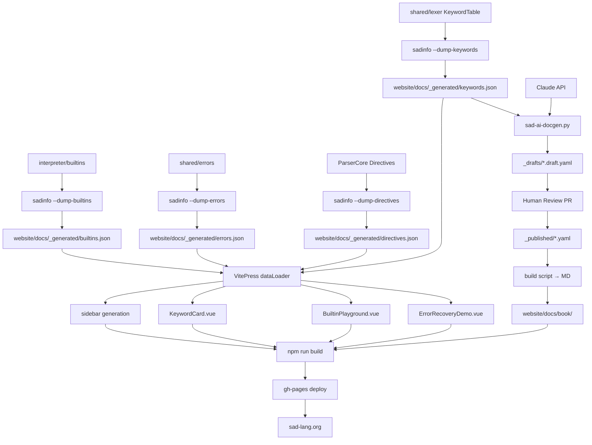

# 🏛️ Architecture v2 — نظام التوثيق الحي

> **النسخة:** 2.0
> **يستبدل:** `architecture-docs-system.md` (v1)
> **التاريخ:** 2026-05-09
> **آخر تحديث:** 2026-05-10 (إضافة القسم 0 — قرار معماري)
> **المؤلف:** Winston (System Architect)

---

## 0. القرار المعماري الأساسي — أداة موحَّدة للتوثيق ⭐

> **التاريخ:** 2026-05-10
> **القرار:** `sadinfo` هي **الأداة الرسمية الوحيدة** لتوليد بيانات التوثيق المنشورة.
> **المُلزِم:** المستخدم/المالك (مذكور في `infra-corrections.md`).

### 0.1 المشكلة المرفوضة

الوضع القديم كان يضع منطق توليد التوثيق داخل المفسر والمترجم:

```
sad-run.exe   ──> --docs / --docs-format / --docs-project   ◄── ازدواج
sad-build.exe ──> نفس الـ flags                              ◄── ازدواج
                  ↓
       tests/doc_gen_dual_execution/runner.py
       يختبر تطابق المخرجات بين المفسر والمترجم
```

**لماذا هذا خاطئ:**
1. توليد التوثيق ليس وظيفة المفسر/المترجم.
2. أي تغيير في AST أو KeywordTable يجب تكراره في مكانين.
3. الاختبارات تُركّز على "تطابق" بدلاً من "صحة التوثيق" — وهو معيار ضعيف.
4. حجم الـ binary للمفسر/المترجم يكبر دون داعٍ.

### 0.2 الحل المعتمد

```
sadinfo (مستقل تماماً) ──> يعتمد فقط على shared/lexer
                          (لا interpreter، لا compiler)
                          ↓
                  keywords.json
                  builtins.json
                  errors.json
                  directives.json
                          ↓
       tests/sadinfo/ (اختبارات schema + idempotence + UTF-8)
```

### 0.3 Deprecation Plan لـ `--docs-project`

| الإصدار | الإجراء |
|---|---|
| **v1.0 (الآن)** | sadinfo يصبح المسار الموصى به. الـ flags في sad/sadc تظل تعمل لكن تطبع تحذير: `[DEPRECATED] استخدم 'sadinfo --dump-all' بدلاً منها — ستُحذف في v2.0` |
| **v1.5** | تحذير أقوى + إضافة `--no-deprecation-warnings` للمستخدمين الذين يحتاجون وقتاً للهجرة |
| **v2.0** | حذف `--docs`, `--docs-out`, `--docs-format`, `--docs-project`, `--توثيق` نهائياً من sad-run.exe و sad-build.exe |

### 0.4 مصير `tests/doc_gen_dual_execution/`

- **حالياً (Story 0.0):** يُصلَح فقط ليجد الـ binaries بأسمائها الجديدة (`sad-run.exe`, `sad-build.exe`) — لا تطوير وظيفي.
- **بعد Story 1.6:** يُستبدل بـ `tests/sadinfo/` التي تختبر:
  - صحة JSON schema
  - idempotency: تشغيلان متتاليان ينتجان byte-identical output
  - تطابق `count` مع keywords.yaml
  - دعم UTF-8 وعدم تشويه الكلمات العربية
- **بعد Story 1.7:** يُؤرشف `tests/doc_gen_dual_execution/` إلى `_archived/` ويُزال من CMake.

### 0.5 طبقات الاعتماد المسموحة لـ sadinfo

```
        sadinfo
            │
            ▼
       sad_shared (STATIC)
            │
            ├─→ shared/lexer  ✓ مسموح (مصدر الكلمات)
            ├─→ shared/utils  ✓ مسموح (UTF-8)
            └─→ shared/types  ✓ مسموح (Position, etc.)
            
       ✗ ممنوع: interpreter, compiler, vm, runtime, stdlib, network, graphics
```

أي إضافة لاعتماد جديد على هذه الأداة يجب أن تُمر بمراجعة معمارية.

---

## 1. نظرة عامة معمارية

النظام مبني على **3 طبقات منفصلة** تتواصل عبر JSON ملفات (لا runtime API):

```
┌─────────────────────────────────────────────────────────────┐
│  Layer 1: نواة اللغة (موجود)                                │
│  shared/lexer + shared/parser + interpreter/builtins        │
│  + shared/errors + ParserCore (التوجيهات)                   │
└────────────────────┬────────────────────────────────────────┘
                     │ يُستهلك من
                     ▼
┌─────────────────────────────────────────────────────────────┐
│  Layer 2: مُستخرج البيانات (جديد)                           │
│  tools/sadinfo/sadinfo.exe                                   │
│  ├── --dump-keywords  → keywords.json                        │
│  ├── --dump-builtins  → builtins.json                        │
│  ├── --dump-errors    → errors.json                          │
│  ├── --dump-directives → directives.json                     │
│  └── --validate <yaml-file>                                   │
└────────────────────┬────────────────────────────────────────┘
                     │ يكتب في
                     ▼
┌─────────────────────────────────────────────────────────────┐
│  Layer 3: الموقع (موجود ومُعد)                               │
│  C:\s_lang\website\                                          │
│  ├── docs/_generated/*.json    ← من sadinfo                  │
│  ├── docs/_published/*.yaml    ← مكتوب يدوياً (مُراجَع)      │
│  ├── docs/_drafts/*.draft.yaml ← AI drafts (gitignored)      │
│  ├── .vitepress/config/        ← dataLoaders                  │
│  └── .vitepress/theme/components/ ← KeywordCard, Playground   │
└────────────────────┬────────────────────────────────────────┘
                     │ npm run build
                     │ gh-pages
                     ▼
              https://sad-lang.org
```

---

## 2. مكوّن `tools/sadinfo/`

### 2.1 بنية الملفات

```
tools/sadinfo/
├── CMakeLists.txt
├── README.md
├── src/
│   ├── main.cpp                # CLI dispatcher + argparse
│   ├── dump_keywords.cpp       # KeywordTable → JSON/YAML
│   ├── dump_builtins.cpp       # BuiltinRegistry → JSON/YAML
│   ├── dump_errors.cpp         # ErrorMessages → JSON/YAML
│   ├── dump_directives.cpp     # Directives → JSON/YAML
│   ├── output_format.cpp       # JSON ↔ YAML emitters
│   ├── yaml_validator.cpp      # YAML schema validator
│   └── version.cpp             # --version
└── include/
    └── sadinfo/
        ├── version.h           # SADINFO_VERSION = "1.0.0"
        ├── output_format.h
        └── yaml_validator.h
```

### 2.2 CMake Target

```cmake
# tools/sadinfo/CMakeLists.txt
add_executable(sadinfo
    src/main.cpp
    src/dump_keywords.cpp
    src/dump_builtins.cpp
    src/dump_errors.cpp
    src/dump_directives.cpp
    src/output_format.cpp
    src/yaml_validator.cpp
    src/version.cpp
)

target_link_libraries(sadinfo PRIVATE
    sad_lexer_core      # KeywordTable
    sad_shared          # Lexer + Parser + AST
    sad_errors          # ErrorMessages registry
)

target_include_directories(sadinfo PRIVATE
    ${CMAKE_SOURCE_DIR}/shared/lexer/include
    ${CMAKE_SOURCE_DIR}/shared/parser/include
    ${CMAKE_SOURCE_DIR}/shared/errors/include
    ${CMAKE_SOURCE_DIR}/interpreter/builtins/include
    ${CMAKE_SOURCE_DIR}/tools/sadinfo/include
)

set_target_properties(sadinfo PROPERTIES
    OUTPUT_NAME "sadinfo"
    RUNTIME_OUTPUT_DIRECTORY ${CMAKE_RUNTIME_OUTPUT_DIRECTORY}
)
target_compile_features(sadinfo PRIVATE cxx_std_17)

if(MSVC)
    target_compile_options(sadinfo PRIVATE /utf-8 /wd4819 /FS)
endif()
```

### 2.3 CLI Specification

```
sadinfo — أداة استخراج البيانات الوصفية للغة ص

Usage:
  sadinfo <command> [options]

Commands:
  --dump-keywords     استخراج الكلمات المفتاحية (40 محجوزة + 25 سياقية)
  --dump-builtins     استخراج الدوال المدمجة + الطرق على الأنواع
  --dump-errors       استخراج رسائل الأخطاء (lexer/parser/sema/runtime)
  --dump-directives   استخراج التوجيهات @حجم/@ذري/@غير_آمن/...
  --dump-all          كل ما سبق دفعة واحدة
  --validate <file>   التحقق من ملف YAML ضد schema

Options:
  --format=json|yaml  صيغة الإخراج (افتراضي: json)
  --lang=ar|en|both   لغة الإخراج (افتراضي: both)
  --output=<file>     ملف الإخراج (افتراضي: stdout)
  --output-dir=<dir>  مجلد الإخراج لـ --dump-all (مطلوب)
  --pretty            تنسيق مقروء (افتراضي: مضغوط)
  --version           طباعة الإصدار
  --help              طباعة المساعدة

Examples:
  sadinfo --dump-keywords --format=yaml --pretty > keywords.yaml
  sadinfo --dump-all --output-dir=C:\s_lang\website\docs\_generated
  sadinfo --validate website/docs/_published/keyword_دالة.yaml
```

### 2.4 JSON Schema للـ keywords.json

```json
{
  "$schema": "https://sad-lang.org/schemas/keywords-v1.json",
  "version": "1.0.0",
  "generated_at": "2026-05-09T12:00:00Z",
  "source": {
    "file": "shared/lexer/src/lexer_keywords.cpp",
    "commit": "abc123def"
  },
  "reserved": [
    {
      "id": "kw_function",
      "ar": "دالة",
      "en": "function",
      "token_type": "KEYWORD_FUNCTION",
      "category": "declaration",
      "since": "1.0.0",
      "doc_status": "published",
      "doc_path_ar": "docs/book/keywords/دالة.md",
      "doc_path_en": "docs/en/book/keywords/function.md"
    }
  ],
  "contextual": [
    {
      "id": "ctx_async",
      "ar": "غير_متزامن",
      "en": "async",
      "context": "after_دالة",
      "doc_status": "draft"
    }
  ]
}
```

---

## 3. مكوّن `website/docs/_generated/`

### 3.1 الملفات المُولَّدة

| الملف | المحتوى | المُولِّد | حجم متوقع |
|---|---|---|---|
| `keywords.json` | 65 كلمة (40+25) | sadinfo --dump-keywords | ~15 KB |
| `builtins.json` | 21 دالة + ~50 طريقة | sadinfo --dump-builtins | ~40 KB |
| `errors.json` | ~150 رسالة خطأ | sadinfo --dump-errors | ~80 KB |
| `directives.json` | ~6 توجيهات | sadinfo --dump-directives | ~5 KB |

### 3.2 Gitignore Strategy

```
# website/.gitignore (إضافة)
docs/_drafts/                  # AI drafts فقط (gitignored)
# docs/_generated/             # مُولَّد لكن مُتتبَّع للنشر
```

`_generated/` **يُلتزَم** للحفاظ على history، لكن CI يولّده من جديد قبل النشر للتأكد من المزامنة.

---

## 4. مكوّن `website/.vitepress/`

### 4.1 dataLoader Pattern

```typescript
// website/.vitepress/config/data/keywords.data.ts
import { defineLoader } from 'vitepress'
import keywordsJson from '../../docs/_generated/keywords.json'

export interface Keyword {
  id: string
  ar: string
  en: string
  category: string
  since: string
  doc_path_ar: string
  doc_path_en: string
}

export default defineLoader({
  watch: ['../../docs/_generated/keywords.json'],
  load(): { reserved: Keyword[]; contextual: Keyword[] } {
    return {
      reserved: keywordsJson.reserved,
      contextual: keywordsJson.contextual,
    }
  },
})
```

### 4.2 Sidebar Generation

```typescript
// website/.vitepress/config/sidebar.ts (تعديل)
import keywordsData from './data/keywords.data'

export const sidebarAr = {
  '/book/keywords/': [
    {
      text: 'الكلمات المحجوزة',
      items: keywordsData().reserved.map(k => ({
        text: `${k.ar} / ${k.en}`,
        link: `/book/keywords/${k.id}`,
      })),
    },
  ],
  // ... باقي السايدبار
}
```

### 4.3 Vue Components

```
website/.vitepress/theme/components/
├── KeywordCard.vue        # بطاقة كلمة مفتاحية مع AR/EN/category/since
├── BuiltinPlayground.vue  # CodeMirror playground للدوال المدمجة
├── ErrorRecoveryDemo.vue  # عرض رسالة خطأ + كيفية الإصلاح
└── DirectiveExample.vue   # مثال عملي للتوجيه
```

---

## 5. مكوّن `tools/sad-ai-docgen/` (Wave 2)

### 5.1 Pipeline

```
[KeywordTable] → sadinfo --dump-keywords → keywords.json
                                               │
                                               ▼
                                  sad-ai-docgen.py --keyword=دالة
                                               │
                                               │ Claude API
                                               ▼
                                website/docs/_drafts/دالة.draft.yaml
                                               │
                                               │ human review (PR)
                                               ▼
                                website/docs/_published/دالة.yaml
                                               │
                                               │ build script
                                               ▼
                                website/docs/book/keywords/دالة.md
```

### 5.2 YAML Schema للمحرَّر يدوياً

```yaml
# website/docs/_published/keyword_دالة.yaml
$schema: https://sad-lang.org/schemas/published-keyword-v1.json
id: kw_function
ar:
  name: دالة
  summary: تعريف دالة قابلة للاستدعاء
  description: |
    الكلمة `دالة` تُعرّف دالة جديدة...
  examples:
    - title: دالة بسيطة
      code: |
        دالة جمع(أ، ب)
            ارجع أ + ب
        نهاية
en:
  name: function
  summary: Defines a callable function
  description: |
    The `دالة` keyword defines a new function...
  examples:
    - title: Simple Function
      code: |
        دالة add(a, b)
            ارجع a + b
        نهاية
metadata:
  reviewed_by: saleh
  reviewed_at: 2026-05-09
  related: [ارجع, متغير, نهاية]
```

---

## 6. مكوّن `tests/doc_quality/` (جديد، توسعة)

### 6.1 الاختبارات

```
tests/doc_quality/
├── check_keywords.py      # G1+G2: كل keyword له entry + لا drift
├── check_builtins.py      # نفسه للـ builtins
├── check_errors.py        # نفسه للـ errors
├── check_examples.py      # G3: كل مثال يُنفَّذ ويُقارن
├── check_bilingual.py     # G4: كل entry له AR + EN
└── runner.py              # يجمع كل الفحوصات
```

### 6.2 G1 (Coverage) Algorithm

```python
def check_coverage(generated_json, published_yaml_dir):
    generated_ids = {kw['id'] for kw in generated_json['reserved']}
    published_ids = {yaml.load(f)['id'] for f in published_yaml_dir.glob('*.yaml')}
    missing = generated_ids - published_ids
    coverage = len(published_ids & generated_ids) / len(generated_ids)
    if coverage < 0.95:
        return FAIL(f"Coverage {coverage:.1%} < 95%, missing: {missing}")
    return PASS
```

### 6.3 G2 (Drift) Algorithm

```python
def check_drift(generated_json, last_known_json):
    new_keywords = set(g['id'] for g in generated_json) - set(l['id'] for l in last_known_json)
    if new_keywords:
        return FAIL(f"New keywords without docs: {new_keywords}")
    return PASS
```

---

## 7. مكوّن CI (`.github/workflows/docs-quality.yml`)

```yaml
name: Documentation Quality
on: [pull_request, push]

jobs:
  quality-gates:
    strategy:
      matrix:
        os: [windows-latest, ubuntu-latest, macos-latest]
    runs-on: ${{ matrix.os }}
    steps:
      - uses: actions/checkout@v4

      # 1. بناء sadinfo
      - name: Build sadinfo
        run: |
          cmake -S . -B build
          cmake --build build --target sadinfo --config Release

      # 2. توليد JSON
      - name: Generate JSON
        run: ./build/bin/Release/sadinfo --dump-all --output-dir=website/docs/_generated/

      # 3. G1+G2: Coverage + Drift
      - name: Check coverage and drift
        run: python tests/doc_quality/runner.py --check=coverage,drift

      # 4. G3: Examples
      - name: Check examples
        run: python tests/doc_quality/check_examples.py

      # 5. G4: Bilingual
      - name: Check bilingual
        run: python tests/doc_quality/check_bilingual.py

      # 6. G5: Build performance
      - name: Build website (timed)
        run: |
          cd website
          npm install
          time npm run build  # يجب < 60s

      # 7. G6: A11y
      - name: A11y tests
        run: |
          cd website
          npx playwright test tests/a11y.spec.ts

      # 8. Deploy (main only)
      - name: Deploy to gh-pages
        if: github.ref == 'refs/heads/main' && matrix.os == 'ubuntu-latest'
        run: cd website && npm run deploy
```

---

## 8. أنماط التكامل (Integration Patterns)

### 8.1 sadinfo ↔ shared/lexer

```cpp
// tools/sadinfo/src/dump_keywords.cpp
#include "lexer/keyword_table.h"
#include "sadinfo/output_format.h"

void dumpKeywords(const std::string& format, const std::string& lang, std::ostream& out) {
    auto& table = Sad::Lexer::KeywordTable::instance();
    Json json;
    json["version"] = "1.0.0";
    json["reserved"] = Json::array();
    for (const auto& [arabic, tokenType] : table.reservedKeywords()) {
        Json entry;
        entry["id"] = generateId(arabic);
        entry["ar"] = arabic;
        entry["en"] = englishMapping(tokenType);
        entry["token_type"] = tokenTypeName(tokenType);
        entry["category"] = categorize(tokenType);
        json["reserved"].push_back(entry);
    }
    if (format == "yaml") {
        out << jsonToYaml(json);
    } else {
        out << json.dump(2);
    }
}
```

### 8.2 website ↔ sadinfo (Build-Time)

```bash
# scripts/regen-docs.sh (يُستدعى من package.json scripts)
#!/bin/bash
set -e
SADINFO=./build/bin/Release/sadinfo
WEBSITE=C:/s_lang/website

$SADINFO --dump-all --output-dir=$WEBSITE/docs/_generated/
echo "✅ Docs regenerated"
```

```json
// website/package.json (إضافة)
{
  "scripts": {
    "predev": "node scripts/check-generated.js",
    "prebuild": "node scripts/check-generated.js"
  }
}
```

---

## 9. مخطط Mermaid



---

## 10. Quality Gates Detailed

| Gate | Check | Threshold | Tool | When |
|---|---|---|---|---|
| G1 | Coverage of keywords | ≥ 95% | check_keywords.py | كل PR |
| G2 | Drift detection | 0 new without docs | drift_check.py | كل PR |
| G3 | Examples executable | 100% pass | dual_execution_runner.py | كل PR |
| G4 | Bilingual completeness | 100% have AR+EN | bilingual_check.py | كل PR |
| G5 | Website build time | < 60s | timing in CI | كل PR |
| G6 | A11y violations | 0 critical | axe-playwright | كل PR |
| G7 | Test flake rate | < 1% | retry monitoring | weekly |

---

## 11. القرارات المعمارية الحاسمة (ADRs)

| ADR# | القرار | البديل المرفوض | السبب |
|---|---|---|---|
| ADR-01 | sadinfo binary مستقل | راية في sad/sadc | عزل (CW-01 SRP) + يُستدعى من CI/scripts بسهولة |
| ADR-02 | يستخدم shared/lexer مباشرة | يقرأ ملف keywords.cpp نصياً | استقرار + لا regex parsing |
| ADR-03 | JSON أساسي + YAML للنشر | JSON فقط | YAML أفضل لـ git diff البشري |
| ADR-04 | dataLoader عند build | API runtime | gh-pages static + سريع |
| ADR-05 | _drafts gitignored | في git | منع نشر مسوّدات AI غير مراجَعة |
| ADR-06 | website موجود (C:\s_lang\website) | docs/ جديد في repo | لا تكرار، استغلال infra |
| ADR-07 | regen scripts في website/ | sadinfo يكتب مباشرة | فصل واضح: sadinfo → JSON، scripts → orchestration |

---

> **توقيع:** Winston (System Architect) — *"البناء على الموجود ليس كسلاً، بل احترام للجهد المُنجَز. النواة قوية، sadinfo يربطها بالعالم."*
