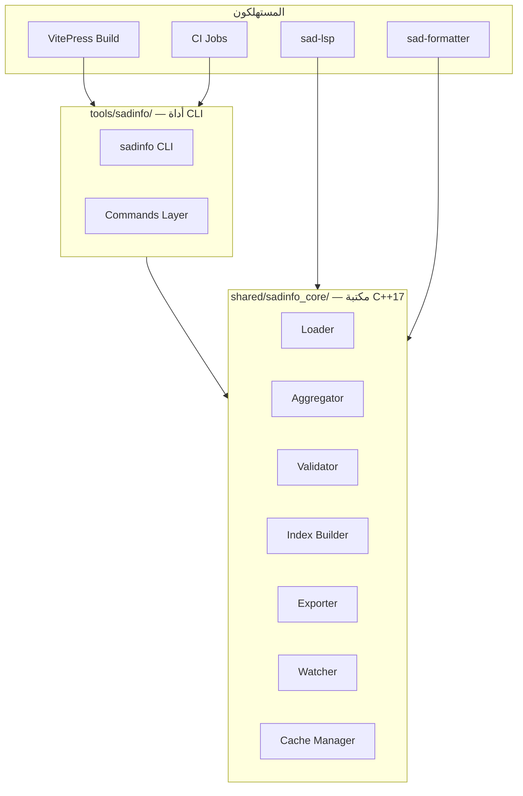
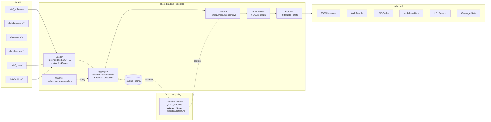
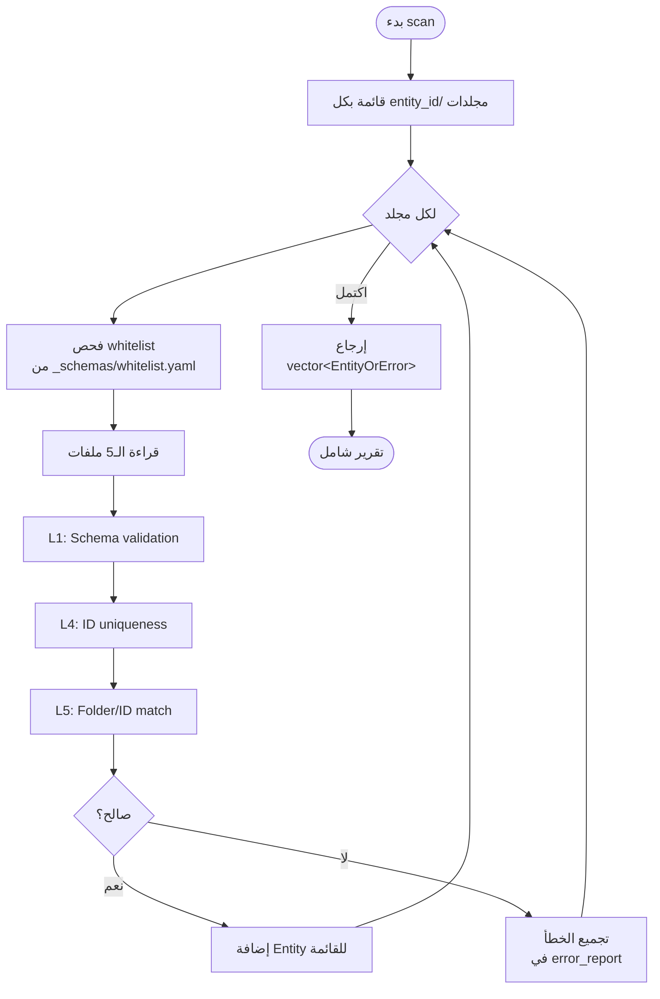
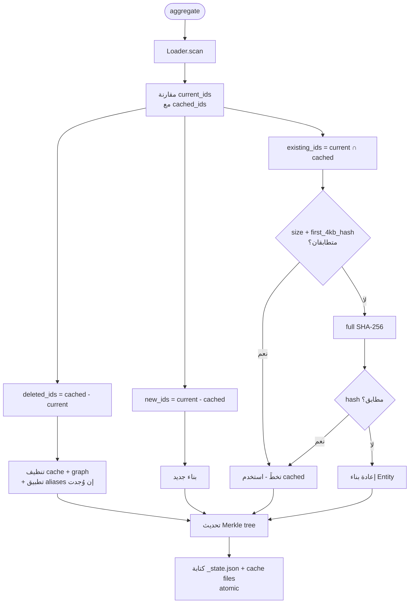
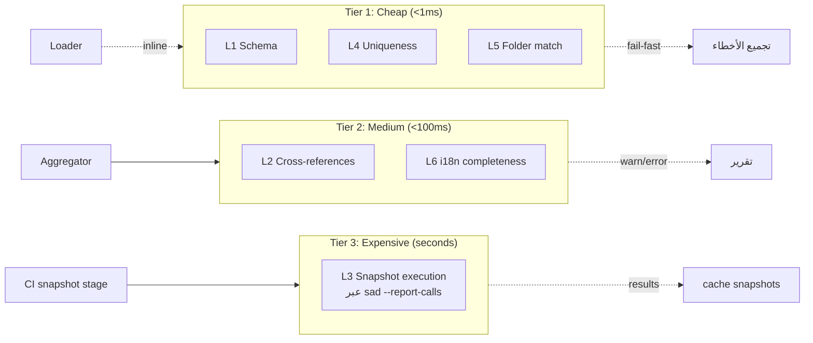
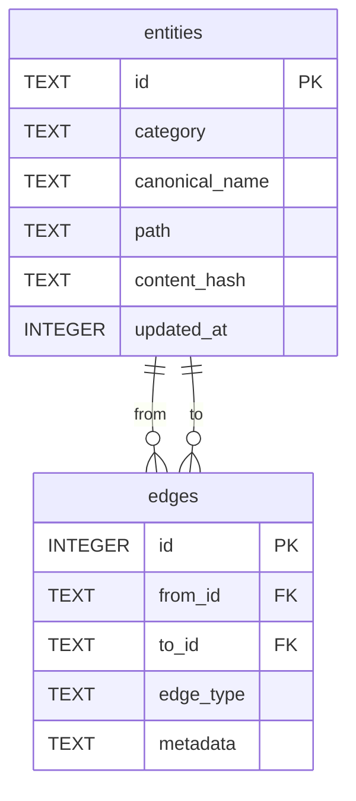
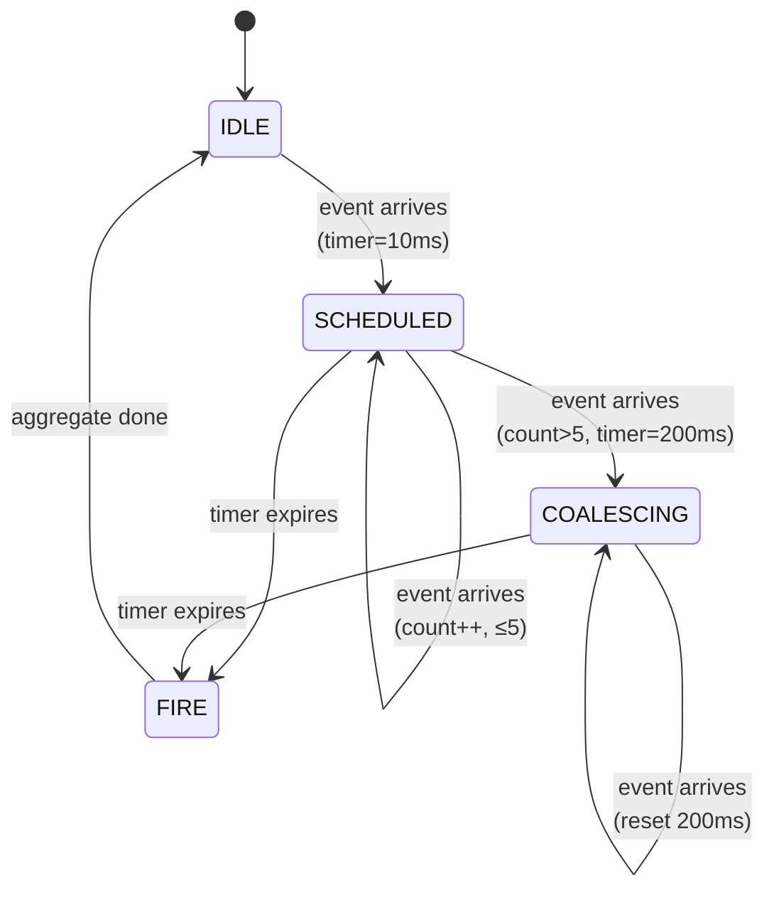
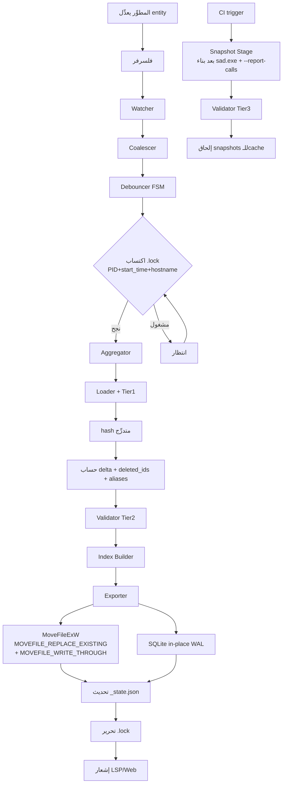
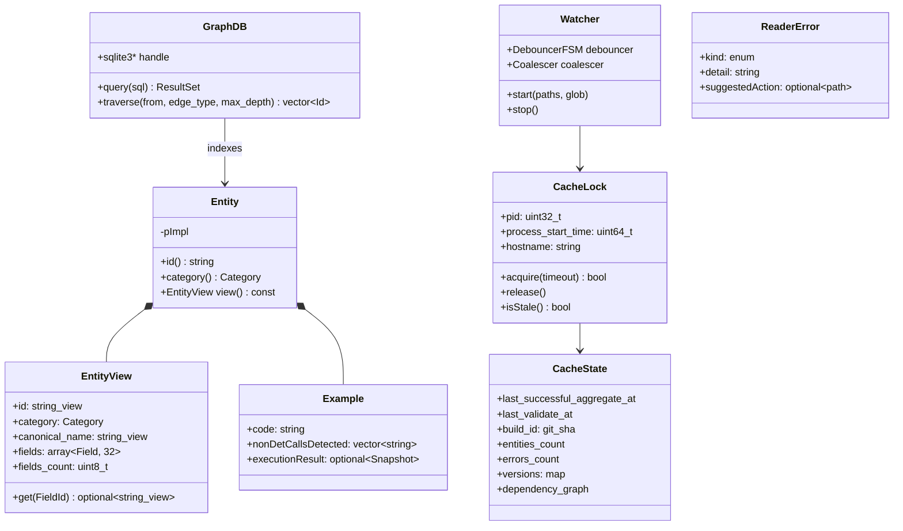

# 🏗️ بنية sadinfo المستهدفة

> **الوثيقة:** القرار المعماري المُعتَمَد لإعادة بناء `sadinfo`
> **الحالة:** قرار نهائي — جاهز للتنفيذ
> **النطاق:** المكتبة (`shared/sadinfo_core/`) + الأداة (`tools/sadinfo/`) + التكامل مع LSP و الموقع و CI

---

## §1. الرؤية المعمارية

`sadinfo` يُقسَّم إلى طبقتين متكاملتين:



**المبدأ:** المنطق في المكتبة، الـCLI طبقة رقيقة. LSP و Formatter يرتبطان بالمكتبة مباشرةً.

**استراتيجية الربط:** المكتبة تُبنى static بشكل افتراضي. عند تفعيل `BUILD_SHARED_SADINFO=ON` (مفيد لـIDE plugins التي تحتاج تحديث dynamic)، تُبنى shared library.

---

## §2. البنية العامة للتدفُّق



---

## §3. المكوِّنات التفصيلية

### §3.1 Loader — قارئ الكيانات مع تجميع الأخطاء

**المسؤولية:** قراءة كل entity من مجلداتها، تحقُّق سطحي فوري، **تجميع كل الأخطاء قبل التوقُّف**.



**القرارات:**
- **`whitelist` data-driven** من `data/_schemas/whitelist.yaml` (لا hardcoded في C++)
- **تجميع الأخطاء**: scan يكتمل دائماً، الأخطاء تُجمَّع في `ScanReport`، المطوِّر يرى كل المشاكل دفعة واحدة
- **التحقق السطحي** (L1+L4+L5) داخل Loader قبل أي cache write
- **API**: `Entity` للبناء (يستخدم pImpl)، و `EntityView` للقراءة الساخنة بـbinary layout مسطَّح:
  ```cpp
  struct EntityView {
      std::string_view id;
      Category category;
      std::string_view canonical_name;
      // بنية مسطَّحة (لا heap لكل field)
      std::array<Field, MAX_FIELDS> fields;  // MAX_FIELDS=32
      uint8_t fields_count;
      // string-interning للـfield names عبر FieldNameTable عالمي
      std::optional<std::string_view> get(FieldId name) const noexcept;
  };
  ```

### §3.2 Aggregator — التجميع التزايدي

**المسؤولية:** اكتشاف ما تغيَّر بدقة، تحديث الـcache بأقل عمل ممكن، اكتشاف الحذف.



**القرارات:**
- **التجزئة المتدرِّجة**: `size + first_4kb_hash` (fast-path, 99.9% دقة) → عند الشك `full SHA-256`. mtime للـUI/debugging فقط
- **اكتشاف الحذف**: `deleted_ids` في كل aggregate، تنظيف cache + graph
- **إعادة التسمية عبر `data/_meta/aliases.yaml`** بـschema صريحة:
  ```yaml
  aliases:
    - old_id: builtin_print
      new_id: builtin_io_print
      deprecated_at: 2026-05-23
      remove_after: 2027-01-01
      auto_update_refs: true
  ```
  Aggregator يحافظ على edges في الـgraph عبر تحديث المراجع. Validator يحذِّر للـIDs التي تجاوزت `remove_after`.
- **Merkle شجري بـcontent hash**: التغيير في entity واحدة لا يبطل غيرها

### §3.3 Validator — التحقق متعدِّد الطبقات

**المسؤولية:** فحص الجودة بـ3 طبقات حسب التكلفة، لمنع تأخير المطوِّر.



**القرارات:**
- **Tier 1** ضمن Loader → فشل سريع، لا يُلوِّث الـcache
- **Tier 2** بعد aggregate → links, cross-refs, i18n
- **Tier 3** في CI كمرحلة منفصلة بعد بناء `sad.exe`
- **اكتشاف عدم الحتمية**: Tier 3 يستدعي `sad --report-calls example.ص` (ميزة في الكومبايلر تكشف قائمة الاستدعاءات الفعلية من lexer/parser). هذه الميزة **prerequisite** يجب تنفيذها في الكومبايلر قبل Tier 3
- **i18n بـ3 modes** في `data/_schemas/i18n_policy.yaml`:
  - `strict`: غياب ترجمة = error
  - `warn`: غياب = warning
  - `lazy`: غياب = info (يُسجَّل في `missing_translations.json`)

### §3.4 Index Builder — رسم الـgraph

**المسؤولية:** بناء graph للعلاقات بين الكيانات.



**القرارات:**
- **SQLite (graph.sqlite)** بدل JSON مسطَّح → استعلامات O(log n) + recursive CTE
- **PRAGMAs صريحة عند الفتح**:
  ```sql
  PRAGMA journal_mode = WAL;
  PRAGMA wal_autocheckpoint = 1000;
  PRAGMA synchronous = NORMAL;
  PRAGMA busy_timeout = 5000;
  PRAGMA read_uncommitted = true;  -- للـreaders فقط
  ```
- **الكتابة in-place** عبر WAL (atomic بطبيعتها) — لا rename لـSQLite
- **حماية ضد الحلقات**: `max_depth` parameter في API (افتراضي 10، قابل للتعديل في `data/_schemas/query_limits.yaml` للـgraphs العميقة) + visited set
- **استعلامات مدعومة**:
  ```sql
  WITH RECURSIVE traversal(id, depth) AS (
      SELECT to_id, 1 FROM edges WHERE from_id = ? AND edge_type = ?
      UNION
      SELECT e.to_id, t.depth + 1
      FROM edges e JOIN traversal t ON e.from_id = t.id
      WHERE t.depth < :max_depth
  )
  SELECT DISTINCT id FROM traversal;
  ```

### §3.5 Exporter — توليد المُخرجات

**المسؤولية:** تحويل الـcache إلى صيغ المستهلكين المختلفين.

| المخرج | الصيغة | المستهلك |
|--------|--------|----------|
| `json_schemas/*.json` | JSON Schema Draft-07 | LSP, validators |
| `web_bundle/api.json` | JSON موحَّد | VitePress |
| `lsp_cache/index.bin` | binary سريع | sad-lsp |
| `markdown_docs/*.md` | Markdown | docs site |
| `i18n/missing_translations.json` | JSON | i18n team |
| `stats.json` | JSON | dashboard |
| `legacy/keywords_flat.yaml` | YAML | backward compat |
| `legacy/builtins_flat.yaml` | YAML | backward compat |

### §3.6 Watcher — المراقبة الذكية

**المسؤولية:** مراقبة `data/` لتشغيل aggregate تزايدي تلقائياً.



**القرارات:**
- **State machine صريحة** للـdebouncer (لا غموض):
  - `IDLE`: لا أحداث، انتظار
  - `SCHEDULED(10ms)`: حدث واحد أو قليل، استجابة سريعة للـLSP
  - `COALESCING(200ms)`: storm (>5 events خلال 10ms)، حماية من git checkout
  - `FIRE`: تشغيل aggregate، تحويل لـIDLE بعد الانتهاء
- **Glob filter** قبل الـqueue → تجاهل `.swp`, `.tmp`, ملفات النظام
- **Event coalescing** → 100 event لنفس الملف = حدث واحد
- **Cross-platform**: `ReadDirectoryChangesW` (Windows) / `inotify` (Linux) / `FSEvents` (macOS) خلف interface موحَّد

---

## §4. هيكلة الكود

```
shared/sadinfo_core/                  # المكتبة
├── include/sadinfo/
│   ├── entity.h                      # Entity (pImpl) + EntityView (flat layout)
│   ├── field_name_table.h            # string-interning للـfield names
│   ├── loader.h                      # ScanReport, EntityOrError
│   ├── aggregator.h                  # IncrementalUpdate, DeletedReport
│   ├── validator.h                   # Tier1/2/3 APIs
│   ├── index_builder.h               # GraphDB wrapper
│   ├── exporter.h                    # ExportTarget enum
│   ├── watcher.h                     # Watcher + DebouncerStateMachine
│   ├── cache_manager.h               # CacheLock + atomic operations
│   └── reader.h                      # API عام للـconsumers (LSP/Formatter)
└── src/
    ├── loader/
    ├── aggregator/
    │   ├── hash_strategy.cpp         # size+first_4kb → full SHA-256
    │   ├── merkle.cpp
    │   ├── deletion_tracker.cpp
    │   └── alias_resolver.cpp
    ├── validator/
    │   ├── tier1_cheap.cpp
    │   ├── tier2_medium.cpp
    │   ├── tier3_snapshots.cpp
    │   └── nondet_via_sad.cpp        # يستدعي sad --report-calls
    ├── index_builder/
    │   ├── sqlite_graph.cpp
    │   ├── pragma_setup.cpp
    │   └── recursive_query.cpp
    ├── exporter/
    │   ├── json_schema.cpp
    │   ├── web_bundle.cpp
    │   ├── lsp_cache.cpp
    │   └── stats.cpp
    ├── watcher/
    │   ├── windows_watcher.cpp
    │   ├── linux_watcher.cpp
    │   ├── macos_watcher.cpp
    │   ├── debouncer_fsm.cpp
    │   └── coalescer.cpp
    └── cache/
        ├── lock_file.cpp             # PID + start_time + hostname
        ├── atomic_rename.cpp         # MoveFileExW على Windows
        ├── state_json.cpp            # _state.json موحَّد
        └── version_resolver.cpp      # version dependency graph

tools/sadinfo/                        # الأداة (طبقة CLI رقيقة)
├── src/
│   ├── cli.cpp                       # main + argparse
│   ├── exit_codes.h                  # exit codes موثَّقة
│   ├── logging.cpp                   # structured JSON logging
│   └── commands/
│       ├── aggregate.cpp
│       ├── validate.cpp
│       ├── export.cpp
│       ├── watch.cpp
│       ├── query.cpp
│       ├── index.cpp
│       ├── stats.cpp
│       ├── cache.cpp                 # --clear, --info, --unlock
│       └── legacy_dump.cpp           # --dump-keywords, --dump-builtins
└── CMakeLists.txt

tests/sadinfo/
├── fixtures/
│   ├── mini_data/                    # 5 entities صحيحة (1 من كل category)
│   ├── broken_data/                  # أخطاء من كل Tier
│   ├── i18n_partial/                 # ترجمات ناقصة بـ3 modes
│   ├── non_det_examples/             # أمثلة فيها الآن()/عشوائي()
│   ├── deletion_scenario/            # entity تُحذف
│   ├── rename_scenario/              # entity تُنقل + aliases.yaml
│   ├── git_checkout_sim/             # storm محتوياتها كاملة (500 ملف)
│   └── generators/
│       └── git_checkout_storm.ps1   # سكريبت توليد storm
├── unit/
├── integration/
├── e2e/
├── golden/                           # snapshot tests للـoutputs
├── performance/
│   ├── baseline.json                 # القيم المرجعية للأداء
│   └── budgets.cpp                   # CI يقارن < 1.2x baseline
├── concurrency/                      # watch + manual aggregate
└── recovery/                         # cache تالفة، .lock يتيمة
```

---

## §5. أوامر CLI و exit codes

```bash
sadinfo aggregate [--full|--incremental|--watch]
sadinfo validate --cheap            # Tier 1
sadinfo validate --medium           # Tier 1+2
sadinfo validate --snapshots        # Tier 3 (يتطلَّب sad.exe في PATH)
sadinfo export <target> [--all]
sadinfo watch [--debounce-ms <N>]
sadinfo query "<expression>"        # على graph.sqlite
sadinfo index --rebuild
sadinfo stats                        # health dashboard
sadinfo cache --clear|--info|--unlock
sadinfo --dump-keywords             # legacy
sadinfo --dump-builtins             # legacy

# Logging عام
sadinfo --log-level=trace|debug|info|warn|error
sadinfo --log-file=<path>            # structured JSON logs
```

**Exit codes:**
| Code | المعنى |
|------|--------|
| 0 | نجاح |
| 1 | validation error (محتوى entity خاطئ) |
| 2 | cache corrupted (يتطلَّب `cache --clear`) |
| 3 | lock timeout (`.lock` يتيمة، استخدم `cache --unlock`) |
| 4 | SQLite error |
| 5 | version mismatch (يتطلَّب rebuild) |
| 6 | prerequisite missing (مثلاً `sad.exe` غير موجود لـTier 3) |
| 10 | I/O error |
| 64 | usage error (argparse) |

---

## §6. تدفُّق البيانات الكامل



---

## §7. نموذج الكائنات (Class Model)



---

## §8. تخطيط الـcache

```
.sadinfo_cache/
├── .lock                              # JSON: {pid, start_time, hostname}
├── _state.json                        # موحَّد: metadata + versions + dependency_graph + merkle root
├── graph.sqlite                       # SQLite WAL mode
├── graph.sqlite-wal                   # WAL file (auto-checkpoint كل 1000 page)
├── graph.sqlite-shm                   # shared memory
├── entities/                          # cache لكل entity
│   └── <id>/
│       ├── entity.bin                 # serialization سريع
│       ├── content_hash.txt           # SHA-256 الكامل
│       └── fast_hash.txt              # size + first_4kb_hash
├── snapshots/                         # نتائج Tier 3 (من CI)
│   └── <id>/
│       └── example_<n>.json
└── exports/                           # المُخرجات النهائية
    ├── stats.json
    ├── missing_translations.json
    ├── json_schemas/
    ├── web_bundle/
    ├── lsp_cache/
    └── markdown_docs/
```

**ملاحظات حول النظام:**
- **مدعوم**: NTFS, ext4, APFS, btrfs
- **غير مدعوم**: FAT32, exFAT (لا ضمانة atomicity لـrename)
- **`.lock` orphan detection**: عند `acquire`، يفحص `OpenProcess(PROCESS_QUERY_LIMITED_INFORMATION)` على Windows أو `kill(pid, 0)` على Linux. إذا العملية ميتة أو `start_time` مختلف → الـlock يُعتبر يتيماً ويُحذف تلقائياً

---

## §9. تكامل CMake

```cmake
# الافتراضي: متوقف محلياً
option(BUILD_DOCS "Build sadinfo docs pipeline" OFF)
option(BUILD_DOCS_SNAPSHOTS "Run Tier 3 snapshot validation" OFF)
option(BUILD_SHARED_SADINFO "Build sadinfo_core as shared library" OFF)

# في CI: مُفعَّل
if(DEFINED ENV{CI})
    set(BUILD_DOCS ON CACHE BOOL "" FORCE)
    set(BUILD_DOCS_SNAPSHOTS ON CACHE BOOL "" FORCE)
endif()

add_subdirectory(shared/sadinfo_core)
if(BUILD_DOCS)
    add_subdirectory(tools/sadinfo)

    add_custom_target(sadinfo-aggregate
        COMMAND $<TARGET_FILE:sadinfo> aggregate --full
        WORKING_DIRECTORY ${CMAKE_SOURCE_DIR})

    add_custom_target(sadinfo-validate-cheap
        COMMAND $<TARGET_FILE:sadinfo> validate --cheap
        DEPENDS sadinfo-aggregate)

    add_custom_target(sadinfo-export-all
        COMMAND $<TARGET_FILE:sadinfo> export --all
        DEPENDS sadinfo-validate-cheap)

    if(BUILD_DOCS_SNAPSHOTS)
        # Tier 3 يتطلَّب sad.exe مع --report-calls
        add_custom_target(sadinfo-snapshots
            COMMAND $<TARGET_FILE:sadinfo> validate --snapshots
            DEPENDS sad sadinfo-aggregate)
    endif()
endif()
```

**LSP fallback**: عند غياب الـcache، LSP يستلم `ReaderError{kind: NotFound, suggestedAction: "run sadinfo aggregate"}` ويُظهر notification في VS Code، ثم يعمل بـlegacy `--dump-*` كحلٍّ مؤقَّت.

---

## §10. إستراتيجية الاختبار

### Fixtures
- `mini_data/`: 5 entities صحيحة (1 من كل category) — أمثلة فعلية كاملة في الـrepo
- `broken_data/`: أخطاء من كل Tier — كل سيناريو ملف مستقل
- `i18n_partial/`: ترجمات ناقصة بـ3 modes
- `non_det_examples/`: code يستدعي `الآن()`, `عشوائي()`
- `deletion_scenario/`: entity تُحذف بين aggregate-ين (سكريبت يحاكي)
- `rename_scenario/`: entity تُنقل + `aliases.yaml`
- `git_checkout_sim/`: storm من 500 event مُولَّد بـ`generators/git_checkout_storm.ps1`

### مستويات
1. **Unit**: كل مكوِّن معزولاً
2. **Integration**: pipeline كاملة على mini_data
3. **E2E**: CLI commands الفعلية + exit codes
4. **Golden**: مقارنة مع مخرجات مرجعية ثابتة
5. **Performance**: مقارنة مع `baseline.json`، فشل إذا `current > 1.2 × baseline`
6. **Concurrency**: watch + manual aggregate متزامنين
7. **Recovery**: cache تالفة، .lock يتيمة، corrupt SQLite، PID reuse

### Performance baseline (مرجعي، يُحدَّث يدوياً عند تحسينات مقصودة)
| السيناريو | budget |
|----------|--------|
| aggregate كامل (500 entity) | < 500ms |
| aggregate تزايدي (1 entity) | < 50ms |
| watcher latency (event → cache) | < 250ms |
| git checkout storm (500 events) | < 100ms للاستقرار |
| LSP query (graph depth 5) | < 10ms |
| EntityView lookup (1 field) | < 100ns |

---

## §11. واجهة المكتبة (API للـconsumers)

```cpp
#include <sadinfo/reader.h>

namespace sadinfo {

struct ReaderError {
    enum Kind {
        NotFound,           // الـcache غير موجود
        Corrupted,          // _state.json تالف أو SHA mismatch
        VersionMismatch,    // versions غير متوافقة
        LockOrphan,         // .lock يتيمة (لا يُحلّ تلقائياً، يحتاج cache --unlock)
        SQLiteError,        // graph.sqlite غير قابل للقراءة
    };
    Kind kind;
    std::string detail;
    std::optional<std::filesystem::path> suggestedAction;
};

class Reader {
public:
    // يفتح الـcache (read-only، يتعايش مع writer)
    // ReaderError يوضِّح سبب الفشل للـLSP ليعرض رسالة دقيقة
    static std::variant<Reader, ReaderError> fromCache(
        const std::filesystem::path& cacheDir);

    // الوصول الأساسي
    std::optional<EntityView> findById(std::string_view id) const;
    std::optional<EntityView> findByCanonicalName(std::string_view name) const;
    std::vector<EntityView> findByCategory(Category cat) const;
    std::vector<EntityView> findByPrefix(std::string_view prefix) const;

    // استعلامات graph (محمية ضد الحلقات، max_depth قابل للتعديل)
    std::vector<EntityView> getRelated(std::string_view id, EdgeType edge) const;
    std::vector<EntityView> getTransitive(
        std::string_view id, EdgeType edge, int maxDepth = 10) const;

    // معلومات الـcache
    CacheState state() const;
    bool isStale(std::chrono::seconds threshold) const;

    // اشتراك في التحديثات
    using OnUpdateCallback = std::function<void(const UpdateEvent&)>;
    SubscriptionId registerWatcher(OnUpdateCallback cb);
    void unregisterWatcher(SubscriptionId id);
};

} // namespace sadinfo
```

---

## §12. ضمانات النظام

| الضمان | الآلية |
|--------|--------|
| لا تخزين بيانات غير صحيحة | Tier 1 validation داخل Loader |
| كل الأخطاء تظهر دفعة واحدة | Loader يجمع `vector<EntityOrError>` |
| الحذف يُكتشف وينظَّف | `deleted_ids` في كل aggregate |
| إعادة التسمية لا تكسر edges | `_meta/aliases.yaml` بـschema صريحة |
| التغيير عبر أجهزة/git | content-hash SHA-256 + fast-path |
| لا race conditions | `.lock` (PID+start_time) + `MoveFileExW` (Windows) + WAL (SQLite) |
| `.lock` orphan لا يُجمِّد النظام | فحص PID alive + start_time عند acquire |
| LSP لا يُحظر عند الكتابة | SQLite WAL + read_uncommitted |
| LSP لا يتجمَّد على event واحد | Debouncer FSM (10ms للحدث المفرد) |
| git checkout لا يُغرق النظام | Coalescing + COALESCING state (200ms) |
| لا cache غير متَّسقة عبر إصدارات | version dependency graph في `_state.json` |
| النظام يعمل بدون sad.exe | Tier 3 معزولة في CI، الباقي لا يعتمد عليه |
| لا حلقات تستنزف الذاكرة | `max_depth` configurable + visited set |
| audit trail متوفِّر دائماً | `_state.json` (build_id من git SHA) |
| LSP يعمل بلا cache | `ReaderError::NotFound` + fallback لـlegacy `--dump-*` |
| API يميِّز أسباب الفشل | `std::variant<Reader, ReaderError>` |
| API نظيف من yaml-cpp | pImpl للـEntity, EntityView بـflat layout |
| LSP completion سريع (آلاف الاستدعاءات) | EntityView مسطَّح + string-interning للـfield names |
| اكتشاف عدم الحتمية دقيق | `sad --report-calls` (lexer/parser فعلي، prerequisite) |
| i18n مرن حسب فريق العمل | 3 modes في `_schemas/i18n_policy.yaml` |
| المطوِّر يرى الصحة بنظرة | `sadinfo stats` dashboard |
| WAL لا ينمو بلا حدود | `wal_autocheckpoint=1000` صريحة |
| CI يكتشف تراجع الأداء | مقارنة مع `baseline.json` (< 1.2x) |
| Logs للتشخيص | structured JSON + `--log-level=trace` |
| Exit codes واضحة للـCI | جدول موثَّق في §5 |

---

## §13. التموضع مقابل الواقع الحالي

```mermaid
flowchart LR
    subgraph NOW["الآن"]
        N1[15 builtin hardcoded]
        N2[3 commands فقط]
        N3[لا cache]
        N4[لا graph]
        N5[لا watch]
        N6[لا snapshots]
        N7[لا stats]
        N8[CLI + logic مختلطان]
        N9[لا API للـconsumers]
    end

    subgraph TARGET["المستهدف"]
        T1[entities من الفلسرفر]
        T2[10+ commands + exit codes]
        T3[cache بـMerkle + SQLite WAL + state موحَّد]
        T4[graph.sqlite + CTE محمية]
        T5[Watcher مع FSM debouncer]
        T6[Tier 3 في CI + sad --report-calls]
        T7[stats dashboard + logging]
        T8[shared/sadinfo_core + tools/sadinfo]
        T9[Reader API + ReaderError variant]
    end

    NOW -. ترحيل تدريجي .-> TARGET
```



---

## §14. الخطوات التالية (Roadmap)

### Prerequisites (في الكومبايلر، قبل البدء)
- **P1**: `sad --report-calls <file>.ص` — إخراج JSON بالاستدعاءات الفعلية من lexer/parser (لـTier 3)

### Phases (للتنفيذ)
1. **POC**: `data/builtins/builtin_print_line/` + Loader أوَّلي + Tier 1 + EntityView مسطَّح
2. **Cache + Aggregator**: hash متدرِّج + Merkle + deletion + aliases + `_state.json` موحَّد
3. **Index + Reader API**: SQLite WAL + ReaderError variant + cycle protection
4. **Exporter**: 3 targets أساسية (json_schemas, web_bundle, lsp_cache)
5. **Watcher**: cross-platform + DebouncerFSM + Coalescer
6. **Tier 2 + Tier 3 + stats + logging**
7. **ترحيل المحتوى الموجود** + إزالة hardcoded
8. **إزالة legacy** بعد التحقُّق من LSP والموقع

> **ملاحظة:** كل Phase يحتاج تحويلها لـepic مع stories مرقَّمة عبر `bmad-create-epics-and-stories` قبل التنفيذ.
