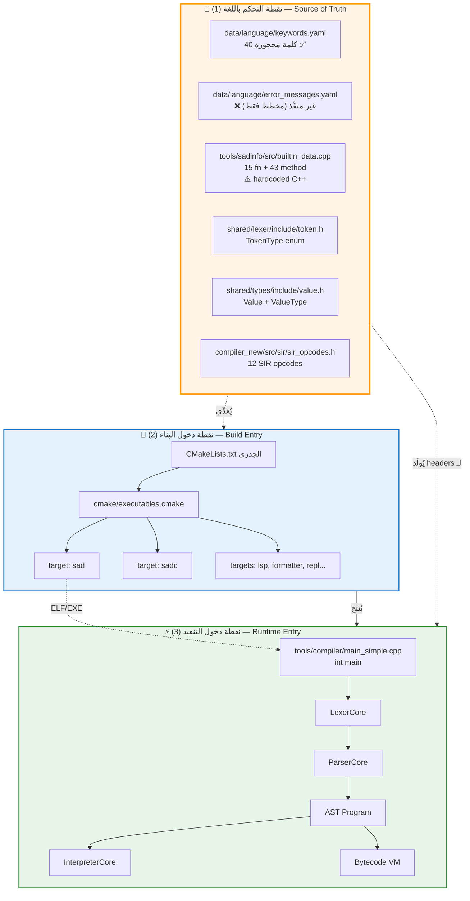
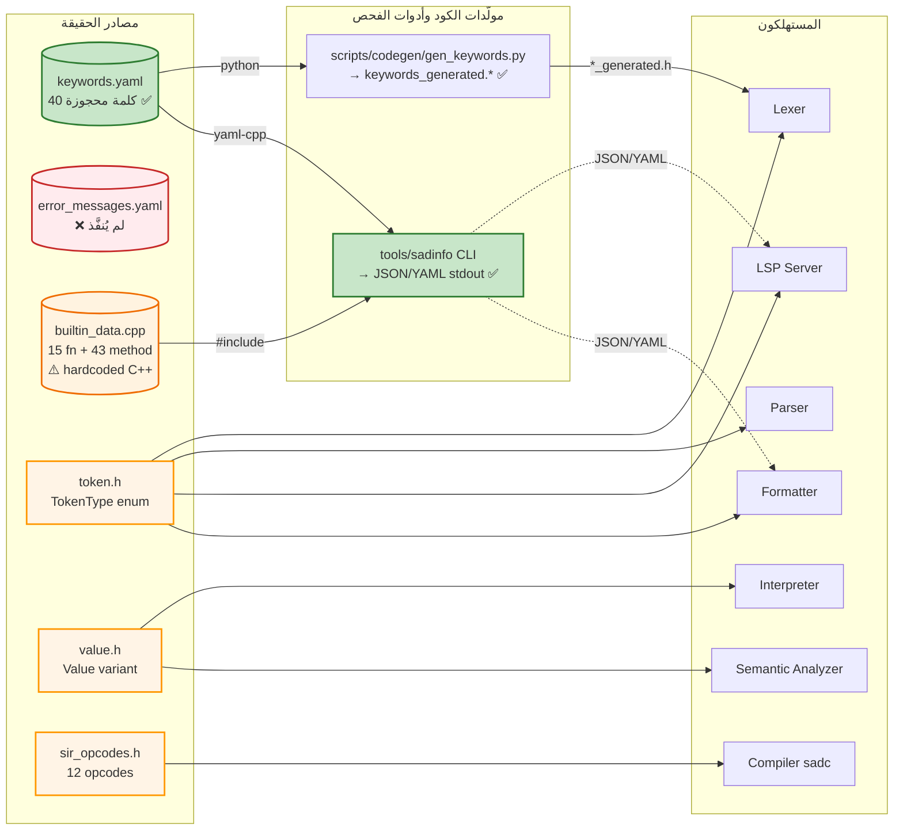
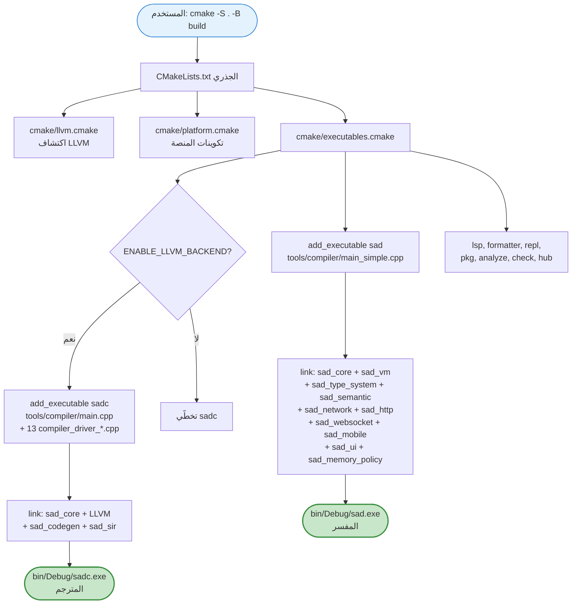
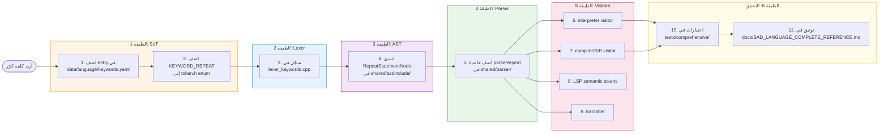
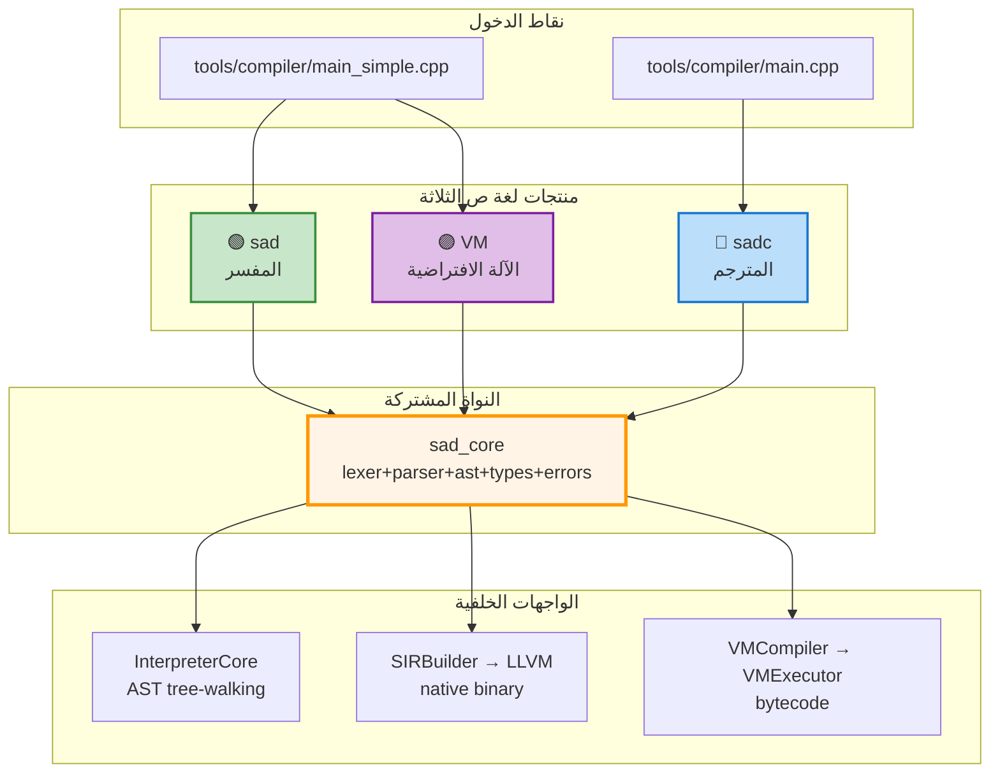

# 🗺️ الخريطة المعمارية الشاملة للغة ص — نقاط الدخول وتدفقات التحكم

> **الغرض:** هذه الوثيقة تجيب على السؤال الجوهري: *"كيف تبدأ اللغة بالبناء أصلاً وما هي نقطة الدخول التي يمكن من خلالها التحكم باللغة؟"*
>
> **المبدأ الحاكم:** التحكم باللغة ≠ تعديل `main.cpp`. التحكم الحقيقي يبدأ من **مصدر الحقيقة (Source of Truth — SoT)** وينحدر عبر طبقات `Lexer → Parser → AST → SIR → LLVM` وفق قاعدة CW-02 (Layered Architecture).

---

## 1️⃣ المنظور الكلي — ثلاث نقاط دخول مستقلة



---

## 2️⃣ نقطة التحكم باللغة (SoT) — ★ الأهم

> **القاعدة:** إذا أردت تغيير "شخصية" اللغة (كلمة، رسالة، نوع، عملية)، **ابدأ هنا**. كل شيء آخر إما مُولَّد منها أو مُستهلِك لها.



### جدول مصادر الحقيقة الكامل

| الطبقة الدلالية | مصدر الحقيقة | المسار | يُولِّد / يُستهلَك بواسطة |
|---|---|---|---|
| **الكلمات المحجوزة (40)** | YAML | [data/language/keywords.yaml](data/language/keywords.yaml) | يُحمَّل في `KeywordTable::initialize()` داخل [shared/lexer/src/lexer_keywords.cpp](shared/lexer/src/lexer_keywords.cpp) |
| **الكلمات السياقية** | C++ مباشرة | [shared/parser/](shared/parser/) | نمط التحقق المزدوج `check(TT::KW_X) ‖ (IDENTIFIER && value=="عربي")` |
| **رسائل الأخطاء** | ❌ مخطط فقط | غير موجود — جزء من ADR-EM-3 لكن لم يُنفَّذ | لا مولِّد بعد. الرسائل حالياً hardcoded في shared/errors/ |
| **الدوال المدمجة (15)** | ⚠️ C++ | [tools/sadinfo/src/builtin_data.cpp](tools/sadinfo/src/builtin_data.cpp) | يُستهلك مباشرة بواسطة sadinfo CLI — لم يُنقل لـYAML بعد |
| **أداة الفحص العامة** | ✅ C++ + yaml-cpp | [tools/sadinfo/](tools/sadinfo/) | CLI يُخرج JSON/YAML للمحررات وCI ومولِّدات التوثيق |
| **أنواع التوكنات** | enum C++ | [shared/lexer/include/token.h](shared/lexer/include/token.h) | يُستهلَك في Parser, AST visitors, LSP semantic tokens |
| **عقد AST** | C++ classes | [shared/ast/include/](shared/ast/include/) | يُزار من InterpreterCore + SIRBuilder + Formatter |
| **قيم وقت التشغيل** | C++ variant | [shared/types/include/value.h](shared/types/include/value.h) | InterpreterCore + VM + جميع built-ins |
| **SIR opcodes (12)** | enum C++ | `compiler_new/src/sir/sir_opcodes.h` | SIRBuilder → SIROptimizer → LLVMCodeGen |
| **المكتبة القياسية** | ملفات `.ص` | [stdlib/](stdlib/) | تُحمَّل بـ `استورد` عبر ModuleResolver |
| **الدوال المضمنة (~21)** | C++ مباشرة | [shared/builtins/](shared/builtins/) | تُسجَّل تلقائياً في scope الجذري |

---

## 3️⃣ نقطة دخول البناء — كيف يُبنى المشروع



### أوامر البناء العملية

```powershell
# تهيئة لمرة واحدة
cmake -S . -B build

# المفسر فقط (الأسرع)
cmake --build build --config Debug --target sad

# المترجم (يتطلب LLVM 18)
cmake --build build --config Debug --target sadc

# كل شيء
cmake --build build --config Debug
```

### مفتاح الفهم: `sad_core` هو المكتبة الأم

ربط `sad` يبدأ بـ `sad_core` — وهذا يشمل lexer, parser, ast, types, errors, semantic. أي تغيير في SoT يجب أن يُعاد بناء `sad_core` ليصل إلى الـbinaries.

---

## 4️⃣ نقطة دخول التنفيذ — رحلة ملف `.ص`

```mermaid
sequenceDiagram
    actor User as المستخدم
    participant Shell as PowerShell
    participant Main as main_simple.cpp
    participant Lex as LexerCore
    participant Par as ParserCore
    participant Sem as SemanticAnalyzer
    participant Int as InterpreterCore
    participant VM as Bytecode VM

    User->>Shell: sad.exe file.ص
    Shell->>Main: int main(argc, argv)
    Main->>Main: parse CLI flags<br/>(--vm, --ownership, --gc, --debug-server...)
    Main->>Main: ErrorManager::clear() + setSourceCode
    Main->>Lex: LexerCore lex(source)
    Lex-->>Main: token stream (lazy)

    Main->>Par: ParserCore par(lex)
    Par->>Par: parseProgram()
    Par-->>Main: Program AST

    alt parser has errors
        Par->>Main: printErrors() + return 1
    end

    Main->>Sem: type-check + ownership (اختياري)
    Sem-->>Main: AST مُحلَّل

    alt --vm flag set
        Main->>VM: compile to bytecode + execute
    else default
        Main->>Int: InterpreterCore::execute(program)
        Int->>Int: AST tree-walking
    end

    Int-->>User: output / exit code
```

### الملف الواحد المفتاح: `main_simple.cpp`

[tools/compiler/main_simple.cpp](tools/compiler/main_simple.cpp) — حوالي 700 سطر، يحوي:
- تحليل الأعلام (CLI flags)
- تهيئة `ErrorManager` للتشخيصات الموحَّدة
- استدعاء سلسلة `LexerCore → ParserCore → InterpreterCore` (السطور 597-612)
- 3 أوضاع تنفيذ: المفسر الافتراضي، VM، debug server
- مسارات بديلة: `--docs` (استخراج توثيق)، `--profile` (تنميط)، `--hot-reload`

---

## 5️⃣ تدفق ميزة جديدة عبر الطبقات

> **سيناريو:** أريد إضافة كلمة مفتاحية جديدة `كرّر` (repeat). من أين أبدأ؟



> **القاعدة الذهبية (CW-02):** كل طبقة تعتمد فقط على ما تحتها. لا تقفز ولا تعكس الاتجاه.

---

## 6️⃣ المنتجات الثلاثة وعلاقتها بنقاط الدخول



> **ملاحظة:** المفسر والـVM يشتركان في نفس الـbinary (`sad.exe`) والـentry point، يفترقان بعد الـAST عبر علم `--vm`. المترجم `sadc` له binary منفصل و entry منفصل لأنه يحتاج LLVM.

---

## 7️⃣ خلاصة عملية — أين تبدأ حسب هدفك

| هدفك | ابدأ من |
|---|---|
| أريد إضافة كلمة مفتاحية | [data/language/keywords.yaml](data/language/keywords.yaml) → [shared/lexer/include/token.h](shared/lexer/include/token.h) |
| أريد تحسين رسالة خطأ | ⚠️ النظام غير موحَّد بعد — حالياً حرِّر مباشرة في `shared/errors/` C++ |
| أريد تصدير metadata اللغة | استخدم [tools/sadinfo/](tools/sadinfo/): `sadinfo --dump-keywords --format yaml` |
| أريد إضافة نوع جديد (مثل `مركّب`) | [shared/types/include/value.h](shared/types/include/value.h) → كل المُقيّمات |
| أريد إضافة تحسين للمترجم | `compiler_new/src/sir/sir_opcodes.h` → SIROptimizer |
| أريد إضافة دالة مضمنة | [shared/builtins/](shared/builtins/) + سجّلها في init |
| أريد إضافة وحدة قياسية | [stdlib/](stdlib/) — اكتب ملف `.ص` |
| أريد فهم كيف يُنفَّذ برنامج | [tools/compiler/main_simple.cpp:597](tools/compiler/main_simple.cpp) سطور 597-612 |
| أريد فهم البناء | [CMakeLists.txt](CMakeLists.txt) → [cmake/executables.cmake](cmake/executables.cmake) |

---

## 8️⃣ المراجع الأساسية للقراءة بالترتيب

1. [shared/lexer/include/token.h](shared/lexer/include/token.h) — كل أنواع الرموز
2. [shared/lexer/src/lexer_keywords.cpp](shared/lexer/src/lexer_keywords.cpp) — تسجيل 40 كلمة
3. [shared/types/include/value.h](shared/types/include/value.h) — نوع القيم الموحَّد
4. [tools/compiler/main_simple.cpp](tools/compiler/main_simple.cpp) — نقطة دخول التنفيذ
5. [cmake/executables.cmake](cmake/executables.cmake) — تجميع `sad` و `sadc`
6. [docs/SAD_LANGUAGE_COMPLETE_REFERENCE.md](docs/SAD_LANGUAGE_COMPLETE_REFERENCE.md) — مواصفات اللغة الكاملة

---

**التاريخ:** هذه الوثيقة جزء من سلسلة `_bmad-output/systems/doc-ir/`. تُحدَّث عند أي تغيير معماري كبير.
