# 🗺️ مخططات مسارات التوثيق — من اللغة إلى المستهلكين

> **الغرض:** توثيق بصري شامل لمسارات تدفق التوثيق من **مصادر الحقيقة (SoT)** في الكود واليامل، عبر **مولِّدات وسيطة** (`sadinfo`, `gen_keywords.py`)، وصولاً إلى **المستهلكين النهائيين** (الموقع، LSP، REPL، المفسر، الفورماتر، الـCLI).
>
> **التاريخ:** 2026-05-23  
> **النسخة:** v1.0 — يعكس الحالة الفعلية في فرع `graphic` (HEAD = `e9168386`)
>
> **مفاتيح الألوان في كل المخططات:**
> - ✅ **أخضر** = منفَّذ ويعمل
> - ⚠️ **أصفر** = جزئي / مبدئي
> - ❌ **أحمر** = مخطط لكن غير منفَّذ
> - 🔵 **أزرق** = مصدر حقيقة (SoT)

---

## 1️⃣ النظرة الكلية: جميع المسارات معاً

هذا المخطط يربط جميع المسارات الموثَّقة لاحقاً في وثيقة واحدة:

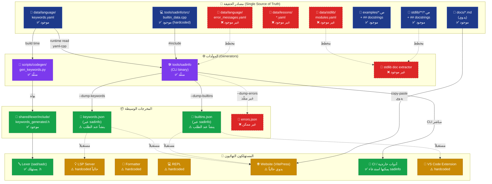

---

## 2️⃣ مسار الموقع (VitePress) — الحالة الفعلية والمقترحة

### 2.1 الحالة الفعلية اليوم

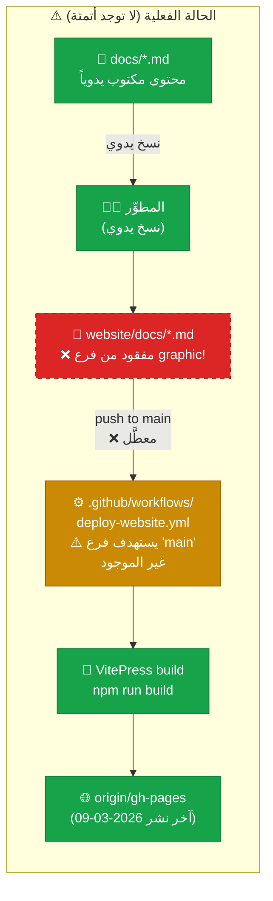

**المشاكل المرصودة:**
1. `website/` غير مُتتبَّع في فرع `graphic` (الفرع الافتراضي الحالي)
2. workflow يستهدف فرع `main` غير الموجود → النشر التلقائي معطَّل
3. لا يوجد ربط بـ`sadinfo` — المحتوى المرجعي مكتوب يدوياً

### 2.2 الحالة المقترحة (الهدف)

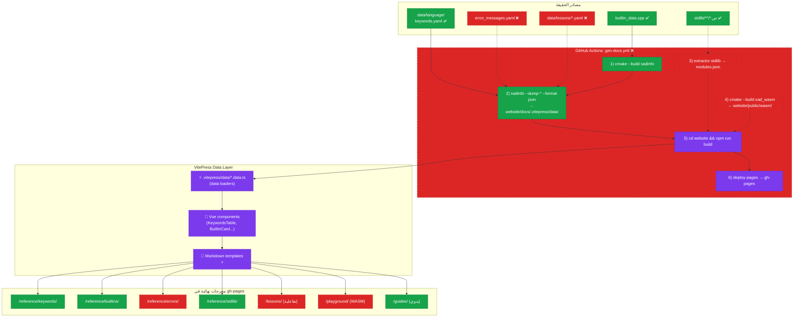

---

## 3️⃣ مسار LSP — الحالة الفعلية والمقترحة

### 3.1 الحالة الفعلية

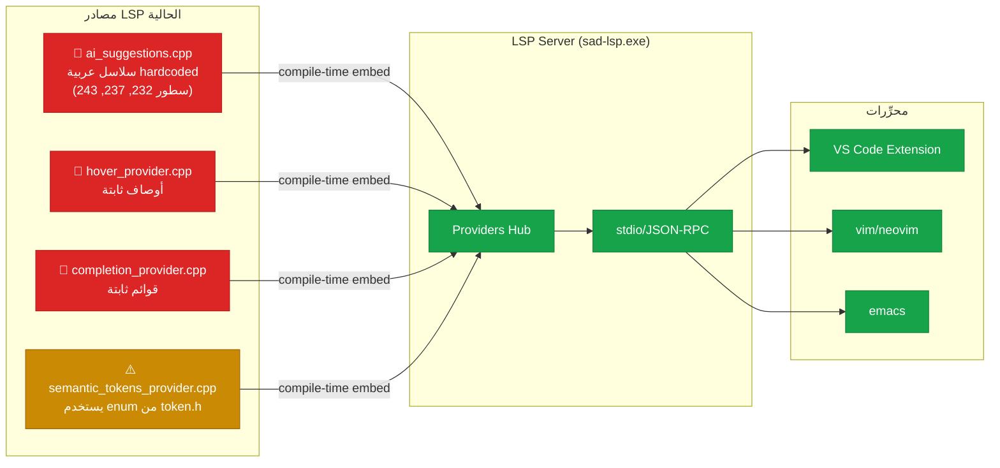

**المشاكل:**
- النصوص العربية مدفونة في الكود C++ → تعديل وصف دالة = إعادة بناء LSP
- لا مصدر حقيقة موحَّد بين LSP وsadinfo وuncomment
- ترجمة إنجليزية مستحيلة بدون refactor

### 3.2 الحالة المقترحة (sadinfo as backbone)

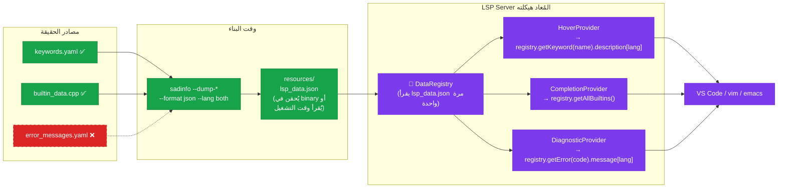

**المزايا:**
- مصدر حقيقة واحد لكل من LSP/الموقع/الـformatter
- دعم متعدد اللغات (ar/en/both) مجاناً
- تحديث الوصف = تعديل YAML واحد + إعادة بناء

---

## 4️⃣ مسارات الأدوات الأخرى

### 4.1 المفسر `sad.exe` والمترجم `sadc.exe`

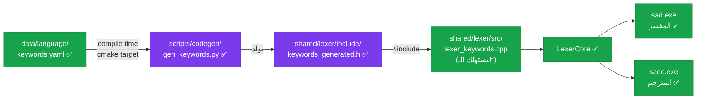

**الحالة:** ✅ **هذا المسار يعمل بشكل كامل ومُختبر** — هو المسار الوحيد المنفَّذ بدون فجوات.

### 4.2 الـ Formatter

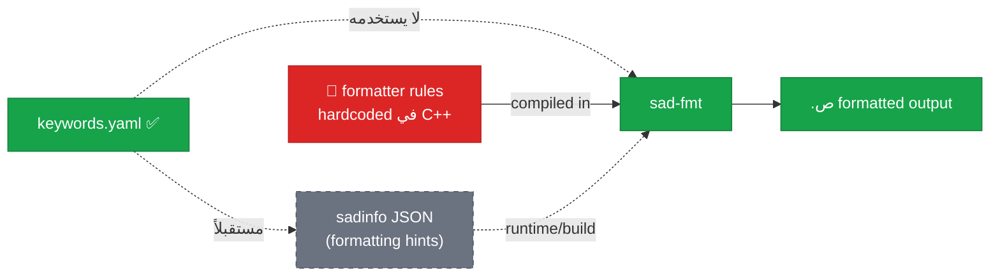

### 4.3 VS Code Extension

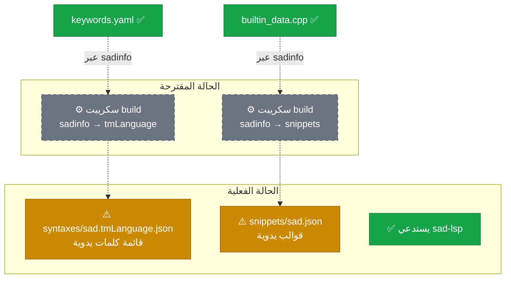

### 4.4 REPL ومدير الحزم

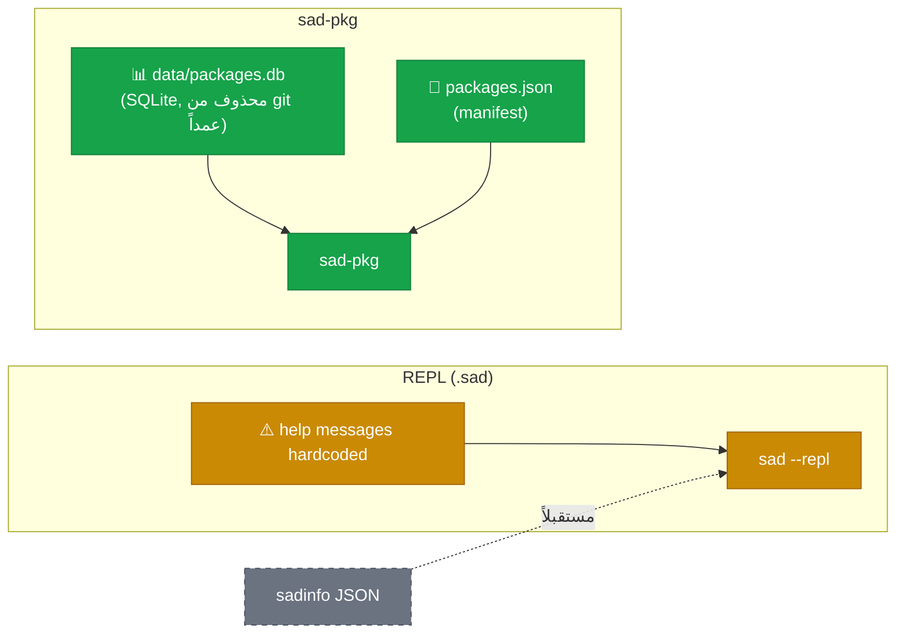

---

## 5️⃣ المسار الموحَّد المستقبلي: sadinfo كـ"hub"

التصميم النهائي المقترح يجعل `sadinfo` نقطة التوزيع المركزية:

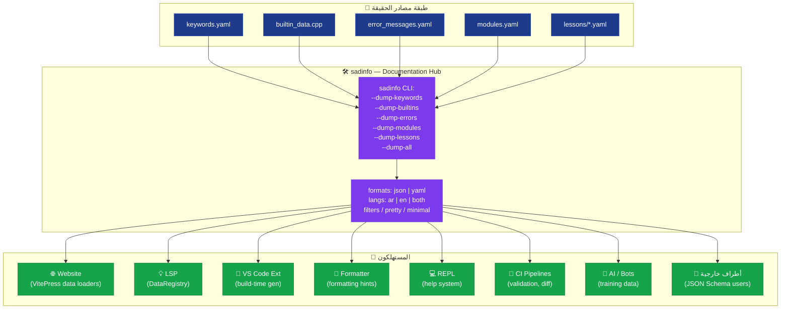

**المبدأ:** أي مستهلك جديد لا يحتاج تعديل اللغة — فقط استدعاء `sadinfo` بالمعاملات المناسبة.

---

## 6️⃣ مخطط الأولويات والاعتماديات

ترتيب التنفيذ المنطقي للوصول إلى المعمارية الكاملة:

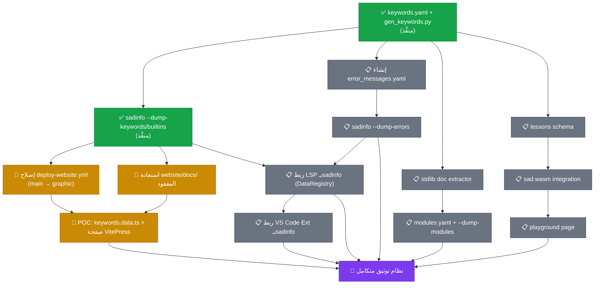

---

## 7️⃣ مقارنة سريعة: قبل وبعد

| الجانب | اليوم | المستقبل |
|---|---|---|
| **مصدر أسماء الكلمات المفتاحية** | `keywords.yaml` ✅ | `keywords.yaml` ✅ |
| **مصدر الدوال المضمنة** | `builtin_data.cpp` (C++) | `builtins.yaml` (مقترح) |
| **مصدر رسائل الأخطاء** | مبعثرة في الكود ❌ | `error_messages.yaml` |
| **توثيق الموقع** | Markdown يدوي | متولِّد من sadinfo |
| **توثيق LSP (hover/completion)** | hardcoded في C++ | متولِّد من sadinfo |
| **VS Code syntax highlighting** | tmLanguage يدوي | متولِّد من sadinfo |
| **عدد مصادر "الحقيقة" لكلمة `إذا`** | 4+ (لكسر، LSP، Ext، docs) | 1 (`keywords.yaml`) |
| **تعديل وصف دالة `اطبع`** | تعديل في 5 ملفات | تعديل في `builtin_data.cpp` أو YAML واحد |

---

## 📚 ملفات مرجعية

- [ARCHITECTURE_MAP.md](_bmad-output/systems/doc-ir/ARCHITECTURE_MAP.md) — الخريطة المعمارية الشاملة
- [DOC_FLOW_REALITY.md](_bmad-output/systems/doc-ir/DOC_FLOW_REALITY.md) — تحليل الفجوة بين المخطط والواقع
- [tools/sadinfo/README.md](tools/sadinfo/README.md) — توثيق الأداة الفعلي
- [tools/sadinfo/CHANGELOG.md](tools/sadinfo/CHANGELOG.md) — تاريخ الإصدارات
- [.github/workflows/deploy-website.yml](.github/workflows/deploy-website.yml) — workflow النشر الحالي

---

**ملاحظة:** المخططات أعلاه يمكن تصديرها كصور PNG/SVG عبر:
- VS Code: امتداد **Markdown Preview Mermaid Support**
- CLI: `npx @mermaid-js/mermaid-cli -i DOC_DISTRIBUTION_FLOWS.md -o flows.png`
- الموقع نفسه (VitePress): يدعم Mermaid مدمجاً بعد تفعيل `markdown.config.mermaid`
