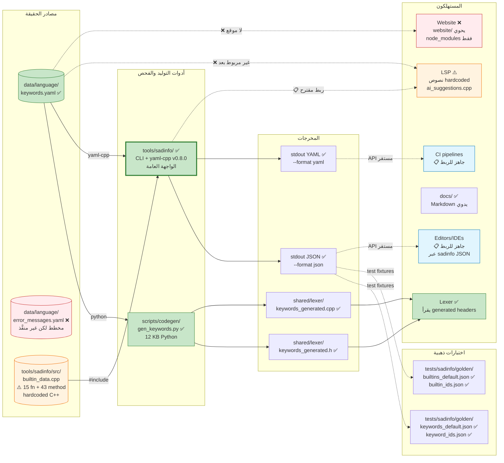
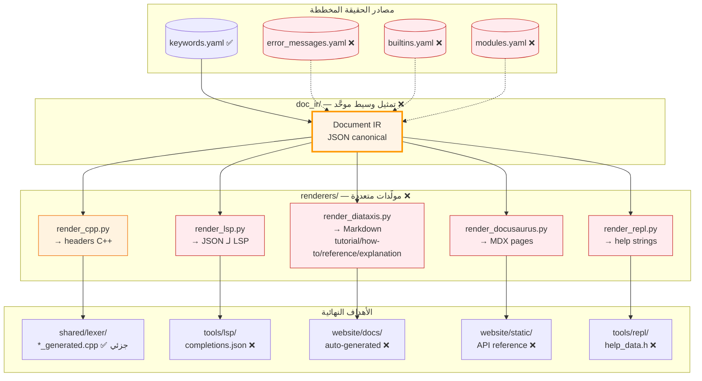
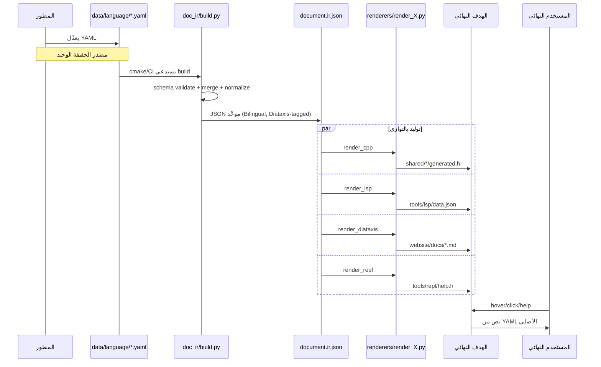

# 🔍 خريطة تدفق التوثيق — الواقع vs المخطط

> **الغرض:** هذه الوثيقة توضح **الحالة الفعلية الحالية** لتدفق التوثيق من YAML/C++ إلى المنصات المستهلكة (موقع اللغة، LSP، REPL، المحررات، CI، مولِّدات الوثائق)، مقارنةً بـ**الحالة المخططة** في ADR-006a/006b/007.
>
> **تحديث جوهري:** اكتُشف بعد البحث الأولي أن أداة [tools/sadinfo/](tools/sadinfo/) موجودة وتُمثِّل الواجهة الفعلية لتصدير metadata اللغة. هذه الوثيقة محدَّثة لتعكس ذلك.

---

## 1️⃣ الحالة الفعلية اليوم — ما يعمل فعلاً

### الحقائق المُكتشفة بعد البحث الميداني الكامل

1. **أداة `sadinfo` موجودة ومُكتملة** — [tools/sadinfo/](tools/sadinfo/) عبارة عن CLI تربط `sad_shared` + `yaml-cpp v0.8.0`:
   - `sadinfo --dump-keywords` → JSON/YAML من [keywords.yaml](data/language/keywords.yaml)
   - `sadinfo --dump-builtins` → JSON/YAML من [builtin_data.cpp](tools/sadinfo/src/builtin_data.cpp) (15 دالة + 43 طريقة)
   - مرشحات متعددة: `--filter category=X`, `--by-category`, `--lang ar`, `--minimal`, `--compact`
   - 4 ملفات ذهبية في [tests/sadinfo/golden/](tests/sadinfo/golden/) كاختبارات تراجع
   - بُني عبر [cmake/yaml_cpp.cmake](cmake/yaml_cpp.cmake)
   - Stories مكتملة: Story 1.2 (keywords), Story 1.3 (builtins)

2. **مولِّد الكود الوحيد:** `gen_keywords.py` (12 534 بايت). يقرأ `keywords.yaml`، يولِّد headers C++ لـLexer. منفصل عن sadinfo.

3. **LSP لا يستهلك sadinfo بعد:** نصوص التوثيق ما زالت *hardcoded* في [tools/lsp/src/ai_suggestions.cpp](tools/lsp/src/ai_suggestions.cpp):
   - السطر 232: `fix.documentation = "هذا المتغير غير معرّف. أضف تعريفاً له."`
   - السطر 237: `fix.documentation = "الكتلة تحتاج كلمة 'نهاية' لإغلاقها."`
   - **البنية جاهزة** للربط (sadinfo يخرج JSON ثابت)، لكن الربط نفسه لم يُنفَّذ.

4. **`error_messages.yaml` لم يُكتب أبداً:**
   - `git log --all --diff-filter=D` لا يُظهر أي حذف.
   - `git fsck --lost-found` يكشف 3422 dangling blob كلها CMake artifacts، لا ملفات لغة.
   - الفروع البعيدة (`origin/001-graphics`, `origin/freestanding`، إلخ) لا تحويه.
   - **الخلاصة:** غير موجود في أي commit، أي stash، أي فرع.

5. **`builtin_data.cpp` hardcoded في C++:** هذا يخالف مبدأ SoT (مصدر حقيقة واحد). يجب نقله لـ`data/language/builtins.yaml` لاحقاً، لكن يعمل اليوم.

6. **الموقع غير موجود:** [website/](website/) يحوي فقط `node_modules/`. لا Docusaurus config، لا src، لا pages.

7. **المجلدات الفارغة في `scripts/codegen/`:** `renderers/`, `runners/`, `_lib/`, `doc_ir/` تحوي فقط `__pycache__/`. آثار pytest cache لأسماء (`test_lsp_renderer.py`, `test_doc_ir.py`) لكن الملفات نفسها **لم تُلتزم أبداً**.

8. **`docs/` مكتوب يدوياً:** ملفات Markdown في [docs/](docs/) مكتوبة بشريّاً، ليست مولَّدة.

---

## 2️⃣ الحالة المخططة — ما تقوله ADRs

> هذا ما **يجب** أن يكون موجوداً وفق ADR-006a (توحيد codegen) + ADR-006b (توليد التوثيق) + ADR-007 (Docusaurus).

### المرجعية في ADRs

- [_bmad-output/systems/doc-ir/ADR-006_توحيد_نظام_التوليد.md](_bmad-output/systems/doc-ir/ADR-006_توحيد_نظام_التوليد.md)
- [_bmad-output/systems/doc-ir/ADR-006a_توحيد_codegen.md](_bmad-output/systems/doc-ir/ADR-006a_توحيد_codegen.md)
- [_bmad-output/systems/doc-ir/ADR-006b_توليد_التوثيق_مؤجَّل.md](_bmad-output/systems/doc-ir/ADR-006b_توليد_التوثيق_مؤجَّل.md) ← اسم الملف نفسه يحوي كلمة "مؤجَّل"
- [_bmad-output/systems/doc-ir/ADR-007_منصة_التوثيق_Docusaurus.md](_bmad-output/systems/doc-ir/ADR-007_منصة_التوثيق_Docusaurus.md)
- [_bmad-output/systems/doc-ir/ADR-008_علاقة_الموقع_بالمشروع.md](_bmad-output/systems/doc-ir/ADR-008_علاقة_الموقع_بالمشروع.md)

اسم الـADR (`ADR-006b_توليد_التوثيق_مؤجَّل.md`) يكشف الحقيقة الرسمية: **التنفيذ مؤجَّل صراحةً منذ كتابة الـADR**.

---

## 3️⃣ المبدأ النظري للتدفق (عندما يُنفَّذ)

### الفائدة المعمارية للـDocument IR الوسيط

بدون IR وسيط، كل مولِّد يقرأ YAML مباشرة → تكرار منطق + عدم توحيد. مع IR:
- YAML schema يُفحص **مرة واحدة** في `build.py`
- كل renderer يستهلك بنية JSON بسيطة موحَّدة
- إضافة هدف جديد = renderer جديد فقط، لا تغيير في YAML
- اختبارات الـIR منفصلة عن اختبارات الـrenderers

---

## 4️⃣ تحليل الفجوة — ما الذي ينقص (محدَّث)

| المكوّن | الحالة | الجهد المقدَّر |
|---|---|---|
| `sadinfo` CLI (الواجهة العامة) | ✅ منفَّذ بالكامل (Story 1.2 + 1.3) | — |
| `keywords.yaml` كـSoT | ✅ موجود | — |
| `error_messages.yaml` (مصدر) | ❌ غير موجود في git | S — إنشاء + ملء (~10 ساعات) |
| `sadinfo --dump-errors` | ❌ غير منفَّذ | S — يحتاج error_messages.yaml أولاً (~5 ساعات) |
| `builtins.yaml` (نقل من C++ إلى YAML) | ❌ البيانات في `builtin_data.cpp` | M — توحيد SoT (~12 ساعة) |
| ربط LSP بـsadinfo JSON | ❌ غير منفَّذ | M — refactor C++ في ai_suggestions.cpp (~15 ساعة) |
| Diátaxis renderer (markdown) | ❌ غير منفَّذ | L — كبير (~25 ساعة) |
| `website/` بناء Docusaurus | ❌ صفر — فقط `node_modules/` | XL — كبير جداً (~40 ساعة) |
| `modules.yaml` (وحدات stdlib) | ❌ غير موجود | M — مسح stdlib/ (~12 ساعة) |
| تكامل sadinfo مع Docusaurus | ❌ يعتمد على وجود website | M — يحتاج الموقع أولاً (~10 ساعات) |

**التقدير الإجمالي الجديد لإكمال الخطة:** ~130 ساعة (انخفض من 160 لأن sadinfo موجود).

---

## 5️⃣ خيارات المسار للأمام (محدَّثة)

| الخيار | الوصف | التكلفة | المخاطر |
|---|---|---|---|
| **أ — توسعة sadinfo (الأطبيعي)** | إنشاء error_messages.yaml + `--dump-errors` كـStory 1.4 | ~15 ساعة | يبني على بنية موجودة |
| **ب — توحيد SoT** | نقل builtins من C++ إلى YAML | ~12 ساعة | refactor كبير لكن قيمته عالية |
| **ج — ربط LSP بـsadinfo** | إزالة hardcoded strings، استهلاك JSON | ~15 ساعة | يثبت قيمة sadinfo عملياً |
| **د — بناء website** | Docusaurus init + استهلاك sadinfo | ~40 ساعة | استثمار ضخم |
| **هـ — مزيج (أ+ج)** | error_messages + ربط LSP | ~30 ساعة | **الأكثر قيمة** للمستخدم النهائي |

---

## 6️⃣ الخلاصة الجوهرية (محدَّثة)

> **سؤالك الأصلي:** *"كيف ترسل اللغة التوثيقات للموقع وLSP وغيرها من ملفات yaml؟"*
>
> **الجواب الدقيق:**
> - **اليوم:** الواجهة العامة موجودة عبر [tools/sadinfo/](tools/sadinfo/) ✅. يخرج JSON/YAML من `keywords.yaml` + `builtin_data.cpp`. أي مستهلك (محرر، CI، مولِّد توثيق) يمكنه استدعاء `sadinfo.exe --dump-X --format json` والحصول على بيانات مهيكلة.
> - **المفقود:**
>   - `error_messages.yaml` لم يُكتب → `--dump-errors` غير ممكن بعد
>   - LSP لم يُربط بـsadinfo (يستخدم hardcoded strings)
>   - الموقع غير موجود
>   - builtins ما زالت hardcoded في C++ بدلاً من YAML
>
> **الأولوية المنطقية:** التوسع في sadinfo (`--dump-errors` ثم ربط LSP) أرخص بكثير من بناء Docusaurus، ويقدِّم قيمة فورية للمستخدمين.

---

**التاريخ:** هذه الوثيقة جزء من سلسلة [_bmad-output/systems/doc-ir/](_bmad-output/systems/doc-ir/). كُتبت بعد بحث ميداني مباشر في الكود + `git log` + `git fsck`.

**ملفات مرجعية:**
- [ARCHITECTURE_MAP.md](_bmad-output/systems/doc-ir/ARCHITECTURE_MAP.md) — الخريطة المعمارية الشاملة
- [tools/sadinfo/README.md](tools/sadinfo/README.md) — توثيق الأداة الفعلي
- [tools/sadinfo/CHANGELOG.md](tools/sadinfo/CHANGELOG.md) — تاريخ التطوير
