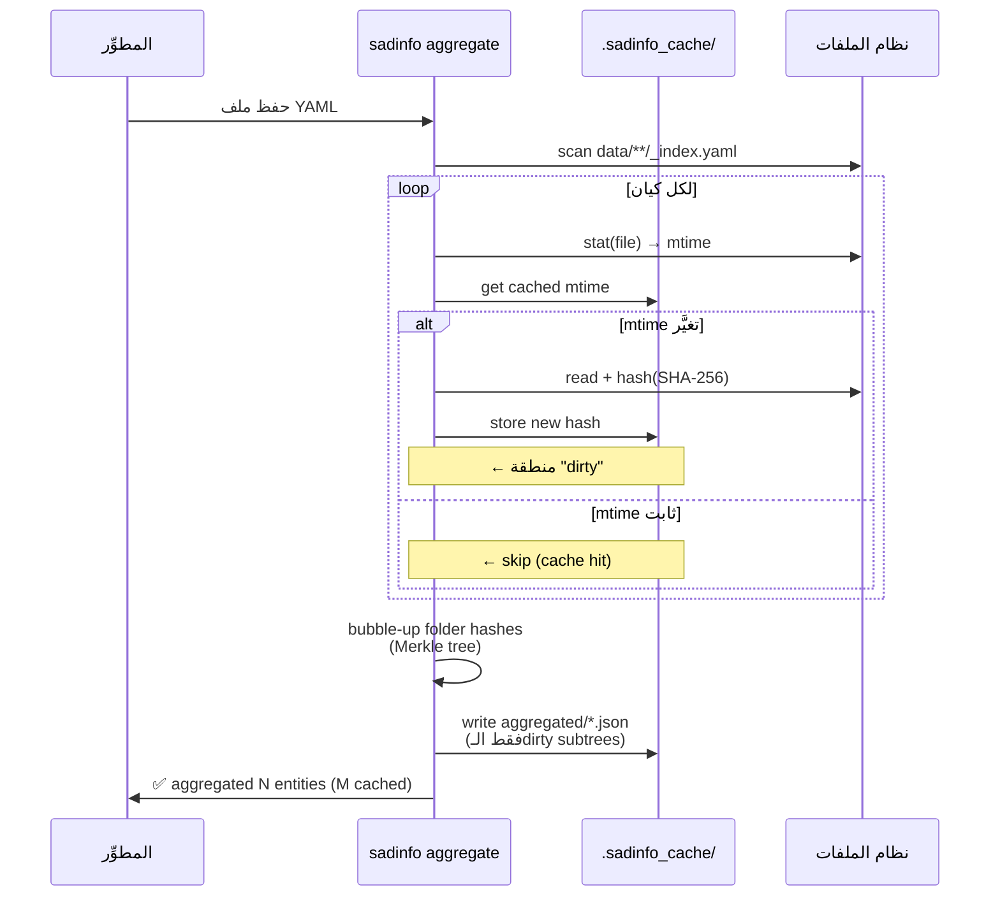
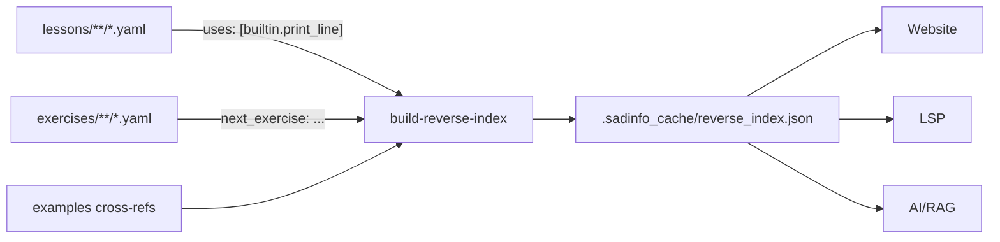
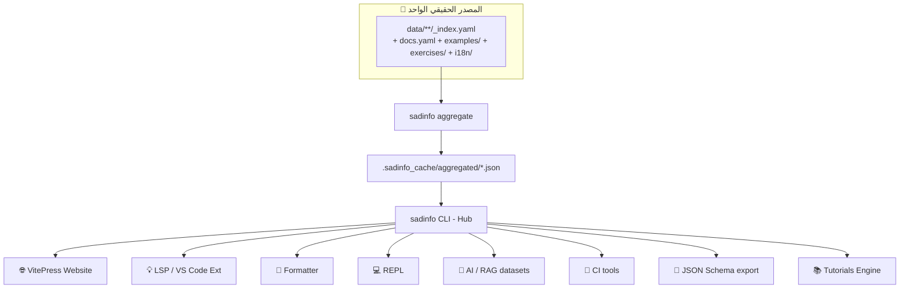

# 📄 نظام YAML الموحَّد لتوثيق لغة ص — التصميم النهائي

> **الهدف:** تصميم بنية YAML غنيَّة وإلزامية تضمن أن **مصدر حقيقة واحد** يكفي لتغذية:
> الموقع، LSP، VS Code Ext، REPL، الفورماتر، AI/Bots، CI، JSON Schema، والدروس التعاعلية.
>
> **المبدأ:** "اكتب مرة، اقرأ من كل مكان" (Write Once, Read Anywhere - WORA).
>
> **التاريخ:** 2026-05-23  
> **الإصدار:** v1.0 (نهائي)

---

## 1️⃣ المشكلة

اليوم لإضافة دالة مدمجة واحدة (مثل `اطبع_سطر`) المطوِّر يحتاج تعديل **5 مواقع منفصلة** على الأقل:

| الموقع | الغرض | المشكلة |
|--------|-------|---------|
| `tools/sadinfo/builtin_data.cpp` | بيانات الـ Hub | تعديل C++ يدوي |
| `stdlib/io/include/io_builtin.h` | تسجيل في المفسر | منفصل |
| `compiler_new/.../builtin_codegen.cpp` | توليد LLVM IR | منفصل |
| `website/docs/builtins/print.md` | توثيق الموقع | يدوي |
| `tools/lsp/src/completion_provider.cpp` | autocomplete | يدوي |

**النتيجة:** نسيان موقع واحد = توثيق ناقص + LSP غير متزامن + ثقة المطوِّر مهتزَّة.

**الحل:** **مصدر حقيقة واحد** بصيغة YAML غنيَّة → `sadinfo aggregate` يولِّد كل الباقي تلقائياً.

---

## 2️⃣ المبدأ الأساسي: مجلد لكل كيان

**كل كيان (دالة، كلمة، خطأ، درس) = مجلد مستقل.**  
لا توجد ملفات hybrid، لا توجد استثناءات، لا توجد ملفات ضخمة تجمع عدة كيانات.

```
data/
├── _schemas/                  # تعريفات JSON Schema + ميتاداتا عامة
│   ├── VERSION.yaml
│   ├── i18n_policy.yaml
│   ├── builtin.schema.json
│   ├── keyword.schema.json
│   ├── error.schema.json
│   └── lesson.schema.json
│
├── _meta/
│   └── CODEOWNERS             # ملكية الكيانات (single source of truth)
│
├── builtins/
│   ├── builtin_print_line/    # ← كيان واحد = مجلد
│   ├── builtin_read/
│   └── builtin_length/
│
├── keywords/
│   ├── keyword_if/
│   ├── keyword_while/
│   └── keyword_function/
│
├── errors/
│   ├── error_unexpected_token/
│   └── error_type_mismatch/
│
└── lessons/
    ├── lesson_01_hello_world/
    └── lesson_02_variables/

.sadinfo_cache/                # git-ignored: نواتج aggregate
    ├── entity_hashes.json
    ├── reverse_index.json
    └── aggregated/
        ├── builtins.json
        ├── keywords.json
        └── full_export.json
```

### قاعدة التسمية

```
<folder_name> = <kind>_<id.last_segment>
```

أمثلة: `builtin_print_line/`، `keyword_if/`، `error_unexpected_token/`، `lesson_01_hello_world/`.

> ✅ صحيح: `builtin_print_line/`  
> ❌ خطأ: `print_line/` أو `builtins/print_line.yaml`

### 🔒 سياسة الاسم الواحد الصريح (Single Canonical Name)

كل كيان (دالة، كلمة محجوزة، خطأ، طريقة) له **اسم عربي واحد فقط**:

- ❌ **لا أسماء مستعارة** (`aliases`) — لا `اطبع` كاختصار لـ`اطبع_سطر`.
- ❌ **لا أسماء إنجليزية** (`name_en`) — اللغة عربية بالكامل.
- ❌ **لا أسماء بديلة للمعاملات** — معامل واحد = اسم عربي واحد.
- ✅ الحقل التقني `id` (مثل `builtin.print_line`) موجود فقط للأدوات (Schema refs, JSON keys, file paths) ولا يُعرض للمستخدم النهائي.
- ✅ ملفات `i18n/*.yaml` تترجم **النصوص التوضيحية فقط** (summary, description, titles, prompts) — لا تترجم الأسماء أبداً.

**المبرِّر:**
1. لغة ص لغة عربية الهوية — تعدُّد الأسماء يُفقد الانضباط ويُفسد الدروس.
2. الأسماء المستعارة تُعقِّد LSP وFormatter (أيُّ اسم هو الأساسي؟).
3. ترجمة الأسماء = لغة مختلفة لا لغة ص.

---

## 3️⃣ المكوِّنات داخل كل مجلد (whitelist صارم)

كل مجلد كيان **يحوي فقط** هذه الملفات/المجلدات الـ5 (أي ملف خارج هذه القائمة يفشل التحقق):

| المكوِّن | إلزامي؟ | الغرض |
|---------|----------|-------|
| `_index.yaml` | ✅ | البيانات الأساسية + الميتاداتا |
| `docs.yaml` | مستحسن | الوصف التفصيلي + الملاحظات + see_also |
| `examples/` | اختياري | أمثلة كود قابلة للتشغيل (ملف لكل مثال) |
| `exercises/` | اختياري | تمارين تفاعلية للدروس (ملف لكل تمرين) |
| `i18n/` | اختياري | ترجمات overlay (`en.yaml`, `fr.yaml`, ...) |

### `_index.yaml` (إلزامي)

```yaml
# data/builtins/builtin_print_line/_index.yaml
schema_version: 1
id: builtin.print_line
kind: builtin
name: اطبع_سطر          # اسم عربي واحد صريح. لا أسماء مستعارة. لا اسم إنجليزي.
category: io
since: 0.1.0

signature:
  params:
    - name: قيمة          # اسم المعامل عربي فقط
      type: any
      required: true
  returns: void
  is_variadic: false

tooling:
  lsp:
    completion: true
    snippet: "اطبع_سطر(${1:قيمة})"
    documentation_hover: true
  formatter:
    breaks_line: true
  repl:
    suggest_after: ["متغير", "ثابت"]

version_info:
  added: 0.1.0
  deprecated: null
  replaced_by: null

owners: [@author1]    # يُحقَّق ضد _meta/CODEOWNERS
```

### `docs.yaml` (مستحسن إن `summary` > 100 حرف أو يلزم تفاصيل)

```yaml
schema_version: 1
summary: "يطبع قيمة على الإخراج القياسي متبوعةً بسطر جديد."
description: |
  دالة الطباعة الأساسية في لغة ص. تُسطِّر القيمة المُمرَّرة (أي نوع) إلى
  مخرج النص القياسي (stdout) ثم تُضيف فاصل سطر `\n`.
notes:
  - "تستخدم `\n` على جميع المنصَّات (cross-platform)."
  - "لطباعة بدون سطر جديد استخدم `اطبع`."
see_also:
  - builtin.print
  - builtin.read
related_lessons:
  - lesson.01_hello_world
```

### `examples/` (ملف لكل مثال)

```yaml
# data/builtins/builtin_print_line/examples/basic.yaml
schema_version: 1
title: "طباعة بسيطة"
order: 1.0          # float للسماح بإدراج بين 1.0 و 2.0
runnable: true
deterministic: true
code: |
  اطبع_سطر("مرحبا بالعالم")
expected_output: "مرحبا بالعالم\n"
```

```yaml
# data/builtins/builtin_print_line/examples/with_variable.yaml
schema_version: 1
title: "طباعة متغيِّر"
order: 2.0
runnable: true
deterministic: true
code: |
  متغير اسم = "ص"
  اطبع_سطر("مرحبا " + اسم)
expected_output: "مرحبا ص\n"
```

### `exercises/` (ملف لكل تمرين)

```yaml
# data/builtins/builtin_print_line/exercises/print_name.yaml
schema_version: 1
title: "اطبع اسمك"
difficulty: easy        # easy | medium | hard
topics: [io, basics]    # متعدِّد المحاور
prompt: "اكتب برنامجاً يطبع اسمك متبوعاً بسطر جديد."
starter_code: |
  متغير اسم = "___"
  # أكمل هنا
solution: |
  متغير اسم = "أحمد"
  اطبع_سطر(اسم)
test_strategy: regex
expected_pattern: "^.+\\n$"
next_exercise: builtin.print_line.exercises.print_two_lines
```

### `i18n/` (overlay فقط — العربية هي الافتراضي)

```yaml
# data/builtins/builtin_print_line/i18n/en.yaml
schema_version: 1
docs:
  summary: "Prints a value to stdout followed by a newline."
  description: |
    The primary print builtin in Sad language. Outputs the given value
    (any type) to standard output and appends a newline `\n`.
  notes:
    - "Uses `\n` on all platforms (cross-platform)."
examples:
  basic:
    title: "Simple print"
  with_variable:
    title: "Print a variable"
exercises:
  print_name:
    title: "Print your name"
    prompt: "Write a program that prints your name followed by a newline."
```

> **قاعدة i18n:** العربية هي اللغة الافتراضية (`default_language: ar`).  
> ملفات overlay تترجم **الحقول النصِّية فقط** (titles, summaries, prompts, notes).  
> الكود والـIDs والـsignatures لا تُترجم أبداً.

---

## 4️⃣ ملفات على مستوى المشروع

### `_schemas/VERSION.yaml`

```yaml
schema_version: 1
default_language: ar
supported_languages: [ar, en, fr]
fallback_strategy: show_default_with_marker  # 🔄 marker حين تنقص الترجمة
deprecation_policy:
  warn_versions: 2
  remove_after: 4
```

### `_schemas/i18n_policy.yaml`

```yaml
schema_version: 1
required_translations:
  - docs.summary
optional_translations:
  - docs.description
  - docs.notes
  - examples.*.title
  - exercises.*.title
  - exercises.*.prompt
never_translate:
  - id                  # المعرِّف التقني (ASCII) — للأدوات فقط
  - name                # الاسم العربي الصريح للكيان
  - signature           # أسماء المعاملات عربية ولا تُترجم
  - code
  - expected_output
  - expected_pattern
fallback_visual_marker: "🔄"   # يُعرض حين تظهر اللغة الافتراضية بدل الترجمة
```

### `_meta/CODEOWNERS`

```yaml
# مصدر حقيقة واحد للملكية. _index.yaml.owners يُحقَّق ضد هذا الملف.
schema_version: 1
owners:
  "@core-team":
    - "data/builtins/**"
    - "data/keywords/**"
  "@docs-team":
    - "data/lessons/**"
  "@author1":
    - "data/builtins/builtin_print_line/"
    - "data/builtins/builtin_print/"
```

---

## 5️⃣ آلية `sadinfo aggregate` (incremental + Merkle)

التجميع **حتمي ومتدرِّج**: لا يُعاد بناء كل شيء عند كل تغيير.



**المزايا:**
- **سرعة:** تعديل ملف واحد = إعادة بناء فرعه فقط.
- **حتمية:** نفس المدخلات → نفس الـhash → نفس المخرجات.
- **CI-friendly:** يمكن التحقق من ثبات الـhashes بين البناءات.

---

## 6️⃣ Reverse Index كـ artifact مستقل

الدروس والتمارين تشير إلى الـbuiltins/keywords. نحتاج عكس هذه الإشارات لاستعلامات مثل: "ما الدروس التي تستخدم `اطبع_سطر`؟"



```json
// .sadinfo_cache/reverse_index.json (مثال)
{
  "builtin.print_line": {
    "used_in_lessons": ["lesson.01_hello_world", "lesson.03_strings"],
    "referenced_by_exercises": ["builtin.print_line.exercises.print_name"],
    "see_also_back_refs": ["builtin.print"]
  }
}
```

---

## 7️⃣ التحقق (`sadinfo validate`)

### مستويات التحقق

| المستوى | متى يعمل | الفحوصات |
|---------|----------|----------|
| `--syntax` | pre-save (LSP) | YAML صحيح + schema match |
| `--strict-refs` | pre-commit hook | `see_also`, `next_exercise`, `uses`, `error_id`, `owners` كلها صالحة |
| `--snapshots` | CI | `runnable: true` + `deterministic: true` → تنفيذ ومقارنة `expected_output`. غير الحتمية → `expected_pattern` (regex match) |
| `--whitelist` | CI | كل مجلد كيان يحوي فقط الملفات المسموحة |
| `--naming` | CI | `folder_name == kind + "_" + id.last_segment` |
| `--i18n` | CI | الحقول في `required_translations` موجودة في كل overlay |

### مثال خرج

```
$ sadinfo validate --strict-refs --snapshots
✅ 142 entities, 287 examples, 53 exercises
❌ data/lessons/lesson_05_loops/_index.yaml:
   - uses: builtin.print_lin  ← غير موجود. هل قصدت builtin.print_line؟
❌ data/builtins/builtin_read/examples/prompt.yaml:
   - deterministic: true لكن الخرج يحوي timestamp غير ثابت.
     اقترح: deterministic: false + expected_pattern
```

---

## 8️⃣ الـ Six-Layer Enforcement

لا يمكن للمطوِّر "نسيان" أي شيء — 6 طبقات حماية:

| الطبقة | الأداة | متى |
|--------|--------|------|
| **1. Schema** | JSON Schema في كل IDE | أثناء الكتابة |
| **2. LSP** | `sadinfo-lsp` | حفظ الملف |
| **3. Pre-commit** | `sadinfo validate --strict-refs` | git commit |
| **4. CI** | GitHub Actions | git push |
| **5. Snapshots** | `sadinfo validate --snapshots` | nightly + PR |
| **6. Deploy gate** | `sadinfo build --strict` | قبل نشر الموقع |

---

## 9️⃣ خريطة الـConsumers — Hub & Spoke



---

## 🔟 المثال الكامل: `builtin_print_line/`

شجرة المجلد:
```
data/builtins/builtin_print_line/
├── _index.yaml
├── docs.yaml
├── examples/
│   ├── basic.yaml
│   └── with_variable.yaml
├── exercises/
│   └── print_name.yaml
└── i18n/
    └── en.yaml
```

كل ملف من هذه الـ6 ملفات تم عرضه أعلاه في القسم §3.

**المطوِّر يضيف هذا المجلد فقط** → `sadinfo aggregate` يولِّد:
- صفحة في الموقع
- completion item في LSP
- documentation hover
- snippet في VS Code
- entry في `builtins.json`
- إدراج في reverse index للدرس `lesson.01_hello_world`
- ترجمة إنجليزية متاحة تلقائياً

---

## 1️⃣1️⃣ قبل / بعد

| الجانب | اليوم | مع التصميم الجديد |
|--------|--------|---------------------|
| **مواقع التعديل** | 5+ ملفات | مجلد واحد |
| **خطأ "نسيت تحديث LSP"** | شائع | مستحيل (يُولَّد تلقائياً) |
| **ترجمة جزئية** | فوضى | overlay صريح + marker 🔄 |
| **الاختبار آلي** | لا | snapshot tests + regex |
| **توسيع لكلمة/خطأ جديد** | نَسخ-لصق غير منظَّم | نفس النمط بالضبط |
| **سرعة aggregate** | غير موجود | incremental Merkle (ms) |
| **CODEOWNERS** | متعدِّد المصادر | مصدر واحد `_meta/CODEOWNERS` |

---

## ملفات مرجعية

- [DOC_DISTRIBUTION_FLOWS.md](DOC_DISTRIBUTION_FLOWS.md) — مخططات تدفُّق التوثيق الـ7
- [DOC_FLOW_REALITY.md](DOC_FLOW_REALITY.md) — تحليل الفجوات الحالية
- [ARCHITECTURE_MAP.md](ARCHITECTURE_MAP.md) — خريطة المعمارية الشاملة
- [tools/sadinfo/README.md](../../tools/sadinfo/README.md) — توثيق أداة sadinfo

---

**الخلاصة:** هذا التصميم يحوِّل عملية التوثيق من **5 مواقع متفرِّقة** إلى **مجلد واحد محدَّد البنية** يضمن أتمتة كاملة لكل المستهلكين عبر `sadinfo` كـHub مركزي.
