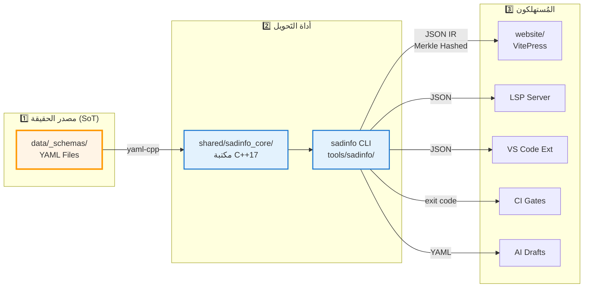
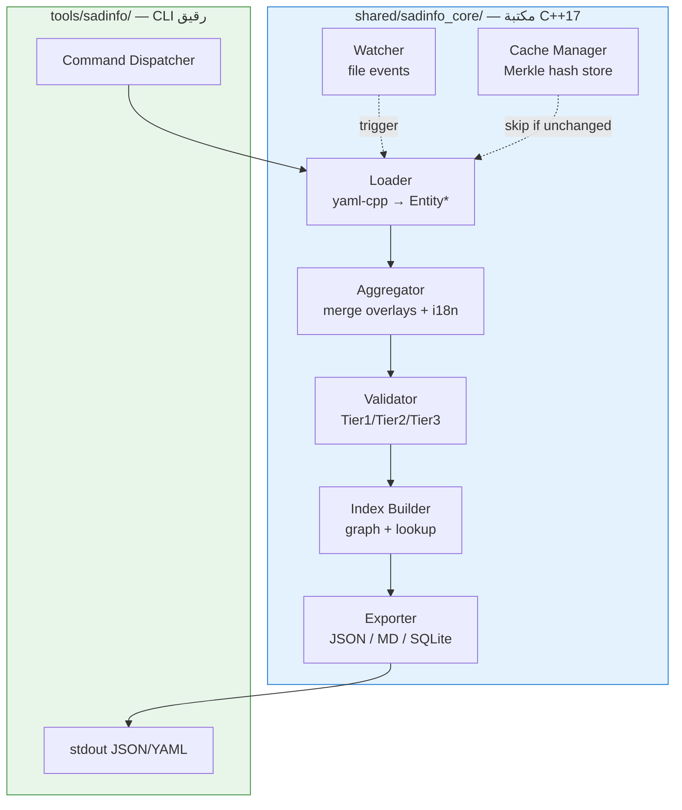
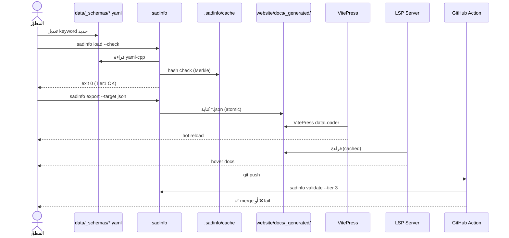
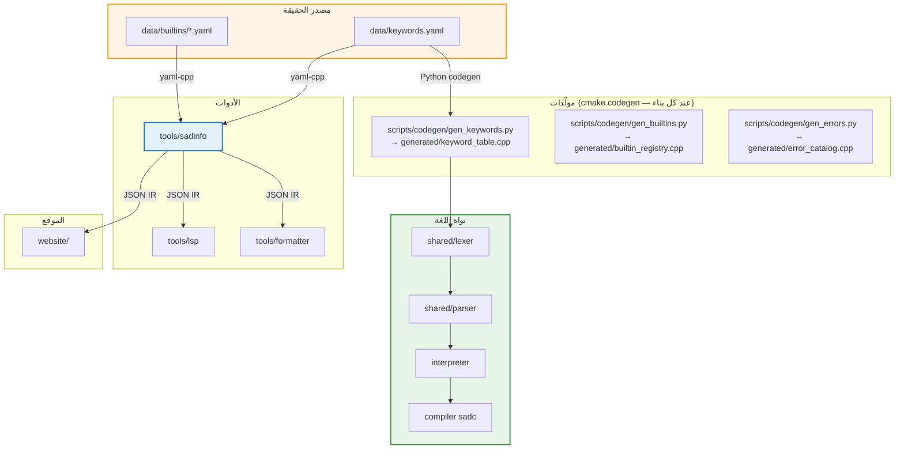

# 🏗️ وثيقة المعمارية الموحَّدة — نظام التوثيق الحي

> **هذه هي الوثيقة المعمارية الوحيدة المُعتمَدة**. أي تَصميم معماري سابق في `_archive/` هو **محتوى تاريخي للرجوع فقط** وغير مُعتمَد لقرارات جديدة.

---

## 1. المنظور المعماري الكلي

النظام مَبني على **3 طبقات تَتدفَّق البيانات بينها بِاتجاه واحد**:



---

## 2. مصدر الحقيقة (Source of Truth)

### 2.1 البنية الجذرية لـ `data/`

```
data/
├── _schemas/              ← JSON Schemas + سياسات (Tier1 validators)
│   ├── builtin.schema.json
│   ├── keyword.schema.json
│   ├── error.schema.json
│   └── lesson.schema.json
├── _meta/
│   └── CODEOWNERS         ← ملكية الكيانات (YAML)
├── builtins/              ← 21 دالة مدمجة
│   └── builtin_<name>/
│       ├── _index.yaml    ← إلزامي
│       ├── docs.yaml      ← مستحسن
│       ├── examples/*.yaml
│       └── i18n/{en,fr,...}.yaml
├── keywords/              ← 40 محجوزة + 25 سياقية
├── errors/                ← رسائل الأخطاء
└── lessons/               ← دروس تَعليمية
```

### 2.2 قواعد التَسمية (إلزامية)

```
<folder_name> == <kind>_<id.last_segment>
```

| ✅ صحيح | ❌ خطأ |
|---|---|
| `data/builtins/builtin_print_line/` | `data/builtins/print_line/` |
| `data/keywords/keyword_if/` | `data/keywords/if/` |
| `data/errors/error_unexpected_token/` | `data/errors/E0001/` |

### 2.3 Whitelist صارم داخل كل كيان

| الملف/المجلد | إلزامي؟ | الغرض |
|---|---|---|
| `_index.yaml` | ✅ دائماً | بيانات أساسية + ميتاداتا |
| `docs.yaml` | مستحسن | وصف تفصيلي + see_also |
| `examples/*.yaml` | اختياري | مثال لكل ملف |
| `exercises/*.yaml` | اختياري | تمرين لكل ملف |
| `i18n/{lang}.yaml` | اختياري | overlay ترجمات |

أي ملف خارج هذه القائمة → فشل validation.

### 2.4 بنية `_index.yaml` (نموذج Keyword)

```yaml
schema_version: 1
id: keyword.if
kind: keyword
name: إذا
category: control_flow
reserved: true                  # true = محجوزة | false = سياقية
since: 0.1.0
contextual_scope: null          # للسياقية: "after_function" مثلاً
owners: [@core-team]            # يُحقَّق ضد _meta/CODEOWNERS
```

### 2.5 بنية `_index.yaml` (نموذج Builtin)

```yaml
schema_version: 1
id: builtin.print_line
kind: builtin
name: اطبع_سطر
category: io
since: 0.1.0
signature:
  params:
    - name: قيمة
      type: any
      required: true
  returns: void
  is_variadic: false
tooling:
  lsp:
    completion: true
    snippet: "اطبع_سطر(${1:قيمة})"
  formatter:
    breaks_line: true
version_info:
  added: 0.1.0
  deprecated: null
  replaced_by: null
owners: [@core-team]
```

---

## 3. أداة `sadinfo` — التَصميم الداخلي

### 3.1 تَقسيم المكتبة/الأداة



### 3.2 الأوامر العامة (CLI Contract)

| الأمر | الغرض | المُخرَج |
|---|---|---|
| `sadinfo load --check` | تَحميل + Tier1 validation | exit 0/1 |
| `sadinfo validate --tier <1\|2\|3>` | تَحقق متعدد المستويات | تقرير stdout |
| `sadinfo aggregate --hash merkle` | بناء `index.merkle` | ملف hash |
| `sadinfo lock <acquire\|release>` | قفل الحالة (للـCI) | exit 0/1 |
| `sadinfo export --target json --out <dir>` | تَصدير JSON IR | ملفات JSON |
| `sadinfo watch` | مراقبة `data/_schemas/` | events log |
| `sadinfo dump --kind <keyword\|builtin\|error\|directive>` | dump سريع | JSON/YAML |
| `sadinfo --version` / `--help` | معياري | stdout |

### 3.3 طبقات التَحقق (Validation Tiers)

| المستوى | يَفحص | الأداة |
|---|---|---|
| **Tier 1** | JSON Schema syntax + حقول مطلوبة | ajv / yaml-cpp + manual |
| **Tier 2** | Cross-reference (owners ∈ CODEOWNERS، see_also موجود) | sadinfo داخلي |
| **Tier 3** | Snapshots (مقارنة merkle hash بين تَشغيلين) | sadinfo + git |

---

## 4. تَدفُّق البيانات الفعلي



> **لا حاجة لـdrift check** — `KeywordTable::initialize()` و `BuiltinRegistry` مُولَّدان من نفس YAML عبر cmake codegen، فالتَناقُض مستحيل بنيوياً (TD-08).

---

## 5. تَكامل مع باقي اللغة (Layered Architecture)



**قاعدة صارمة:** كل اعتماد يَتدفَّق من أعلى لأسفل (CW-02). لا يَجوز للـlexer أن يَستهلك من `sadinfo` (دائرة).

---

## 6. التَوزيع (Distribution Architecture)

| القناة | المحتوى | الوجهة | آلية التَحديث |
|---|---|---|---|
| **سيرفر خاص (Nginx)** | الموقع كامل (VitePress static) | `185.47.174.39` → `/opt/sad-lang-website/` → `https://sad-lang.org` | على كل merge to main عبر `deployment/deploy.{ps1,sh}` (rsync/scp) |
| **npm `@sad-lang/docs-data`** | JSON IR فقط | npm registry | release tag |
| **pip `sad-doctest`** | validators Python | PyPI | release tag |
| **VS Code Marketplace** | الامتداد + snippets | VS Code Marketplace | manual release |

> **تَفاصيل البنية التَحتية:** SSL عبر Let's Encrypt (certbot)، gzip مُفعَّل، HTTP/2، إعادة توجيه HTTP→HTTPS و www→apex، ترويسات أمان (X-Frame-Options, CSP, Referrer-Policy)، WASM MIME صحيح. التَكوين الكامل في [`deployment/nginx/sad-lang.org.conf`](../../../../deployment/nginx/sad-lang.org.conf).

---

## 7. Quality Gates (G1–G7)

| Gate | الفحص | الأداة | يَفشل عند |
|---|---|---|---|
| **G1** | Coverage: كل keyword له YAML entry | `check_keywords.py` | keyword بدون entry |
| **G2** | صحة codegen: `cmake --build` يُوَلّد جميع generated/*.cpp بدون أخطاء | cmake | فشل توليد من YAML |
| **G3** | Examples تَنفيذ مُطابق | dual_execution tests | output يَختلف |
| **G4** | كل entry له AR + EN | `bilingual_check.py` | حقل ناقص |
| **G5** | website build < 60s | benchmark | تَجاوُز عتبة |
| **G6** | axe-playwright accessibility | axe | critical violation |
| **G7** | Test flake rate < 1% | CI history | > 1% فشل عشوائي |

---

## 8. القرارات المعمارية (ADRs)

كل القرارات المعمارية تَعيش في `_archive/2-architecture/decisions/`. هذه الوثيقة تَستهلكها بِالمرجع:

| ADR | الموضوع | الحالة | الموقع |
|---|---|---|---|
| ADR-RESTRUCTURE-2026-06-01 | إعادة هيكلة الطبقات الثلاث | Active | [`_archive/2-architecture/decisions/ADR-RESTRUCTURE-2026-06-01.md`](_archive/2-architecture/decisions/ADR-RESTRUCTURE-2026-06-01.md) |
| ADR-SADINFO-ARCHITECTURE | بنية sadinfo (مكتبة + CLI) | Active | [`_archive/2-architecture/decisions/ADR-SADINFO-ARCHITECTURE.md`](_archive/2-architecture/decisions/ADR-SADINFO-ARCHITECTURE.md) |
| ADR-006 | تَوحيد نظام التَوليد | Active | [`_archive/2-architecture/decisions/ADR-006_توحيد_نظام_التوليد.md`](_archive/2-architecture/decisions/ADR-006_توحيد_نظام_التوليد.md) |
| ADR-006a | تَوحيد codegen | Active | [`_archive/2-architecture/decisions/ADR-006a_توحيد_codegen.md`](_archive/2-architecture/decisions/ADR-006a_توحيد_codegen.md) |
| ADR-006b | spec للتَوليد | Active | [`_archive/2-architecture/decisions/ADR-006b-spec.md`](_archive/2-architecture/decisions/ADR-006b-spec.md) |
| ADR-006b-2 | تَوليد التوثيق مُؤجَّل | Active | [`_archive/2-architecture/decisions/ADR-006b_توليد_التوثيق_مؤجَّل.md`](_archive/2-architecture/decisions/ADR-006b_توليد_التوثيق_مؤجَّل.md) |
| ADR-007 | منصة التوثيق (Docusaurus → VitePress) | Superseded | [`_archive/2-architecture/decisions/ADR-007_منصة_التوثيق_Docusaurus.md`](_archive/2-architecture/decisions/ADR-007_منصة_التوثيق_Docusaurus.md) |
| ADR-008 | علاقة الموقع بالمشروع | Active | [`_archive/2-architecture/decisions/ADR-008_علاقة_الموقع_بالمشروع.md`](_archive/2-architecture/decisions/ADR-008_علاقة_الموقع_بالمشروع.md) |

> **قاعدة GR-02:** لا تَحذف ADR. أي قرار يُلغى يُعلَّم `status: Superseded` ويُربط بـ`supersededBy`.
> **قاعدة جديدة (DOCS-CANONICAL):** أي ADR جديد يُضاف إلى نفس المجلد الأرشيفي + يُضاف صف هنا — لا يُنشأ مجلد جديد.

---

## 9. الحدود مع الأنظمة الأخرى

| النظام الخارجي | العلاقة | نوع التَكامل |
|---|---|---|
| **`shared/lexer`** | يَقرأ `data/keywords.yaml` عبر codegen | one-way (SoT → lexer) |
| **`error-messages` system** | نظام مستقل، sadinfo يَستهلك schemas منه | loose coupling |
| **`type-system`** | sadinfo يَستخرج معلومات الأنواع | read-only |
| **`website/`** | يَقرأ JSON من `_generated/` | read-only |
| **`tools/lsp/`** | يَستهلك JSON IR | read-only |

---

## 10. القيود غير الوظيفية (NFRs)

| # | الفئة | المتطلب |
|---|---|---|
| NFR-01 | الأداء | `sadinfo --dump-all` < 2 ثانية |
| NFR-02 | الأداء | `website build` < 60 ثانية |
| NFR-03 | الموثوقية | `sadinfo` idempotent (تَشغيل مرتين = نفس النتيجة) |
| NFR-04 | الموثوقية | mutation tests: حذف keyword → CI يَفشل |
| NFR-05 | الأمان | لا أسرار في JSON المُولَّد (trufflesecurity) |
| NFR-06 | الأمان | npm audit + pip-audit = 0 high/critical |
| NFR-07 | إمكانية الوصول | WCAG 2.1 AA |
| NFR-08 | i18n | كل entry له AR + EN (G4) |
| NFR-09 | الصيانة | `sadinfo` binary < 5MB |
| NFR-10 | الصيانة | لا تَكرار بين sadinfo وdocs_emitter |
| NFR-11 | التَوافقية | يَعمل Windows + Linux + macOS (CI matrix) |
| NFR-12 | التَتبُّع | كل JSON entry يَحوي source location (file:line) |

---

## 📎 المراجع

- **الاستراتيجية:** [STRATEGY.md](STRATEGY.md)
- **خطة التَنفيذ + 24 ستوري:** [IMPLEMENTATION_PLAN.md](IMPLEMENTATION_PLAN.md)
- **ADRs (تَفصيلية):** [_archive/2-architecture/decisions/](_archive/2-architecture/decisions/)
- **المحتوى المعماري التاريخي:** [_archive/2-architecture/](_archive/2-architecture/) — للرجوع فقط
