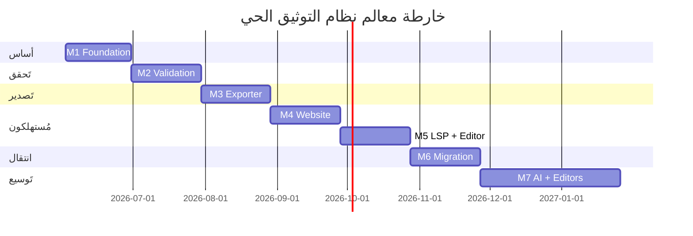

# 🚀 خطة التَنفيذ المفصَّلة — نظام التوثيق الحي

> **هذه هي خطة التَنفيذ الوحيدة المُعتمَدة**. الستوريات الفردية تَعيش في [`stories/`](stories/). أي خطة سابقة في `_archive/` هي **للرجوع التاريخي فقط**.

---

## 1. الحالة الحالية (Snapshot — 2026-06-02)

| المكوّن | الحالة | الأدلة |
|---|---|---|
| الاستراتيجية ([STRATEGY.md](STRATEGY.md)) | ✅ مُعتمَدة | 11 قسماً |
| المعمارية ([ARCHITECTURE.md](ARCHITECTURE.md)) | ✅ مُعتمَدة | 10 أقسام + 5 ADRs نَشطة |
| الستوريات | ✅ 36 سَتوري مُعرَّفة | [stories/](stories/) |
| الستوريات المُنفَّذة | 🔴 **0 / 36** | لا كود فعلي بعد |
| YAML SoT | 🔴 غير موجود | `data/_schemas/` فارغ |
| CLI `sadinfo` | 🟡 جزئي | binary موجود، لكن hardcoded data |
| تَكامل الموقع | 🔴 غير موجود | Markdown يَدوي حالياً |
| تَكامل LSP | 🟡 جزئي | runtime memory فقط |

> **الخلاصة:** التَخطيط مكتمل، التَنفيذ صفر. أولوية Sprint القادم: **S-000a + S-001 + S-015b**.

---

## 2. تَقسيم العمل (Work Breakdown)

العمل مُقسَّم إلى **7 معالم (Milestones)** عبر **8 أشهر**، وكل معلم يَحوي **3–6 ستوريات** قابلة لـSprint.

---

## 3. المعالم التَفصيلية

### M1 — أساس البيانات (Foundation) | 2026-06-02 → 2026-06-30

**الهدف:** YAML SoT فعلي لـ40 كلمة محجوزة + 21 دالة مدمجة.

| الستوري | المسار | التَقدير | الأولوية |
|---|---|---|---|
| S-000a — Foundation Schemas | [stories/implementation/S-000a-foundation-schemas.md](stories/implementation/S-000a-foundation-schemas.md) | 5 أيام | 🔴 P0 |
| S-001 — Loader PoC | [stories/implementation/S-001-loader-poc.md](stories/implementation/S-001-loader-poc.md) | 3 أيام | 🔴 P0 |
| S-002 — Entity View | [stories/implementation/S-002-entity-view.md](stories/implementation/S-002-entity-view.md) | 4 أيام | 🟠 P1 |
| S-015b — Migrate Keywords | [stories/implementation/S-015b-migrate-keywords.md](stories/implementation/S-015b-migrate-keywords.md) | 3 أيام | 🔴 P0 |
| S-015a — Migrate Builtins | [stories/implementation/S-015a-migrate-builtins.md](stories/implementation/S-015a-migrate-builtins.md) | 3 أيام | 🟠 P1 |

**DoD (M1):**
- [ ] `data/_schemas/keywords.yaml` يَحتوي 40 محجوزة + 25 سياقية
- [ ] `data/_schemas/builtins.yaml` يَحتوي 21 دالة مدمجة
- [ ] `sadinfo load --check` يَنجح بدون أخطاء
- [ ] VERIFICATION_REPORT M1 يُؤكد ≥ 95% تَطابق مع `shared/lexer/src/lexer_keywords.cpp`

---

### M2 — التَحقق والتَجميع (Validation & Aggregation) | 2026-07-01 → 2026-07-31

| الستوري | المسار | التَقدير |
|---|---|---|
| S-003 — Tier1 Validator | [stories/implementation/S-003-tier1-validator.md](stories/implementation/S-003-tier1-validator.md) | 4 أيام |
| S-004 — Hash Strategy | [stories/implementation/S-004-hash-strategy.md](stories/implementation/S-004-hash-strategy.md) | 3 أيام |
| S-005 — Aggregator + Merkle | [stories/implementation/S-005-aggregator-merkle.md](stories/implementation/S-005-aggregator-merkle.md) | 5 أيام |
| S-007 — State & Lock | [stories/implementation/S-007-state-and-lock.md](stories/implementation/S-007-state-and-lock.md) | 3 أيام |
| S-012 — Tier2 Validator | [stories/implementation/S-012-tier2-validator.md](stories/implementation/S-012-tier2-validator.md) | 4 أيام |

**DoD (M2):**
- [ ] `sadinfo validate --tier 1` يَنجح
- [ ] `sadinfo aggregate --hash merkle` يُنتج `data/_schemas/index.merkle`
- [ ] `sadinfo lock acquire/release` تَعمل
- [ ] Tier2 يَكشف ≥ 3 تَناقضات حقيقية

---

### M3 — المصدِّر والمراقب (Exporter & Watcher) | 2026-08-01 → 2026-08-31

| الستوري | المسار | التَقدير |
|---|---|---|
| S-006 — Aliases | [stories/implementation/S-006-aliases.md](stories/implementation/S-006-aliases.md) | 2 أيام |
| S-008 — SQLite Graph | [stories/implementation/S-008-sqlite-graph.md](stories/implementation/S-008-sqlite-graph.md) | 4 أيام |
| S-009 — Reader API | [stories/implementation/S-009-reader-api.md](stories/implementation/S-009-reader-api.md) | 4 أيام |
| S-009b — Security Hardening | [stories/implementation/S-009b-security-hardening.md](stories/implementation/S-009b-security-hardening.md) | 3 أيام |
| S-010 — Exporter | [stories/implementation/S-010-exporter.md](stories/implementation/S-010-exporter.md) | 5 أيام |
| S-011 — Watcher | [stories/implementation/S-011-watcher.md](stories/implementation/S-011-watcher.md) | 4 أيام |
| S-011b — Watcher (macOS) | [stories/implementation/S-011b-watcher-macos.md](stories/implementation/S-011b-watcher-macos.md) | 2 أيام |

**DoD (M3):**
- [ ] `sadinfo export --target json --out site/data/` يُنتج JSON صالحاً
- [ ] `sadinfo watch` يَكشف تَغييرات خلال < 200ms
- [ ] Reader API مُستقر مع 0 CVE في Tier1

---

### M4 — التَكامل مع الموقع | 2026-09-01 → 2026-09-30

| الستوري المعماري | المسار |
|---|---|
| story-2.0 — Website Move | [stories/architecture/story-2.0-website-move.md](stories/architecture/story-2.0-website-move.md) |
| story-1.4 — Diataxis | [stories/architecture/story-1.4-diataxis.md](stories/architecture/story-1.4-diataxis.md) |
| story-utm-6.3 | [stories/architecture/story-utm-6.3.md](stories/architecture/story-utm-6.3.md) |
| story-utm-6.4 | [stories/architecture/story-utm-6.4.md](stories/architecture/story-utm-6.4.md) |

**DoD (M4):**
- [ ] صفحة `https://sad-lang.dev/reference/keywords` تَعرض الكلمات من JSON IR
- [ ] `pnpm build` يَفشل إذا كان `data/_schemas/keywords.yaml` غير صالح

---

### M5 — تَكامل LSP + VS Code Extension | 2026-10-01 → 2026-10-31

| الستوري | المسار |
|---|---|
| story-3.1 — Render LSP | [stories/architecture/story-3.1-render-lsp.md](stories/architecture/story-3.1-render-lsp.md) |
| story-4.3 — Priority Functions | [stories/architecture/story-4.3-priority-functions.md](stories/architecture/story-4.3-priority-functions.md) |
| story-utm-6.5 | [stories/architecture/story-utm-6.5.md](stories/architecture/story-utm-6.5.md) |
| story-utm-6.6 | [stories/architecture/story-utm-6.6.md](stories/architecture/story-utm-6.6.md) |
| story-utm-6.7 | [stories/architecture/story-utm-6.7.md](stories/architecture/story-utm-6.7.md) |

**DoD (M5):**
- [ ] LSP autocompletion يَعرض docs العربية من JSON IR
- [ ] دالة مدمجة جديدة في YAML تَظهر في LSP بدون إعادة بناء

---

### M6 — الانتقال والإزالة (Migration & Cleanup) | 2026-11-01 → 2026-11-30

| الستوري | المسار | التَقدير |
|---|---|---|
| S-013 — Tier3 Snapshots | [stories/implementation/S-013-tier3-snapshots.md](stories/implementation/S-013-tier3-snapshots.md) | 4 أيام |
| S-014 — Stats Logging | [stories/implementation/S-014-stats-logging.md](stories/implementation/S-014-stats-logging.md) | 3 أيام |
| S-014b — CI Pipeline | [stories/implementation/S-014b-ci-pipeline.md](stories/implementation/S-014b-ci-pipeline.md) | 5 أيام |
| S-015c — Migrate Errors | [stories/implementation/S-015c-migrate-errors.md](stories/implementation/S-015c-migrate-errors.md) | 4 أيام |
| S-015d — Migrate Lessons | [stories/implementation/S-015d-migrate-lessons.md](stories/implementation/S-015d-migrate-lessons.md) | 4 أيام |
| S-015e — MD Generator | [stories/implementation/S-015e-md-generator.md](stories/implementation/S-015e-md-generator.md) | 5 أيام |
| S-016 — Legacy Removal | [stories/implementation/S-016-legacy-removal.md](stories/implementation/S-016-legacy-removal.md) | 5 أيام |
| story-5.1 — Enforce Coverage | [stories/architecture/story-5.1-enforce-coverage.md](stories/architecture/story-5.1-enforce-coverage.md) | — |

**DoD (M6):**
- [ ] 0 ملفات Markdown يَدوية لتوثيق الكلمات/الدوال/الأخطاء
- [ ] CI ينجح كلياً مع SoT الموحَّد
- [ ] الكود القديم المُهجور مَحذوف (بعد مَوافقة OWNER)

---

### M7 — التَوسع (AI + Editors) | 2026-12-01 → 2027-01-31

| المهمة | الستوري المعماري |
|---|---|
| AI training data export | [stories/architecture/story-5.2-ai-lessons-pipeline.md](stories/architecture/story-5.2-ai-lessons-pipeline.md) |
| JetBrains plugin (مَنفذ ثانٍ) | — (سَتوري جديدة لاحقاً) |
| Public REST API على `api.sad-lang.dev` | [stories/architecture/story-5.3-deployment-pipeline.md](stories/architecture/story-5.3-deployment-pipeline.md) |

**DoD (M7):**
- [ ] AI agent يُجيب أسئلة لغة ص بـ < 500ms عبر API
- [ ] JetBrains plugin v0.1 يَدعم autocompletion

---

## 4. جدول مُلخَّص للمعالم

| المعلم | البداية | النهاية | الستوريات | التَقدير الإجمالي | الحالة |
|---|---|---|---|---|---|
| M1 | 2026-06-02 | 2026-06-30 | 5 | 18 يوم | ⏳ مُخطَّط |
| M2 | 2026-07-01 | 2026-07-31 | 5 | 19 يوم | ⏳ مُخطَّط |
| M3 | 2026-08-01 | 2026-08-31 | 7 | 24 يوم | ⏳ مُخطَّط |
| M4 | 2026-09-01 | 2026-09-30 | 4 | TBD | ⏳ مُخطَّط |
| M5 | 2026-10-01 | 2026-10-31 | 5 | TBD | ⏳ مُخطَّط |
| M6 | 2026-11-01 | 2026-11-30 | 8 | 30 يوم | ⏳ مُخطَّط |
| M7 | 2026-12-01 | 2027-01-31 | 3+ | TBD | ⏳ مُخطَّط |
| **المجموع** | **2026-06-02** | **2027-01-31** | **≥ 37** | **~120 يوم** | **0% منفَّذ** |

---

## 5. الاعتمادات الحَرجة (Critical Dependencies)

**ملاحظات:**
- **M1 = bottleneck.** كل ما بعده يَنتظره. أي تَأخير فيه = تَأخير الكل.
- **M4 و M5 يُمكن أن يَتوازيا** بعد اكتمال M3.
- **M6 يَتطلب M4 + M5 معاً** (لا يَجوز حذف legacy قبل وجود البديل).

---

## 6. المخاطر التَنفيذية

| المخاطرة | احتمال | أثر | تَخفيف |
|---|---|---|---|
| تَأخر S-000a يَكسر M1 كاملاً | عالٍ | حرج | ابدأ S-000a حصراً في Sprint القادم |
| تَزامن مَع تَطوير LLVM/مترجم | متوسط | متوسط | استخدام `agent_lock.py` |
| التَوافق العكسي مَع runtime keyword list | متوسط | عالٍ | اختبار CI يُقارن JSON IR ضد `lexer_keywords.cpp` |
| نقص المسؤولين البشريين | عالٍ | متوسط | اعتماد على Copilot agents مَع PR review |

---

## 7. عقود البيانات (Data Contracts)

> **مرجع تَفصيلي:** [_archive/3-implementation/planning/DATA_SCHEMA_CONTRACTS.md](_archive/3-implementation/planning/DATA_SCHEMA_CONTRACTS.md)

**ملخص العقد:**
- اسم المجلد = `<kind>_<id.last_segment>` (إلزامي)
- Whitelist صارم: `_index.yaml` + `docs.yaml` + `examples/` + `exercises/` + `i18n/` فقط
- كل entry له `schema_version: 1` + `id` ASCII + `name` عربي + `owners` (يُحقَّق ضد CODEOWNERS)
- التَفاصيل الكاملة + أمثلة لكل kind في [ARCHITECTURE.md §2.4–2.5](ARCHITECTURE.md)

---

## 8. استراتيجية الاختبار (Test Strategy)

> **مرجع تَفصيلي:** [_archive/3-implementation/planning/test-strategy.md](_archive/3-implementation/planning/test-strategy.md)

**الطبقات:**

| الطبقة | الأداة | يَفحص |
|---|---|---|
| Unit | gtest | كل دالة C++ في `shared/sadinfo_core/` |
| Integration | gtest + tmp YAML | Loader → Aggregator → Validator |
| Snapshot | golden files | JSON IR لا يَتغيَّر بين تَشغيلين |
| Codegen | cmake build | YAML → `generated/*.cpp` يَنجح ويُترجم (لا حاجة لـdrift check — التَوليد بنيوي) |
| Dual-execution | كود ص فعلي | كل example يَنفذ ويُقارن |
| Accessibility | axe-playwright | website pages |

**معايير القبول:**
- coverage > 80% للمكتبة
- 0 flake في 100 تَشغيل
- snapshot diff = 0 على نفس YAML

---

## 9. كيف تَبدأ (Quick Start للمطوِّر)

1. **اقرأ الترتيب:** [STRATEGY.md](STRATEGY.md) → [ARCHITECTURE.md](ARCHITECTURE.md) → هذه الوثيقة
2. **افتح [stories/implementation/S-000a-foundation-schemas.md](stories/implementation/S-000a-foundation-schemas.md)** — أول ستوري P0
3. **اتبع DoD المُحدَّد في الستوري** — لا تَعدِّل خارج نطاقها
4. **عند الإكمال:** حدِّث الحالة في هذه الوثيقة (جدول §4) + أنشئ VERIFICATION_REPORT
5. **القفل قبل العمل:** استخدم `agent_lock.py` لتَجنب التَعارض مع agents أخرى

---

## 10. التَحديث القادم

- **2026-06-30:** تَقرير M1 + تَحديث جدول §4
- **عند كل اكتمال ستوري:** PR يُعدِّل حالتها في الجدول
- **عند تَغيير الاستراتيجية:** تَعديل [STRATEGY.md](STRATEGY.md) أولاً ثم هذه الوثيقة

---

## 📎 المراجع

- **الاستراتيجية:** [STRATEGY.md](STRATEGY.md)
- **المعمارية:** [ARCHITECTURE.md](ARCHITECTURE.md)
- **الستوريات النَشطة:** [stories/](stories/)
- **عقود البيانات (تَفصيل):** [_archive/3-implementation/planning/DATA_SCHEMA_CONTRACTS.md](_archive/3-implementation/planning/DATA_SCHEMA_CONTRACTS.md)
- **استراتيجية الاختبار (تَفصيل):** [_archive/3-implementation/planning/test-strategy.md](_archive/3-implementation/planning/test-strategy.md)
