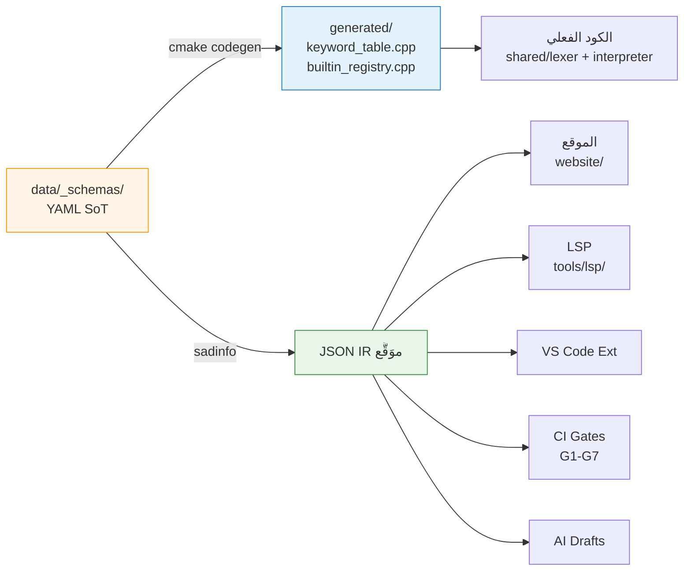

# 📋 وثيقة الاستراتيجية الموحَّدة — نظام التوثيق الحي

> **هذه هي الوثيقة الاستراتيجية الوحيدة المُعتمَدة** لنظام التوثيق الحي للغة ص. أي تَخطيط استراتيجي سابق في `_archive/` هو **محتوى تاريخي للرجوع فقط** ولا يَحكم القرارات الجديدة.

---

## 1. الرؤية (Vision)

> **بحلول Q2 2027:** كل نص في لغة ص — **كلمات محجوزة + دوال مدمجة + رسائل أخطاء (lexer/parser/runtime) + رسائل debug + رسائل CLI + رسائل LSP + التوجيهات + العوامل** — يَعيش في **مصدر حقيقة واحد (YAML SoT)**، يُولَّد منه الكود C++ ورسائل التشغيل عند كل بناء، وتَستهلكه 5 جهات (الموقع، LSP، VS Code Extension، الذكاء الاصطناعي، CI) عبر بروتوكول `sadinfo` الذي يُولِّد JSON IR موَقَّع.

---

## 2. المشكلة المُستهدَفة

البيانات الجوهرية للغة (الكلمات، الدوال المدمجة، رسائل الأخطاء، التوجيهات) تُعرَّف حالياً **داخل الكود مباشرة** (`KeywordTable::initialize()`, `BuiltinRegistry`, سلاسل في `shared/errors/`)، وتُوثَّق يدوياً في Markdown منفصل:

- ❌ **لا مصدر حقيقة واحد** — تعريف الكلمة موجود في `.cpp`، توثيقها في `.md`، snippets في JSON آخر.
- ❌ **Drift مَستمر** — إضافة كلمة في الكود لا تُحدِّث الموقع/LSP/الامتداد تلقائياً.
- ❌ **الموقع `website/`** يَكتب Markdown يدوي يُخالف الكود الفعلي.
- ❌ **LSP** يَستهلك runtime memory فقط — لا hover docs ثُنائية اللغة مُنظَّمة.
- ❌ **المحررات (VS Code)** لا تَملك snippets/syntax مُولَّدة.
- ❌ **الذكاء الاصطناعي** يُدرَّب على وثائق قديمة.
- ❌ **CI** لا تَستطيع كَشف الفجوة بين الكود والتوثيق.

**النتيجة:** توثيق غير مَوثوق، تَجربة مطوِّر سيئة، تَكرار جهد مَستمر.

---

## 3. الحل الاستراتيجي

**عَكس اتجاه التَدفُّق:** YAML يُصبح **المصدر الوحيد** الذي يُولِّد منه:

1. كود C++ (`generated/keyword_table.cpp`, `generated/builtin_registry.cpp`) عند كل بناء (`cmake --build`).
2. JSON IR للمستهلكين الخارجيين (موقع، LSP، امتداد، CI، AI) عبر `sadinfo`.

> **القاعدة الذهبية (TD-08):** الملفات المُولَّدة (`generated/*.cpp`, `_generated/*.json`) **لا تُحرَّر يدوياً أبداً** — كل تَعديل في YAML، وكل بناء يُعيد التَوليد.

**ثلاثة أعمدة:**

| العمود | الوصف | المُخرَج |
|---|---|---|
| **1. SoT** | بيانات اللغة في `data/_schemas/*.yaml` بصيغة canonical — تُحرَّر يدوياً | YAML schema v1 |
| **2. cmake codegen** | خطوة بناء تُولَّد `keyword_table.cpp` + `builtin_registry.cpp` من YAML عند كل `cmake --build` | `generated/*.cpp` (gitignored) |
| **3. أداة `sadinfo`** | CLI مستقل في `tools/sadinfo/` يُحمِّل YAML ويُخرِج JSON | `sadinfo.exe < 5MB` |
| **4. مستهلكون** | الموقع + LSP + المحررات + CI + AI | JSON IR في `_generated/` |

---

## 4. أصحاب المصلحة (Stakeholders)

| الدور | المسؤولية | المُخرَج المُتوقَّع |
|---|---|---|
| **مطوِّرو نواة اللغة** | تَعديل `keywords.yaml` عند إضافة كلمة | PR على `data/_schemas/` |
| **مساهمو التوثيق** | كتابة `docs.yaml` + أمثلة لكل entry | YAML overlay مُراجَع |
| **مطوِّرو الأدوات (LSP/Editor)** | استهلاك JSON IR | لا تَكرار لتعريف الكلمات |
| **المستخدِم النهائي للغة** | يَقرأ الموقع و يَستخدم LSP | hover docs ثنائي اللغة (AR/EN) |
| **CI maintainers** | تَفعيل Quality Gates G1-G7 | فشل PR عند drift |

---

## 5. الأهداف الاستراتيجية (Strategic Goals)

| # | الهدف | المقياس |
|---|---|---|
| **G1** | **تَوحيد مصدر الحقيقة** | 100% من الكلمات/الدوال/الأخطاء في YAML |
| **G2** | **استحالة Drift بنيوياً** | الكود `KeywordTable`/`BuiltinRegistry` مُولَّد من YAML — لا يوجد مكان للتَناقض |
| **G3** | **ثُنائية اللغة** | كل entry له `ar` + `en` |
| **G4** | **سرعة البناء** | `website build < 60s`, `sadinfo --dump-all < 2s` |
| **G5** | **إمكانية الوصول** | WCAG 2.1 AA + RTL/LTR صحيح |
| **G6** | **استقرار التوزيع** | npm `@sad-lang/docs-data` + نَشر تلقائي إلى `sad-lang.org` (سيرفر خاص Nginx) |
| **G7** | **جودة الاختبار** | flake rate < 1% |

---

## 6. القرارات الاستراتيجية الحاسمة

| # | القرار | البديل المرفوض | السبب |
|---|---|---|---|
| **TD-01** | `sadinfo.exe` binary مستقل | راية داخل `sad/sadc` | فصل المسؤوليات (CW-01) + binary صغير |
| **TD-02** | YAML schema موحَّدة يَستهلكها codegen + sadinfo + validators | parser منفصل لكل أداة | DRY (CW-19) + مصدر واحد للقراءة |
| **TD-03** | الكتابة في `website/docs/_generated/` | مشروع docs منفصل | الموقع موجود ومُهيَّأ |
| **TD-04** | YAML للمصدر + JSON للتَوزيع | JSON فقط | YAML أسهل للمراجعة اليدوية |
| **TD-05** | VitePress dataLoaders | API server runtime | static + سريع + سهل النَشر على Nginx |
| **TD-06** | نَشر على سيرفر خاص (`185.47.174.39` / `sad-lang.org`) عبر Nginx + Let's Encrypt | gh-pages / Vercel / Netlify | تَحكُّم كامل + بدون قيود GitHub + جاهز ومُكوَّن في `deployment/` |
| **TD-07** | Claude API لمسوَّدات AI | OpenAI / local | متَناسق مع agents الموجودة |
| **TD-08** | YAML → كود C++ عبر cmake codegen (`generated/` gitignored) | تعريف يدوي في `KeywordTable::initialize()` | YAML هو SoT الوحيد — لا درِيفت ممكن بنيوياً |

---

## 7. المخاطر الاستراتيجية

| # | المخاطرة | احتمال × تأثير | التَخفيف |
|---|---|---|---|
| **R1** | تعديل يدوي على `generated/*.cpp` يُفقد عند أول بناء | 4×3=12 🟠 | gitignore + header `DO NOT EDIT` + pre-commit hook + فحص CI |
| **R2** | YAML schema يتغيَّر دون تحديث codegen template → فشل البناء | 3×4=12 🟠 | schema validator (Tier1) يُشغَّل قبل codegen + أخطاء واضحة |
| **R3** | website build يُربك المساهمين الجدد | 3×3=9 🟡 | CONTRIBUTING.md + npm scripts |
| **R4** | Claude API rate-limit يَكسر AI pipeline | 3×3=9 🟡 | retry + cache + fallback يدوي |
| **R5** | i18n EN ناقص يُعطِّل النشر | 2×4=8 🟡 | AR fallback + CI لا يَفشل لـEN فقط |
| **R6** | sadinfo يَفشل على macOS | 2×4=8 🟡 | CI matrix من اليوم الأول |

---

## 8. النطاق (Scope)

### ✅ داخل النطاق — كل نصوص اللغة

| الفئة | المحتوى | المصدر الحالي | الوجهة بعد التَوحيد |
|---|---|---|---|
| **الكلمات** | 40 محجوزة + 25 سياقية + 9 أنواع مدمجة + 3 عوامل منطقية | `shared/lexer/src/lexer_keywords.cpp` | `data/_schemas/keywords.yaml` |
| **الدوال المدمجة** | 21 دالة + طرق المصفوفات/النصوص/الخرائط/القنوات | `interpreter/src/builtins/*.cpp` | `data/_schemas/builtins/*.yaml` |
| **التوجيهات** | `@حجم`, `@ذري`, `@غير_آمن`, `@وقت_الترجمة`, `@متطاير`, `@تجميع` | scattered in lexer + interpreter | `data/_schemas/directives.yaml` |
| **العوامل** | حسابية + مقارنة + منطقية + إسناد + عضوية + ثلاثي | `shared/parser/` | `data/_schemas/operators.yaml` |
| **رسائل أخطاء lexer** | "حرف غير معروف"، "نهاية نص ناقصة"، إلخ | `shared/lexer/src/*.cpp` (سلاسل) | `data/_schemas/errors/lexer.yaml` |
| **رسائل أخطاء parser** | "متوقع `نهاية`"، "كلمة محجوزة كاسم متغير"، إلخ | `shared/parser/src/*.cpp` (سلاسل) | `data/_schemas/errors/parser.yaml` |
| **رسائل أخطاء runtime** | "قسمة على صفر"، "فهرس خارج المدى"، إلخ | `interpreter/src/**` (سلاسل) | `data/_schemas/errors/runtime.yaml` |
| **رسائل أخطاء compiler (sadc)** | "نوع غير متَّسق"، "ownership violation"، إلخ | `compiler/src/**` (سلاسل) | `data/_schemas/errors/compiler.yaml` |
| **رسائل debug/log** | رسائل `--verbose`, `--trace`, logging | scattered | `data/_schemas/messages/debug.yaml` |
| **رسائل CLI** | help text لـ `sad`, `sadc`, `sadinfo`, `sadfmt`, `sadpkg` | في كل أداة | `data/_schemas/messages/cli.yaml` |
| **رسائل LSP** | hover, diagnostics, completion details | `tools/lsp/src/**` | تُولَّد من YAML الموَحَّد |
| **رسائل المُنسِّق (sadfmt)** | تَحذيرات تَنسيق | `tools/formatter/**` | `data/_schemas/messages/formatter.yaml` |

**النواتج التَقنية:**
- JSON IR + YAML schema موَّحدة + Merkle hash للتَحقق
- تَكامل مع website + LSP + CI + AI drafts pipeline
- ثنائية اللغة AR/EN في كل المُخرَجات (مع `error_code` ثابت للترجمة الآلية)
- cmake codegen يُولَّد C++ من YAML عند كل بناء

### ❌ خارج النطاق (هذه الحقبة)

- تَوليد docs من ملفات `.ص` للمستخدم (موجود في `docs_emitter.h` المستقل)
- ترجمة لغات أخرى غير AR/EN (يَأتي في Wave 4)
- mike للنُسخ المُتعدِّدة من الوثائق (Wave 4)
- نشر vsix لـVS Code (نظام منفصل: `tools/vscode-extension/`)

> **ملاحظة:** نظام `error-messages/` المستقل (`_bmad-output/systems/error-messages/`) سيُدمج كـ **schema تَحت هذا النظام** بدلاً من نظام مستقل، لأن كل رسائل الأخطاء تَخضع لنفس مبدأ YAML SoT. القرار النهائي في ADR مستقل.

---

## 9. خارطة الحقب (High-Level Timeline)

| الحقبة | الفترة | الهدف الاستراتيجي | يَنتج عنه |
|---|---|---|---|
| **M1 — أساس البيانات** | 2026-06 | YAML SoT للـ40 كلمة + 21 دالة | `data/_schemas/keywords.yaml` + `builtins.yaml` |
| **M2 — تَحقق وتَجميع** | 2026-07 | Tier1/2/3 + Merkle | `sadinfo validate` + `index.merkle` |
| **M3 — مصدِّر ومراقب** | 2026-08 | JSON export + file watcher | `sadinfo export` + `sadinfo watch` |
| **M4 — تَكامل المُستهلكين** | 2026-09 | website + LSP + CI | `sad-lang.org` live (سيرفر خاص) + LSP hover |
| **M5 — التَوزيع والإطلاق** | 2026-10 | npm + AI pipeline | `@sad-lang/docs-data@1.0.0` |

> **التَفاصيل التَنفيذية الكاملة:** انظر [IMPLEMENTATION_PLAN.md](IMPLEMENTATION_PLAN.md)
> **التَصميم المعماري الكامل:** انظر [ARCHITECTURE.md](ARCHITECTURE.md)

---

## 10. Definition of Done (Strategic Level)

- [ ] جميع 7 Quality Gates (G1–G7) خَضراء في CI
- [ ] `sadinfo.exe` يُبنى على Windows + Linux + macOS
- [ ] website يَعرض keywords/builtins/errors من JSON المُولَّد
- [ ] i18n AR/EN يَعمل في كل صفحة مُولَّدة
- [ ] axe-playwright = 0 critical violations
- [ ] deployment تلقائي إلى `sad-lang.org` (سيرفر خاص Nginx) عند merge to main
- [ ] npm package منشور بنسخة 1.0.0
- [ ] CONTRIBUTING.md يَشرح: AI draft → review → publish
- [ ] retro session تَكشف خطة Phase 2

---

## 11. الموافقات

| الدور | الاسم | الحالة |
|---|---|---|
| Owner | صلاح | ⏳ موافقة نهائية |
| PM | John | ✅ مُعتمَد (مُرحَّل من PRD v2) |
| Dev Lead | Amelia | ✅ مُعتمَد |
| Architect | Winston | ✅ مُعتمَد |
| UX | Sally | ⏳ مراجعة |
| Test Architect | Murat | ⏳ مراجعة |

---

## 📎 المراجع

- **التَصميم المعماري الكامل:** [ARCHITECTURE.md](ARCHITECTURE.md)
- **خطة التَنفيذ المفصَّلة + 24 ستوري:** [IMPLEMENTATION_PLAN.md](IMPLEMENTATION_PLAN.md)
- **القرارات المعمارية (ADRs) التاريخية:** [_archive/2-architecture/decisions/](_archive/2-architecture/decisions/)
- **المحتوى التاريخي للاستراتيجية:** [_archive/1-strategy/](_archive/1-strategy/) — للرجوع فقط، **غير مُعتمَد**
