# 📋 استراتيجية نظام التوثيق الحي — V2

> **هذه الوثيقة مُقترَحة لاستبدال [STRATEGY.md](STRATEGY.md) (V1)** بعد إجماع وكلاء الجولة 2 على 9 تَحَوّلات جوهرية. تَتضمن **مخططات معمارية رسومية** + **توصيات قابلة للتنفيذ** + **مَقاييس قابلة للقياس**.
>
> **ليست SoT حتى يَعتمدها المالك صراحةً.**

---

## 0. ملخَّص تنفيذي (TL;DR)

> **التَحَوّل الأكبر:** المشكلة ليست "drift" — هي **"context loss" للوكلاء + المالك "يَتوه"** في مشروع كبير 100% مَكتوب بـ AI agents. الحل ليس فقط SoT واحد — هو **خريطة قابلة للقراءة آلياً تَضمن اتساق المعرفة عبر جميع المُنتجِين/المُستهلِكين (AI)**.

| البُعد | V1 (الأصلية) | V2 (المُقترَحة) |
|---|---|---|
| **المُستهلِك الأساسي** | "5 جهات استهلاك (موقع، LSP، …)" | **المالك + وكلاء AI** (لا بَشر آخرون) |
| **المشكلة الأساسية** | Drift بين الكود والتوثيق | **Context loss للوكلاء** + المالك يَتوه |
| **حجم MVP** | "≤100 entry تدريجي" | **130–150 entry شامل في M1–M3** |
| **`sadinfo`** | Binary مستقل | **مكتبة `shared/sadinfo_core/` + CLI رقيق** |
| **آلية التَوليد** | `cmake codegen` فقط | **`runtime YAML loader`** (أقل cmake errors) |
| **Quality Gates** | "هدف نوعي" | **CI workflows آلية قبل M1** (G1–G7) |
| **النشر** | gh-pages + سيرفر | **سيرفر خاص فقط** (استقلالية معمارية) |
| **مَكان النظام** | نظام مستقل | **جزء من معمارية متعددة الأنظمة** + ontology |
| **اختبار ACs** | "نص حر" | **Given/When/Then صارم** لكل AC |
| **DoD المُؤجَّلة** | مَسموح | **مَمنوع** (وكيل AI بلا ذاكرة بعد sprint) |

---

## 1. السياق الجديد — لماذا V2؟

### 1.1 الحقائق التي كَشَفها المالك (لم تَكن مَعروفة في V1)

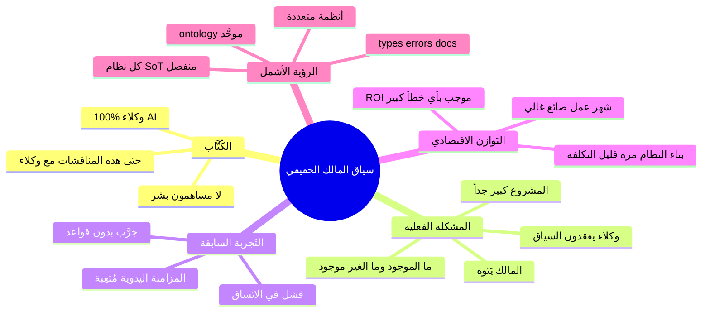

### 1.2 ما تَغيَّر في تَقييم الوكلاء بين الجولتين؟

| الوكيل | الجولة 1 (قَبل السياق) | الجولة 2 (بعد السياق) |
|---|---|---|
| 🏗️ Winston | "gh-pages كـ fallback" | **❌ مرفوض** — السيرفر الخاص قرار صحيح معمارياً |
| 📋 John | "MVP ≤100 entry" | **❌ منهار** — شمول 130–150 مرة واحدة أفضل |
| 💻 Amelia | "ACs ناقصة" | **⬆️ حَرِجة 1000 مرة** — وكلاء AI بدون Given/When/Then = chaos |
| 🔬 Quinn | "حافز مالي لكُتَّاب التوثيق" | **❌ انهيار كامل** — لا بشر يَكتبون |
| 🔬 Quinn | "X-Macros أبسط من YAML" | **❌ خاطئ** — YAML أنسب لوكلاء AI |
| 🔬 Quinn | "sadinfo binary غير ضروري" | **🟡 تَعديل** — حدود واضحة للوكلاء مفيدة |

---

## 2. الرؤية المُحدَّثة (V2)

> **بحلول Q2 2027:** نظام التوثيق الحي يَخدم **المالك + وكلاء AI** كَخريطة قابلة للقراءة آلياً تَجيب على السؤالين الجوهريين:
>
> 1. **"ما هو موجود؟"** — entity واحد يُمثل كل keyword/builtin/error/directive
> 2. **"ما هو غير موجود؟"** — Quality Gate يَكشف الفجوات تلقائياً
>
> النظام جزء من **معمارية متعددة الأنظمة** (`systems/living-doc/` + `systems/type-system/` + `systems/error-system/` + …) تَتشارك ontology موحَّد عبر `_INTEROP_ONTOLOGY.md`.

---

## 3. المعمارية الجديدة — المَنظور العام

### 3.1 السياق النظامي (System Context)

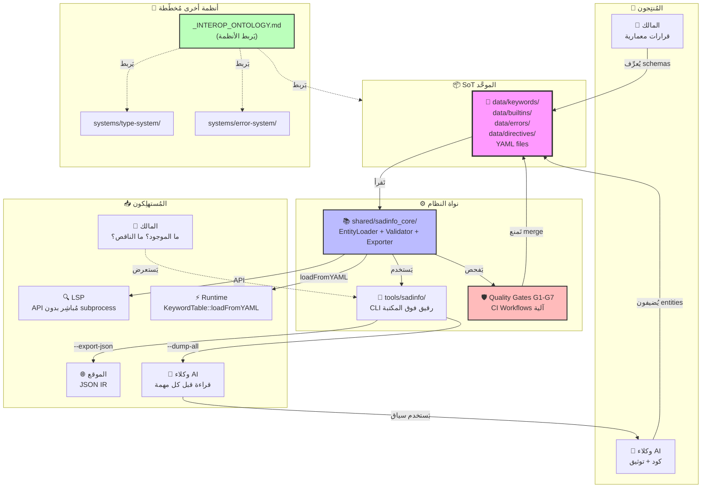

### 3.2 تَدفُّق البيانات (Data Flow)

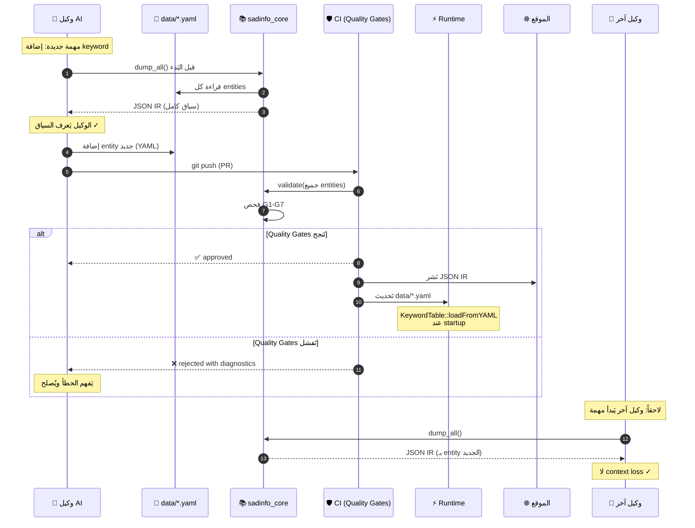

### 3.3 طبقات النظام (Layered Architecture)

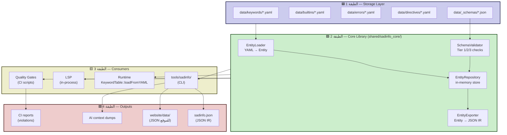

---

## 4. الأهداف الجديدة — G1 إلى G7 (مُعاد صياغتها)

### 4.1 إعادة الصياغة الجوهرية

| الهدف V1 | V1 (نوعي) | الهدف V2 | V2 (قابل للقياس) |
|---|---|---|---|
| G1: SoT | "توحيد المصدر" | **G1: Consistency** | كل entity له ID وحيد عبر النظام بالكامل |
| G2: استحالة drift | "بنيوياً" | **G2: Auditability** | كل تَعديل في `data/*.yaml` يَنتج git log واضح + diff JSON IR |
| G3: ثنائية لغة | "AR + EN" | **G3: AI-Readability** | كل entity يَحوي 6 حقول إلزامية: `id`, `ar`, `en`, `category`, `since`, `examples` |
| G4: سرعة بناء | "<2s" | **G4: Automation** | بدون أي manual sync — كل sync يَتم عبر CI |
| G5: إمكانية وصول | "WCAG 2.1 AA" | **G5: Completeness** | 130–150 entry محدَّد + Quality Gate يَكشف الفجوات |
| G6: توزيع مستقر | "99.9% uptime" | **G6: Trust** | Quality Gates G1–G7 تَمنع merge للتَناقضات |
| G7: flake rate | "<0.1%" | **G7: Stability** | CI green على كل commit في `data/*.yaml` |

### 4.2 آلية القياس (Quality Gates Implementation)

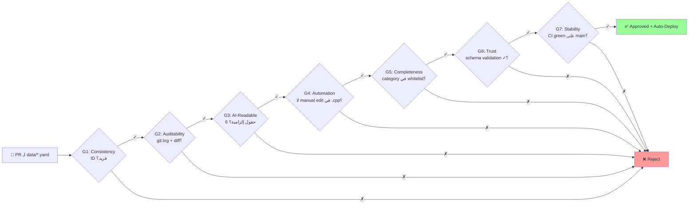

---

## 5. نطاق MVP الجديد (M1–M3)

### 5.1 ما الذي يَدخل في MVP؟

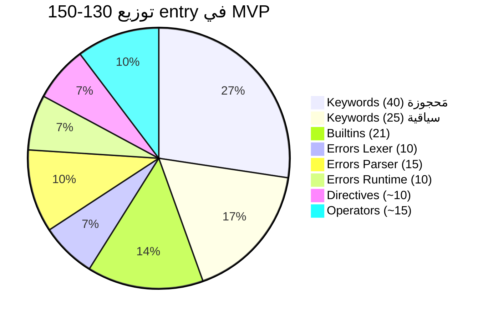

**الإجمالي: ~146 entry محدَّد** (ليس مفتوح النهاية)

### 5.2 خريطة المعالم الجديدة

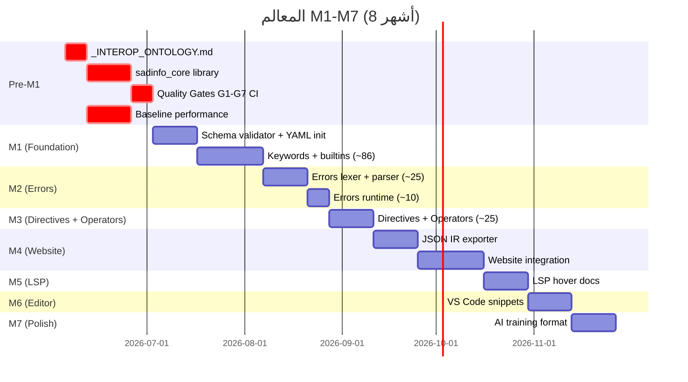

---

## 6. الاستوريات (Story Format V2)

### 6.1 قالب AC جديد — Given/When/Then صارم

```yaml
# قبل (V1) - غامض
acceptance_criteria:
  - "الملفات تُرفع بنجاح"
  - "الفحص يَعمل"

# بعد (V2) - قابل للأتمتة
acceptance_criteria:
  - id: AC-1
    given: "ملف data/keywords/IF_01.yaml جديد بـ ID فريد"
    when: "تَشغيل sadinfo --validate data/keywords/"
    then:
      - "stdout يَحتوي 'VALIDATED: 1/1 entries'"
      - "exit code == 0"
    automated: true
    test_command: "scripts/test_ac.sh STORY-001 AC-1"
```

### 6.2 ما هو مَمنوع في V2؟

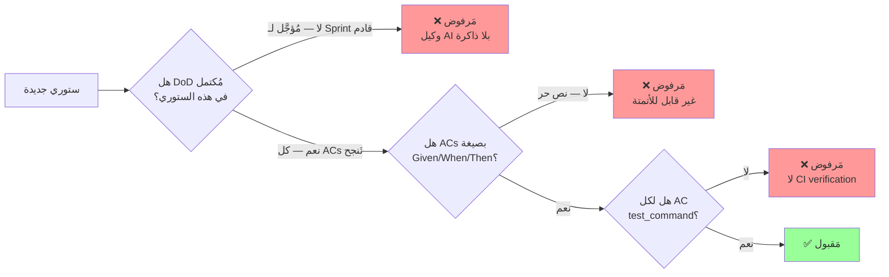

---

## 7. معمارية متعددة الأنظمة — Ontology الموحَّد

### 7.1 لماذا ontology؟

```mermaid
flowchart TB
    subgraph SYSTEMS["🌐 الأنظمة المُخطَّطة"]
        DOC[living-documentation/<br/>keywords + builtins + …]
        TYPE[type-system/<br/>أنواع + relationships]
        ERR[error-system/<br/>أكواد + رسائل]
        TEST[test-system/<br/>مُخطَّط]
    end

    subgraph PROBLEM["❌ بدون ontology"]
        P1[keyword 'إذا' في docs<br/>لا يَعرف عن error E001<br/>الذي يَذكره]
        P2[type 'رقم' في type-system<br/>لا يَعرف عن builtin 'رقم()'<br/>الذي يُحوِّل إليه]
        P3[تَغيير اسم keyword<br/>= drift في error messages]
    end

    subgraph SOLUTION["✅ مع _INTEROP_ONTOLOGY.md"]
        ONTO[Entity Schema موحَّد<br/>+ Cross-system References]
        S1["keyword.references[]: error_id[]"]
        S2["type.builtin_constructors[]: builtin_id[]"]
        S3["تَغيير = تَحديث آلي في كل النظام"]
    end

    SYSTEMS --> PROBLEM
    PROBLEM --> SOLUTION

    style PROBLEM fill:#fcc
    style SOLUTION fill:#cfc
```

### 7.2 بُنية `_INTEROP_ONTOLOGY.md` المُقترَحة

```yaml
# _bmad-output/systems/_INTEROP_ONTOLOGY.md (مُختصَر)

ontology_version: "1.0"
entity_types:
  - Keyword       # systems/living-documentation/data/keywords/
  - Builtin       # systems/living-documentation/data/builtins/
  - Error         # systems/error-system/data/errors/
  - Type          # systems/type-system/data/types/
  - Directive     # systems/living-documentation/data/directives/

cross_references:
  Keyword:
    referenced_by: [Error]      # keyword 'إذا' مَذكور في error E0042
    references: [Type]           # keyword 'رقم' يُشير لـ type 'رقم'
  Error:
    references: [Keyword, Type]
  Type:
    referenced_by: [Keyword, Builtin]
    references: [Builtin]        # type 'رقم' يَستخدم builtin 'رقم()'

validation_rules:
  - "كل reference يَجب أن يَكون لـ entity موجود (no dangling refs)"
  - "تَغيير entity.id = تَحديث آلي لكل referenced_by"
  - "حذف entity مَرفوض إذا له referenced_by"
```

---

## 8. خَط المعالجة (Build Pipeline)

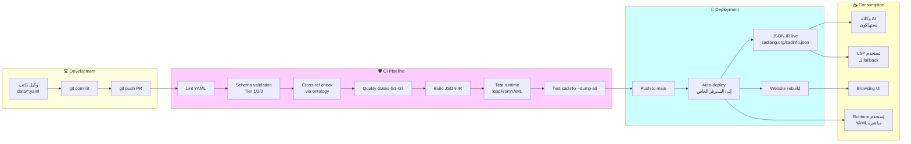

---

## 9. القرارات الـ 5 غير القابلة للتفاوض (قبل M1)

| # | القرار | مَن دعمه (Round 2) | الدافع |
|---|---|---|---|
| **1** | اكتب `_bmad-output/systems/_INTEROP_ONTOLOGY.md` | Winston | معمارية متعددة الأنظمة تَحتاج عقد موحَّد |
| **2** | حوِّل `sadinfo` → مكتبة `shared/sadinfo_core/` + CLI رقيق | Winston, John, Quinn | AI لا تَستدعي shell — تَستهلك API |
| **3** | استبدل `cmake codegen` بـ `runtime YAML loader` | Winston, Quinn | أقل cmake errors، أسهل debugging |
| **4** | اكتب G1–G7 كـ automated CI checks (ليس M2) | Winston, John, الكل | AI تَثق بـ QG، تَمنع drift |
| **5** | قِس baseline performance لـ `--dump-all` (target < 1s) | Winston, Amelia | وكلاء يَستدعون 50×/يوم |

---

## 10. القرارات المُؤجَّلة (تَحتاج قياس قبل الالتزام)

| # | القرار | مَن طَرحه | شرط القياس |
|---|---|---|---|
| **A** | Merkle hash للـ snapshots | Quinn | فقط إذا git diff لا يَكفي لـ drift detection |
| **B** | نطاق > 150 entry | المالك | فقط إذا 130-150 لا يَكفي للسياق |
| **C** | LSP migration إلى JSON IR | Quinn | فقط إذا runtime memory < 2x latency |
| **D** | AI training format | Winston | فقط بعد توفر AI training pipeline |

---

## 11. المخاطر والتَخفيف

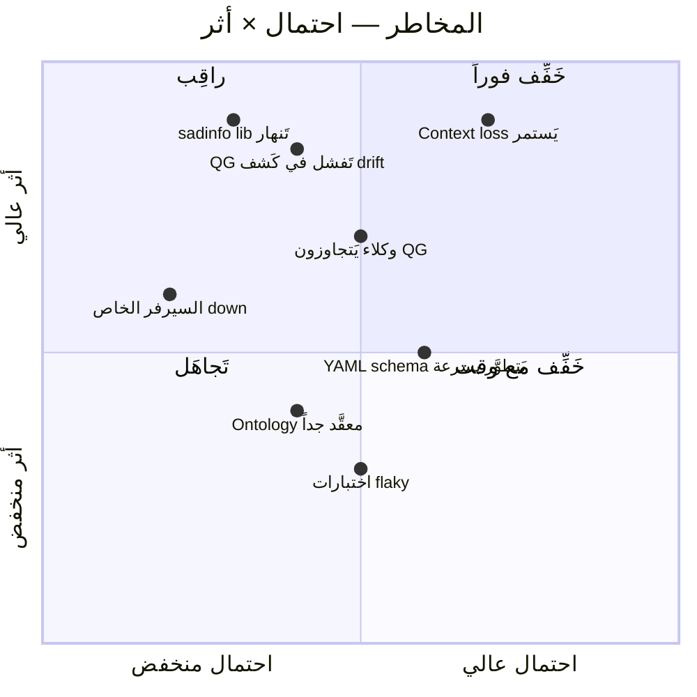

| المخاطر | احتمال | أثر | التَخفيف |
|---|:---:|:---:|---|
| Context loss يَستمر | عالي | عالي جداً | `sadinfo --dump-all` إلزامي قبل كل مهمة (في agent prompt) |
| QG تَفشل في كَشف drift | متوسط | عالي | Test fixtures عمدية بـ drift + assert detection |
| sadinfo library تَنهار | منخفض | عالي جداً | Unit tests > 90% + integration tests شاملة |
| وكلاء يَتجاوزون QG | متوسط | عالي | branch protection rules + auto-revert على main |
| السيرفر الخاص down | منخفض | متوسط | mirror احتياطي بدون coupling (read-only sync) |
| YAML schema يَتطوَّر | متوسط | متوسط | `schema_version` في كل ملف + migration scripts |
| Ontology معقَّد | متوسط | منخفض | ابدأ بسيطاً، توسَّع تَدريجياً بـ ADRs |

---

## 12. مَقاييس النَجاح (Success Metrics)

| مَقياس | Target M1 | Target M3 | Target M7 | كيف يُقاس |
|---|:---:|:---:|:---:|---|
| **# entities موثَّقة** | 65 | 146 | 200+ | `sadinfo --count` |
| **# QG violations في PR** | < 5 | < 2 | 0 | CI logs |
| **سرعة `--dump-all`** | < 2s | < 1s | < 500ms | benchmark |
| **# drift detections في main** | N/A | 0 | 0 | weekly audit |
| **# context loss incidents** | N/A | تَتبُّع | < 1/شهر | استبيان للوكلاء |
| **# Sprint stories بـ Given/When/Then** | 100% | 100% | 100% | lint script |
| **# DoDs مُؤجَّلة** | 0 | 0 | 0 | governance audit |

---

## 13. الفجوات الباقية — أسئلة للمالك

قبل اعتماد V2 رسمياً، نَحتاج إجابات على:

| # | السؤال | لماذا مُهم؟ |
|---|---|---|
| Q1 | هل تَوافق على إنشاء `_INTEROP_ONTOLOGY.md` كَخطوة pre-M1؟ | يُغيِّر تَنظيم الأنظمة بالكامل |
| Q2 | هل المخطط الزمني الجديد (8 أشهر) واقعي مع الموارد الحالية؟ | يُحدِّد سرعة التَنفيذ |
| Q3 | هل تَدعم قَرار "السيرفر الخاص فقط" (بدون gh-pages كـ fallback)؟ | يُحدِّد deployment strategy |
| Q4 | هل تَقبل بـ "0 deferred DoDs"؟ (يُلزِم كل ستوري بالاكتمال) | يُغيِّر sprint planning |
| Q5 | ما الأنظمة الأخرى المُخطَّطة؟ (لتَصميم ontology صحيح) | يُحدِّد عدد entity types |
| Q6 | هل سَتُعتمَد V2 رسمياً؟ متى؟ | يُحدِّد التَوقيت |

---

## 14. خَطوات التَنفيذ المُقترَحة (إذا اعتُمدت V2)

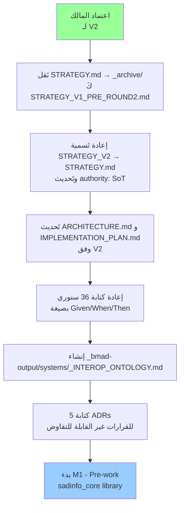

### قائمة تَحقُّق التَنفيذ (Pre-M1 Checklist)

- [ ] **PRE-1**: اعتماد V2 من المالك (مستند صريح)
- [ ] **PRE-2**: نَقل V1 إلى `_archive/STRATEGY_V1_PRE_ROUND2.md`
- [ ] **PRE-3**: إعادة تَسمية V2 إلى `STRATEGY.md` (تَصبح SoT)
- [ ] **PRE-4**: كتابة `_bmad-output/systems/_INTEROP_ONTOLOGY.md`
- [ ] **PRE-5**: 5 ADRs للقرارات غير القابلة للتفاوض:
  - ADR-DOCS-V2-001: sadinfo as library + thin CLI
  - ADR-DOCS-V2-002: runtime YAML loader (no cmake codegen)
  - ADR-DOCS-V2-003: Quality Gates G1-G7 as CI workflows
  - ADR-DOCS-V2-004: Private server only (no gh-pages fallback)
  - ADR-DOCS-V2-005: Multi-system ontology architecture
- [ ] **PRE-6**: تَحديث `ARCHITECTURE.md` وفق المعمارية الجديدة (الأقسام 3.1، 3.2، 3.3)
- [ ] **PRE-7**: إعادة كتابة `IMPLEMENTATION_PLAN.md` بـ 146 entry محدَّد
- [ ] **PRE-8**: إعادة كتابة 36 ستوري بصيغة Given/When/Then
- [ ] **PRE-9**: حذف كل deferred DoDs من S-000a و S-001
- [ ] **PRE-10**: قياس baseline performance لـ `sadinfo --dump-all`

---

## 15. خَلاصة الـ Round 2 — الإجماع النهائي

> **اعترافات الوكلاء (مَنقولة حرفياً من PARTY_MODE_CRITIQUE_2026-06-02.md):**
>
> - **Winston:** "كنت على 80% صحيح — لكن قاعدة السياق كانت ناقصة." (5 نقاط احتاجت تصحيح)
> - **John:** "كنت مخطئاً عن أن مستخدِم البشر هو الأولوية. كنت محقاً عن أن السؤال أساسي."
> - **Amelia:** "نقدي الأول كان 85% صحيح — السياق يَجعله أعمق وأكثر إلحاحاً."
> - **Quinn:** "6 من 8 افتراضاتي احتاجت تصحيح. اعترفت بالأخطاء المنطقية."

### القاعدة الذهبية الجديدة

```text
في نظام 100% AI-driven:
  - "روح الهدف" ≠ تَوثيق كافٍ (لا ذاكرة للوكيل)
  - كل شيء يَجب أن يَكون آلياً (Quality Gates، tests، deployment)
  - كل entity يَجب أن يَكون قابل للقراءة والكتابة من API (ليس shell فقط)
  - كل decision يَجب أن يَكون ADR قابل للقراءة من وكيل آخر
```

---

## 16. مراجع ووثائق ذات صلة

- [STRATEGY.md (V1 — الحالية)](STRATEGY.md) — تُستبدَل إذا اعتُمدت V2
- [ARCHITECTURE.md](ARCHITECTURE.md) — تَحتاج تَحديث وفق V2
- [IMPLEMENTATION_PLAN.md](IMPLEMENTATION_PLAN.md) — تَحتاج تَحديث وفق V2
- [_archive/PARTY_MODE_CRITIQUE_2026-06-02.md](_archive/PARTY_MODE_CRITIQUE_2026-06-02.md) — مَصدر الإجماع
- [stories/](stories/) — تَحتاج إعادة كتابة بـ Given/When/Then
- [_bmad-output/governance/1-policy/](../../governance/1-policy/) — حوكمة المشروع

---

## 18. استراتيجية النَشر + الأمثلة + التَمارين (إجابة سؤال المالك)

> **سؤال المالك (2026-06-04):** "ما هي استراتيجية نشر التَوثيقات في الموقع مع الأمثلة والتَمارين في خطة الاستراتيجية V2؟"
>
> هذا القسم يُغطي ثلاث طبقات: **(1) النَشر، (2) الأمثلة، (3) التَمارين** — كل منها بـ pipeline آلي + Quality Gate.

---

### 18.1 استراتيجية النَشر (Deployment Strategy)

#### نَموذج "Pull-Based" بدلاً من "Push-Based"

السيرفر الخاص لا يَستقبل push من CI — بل يَسحب من Git tag مُوقَّع كل دورة:

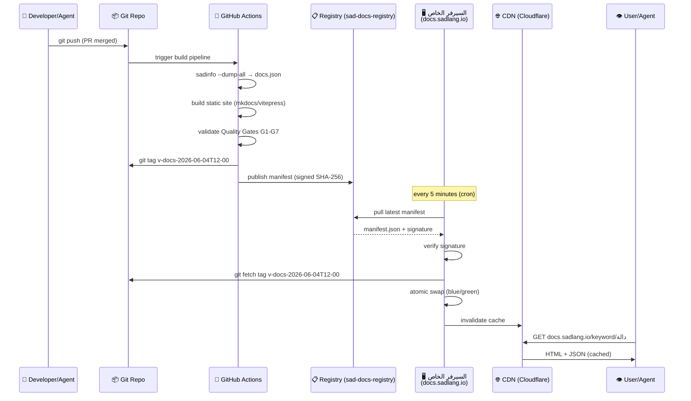

#### بُنية السيرفر الخاص

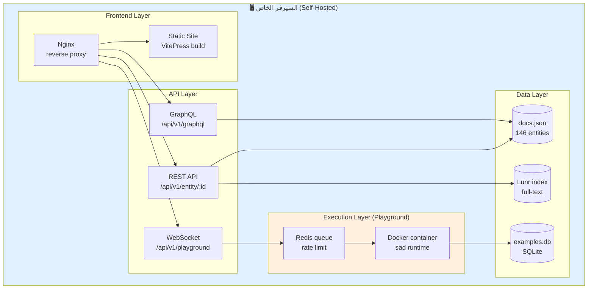

#### مَكونات النَشر بالتَفصيل

| المكون | الأداة | الدور |
|---|---|---|
| **Build** | GitHub Actions | `sadinfo --dump-all` + VitePress build |
| **Signing** | cosign (Sigstore) | تَوقيع manifest برقم SHA-256 |
| **Registry** | GitHub Releases | حِفظ tags + artifacts |
| **Pull agent** | systemd timer + bash | كل 5 دقائق على السيرفر |
| **Hot reload** | nginx + symlink swap | استبدال atomic بدون downtime |
| **CDN** | Cloudflare (free tier) | cache + DDoS protection |
| **Monitoring** | Prometheus + Grafana | uptime + latency + errors |
| **Backup** | rclone → S3 (daily) | استرداد كارثي |

#### استراتيجية الإصدار (Versioning)

```mermaid
flowchart LR
    A[main branch] -->|every PR merge| B[v-docs-2026-06-04T12-00]
    B --> C{Quality Gates<br/>G1-G7}
    C -->|✓ all pass| D[publish to /current]
    C -->|✗ fail| E[block + alert]
    D --> F[/v/current/keyword/دالة]
    D --> G[/v/2026-06-04/keyword/دالة]
    G -.->|preserved| H[immutable archive]

    style D fill:#9f9
    style E fill:#f99
    style H fill:#cf9
```

**ملاحظات:**
- `/v/current/` يُعاد توجيهه دائماً لأحدث إصدار صحيح
- `/v/YYYY-MM-DD/` immutable — وكيل قديم يَطلب إصدار محدَّد
- لا يُحذف أي إصدار قديم — drift detection يَعتمد عليه

---

### 18.2 الأمثلة (Examples Strategy)

> **مبدأ:** كل entity يَجب أن يَحوي ≥1 مثال صالح + ≥1 مثال خاطئ (anti-pattern).
> الأمثلة **تُختبَر تلقائياً** في CI — لا تُنشَر إلا إن نَجحت.

#### بُنية المثال في YAML

```yaml
# مَلف: docs/keywords/دالة.yaml
id: KW-FUNC-001
ar: دالة
en: function
category: keyword
since: "0.1.0"

examples:
  - id: EX-FUNC-001-basic
    title_ar: دالة بسيطة
    title_en: Basic function
    code: |
      دالة جمع(أ، ب)
          ارجع أ + ب
      نهاية
      اطبع_سطر(جمع(3، 5))
    expected_output: "8"
    expected_exit_code: 0
    tags: [beginner, math]
    test_runner: sad-interp  # أو sad-compile

  - id: EX-FUNC-001-recursive
    title_ar: دالة مُتكررة
    title_en: Recursive function
    code: |
      دالة عاملي(ن)
          إذا (ن <= 1)
              ارجع 1
          نهاية
          ارجع ن * عاملي(ن - 1)
      نهاية
      اطبع_سطر(عاملي(5))
    expected_output: "120"
    tags: [intermediate, recursion]

  - id: EX-FUNC-001-antipattern
    title_ar: ❌ نسيان كلمة نهاية
    title_en: ❌ Missing 'نهاية'
    code: |
      دالة جمع(أ، ب)
          ارجع أ + ب
      # نسيان نهاية!
    expected_error: "ParseError: expected 'نهاية' at line 4"
    expected_exit_code: 1
    tags: [anti-pattern, common-mistake]
    why_wrong_ar: |
      كل كتلة في لغة ص يَجب أن تَنتهي بـ `نهاية`.
      المُفسِّر يَنتظر إغلاق الدالة ولا يَجد.
```

#### Pipeline اختبار الأمثلة

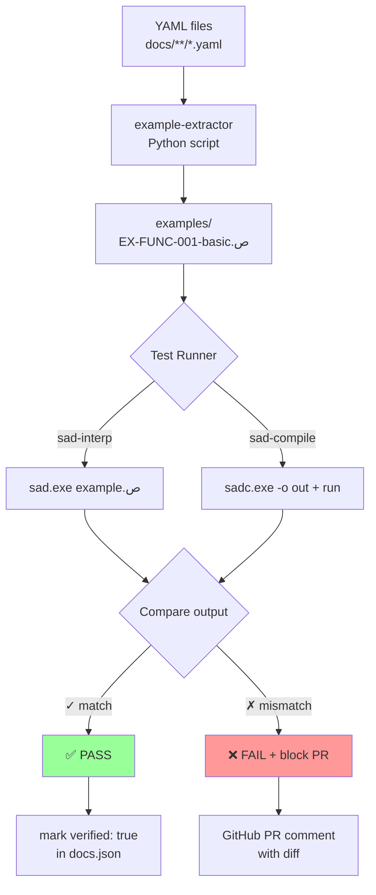

#### تَصنيف الأمثلة

| التَصنيف | العدد المُستهدف لكل entity | الغرض |
|---|:---:|---|
| `beginner` | 1+ | شرح أساسي |
| `intermediate` | 1+ | استخدام شائع |
| `advanced` | 0-1 | حالة قصوى |
| `anti-pattern` | 1+ | خطأ شائع + شرح |
| `interop` | 0-1 | تَفاعل مع entity آخر |

**المُجمل المُستهدَف:** 146 entity × ~4 examples = **~584 مثال مُختبَر آلياً**

#### عَرض المثال في الموقع

```mermaid
flowchart LR
    A[/keyword/دالة] --> B[VitePress page]
    B --> C[Code block<br/>syntax highlight]
    B --> D[▶ Run in Playground<br/>button]
    B --> E[📋 Copy to clipboard]
    B --> F[🔗 Permalink<br/>EX-FUNC-001-basic]
    D --> G[WebSocket → docker exec]
    G --> H[Output panel<br/>real-time]

    style D fill:#cff
    style H fill:#fc9
```

---

### 18.3 التَمارين (Exercises Strategy)

> **مبدأ:** التَمرين = "ستوري قابل للتَنفيذ" يَتعلَّمه الوكيل/المستخدِم بحل مَهمة محدَّدة مع شُروط قَبول قابلة للقياس.

#### نَموذج التَمرين

```yaml
# مَلف: docs/exercises/EX-FIBONACCI.yaml
id: EX-FIBONACCI
title_ar: فيبوناتشي
title_en: Fibonacci
difficulty: beginner  # beginner | intermediate | advanced
estimated_time_min: 10
covers_entities: [KW-FUNC-001, KW-IF-001, KW-RETURN-001]
prerequisites: []

problem_ar: |
  اكتب دالة `فيبوناتشي(ن)` تَرجع رقم فيبوناتشي رقم `ن`.
  - فيبوناتشي(0) = 0
  - فيبوناتشي(1) = 1
  - فيبوناتشي(ن) = فيبوناتشي(ن-1) + فيبوناتشي(ن-2)

starter_code: |
  دالة فيبوناتشي(ن)
      # اكتب الحل هنا
  نهاية

test_cases:
  - input: "اطبع_سطر(فيبوناتشي(0))"
    expected_output: "0"
  - input: "اطبع_سطر(فيبوناتشي(1))"
    expected_output: "1"
  - input: "اطبع_سطر(فيبوناتشي(10))"
    expected_output: "55"
  - input: "اطبع_سطر(فيبوناتشي(20))"
    expected_output: "6765"

solution: |
  دالة فيبوناتشي(ن)
      إذا (ن <= 1)
          ارجع ن
      نهاية
      ارجع فيبوناتشي(ن - 1) + فيبوناتشي(ن - 2)
  نهاية

hints:
  - level: 1
    text_ar: ابدأ بحالة التَوقُّف (الأساس) — ماذا يَحدث عندما تَكون ن صغيرة؟
  - level: 2
    text_ar: استخدم الاستدعاء الذاتي (recursion) لاستدعاء الدالة من داخلها.
  - level: 3
    text_ar: تَذكَّر إضافة شرط `إذا` لمنع الاستدعاء اللانهائي.

acceptance_criteria:
  - given: مَدخَلات صحيحة (0-30)
    when: استدعاء الدالة
    then: النَتيجة مُطابقة لـ test_cases
  - given: لا توجد infinite loop
    when: قياس وقت التَنفيذ
    then: < 5 ثوانٍ لـ ن=20
```

#### مَسار حل التَمرين للوكيل

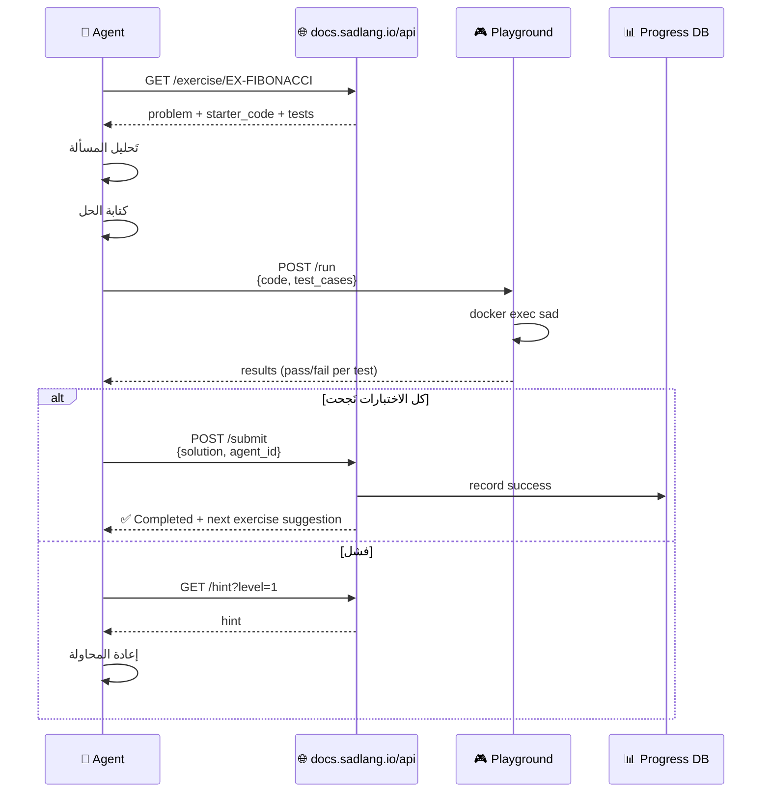

#### تَصنيف التَمارين

```mermaid
mindmap
  root((التَمارين<br/>~200 مُستهدَف))
    Beginner~60
      Syntax basics
      Variables
      Simple functions
      Conditionals
      Loops
    Intermediate~80
      Classes/Structs
      Pattern matching
      Error handling
      Modules
      File I/O
    Advanced~40
      Concurrency goroutines
      Macros
      FFI
      Generics
      Async
    Domain-specific~20
      OS kernel
      Network
      Graphics
      Crypto
```

#### Quality Gate للتَمارين (G8 جديد مَقترح)

| فحص | شرط النَجاح |
|---|---|
| **G8.1 starter_code** | يُحلِّل lex/parse بنجاح (يُعطي خطأ تنفيذ متوقَّع) |
| **G8.2 solution** | يَجتاز 100% من test_cases |
| **G8.3 hints** | 3 مستويات على الأقل (تَدرُّج من غامض إلى صريح) |
| **G8.4 acceptance** | Given/When/Then قابل للقياس آلياً |
| **G8.5 difficulty match** | covers_entities ⊆ entities لـ difficulty المعلَن |

---

### 18.4 ربط النَشر + الأمثلة + التَمارين معاً

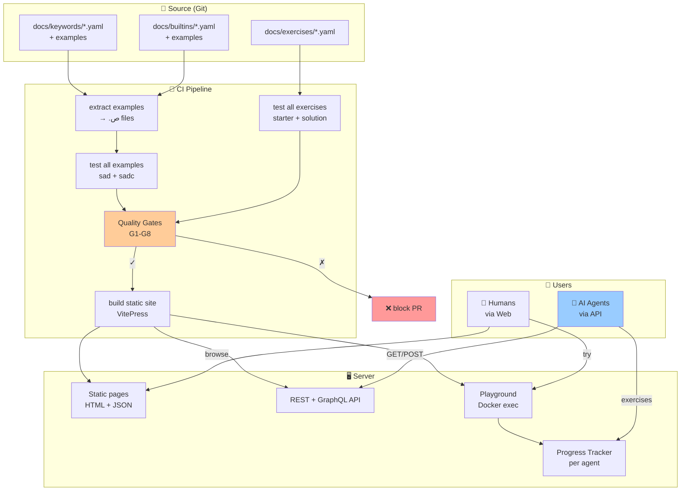

#### المُجمل النهائي (M7 — 8 أشهر)

| المُكوِّن | الكَم | المَصدر |
|---|:---:|---|
| Entities موثَّقة | 146 | YAML files |
| Examples مُختبَرة | ~584 | extracted + tested |
| Exercises قابلة للحل | ~200 | dedicated YAML |
| API endpoints | 8+ | REST + GraphQL |
| Playground sessions/day | 1000+ | Docker queue |
| Quality Gates | G1-G8 | CI workflows |
| Test coverage | 100% | كل example + exercise |

---

### 18.5 ستوريات جديدة مُقترَحة (للسبرنت القادم)

| Story ID | العنوان | الأولوية | Effort |
|---|---|:---:|:---:|
| **S-DEPLOY-001** | إنشاء `_INFRA_DEPLOY.md` بتَفاصيل السيرفر الخاص | 🔴 | M |
| **S-EXAMPLES-001** | تَوسيع YAML schema لدعم `examples[]` | 🔴 | S |
| **S-EXAMPLES-002** | كتابة `example-extractor` (YAML → .ص files) | 🔴 | M |
| **S-EXAMPLES-003** | CI workflow لاختبار جميع الأمثلة | 🔴 | M |
| **S-EXERCISES-001** | تَصميم YAML schema للتَمارين | 🟡 | S |
| **S-EXERCISES-002** | كتابة 20 تَمرين beginner أولاً | 🟡 | L |
| **S-PLAYGROUND-001** | Docker setup + REST API | 🟢 | L |
| **S-PLAYGROUND-002** | WebSocket integration للنَتائج المُباشرة | 🟢 | M |

---

## 19. سِجل التَغييرات

| التاريخ | الإصدار | الكاتب | التَغيير |
|---|---|---|---|
| 2026-06-04 | V2-DRAFT | إجماع 4 وكلاء (Round 2) | إنشاء أولي مَبني على Round 2 critique |
| 2026-06-04 | V2-DRAFT.1 | إجابة سؤال المالك | إضافة قسم 18: النَشر + الأمثلة + التَمارين |

---

**انتهت V2-DRAFT.1 — تَنتظر اعتماد المالك.**
