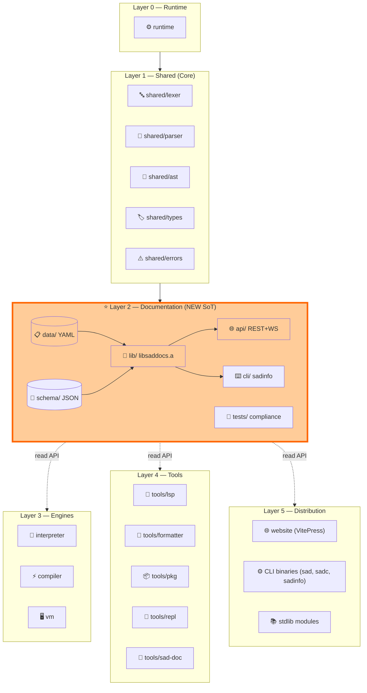
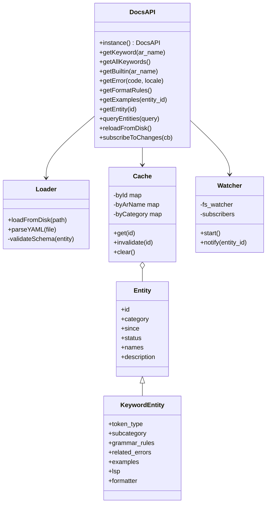
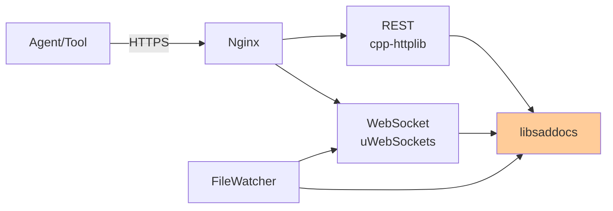
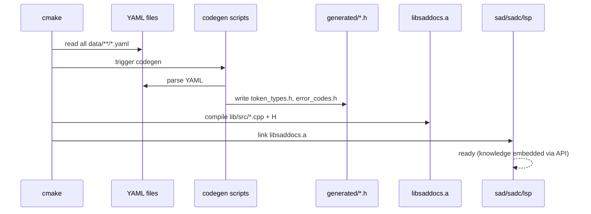
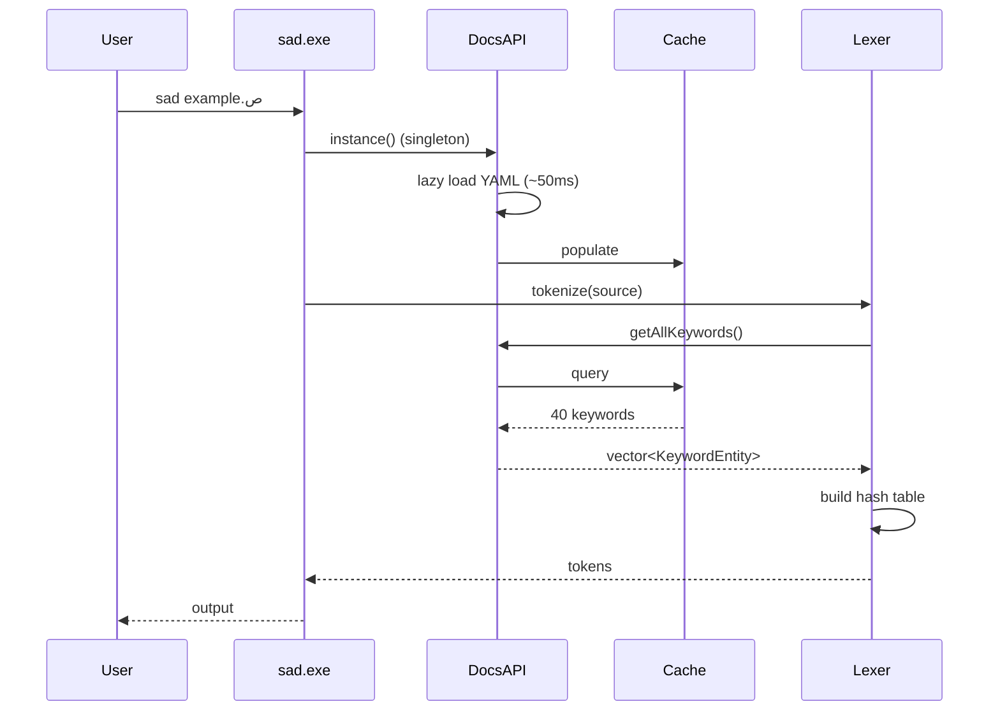
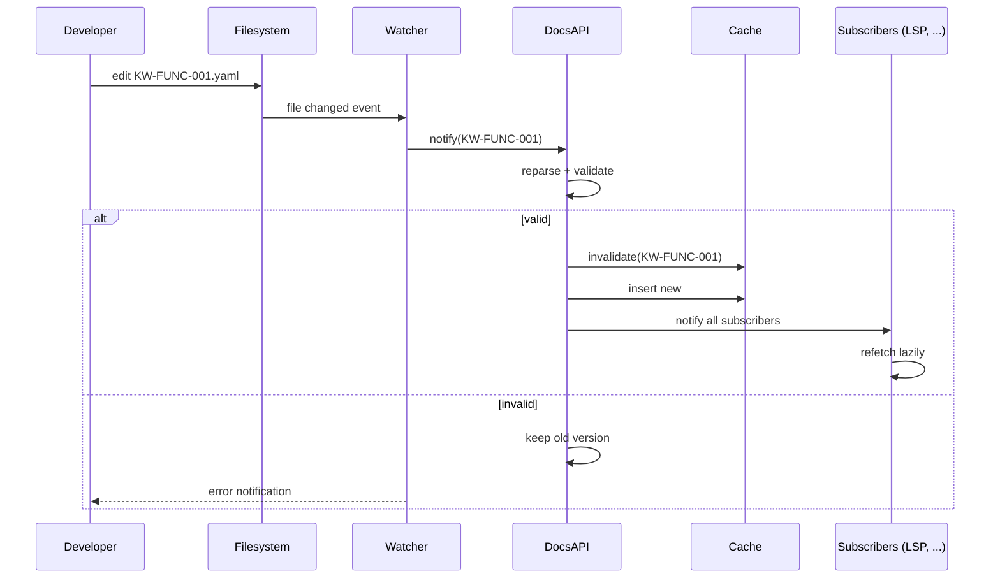
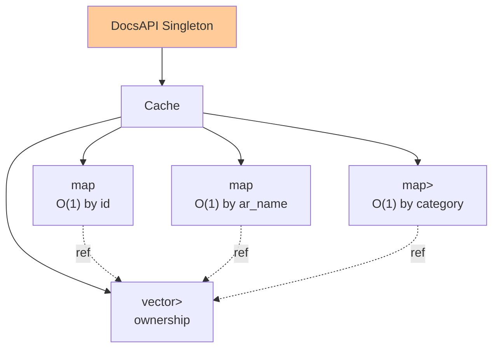
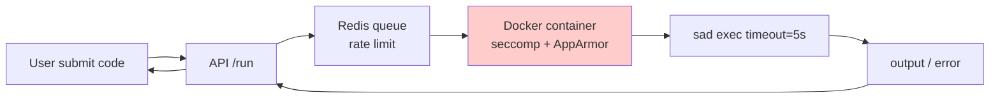

# 🏛️ معمارية نظام التَوثيق V3

> هذه الوثيقة تَصف **كيف** يُبنى نظام التَوثيق المُقترَح في [STRATEGY.md](STRATEGY.md).
> كل قَرار معماري هنا مُشتَق من المبادئ الـ 8 غير القابلة للتَفاوض (ND-1 إلى ND-8).

---

## 1. المعمارية على المستوى الأعلى

### مَخطَّط الطبقات الكامل



### قَواعد الاعتمادية

| القاعدة | الشرح |
|---|---|
| **R-1** | Layer N → Layer (N-1) فقط |
| **R-2** | Layer ≥ 3 → Layer 2 إلزامي (consumer) |
| **R-3** | Layer 2 → Layer 1 فقط (lexer/types للقراءة) |
| **R-4** | Layer 2 لا يَعتمد على Layer ≥ 3 (يُحظَر cyclic) |
| **R-5** | اختبار `arch-test.py` يُجبِر القَواعد في CI |

---

## 2. مُكوِّنات Layer 2 بالتَفصيل

### 2.1 `documentation/data/` — قاعدة البيانات

```text
data/
├── keywords/        (40 محجوزة + 25 سياقية = 65)
├── builtins/        (~21)
├── operators/       (~15)
├── directives/      (~10)
├── errors/
│   ├── lexer/       (E_LEX_*.yaml)
│   ├── parser/      (E_PAR_*.yaml)
│   └── runtime/     (E_RT_*.yaml)
├── types/           (9: رقم، عشري، نص، منطقي، فراغ، عدم، مصفوفة، خريطة، أي)
├── grammar/         (قَواعد نحوية)
├── stdlib/          (مَكتبة قياسية)
├── lessons/         (دروس مُترابطة)
└── exercises/       (تَمارين قابلة للحل)
```

**الأرقام المُستهدَفة (M8 — 8 أشهر):**

| النوع | M1 | M4 | M8 |
|---|:---:|:---:|:---:|
| keywords | 40 | 65 | 65 |
| builtins | 10 | 21 | 21 |
| operators | 5 | 15 | 15 |
| directives | 3 | 10 | 10 |
| errors | 10 | 35 | 60 |
| types | 5 | 9 | 9 |
| grammar rules | 10 | 25 | 40 |
| stdlib funcs | 0 | 30 | 60+ |
| lessons | 0 | 15 | 30+ |
| exercises | 0 | 50 | 200+ |
| **المُجمل** | **83** | **275** | **510+** |

### 2.2 `documentation/schema/` — JSON Schemas

```text
schema/
├── entity.schema.json          # base لكل entity
├── keyword.schema.json
├── builtin.schema.json
├── operator.schema.json
├── directive.schema.json
├── error.schema.json
├── type.schema.json
├── grammar_rule.schema.json
├── stdlib_function.schema.json
├── lesson.schema.json
├── exercise.schema.json
├── example.schema.json
└── format_rule.schema.json
```

كل YAML يُفحَص بـ `ajv validate` في CI (G11).

### 2.3 `documentation/lib/` — مكتبة C++



#### بُنية المَلفات

```text
documentation/lib/
├── include/sad/docs/
│   ├── api.h                  # public API
│   ├── entity.h               # base + derived
│   ├── keyword.h
│   ├── builtin.h
│   ├── error.h
│   ├── example.h
│   └── types.h                # enums + structs
└── src/
    ├── api.cpp                # singleton + dispatch
    ├── loader.cpp             # YAML → Entity
    ├── yaml_parser.cpp        # wrapper حول yaml-cpp
    ├── schema_validator.cpp   # JSON Schema check
    ├── cache.cpp              # in-memory store
    ├── watcher.cpp            # filesystem watch
    └── codegen/
        ├── token_type_gen.cpp # generates token_types.h
        └── error_code_gen.cpp # generates error_codes.h
```

### 2.4 `documentation/api/` — REST + WebSocket



#### REST Endpoints

| Method | Path | Description |
|---|---|---|
| GET | `/api/v1/entity/:id` | كامل entity |
| GET | `/api/v1/entities?category=keyword` | بفلتر |
| GET | `/api/v1/keyword/:ar_name` | بالاسم العربي |
| GET | `/api/v1/error/:code` | رسالة + اقتراحات |
| GET | `/api/v1/example/:id` | مثال |
| GET | `/api/v1/exercise/:id` | تَمرين |
| POST | `/api/v1/exercise/:id/submit` | تَقديم حل |
| GET | `/api/v1/lesson/:id` | درس |
| GET | `/api/v1/dump-all` | docs.json كامل |
| GET | `/api/v1/version` | إصدار + manifest |
| GET | `/api/v1/health` | health check |

#### WebSocket Events

| Event | Payload |
|---|---|
| `entity.changed` | `{id, action: add/update/delete}` |
| `schema.updated` | `{schema_name, version}` |
| `playground.output` | `{session_id, output, exit_code}` |
| `playground.error` | `{session_id, error}` |

### 2.5 `documentation/cli/` — sadinfo

```bash
sadinfo keyword دالة                    # عَرض keyword
sadinfo keyword --all                   # كل الكلمات
sadinfo error E_PAR_FUNC_002            # شرح خطأ
sadinfo example EX-KW-FUNC-001-basic    # عَرض + تَنفيذ
sadinfo exercise EX-FIBONACCI           # عَرض تَمرين
sadinfo dump --format=json              # docs.json
sadinfo dump --format=markdown          # docs.md
sadinfo lint <consumer-path>            # G8 lint
sadinfo verify-examples                 # G12 check
sadinfo serve --port=8080               # تَشغيل REST
```

---

## 3. تَدفُّق البيانات

### 3.1 عند Build التَطبيق



### 3.2 عند Runtime (مثال: `sad example.ص`)



### 3.3 عند Hot Reload (تَعديل YAML)



---

## 4. تَكامُل كل Consumer

### 4.1 Lexer (Layer 1)

**ملاحظة:** Lexer نَفسه في Layer 1 — يَستهلك من Layer 2 (استثناء مَنطقي لأنَّ DocsAPI تَحتاج types من Layer 1).
الحل: DocsAPI تَستخدم primitives من Layer 1 (string, vector) فقط، لا lexer types.

راجع: [examples/EXAMPLE_LEXER_INTEGRATION.md](examples/EXAMPLE_LEXER_INTEGRATION.md)

### 4.2 Parser (Layer 1)

```cpp
// shared/parser/src/parser_errors.cpp
void Parser::error(std::string_view code, Token tok) {
    auto err = Sad::Docs::DocsAPI::instance().getError(code, locale_);
    diagnostics_.push_back({
        .message = err.message,
        .suggestions = err.fix_suggestions,
        .position = tok.position(),
    });
}
```

### 4.3 Interpreter (Layer 3)

```cpp
// interpreter/src/builtins/builtin_registry.cpp
void BuiltinRegistry::initialize() {
    auto& docs = Sad::Docs::DocsAPI::instance();
    for (const auto& bi : docs.getAllBuiltins()) {
        functions_[bi.names.ar] = createWrapper(bi);
    }
}
```

### 4.4 Compiler (Layer 3)

```cpp
// compiler/src/frontend/sir_builder_directives.cpp
SIROpcode SIRBuilder::resolveDirective(std::string_view name) {
    auto& docs = Sad::Docs::DocsAPI::instance();
    auto dir = docs.getDirective(name);
    if (!dir) throw CompileError("E_PAR_DIR_001", name);
    return mapToSIROpcode(dir->sir_opcode);
}
```

### 4.5 LSP (Layer 4)

```cpp
// tools/lsp/src/hover_provider.cpp
Hover HoverProvider::provide(Position pos) {
    auto word = getWordAt(pos);
    auto& docs = Sad::Docs::DocsAPI::instance();
    auto kw = docs.getKeyword(word);
    if (!kw) return {};
    return {
        .contents = renderTemplate(kw->lsp.hover_template_ar, *kw),
        .range = rangeAt(pos),
    };
}
```

### 4.6 Formatter (Layer 4)

```cpp
// tools/formatter/src/spacing_rules.cpp
SpacingRule SpacingRules::forKeyword(std::string_view kw_name) {
    auto& docs = Sad::Docs::DocsAPI::instance();
    auto kw = docs.getKeyword(kw_name);
    if (!kw) return SpacingRule::default();
    return SpacingRule::fromYAML(kw->formatter);
}
```

### 4.7 Website (Layer 5)

```js
// website/.vitepress/config.js
import docsJson from './generated/docs.json'

export default {
  themeConfig: {
    sidebar: generateSidebar(docsJson),
  }
}

// generated/docs.json يُولَّد عبر:
// sadinfo dump --format=json > website/.vitepress/generated/docs.json
```

---

## 5. التَخزين والأداء

### 5.1 In-Memory Layout



### 5.2 أهداف الأداء

| العملية | M3 | M8 | كيفية القياس |
|---|:---:|:---:|---|
| `instance()` (cold) | < 100ms | < 50ms | benchmark startup |
| `getKeyword()` (cached) | < 1µs | < 500ns | microbench |
| `getAllKeywords()` | < 10µs | < 5µs | microbench |
| `getError()` (cached) | < 1µs | < 500ns | microbench |
| `dump --json` | < 1s | < 200ms | wall clock |
| Memory footprint | < 10MB | < 5MB | RSS |
| Hot reload latency | < 50ms | < 20ms | watcher → subscriber |

### 5.3 استراتيجيات التَحسين

| التَحسين | المَرحلة | الأثر |
|---|:---:|---|
| Lazy loading (per-category) | M2 | -40% startup |
| Compile-time codegen | M3 | -90% startup (zero parse) |
| String interning | M4 | -30% memory |
| Memory-mapped cache | M6 | shared between processes |
| Bloom filter للـ negative lookups | M7 | -50% lookup misses |

---

## 6. الأمان والصلاحيات

### 6.1 Write Access

- **YAML files**: قابلة للكتابة من PR فقط (GitHub permission)
- **DocsAPI**: read-only في process (لا setters)
- **REST API**: read-only في production؛ write-only في staging

### 6.2 Validation

- كل YAML يُفحَص بـ Schema (G11)
- كل مثال يُختبَر (G12)
- CI يَفشل عند أي خرق

### 6.3 Sandboxing (Playground)



---

## 7. التَطَوُّر (Evolution)

### Schema Versioning

كل YAML يَحوي `schema_version`. عند تَرقية schema:

1. كتابة migration script في `documentation/scripts/migrations/`
2. تَشغيل migration على جميع YAML files
3. تَحديث schema_version في كل ملف
4. تَحديث `MIN_SUPPORTED_SCHEMA_VERSION` في libsaddocs
5. ADR يُوثِّق التَغيير

### API Versioning

- REST: `/api/v1/`، `/api/v2/`، ...
- C++ API: semver + `[[deprecated]]` لـ 6 أشهر قبل إزالة

---

## 8. الاختبار

### 8.1 Unit Tests

كل ملف cpp له test مُقابل يَختبر:
- صحة parsing
- صحة caching
- صحة validation
- معالجة edge cases

### 8.2 Integration Tests

```text
tests/integration/
├── test_lexer_consumes_docs.cpp     # M3
├── test_parser_consumes_docs.cpp    # M4
├── test_lsp_consumes_docs.cpp       # M5
└── test_formatter_consumes_docs.cpp # M6
```

كل اختبار يُؤكِّد:
1. المُكوِّن يَستخدم DocsAPI فعلاً (لا hardcoded)
2. النَتيجة تُطابق المَوجود في YAML
3. تَعديل YAML يُغيِّر السلوك (hot reload)

### 8.3 Compliance Tests (G8)

```python
# tests/consumer_compliance/lint_no_hardcoded.py
FORBIDDEN_IN_CONSUMERS = [
    r'table_\["[^"]+"\]\s*=\s*TokenType::',
    r'std::map<std::string, TokenType>\s*\{[^}]*"[^"]+"',
    r'if\s*\(\s*\w+\s*==\s*"دالة"',
    r'errors_\["[^"]+"\]',
]

CONSUMER_PATHS = [
    'shared/lexer/',
    'shared/parser/',
    'shared/errors/',
    'interpreter/',
    'compiler/',
    'tools/lsp/',
    'tools/formatter/',
]
```

### 8.4 E2E Tests

```bash
# tests/e2e/add_keyword_workflow.sh
# 1. add YAML file
echo "id: KW-TEST-001
names: { ar: تَجريبي, en: test_keyword }
token_type: KEYWORD_TEST" > documentation/data/keywords/KW-TEST-001.yaml

# 2. build
cmake --build build

# 3. test that lexer recognizes it
echo "تَجريبي س = 10" | ./build/bin/sad -
# expect: TOKEN(KEYWORD_TEST) ...

# 4. cleanup
rm documentation/data/keywords/KW-TEST-001.yaml
```

---

## 9. النَشر (Deployment)

### 9.1 Embedded Mode (default)

```text
sad.exe → libsaddocs.a (static linked) → embedded YAML data
```

كل executable مُستقل، لا يَحتاج connection.

### 9.2 Server Mode

```text
sad.exe → DocsAPI (HTTPS) → docs.sadlang.io
```

للأدوات التي تَحتاج real-time updates (LSP).

### 9.3 Hybrid Mode

```text
sad.exe → embedded data (fast path)
       → polling docs.sadlang.io (every 1h for updates)
```

---

## 10. المخاطر المعمارية

| المخاطرة | احتمال | تَأثير | تَخفيف |
|---|:---:|:---:|---|
| Layer 2 يَصبح bottleneck | متوسط | عالٍ | caching agressive + compile-time codegen |
| YAML schema يَتطوَّر بسرعة | عالٍ | متوسط | schema_version + migrations |
| circular dependency Layer1↔Layer2 | متوسط | عالٍ | arch-test.py في CI |
| ضخامة libsaddocs.a | منخفض | متوسط | strip + LTO |
| API stability | متوسط | عالٍ | semver strict + deprecation cycle |

---

## 11. المُلحَقات

### المُلحَق A: مَخطَّط المُجلَّدات الكامل

```text
documentation/
├── CMakeLists.txt
├── README.md
├── data/                    # YAML registry (SoT)
├── schema/                  # JSON Schemas
├── lib/                     # C++ library
│   ├── include/sad/docs/
│   └── src/
├── api/                     # REST + WS server
│   ├── server.cpp
│   ├── routes/
│   └── websocket.cpp
├── cli/                     # sadinfo
│   └── main.cpp
├── scripts/                 # codegen + migrations
│   ├── gen_token_types.py
│   ├── gen_error_codes.py
│   └── migrations/
├── tests/
│   ├── unit/
│   ├── integration/
│   ├── consumer_compliance/
│   └── e2e/
└── docs/                    # توثيق طبقة التَوثيق نفسها (meta)
    ├── ARCHITECTURE.md
    └── API.md
```

### المُلحَق B: حجم تَقريبي

| المُكوِّن | حجم (M8) |
|---|:---:|
| YAML data | ~5 MB |
| libsaddocs.a | ~2 MB |
| sadinfo binary | ~3 MB |
| API server | ~5 MB |
| Total dist | ~15 MB |

### المُلحَق C: المَكتبات الخارجية

| المكتبة | الغرض | الترخيص |
|---|---|---|
| yaml-cpp | YAML parsing | MIT |
| nlohmann-json | JSON Schema | MIT |
| cpp-httplib | REST server | MIT |
| uWebSockets | WebSocket | Apache 2.0 |
| ajv (Node) | Schema validation في CI | MIT |

---

## 12. سِجل التَغييرات

| التاريخ | الإصدار | التَغيير |
|---|---|---|
| 2026-06-04 | V3 | إنشاء جَذري بَعد قَرار "documentation كَطبقة هندسية" |

---

**انتهت معمارية V3 — تَنتظر اعتماد المالك.**