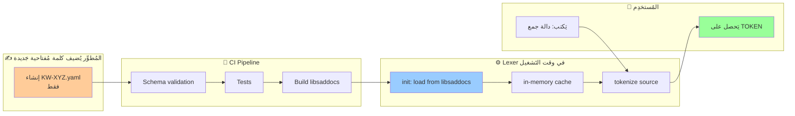
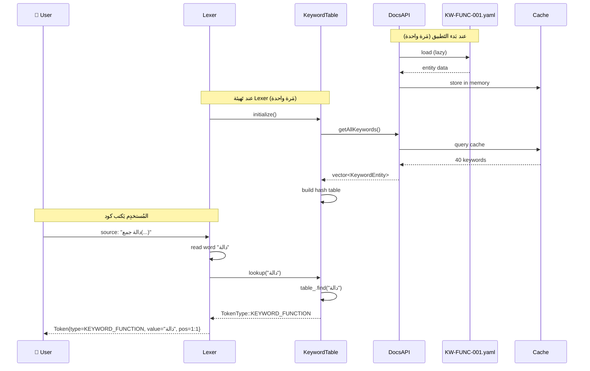
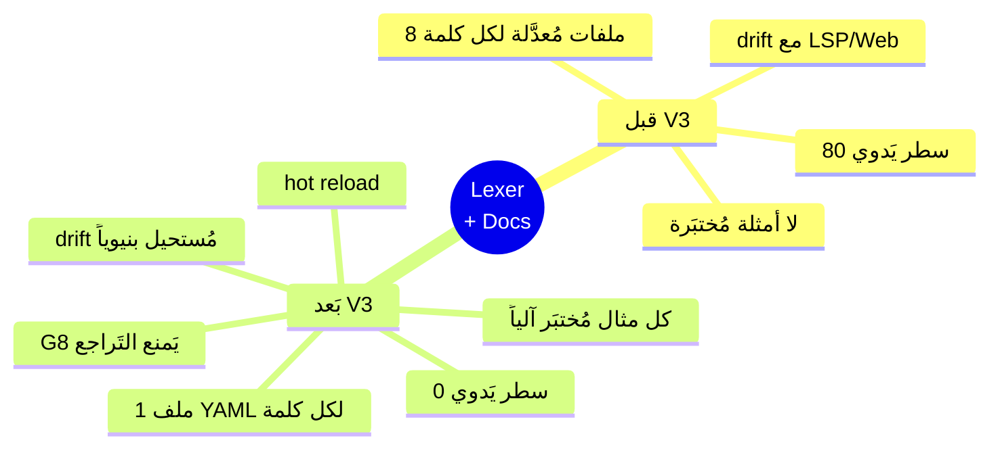

# 🔍 مثال عَملي: كيف يَتَعامل المحلل المعجمي مع نظام التَوثيق

> **السياق:** هذا المثال يُجيب سؤال المالك (2026-06-04):
> "اشرح بمثال كيف سَيَتَعامل المحلل المعجمي مع نظام التَوثيق"
>
> سَنَتَتبَّع رحلة كاملة: من ملف YAML واحد → إلى Lexer يَستهلكه → إلى مُستخدِم يَكتب كوداً.

---

## 1. النَظرة الشاملة (Big Picture)



**النَتيجة:** إضافة كلمة مُفتاحية جَديدة = **ملف YAML واحد**.
**لا تَعديل** لـ `lexer_keywords.cpp` و**لا تَعديل** لـ `token.h`.

---

## 2. الوضع الحالي (Before V3) — نَموذج "Hardcoded Knowledge"

### مَلف `shared/lexer/include/token.h`

```cpp
enum class TokenType {
    // ... رموز كثيرة
    KEYWORD_FUNCTION,    // دالة
    KEYWORD_CLASS,       // صنف
    KEYWORD_IF,          // إذا
    KEYWORD_ELSE,        // وإلا
    KEYWORD_WHILE,       // بينما
    KEYWORD_FOR,         // لكل
    KEYWORD_RETURN,      // ارجع
    KEYWORD_VAR,         // متغير
    KEYWORD_CONST,       // ثابت
    KEYWORD_END,         // نهاية
    // ... 40 كلمة محجوزة
};
```

### مَلف `shared/lexer/src/lexer_keywords.cpp`

```cpp
void KeywordTable::initialize() {
    table_["دالة"]    = TokenType::KEYWORD_FUNCTION;
    table_["صنف"]    = TokenType::KEYWORD_CLASS;
    table_["إذا"]    = TokenType::KEYWORD_IF;
    table_["اذا"]    = TokenType::KEYWORD_IF;   // بديل بدون همزة
    table_["وإلا"]   = TokenType::KEYWORD_ELSE;
    table_["والا"]   = TokenType::KEYWORD_ELSE; // بديل
    table_["بينما"]  = TokenType::KEYWORD_WHILE;
    table_["لكل"]    = TokenType::KEYWORD_FOR;
    table_["ارجع"]   = TokenType::KEYWORD_RETURN;
    table_["متغير"]  = TokenType::KEYWORD_VAR;
    table_["ثابت"]   = TokenType::KEYWORD_CONST;
    table_["نهاية"]  = TokenType::KEYWORD_END;
    // ... 80+ سطر يَدوي
}
```

### المُشكلات

| # | المشكلة | الأثر |
|---|---|---|
| 1 | إضافة كلمة جَديدة = تَعديل ملفين (`token.h` + `lexer_keywords.cpp`) | بطء، إمكانية الخطأ |
| 2 | لا توجد رسالة خطأ مُتَّسقة (كل ملف يَكتب رسالته) | تَجربة سيئة |
| 3 | لا توجد أمثلة مُختبَرة مَربوطة بالكلمة | المُستخدِم لا يَعرف الاستخدام |
| 4 | الموقع يَكتب يَدوياً توثيق "دالة" بدون رابط للـ lexer | drift |
| 5 | LSP يَكتب hover يَدوياً | drift |
| 6 | المُنسِّق يَفترض ترتيب الكلمات | drift |

---

## 3. الوضع الجَديد (After V3) — نَموذج "Documentation-Driven"

### الخَطوة 1: المُطوِّر يُنشئ ملف YAML واحداً

**مَلف:** `documentation/data/keywords/KW-FUNC-001.yaml`

```yaml
# === تَعريف الكلمة المُفتاحية ===
id: KW-FUNC-001
schema_version: "1.0"
category: keyword
subcategory: reserved              # reserved | contextual
status: stable                     # stable | experimental | deprecated
since: "0.1.0"

# === التَسمية ===
names:
  ar: دالة
  en: function
  aliases_ar: []                   # بدائل عربية
  aliases_en: [func, fn]           # بدائل إنجليزية (مَرفوضة لكن مُوثَّقة)

# === النَوع في الـ Lexer ===
token_type: KEYWORD_FUNCTION

# === الوصف ===
description:
  ar: |
    كلمة مُفتاحية لتَعريف دالة. تَفتح كتلة جَديدة يَجب إغلاقها بـ `نهاية`.
    تَقبل مَعاملات اختيارية بين قَوسين، ويُمكن استخدام `ارجع` لإعادة قيمة.
  en: |
    Keyword to define a function. Opens a new block that must be closed with `نهاية`.
    Accepts optional parameters in parentheses, and `ارجع` may return a value.

# === القَواعد النَحوية المَرتبطة ===
grammar_rules:
  - G_FUNCTION_DECL
  - G_FUNCTION_EXPR

# === الأخطاء المُحتمَلة ===
related_errors:
  - E_PAR_FUNC_001  # نسيان (
  - E_PAR_FUNC_002  # نسيان نهاية
  - E_PAR_FUNC_003  # تَكرار اسم المُعامل

# === الأمثلة ===
examples:
  - id: EX-KW-FUNC-001-basic
    title_ar: دالة بسيطة
    code: |
      دالة جمع(أ، ب)
          ارجع أ + ب
      نهاية
      اطبع_سطر(جمع(3، 5))
    expected_output: "8"
    expected_exit_code: 0
    test_runner: sad-interp
    tags: [beginner]
  
  - id: EX-KW-FUNC-001-no-params
    title_ar: دالة بدون مَعاملات
    code: |
      دالة تَحية()
          اطبع_سطر("مرحباً")
      نهاية
      تَحية()
    expected_output: "مرحباً"
    test_runner: sad-interp
    tags: [beginner]

  - id: EX-KW-FUNC-001-missing-end
    title_ar: ❌ نسيان كلمة نهاية
    code: |
      دالة جمع(أ، ب)
          ارجع أ + ب
    expected_error: "E_PAR_FUNC_002"
    expected_exit_code: 1
    tags: [anti-pattern]
    why_wrong_ar: كل دالة يَجب أن تُغلَق بـ `نهاية`.

# === التَكامل مع أدوات أخرى ===
lsp:
  hover_template_ar: |
    **{{ar}}** — {{description.ar}}
    
    **مثال:**
    ```sad
    {{examples[0].code}}
    ```
  completion_snippet_ar: |
    دالة ${1:اسم}(${2:مَعاملات})
        $0
    نهاية
  completion_kind: Function

formatter:
  spacing_before: required
  spacing_after: required
  newline_after_block: optional

# === الموقع ===
website:
  category_page: /keywords/control-flow
  related_keywords: [KW-RETURN-001, KW-END-001]
```

### الخَطوة 2: Schema Validation (G11)

CI يُشغِّل:

```bash
ajv validate -s documentation/schema/entity.schema.json \
             -d documentation/data/keywords/KW-FUNC-001.yaml
```

**إذا YAML لا يُطابق schema → CI يَفشل → PR مَحظور.**

### الخَطوة 3: Example Verification (G12)

```bash
# CI script
python documentation/scripts/extract_examples.py \
    --input documentation/data/keywords/KW-FUNC-001.yaml \
    --output /tmp/examples/

# لكل مثال — تَنفيذ وتَحقُّق
for example in /tmp/examples/*.ص; do
    actual=$(./build/bin/sad "$example")
    expected=$(get_expected "$example")
    [ "$actual" = "$expected" ] || exit 1
done
```

**إذا أي مثال يَفشل → CI يَفشل → PR مَحظور.**

### الخَطوة 4: Build مكتبة `libsaddocs`

```cmake
# documentation/CMakeLists.txt
add_library(sad_docs STATIC
    lib/src/loader.cpp
    lib/src/api.cpp
    lib/src/yaml_parser.cpp
    lib/src/cache.cpp
)

# تَوليد ملف ثَوابت من YAML (compile-time)
add_custom_command(
    OUTPUT generated/token_types.h
    COMMAND python ${CMAKE_SOURCE_DIR}/documentation/scripts/gen_token_types.py
            --input ${CMAKE_SOURCE_DIR}/documentation/data/keywords/
            --output ${CMAKE_BINARY_DIR}/generated/token_types.h
    DEPENDS ${KEYWORD_YAML_FILES}
)
```

السكربت `gen_token_types.py` يَقرأ كل YAML ويَكتب:

```cpp
// generated/token_types.h — مُولَّد آلياً، لا تُعدِّل يَدوياً
#pragma once
namespace Sad::Generated {
enum class KeywordTokenType {
    KEYWORD_FUNCTION,    // from KW-FUNC-001.yaml
    KEYWORD_CLASS,       // from KW-CLASS-001.yaml
    KEYWORD_IF,          // from KW-IF-001.yaml
    // ... كل الكلمات من YAML
};
} // namespace
```

### الخَطوة 5: Lexer الجَديد — يَستهلك من `libsaddocs`

**مَلف `shared/lexer/src/lexer_keywords.cpp` بَعد V3:**

```cpp
#include "sad/docs/api.h"
#include "lexer/keywords.h"

namespace Sad::Lexer {

void KeywordTable::initialize() {
    // ❌ لا hardcoded knowledge بَعد الآن
    // ❌ لا 80 سطر يَدوي
    
    // ✅ استهلاك من نظام التَوثيق
    auto& docs = Sad::Docs::DocsAPI::instance();
    
    for (const auto& kw : docs.getAllKeywords()) {
        if (kw.subcategory != "reserved") continue;
        
        TokenType tt = mapTokenType(kw.token_type);
        
        // الاسم الأساسي
        table_[kw.names.ar] = tt;
        
        // البدائل العربية
        for (const auto& alias : kw.names.aliases_ar) {
            table_[alias] = tt;
        }
    }
}

TokenType KeywordTable::lookup(std::string_view word) const {
    auto it = table_.find(std::string(word));
    return (it != table_.end()) ? it->second : TokenType::IDENTIFIER;
}

} // namespace Sad::Lexer
```

### الخَطوة 6: G8 — Consumer Compliance Check

سكربت `lint-no-hardcoded-knowledge.py` يَفحص:

```python
# يَبحث عن أنماط hardcoded:
PATTERNS = [
    r'table_\["[^"]+"\]\s*=\s*TokenType::KEYWORD',   # تَسجيل يَدوي
    r'if\s*\(\s*word\s*==\s*"دالة"',                 # مُقارنة hardcoded
    r'KEYWORD_FUNCTION.*//\s*دالة',                   # تَعليق hardcoded
]

for cpp_file in glob.glob("shared/lexer/**/*.cpp"):
    content = open(cpp_file).read()
    for pattern in PATTERNS:
        if re.search(pattern, content):
            print(f"❌ {cpp_file}: hardcoded knowledge detected")
            sys.exit(1)
```

**إذا أي ملف Lexer يَحوي knowledge مَحلية → CI يَفشل.**

---

## 4. تَتبُّع رحلة token كاملة

### المُستخدِم يَكتب:

```sad
دالة جمع(أ، ب)
    ارجع أ + ب
نهاية
```

### رحلة "دالة" خَطوة بخَطوة:



### الفوائد المُتراكِمة

| الفائدة | شرح |
|---|---|
| **مَصدر واحد** | كلمة "دالة" تَأتي من ملف واحد فقط (`KW-FUNC-001.yaml`) |
| **اتساق تلقائي** | Lexer + LSP + Formatter + Website كلها تَقرأ من نفس المَصدر |
| **رسائل خطأ مَوحَّدة** | عند خطأ نَحوي حول "دالة"، الرسالة من `E_PAR_FUNC_002.yaml` |
| **أمثلة مُختبَرة** | كل مثال في YAML يُختبَر آلياً في CI |
| **toolless onboarding** | وكيل/مُطوِّر جَديد يَفهم "دالة" من YAML بدون فَتح C++ |
| **hot reload** | تَعديل YAML → Lexer يُحدِّث نفسه عبر `subscribeToChanges()` |
| **drift impossible** | drift بين Lexer وWebsite مُستحيل بنيوياً |

---

## 5. سيناريو واقعي — إضافة كلمة مُفتاحية جَديدة

### المُتَطلَّب الجَديد:
أضِف كلمة مُفتاحية `إعلان` (declaration) لإعلان مُتغيِّر بدون قيمة ابتدائية.

### الوضع الحالي (Before V3) — ⏱️ ~2 ساعة

```diff
# shared/lexer/include/token.h
  enum class TokenType {
+     KEYWORD_DECLARATION,
      // ...
  };

# shared/lexer/src/lexer_keywords.cpp
  void KeywordTable::initialize() {
+     table_["إعلان"] = TokenType::KEYWORD_DECLARATION;
+     table_["اعلان"] = TokenType::KEYWORD_DECLARATION;
      // ...
  }

# shared/parser/src/parser_declaration.cpp
+ if (current_.getType() == TT::KEYWORD_DECLARATION) {
+     return parseDeclaration();
+ }

# interpreter/src/visitors/declaration_visitor.cpp
+ Value DeclarationVisitor::visit(DeclarationNode& node) { ... }

# compiler/src/frontend/sir_builder_declarations.cpp
+ void SIRBuilder::buildDeclaration(DeclarationNode& node) { ... }

# tools/lsp/src/keyword_provider.cpp
+ {"إعلان", "**إعلان** — للإعلان عن مُتغيِّر..."},

# tools/formatter/src/keyword_rules.cpp
+ {"إعلان", {.spacing_before = true, ...}},

# website/docs/keywords/إعلان.md (يَدوي)
+ # إعلان
+ # ...

# tests/lexer/test_keywords.cpp
+ TEST_F(LexerTest, KeywordDeclaration) { ... }
```

**عدد المَلفات المُعدَّلة:** 8+  
**عدد الأماكن التي قد تَنسى تَحديثها:** 4-6  
**احتمالية drift:** عالية  

### الوضع الجَديد (After V3) — ⏱️ ~10 دقائق

```diff
# documentation/data/keywords/KW-DECL-001.yaml (مَلف واحد)
+ id: KW-DECL-001
+ category: keyword
+ subcategory: reserved
+ names:
+   ar: إعلان
+   en: declaration
+   aliases_ar: [اعلان]
+ token_type: KEYWORD_DECLARATION
+ description:
+   ar: |
+     كلمة مُفتاحية للإعلان عن مُتغيِّر بدون قيمة ابتدائية...
+ examples:
+   - id: EX-KW-DECL-001-basic
+     code: |
+       إعلان س
+       س = 10
+       اطبع_سطر(س)
+     expected_output: "10"
+ lsp:
+   hover_template_ar: ...
+   completion_snippet_ar: ...
+ formatter: ...
```

**عدد المَلفات المُعدَّلة:** 1  
**عدد الأماكن التي قد تَنسى تَحديثها:** 0  
**احتمالية drift:** صفر (مُستحيلة بنيوياً)  

**ما يَحدث آلياً:**
1. CI يُولِّد `token_types.h` ويُضيف `KEYWORD_DECLARATION`
2. Lexer يَلتقطه تلقائياً عند build التالي
3. LSP يَستهلك hover + completion من YAML
4. Formatter يَستهلك قواعد التَنسيق
5. الموقع يُولِّد صفحة `/keywords/إعلان` تلقائياً
6. الأمثلة تُختبَر آلياً في CI

---

## 6. الأسئلة الشائعة (FAQ)

### Q1: ماذا عن السرعة؟ هل قراءة YAML بطيئة؟

**A:** YAML يُقرَأ مَرة واحدة عند بَدء التَطبيق ويُحوَّل إلى hash table في الذاكرة.
- وقت بَدء `sad`: + ~50ms (تَحميل 65 keyword + 21 builtin)
- وقت lookup: < 50µs (في الذاكرة)
- بَديل: compile-time codegen يَجعل البَدء فورياً (no runtime parse)

### Q2: ماذا لو احتجنا كلمة مُفتاحية تَحتاج منطقاً خاصاً في Parser؟

**A:** YAML يَحوي `grammar_rules` يَربط الكلمة بـ rule في `documentation/data/grammar/`.
الـ Parser يَقرأ القاعدة ويُنفِّذ التَركيب. للحالات النادرة جداً يُكتَب handler خاص يُسجَّل عبر اسم rule في YAML.

### Q3: ماذا عن الأنواع التي لها token مَخصوص (مثل numbers, strings)؟

**A:** هذه ليست keywords — هي token classes في `documentation/data/grammar/lexical_rules.yaml`.

### Q4: ماذا عن backward compatibility؟

**A:** كل entity له `since` و `status: stable|deprecated`. حذف entity يَتطلَّب `status: deprecated` لـ 6 أشهر قبل الحذف الفعلي.

### Q5: كيف نَختبر التَكامل end-to-end؟

**A:** `tests/integration/lexer_consumes_docs.cpp` يَختبر:
1. تَحميل DocsAPI
2. تَهيئة Lexer من DocsAPI
3. tokenize عَيِّنة كود
4. التَحقُّق أن كل token له mapping صحيح من YAML

---

## 7. الخُلاصة



**القيمة الحقيقية ليست تَوفير الكود — بل تَوفير الذاكرة المُؤسَّسية:**

كل ما تَعرفه اللغة عن نفسها مَوجود في مَكان واحد قابل للقراءة من كل وكيل، كل أداة، كل مُطوِّر، كل LLM — بدون استثناء وبدون drift.

---

## 8. الخَطوة التالية للوكيل/المُطوِّر

إذا تَم اعتماد V3:
1. ابدأ بـ S-V3-007: تَصميم `sad/docs/api.h` كاملاً
2. ثم S-V3-004: schema الكامل
3. ثم S-V3-006: كتابة 10 entities أولى
4. ثم S-V3-008: prototype للـ G8 lint
5. ثم M3: refactor الـ lexer وفق هذا المثال

---

**انتهى المثال — مرجع للسبرنت القادم.**
