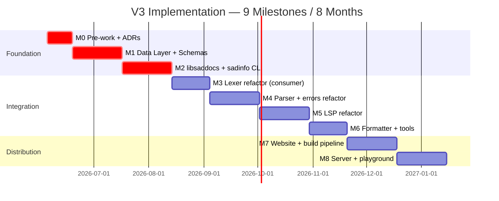

# 🛠️ خَطة تَنفيذ نظام التَوثيق V3

> هذه الخَطة تُحوِّل [STRATEGY.md](STRATEGY.md) + [ARCHITECTURE.md](ARCHITECTURE.md) إلى **مَهام قابلة للتَنفيذ** عبر 9 milestones (8 أشهر تَقريباً).

---

## 1. النَظرة الشاملة



| Milestone | المُدَّة | الأهداف الرئيسية |
|---|:---:|---|
| M0 | 2 أسابيع | اعتماد + ADRs + archive |
| M1 | 4 أسابيع | data/ + schema/ + 83 entity أوَّليّة |
| M2 | 4 أسابيع | libsaddocs + sadinfo CLI |
| M3 | 3 أسابيع | Lexer يَستهلك من docs |
| M4 | 4 أسابيع | Parser + errors يَستهلكان |
| M5 | 4 أسابيع | LSP يَستهلك |
| M6 | 3 أسابيع | Formatter + REPL + pkg |
| M7 | 4 أسابيع | Website مُولَّد من docs |
| M8 | 4 أسابيع | REST server + playground |

---

## 2. M0 — Pre-work (2 أسابيع)

### الأهداف

تَأسيس الحوكمة قبل أي كود.

### الستوريات

| ID | العنوان | Effort | DoD |
|---|---|:---:|---|
| **S-V3-M0-001** | اعتماد رَسمي من المالك لـ V3 | XS | تَوقيع مَكتوب + تَحديث STRATEGY.md status |
| **S-V3-M0-002** | كتابة 5 ADRs غير قابلة للتَفاوض | M | 5 ADRs مَنشورة في `_bmad-output/governance/.../decisions/` |
| **S-V3-M0-003** | كتابة `_INTEROP_ONTOLOGY.md` | M | ملف مَنشور + مُراجَع من 4 وكلاء |
| **S-V3-M0-004** | تَحديث حوكمة Layer 2 في PRD | S | PRD يَذكر طبقة Documentation |
| **S-V3-M0-005** | إعداد CI workflow `arch-test.py` | S | CI يَفشل عند خرق R-1..R-5 |

### 5 ADRs المُستهدَفة

| ID | العنوان | السبب |
|---|---|---|
| ADR-DOCS-V3-001 | Documentation as Layer 2 (above Shared) | ND-1 |
| ADR-DOCS-V3-002 | YAML as single SoT format | ND-2 |
| ADR-DOCS-V3-003 | C++ API singleton (DocsAPI) | ND-3 |
| ADR-DOCS-V3-004 | REST API as remote interface | ND-4 |
| ADR-DOCS-V3-005 | CI G8 — No hardcoded knowledge | ND-5 |

### مُخرَجات M0

- [ ] STRATEGY.md status: ACTIVE
- [ ] 5 ADRs مَنشورة
- [ ] `_INTEROP_ONTOLOGY.md` مَوجود
- [ ] CI workflow arch-test يَعمل
- [ ] Sprint 1 جاهز للبَدء

---

## 3. M1 — Data Layer + Schemas (4 أسابيع)

### الأهداف

إنشاء قاعدة البيانات الأوَّلية + Schemas + 83 entity (40 keyword + 21 builtin + 10 errors + 5 types + 5 ops + 2 directives).

### الستوريات

| ID | العنوان | Effort | DoD |
|---|---|:---:|---|
| **S-V3-M1-001** | بُنية `documentation/data/` + `schema/` | S | المُجلَّدات + CMakeLists.txt |
| **S-V3-M1-002** | كتابة entity.schema.json (base) | M | schema يَجتاز self-validation |
| **S-V3-M1-003** | schemas لـ keyword/builtin/operator/directive | M | 4 schemas مُختبَرة |
| **S-V3-M1-004** | schemas لـ error/type/grammar_rule | M | 3 schemas مُختبَرة |
| **S-V3-M1-005** | schemas لـ lesson/exercise/example | M | 3 schemas مُختبَرة |
| **S-V3-M1-006** | كتابة 40 keyword YAML (محجوزة) | L | 40 ملف + كل مثال يُختبَر |
| **S-V3-M1-007** | كتابة 21 builtin YAML | L | 21 ملف + أمثلة |
| **S-V3-M1-008** | كتابة 10 error YAML (lexer/parser) | M | 10 ملف بـ fix_suggestions |
| **S-V3-M1-009** | كتابة 5 type YAML (built-in types) | S | 5 ملف |
| **S-V3-M1-010** | كتابة 5 operator + 2 directive YAML | S | 7 ملف |
| **S-V3-M1-011** | CI workflow G11 (schema conformance) | S | كل YAML يُفحَص في PR |
| **S-V3-M1-012** | CI workflow G12 (example verification) | M | كل مثال يُختبَر |

### مُخرَجات M1

- [ ] 83 entity YAML
- [ ] 12 JSON Schema
- [ ] G11 + G12 يَعملان في CI
- [ ] `python scripts/count_entities.py` يَعرض 83

---

## 4. M2 — libsaddocs + sadinfo CLI (4 أسابيع)

### الأهداف

بناء المكتبة C++ والـ CLI الأوَّلي.

### الستوريات

| ID | العنوان | Effort | DoD |
|---|---|:---:|---|
| **S-V3-M2-001** | تَصميم `sad/docs/api.h` الكامل | M | header + doxygen comments |
| **S-V3-M2-002** | تَصميم `entity.h` + derived classes | M | 8 entity classes |
| **S-V3-M2-003** | تَنفيذ `Loader` (YAML → Entity) | M | unit tests 100% |
| **S-V3-M2-004** | تَنفيذ `Cache` (in-memory store) | M | unit tests + benchmarks |
| **S-V3-M2-005** | تَنفيذ `SchemaValidator` | S | unit tests |
| **S-V3-M2-006** | تَنفيذ `DocsAPI` (singleton) | M | unit tests + integration |
| **S-V3-M2-007** | تَنفيذ codegen scripts (token_types.h) | M | C++ يَستخدم generated header |
| **S-V3-M2-008** | تَنفيذ `Watcher` (filesystem watch) | M | hot reload يَعمل |
| **S-V3-M2-009** | بناء `sadinfo` CLI (10 أوامر) | L | كل أمر يَعمل + tests |
| **S-V3-M2-010** | benchmark suite (`api_bench.cpp`) | S | targets في ARCHITECTURE.md |

### مُخرَجات M2

- [ ] `libsaddocs.a` (~2MB)
- [ ] `sadinfo.exe` بـ 10 أوامر
- [ ] أداء: `getKeyword()` < 1µs
- [ ] أداء: cold start < 100ms
- [ ] coverage > 90%

---

## 5. M3 — Lexer Refactor (3 أسابيع)

### الأهداف

أول consumer حقيقي — Lexer يَستهلك من DocsAPI.

### الستوريات

| ID | العنوان | Effort | DoD |
|---|---|:---:|---|
| **S-V3-M3-001** | استبدال `lexer_keywords.cpp` لاستخدام DocsAPI | M | 80 سطر hardcoded → 10 سطر |
| **S-V3-M3-002** | تَوليد `KEYWORD_*` enum من YAML | S | `token_types.h` مُولَّد |
| **S-V3-M3-003** | اختبارات Lexer لا تَتراجع | M | 100% pass |
| **S-V3-M3-004** | integration test: lexer_consumes_docs | M | اختبار E2E |
| **S-V3-M3-005** | تَفعيل G8 lint للـ lexer | S | CI يَفشل عند hardcoded |
| **S-V3-M3-006** | benchmark: lexer قبل/بَعد | S | لا تَراجع > 5% |

### مُخرَجات M3

- [ ] Lexer 0 سطر hardcoded knowledge
- [ ] G8 يَعمل لـ `shared/lexer/`
- [ ] أداء lexer ≤ ما قبل + 5%
- [ ] إضافة كلمة جَديدة = ملف YAML واحد فقط

---

## 6. M4 — Parser + Errors Refactor (4 أسابيع)

### الستوريات

| ID | العنوان | Effort | DoD |
|---|---|:---:|---|
| **S-V3-M4-001** | كتابة 25 error YAML إضافية (parser) | L | 25 ملف بـ fix_suggestions |
| **S-V3-M4-002** | استبدال `shared/errors/messages.cpp` | M | 0 hardcoded messages |
| **S-V3-M4-003** | Parser يَستخدم DocsAPI.getError() | M | كل error يَأتي من YAML |
| **S-V3-M4-004** | إضافة grammar_rules لـ YAML | M | 10 grammar rules مُوثَّقة |
| **S-V3-M4-005** | integration test: parser_consumes_docs | M | اختبار E2E |
| **S-V3-M4-006** | تَفعيل G8 لـ parser + errors | S | CI passes |
| **S-V3-M4-007** | LSP يَستخدم نفس الرسائل | S | اتساق مَضمون |

### مُخرَجات M4

- [ ] Parser + Errors 0 سطر hardcoded
- [ ] 35 error مُوثَّق total
- [ ] كل خطأ له fix_suggestion
- [ ] G8 يَعمل لـ parser

---

## 7. M5 — LSP Refactor (4 أسابيع)

### الستوريات

| ID | العنوان | Effort | DoD |
|---|---|:---:|---|
| **S-V3-M5-001** | إضافة `lsp.hover_template_*` لـ YAML | M | كل keyword/builtin |
| **S-V3-M5-002** | إضافة `lsp.completion_snippet_*` | M | كل keyword |
| **S-V3-M5-003** | LSP HoverProvider يَستخدم DocsAPI | M | hover من YAML |
| **S-V3-M5-004** | LSP CompletionProvider يَستخدم DocsAPI | M | completion من YAML |
| **S-V3-M5-005** | LSP SignatureProvider يَستخدم DocsAPI | M | signatures من YAML |
| **S-V3-M5-006** | LSP DiagnosticsProvider يَستخدم errors | M | diagnostics مُوحَّدة |
| **S-V3-M5-007** | WebSocket subscription للـ hot reload | M | LSP يُحدِّث lazily |
| **S-V3-M5-008** | integration test: lsp_consumes_docs | M | اختبار E2E |
| **S-V3-M5-009** | تَفعيل G8 لـ LSP | S | CI passes |

### مُخرَجات M5

- [ ] LSP 0 سطر hardcoded
- [ ] hover + completion + signature من YAML
- [ ] Hot reload يَعمل (< 100ms latency)
- [ ] G8 يَعمل لـ LSP

---

## 8. M6 — Formatter + Tools (3 أسابيع)

### الستوريات

| ID | العنوان | Effort | DoD |
|---|---|:---:|---|
| **S-V3-M6-001** | إضافة `formatter.*` لـ keyword YAML | M | كل keyword له spacing/newline rules |
| **S-V3-M6-002** | استبدال `format_rules.cpp` | M | 0 hardcoded |
| **S-V3-M6-003** | Formatter يَستخدم DocsAPI.getFormatRules() | M | format يَأتي من YAML |
| **S-V3-M6-004** | REPL يَستخدم DocsAPI للـ help | S | `?دالة` يَعرض من YAML |
| **S-V3-M6-005** | pkg manager يَستخدم DocsAPI للـ stdlib | M | لا hardcoded stdlib list |
| **S-V3-M6-006** | integration tests للـ tools | M | 3 اختبارات E2E |
| **S-V3-M6-007** | تَفعيل G8 لكل الأدوات | S | CI passes |

### مُخرَجات M6

- [ ] كل tools/ خالٍ من hardcoded
- [ ] G8 يَعمل لكل المشروع
- [ ] إضافة قاعدة تَنسيق = تَعديل YAML فقط

---

## 9. M7 — Website + Build Pipeline (4 أسابيع)

### الستوريات

| ID | العنوان | Effort | DoD |
|---|---|:---:|---|
| **S-V3-M7-001** | إعداد VitePress في `website/` | M | site build يَعمل |
| **S-V3-M7-002** | `sadinfo dump --format=vitepress` | M | يُولِّد كل الصفحات |
| **S-V3-M7-003** | template صفحة keyword | M | عَرض كامل من YAML |
| **S-V3-M7-004** | template صفحة builtin/operator/directive | M | 3 templates |
| **S-V3-M7-005** | template صفحة error (مع fix_suggestion) | S | error pages |
| **S-V3-M7-006** | template صفحة lesson/exercise | M | 2 templates |
| **S-V3-M7-007** | sidebar مُولَّد من categories | S | navigation تلقائي |
| **S-V3-M7-008** | search index (Lunr/Algolia) | M | full-text search |
| **S-V3-M7-009** | CI workflow: build + deploy site | M | auto-deploy on merge |
| **S-V3-M7-010** | تَوقيع cosign للـ manifest | S | signed releases |

### مُخرَجات M7

- [ ] الموقع يَتَولَّد كاملاً من `documentation/`
- [ ] 0 صفحات يَدوية
- [ ] search يَعمل
- [ ] auto-deploy في CI

---

## 10. M8 — Server + Playground (4 أسابيع)

### الستوريات

| ID | العنوان | Effort | DoD |
|---|---|:---:|---|
| **S-V3-M8-001** | بناء REST API server (11 endpoints) | L | كل endpoint له test |
| **S-V3-M8-002** | بناء WebSocket server (4 events) | M | events تَعمل |
| **S-V3-M8-003** | Playground Docker image (sad + sadc) | M | image مُختبَر |
| **S-V3-M8-004** | Redis queue + rate limiting | M | 1000 req/min |
| **S-V3-M8-005** | seccomp + AppArmor للأمان | M | escape impossible |
| **S-V3-M8-006** | exercise submission tracking | M | progress DB |
| **S-V3-M8-007** | health/metrics endpoints | S | Prometheus متَكامل |
| **S-V3-M8-008** | إعداد السيرفر الخاص (nginx + systemd) | M | production ready |
| **S-V3-M8-009** | systemd timer pull manifest كل 5 دقائق | S | auto-update |
| **S-V3-M8-010** | backup إلى S3 (rclone yomi) | S | daily backup |

### مُخرَجات M8

- [ ] السيرفر الخاص يَعمل
- [ ] Playground متاح
- [ ] exercises قابلة للحل من الوكلاء
- [ ] real-time updates عبر WebSocket
- [ ] backup يومي
- [ ] monitoring + alerts

---

## 11. الستوريات حسب الأولوية الكلية

```mermaid
quadrantChart
    title الستوريات (أهمية × استعجال)
    x-axis منخفض --> عالٍ (urgency)
    y-axis منخفض --> عالٍ (importance)
    quadrant-1 جدولة
    quadrant-2 تَنفيذ فوري
    quadrant-3 إهمال
    quadrant-4 تَفويض
    "M0-001 اعتماد المالك": [0.95, 0.95]
    "M0-002 5 ADRs": [0.85, 0.9]
    "M1-006 40 keyword YAML": [0.8, 0.85]
    "M2-006 DocsAPI singleton": [0.7, 0.95]
    "M3-001 Lexer refactor": [0.6, 0.85]
    "M7-009 CI deploy": [0.4, 0.7]
    "M8-003 Playground": [0.3, 0.5]
```

---

## 12. تَوزيع الجهد الكلي

| Milestone | Story-points | % من المُجمل |
|---|:---:|:---:|
| M0 | 13 | 5% |
| M1 | 65 | 23% |
| M2 | 55 | 19% |
| M3 | 22 | 8% |
| M4 | 30 | 11% |
| M5 | 35 | 13% |
| M6 | 22 | 8% |
| M7 | 25 | 9% |
| M8 | 35 | 13% |
| **المُجمل** | **~282 SP** | **100%** |

(تَقدير: 1 SP ≈ يَوم عَمل لمُطوِّر واحد)

---

## 13. مَقاييس النَجاح الكلية

| المَقياس | M0 | M2 | M5 | M8 |
|---|:---:|:---:|:---:|:---:|
| # entities في docs | 0 | 83 | 200 | 510+ |
| # consumers مُتَكامِلين | 0 | 0 | 4 | 7+ |
| # hardcoded violations | N/A | N/A | < 5 | 0 |
| Test coverage | N/A | > 90% | > 95% | > 95% |
| Examples verified | 0 | 83 | 300 | 584+ |
| API latency | N/A | < 1µs | < 500ns | < 500ns |
| Deploy frequency | N/A | weekly | daily | on-demand |

---

## 14. المَخاطر التَنفيذية

| المخاطرة | احتمال | تأثير | تَخفيف |
|---|:---:|:---:|---|
| تَأخُّر اعتماد المالك | متوسط | عالٍ | تَواصل أسبوعي + تَوضيح القيمة |
| Lexer refactor يَكسر اختبارات | عالٍ | عالٍ | 100% test coverage قبل M3 |
| ضغط جدول M1 (65 SP في 4 أسابيع) | عالٍ | متوسط | فريق 2 مُطوِّرين + تَقسيم |
| yaml-cpp مشاكل بـ Arabic UTF-8 | متوسط | عالٍ | بَنشمارك في M2 + بَديل rapidyaml |
| API stability يُكسَر بَعد M3 | متوسط | عالٍ | freeze API بَعد M3 + semver |

---

## 15. شُروط القَبول الكُلية

نظام التَوثيق V3 يُعتبَر **مُكتمَلاً** عند:

- [ ] كل المُكوِّنات (lexer, parser, interpreter, compiler, vm, lsp, formatter, repl, pkg, website) تَستهلك من DocsAPI
- [ ] CI G1-G12 يَعمل في كل PR
- [ ] 0 hardcoded knowledge violations
- [ ] إضافة keyword جَديدة = ملف YAML واحد فقط (مُختبَر)
- [ ] الموقع مُولَّد 100% من YAML
- [ ] Playground يَعمل
- [ ] backup يومي + monitoring
- [ ] coverage > 95%
- [ ] أداء: lookup < 1µs
- [ ] كل مثال مُختبَر آلياً

---

## 16. سِجل التَغييرات

| التاريخ | الإصدار | التَغيير |
|---|---|---|
| 2026-06-04 | V3 | إنشاء جَذري بَعد قَرار "documentation كَطبقة هندسية" |

---

**انتهت خَطة V3 — تَنتظر اعتماد المالك.**
