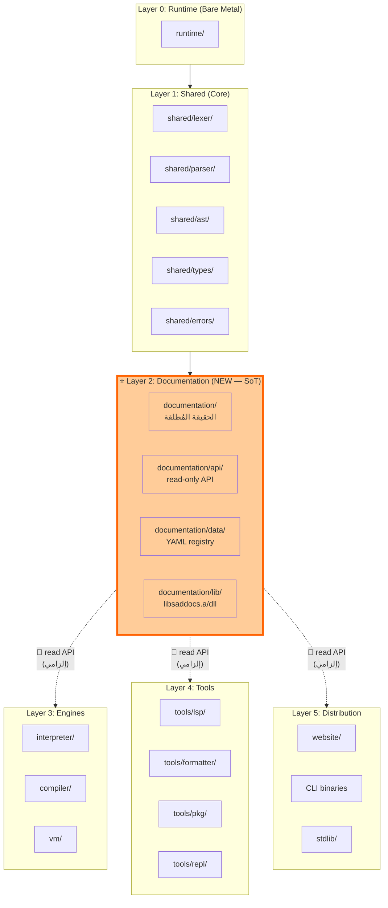
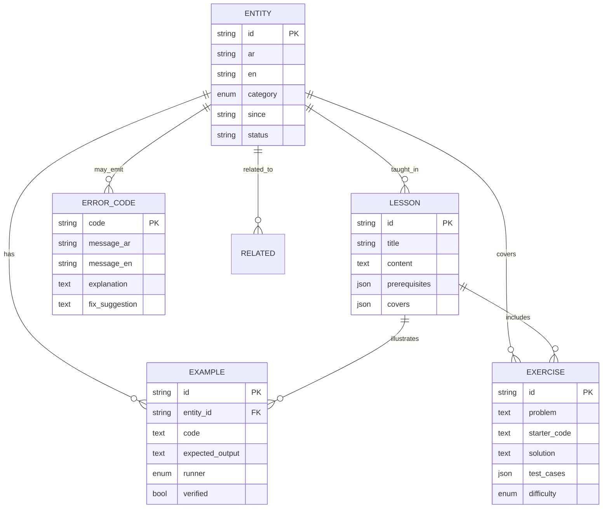
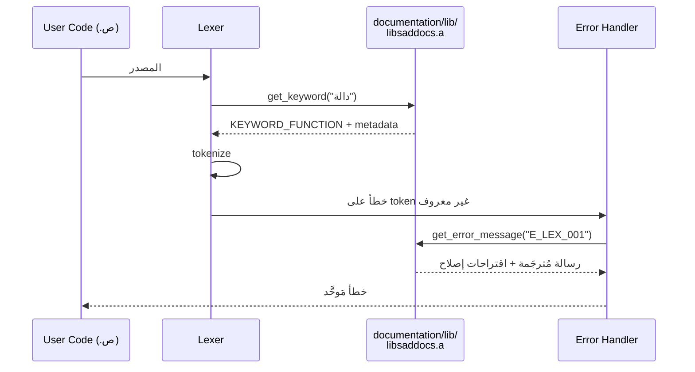
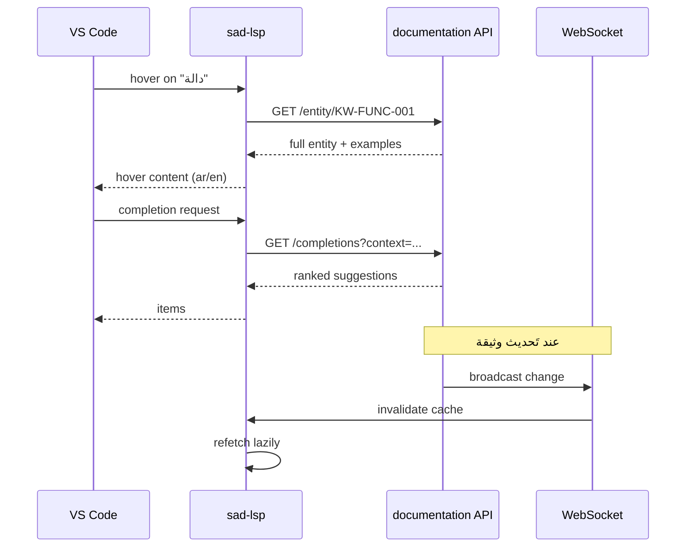
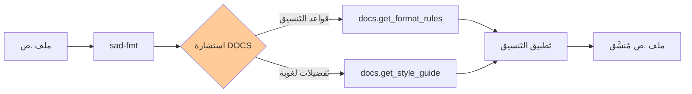
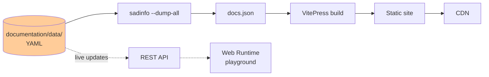
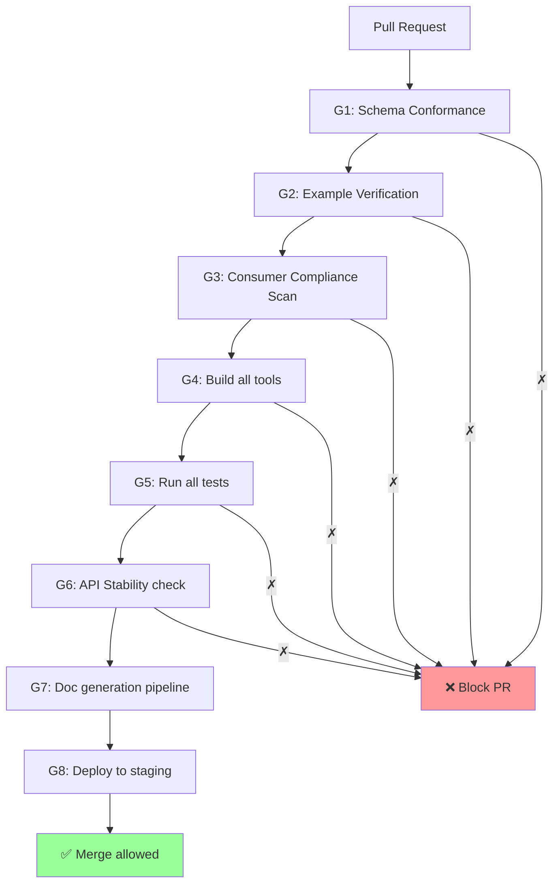
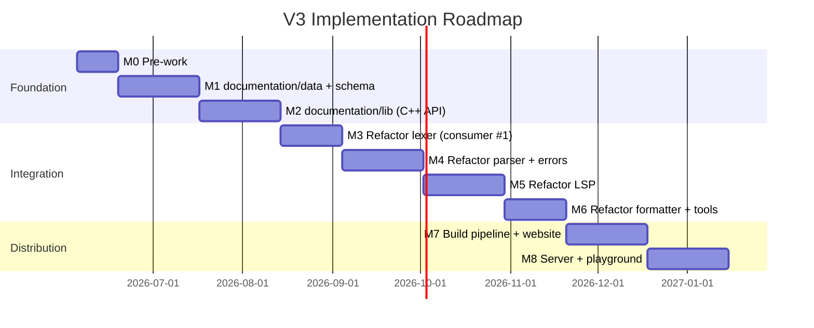
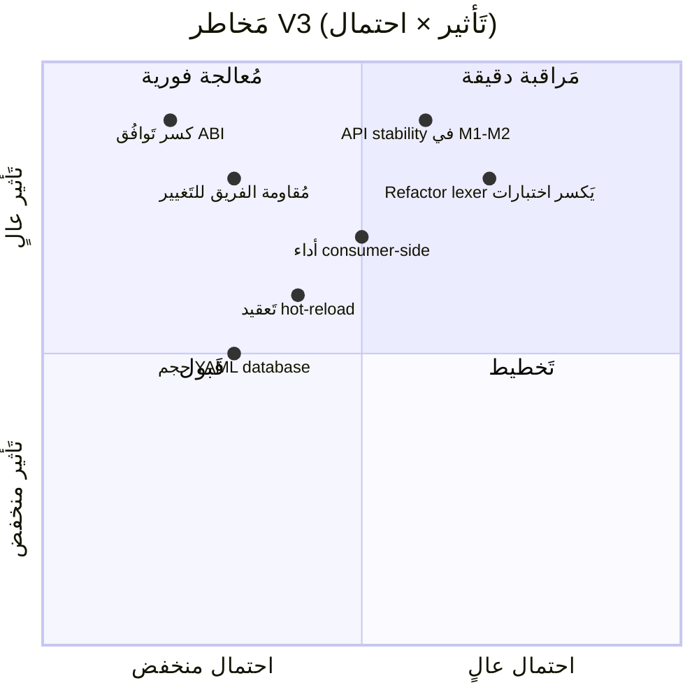

# 🎯 استراتيجية نظام التَوثيق V3 — الحقيقة المُطلقة

> **رؤية المالك (2026-06-04 — حرفياً):**
> "نظام التَوثيق هو الحقيقة الوحيدة المُطلقة. المشروع ضخم ولا يُمكن الاعتماد على التَوثيق البشري.
> طبقة التَوثيق يَجب أن تَكون طبقة مُستقلة تَكون فوق الطبقة المُشتركة بحيث كل مُكوِّنات الطبقة المُشتركة تَأخذ المعلومات من طبقة التَوثيق."

---

## 1. الفِكرة الجَوهرية — تَحوُّل جذري

### من النَموذج القديم إلى النَموذج الجديد

| البُعد | النَموذج القديم (V1/V2) | النَموذج الجَديد (V3) |
|---|---|---|
| **دور التَوثيق** | مَنتَج جانبي للكود | **مَصدر الحقيقة الذي يَتولَّد منه الكود** |
| **اتجاه التَدفُّق** | Code → Docs (يَدوي) | **Docs → Code** (آلي، استهلاكي) |
| **مَوقع التَوثيق** | مَلفات Markdown مَنفصلة | **طبقة هندسية فوق `shared/`** |
| **المُستهلِكون** | المُطوِّرون البشر فقط | **lsp، formatter، interpreter، compiler، tools، web** |
| **الإلزام** | اختياري — كل أداة تَكتفي بنفسها | **إلزامي — لا أداة تَحوي معرفة دون استشارة التَوثيق** |
| **التَكامل** | بَعد التَطوير (لاحقاً) | **قبل التَطوير (Docs-First Development)** |
| **التَحقُّق** | لا يوجد آلية تَحقُّق | **CI يَفشل إذا كانت أداة تَستخدم مَعرفة غير مُوثَّقة** |

### المعادلة الأساسية

```text
نظام التَوثيق ≠ مَلفات
نظام التَوثيق = طبقة هندسية + API + قاعدة بيانات + Quality Gates

كل مُكوِّن في المشروع:
   ➜ يَستهلك من نظام التَوثيق (read API)
   ➜ يَفشل في CI إذا لم يَستهلك (lint enforcement)
   ➜ لا يَحوي بيانات مَعرفية مَحلية (no hardcoded knowledge)
```

---

## 2. تَموقع طبقة التَوثيق في المعمارية

### مَخطَّط الطبقات الجَديد



### قاعدة الاعتمادية الجَديدة (Dependency Rule)

```text
Layer N يُمكنه أن يَعتمد على Layer (N-1) فقط (بَنية تَقليدية)
+
كل Layer ≥ 3 يَجب أن يَعتمد على Layer 2 (Documentation)
+
Layer 2 لا يَعتمد على ما فوقها — يَعتمد فقط على Layer 1 (lexer/types)
```

---

## 3. ما هو "نظام التَوثيق" بدِقَّة؟

### تَعريف رَسمي

```yaml
نظام_التَوثيق:
  ماهيته:
    - قاعدة بيانات YAML مَركزية (data/)
    - مكتبة C++ ثابتة (lib/libsaddocs.a)
    - REST API (داخلي + خارجي)
    - CLI: sadinfo
    - WebSocket للتَحديث المُباشر
  ليست:
    - مَلفات Markdown مُتفرِّقة
    - وثائق وصفية
    - تَعليقات في الكود
  يَحوي:
    - كل keyword (40 محجوزة + ~25 سياقية)
    - كل built-in function (~21)
    - كل operator (+, -, ==, ...)
    - كل error code (compiler/runtime)
    - كل directive (@حجم، @ذري، ...)
    - كل grammar rule
    - كل type (built-in + user-defined)
    - كل stdlib module/function
    - أمثلة مُختبَرة لكل entity
    - تَمارين لكل مَفهوم
    - دروس مُترابطة
```

### بُنية البيانات



---

## 4. كيف يَستهلك كل مُكوِّن من نظام التَوثيق؟

### 4.1 المُفسِّر والمُترجم (Interpreter & Compiler)



**القاعدة:** المُفسِّر لا يَحوي:
- قائمة كلمات مُفتاحية مَحلية → يَسأل `docs.get_keywords()`
- رسائل أخطاء مَحلية → يَسأل `docs.get_error("E_xxx")`
- قائمة built-ins → يَسأل `docs.get_builtins()`

### 4.2 LSP (Language Server Protocol)



**القاعدة:** LSP لا يَحوي:
- نصوص hover مَحلية → يَسأل `docs.get_hover(entity_id)`
- قواعد completion مَحلية → يَسأل `docs.get_completions(context)`
- signatures مَحلية → يَسأل `docs.get_signature(fn_id)`

### 4.3 المُنسِّق (Formatter)



**القاعدة:** المُنسِّق لا يَحوي:
- قواعد المسافات → `docs.get_format_rules("spacing")`
- قواعد ترتيب الكلمات → `docs.get_format_rules("ordering")`
- قواعد التَعليقات → `docs.get_format_rules("comments")`

### 4.4 الموقع (Website)



**القاعدة:** الموقع لا يَحوي:
- محتوى مَكتوب يَدوياً → كل صفحة تُولَّد من entity
- أمثلة مُكرَّرة → الأمثلة تَأتي من YAML المُختبَر
- تَمارين خاصة → التَمارين entities من نفس النظام

### 4.5 الأدوات الأخرى (Package Manager, REPL, sad-doc, sad-test)

نفس القاعدة: لا أداة تَحوي مَعرفة عن اللغة دون استشارة `documentation/`.

---

## 5. مُكوِّنات طبقة `documentation/`

### البنية الكاملة

```text
documentation/                                  ⭐ طبقة جَديدة
├── CMakeLists.txt
├── data/                                       (قاعدة البيانات — YAML)
│   ├── keywords/
│   │   ├── KW-FUNC-001.yaml                    # دالة
│   │   ├── KW-CLASS-001.yaml                   # صنف
│   │   └── ... (65 ملف)
│   ├── builtins/
│   │   ├── BI-PRINT-001.yaml                   # اطبع
│   │   ├── BI-LEN-001.yaml                     # طول
│   │   └── ... (~21 ملف)
│   ├── operators/
│   │   ├── OP-PLUS-001.yaml
│   │   └── ... (~15 ملف)
│   ├── directives/
│   │   ├── DR-SIZE-001.yaml                    # @حجم
│   │   └── ... (~10 ملفات)
│   ├── errors/
│   │   ├── lexer/E_LEX_001.yaml
│   │   ├── parser/E_PAR_001.yaml
│   │   └── runtime/E_RT_001.yaml
│   ├── types/
│   │   └── TY-INT-001.yaml                     # رقم
│   ├── grammar/
│   │   └── G_EXPR.yaml                         # قواعد نحوية
│   ├── stdlib/
│   │   └── STD_MATH.yaml
│   ├── lessons/                                # دروس (lessons)
│   │   ├── L-001-hello-world.yaml
│   │   └── ...
│   └── exercises/                              # تَمارين (exercises)
│       ├── EX-001-fibonacci.yaml
│       └── ...
├── schema/                                     (JSON Schema للتَحقُّق)
│   ├── entity.schema.json
│   ├── example.schema.json
│   ├── exercise.schema.json
│   └── lesson.schema.json
├── lib/                                        (مكتبة C++)
│   ├── include/
│   │   ├── sad/docs/api.h                      # public API
│   │   ├── sad/docs/entity.h
│   │   └── sad/docs/loader.h
│   └── src/
│       ├── api.cpp
│       ├── loader.cpp
│       ├── yaml_parser.cpp
│       └── cache.cpp
├── api/                                        (REST/GraphQL server)
│   ├── server.cpp
│   ├── routes/
│   └── websocket.cpp
├── cli/                                        (sadinfo tool)
│   └── main.cpp
├── tests/
│   ├── unit/
│   ├── integration/
│   └── consumer_compliance/                    # تَأكيد أن كل أداة تَستهلك
└── README.md
```

### واجهة C++ المُوحَّدة (Public API)

```cpp
// documentation/lib/include/sad/docs/api.h
namespace Sad::Docs {

class DocsAPI {
public:
    // Singleton — مَصدر وحيد للحقيقة في process
    static DocsAPI& instance();

    // === Keywords ===
    std::optional<KeywordEntity> getKeyword(std::string_view ar_name);
    std::vector<KeywordEntity> getAllKeywords();
    bool isReservedKeyword(std::string_view name);

    // === Built-ins ===
    std::optional<BuiltinEntity> getBuiltin(std::string_view ar_name);
    std::vector<BuiltinEntity> getAllBuiltins();

    // === Errors ===
    ErrorMessage getError(std::string_view code, Locale = Locale::AR);
    std::vector<std::string> getFixSuggestions(std::string_view code);

    // === Formatting rules ===
    FormatRules getFormatRules();
    StyleGuide getStyleGuide();

    // === Examples ===
    std::vector<Example> getExamples(std::string_view entity_id);

    // === Generic ===
    std::optional<Entity> getEntity(std::string_view id);
    std::vector<Entity> queryEntities(const Query& q);

    // === Hot reload ===
    void reloadFromDisk();
    void subscribeToChanges(std::function<void(EntityId)> cb);
};

} // namespace Sad::Docs
```

### نَموذج الاستخدام (في lexer مثلاً)

```cpp
// shared/lexer/src/lexer_keywords.cpp — قَبل V3
void KeywordTable::initialize() {
    table_["دالة"] = TokenType::KEYWORD_FUNCTION;
    table_["صنف"] = TokenType::KEYWORD_CLASS;
    // ... 38 سطراً يَدوياً
}

// shared/lexer/src/lexer_keywords.cpp — بَعد V3
#include "sad/docs/api.h"

void KeywordTable::initialize() {
    auto& docs = Sad::Docs::DocsAPI::instance();
    for (const auto& kw : docs.getAllKeywords()) {
        if (kw.is_reserved) {
            table_[kw.ar] = mapToTokenType(kw.id);
        }
    }
}
// النَتيجة: إضافة كلمة مُفتاحية جَديدة = إضافة ملف YAML واحد فقط
// لا تَعديل لـ lexer_keywords.cpp مَطلقاً
```

---

## 6. Quality Gates للنَموذج الجَديد

### G1-G7 (مَوروثة من V2) + G8-G12 (جَديدة)

| Gate | الفحص | كيف يُنفَّذ |
|---|---|---|
| **G8: Consumer Compliance** | لا أداة تَحوي knowledge مَحلية | `lint-no-hardcoded-knowledge.py` يَبحث عن hardcoded keywords/errors |
| **G9: Bidirectional Trace** | كل entity في docs مُستهلَك من ≥1 أداة | `trace-consumers.py` يَتَحقَّق |
| **G10: API Stability** | كسر API يُكتشَف قبل merge | semver check + binary compatibility |
| **G11: Schema Conformance** | كل YAML يُطابق schema | `ajv validate` أو `yamale` |
| **G12: Example Verification** | كل مثال يُختبَر | `sad` + `sadc` على .ص المُستخرَج |

### CI Workflow



---

## 7. خَطة التَنفيذ (Roadmap)

### المراحل (8 أشهر)



### مَهام كل مَرحلة

| Milestone | المُخرَجات الرئيسية | شُروط القَبول |
|---|---|---|
| **M0 Pre-work** | اعتماد V3، 5 ADRs، archive V1/V2 | المالك يُوقِّع |
| **M1 Data Layer** | YAML schemas + 65 keyword + 21 builtin | كل YAML يَجتاز G11 |
| **M2 Library** | libsaddocs.a + sadinfo CLI | unit tests 100% |
| **M3 Lexer Refactor** | lexer يَستهلك من docs | G8 يَنجح للـ lexer |
| **M4 Parser+Errors** | parser + error messages من docs | G8 يَنجح للـ parser |
| **M5 LSP** | sad-lsp يَستهلك من docs | hover/completion من docs |
| **M6 Tools** | formatter + repl + pkg | G8 يَنجح للكل |
| **M7 Web** | الموقع يَتَولَّد من docs | 100% pages من YAML |
| **M8 Playground** | server + docker + WS | end-to-end exercise |

---

## 8. القَرارات غير القابلة للتَفاوض (Non-Negotiable Decisions)

| # | القَرار | السبب |
|---|---|---|
| **ND-1** | طبقة `documentation/` تَأتي قبل كل Layer ≥ 3 | لا توجد مَعرفة خارج النظام |
| **ND-2** | YAML = صيغة وحيدة لـ source of truth | machine-readable + human-editable |
| **ND-3** | C++ API = الواجهة الوحيدة للقراءة في process | لا يَوجد parsing مُكرَّر |
| **ND-4** | REST API = الواجهة الوحيدة للقراءة عن بُعد | uniform interface |
| **ND-5** | CI يَفشل إذا أداة تَحوي knowledge مَحلية | enforce SoT |
| **ND-6** | كل entity يَحوي ≥1 مثال مُختبَر | لا توثيق نَظري |
| **ND-7** | كل error يَحوي fix_suggestion | تَجربة المُستخدِم |
| **ND-8** | hot-reload إلزامي (no restart) | تَجربة المُطوِّر |

---

## 9. القَرارات المُؤجَّلة (Deferred — لـ ADR لاحق)

| # | القَرار | لماذا مُؤجَّل |
|---|---|---|
| **DD-1** | اختيار YAML parser (yaml-cpp vs rapidyaml) | بَنشمارك في M1 |
| **DD-2** | GraphQL مع REST أم بدلاً منه | بَعد M7 بناءً على usage |
| **DD-3** | WebSocket vs SSE للـ live updates | بَعد M5 |
| **DD-4** | تَنسيق التَخزين الداخلي (LMDB vs SQLite vs in-memory) | بَعد قياس حجم البيانات |

---

## 10. مَقاييس النَجاح (Success Metrics)

| مَقياس | M1 | M3 | M5 | M8 |
|---|:---:|:---:|:---:|:---:|
| # entities في docs | 65 | 100 | 146 | 200+ |
| # consumers مُتَكامِلين | 0 | 2 (lex/par) | 4 (+lsp/fmt) | 7+ |
| # hardcoded knowledge violations | N/A | < 10 | < 5 | 0 |
| latency: `getKeyword()` | N/A | < 1ms | < 100µs | < 50µs |
| latency: `--dump-all` | < 2s | < 1s | < 500ms | < 200ms |
| # examples verified | 65 | 200 | 400 | 584+ |
| # exercises | 0 | 20 | 100 | 200+ |
| CI Quality Gates | 5 | 8 | 10 | 12 |

---

## 11. المَخاطر الرئيسية



### استراتيجيات التَخفيف

| المُخاطرة | استراتيجية |
|---|---|
| Refactor lexer يَكسر اختبارات | M3 لها 3 أسابيع + 100% test coverage قبل البدء |
| API stability | semver + binary compat tests من M2 |
| أداء consumer-side | benchmarks في M2، target < 100µs |
| تَعقيد hot-reload | البدء بـ cold reload في M2، hot في M8 |
| كسر ABI | freeze API بَعد M3 |

---

## 12. الستوريات الأولى (Sprint 1 المُقترَح)

| Story ID | العنوان | Effort |
|---|---|:---:|
| **S-V3-001** | اعتماد V3 + archive V1/V2 + تَوقيع المالك | XS |
| **S-V3-002** | إنشاء `_INTEROP_ONTOLOGY.md` لتَنظيم الأنظمة | M |
| **S-V3-003** | كتابة 5 ADRs (ND-1 إلى ND-5) | M |
| **S-V3-004** | تَصميم schema/entity.schema.json | S |
| **S-V3-005** | تَصميم schema/example.schema.json + exercise + lesson | S |
| **S-V3-006** | كتابة أول 10 entities (KW-FUNC، KW-CLASS، ...) | M |
| **S-V3-007** | إنشاء `documentation/lib/include/sad/docs/api.h` (interface فقط) | M |
| **S-V3-008** | كتابة `lint-no-hardcoded-knowledge.py` (G8 prototype) | S |

---

## 13. مَراجع

- [_archive/2026-06-04_reset/STRATEGY_V1.md](_archive/2026-06-04_reset/STRATEGY_V1.md) — مُؤرشَف
- [_archive/2026-06-04_reset/STRATEGY_V2_DRAFT.md](_archive/2026-06-04_reset/STRATEGY_V2_DRAFT.md) — مُؤرشَف
- [_archive/PARTY_MODE_CRITIQUE_2026-06-02.md](_archive/PARTY_MODE_CRITIQUE_2026-06-02.md) — مَصدر إجماع Round 2

---

## 14. سِجل التَغييرات

| التاريخ | الإصدار | الكاتب | التَغيير |
|---|---|---|---|
| 2026-06-04 | V3-DRAFT | مَلاحظة المالك + 4 وكلاء | إعادة بناء جَذرية — طبقة `documentation/` كَ SoT مُطلق |

---

**انتهت V3-DRAFT — تَنتظر اعتماد المالك.**
