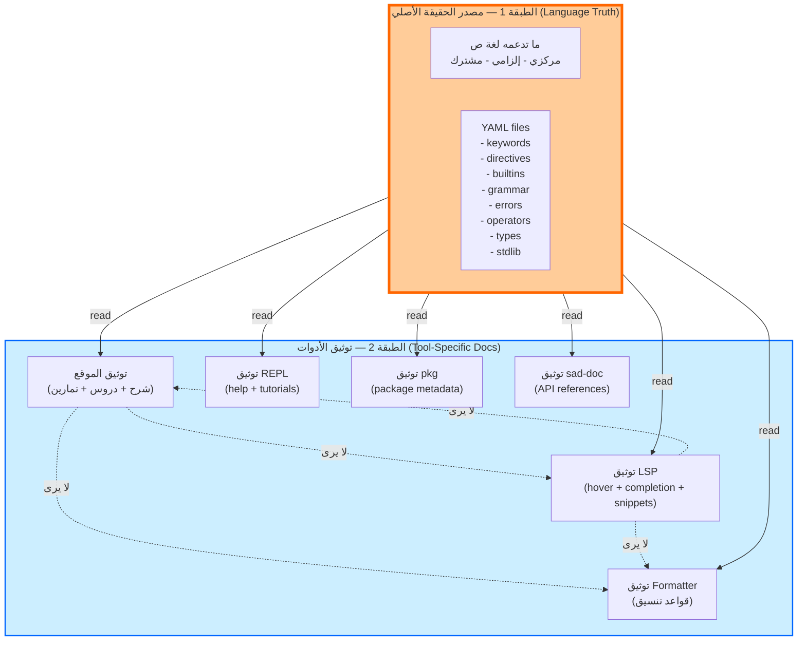
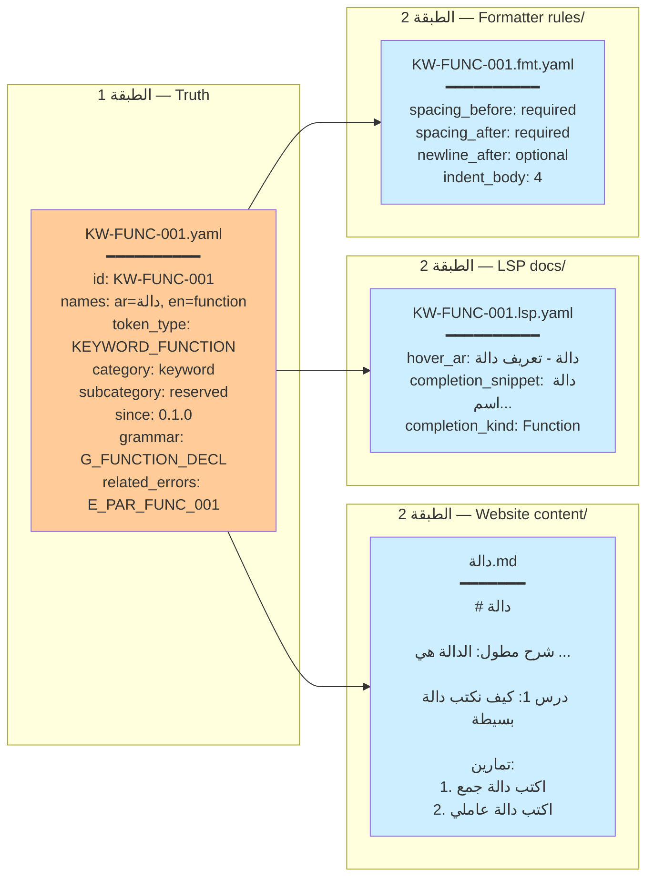
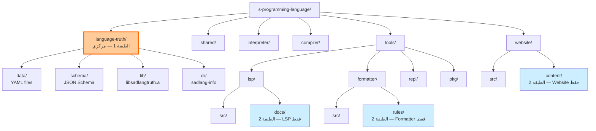
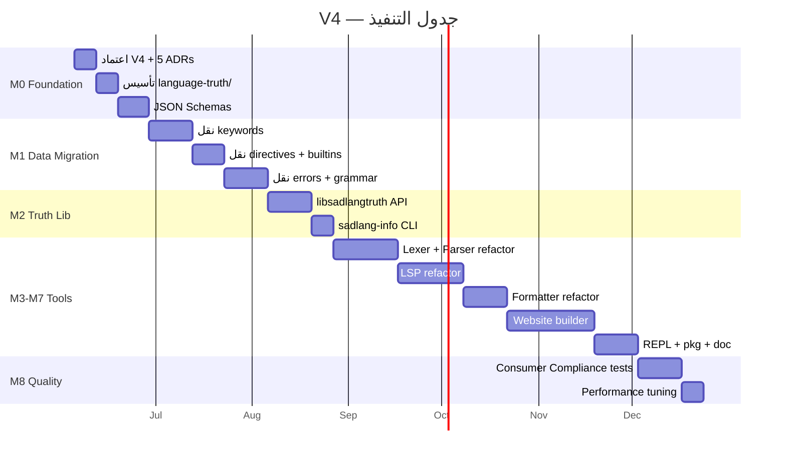

# نظام التَوثيق الصحيح — طبقتان مُستقلتان

> **رؤية المالك (2026-06-04 — حرفياً):**
>
> "المشكلة الحقيقية هي قسمان:
> - **القسم الأول:** توحيد مصدر الحقيقة الأصلي في التوثيق بحيث نحدد من هو المصدر الحقيقي للتوثيق.
> - **القسم الثاني:** التوثيق الخاص بكل أداة واللغة. بحيث يكون حل المشكلة الأولى بجعل ما تدعمه لغة ص هو الحقيقة المطلقة من خلال ملفات YAML.
>
> هذه الملفات تخبرنا ما تدعمه اللغة من:
> - الكلمات المفتاحية والتوجيهات وغيرها
> - الدوال المضمنة
> - قواعد اللغة
> - الأخطاء في اللغة
>
> ومن ثم كل أداة تحصل على هذا المصدر وتقوم بتطوير التوثيق واستخدامه وفق الأداة.
> مثال: الموقع يأخذ ملفات YAML ويضيف الشرح والدروس والتمارين بالاعتماد على ملفات YAML.
>
> المشكلة الثانية هي **توثيق داخلي لكل أداة** وهذا التوثيق يختلف من أداة الى أداة ولا يظهر لباقي الأدوات لأنهم لا يستخدمونه أبداً."

> **مبدأ المسؤولية (2026-06-04 — حرفياً):**
>
> "كل فريق أداة هو المسؤول أن يكون توثيقه صحيحاً ولسنا نحن. لذلك نحن مسؤولون عن **توثيق اللغة نفسها فقط**.
> وذلك من أجل فصل المسؤولية. نحن فقط نتأكد من أن التوثيق يطابق اللغة."

---

## 0. مبدأ فصل المسؤولية — مَن المسؤول عن ماذا؟

### الجدول الذهبي

| الجهة | المسؤولية | حدود السلطة |
|---|---|---|
| **فريق اللغة (نحن)** | توثيق **اللغة نفسها** فقط: keywords + directives + builtins + grammar + errors + operators + types + stdlib spec | لا نلمس توثيق أي أداة |
| **فريق الموقع** | توثيق الموقع: شرح، دروس، تمارين، مقالات، بلوغ | لا يطلب تعديل Truth إلا لو وُجد خطأ لغوي |
| **فريق LSP** | توثيق LSP: hover templates، completion snippets، signature help | لا يطلب حقول خاصة به في Truth |
| **فريق Formatter** | توثيق Formatter: قواعد spacing، indent، line breaks | لا يطلب حقول خاصة به في Truth |
| **فريق REPL** | توثيق REPL: help texts، interactive tutorials | لا يطلب حقول خاصة به في Truth |
| **فريق pkg** | توثيق pkg: metadata schema، publish guide | لا يطلب حقول خاصة به في Truth |
| **فريق sad-doc** | قوالب توليد API references | لا يطلب حقول خاصة به في Truth |

### ما هي مسؤوليتنا الفعلية (فريق اللغة)؟

```mermaid
flowchart TB
    subgraph US["فريق اللغة — مسؤوليتنا فقط"]
        direction TB
        R1["كتابة YAML للحقائق اللغوية"]
        R2["كتابة Schema يفرض الجودة"]
        R3["تطوير libsadlangtruth + CLI"]
        R4["اختبار: التوثيق يطابق اللغة"]
        R5["مراجعة طلبات إضافة كيانات جديدة"]
    end

    subgraph NOT_US["ليست مسؤوليتنا"]
        direction TB
        N1["شرح المبتدئ — مسؤولية الموقع"]
        N2["snippets الـ IDE — مسؤولية LSP"]
        N3["قواعد التنسيق — مسؤولية Formatter"]
        N4["دروس وتمارين — مسؤولية الموقع"]
        N5["help text — مسؤولية REPL"]
    end

    style US fill:#cfc,stroke:#080,stroke-width:3px
    style NOT_US fill:#fcc,stroke:#800,stroke-width:2px
```



### الاختبار الوحيد الذي نمتلكه على الأدوات

نحن لا نراجع جودة توثيق الأدوات، لكننا نضمن **شيئاً واحداً فقط**:

```python
# tests/consumer_compliance/test_tool_docs_consistency.py
def test_tool_docs_reference_existing_truth_entities():
    """
    كل ملف في الطبقة 2 يجب أن يشير لكيان موجود في Truth.
    لا نتحقق من المحتوى، نتحقق فقط من أن المرجع صحيح.
    """
    truth_ids = load_all_truth_ids()
    
    for tool_dir in ["website/content", "tools/lsp/docs", 
                     "tools/formatter/rules", "tools/repl/docs"]:
        for tool_file in glob(f"{tool_dir}/**/*.yaml"):
            doc = yaml.load(tool_file)
            extends_id = doc.get("extends", "").replace("language-truth://", "")
            assert extends_id in truth_ids, \
                f"{tool_file} يشير لكيان غير موجود: {extends_id}"
```

### لماذا هذا الفصل ضروري؟

| السبب | الشرح |
|---|---|
| **توسعية** | لا يمكن لـ 1-2 شخص في فريق اللغة مراجعة جودة 6 أدوات في 6 صيغ مختلفة |
| **خبرة فرعية** | فريق LSP يفهم احتياجات IDE أفضل منا. فريق الموقع يفهم التعلم أفضل منا |
| **سرعة** | كل فريق يطور توثيقه بسرعته بدون اعتماد على "اللجنة المركزية" |
| **عدم تضارب مصالح** | لا يمكن لـ "حارس البوابة" أن يكون "مُقيِّم الجودة" في نفس الوقت |
| **وضوح الملكية** | لو فشل توثيق LSP، نعرف من يصلحه (فريق LSP، ليس نحن) |

### ماذا نفعل لو رأينا توثيق أداة سيء؟

نرفع **issue** أو **PR** للفريق المسؤول، لا نعدّل بأنفسنا. مثال:

```text
[Issue] tools/lsp/docs/KW-FUNC-001.lsp.yaml
العنوان: completion snippet لا يحوي مثالاً بمعاملات
الطلب: تحسين الـ snippet
المسؤول: فريق LSP
```

---

## 1. الفكرة الجوهرية — طبقتان مستقلتان

### المخطط العام



### القاعدة الذهبية الجديدة

```text
الطبقة 1 (Language Truth):
  - مصدر واحد لما تدعمه اللغة
  - كل أداة ملزمة بقراءتها
  - مشترك بين كل الأدوات
  - تغييره = تغيير في اللغة نفسها

الطبقة 2 (Tool-Specific Docs):
  - توثيق محلي لكل أداة فقط
  - لا تراه الأدوات الأخرى
  - يستخدم الطبقة 1 كمدخل + يضيف ما يحتاج
  - تغييره = تغيير في الأداة فقط
```

---

## 2. التمييز الدقيق بين الطبقتين

### جدول المقارنة

| البُعد | الطبقة 1 (Language Truth) | الطبقة 2 (Tool Docs) |
|---|---|---|
| **ما تحويه** | ما تدعمه اللغة (keywords, errors, ...) | كيف تستخدمه كل أداة |
| **من يملكها** | فريق اللغة (مركزي) | فريق كل أداة |
| **من يستهلكها** | كل الأدوات | الأداة الخاصة بها فقط |
| **موقعها** | `language-truth/` | `<tool>/docs/` |
| **صيغتها** | YAML (موحد) | حر (Markdown / YAML / JSON ...) |
| **التحقق** | Schema + AI validation | فحوصات الأداة فقط |
| **التأثير عند التغيير** | كل الأدوات تتأثر | فقط الأداة المالكة |
| **هل يراها وكيل خارجي؟** | نعم — مركزي | لا — محلي |

### مثال توضيحي — كلمة `دالة`



**النتيجة:** كل أداة تأخذ نفس `KW-FUNC-001.yaml` لكنها تُضيف معلوماتها الخاصة في **ملف منفصل** داخل مجلد الأداة، لا في ملف YAML المركزي.

---

## 3. لماذا الفصل الحاد بين الطبقتين؟

### الأسباب

| # | السبب | الشرح |
|---|---|---|
| **1** | **عزل التغيير** | تعديل توثيق الموقع (شرح) لا يلمس LSP أو Formatter |
| **2** | **عزل الفرق** | فريق الموقع يحرر بدون لمس فريق LSP |
| **3** | **عزل الصيغة** | الموقع يستخدم Markdown، LSP يستخدم JSON snippets، لا توحيد قسري |
| **4** | **منع التلوث** | YAML المركزي يبقى نظيفاً، لا ينتفخ بتفاصيل أداة معينة |
| **5** | **مرونة الأدوات** | كل أداة تطور توثيقها كما تريد بدون تفاوض مركزي |
| **6** | **سهولة التدقيق** | اختبار "كل tool يستهلك Truth" بسيط؛ اختبار "توافق توثيق الأدوات" غير ضروري |

### مثال على الكارثة لو دمجناهما (كما في V3)

```yaml
# KW-FUNC-001.yaml (V3 — متخم)
id: KW-FUNC-001
names: {...}
token_type: KEYWORD_FUNCTION
description: {...}            # الموقع يحتاجه
examples: [...]               # الموقع + LSP يحتاجانه
lsp:                          # فقط LSP
  hover_template_ar: ...
  completion_snippet: ...
formatter:                    # فقط Formatter
  spacing_before: required
website:                      # فقط Website
  category_page: ...
  related_keywords: [...]
lessons:                      # فقط Website
  - L-001-functions-basics
exercises:                    # فقط Website
  - EX-FIBONACCI
```

**المشكلة:** كل أداة تنفخ الملف. كل تعديل في أداة = تعديل في مصدر الحقيقة. الفرق تتصادم.

### الحل الصحيح (V4)

```yaml
# language-truth/data/keywords/KW-FUNC-001.yaml
# نظيف، فقط الحقيقة
id: KW-FUNC-001
names: { ar: دالة, en: function }
token_type: KEYWORD_FUNCTION
category: keyword
subcategory: reserved
since: 0.1.0
grammar: G_FUNCTION_DECL
related_errors: [E_PAR_FUNC_001, E_PAR_FUNC_002]
```

```yaml
# website/content/keywords/KW-FUNC-001.web.yaml
# الموقع فقط
extends: language-truth://KW-FUNC-001
description_ar: |
  الدالة هي قطعة كود قابلة لإعادة الاستخدام...
  (شرح مطول بـ 500 كلمة)
lessons:
  - L-001-functions-basics
exercises:
  - EX-FIBONACCI
  - EX-FACTORIAL
examples_detailed: [...]
```

```yaml
# tools/lsp/docs/KW-FUNC-001.lsp.yaml
# LSP فقط
extends: language-truth://KW-FUNC-001
hover_template_ar: "**{{name_ar}}** - {{short_desc}}"
completion_snippet_ar: "دالة ${1:اسم}(${2:معاملات})\n    $0\nنهاية"
completion_kind: Function
```

```yaml
# tools/formatter/rules/KW-FUNC-001.fmt.yaml
# Formatter فقط
extends: language-truth://KW-FUNC-001
spacing_before: required
spacing_after: required
newline_after_block: optional
indent_body: 4
```

---

## 4. بنية الملفات المقترحة

### بنية الجذر



### الطبقة 1 — `language-truth/`

```text
language-truth/                       # مركزي - مصدر الحقيقة
├── CMakeLists.txt
├── README.md
├── data/                             # YAML registry فقط للحقائق
│   ├── keywords/                     # 40 محجوزة + 25 سياقية
│   │   ├── KW-FUNC-001.yaml
│   │   ├── KW-CLASS-001.yaml
│   │   └── ...
│   ├── directives/                   # @حجم، @ذري، ...
│   │   ├── DR-SIZE-001.yaml
│   │   └── ...
│   ├── builtins/                     # اطبع، طول، رقم، ...
│   │   ├── BI-PRINT-001.yaml
│   │   └── ...
│   ├── operators/                    # +، -، ==، ...
│   │   ├── OP-PLUS-001.yaml
│   │   └── ...
│   ├── grammar/                      # قواعد نحوية
│   │   ├── G_EXPR.yaml
│   │   ├── G_STATEMENT.yaml
│   │   └── ...
│   ├── errors/                       # رسائل أخطاء
│   │   ├── lexer/E_LEX_*.yaml
│   │   ├── parser/E_PAR_*.yaml
│   │   └── runtime/E_RT_*.yaml
│   ├── types/                        # رقم، نص، ...
│   │   └── TY-INT-001.yaml
│   └── stdlib/                       # ما تدعمه stdlib
│       └── STD_MATH.yaml
├── schema/                           # JSON Schemas للتحقق
│   ├── keyword.schema.json
│   ├── directive.schema.json
│   ├── builtin.schema.json
│   ├── operator.schema.json
│   ├── grammar.schema.json
│   ├── error.schema.json
│   ├── type.schema.json
│   └── stdlib.schema.json
├── lib/                              # المكتبة المركزية
│   ├── include/sad/langtruth/
│   │   ├── api.h                     # واجهة C++
│   │   ├── entity.h                  # أنواع الكيانات
│   │   └── loader.h
│   └── src/
│       ├── api.cpp
│       ├── loader.cpp
│       ├── cache.cpp
│       └── watcher.cpp               # hot-reload في dev
├── cli/                              # أداة استكشاف
│   └── sadlang-info.cpp              # sadlang-info list keywords
├── tests/                            # اختبارات السلامة
│   ├── schema_validation/
│   ├── unit/
│   └── consumer_compliance/          # كل أداة تستهلك بشكل صحيح
└── scripts/
    ├── codegen.py                    # توليد C++ بطئ من YAML
    └── validate_all.py
```

### الطبقة 2 — توثيق الأدوات

#### موقع الويب — `website/`

```text
website/
├── src/                              # كود الموقع (Vue/Next.js)
├── content/                          # توثيق الموقع فقط
│   ├── keywords/                     # شرح موسع لكل keyword
│   │   ├── KW-FUNC-001.web.md
│   │   │   # extends: language-truth://KW-FUNC-001
│   │   │   # شرح + أمثلة طويلة + شرح ثقافي
│   │   └── ...
│   ├── lessons/                      # دروس تعليمية متدرجة
│   │   ├── L-001-getting-started.md
│   │   ├── L-002-variables.md
│   │   ├── L-003-functions.md
│   │   └── ...
│   ├── exercises/                    # تمارين مع حلول
│   │   ├── EX-FIBONACCI.md
│   │   ├── EX-FACTORIAL.md
│   │   └── ...
│   ├── tutorials/                    # دورات كاملة
│   │   ├── beginner/
│   │   ├── intermediate/
│   │   └── advanced/
│   └── blog/                         # مقالات
├── scripts/
│   ├── build-from-truth.py           # يدمج Truth + web content
│   └── deploy.py
└── package.json
```

#### LSP — `tools/lsp/`

```text
tools/lsp/
├── src/                              # كود LSP
│   ├── server.cpp
│   ├── hover_provider.cpp
│   ├── completion_provider.cpp
│   └── ...
├── docs/                             # توثيق LSP فقط
│   ├── hover/
│   │   ├── KW-FUNC-001.lsp.yaml      # extends Truth + قوالب hover
│   │   └── ...
│   ├── completion/
│   │   ├── KW-FUNC-001.snippet.yaml  # snippets خاصة
│   │   └── ...
│   ├── signature_help/
│   │   ├── BI-PRINT-001.sig.yaml
│   │   └── ...
│   └── code_actions/
│       └── ...
└── tests/
```

#### Formatter — `tools/formatter/`

```text
tools/formatter/
├── src/
│   ├── formatter.cpp
│   └── ...
├── rules/                            # توثيق Formatter فقط
│   ├── keywords/
│   │   ├── KW-FUNC-001.fmt.yaml      # قواعد spacing/indent
│   │   └── ...
│   ├── operators/
│   │   ├── OP-PLUS-001.fmt.yaml
│   │   └── ...
│   └── general.fmt.yaml              # قواعد عامة
└── tests/
```

#### REPL — `tools/repl/`

```text
tools/repl/
├── src/
├── docs/                             # help text + tutorials
│   ├── help/
│   │   ├── functions.repl.md
│   │   ├── classes.repl.md
│   │   └── ...
│   └── interactive_tutorials/
└── tests/
```

#### pkg — `tools/pkg/`

```text
tools/pkg/
├── src/
├── docs/                             # توثيق المدير
│   ├── package_metadata_schema.yaml
│   ├── publish_guide.md
│   └── ...
└── tests/
```

#### sad-doc — `tools/doc/`

```text
tools/doc/                            # مولد API references
├── src/
│   ├── doc_generator.cpp
│   └── ...
├── templates/                        # قوالب التوليد
│   ├── module_template.md
│   ├── class_template.md
│   └── ...
└── tests/
```

---

## 5. كيف تتفاعل الأدوات مع الطبقتين؟

### تدفق البيانات الكامل

```mermaid
sequenceDiagram
    autonumber
    participant DEV as المطور
    participant TR as Truth YAML<br/>(language-truth/data/)
    participant LIB as libsadlangtruth
    participant LEX as Lexer
    participant PAR as Parser
    participant LSP as LSP Server
    participant WEB as Website Builder
    participant FMT as Formatter

    DEV->>TR: يكتب KW-FUNC-001.yaml
    Note over TR: مصدر الحقيقة الوحيد

    LIB->>TR: قراءة وحدة عند البدء
    LIB->>LIB: تحميل في الذاكرة + index

    LEX->>LIB: getKeyword("دالة")
    LIB-->>LEX: KW-FUNC-001 entity
    LEX->>LEX: token = KEYWORD_FUNCTION

    PAR->>LIB: getError("E_PAR_FUNC_001")
    LIB-->>PAR: error spec
    PAR->>DEV: رسالة خطأ من Truth

    LSP->>LIB: getKeyword("دالة")
    LSP->>LSP: قراءة tools/lsp/docs/<br/>KW-FUNC-001.lsp.yaml
    Note over LSP: دمج Truth + LSP docs
    LSP-->>DEV: hover tooltip

    WEB->>LIB: getAllKeywords()
    WEB->>WEB: قراءة website/content/<br/>keywords/*.web.md
    Note over WEB: دمج Truth + Web content
    WEB-->>DEV: صفحة keyword كاملة

    FMT->>LIB: getKeyword("دالة")
    FMT->>FMT: قراءة tools/formatter/<br/>rules/KW-FUNC-001.fmt.yaml
    Note over FMT: دمج Truth + Format rules
    FMT-->>DEV: كود منسق
```

### قاعدة الدمج الصحيحة

كل أداة تدمج بنفس النمط:

```cpp
// مثال — Website Builder
TruthEntity truth = sad::langtruth::getKeyword("دالة");

// قراءة الملف الخاص بالموقع
WebContent web = loadFromYaml("website/content/keywords/" + truth.id + ".web.md");

// دمج
WebPageData page;
page.id = truth.id;
page.name_ar = truth.names.ar;          // من Truth
page.name_en = truth.names.en;          // من Truth
page.token_type = truth.token_type;     // من Truth
page.description = web.description_ar;  // من Web
page.lessons = web.lessons;             // من Web
page.exercises = web.exercises;         // من Web

renderPage(page);
```

---

## 6. أسئلة وأجوبة (FAQ)

### س1: ماذا لو احتاج LSP حقلاً جديداً في Truth؟

**ج:** هذا تغيير في **اللغة نفسها** (أي معلومة يحتاجها LSP أيضاً قد يحتاجها Compiler). تتم المناقشة في فريق اللغة، يُضاف لـ Schema، يُولد عبر codegen، ثم LSP يستهلكه.

**مثال:** إضافة `is_async` لكل keyword — هذا حقيقة لغوية، يدخل Truth.

**ضد المثال:** إضافة `lsp_icon_url` — هذا تفصيل LSP، يبقى في `tools/lsp/docs/`.

### س2: كيف نمنع تكرار البيانات بين الطبقتين؟

**ج:** الملف في الطبقة 2 يستخدم `extends: language-truth://KW-FUNC-001` ولا يكرر حقول Truth. يضيف **فقط** ما لا يوجد في Truth.

### س3: ماذا لو اختلف توثيق LSP عن توثيق الموقع؟

**ج:** هذا متوقع وصحيح! كل أداة تشرح بأسلوبها:
- الموقع: شرح طويل للمبتدئ.
- LSP: تلميح قصير في الـ hover.
- REPL: مَثل سريع.

كلهم يشتركون في **الحقائق** (الاسم، النوع، الجريما) من Truth، لكن **التقديم** يختلف.

### س4: كيف نضمن أن الأدوات تستهلك Truth ولا تكرر؟

**ج:** اختبار **Consumer Compliance**:

```python
# tests/consumer_compliance/test_no_duplicate_facts.py
def test_lsp_does_not_duplicate_truth_facts():
    truth_keywords = load_truth_keywords()
    lsp_docs = load_lsp_docs()
    
    for lsp_doc in lsp_docs:
        truth = truth_keywords[lsp_doc.id]
        # LSP يجب ألا يحدد token_type لأنه في Truth
        assert "token_type" not in lsp_doc.fields, \
            f"LSP {lsp_doc.id} يكرر token_type من Truth"
```

### س5: من يكتب اختبارات Truth؟

**ج:** فريق اللغة. اختبارات بسيطة:
- كل YAML يطابق Schema.
- كل error له `fix_suggestion`.
- كل keyword له `since` و`grammar`.
- كل entity فريد الـ ID.

### س6: من يكتب اختبارات أدوات الطبقة 2؟

**ج:** فريق الأداة. اختبارات خاصة بها:
- LSP: كل keyword له completion snippet.
- Website: كل keyword له صفحة شرح.
- Formatter: كل keyword له قاعدة spacing.

### س7: ماذا عن stories سابقة (V1/V2/V3)؟

**ج:** كلها في `_archive/2026-06-04_v3_to_v4_pivot/` للرجوع. V4 يبدأ من جديد بـ:
- M0: تأسيس `language-truth/` + Schema + 5 ADRs
- M1: نقل البيانات الموجودة (شرح + LSP + Formatter) إلى الطبقة الصحيحة
- M2: تطوير libsadlangtruth + sadlang-info
- M3+: تفعيل الأدوات (Lexer → Parser → LSP → Formatter → Website)

---

## 7. القرارات غير القابلة للتفاوض (ND)

| # | القرار | السبب |
|---|---|---|
| **ND-V4-1** | الطبقتان مفصولتان فيزيائياً (مجلدات مختلفة) | يضمن عزل التأثير |
| **ND-V4-2** | YAML المركزي لا يحوي تفاصيل أداة معينة | يمنع التخمة |
| **ND-V4-3** | الطبقة 2 تستخدم `extends:` لتجنب التكرار | يضمن SoT |
| **ND-V4-4** | كل أداة لها مجلد docs/ خاص بها | يضمن الاستقلال |
| **ND-V4-5** | لا تواصل بين أدوات الطبقة 2 (LSP لا يقرأ Website) | يضمن العزل |
| **ND-V4-6** | اختبار Consumer Compliance إلزامي | يمنع تكرار الحقائق |
| **ND-V4-7** | Schema JSON يفرض هيكل Truth | يمنع الملفات الفوضوية |
| **ND-V4-8** | الكود ممنوع من hardcode أي حقيقة في Truth | الحقيقة من YAML فقط |
| **ND-V4-9** | فريق اللغة لا يكتب أو يراجع توثيق الأدوات | فصل المسؤولية + توسعية |
| **ND-V4-10** | كل فريق أداة يملك جودة توثيقه بالكامل | لا حارس مركزي |
| **ND-V4-11** | اختبارنا الوحيد على الأدوات: مرجع Truth صحيح | لا نقيس المحتوى، فقط الاتساق |

---

## 8. الجدول الزمني المختصر



---

## 9. مقاييس النجاح

| المقياس | الهدف M8 |
|---|---|
| كيانات Truth | 510+ entity (keywords + directives + builtins + errors) |
| أدوات تستهلك Truth | 7+ (Lexer, Parser, Interpreter, Compiler, LSP, Formatter, Website) |
| اختبار "صفر hardcode" | 100% |
| اختبار "صفر تكرار حقائق" | 100% |
| سرعة قراءة Truth | < 1µs لكل lookup |
| حجم libsadlangtruth | < 5 MB |
| توثيق الموقع | كل entity له صفحة + شرح + 3+ أمثلة |
| دروس الموقع | 50+ درس متدرج |
| تمارين الموقع | 200+ تمرين مع حلول |

---

## 10. أول 5 ستوريات (M0)

| ID | العنوان | SP |
|---|---|:---:|
| S-V4-M0-001 | اعتماد V4 رسمياً + توقيع المالك | 1 |
| S-V4-M0-002 | كتابة 5 ADRs (ND-V4-1 إلى ND-V4-5) | 5 |
| S-V4-M0-003 | إنشاء بنية `language-truth/` الملفات الأساسية | 3 |
| S-V4-M0-004 | كتابة JSON Schemas الأساسية (8 schemas) | 8 |
| S-V4-M0-005 | كتابة README لـ language-truth/ + كل أداة | 3 |

**إجمالي M0:** 20 SP

---

## 11. سجل التغيير

| التاريخ | الإصدار | الوصف |
|---|---|---|
| 2026-06-04 | V4-DRAFT | إنشاء V4 بعد ملاحظة المالك حول "قسمين منفصلين" — أرشفة V3 |
| 2026-06-04 | V4-DRAFT.1 | إضافة قسم 0 (مبدأ فصل المسؤولية) + ND-V4-9,10,11 — كل فريق أداة مسؤول عن توثيقه |

---

**انتهت استراتيجية V4 — تنتظر اعتماد المالك.**
