# Sprint Plan: sadinfo v2

> **Total:** 24 stories + 1 prereq | **Sprints:** 8 (+ Sprint 0 foundation)
> **YAML Contracts:** [DATA_SCHEMA_CONTRACTS.md](DATA_SCHEMA_CONTRACTS.md) (يجب على كل مطوّر قراءته قبل Sprint 7)

---

## Dependency Graph

```mermaid
graph LR
    P1[P1 sad --report-calls]:::prereq
    S000a[S-000a Foundations]:::sprint0

    S001[S-001 Loader POC]:::s1
    S002[S-002 Tier 1]:::s1
    S003[S-003 Tier 2]:::s1

    S007[S-007 State+Lock]:::s2
    S004[S-004 Hash Store]:::s2
    S005[S-005 Aggregator]:::s2
    S006[S-006 RAM Cache]:::s2

    S008[S-008 SQLite]:::s3

    S009[S-009 Reader API]:::s4
    S009b[S-009b Security]:::s4

    S010[S-010 CLI validate]:::s5
    S011[S-011 Watcher]:::s5
    S011b[S-011b macOS]:::s5

    S012[S-012 CLI query]:::s6
    S013[S-013 Tier 3]:::s6
    S014[S-014 Stats]:::s6
    S014b[S-014b CI/CD]:::s6

    S015a[S-015a Builtins]:::s7
    S015b[S-015b Keywords]:::s7
    S015c[S-015c Errors]:::s7
    S015d[S-015d Lessons→YAML]:::s8
    S015e[S-015e MD Generator]:::s8
    S016[S-016 Cleanup+MDuntrack]:::s8

    S000a --> S001
    S001 --> S002 --> S003
    S003 --> S007 --> S005
    S004 --> S005 --> S006
    S007 --> S008
    S008 --> S009 --> S009b
    S009 --> S010
    S009 --> S011 --> S011b
    S009 --> S012
    S009 --> S013
    S009 --> S014 --> S014b
    P1 --> S013
    S009b --> S013
    S010 --> S015a --> S015b --> S015c --> S015d
    S014b --> S015a
    S015d --> S015e --> S016

    %% Note: S-015a critical path = max(S010_done, S014b_done). S-014b is the hard gate — CI must validate migrations.

    classDef prereq fill:#fce4ec,stroke:#c2185b
    classDef sprint0 fill:#fff9c4,stroke:#f9a825
    classDef s1 fill:#e3f2fd,stroke:#1976d2
    classDef s2 fill:#e8f5e9,stroke:#388e3c
    classDef s3 fill:#fff3e0,stroke:#f57c00
    classDef s4 fill:#f3e5f5,stroke:#7b1fa2
    classDef s5 fill:#e0f2f1,stroke:#00796b
    classDef s6 fill:#ede7f6,stroke:#512da8
    classDef s7 fill:#fbe9e7,stroke:#d84315
    classDef s8 fill:#eceff1,stroke:#455a64
```



---

## Sprint Sequence

### Sprint 0 — Foundations (يمكن للمطوِّر الواحد)
| ID | Story | Effort | Parallel? | Status |
|----|-------|--------|-----------|--------|
| S-000a | Foundation Schemas + Logger | L | — | ✅ Done (2025-12-15) |

**Goal:** كل schemas + i18n_policy + logging foundation + baseline.json جاهزة.

---

### Sprint 1 — POC Pipeline
| ID | Story | Effort | Parallel? | Status |
|----|-------|--------|-----------|--------|
| S-001 | Loader POC | M | — | ✅ Done (2025-12-15, CR-1+CR-2+CR-3) |
| S-002 | Tier 1 Syntactic | M | ✓ مع S-003 (بعد S-001) | ✅ |
| S-003 | Tier 1 Validator (Inline) | M | ✓ | ✅ Done (2025-12-15, Amelia + BF-04 fix) |

**Goal:** ملف YAML واحد يُحمَّل ويُتحقَّق منه.

---

### Sprint 2 — State + Aggregation
| ID | Story | Effort | Parallel? | Status |
|----|-------|--------|-----------|--------|
| S-007 | State + Lock | M | — (يجب أولاً) | ⏳ |
| S-004 | Hash Store | M | ✓ مع S-007 | ✅ Done (2025-12-15, Amelia — 7/7 ctest) |
| S-005 | Aggregator + Merkle | L | بعد S-007 | ⏳ |
| S-006 | RAM Cache | M | بعد S-005 | ⏳ |

**Goal:** المُجمِّع يكتب `_state.json` تحت قفل + Merkle tree جاهز.

---

### Sprint 3 — Persistent Graph
| ID | Story | Effort | Parallel? |
|----|-------|--------|-----------|
| S-008 | SQLite Graph + WAL | L | — |

**Goal:** Graph queries < 10ms مع WAL + cycle protection.

---

### Sprint 4 — API + Security (مزدوج)
| ID | Story | Effort | Parallel? |
|----|-------|--------|-----------|
| S-009 | Reader API | M | — |
| S-009b | **Security Hardening** | M | بعد S-009 (نفس Sprint) |

**Goal:** Reader API علني + كل query/load يمرّ عبر security validators.

---

### Sprint 5 — CLI + Watcher
| ID | Story | Effort | Parallel? |
|----|-------|--------|-----------|
| S-010 | CLI validate/rebuild | M | ✓ |
| S-011 | Watcher (Win+Linux) | M | ✓ |
| S-011b | Watcher macOS | M | بعد S-011 (يمكن sprint تالٍ) |

**Goal:** Hot reload + CLI كامل (3 منصات).

---

### Sprint 6 — Polish + CI
| ID | Story | Effort | Parallel? |
|----|-------|--------|-----------|
| S-012 | CLI query | S | ✓ |
| S-014 | Stats + Exit Codes | S | ✓ |
| S-013 | Tier 3 + Snapshots | L | يحتاج P1 |
| S-014b | **CI/CD Pipeline** | M | بعد S-014 |

**Goal:** CI Green + perf gate 10% + جميع commands جاهزة.

---

### Sprint 7 — Migration Core
| ID | Story | Effort | Parallel? |
|----|-------|--------|-----------|
| S-015a | Migrate Builtins | L | — |
| S-015b | Migrate Keywords | L | بعد S-015a |
| S-015c | Migrate Errors | M | بعد S-015b |

**Goal:** 15 builtin + 43 keyword + 100 error code مُرحَّلة وموازية.

---

### Sprint 8 — Lessons + Generator + Cleanup
| ID | Story | Effort | Parallel? |
|----|-------|--------|-----------|
| S-015d | Migrate Lessons (MD→YAML SSoT) | XL | — |
| S-015e | MD Generator (YAML→MD) | M | بعد S-015d |
| S-016 | Legacy Removal + MD untrack | M | بعد S-015e |

**Goal:** YAML تصبح SSoT الوحيد → docs/ و وثائق/ تُولّد + Tag `v2.0` + حذف v1.

---

## Critical Path

```
S-000a → S-001 → S-003 → S-007 → S-005 → S-008 → S-009 → S-009b → S-013 → S-015a → S-015d → S-015e → S-016
```

**Critical bottleneck:** S-005 (Aggregator) + S-015d (Lessons migration).

## Risk Hotspots

| Sprint | Risk | Mitigation |
|--------|------|-----------|
| 2 | S-005 + S-007 ordering wrong → cycle | تأكد S-007 أولاً في Sprint 2 |
| 4 | Security bypass دون S-009b → CVE | لا تُطلق Reader علني قبل S-009b |
| 6 | Tier 3 يعتمد P1 خارجي | اطلق P1 قبل Sprint 6 |
| 8 | S-015d قد يكشف أمثلة فاشلة كثيرة | احتفظ بـv1 شغَّالاً حتى S-016 ينجح |

## Parallelization Strategy

- **2 مطوِّرين:** Sprint 1 (S-002 ‖ S-003)، Sprint 5 (S-010 ‖ S-011)، Sprint 6 (S-012 ‖ S-014)
- **3+ مطوِّرين:** أضف S-004 بالتوازي مع S-007 في Sprint 2
- **مطوِّر واحد:** الـsequence أعلاه كما هو
