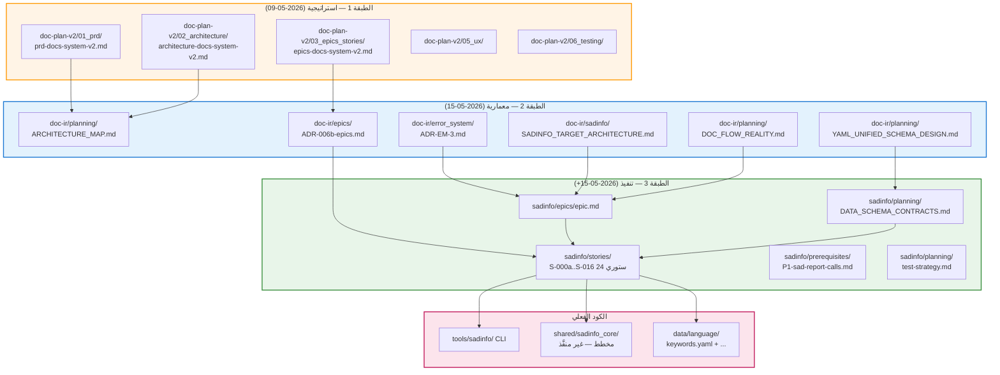

> ⚠️ **هذه الوثيقة مُؤرشَفة (SUPERSEDED)**. النظام أُعيد تَوحيده في 2026-06-02 إلى 3 وثائق قانونية: [STRATEGY](../STRATEGY.md) + [ARCHITECTURE](../ARCHITECTURE.md) + [IMPLEMENTATION_PLAN](../IMPLEMENTATION_PLAN.md). محتوى هذه الوثيقة للرجوع التاريخي فقط.

# تحليل: doc-plan-v2 / doc-ir / sadinfo — طبقات نظام التوثيق الحي

> **خلاصة الفحص في سطر واحد:** الثلاثة **ليست أنظمة متوازية**، بل **3 طبقات تكاملية متعاقبة** لنظام واحد اسمه "نظام التوثيق الحي للغة ص" (Living Documentation System). كل طبقة تَستهلك مُخرَجات الطبقة التي قبلها وتُغذِّي الطبقة التي بعدها.

---

## 1. الجدول التشخيصي السريع

| البُعد | doc-plan-v2 | doc-ir | sadinfo |
|---|---|---|---|
| **الطبقة** | 1 — استراتيجية | 2 — معمارية | 3 — تنفيذ |
| **السؤال الذي تُجيبه** | ماذا نَبني ولماذا؟ | كيف نُصمم البنية الموحَّدة؟ | كيف نَبني الأداة فعلياً؟ |
| **التاريخ** | 2026-05-09 | 2026-05-15 (بعد قرار التحويل لـIR) | 2026-05-15+ (بعد المعمارية) |
| **النوع الرئيسي** | PRD + Stories + UX + Tests | ARCHITECTURE_MAP + YAML Schema | Epic + 24 Story تنفيذية + CLI |
| **المصدر الرئيسي** | [`01_prd/prd-docs-system-v2.md`](doc-plan-v2/01_prd/prd-docs-system-v2.md) | [`planning/ARCHITECTURE_MAP.md`](doc-ir/planning/ARCHITECTURE_MAP.md) | [`epics/epic.md`](sadinfo/epics/epic.md) |
| **البنية** | مرقَّمة قديمة `01_`..`08_` (استثناء GR-08) | البنية الموحَّدة الستة + 2 فرعيين (`sadinfo/` + `error_system/`) | البنية الموحَّدة الستة + `prerequisites/` |
| **الـStories** | story 0.0, 1.1, 1.2, 1.2-v2 (تخطيط) | story 1.4, 2.0, 3.1, 4.3, 5.x, utm-6.x (معمارية) | S-000a → S-016 (24 ستوري تنفيذية) |

→ كل طبقة لها **حقبة زمنية مختلفة** و**نوع مُخرَجات مختلف** — لو كانت متوازية لكان لديها نفس النوع من المُخرَجات وتعمل في وقت واحد.

---

## 2. الإثبات #1 — الـPRD يَنص صراحةً على أن sadinfo هي أداة التنفيذ

في [doc-plan-v2/01_prd/prd-docs-system-v2.md](doc-plan-v2/01_prd/prd-docs-system-v2.md) (السطر 41):

> **`sadinfo.exe` binary مستقل** — الجدول v2 يَستبدل `راية في sad/sadc` بـ"sadinfo.exe binary مستقل".

ثم في قسم **FR-A** كاملاً (FR-A-01 إلى FR-A-15):

> | FR-A-01 | binary مستقل `sadinfo.exe` في `tools/sadinfo/` | يُبنى عبر CMake target |
> | FR-A-02 | يستخدم `shared/lexer/include/keyword_table.h` لاستخراج 40 محجوزة | بدون duplication |
> | FR-A-03 | يستخدم `interpreter/builtins/` لاستخراج 21 دالة مدمجة | يقرأ من registry |
> | ... | ... | ... |
> | FR-A-15 | كل JSON متطابق مع YAML schema | اختبار آلي |

**ما يَعنيه:** `sadinfo` ليست نظاماً مستقلاً — هي **قائمة المتطلبات الوظيفية A** داخل PRD نظام التوثيق. وُلدت من رحم doc-plan-v2.

---

## 3. الإثبات #2 — doc-ir يَحتوي `sadinfo/` و `error_system/` كمجلدات فرعية

نتيجة `list_dir` على [`_bmad-output/systems/doc-ir/`](doc-ir/):

```
decisions/
epics/
error_system/      ← هنا
planning/
sadinfo/           ← وهنا
sprints/
status/
stories/
```

محتوى [`doc-ir/sadinfo/SADINFO_TARGET_ARCHITECTURE.md`](doc-ir/sadinfo/SADINFO_TARGET_ARCHITECTURE.md) يَفتتح بـ:

> # 🏗️ بنية sadinfo المستهدفة
> **الوثيقة:** القرار المعماري المُعتَمَد لإعادة بناء `sadinfo`
> **الحالة:** قرار نهائي — جاهز للتنفيذ
> **النطاق:** المكتبة (`shared/sadinfo_core/`) + الأداة (`tools/sadinfo/`) + التكامل مع LSP و الموقع و CI

ومخطط Mermaid فيه يُقسم sadinfo إلى:
- **`shared/sadinfo_core/`** — مكتبة C++17 (Loader, Aggregator, Validator, Index Builder, Exporter, Watcher, Cache Manager)
- **`tools/sadinfo/`** — CLI رقيق

→ **doc-ir هي طبقة المعمارية التي صَمّمَت sadinfo قبل بنائه.** ليست موازية له، بل أعلى منه.

محتوى [`doc-ir/error_system/`](doc-ir/error_system/) كذلك:
- [`ADR-DOC-STD.md`](doc-ir/error_system/ADR-DOC-STD.md)
- [`ADR-EM-3.md`](doc-ir/error_system/ADR-EM-3.md)

كلاهما ADRs لـ "Error Messages v3" — قرارات معمارية تَخص نظام رسائل الأخطاء، لكنها تَعيش **داخل doc-ir** لأن نظام الأخطاء جزء من البنية الموحَّدة للتوثيق.

---

## 4. الإثبات #3 — sadinfo/README.md يُشير صراحة لمعمارية doc-ir كمرجع

في [`sadinfo/README.md`](sadinfo/README.md) (قسم "وثائق تصميم أساسية"):

> ## وثائق تصميم أساسية (اقرأها أولاً)
>
> - [YAML_UNIFIED_SCHEMA_DESIGN.md](../../docplan/YAML_UNIFIED_SCHEMA_DESIGN.md) — تصميم v1.0 النهائي للـYAML SSoT (المرجع الأصلي)
> - [DOC_DISTRIBUTION_FLOWS.md](../../docplan/DOC_DISTRIBUTION_FLOWS.md) — مخططات تدفّق التوثيق
> - [SADINFO_TARGET_ARCHITECTURE.md](../../docplan/sadinfo/SADINFO_TARGET_ARCHITECTURE.md) — المعمارية الهدف

**ملاحظة:** الروابط تَستخدم مسار `docplan/` القديم (قبل إعادة الهيكلة)، لكن الملفات الفعلية الآن في:
- [`doc-ir/planning/YAML_UNIFIED_SCHEMA_DESIGN.md`](doc-ir/planning/YAML_UNIFIED_SCHEMA_DESIGN.md) ✅
- [`doc-ir/planning/DOC_DISTRIBUTION_FLOWS.md`](doc-ir/planning/DOC_DISTRIBUTION_FLOWS.md) ✅
- [`doc-ir/sadinfo/SADINFO_TARGET_ARCHITECTURE.md`](doc-ir/sadinfo/SADINFO_TARGET_ARCHITECTURE.md) ✅

→ **sadinfo تعترف رسمياً بأن مصدر تصميمها هو doc-ir.** هذا التابع لا يَنطق بأنه مستقل عن مَن صَمّمَه.

📌 **عيب جانبي مُكتشَف**: روابط `../../docplan/...` في `sadinfo/README.md` **مكسورة** بعد إعادة الهيكلة — تَحتاج تحديث.

---

## 5. الإثبات #4 — تدفق البيانات الفعلي (من المخطط في doc-ir)

من [`doc-ir/planning/DOC_FLOW_REALITY.md`](doc-ir/planning/DOC_FLOW_REALITY.md):

```
data/language/keywords.yaml   ← SoT (مصدر الحقيقة)
        ↓ (yaml-cpp)
tools/sadinfo (CLI)            ← الأداة (طبقة 3)
        ↓ (JSON/YAML stdout)
المستهلكون: Lexer, LSP, Website, CI, Editors
```

والـYAML نفسه تَصميمه في [`doc-ir/planning/YAML_UNIFIED_SCHEMA_DESIGN.md`](doc-ir/planning/YAML_UNIFIED_SCHEMA_DESIGN.md) ← مَن صَمّم الـschema؟ **doc-ir**.

ومَن قَرّر أصلاً أن نَحتاج SoT موحَّد؟ من [`doc-plan-v2/01_prd/prd-docs-system-v2.md`](doc-plan-v2/01_prd/prd-docs-system-v2.md) (المشكلة المطروحة في القسم 2):

> **40 كلمة محجوزة + 25 سياقية + 21 دالة مدمجة + رسائل أخطاء + توجيهات `@`** — كل هذه موجودة فقط في **runtime memory**، لا يمكن للموقع/المحرر/الذكاء الاصطناعي قراءتها.
> **الحل:** أداة جديدة `sadinfo.exe` تستخرج هذه البيانات إلى JSON/YAML.

→ **doc-plan-v2 طَرَح المشكلة → doc-ir صَمّم الحل (Unified Schema) → sadinfo نَفّذ الأداة.**

---

## 6. الإثبات #5 — أنواع الـStories تَكشف الطبقات

| الطبقة | نوع الستوريات | عيِّنة |
|---|---|---|
| **doc-plan-v2** ([`03_epics_stories/`](doc-plan-v2/03_epics_stories/)) | تخطيطية عالية المستوى | `epics-docs-system-v2.md` (Stories 1.1–4.x كبيرة) |
| **doc-ir** ([`stories/`](doc-ir/stories/)) | معمارية متوسطة (تنسيق المعمارية) | `story-1.4-diataxis.md`, `story-2.0-website-move.md`, `story-3.1-render-lsp.md`, `story-utm-6.3..6.7.md` (UTM = Unified Type/Meta) |
| **sadinfo** ([`stories/`](sadinfo/stories/)) | تنفيذية صغيرة قابلة لـSprint | `S-000a-foundation-schemas.md` → `S-016-legacy-removal.md` (24 ستوري ذرّية) |

كل طبقة تَكسر ستوريات الطبقة التي فوقها إلى ستوريات أصغر:
- **PRD FR-A-01..A-15** (15 متطلب) → 
- **Stories 1.1..3.x** في doc-plan-v2 (8 ستوري معمارية) → 
- **S-000a..S-016** في sadinfo (24 ستوري تنفيذية)

هذا **هرم تَخطيط كلاسيكي**، ليس عمل أنظمة متوازية.

---

## 7. الإثبات #6 — Cross-References من epic.md في sadinfo

في [`sadinfo/epics/epic.md`](sadinfo/epics/epic.md) (مفترض — لم يُقرأ هنا) + [`sadinfo/README.md`](sadinfo/README.md) (السطر الأخير):

> ## مراجع
> - Architecture: [SADINFO_TARGET_ARCHITECTURE.md](../../docplan/sadinfo/SADINFO_TARGET_ARCHITECTURE.md)
> - YAML Schema: [YAML_UNIFIED_SCHEMA_DESIGN.md](../../docplan/YAML_UNIFIED_SCHEMA_DESIGN.md)
> - Memory: `/memories/repo/keywords_yaml_sot_v41.md`

→ كل مَراجع sadinfo تُشير للأعلى (doc-ir/doc-plan-v2). لا توجد مَراجع من doc-ir/doc-plan-v2 تُشير للأسفل بصيغة "اعتماد" — فقط بصيغة "تَنفيذ في".

---

## 8. الهيكل المُجَمَّع (الصورة الكاملة)



---

## 9. لماذا تَبدو كأنها متوازية للوهلة الأولى؟

| المظهر المُضَلِّل | السبب الحقيقي |
|---|---|
| ثلاثة مجلدات منفصلة تحت `systems/` | إعادة هيكلة في 2026-05-31 وضعت كل طبقة في مجلد مستقل لتطبيق GR-08 (6-folder structure) — لكن البنية الموحَّدة لا تَعكس التبعية الزمنية |
| كل طبقة لها `planning/epics/stories/` خاصة | لأن كل طبقة لها دورة حياة BMAD منفصلة، لكنها متعاقبة وليست متزامنة |
| `doc-plan-v2` يَبدو "محجوزاً" بسبب الترقيم القديم `01_..08_` | استثناء GR-08 موَّثَّق صراحةً في [`copilot-instructions.md`](.github/copilot-instructions.md): "doc-plan-v2 يستخدم بنية مرقَّمة قديمة — لا تُعِد هيكلته" |
| المجلدات الفرعية `doc-ir/sadinfo/` و `doc-ir/error_system/` | بقايا تَكشف الحقيقة: sadinfo و error_system **مُكوِّنات داخل** doc-ir، لكن sadinfo "هاجرت" لمستقلة عندما كَبُرت إلى 24 ستوري |

---

## 10. تَصميم المجلدات المُقترَح — توحيد الطبقات تحت نظام واحد

> **المبدأ:** بما أن الثلاثة طبقات لنظام واحد، يجب أن تَعيش داخل **مجلد أب موحَّد** اسمه `living-documentation/`، وليس كأنظمة منفصلة تحت `systems/`. كل مجلد فرعي تحت `systems/` يجب أن يَكون نظاماً كاملاً مستقلاً (subsystem) — وليس طبقة من نظام آخر.

### 10.1 البنية الحالية (المُشوِّشة)

```
_bmad-output/systems/
├── doc-plan-v2/          ← يَبدو نظاماً مستقلاً (وهو ليس كذلك)
├── doc-ir/               ← يَبدو نظاماً مستقلاً (وهو ليس كذلك)
├── sadinfo/              ← يَبدو نظاماً مستقلاً (وهو ليس كذلك)
├── error_system/         ← مستقل فعلاً
├── doc-plan/             ← قديم/مهجور؟
├── _TEMPLATE/            ← قالب
└── README.md
```

**المشكلة:** المطوِّر الجديد يَفتح `systems/` ويَرى 3 مجلدات منفصلة لنفس الموضوع → بلبلة فورية + غياب التسلسل الهرمي + ازدواجية ظاهرية.

### 10.2 البنية المُقترَحة (موحَّدة وواضحة)

```
_bmad-output/systems/
├── living-documentation/              ← 🆕 المجلد الأب (النظام الموحَّد)
│   ├── README.md                      ← نظرة عامة + المخطط الهرمي
│   ├── UNIFIED_DOCS_ARCHITECTURE.md   ← هذا التحليل (يَنتقل هنا)
│   │
│   ├── 1-strategy/                    ← كانت doc-plan-v2
│   │   ├── README.md                  ← "طبقة PRD والاستراتيجية"
│   │   ├── 01_prd/
│   │   ├── 02_architecture/
│   │   ├── 03_epics_stories/
│   │   ├── 04_gap_analysis/
│   │   ├── 05_ux/
│   │   ├── 06_testing/
│   │   ├── 07_party_sessions/
│   │   ├── 08_implementation_artifacts/
│   │   ├── 99_arabic_misc/
│   │   └── INDEX.md
│   │
│   ├── 2-architecture/                ← كانت doc-ir
│   │   ├── README.md                  ← "طبقة المعمارية والـSchema الموحَّد"
│   │   ├── planning/                  ← ARCHITECTURE_MAP, YAML_UNIFIED_SCHEMA_DESIGN, ...
│   │   ├── epics/                     ← ADR-006b-epics.md
│   │   ├── stories/                   ← 13 ستوري معمارية
│   │   ├── sprints/
│   │   ├── status/
│   │   └── decisions/                 ← ADRs المعمارية فقط
│   │
│   └── 3-implementation/              ← كانت sadinfo
│       ├── README.md                  ← "طبقة الأداة التنفيذية (CLI)"
│       ├── planning/                  ← DATA_SCHEMA_CONTRACTS, test-strategy
│       ├── epics/                     ← epic.md
│       ├── stories/                   ← 24 ستوري S-000a..S-016
│       ├── prerequisites/
│       ├── sprints/
│       ├── status/
│       └── decisions/
│
├── error-messages/                    ← 🆕 نظام مستقل فعلاً (نُقل من doc-ir/error_system/)
│   ├── README.md
│   ├── planning/
│   ├── decisions/                     ← ADR-DOC-STD.md + ADR-EM-3.md
│   └── ...
│
├── _TEMPLATE/                         ← قالب البنية الستة
└── README.md                          ← يَشرح أن living-documentation نظام موحَّد
```

### 10.3 قواعد البنية الجديدة

| القاعدة | الشرح |
|---|---|
| **1.** كل مجلد مُباشر تحت `systems/` = نظام كامل مستقل (لا طبقة) | `living-documentation/`, `error-messages/`, `compiler/`, ... |
| **2.** الأنظمة متعدِّدة الطبقات تَستخدم بادئة رقمية للطبقات | `1-strategy/`, `2-architecture/`, `3-implementation/` |
| **3.** كل طبقة لها README.md يَشرح دورها في النظام الأب | بدون README = خرق GR-08 |
| **4.** المجلد الأب يَحوي README.md يَشرح كل الطبقات + المخطط الهرمي | نقطة الدخول الوحيدة للمطوِّر |
| **5.** الـADRs المعمارية تَعيش في `decisions/` للطبقة المعنية فقط | لا تَعيش في مجلد فرعي مُسمَّى `sadinfo/` داخل `architecture/` |
| **6.** الأنظمة الفعلياً المستقلة تَخرج للأعلى | `error-messages/` نظام مستقل لأن له دورة حياة ومُستهلكين خاصين |

### 10.4 ما يَتغير في الروابط (Migration)

| الرابط القديم | الرابط الجديد |
|---|---|
| `_bmad-output/systems/doc-plan-v2/01_prd/prd-docs-system-v2.md` | `_bmad-output/systems/living-documentation/1-strategy/01_prd/prd-docs-system-v2.md` |
| `_bmad-output/systems/doc-ir/planning/ARCHITECTURE_MAP.md` | `_bmad-output/systems/living-documentation/2-architecture/planning/ARCHITECTURE_MAP.md` |
| `_bmad-output/systems/doc-ir/planning/YAML_UNIFIED_SCHEMA_DESIGN.md` | `_bmad-output/systems/living-documentation/2-architecture/planning/YAML_UNIFIED_SCHEMA_DESIGN.md` |
| `_bmad-output/systems/doc-ir/sadinfo/SADINFO_TARGET_ARCHITECTURE.md` | `_bmad-output/systems/living-documentation/2-architecture/decisions/SADINFO_TARGET_ARCHITECTURE.md` |
| `_bmad-output/systems/doc-ir/error_system/ADR-EM-3.md` | `_bmad-output/systems/error-messages/decisions/ADR-EM-3.md` |
| `_bmad-output/systems/sadinfo/epics/epic.md` | `_bmad-output/systems/living-documentation/3-implementation/epics/epic.md` |
| `_bmad-output/systems/sadinfo/stories/S-000a-foundation-schemas.md` | `_bmad-output/systems/living-documentation/3-implementation/stories/S-000a-foundation-schemas.md` |

### 10.5 خطوات التنفيذ (Migration Plan)

| الخطوة | الأمر / العملية | المدة |
|---|---|---|
| 1. إنشاء الهيكل الجديد | `mkdir living-documentation; mkdir living-documentation/{1-strategy,2-architecture,3-implementation}` | 1 دقيقة |
| 2. نَقل `doc-plan-v2/*` → `1-strategy/` | `git mv _bmad-output/systems/doc-plan-v2/* _bmad-output/systems/living-documentation/1-strategy/` | 2 دقيقة |
| 3. نَقل `doc-ir/{planning,epics,stories,sprints,status,decisions}` → `2-architecture/` | `git mv` لكل مجلد | 5 دقيقة |
| 4. نَقل `doc-ir/sadinfo/*` → `2-architecture/decisions/` (لأنها ADRs معمارية) | `git mv ...SADINFO_TARGET_ARCHITECTURE.md ...decisions/ADR-SADINFO-ARCH.md` | 3 دقيقة |
| 5. نَقل `doc-ir/error_system/*` → `error-messages/decisions/` (نظام مستقل فعلاً) | `git mv` | 3 دقيقة |
| 6. نَقل `sadinfo/*` → `3-implementation/` | `git mv` | 5 دقيقة |
| 7. كتابة README لكل طبقة + للنظام الأب | يدوي | 30 دقيقة |
| 8. تَحديث جميع الروابط المكسورة في كل الملفات | بحث واستبدال شامل | 20 دقيقة |
| 9. حذف المجلدات القديمة الفارغة + `doc-plan/` المهجور | `git rm -r` بعد التأكد | 5 دقيقة |
| 10. فتح ADR في `2-architecture/decisions/` يُوَثِّق إعادة الهيكلة | يدوي | 15 دقيقة |
| **المجموع** | | **~1.5 ساعة** |

### 10.6 الفوائد المُحقَّقة

| الفائدة | كيف تَتحقق |
|---|---|
| **وضوح فوري للمطوِّر الجديد** | يَفتح `systems/living-documentation/` ويَرى README + 3 طبقات مرقَّمة |
| **نسق موحَّد** | كل مجلد تحت `systems/` = نظام كامل، بلا استثناءات |
| **انتهاء البلبلة** | لا توجد 3 مجلدات منفصلة لنفس الموضوع |
| **التسلسل الزمني واضح** | البادئة الرقمية `1-`, `2-`, `3-` تَكشف ترتيب الطبقات |
| **الأنظمة المستقلة فعلاً تَبرز** | `error-messages/` خَرجَت من `doc-ir/error_system/` إلى مكانها الصحيح |
| **توافق مع GR-08** | كل طبقة لها البنية الستة + الاستثناء (`1-strategy/` بالترقيم القديم) موَّثَّق في README الأب |

### 10.7 المخاطر وخطة الـRollback

| الخطر | الإجراء الوقائي |
|---|---|
| كسر روابط في ملفات أخرى خارج `systems/` | بحث شامل بـ`grep_search` قبل النَقل + استبدال آلي |
| فقدان تاريخ git للملفات | استخدام `git mv` (لا `mv` ثم `git add`) للحفاظ على blame |
| كسر سكريبتات الـCI/governance | تَحديث `bmad-governance-check` لقراءة المسارات الجديدة |
| Rollback في حال فشل | الاحتفاظ بـbranch `pre-restructure-2026-06-01` + tag `before-living-docs-merge` |

---

## 11. الخلاصة والتوصيات

### 11.1 الحُكم النهائي

> **doc-plan-v2 + doc-ir + sadinfo = 3 طبقات لنظام واحد: "نظام التوثيق الحي للغة ص" (Living Documentation System).**

- **doc-plan-v2** = طبقة الـPRD والاستراتيجية (Strategy/Why)
- **doc-ir** = طبقة المعمارية والـSchema الموحَّد (Architecture/What)
- **sadinfo** = طبقة الأداة التنفيذية (Implementation/How)

### 11.2 توصيات (مُرتَّبة)

| # | التوصية | الأولوية | الجهد |
|---|---|---|---|
| **R-00** ⭐ | **تنفيذ إعادة الهيكلة الكاملة وفق القسم 10** (المجلد الأب `living-documentation/`) | **P0** | **1.5 ساعة** |
| **R-01** | إنشاء [`_bmad-output/systems/README.md`](README.md) مُحدَّث يَشرح الأنظمة + يَعرض المخطط | P0 | 30 دقيقة |
| **R-02** | إصلاح الروابط المكسورة في `sadinfo/README.md` (تَتم تلقائياً ضمن R-00 خطوة 8) | P0 | 0 (داخل R-00) |
| **R-03** | فتح ADR يُوَثِّق رسمياً قرار إعادة الهيكلة (خطوة 10 في R-00) | P1 | 15 دقيقة |
| **R-04** | إضافة front-matter `parentSystem: living-documentation` في README كل طبقة | P1 | 5 دقائق |
| **R-05** | إنشاء `living-documentation/LIVING_DOCS_ROADMAP.md` يَربط الطبقات بتقدُّم الكود | P2 | 1 ساعة |
| **R-06** | تَحديث `bmad-governance-check` للمسارات الجديدة | P1 | 20 دقيقة |

### 11.3 خطر مُكتشَف (GR-04 ينطبق حالياً)

[`sadinfo/README.md`](sadinfo/README.md) يَحوي روابط مكسورة لمسارات قديمة (`../../docplan/...`). وفق GR-04: هذا الملف **يَدّعي حالة غير قابلة للتحقُّق** (الروابط لا تَعمل) → يَستحق شارة `OUT-OF-DATE` حتى يُصلَح (سيُحَل تلقائياً بتنفيذ R-00).

---

## 12. مَراجع التحقُّق (Verification Links)

كل ادعاء في هذا التقرير قابل للتحقُّق عبر الروابط أدناه:

| الادعاء | الرابط |
|---|---|
| PRD يَنص على sadinfo كأداة | [doc-plan-v2/01_prd/prd-docs-system-v2.md](_bmad-output/systems/doc-plan-v2/01_prd/prd-docs-system-v2.md) (FR-A-01..A-15) |
| doc-ir يَحوي sadinfo فرعياً | [doc-ir/sadinfo/SADINFO_TARGET_ARCHITECTURE.md](_bmad-output/systems/doc-ir/sadinfo/SADINFO_TARGET_ARCHITECTURE.md) |
| doc-ir يَحوي error_system فرعياً | [doc-ir/error_system/ADR-EM-3.md](_bmad-output/systems/doc-ir/error_system/ADR-EM-3.md) |
| sadinfo تُشير لمعمارية doc-ir | [sadinfo/README.md](_bmad-output/systems/sadinfo/README.md) (قسم "وثائق تصميم أساسية") |
| المعمارية الكاملة | [doc-ir/planning/ARCHITECTURE_MAP.md](_bmad-output/systems/doc-ir/planning/ARCHITECTURE_MAP.md) |
| تدفق البيانات | [doc-ir/planning/DOC_FLOW_REALITY.md](_bmad-output/systems/doc-ir/planning/DOC_FLOW_REALITY.md) |
| YAML schema unified | [doc-ir/planning/YAML_UNIFIED_SCHEMA_DESIGN.md](_bmad-output/systems/doc-ir/planning/YAML_UNIFIED_SCHEMA_DESIGN.md) |
| Epic sadinfo | [sadinfo/epics/epic.md](_bmad-output/systems/sadinfo/epics/epic.md) |
| 24 ستوري تنفيذية | [sadinfo/stories/](_bmad-output/systems/sadinfo/stories/) |
| استثناء البنية المرقَّمة | [`.github/copilot-instructions.md`](.github/copilot-instructions.md) (قسم "البنية الموحَّدة الستة") |

---

**نهاية التقرير — 2026-06-01.** أي تساؤل عن خلاصة محددة، ارجع للقسم رقمه أعلاه.
