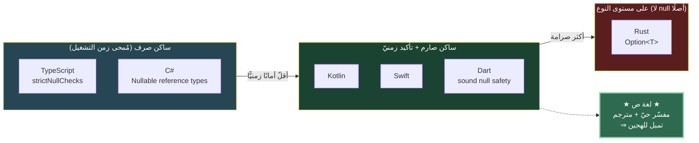
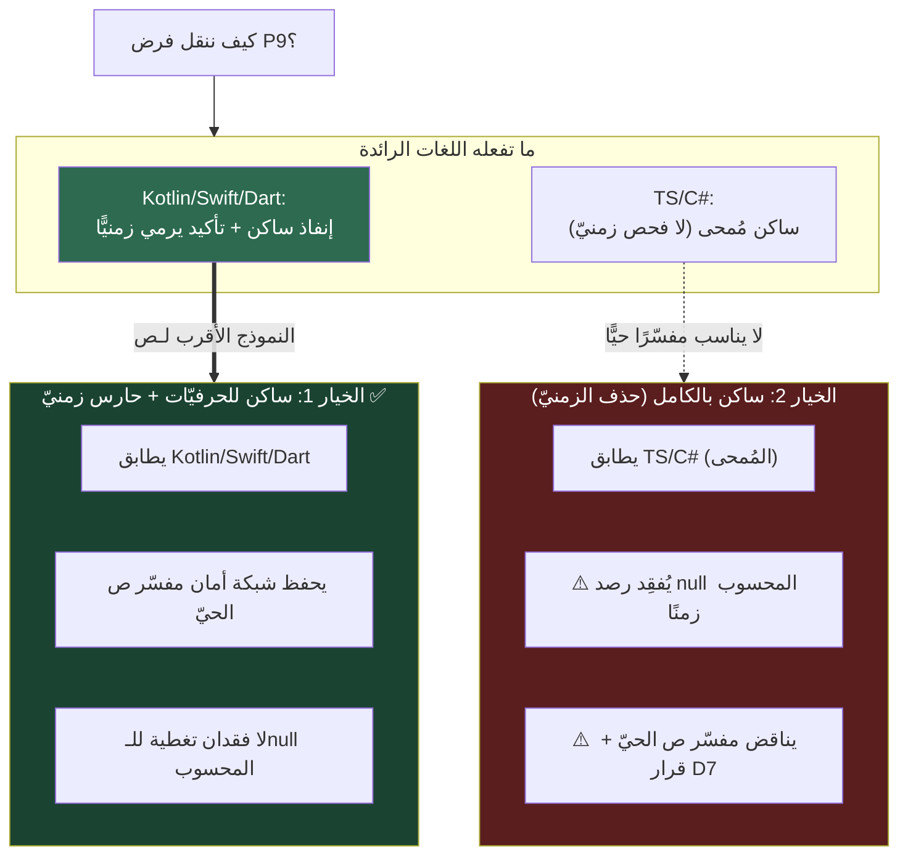

# مقارنة أمان null عبر 5 لغات — وقرار «ساكن vs زمنيّ» للغة ص

> **الغرض:** مسح كيف تعالج لغاتٌ رائدة أمان null، وأين تضع الفحص (وقت الترجمة الساكن
> مقابل وقت التشغيل الزمنيّ)، لتغذية قرار **D8** في NS-02: كيف ننقل فرض P9 من المفسّر
> إلى المحلّل المشترك الساكن دون فقدان تغطية.
>
> **يرتبط بـ:** [OVERVIEW_DIAGRAMS §8](OVERVIEW_DIAGRAMS.md) · [ADR-NS-001](../decisions/ADR-NS-001-flow-analysis-scope-and-strictness.md) · تاريخ: 2026-06-20

---

## 1. الطيف: أين يقع الفحص؟



---

## 2. جدول المقارنة

| اللغة | تمثيل العَدَم | موضع الفحص | عامل التأكيد | سلوك التأكيد على null | تضييق التدفّق |
|------|--------------|-----------|:-----------:|----------------------|:------------:|
| **Kotlin** | `T` vs `T?` | **ساكن** (الإنفاذ زمن الترجمة) | `!!` | **يرمي زمن التشغيل** (`NullPointerException`) | ✅ smart casts (ساكن، يرفض `var` المتحوّر) |
| **Swift** | `T` vs `Optional<T>` (`T?`) | **ساكن** (يجب فكّ الغلاف) | `!` | **انهيار زمن التشغيل** (`fatalError`) | ✅ `if let`/`guard let` (ربط ساكن) |
| **Dart** | `T` vs `T?` (sound) | **ساكن سليم** (ضمان كامل) | `!` | **يرمي زمن التشغيل** (`TypeError`) | ✅ promotion (ساكن، محلّيّات) |
| **TypeScript** | `T` vs <code>T \| null</code> | **ساكن صرف** (مُمحى — صفر فحص زمنيّ) | `!` (non-null) | **لا شيء** (مُمحى تمامًا) | ✅ control-flow narrowing (غنيّ) |
| **C#** | `T` vs `T?` (مراجع، C# 8+) | **ساكن (تحذيرات)** + اختياريّ | `!` (forgiving) | **لا شيء** (مُمحى للمراجع) | ✅ flow analysis (تحذيرات) |
| *(مرجع)* **Rust** | `Option<T>` (لا null) | **ساكن** (استنفاد الأنماط) | `.unwrap()` | **panic زمن التشغيل** | ✅ `match`/`if let` |

---

## 3. الدرس لكل نموذج

### 🟢 النموذج «ساكن صارم + تأكيد زمنيّ» (Kotlin / Swift / Dart)
- الإنفاذ **ساكن** زمن الترجمة (لا يمرّ كود غير آمن)، **لكن** عامل التأكيد (`!!`/`!`)
  **يرمي زمن التشغيل** — شبكة أمان لا تُمحى. هذا **أقرب نموذج للغة ص** لأنّ ص:
  - تملك **مفسّرًا حيًّا** (`sad-run`) يُنفّذ القيم زمنًا فعليًّا، فالقيم العَدَمية المحسوبة
    موجودة واقعًا — تجاهلها (كنموذج TS المُمحى) يُفقِد أمانًا حقيقيًّا متاحًا مجانًا.
  - حسمت أصلًا (D7) أنّ `!!` على `عدم` **يرمي خطأ كتالوج زمن التشغيل حتى في gc**.

### 🟡 النموذج «الساكن الصرف» (TypeScript / C#)
- الفحص **يُمحى تمامًا** زمن التشغيل — صفر تكلفة، لكن **لا شبكة أمان** إن تسلّل null
  (عبر `any`/تعدٍّ على المترجم/تفاعل خارجيّ). يناسب لغة تُترجَم وتُمحى أنواعها، **لا**
  لغةً ذات مفسّر ديناميكيّ حيّ كـص.

### 🔴 النموذج «على مستوى النوع» (Rust)
- لا null إطلاقًا — `Option<T>` + استنفاد. أقوى ضمان، لكن ص **اختارت التدرّج** (`T?`)
  لا الإلغاء الكامل (ADR-TYPESYSTEM-001) — فهذا خارج النطاق.

---

## 4. الإسقاط على قرار P9 (ساكن vs زمنيّ)



---

## 5. الخلاصة والتوصية

**لغة ص فريدة:** لها **مفسّر حيّ + مترجم** معًا، خلافًا لمعظم اللغات التي تتبنّى مسارًا
واحدًا. هذا يرجّح **الخيار 1 (ساكن للحرفيّات + حارس زمنيّ)**:

1. **يطابق العائلة الأقرب** (Kotlin/Swift/Dart): إنفاذ ساكن لما يُعرَف زمن الترجمة،
   وتأكيد/فحص يرمي زمن التشغيل لما لا يُعرَف إلا زمنًا.
2. **يحفظ شبكة الأمان المجّانية** التي يوفّرها مفسّر ص الحيّ — النموذج الساكن الصرف (TS)
   يُهدرها، وهو منطقيّ للغة مُمحاة الأنواع لا للغة ذات تنفيذ ديناميكيّ.
3. **متّسق مع D7** المحسوم: `!!` على `عدم` يرمي خطأ كتالوج زمن التشغيل حتى في gc —
   فوجود مسار زمنيّ مبدأٌ مُقَرّ في النظام أصلًا.
4. **«نقطة تحليل واحدة» (D8) تبقى محقّقة معماريًّا**: المنطق (ساكن + الحارس الزمنيّ) يعيش
   كلّه في `NullSafetyAnalyzer` المشترك بدل تناثره في `statement_executor` — الوحدة في
   *مكان المنطق* لا في *لحظة الفحص*.

> **التحذير المقابل (نزاهة):** الخيار 1 يعني أنّ زمن الفحص ليس موحَّدًا (ساكن للحرفيّ،
> زمنيّ للمحسوب) — تعقيد أعلى من «نقطة لحظية واحدة». لكنّه ثمن مقبول مقابل عدم فقدان
> التغطية، وهو بالضبط ما تفعله اللغات الناضجة ذات التنفيذ الحيّ.

**القرار النهائيّ بيد الفريق؛** عند الحسم يُسجَّل في [ADR-NS-001](../decisions/ADR-NS-001-flow-analysis-scope-and-strictness.md)
كقرار جديد (D10) ويُحدَّث [OVERVIEW_DIAGRAMS §8](OVERVIEW_DIAGRAMS.md).

---

## 6. صيغة تعريف العَدَم (null) عبر اللغات

| اللغة | حرفيّ العَدَم | النوع غير القابل | النوع القابل للعَدَم |
|------|--------------|------------------|----------------------|
| **لغة ص** | `لاشيء` | `نص` | `نص؟` (لاحقة `؟`) |
| Kotlin | `null` | `String` | `String?` |
| Swift | `nil` | `String` | `String?` = `Optional<String>` |
| Dart | `null` | `String` | `String?` |
| TypeScript | `null` / `undefined` | `string` | <code>string \| null</code> |
| C# | `null` | `string` | `string?` |
| *(Rust)* | — (لا null) | `String` | `Option<String>` |

> **خصوصية ص:** لاحقة الاختياريّة `؟` (علامة استفهام عربية) تميّزها عن العامل الثلاثيّ
> `? :` (ASCII) والعوامل `??`/`?.` (ASCII) — فضّ الغموض بالموضع: `؟` بعد **نوع** = اختياريّة.

---

## 7. معاملات الفحص (check operators)

| العامل | الرمز في ص | المعنى | المصدر |
|--------|:----------:|--------|--------|
| الوصول الآمن | `?.` | `كائن?.حقل` — يُرجِع `لاشيء` بدل الانهيار إن كان المتلقّي عدمًا | `op.optional_chain` (TS-P8، stable) |
| الاندماج الفارغ | `??` | `س ?? 0` — الأيسر إن لم يكن عدمًا، وإلا الأيمن | `op.null_coalesce` (TS-P8، stable) |
| لاحقة الاختياريّة | `؟` | `نص؟` — يعلن النوع قابلًا للعَدَم | `QUESTION` (نحو الأنواع) |
| المقارنة | `!= لاشيء` / `== لاشيء` | تُطلق التضييق الذكيّ (NS-03) | دلاليّ (تحليل تدفّق) |
| **التأكيد** | `!!` | `س!!` — يؤكّد عدم العَدَم؛ خطأ كتالوج زمنيّ على `عدم` | `ForceUnwrapExpr` (**NS-05 — مقترَح**) |

**نظائرها في اللغات الأخرى:**

| ص | Kotlin | Swift | Dart | TypeScript | C# |
|---|--------|-------|------|------------|-----|
| `?.` | `?.` | `?.` | `?.` | `?.` | `?.` |
| `??` | `?:` (Elvis) | `??` | `??` | `??` | `??` |
| `!!` | `!!` | `!` | `!` | `!` (مُمحى) | `!` (مُمحى) |

---

## 8. أمثلة من كود حقيقيّ

### لغة ص
```sad
دالة اطبع_الاسم(مستخدم)
    متغير اسم: نص؟ = مستخدم?.الاسم      # وصول آمن ?. ⇒ نص؟
    اطبع_سطر(اسم ?? "مجهول")            # اندماج فارغ ?? ⇒ نص دائمًا

    إذا (اسم != لاشيء)
        اطبع_سطر(اسم.طول())            # تضييق ذكيّ (NS-03): اسم ⇒ نص
    نهاية

    متغير ط = اسم!!.طول()              # تأكيد !! (NS-05): خطأ كتالوج إن عدم
نهاية
```

### Kotlin
```kotlin
fun printName(user: User?) {
    val name: String? = user?.name        // وصول آمن
    println(name ?: "Unknown")            // Elvis ?:
    if (name != null) println(name.length) // smart cast (ساكن)
    val n = name!!.length                  // !! يرمي NPE زمنيًّا
}
```

### Swift
```swift
func printName(_ user: User?) {
    let name: String? = user?.name        // وصول آمن
    print(name ?? "Unknown")              // ??
    if let name = name { print(name.count) } // ربط اختياريّ (ساكن)
    let n = name!.count                    // ! انهيار زمنيّ على nil
}
```

### Dart
```dart
void printName(User? user) {
  String? name = user?.name;              // وصول آمن
  print(name ?? 'Unknown');               // ??
  if (name != null) print(name.length);   // promotion (ساكن، محلّيّ)
  var n = name!.length;                    // ! يرمي زمنيًّا
}
```

### TypeScript
```typescript
function printName(user: User | null) {
  const name: string | null = user?.name ?? null; // ?. + ??
  if (name !== null) console.log(name.length);     // narrowing (ساكن، مُمحى)
  const n = name!.length;                           // ! مُمحى — لا فحص زمنيّ
}
```

### C#
```csharp
void PrintName(User? user) {
    string? name = user?.Name;            // وصول آمن
    Console.WriteLine(name ?? "Unknown"); // ??
    if (name != null) Console.WriteLine(name.Length); // flow analysis (تحذيرات)
    var n = name!.Length;                  // ! مُمحى للمراجع — لا فحص زمنيّ
}
```

---

## 9. قاعدة BNF لبُنى أمان null في لغة ص

> مستخرَجة من مصدر الحقيقة `language-truth/grammar/` و`language-truth/operators.yaml`.
> العوامل `?.`/`??`/`؟` **منفّذة (stable)**؛ `!!` **مقترَح (NS-05)**؛ التضييق **دلاليّ لا نحويّ (NS-03)**.

```ebnf
(* ── حرفيّ العَدَم والأنواع الاختياريّة ───────────────────────── *)
NullLiteral     = "لاشيء" ;                              (* LITERAL_NULL *)
TypeRef         = ("رقم" | "عشري" | "نص" | "منطقي"
                  | "مصفوفة" | "خريطة" | "أي" | Identifier) ;
Type            = TypeRef [ "؟" ] ;                       (* QUESTION: لاحقة الاختياريّة، مثل: نص؟ *)
VarDeclaration  = ("متغير" | "ثابت" | "ساكن")
                  { Modifier } [ Type ] Identifier [ "=" Expression ] ;

(* ── عوامل أمان null (منفّذة — TS-P8) ─────────────────────────── *)
NullCoalesce    = LogicalOr { "??" LogicalOr } ;          (* QUESTION_QUESTION: اندماج فارغ *)
Postfix         = Primary { PostfixOp } ;
PostfixOp       = "(" ArgList ")"
                | "[" Expression "]"
                | "." Identifier
                | "?." Identifier ;                       (* QUESTION_DOT: وصول آمن *)

(* ── عامل التأكيد (مقترَح — NS-05، صيغته المعجمية سؤال مفتوح) ──── *)
ForceUnwrap     = Postfix "!!" ;                          (* ForceUnwrapExpr — أو تتابع "! !" *)

(* ── التضييق الذكيّ: دلاليّ لا نحويّ (NS-03) ──────────────────── *)
(* لا قاعدة نحوية جديدة؛ المحلّل يقرأ نمط الشرط ويضيّق النوع:        *)
NarrowGuard     = "إذا" "(" Expression ("!=" | "==") "لاشيء" ")"
                  Block [ "وإلا" Block ] "نهاية" ;
```

> **ملاحظة فضّ الغموض (من operators.yaml):** `؟` بعد **نوع** = لاحقة اختياريّة (`T؟`)؛
> `? :` في **موضع تعبير** = العامل الثلاثيّ؛ `??`/`?.` عوامل ASCII مستقلّة. لا تعارض معجميّ.
