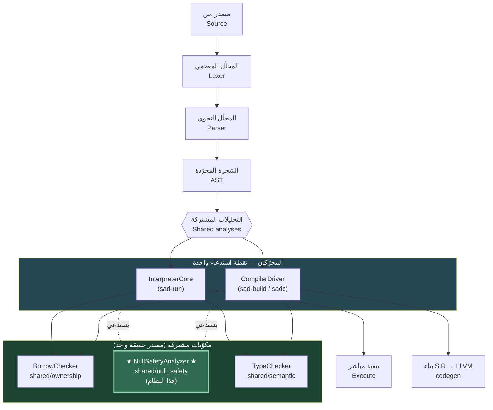
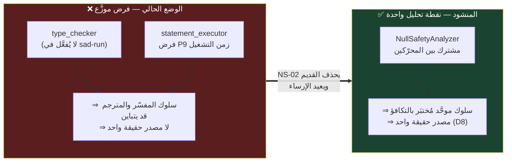
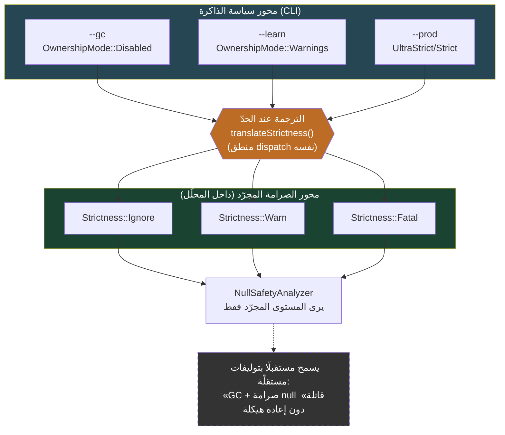
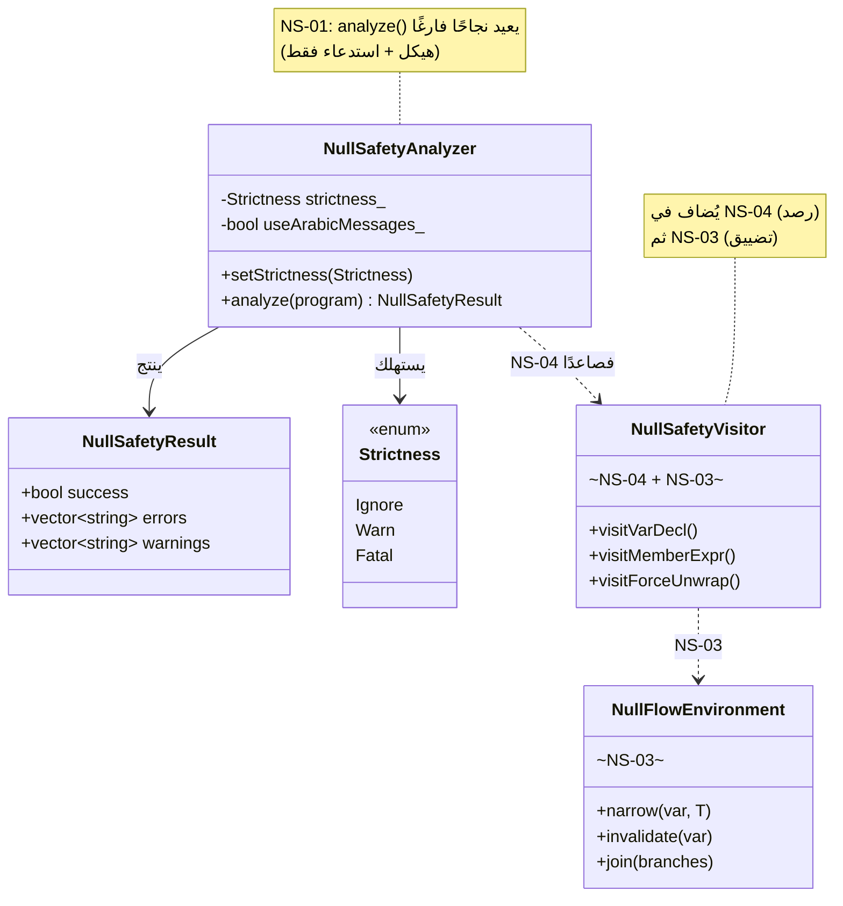
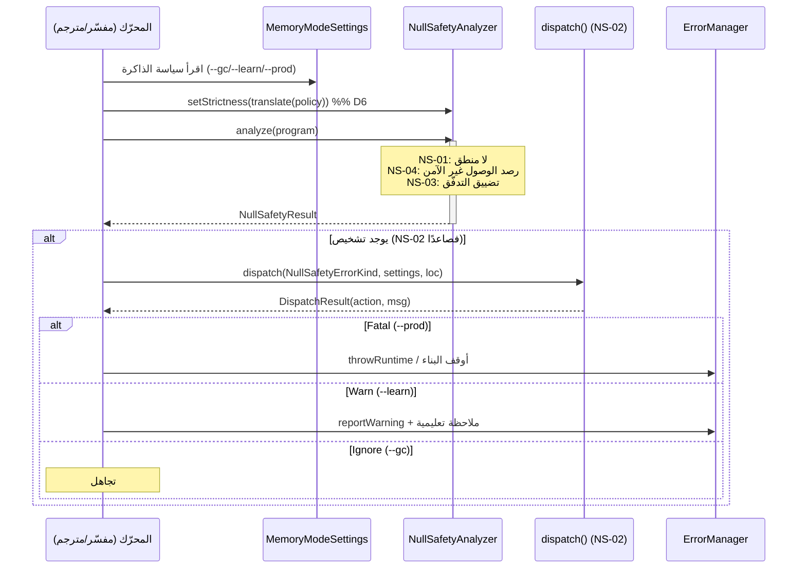
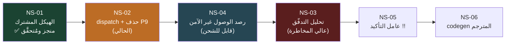
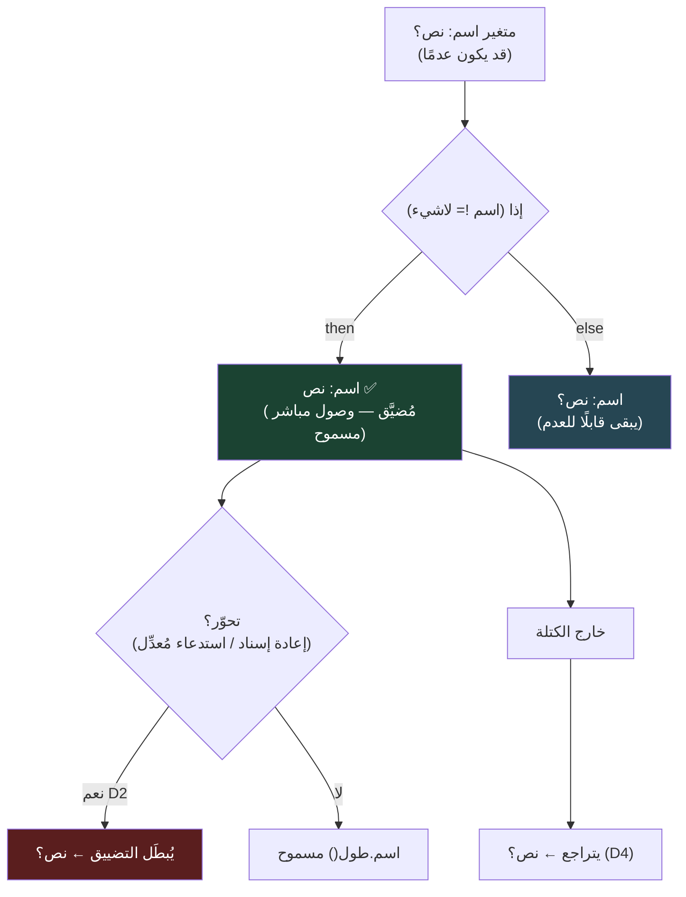
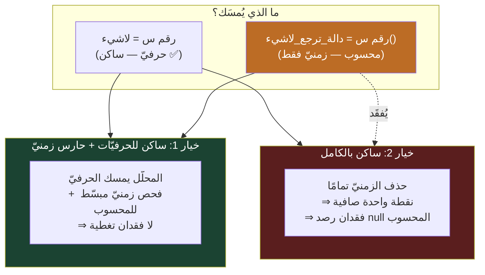
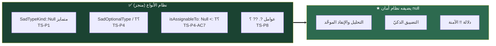

# نظام أمان null — الصورة الكاملة بالمخطّطات

> **الغرض:** توضيح بصريّ شامل لنظام أمان null في لغة ص — أين يقع، كيف يعمل،
> كيف تتدفّق البيانات، وكيف تترابط القصص والقرارات. مرجع موحَّد قبل التنفيذ.
>
> **مصدر الحقيقة للقرارات:** [ADR-NS-001](../decisions/ADR-NS-001-flow-analysis-scope-and-strictness.md)
> · **الترتيب:** [ROADMAP](ROADMAP.md) · **المعمارية:** [ARCHITECTURE](ARCHITECTURE.md)
> · **تاريخ:** 2026-06-20

---

## 1. أين يقع نظام أمان null في خطّ المعالجة؟

النظام **مكوّن مشترك واحد** (`NullSafetyAnalyzer`) يُستدعى من **كلا المحرّكين** —
المفسّر (`sad-run`) والمترجم (`sad-build`/sadc) — فالتحليل **مصدر حقيقة واحد** لا
يُكرَّر ولا يتباين بين المسارين (نظير `shared/ownership/borrow_checker`).

**النقطة الجوهرية:** السهم المنقّط من المحرّكين إلى `NullSafetyAnalyzer` يمثّل
الاستدعاء الموحَّد — أُرسِيَ في **NS-01** (بلا منطق بعد)، وتُبنى دلالته في القصص التالية.

---

## 2. الوضع الحالي vs المنشود (المشكلة التي يحلّها النظام)

---

## 3. فصل محورَي القرار (ADR-NS-001 D6) — الأهمّ بنيويًّا

محور **أمان null** منفصل داخليًّا عن محور **سياسة الذاكرة**، ولو شاركا واجهة اليوم.
المحلّل يأخذ **مستوى صرامة مجرّدًا** (`ignore/warn/fatal`) ولا يعرف أعلام الذاكرة.
الترجمة تحدث عند الحدود فقط.

> **استثناء `!!` (D7):** التأكيد عقدٌ صريح من المستخدم — يرمي خطأ كتالوج
> `NS_FORCE_UNWRAP_ON_NULL` زمن التشغيل على `عدم` **حتى في `--gc`** (لا يتبع هذا الجدول).

---

## 4. بنية المكوّن — الحالي (NS-01) وما يُضاف لاحقًا

---

## 5. تسلسل الاستدعاء — كيف يطلب المحرّكان التحليل

---

## 6. خريطة القصص والاعتمادات (مُعاد ترتيبها)

> **تبرير قلب NS-04↔NS-03:** الوصول الخام قيمة مستقلّة على أساس مستقرّ؛ بناء
> التضييق عالي المخاطرة فوق رصدٍ يعمل أأمن من العكس (إجماع Winston + Amelia).

---

## 7. تحليل التدفّق (NS-03) — كيف يضيّق النوع

**القيود (الموجة الأولى — ADR-NS-001 D1-D5):**
- **محلّيّات فقط** — لا حقول (`س.حقل`) ولا عبر الإغلاقات.
- **إبطال بالتحوّر** (D2)، **نقطة ثابتة للحلقات** (D3)، **خروج حتميّ للتضييق العكسي** (D4).
- **سليم-متحفّظ لا متفائل** (D5) — يضيّق أقلّ عند الشكّ (الأمان الزائف أخطر من غيابه).

---

## 8. سؤال نقل P9 (D8) — ساكن vs زمنيّ (قرار NS-02)

الفرض الحاليّ **زمن تشغيليّ** (يُقيّم القيمة ثم يفحص `isNull()`) فيمسك الحالتين.
المحلّل المشترك **ساكن** فلا يرى القيم المحسوبة زمنًا. هذا جوهر القرار:

> **حالة القرار:** مفتوح — يُحسَم قبل تنفيذ D8. يُسجَّل في ADR-NS-001 عند الحسم.
>
> 📊 **مقارنة معمّقة بـ5 لغات** (Kotlin/Swift/Dart/TypeScript/C# + Rust مرجعًا) لهذا القرار:
> [LANGUAGE_COMPARISON](LANGUAGE_COMPARISON.md) — تخلص إلى ترجيح الخيار 1 (ساكن للحرفيّات + حارس زمنيّ).

---

## 9. خريطة الكود (أين يعيش كل شيء)

| المكوّن | المسار | الحالة |
|--------|--------|--------|
| المحلّل المشترك (رأس) | `shared/null_safety/include/null_safety/null_safety_analyzer.h` | ✅ NS-01 |
| المحلّل المشترك (تنفيذ) | `shared/null_safety/src/null_safety_analyzer.cpp` | ✅ NS-01 |
| مكتبة CMake | `shared/null_safety/CMakeLists.txt` → `sad_null_safety` | ✅ NS-01 |
| استدعاء المفسّر | `interpreter/src/core/interpreter_core.cpp` | ✅ NS-01 |
| استدعاء المترجم | `tools/compiler/compiler_driver_analysis.cpp::run_null_safety()` | ✅ NS-01 |
| نقطة القرار | `shared/errors/include/builders/dispatch.h` (+ `NullSafetyErrorKind`) | ⏳ NS-02 |
| فرض P9 القديم (للحذف) | `interpreter/src/visitors/statement_executor.cpp:138` | ⏳ NS-02 (D8) |
| بيئة التدفّق | `shared/null_safety/` (`NullFlowEnvironment`) | ⏳ NS-03 |
| عامل `!!` | `ForceUnwrapExpr` عبر الطبقات | ⏳ NS-05 |

---

## 10. الأساس الجاهز (من نظام الأنواع — لا يُعاد)

---

> **ملاحظة:** المخطّطات بصيغة Mermaid تُعرَض تلقائيًّا على GitHub وفي mdBook.
> هذا الملف مرجع توضيحيّ؛ مصدر القرارات الملزِم يبقى [ADR-NS-001](../decisions/ADR-NS-001-flow-analysis-scope-and-strictness.md).
