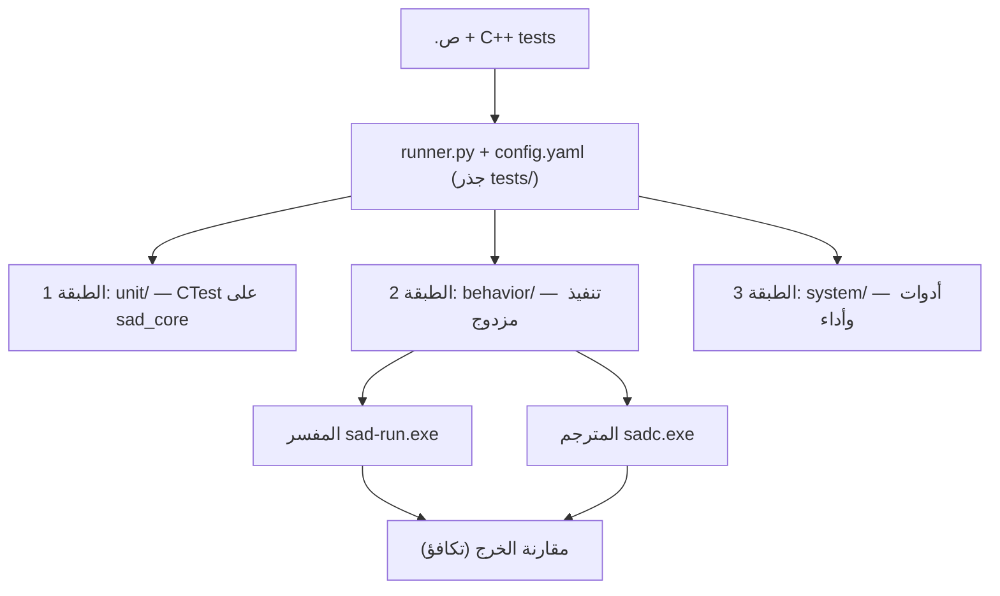

# Architecture — نظام الاختبارات الموحّد للغة ص

## 1. السياق

لغة ص لها ثلاثة محرّكات تنفيذ يجب أن يتطابق سلوكها: **المفسر** (`sad-run.exe`)،
**المترجم** (`sadc.exe` عبر SIR→LLVM)، و**الـ VM**. أي اختبار سلوكي يجب أن يثبت
التكافؤ بين المفسر والمترجم (ADR-03). بالإضافة لذلك توجد مكوّنات C++ معزولة
(Lexer/Parser/AST/SIR/Value) وأدوات مساندة (LSP، formatter، pkg، sadinfo، codegen).

## 2. القيود

- **C-01:** اختبار السلوك يجب أن يمرّ عبر المفسر *و* المترجم معاً (BF-08).
- **C-02:** لا تحرير يدوي لـ `*/generated/` — اختبارات codegen تتحقق من اتساق
  `language-truth/ → generated/` لا من تحرير المُولَّد.
- **C-03:** لا حذف اختبارات قديمة (GR-04) — أرشفة موثَّقة فقط.
- **C-04:** مسارات وأسماء عربية مدعومة (UTF-8) عبر كامل خط الاختبار.

## 3. القرارات المعمارية الرئيسية

(التفصيل في `decisions/`)

| ID | القرار | الحالة |
|---|---|---|
| ADR-001 | بنية ثلاث طبقات (unit / behavior / system) | PROPOSED |
| ADR-002 | محرّك التنفيذ المزدوج هو العمود الفقري لطبقة السلوك | ACCEPTED (مُعدَّل بـ ADR-004) |
| ADR-003 | `COVERAGE.md` لكل قسم لغوي كأداة تدقيق GR-01 | PROPOSED |
| ADR-004 | حتمية الخرج + أولوية قائمة على المخاطر | ACCEPTED |

## 4. المكونات



### الشجرة الكاملة المقترحة

```
tests/
├── README.md                    خريطة الطبقات + كيف تضيف اختباراً
├── runner.py                    المشغّل الموحّد (مُرقّى من dual_execution)
├── config.yaml                  المستويات P0→full + أقسام اللغة
│
├── unit/                        ── الطبقة 1: C++ معزول (CTest) ──
│   ├── lexer/                   ← يدمج: lexer_tests
│   ├── parser/                  ← يدمج: parser, parser_tests
│   ├── ast/
│   ├── types/                   ← Value, SadTypeKind (يدمج: type_system)
│   ├── sir/                     ← SIR builder/optimizer (يدمج: compiler/*)
│   ├── interpreter/             ← يدمج: interpreter_tests
│   ├── errors/                  ← كتالوج الأخطاء (يدمج: builtin_errors C++)
│   └── ownership/               ← يدمج: ownership, safety
│
├── behavior/                    ── الطبقة 2: القلب — .ص مزدوجة ──
│   ├── P0_smoke/                5 ملفات حرجة (كل commit)
│   ├── sections/                مقسّمة حسب أقسام اللغة الـ12
│   │   ├── 01_أساسيات_اللغة/
│   │   ├── 02_الأنواع_المدمجة/
│   │   ├── 03_البرمجة_الكائنية/
│   │   ├── 04_مطابقة_الأنماط/
│   │   ├── 05_معالجة_الأخطاء/
│   │   ├── 06_الدوال_المتقدمة/
│   │   ├── 07_التزامن/
│   │   ├── 08_ميزات_متقدمة/
│   │   ├── 09_المكتبة_القياسية/
│   │   ├── 10_الاستيراد/
│   │   ├── 11_سلبي/
│   │   └── 12_تكامل/
│   └── rules_matrix/            ← يدمج: spec_rules, compiler_rules
│
└── system/                      ── الطبقة 3: الأدوات والبنية ──
    ├── lsp/                     ← يدمج: lsp
    ├── formatter/
    ├── pkg/
    ├── sadinfo/                 ← يدمج: sadinfo
    ├── codegen/                 ← اتساق language-truth → generated
    ├── docs/                    ← يدمج: docs_extraction, doc_gen_dual_execution, توثيق
    ├── benchmark/               ← يدمج: benchmark(s), performance, stress
    └── fuzzing/                 ← يدمج: fuzzing
```

### بنية القسم السلوكي الموحّدة (FR-03)

```
behavior/sections/03_البرمجة_الكائنية/
├── 001_صنف_بسيط.ص              إيجابي — يُقارن خرجه (مفسر = مترجم)
├── 002_وراثة.ص
├── 015_امتداد.ص
├── _negative/                  سلبي — خطأ متوقع (رمز ErrorCode)
│   ├── 001_وصول_خاص.ص
│   └── 002_وراثة_دائرية.ص
├── COVERAGE.md                 جدول: كل كلمة/ميزة في القسم ↔ ملف اختبار
└── RISK.md                     درجة المخاطر (probability×impact) لكل ميزة (ADR-004)
```

وسوم التحكم في المقارنة (في رأس ملف `.ص` أو `.out`، حسب ADR-004):
- `@unordered` — يُفرز الخرج قبل المقارنة (التزامن — ترتيب goroutines غير حتمي).
- `@nondeterministic` — يُحوَّل لاختبار خصائص (وصول كل القيم، لا تكرار) لا مطابقة تسلسل.
- تساهل عائم بـ `epsilon` يُطبَّق تلقائياً على الأرقام العشرية (لأن `/` يُرجع عشري).

## 5. تدفقات البيانات

1. `runner.py` يقرأ `config.yaml` → يحدّد المجلدات حسب `--level`.
2. لكل `.ص` سلوكي: تشغيل عبر المفسر، ثم ترجمة+تشغيل عبر `sadc`، ثم مقارنة الخرج.
3. السلبي: يُتوقع فشل + مطابقة رمز الخطأ المتوقع (من ملف `.err` مصاحب).
4. الطبقة 1 و3: تُستدعى عبر CTest وتُجمَّع نتائجها في تقرير `runner.py` الموحّد.

## 6. واجهات (APIs)

```
python tests/runner.py --level P0            # دخان
python tests/runner.py --level P0.<قسم>      # دخان + قسم أثناء التطوير
python tests/runner.py --section <قسم>       # قسم واحد مباشرة
python tests/runner.py --level P1            # كل PR
python tests/runner.py --level full          # كل الطبقات الثلاث
python tests/runner.py --cpu moderate        # تحكم بقوة CPU
```

## 7. اعتمادات على أنظمة أخرى

- **error-messages** — الاختبارات السلبية تتحقق من `ErrorCode` من الكتالوج الموحّد.
- **builtin-functions** — اختبارات القسم 09 تغطّي الدوال المضمنة والطرق على الأنواع.
- **type-system** — اختبارات `unit/types/` و القسم 02.
- **living-documentation** — `system/docs/` يتحقق من تكافؤ الأمثلة في التوثيق.

## 8. اختبارات/جودة (مُحدَّث بـ ADR-004)

- بوابة عدم التراجع: `runner.py --level full` أخضر بعد كل خطوة ترحيل (NFR-02).
- تدقيق التغطية: مراجعة `COVERAGE.md` + `RISK.md` لكل قسم ضمن DoD أي ميزة جديدة.
- **هرم الاختبار (فضّل الأدنى):** lexer/parser/type-check منطقاً في `unit/`؛
  التنفيذ المزدوج محجوز للدلالات التشغيلية (ADR-004).
- **حتمية:** وضع تطبيع في المقارنة (فرز `@unordered`، تساهل عائم، عزل `@nondeterministic`).
- **بوّابة جودة الاختبار** (مستلهمة من تعريف DoD): كل اختبار `.ص` حتمي، معزول،
  بلا اعتماد على ترتيب تنفيذ الأقسام، وزمنه ضمن مهلة `config.yaml`.
- **burn-in:** أي اختبار جديد يُشغَّل 5× متتالية قبل دمجه لكشف الرفرفة مبكراً.
- **بوّابة قرار:** نتيجة المجموعة تُصنَّف PASS / CONCERNS / FAIL حسب درجات المخاطر
  المفتوحة (درجة 9 مفتوحة = FAIL).

## 8.1. تتبّع المتطلبات (Traceability — FR-12)

معرّف اختبار ثابت بصيغة `EPIC.STORY-LEVEL-SEQ` (مثل `OOP.03-E2E-001`) يربط كل
معيار قبول (AC) باختبار، فيُكشف أي AC بلا تغطية ويُمنع الادعاء بلا دليل (GR-01).

## 9. اعتبارات الأمان

- اختبارات `_negative/` و`fuzzing/` لا تنفّذ كوداً خارجياً غير موثوق؛ كلها `.ص` محلية.
- اختبارات الشبكة (`network`) تُعزل خلف علم تفعيل لتفادي نداءات خارجية في CI.

## 10. اعتبارات الأداء

- P0 ≤ 30 ثانية (NFR-01) عبر `max_parallel` و`cpu_presets` الموجودة في `config.yaml`.
- `benchmark/` و`stress/` خارج المسار الحرج — تُشغَّل في `full`/nightly فقط.
