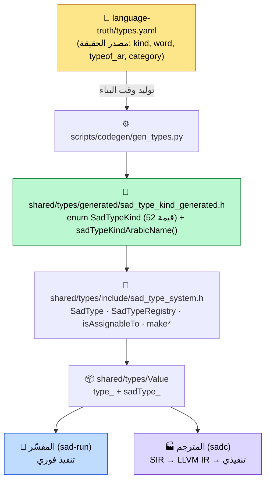
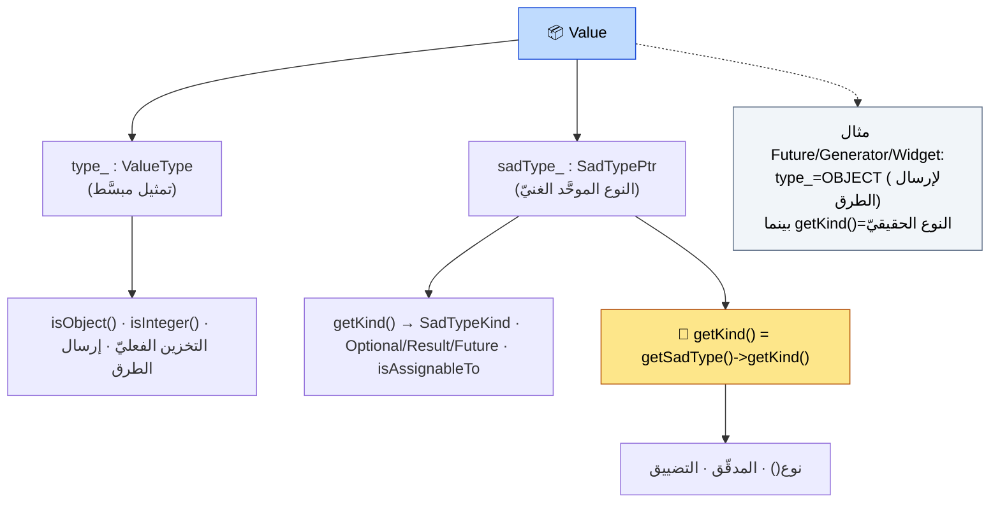
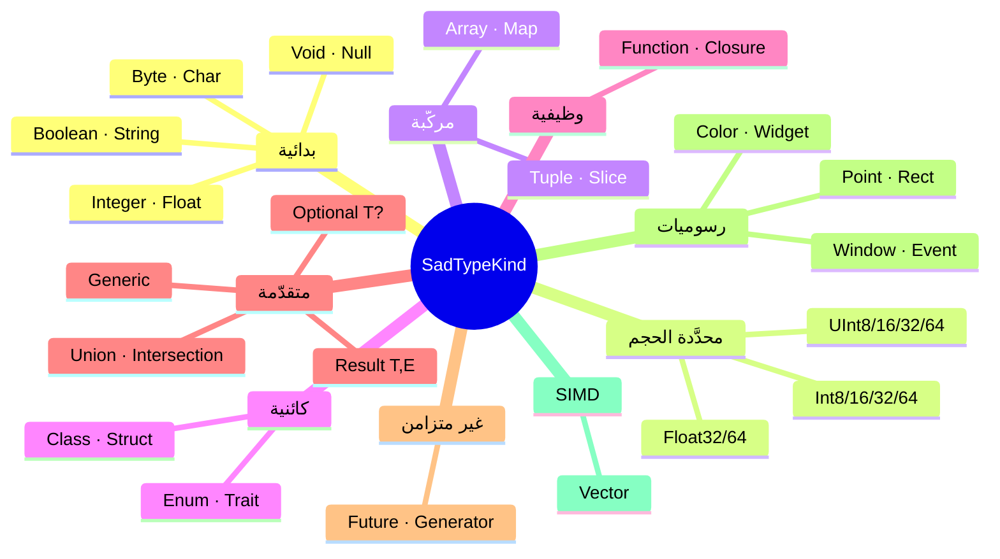
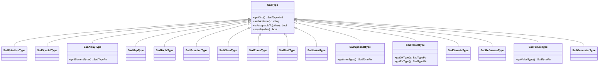
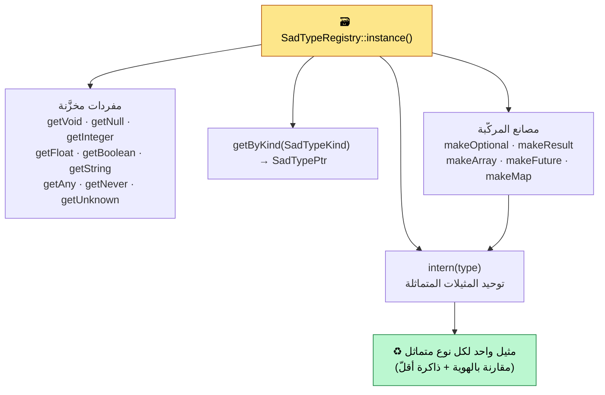
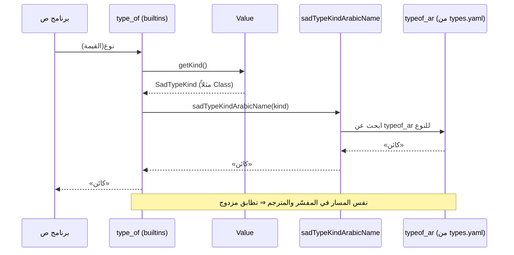
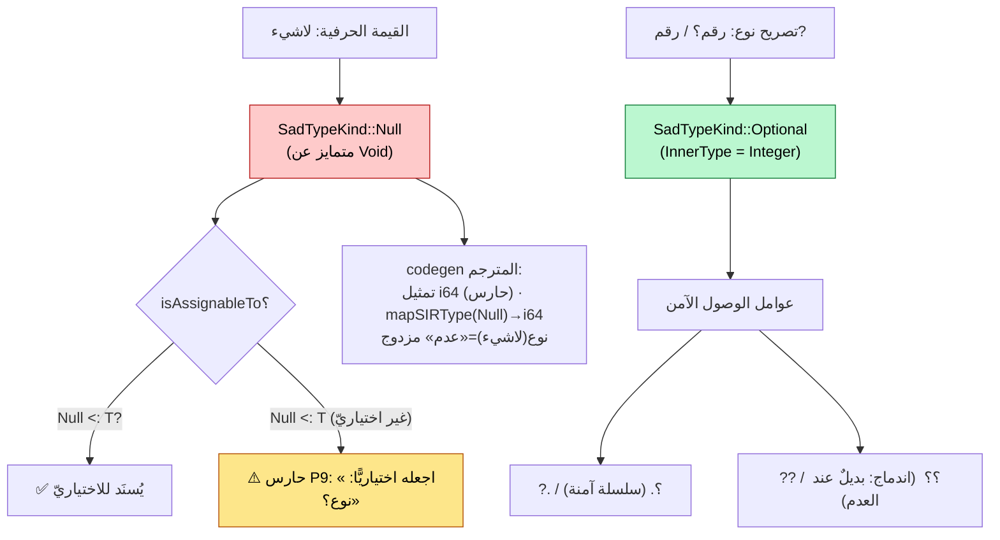
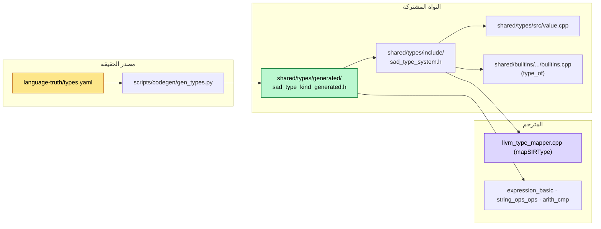

# خرائط نظام الأنواع البصرية — لغة ص

> **الغرض:** فهمٌ كاملٌ لنظام الأنواع الحاليّ ومساره عبر الكود، بمخططات بصرية غنيّة.
> كل مخطط يصف **الواقع الموجود** كما هو في الكود. (Mermaid — يُعرَض في VS Code/GitHub.)

---

## 1. الصورة الكبرى: من مصدر الحقيقة إلى المحرّكين

`SadTypeKind` يُولَّد من `types.yaml` ويُستهلَك في المفسّر **والمترجم** معًا — مصدرٌ واحد.



> 🔑 لإضافة نوع: عدّل `types.yaml` ثم أعد التوليد. الملفات تحت `generated/` لا تُحرَّر يدويًّا.

---

## 2. مسار الكود: من نصّ `.ص` إلى التنفيذ

أين «يعيش» النوع في كل مرحلة من خط الأنابيب:

```mermaid
flowchart LR
    SRC["📜 مصدر .ص"] --> LEX["🔤 LexerCore<br/>Token + Position"]
    LEX --> PARSE["🌲 ParserCore"]
    PARSE --> AST["🧱 AST<br/>كل عقدة: getTypeKind() → SadTypeKind"]

    AST --> INT["🌳 InterpreterCore"]
    AST --> SIRB["🏗️ SIRBuilder"]

    subgraph المفسّر [" المفسّر — تنفيذ فوري "]
        INT --> VALR["📦 Value<br/>type_ + sadType_"]
        VALR --> EXEC["▶️ تنفيذ + نوع()"]
    end

    subgraph المترجم [" المترجم — توليد تنفيذيّ "]
        SIRB --> OPT["🔧 SIROptimizer"]
        OPT --> LLVM["⚙️ LLVMCodeGen<br/>mapSIRType(SadTypeKind) → LLVM type"]
        LLVM --> EXE["📦 تنفيذيّ"]
    end

    style SRC fill:#fef3c7,stroke:#b45309,color:#000
    style AST fill:#bbf7d0,stroke:#15803d,color:#000
    style VALR fill:#bfdbfe,stroke:#1d4ed8,color:#000
    style LLVM fill:#ddd6fe,stroke:#6d28d9,color:#000
```

> المحرّكان يقرآن **نفس** `SadTypeKind`، فيتطابق سلوك الأنواع (مثل `نوع()`) بينهما.

---

## 3. القيمة `Value`: تمثيلان للنوع

`Value` يحمل تمثيلًا مبسَّطًا لوقت التشغيل (`type_`) وتمثيلًا غنيًّا موحَّدًا (`sadType_`).



| الحقل | يُجيب على | يُستخدم في |
|------|----------|-----------|
| `type_` (ValueType) | «كيف أُخزَّن وأُرسِل الطرق؟» | `isObject()`, التخزين، الإرسال |
| `sadType_` (SadTypePtr) | «ما نوعي الحقيقيّ؟» | `getKind()`, `نوع()`, المدقّق، الإسناد |

---

## 4. عائلة `SadTypeKind` (52 قيمة) — مُصنَّفة



> `Null` نوعٌ مستقلّ متمايز عن `Void`. الأنواع الرسوميّة `surface:false` (بنية تحتية لـSadUI).

---

## 5. هرمية أصناف `SadType` (التمثيل الغنيّ)

كل نوع غنيّ صنفٌ يرث `SadType` ويحمل أنواعه الداخلية (عنصر المصفوفة، داخل الاختياريّ…).



---

## 6. `SadTypeRegistry`: التجميع والمصانع

سجلٌّ واحد يحتفظ بمفردات الأنواع البدائية (singletons) ويجمّع (intern) المركّبة.



---

## 7. تدفّق `نوع()` — اسمٌ من مصدرٍ واحد

`نوع(قيمة)` يقرأ `getKind()` ثم يترجمه عبر `typeof_ar` المُولَّد — فيتطابق في المحرّكين.



أمثلة فعليّة: `نوع(42)`→«رقم» · `نوع("ن")`→«نص» · `نوع(لاشيء)`→«عدم» · `نوع(مستقبل())`→«مستقبل» · `نوع(زر())`→«كائن».

---

## 8. تدفّق null والاختياريّ (Null-safety الأساسيّ)



> التضييق المتقدّم (smart-cast) و`!!` جزءٌ من **نظام null-safety المستقلّ** (`_bmad-output/systems/null-safety/`).

---

## 9. خريطة الملفات (أين أعدّل ماذا)



| أُريد أن… | الملف |
|-----------|-------|
| أُضيف/أُعدّل نوعًا | `language-truth/types.yaml` ثم `gen_types.py` |
| أُضيف منطق إسناد/تباين | `shared/types/include/sad_type_system.h` (`isAssignableTo`) |
| أُعدّل تمثيل القيمة | `shared/types/src/value.cpp` (`getKind`, `setSadType`) |
| أُعدّل `نوع()` | `types.yaml` (`typeof_ar`) — لا سلاسل يدوية |
| أُعدّل توليد LLVM لنوع | `compiler/.../llvm_type_mapper.cpp` |

---

> 📖 مراجع: [ARCHITECTURE_TYPE_SYSTEM.md](./ARCHITECTURE_TYPE_SYSTEM.md) (تفصيل نصّيّ) ·
> [../README.md](../README.md) (الفهرس) · مهارة المطوّر: `.github/skills/sad-lang-dev/references/types-and-sir.md`.
