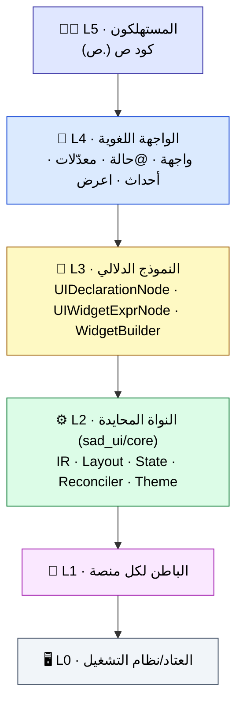
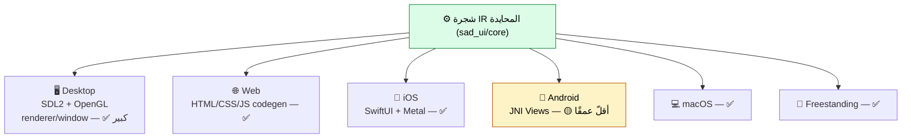
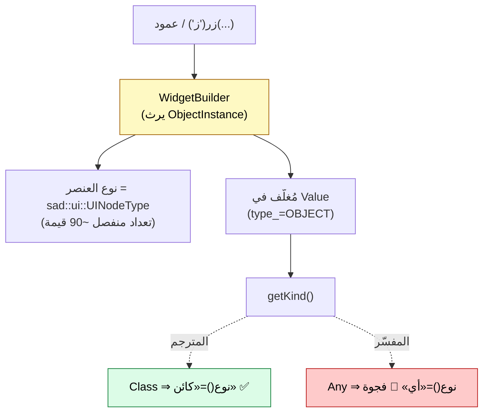
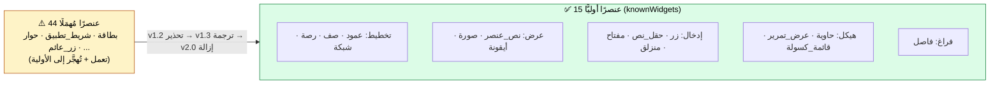
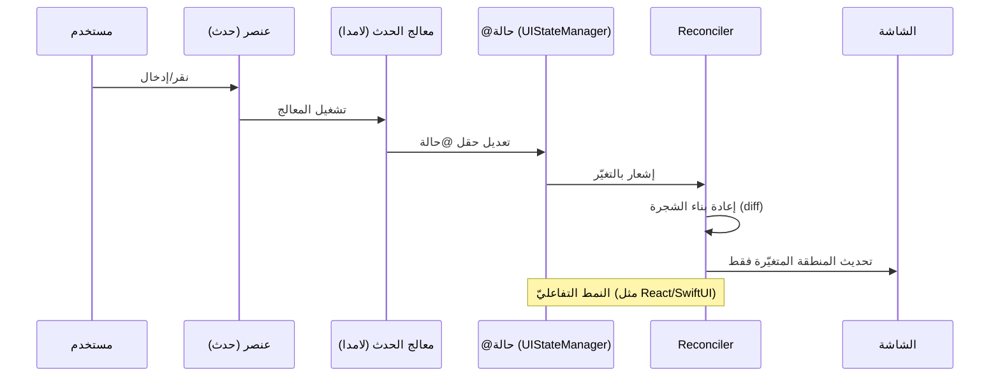
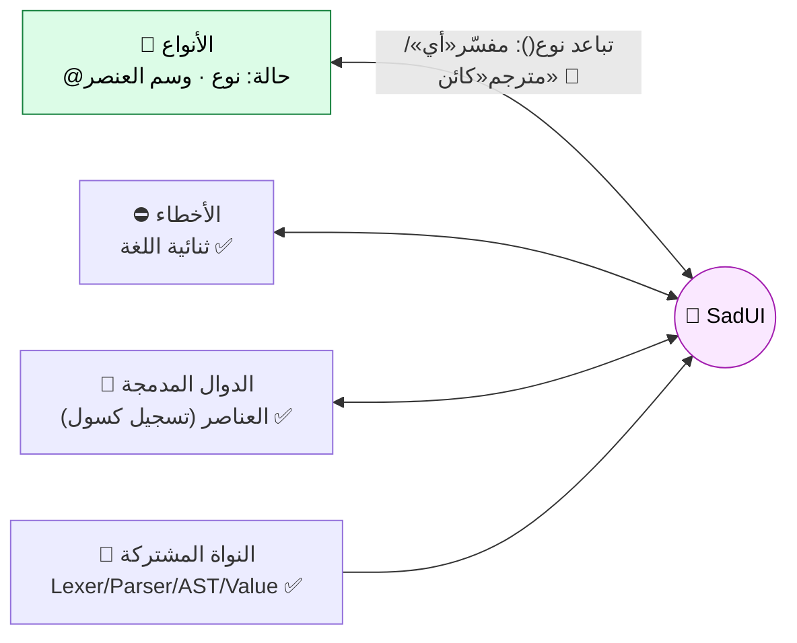
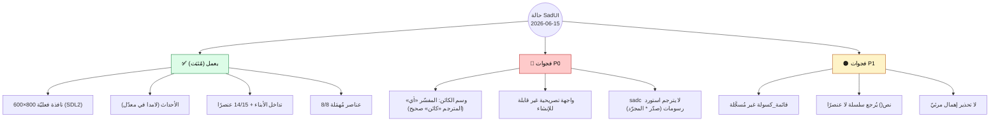

# المعمارية الموحَّدة لنظام الرسومات (SadUI) — بالمخططات البصرية

> **الغرض:** فهمٌ كامل لمعمارية نظام الرسومات الحاليّ ومساره عبر الكود، بمخططات Mermaid غنيّة سهلة الفهم.
> **آخر تحديث:** 2026-06-15. كل مخطط يصف **الواقع الموجود** في الكود.
> **مراجع:** [STRATEGY.md](../planning/STRATEGY.md) (الرؤية) · [status/DEEP_DIVE_2026-06-15.md](../status/DEEP_DIVE_2026-06-15.md) · [status/FUNCTIONAL_VERIFICATION_2026-06-15.md](../status/FUNCTIONAL_VERIFICATION_2026-06-15.md) (سلوك مُثبَت).

---

## 1. الصورة الكبرى — الطبقات الستّ

**مبدأ العزل:** كل طبقة تعرف ما تحتها فقط. النواة L2 **محايدة** (لا تعرف SDL2 ولا HTML)؛ الباطن L1 يترجم IR إلى تقنية المنصة.

---

## 2. مسار البيانات الكامل (عنصر `.ص` → شاشة)

```mermaid
flowchart LR
    SRC["📜 .ص<br/>عمود(زر('ز'))"] --> LEX["🔤 Lexer"]
    LEX --> P["🌲 Parser<br/>parseWidgetExpression(Typed)<br/>parseUIDeclaration"]
    P --> N["🧱 عقد AST<br/>UIWidgetExprNode<br/>UIDeclarationNode"]
    N --> EVAL["▶️ المفسّر<br/>widget_builtins → WidgetBuilder"]
    EVAL --> BR["🌉 ui_bridge<br/>convertToIR(Value)"]
    BR --> IR["⚙️ شجرة IRNode<br/>(sad_ui/core)"]
    IR --> RND["🎨 الباطن<br/>renderer / codegen"]
    RND --> SCR["🖥️ نافذة 800×600<br/>(مُثبَت SDL2 ✅)"]

    style SRC fill:#fef3c7,stroke:#b45309,color:#000
    style IR fill:#dcfce7,stroke:#15803d,color:#000
    style SCR fill:#bfdbfe,stroke:#1d4ed8,color:#000
```

> المسار التصريحيّ في `ui_nodes.h`: `Parser → UIDeclarationNode → UIVisitor → UINode Tree → Backend`.

---

## 3. الباطن متعدّد المنصّات (L1)

> ستّ منصّات في الكود (مكتب/ويب/iOS/أندرويد/macOS/freestanding). إضافة منصة = باطن جديد يستهلك IR دون لمس النواة.

---

## 4. تمثيل العنصر زمن التشغيل (L3)

> التصنيف الغنيّ للعناصر يعيش في `UINodeType` (منفصل عن `SadTypeKind`). فجوة P0 مؤكَّدة:
> المفسّر يَسِم قيمة الكائن `Any` (نوع=«أي») بينما المترجم `Class` (نوع=«كائن» — المرجع الصحيح).

---

## 5. كتالوج العناصر: 15 أوليًّا + المُهمَل (ADR-UI-02)

---

## 6. الحالة التفاعلية وإعادة البناء (@حالة)

---

## 7. التكامل مع أنظمة لغة ص

---

## 8. خريطة الجاهزية (ما يعمل / الفجوات) — مُثبَت بالتشغيل

---

## 9. خريطة الملفات (أين أعدّل ماذا)

| الطبقة | الملف/المجلد | الدور |
|--------|--------------|------|
| L4 المحلّل | `shared/parser/src/ui/parser_ui.cpp` | `knownWidgets` · `parseWidgetExpression(Typed)` · `parseUIDeclaration` |
| L3 العقد | `shared/ast/include/ui_nodes.h` | `UIDeclarationNode` · `UIWidgetExprNode` |
| L3 الجسر | `interpreter/src/ui/` | `ui_bridge` · `widget_builtins` · `widget_builder` · `ui_state_builtins` |
| L2 النواة | `sad_ui/core/` (28 ملف) | IR · `types.h` (`UINodeType`) · layout · state · reconciler |
| L1 الباطن | `sad_ui/backends/*` + `compiler/.../platform/ui_ops.cpp` | renderer/codegen لكل منصة |
| التكامل | `interpreter/src/builtins/builtin_registry.cpp:767` | تسجيل العناصر كسولًا عند `استورد رسومات` |

---

> هذه الوثيقة معماريّة-بصريّة موحَّدة؛ للسلوك المُثبَت بالتشغيل والفجوات المرتَّبة راجع
> [FUNCTIONAL_VERIFICATION_2026-06-15.md](../status/FUNCTIONAL_VERIFICATION_2026-06-15.md).
