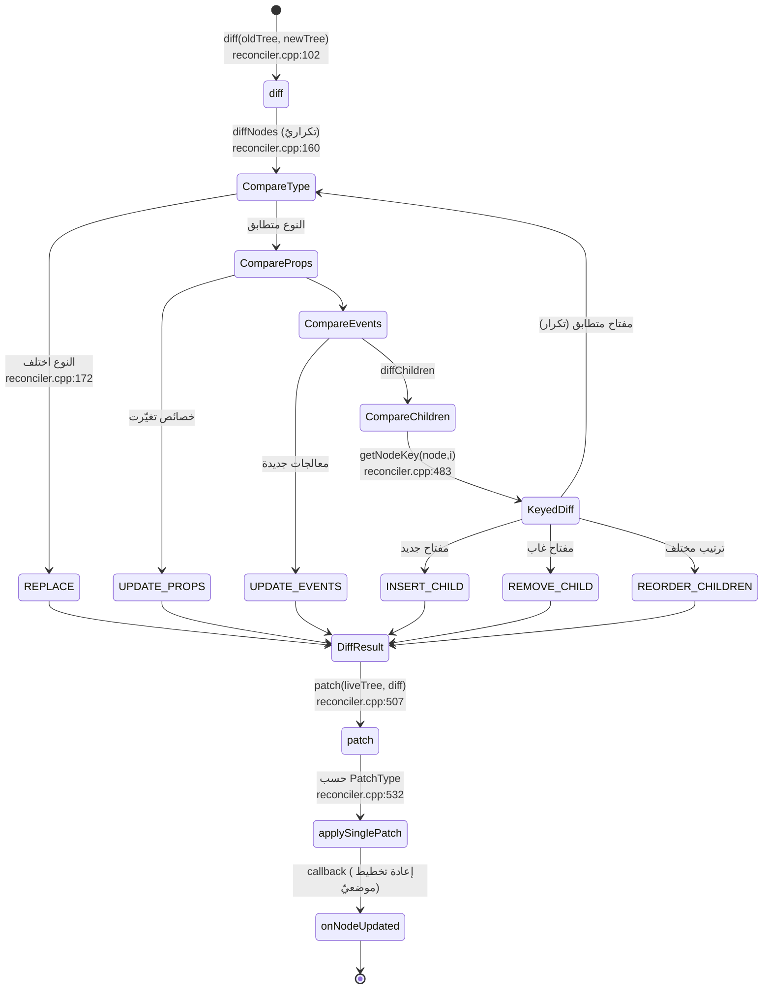
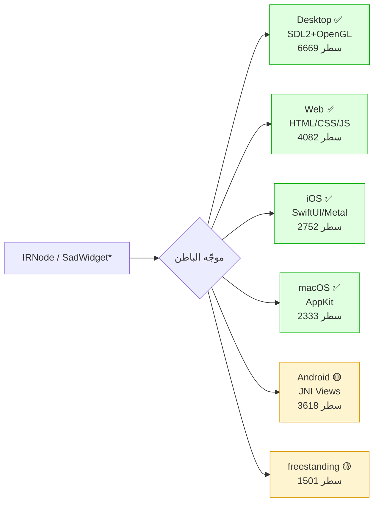
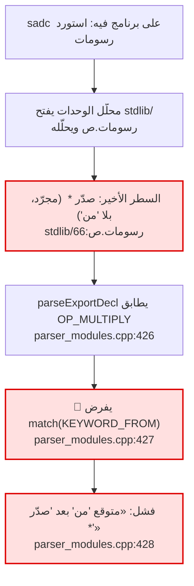
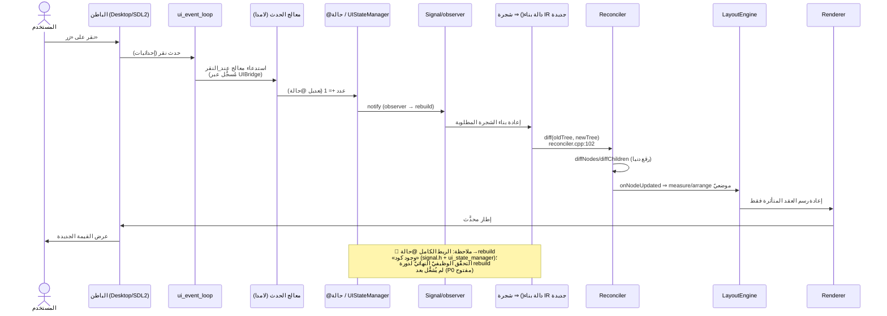

> ## إقرار حوكمي (GR-01)
> - **السياسة الحاكمة:** قرأتُ `_bmad-output/governance/1-policy/README.md` و`PROJECT_MANAGEMENT_FRAMEWORK.md` (PMF v1.9.1). المبدأ الملزِم: **GR-01 — لا ادّعاء «منفّذ» إلا بدليل** (مسار ملف + رقم سطر + اقتباس). ما لم يُشغَّل في هذه الجولة يُسمّى «وجود كود / استنتاج من قراءة المسار» لا «سلوك مُثبَت».
> - **آخر تقرير تحقّق مرجعيّ:** `FUNCTIONAL_VERIFICATION_2026-06-15.md` (تشغيل فعليّ، 8 نقاط) + `DEEP_DIVE_2026-06-15.md` (قياس ساكن). هذا التقرير **يتتبّع المسار** ويُحدّد المواضع الدقيقة لفجوات P0، **ويصحّح** أحد استنتاجات DEEP_DIVE حول جذر فجوة `صدّر *` (انظر §7.3).
> - **السبرنت الحالي:** `SPRINT_CURRENT.md` = Sprint #1 من حقبة Execution Layer (2026-05-22→05-29؛ ستوريات B-002/B-009/B-010). **هذا التقرير توثيقيّ فقط — خارج نطاق ستوريات السبرنت، لا يحمل قفلًا، ولا يعدّل كودًا.**
> - **التاريخ (من الجهاز):** `Get-Date -Format "yyyy-MM-dd"` ⇒ **2026-06-17**.
> - **منهجية هذه الجولة:** قراءة كود ساكنة فقط (لم يُبنَ المشروع ولم تُشغَّل اختبارات). السلوكيات المُشغَّلة منقولة موثّقةً من تقرير 2026-06-15.

---

## 0. الخلاصة التنفيذية

نظام SadUI **مكتمل البنية على مستوى الكود** عبر ستّ طبقات يمكن تتبّعها سطرًا بسطر من المصدر `.ص` حتى الباطن المنصّيّ. البنية التحتية للرسم **حيّة ومُثبَتة وظيفيًّا** (نافذة SDL2 فعلية 800×600، تقرير 2026-06-15). الفجوات الحرجة الثلاث (P0) **ليست في طبقة الرسم بل في طبقة الوسم/الربط**، وقد حدّدتُ في هذا التقرير **الموضع الدقيق** لكلٍّ منها:

1. **`نوع(عنصر)`=«أي» في المفسّر** ← جذرها سطر واحد: `shared/types/src/value.cpp:217-218` (منشئ `Value(ObjectPtr)` يضبط `sadType_=getAny()`).
2. **`واجهة` تصريحية لا تُنشأ بـ`اسم()`** ← مسار التسجيل سليم (`statement_executor_oop_struct_test.cpp:580`) ومسار النداء له fallback (`expression_evaluator_calls_dispatch.cpp:423-444`)، فالعلّة في **توقيت/توفّر التسجيل وقت النداء** لا في غيابه المعماريّ.
3. **`sadc` يفشل على `استورد رسومات`** ← جذرها `shared/parser/src/declarations/parser_modules.cpp:426-428` (المحلّل يرفض `صدّر *` المجرّد)، ويظهر فقط في المترجم لأن المفسّر **لا يحلّل** `رسومات.ص` أصلًا (وحدة أصليّة).

---

## 1. مسار البيانات الكامل (flowchart)

```mermaid
flowchart TD
    SRC["📄 كود ص (.ص)<br/>عمود(زر(\"ابدأ\").عند_النقر(لامدا() ... نهاية)) نهاية"]

    subgraph L1["① الطبقة المعجمية/النحوية — shared/parser"]
        LEX["Lexer<br/>(الترميز)"]
        PUI["ParserCore::parseWidgetExpression<br/>parser_ui.cpp:426"]
        PMOD["parseModifierChain<br/>parser_ui.cpp:525"]
        PEVT["parseUIEventHandler<br/>parser_ui.cpp:604"]
        PCHILD["parseWidgetChildren<br/>parser_ui.cpp:667"]
        PDECL["parseUIDeclaration (واجهة)<br/>parser_ui.cpp:237"]
        KNOWN["knownWidgets(15) / containerWidgets(7)<br/>knownEvents(7) / deprecatedWidgets(44)<br/>parser_ui.cpp:67-175"]
    end
    SRC --> LEX --> PUI --> PMOD --> PEVT
    PUI --> PCHILD
    PUI -.->|isKnownWidget| KNOWN

    subgraph L2["② AST — shared/ast/include/ui_nodes.h"]
        AST_W["UIWidgetExprNode"]
        AST_M["UIModifierNode"]
        AST_E["UIEventHandlerNode (ARROW/BLOCK/LAMBDA)"]
        AST_D["UIDeclarationNode + UIStateDecl"]
        AST_C["UIConditionalNode / UILoopNode"]
    end
    PUI --> AST_W
    PMOD --> AST_M
    PEVT --> AST_E
    PDECL --> AST_D
    PCHILD --> AST_C

    AST_W -->|المفسّر| INTERP
    AST_W -->|المترجم| COMPILE

    subgraph INTERP["③أ المفسّر — interpreter/src/ui"]
        WBF["مصانع العناصر (ماكرو)<br/>widget_builtins.cpp:57,78"]
        WB["WidgetBuilder : ObjectInstance<br/>يغلّف IRNode<br/>widget_builder.cpp:47"]
        VAL["🔴 Value(ObjectPtr)<br/>value.cpp:217 → sadType_=Any<br/>⇒ نوع()=«أي»"]
        MODCHAIN["سلسلة المعدّلات تُعدّل IRNode<br/>(method chaining)"]
        BRIDGE["UIBridge::convertNodeToIR<br/>ui_bridge.cpp:398<br/>يستخرج IRNode مباشرة"]
        WBF --> WB --> VAL
        WB --> MODCHAIN --> BRIDGE
    end

    subgraph COMPILE["③ب المترجم — compiler"]
        SIR["BuiltinBuilder::buildBuiltinSystem_UI<br/>builtins_ui.cpp:31<br/>BUILTIN_UI_COLUMN ..."]
        LLVM["UICodeGen::emitUi*<br/>backend/llvm/.../ui_ops.cpp<br/>نداءات sad_column / sad_button"]
        RT["runtime/sad_ui_runtime.cpp<br/>SadWidget* opaque"]
        SIR --> LLVM --> RT
    end

    subgraph CORE["④ النواة sad_ui/core"]
        IR["IRNode (شجرة العناصر)<br/>include/sad_ui/ir.h"]
        RECON["Reconciler (Virtual DOM)<br/>reconciler.cpp:102 diff / 507 patch"]
        LAYOUT["LayoutEngine::measure/arrange<br/>layout.cpp (Flex/Grid/Stack)"]
        SIGNAL["Signal / property_binding<br/>command_queue / ui_event_loop"]
    end
    BRIDGE --> IR
    RT --> IR
    IR --> RECON --> LAYOUT --> SIGNAL

    subgraph BE["⑤ الباطنات — sad_ui/backends"]
        D["🖥️ Desktop — SDL2+OpenGL ✅<br/>6669 سطر"]
        W["🌐 Web — HTML/CSS/JS ✅<br/>4082 سطر"]
        I["📱 iOS — SwiftUI/Metal ✅<br/>2752 سطر"]
        M["🍎 macOS — AppKit ✅<br/>2333 سطر"]
        A["🤖 Android — JNI Views 🟡<br/>3618 سطر"]
        F["⚙️ freestanding 🟡<br/>1501 سطر"]
    end
    SIGNAL --> D & W & I & M & A & F

    D --> SCREEN["🖼️ الشاشة (نافذة 800×600 مُثبَتة فعليًّا)"]

    classDef gap fill:#ffe0e0,stroke:#d00,stroke-width:2px;
    classDef warn fill:#fff4d0,stroke:#d90,stroke-width:2px;
    class VAL gap;
    class A,F warn;
```

---

## 2. الطبقة ① — المعجمية/النحوية (مُتحقَّقة)

**الملفات:** `shared/parser/src/ui/parser_ui.cpp` (1029 سطر) + `shared/parser/src/ui/parser_ui_maps.cpp`.

> **تصحيح للقياس الساكن 2026-06-15:** ادّعى DEEP_DIVE أن `parser_ui_maps.cpp` **غير موجود**. القياس الحاليّ (2026-06-17): **الملف موجود** بجوار `parser_ui.cpp` (مؤكَّد بـ`ls shared/parser/src/ui/`). تباين تقادمَ بعد ذلك التاريخ.

| الدالة | السطر | الدور (اقتباس من الكود) |
|--------|-------|------------------------|
| `isKnownWidget` | `parser_ui.cpp:187` | يفحص `knownWidgets` ثم `deprecatedWidgets`؛ المُهمل يطبع تحذيرًا (`std::cerr ... "مُهمل"` سطر 200-205) ويُعيد `true` |
| `parseUIDeclaration` | `parser_ui.cpp:237` | `واجهة اسم [يرث أب] ... نهاية` ⇒ `UIDeclarationNode` (سطر 248) |
| `parseUIStateDecl` | `parser_ui.cpp:339` | `@حالة/@ربط/@بيئة/@محسوب` ⇒ `UIStateDecl` (سطر 405) |
| `parseWidgetExpression` | `parser_ui.cpp:426` | عنصر + وسائط مسماة/موضعية + معدّلات + أبناء |
| `parseModifierChain` | `parser_ui.cpp:525` | `('.' IDENT '(' args ')')*`؛ يميّز الحدث بـ`knownEvents.count(modName)` (سطر 547) |
| `parseUIEventHandler` | `parser_ui.cpp:604` | 3 صيغ: LAMBDA (سطر 609)، ARROW `=>` (سطر 624)، BLOCK (سطر 633) |
| `parseWidgetExpressionTyped` | `parser_ui.cpp:725` | نسخة مُنمَّطة تُرجع `UIWidgetExprNode` مباشرة (ADR-UI-07) |
| `parseUIConditional` | `parser_ui.cpp:810` | `إذا (شرط) ... وإلا ... نهاية` (ADR-UI-01) |
| `parseUILoop` | `parser_ui.cpp:916` | `لكل ... في ...` و`بينما (...)` (ADR-UI-01) |

**المجموعات (مُقتبَسة):**
- `knownWidgets` = **15 عنصرًا** أوليًّا (`parser_ui.cpp:67-81`): تخطيط 4 + عرض 3 + إدخال 4 + هيكل 3 + فراغ 1.
- `deprecatedWidgets` = **44 عنصرًا** مُهملًا → بديله الأوليّ (`parser_ui.cpp:100-160`).
- `containerWidgets` = **7** (`parser_ui.cpp:164-168`).
- `knownEvents` = **7** (`parser_ui.cpp:172-175`): `عند_النقر`، `عند_الضغط_المطول`، `عند_السحب`، `عند_التحويم`، `عند_التغيير`، `عند_الظهور`، `عند_الإرسال`.

🟡 **علّة P1 (تحذير الإهمال غير مرئيّ وظيفيًّا):** التحذير موجود في الكود (`parser_ui.cpp:200`) لكن تقرير 2026-06-15 نقطة 8 رصد أن `بطاقة()` تُنشأ **بلا تحذير مرئيّ** عند التشغيل. التحذير يُطبع على `std::cerr` ضمن `isKnownWidget` — يُستدعى داخل `parseWidgetChildren` (سطر 674) لكن **لا يُستدعى في `parseWidgetExpression`** (المسار الجذريّ للعنصر المنفرد لا يمرّ بـ`isKnownWidget`). فجوة مسار، لا غياب رسالة.

---

## 2.5 العناصر المدعومة — الكتالوج الكامل (مُقتبَس من الكود)

> **المصدر:** `shared/parser/src/ui/parser_ui.cpp:67-175` (التعريف النحويّ) +
> `interpreter/src/ui/widget_builtins.cpp` (مصانع المفسّر). النموذج: **15 عنصرًا
> أوليًّا مدعومًا** (ADR-UI-02) + **44 عنصرًا مُهملًا** يُترجَم إلى بديله الأوليّ.

### 2.5.1 العناصر الأوليّة الـ15 (المدعومة رسميًّا)

| # | العنصر | الفئة | حاوية؟ | مصنع المفسّر | ملاحظة (مُتحقَّقة) |
|---|--------|------|:------:|--------------|---------------------|
| 1 | `عمود` | تخطيط | ✅ | `Bw::COLUMN` (`widget_builtins.cpp:164`) | يرتّب الأبناء عموديًّا |
| 2 | `صف` | تخطيط | ✅ | ✅ مسجّل | يرتّب الأبناء أفقيًّا |
| 3 | `رصة` | تخطيط | ✅ | ✅ مسجّل | تراكب (stack) |
| 4 | `شبكة` | تخطيط | ✅ | ✅ مسجّل | شبكة |
| 5 | `نص` | عرض | ❌ | ⚠️ **المصنع اسمه `نص_عنصر`** (`:110`) | 🟠 `نص(...)` يُرجع **سلسلة** لا عنصرًا — العنصر هو `نص_عنصر` (التباس أسماء) |
| 6 | `صورة` | عرض | ❌ | ✅ مسجّل | — |
| 7 | `أيقونة` | عرض | ❌ | ✅ مسجّل | — |
| 8 | `زر` | إدخال | ❌ | ✅ مسجّل | يقبل أحداثًا (`عند_النقر`...) |
| 9 | `حقل_نص` | إدخال | ❌ | ✅ مسجّل | — |
| 10 | `مفتاح` | إدخال | ❌ | ✅ مسجّل | مفتاح تبديل |
| 11 | `منزلق` | إدخال | ❌ | ✅ مسجّل | شريط تمرير قيمة |
| 12 | `حاوية` | هيكل | ✅ | ✅ مسجّل | غلاف عام بخلفية/حدود |
| 13 | `عرض_تمرير` | هيكل | ✅ | ✅ مسجّل | منطقة قابلة للتمرير |
| 14 | `قائمة_كسولة` | هيكل | ✅ | 🔴 **بلا مصنع** | P1: نداؤها ⇒ `SEM004` (البديل المُهمل `عمود_كسول` مسجّل `:293`) |
| 15 | `فاصل` | فراغ | ❌ | ✅ مسجّل | مسافة/فاصل |

**الحاويات (تقبل أبناء) = 7:** `عمود`، `صف`، `رصة`، `شبكة`، `حاوية`، `عرض_تمرير`،
`قائمة_كسولة` (`parser_ui.cpp:164-168`).

**حالة الإنشاء الوظيفيّة (تشغيل 2026-06-15):** **14/15** عنصرًا تُنشأ بعد
`استورد رسومات`؛ الوحيد الفاشل `قائمة_كسولة` (بلا مصنع).

### 2.5.2 الأحداث المدعومة الـ7

`عند_النقر`، `عند_الضغط_المطول`، `عند_السحب`، `عند_التحويم`، `عند_التغيير`،
`عند_الظهور`، `عند_الإرسال` (`parser_ui.cpp:172-175`). تُرفَق في سلسلة المعدّلات
بثلاث صيغ: لامدا، سهم `=>`، كتلة.

### 2.5.3 العناصر المُهملة الـ44 (تعمل بتحذير → بديل أوليّ)

خريطة الهجرة (`parser_ui.cpp:100-160`، ADR-UI-02): كل عنصر قديم يُترجَم إلى عنصر
أوليّ. **مرحلة 1 (الحاليّة):** يعمل + تحذير (🟡 التحذير غير مرئيّ في مسار العنصر
المنفرد — §2 أعلاه). مرحلة 2: ترجمة تلقائيّة. مرحلة 3 (v2.0): إزالة.

| البديل الأوليّ | العناصر المُهملة المُوجَّهة إليه |
|----------------|-----------------------------------|
| `نص` | `نص_منسق` |
| `زر` | `زر_نصي`، `زر_محدد`، `زر_أيقونة`، `زر_عائم` |
| `حقل_نص` | `منطقة_نص`، `منتقي`، `منتقي_تاريخ`، `منتقي_وقت`، `منتقي_لون`، `شريط_بحث` |
| `مفتاح` | `خانة_اختيار`، `زر_راديو` |
| `حاوية` | `وسط`، `حشوة`، `محاذاة`، `موسع`، `مرن`، `مقاس`، `نسبة_عرض`، `بطاقة`، `سطح`، `صندوق`، `هيكل`، `شريط_تطبيق`، `درج`، `ورقة_سفلية`، `شريط_إشعار`، `تلميح`، `شريط_تقدم`، `تقدم_دائري`، `شارة`، `رقاقة` |
| `صف` | `التفاف`، `تنقل_سفلي`، `تبويبات`، `شريط_تقييم` |
| `رصة` | `ملاح`، `حوار` |
| `عمود` | `قائمة_خيارات` |
| `شبكة` | `جدول_بيانات` |
| `فاصل` | `فاصل_خط` |
| `قائمة_كسولة` | `قائمة_عرض`، `عمود_كسول` |

> **ملاحظة تكافؤ:** هذه القائمة (44) تخصّ **طبقة النحو/المفسّر**. نواة `sad_ui`
> تُعرّف ~90 نوع عقدة IR (تباين موثّق في §5/§9) — ليست كلها مكشوفة كعناصر `.ص`.

---

## 3. الطبقة ② — AST (مُتحقَّقة)

**الملف:** `shared/ast/include/ui_nodes.h`.

- `UIStateKind` (سطر 74): `STATE/BINDING/ENVIRONMENT/COMPUTED`.
- `UIEventKind` (سطر 97): `ARROW/BLOCK/LAMBDA`.
- العقد: `UIStateDecl`، `UIWidgetExprNode`، `UIModifierNode`، `UIEventHandlerNode`، `UIDeclarationNode`، `UIConditionalNode`، `UILoopNode`.
- نمط الزائر: `UIDeclarationNode::accept` ⇒ `visitor.visitUIDeclaration(*this)` (سطر 609). تعليق المسار في الرأس نفسه: «Parser → UIDeclarationNode → UIVisitor → UINode Tree → Backend» (سطر 33).

---

## 4. الطبقة ③أ — المفسّر + 🔴 موضع علّة «أي» (مُتحقَّق قطعيًّا بالكود)

**الملفات:** `interpreter/src/ui/{widget_builtins.cpp, widget_builder.cpp/.h, ui_bridge.cpp}`.

### 4.1 مصانع العناصر
كل عنصر يُبنى بماكرو في `widget_builtins.cpp`:
- `MAKE_SIMPLE_WIDGET_FN` (سطر 57) و`MAKE_WIDGET_WITH_PROP_FN` (سطر 78): `auto *builder = new WidgetBuilder(UINodeType::nodeType)` ثم `return std::make_shared<Data::Value>(static_cast<Data::ObjectInstance *>(builder))` (سطر 70-71، 94-95).

### 4.2 WidgetBuilder
`widget_builder.cpp:47` — المنشئ يضبط `fields["__class__"] = Value("__WidgetBuilder__")` (سطر 52) ويغلّف `IRNode` (سطر 48). **لا يضبط `sadType_` ولا أي وسم نوعيّ** (تأكَّد: `grep setSadType|sadType_|SadTypeKind` على `widget_builder.cpp` ⇒ **لا تطابق**).

### 4.3 🔴 الجذر الدقيق لفجوة P0 «نوع()=أي»
المسار: `نوع(زر())` ⇒ `type_of` (`shared/builtins/src/runtime/builtins.cpp:585-586`):
```cpp
return std::make_shared<Data::Value>(
    std::string(Types::sadTypeKindArabicName(args[0]->getKind())));
```
و`Value::getKind()` (`shared/types/src/value.cpp:1811-1820`):
```cpp
if (sadType_) { return sadType_->getKind(); }
return type_;
```
والمنشئ الذي يلفّ كل WidgetBuilder (`shared/types/src/value.cpp:217-218`):
```cpp
Value::Value(ObjectPtr obj)
    : sadType_(reg().getAny()), type_(ValueType::OBJECT), data_(obj)
```
**النتيجة الحتميّة:** `sadType_` ليس null بل = **`getAny()`**، فيُرجع `getKind()` ⇒ `SadTypeKind::Any` ⇒ `sadTypeKindArabicName(Any)="أي"` (`shared/types/generated/sad_type_kind_generated.h:68,135`). **هذا يطابق المُشاهَدة المُشغَّلة 2026-06-15 (`نوع(نقطة(5))`=«أي») ويفسّرها بسطر واحد.**

> **تناقض داخليّ مُوثَّق (يدعم تشخيص P0):** الماكرو نفسه يكشف الأبناء بـ`arg->getKind() == SadTypeKind::Class` (`widget_builtins.cpp:65, 89`) — لكن بما أن `Value(ObjectPtr)` يَسِم كل كائن بـ`Any`، فهذا الفحص **لا يصمد للعناصر** (يصمد فقط للكائنات الموسومة `Class` صراحةً عبر `ClassType::createInstance`). أي أن إضافة الأبناء عبر هذا المسار معرّضة للفشل — التركيب الفعليّ ينجح لأن المسار الموثّق للأبناء هو `addChildBuilder` المُستدعى من المحلّل/الجسر لا من فحص النوع. **الإصلاح المقترح للمنفّذ:** وسم WidgetBuilder بـ`SadTypeKind::Class` (أو `Widget` إن فُعّلت خانة SoT) عند اللفّ في Value.

### 4.4 الجسر وتشغيل التطبيق (مُتحقَّق + مُثبَت وظيفيًّا)
- `UIBridge::run` (`ui_bridge.cpp:97`) — `convertNodeToIR(widget, 0)` (سطر 394) ثم `convertNodeToIR` (سطر 398) يستخرج `IRNode` من WidgetBuilder بحارس عمق.
- نقطة الدخول `تشغيل_تطبيق` (`ui_core_builtins.cpp:215-239`): تُنشئ `UIBridge bridge; bridge.run(rootWidget, ...)`.
- ✅ **مُثبَت وظيفيًّا 2026-06-15 (نقطة 6):** نافذة فعلية 800×600 (SDL2)، خروج نظيف.

---

## 5. الطبقة ④ — النواة sad_ui (مُتحقَّقة)

**الموقع:** `sad_ui/core/include/sad_ui/` (28 ملف `.cpp` ≈ 10790 سطر).

### 5.1 Reconciler (Virtual DOM)
**الرأس:** `reconciler.h`؛ **التنفيذ:** `reconciler.cpp` (729 سطر).


- 8 أنواع رقع `PatchType` (`reconciler.h:76-86`).
- الرقع مرتّبة **الأعمق أولًا** لتجنّب تعارض الأفهرسة (`reconciler.h:151`).
- مقارنة بالمفاتيح (id) ثم بالفهرس عند غياب المفاتيح (`reconciler.h:38`، `getNodeKey` سطر 483).

### 5.2 LayoutEngine
`layout.h:166` — `class LayoutEngine`؛ `measure` (سطر 201) + متخصّصات: `measureColumn/Row/Grid/Stack/Wrap/ScrollView/Leaf` (سطر 204-222)، و`arrange` (سطر 227). نموذج Flex/Grid.

### 5.3 بقية النواة (وجود كود)
`ir.h`، `signal.h`، `property_binding.h`، `command_queue.h`، `ui_event_loop.h/.cpp`، `state.h`، `style.h`، `theme.h`، `gesture.h`، `animation.h`، `focus.h`، `accessibility.h` — كلها قائمة في `sad_ui/core/include/sad_ui/`.

---

## 6. الطبقة ⑤ — الباطنات المنصّيّة (قياس وجود كود)



| الباطن | المسار | الأسطر (قياس 2026-06-17) | الحالة |
|--------|--------|:---:|--------|
| Desktop | `sad_ui/backends/desktop/` | 6669 | ✅ منفّذ + **مُثبَت رسمًا** (نافذة فعلية) |
| Web | `sad_ui/backends/web/` | 4082 | ✅ منفّذ |
| iOS | `sad_ui/backends/ios/` | 2752 | ✅ منفّذ |
| macOS | `sad_ui/backends/macos/` | 2333 | ✅ موجود (غير موثّق في المصفوفة القديمة) |
| Android | `sad_ui/backends/android/` | 3618 | 🟡 موجود/عمق أقل (تصنيف يحتاج تدقيقًا) |
| freestanding | `sad_ui/backends/freestanding/` | 1501 | 🟡 موجود (غير موثّق في المصفوفة القديمة) |

> الأرقام مطابقة لقياس DEEP_DIVE 2026-06-15 (إعادة قياس عبر `find ... -name "*.cpp" -o -name "*.mm" | wc -l`). مصفوفة الدعم `platform_support_matrix.md` تغطّي **4 منصّات فقط** (لا macOS/freestanding) وتعكس «تغطية إنشاء العنصر» لا الصحّة البصريّة.

---

## 7. الطبقة ③ب — المترجم sadc + 🔴 علّة `صدّر *` المجرّد

### 7.1 مسار توليد UI في المترجم (موجود)
- `BuiltinBuilder::buildBuiltinSystem_UI` (`compiler/src/frontend/builders/builtins_ui.cpp:31`) يحوّل نداء العنصر إلى `SIROpcode::BUILTIN_UI_COLUMN` ... (مثال `عمود()` سطر 44-51 يُرجع `SadTypeKind::Pointer`).
- `UICodeGen::emitUi*` (`compiler/src/backend/llvm/builders/platform/ui_ops.cpp`) يولّد نداءات `sad_column/sad_button...`.
- وقت التشغيل: `runtime/sad_ui_runtime.cpp`.

### 7.2 🔴 الجذر الدقيق لفشل `استورد رسومات` في المترجم
المسار:

- `stdlib/رسومات.ص:66` السطر الأخير = **`صدّر *`** مجرّدًا (ملف توثيقيّ؛ تعليقه سطر 13-14: «جميع الدوال مسجلة كدوال مدمجة في C++ ... هذا الملف للتوثيق فقط»).
- `parser_modules.cpp:426-428` (`parseExportDecl`):
  ```cpp
  if (match(TT::OP_MULTIPLY)) {
      if (!match(TT::KEYWORD_FROM)) {
          error("(AR) متوقع 'من' بعد 'صدّر *'. ...");
  ```
  المحلّل يدعم فقط `صدّر * من <وحدة>` (إعادة تصدير ⇒ `ReExportStmt`)، **لا** التصدير الشامل المجرّد للوحدة الحاليّة.

### 7.3 ⚠️ تصحيح استنتاج DEEP_DIVE/التحقّق 2026-06-15
ادّعى التقريران أن «**المفسّر يقبل** `صدّر *` المجرّد بينما المترجم يرفضه» — مُوحيًا بمحلّلين مختلفين. **القراءة الساكنة تصحّح السبب:** المحلّل **واحد مشترك** (لا يوجد `parseExportDecl` ثانٍ — تأكَّد بالبحث). الفرق الحقيقيّ:
- **المفسّر لا يحلّل `رسومات.ص` إطلاقًا:** عند `استورد رسومات`، `statement_executor_modules.cpp:384` يفحص `isBuiltinModule("رسومات")` ⇒ true ⇒ `loadModule` يسجّل الدوال أصليًّا من C++ — **فلا يفتح الملف `.ص`** فلا يُحلَّل السطر 66.
- **المترجم يحلّل الملف:** محلّل وحدات المترجم يفتح `رسومات.ص` ويحلّله، فيصطدم بالسطر 66 ⇒ يفشل.

**الأثر:** برامج SadUI تعمل في المفسّر فقط؛ المترجم محجوب عند الاستيراد نفسه. **الإصلاح الأدقّ:** إمّا (أ) دعم `صدّر *` المجرّد في `parseExportDecl` (يخدم أي وحدة)، أو (ب) جعل المترجم يعامل `رسومات` كوحدة أصليّة (مثل المفسّر) فلا يحلّل ملفها.

---

## 8. دورة حدث تفاعليّ (sequenceDiagram)



---

## 9. الفجوات مرتَّبة بالأولوية (كل فجوة بدليلها)

| # | الأولوية | الفجوة | الدليل الدقيق (ملف:سطر) | الطبقة |
|---|---------|--------|--------------------------|--------|
| 1 | 🔴 P0 | `نوع(عنصر/كائن)`=«أي» في المفسّر (المترجم صحيح=«كائن») | جذرها سطر واحد: `shared/types/src/value.cpp:217-218` (`Value(ObjectPtr)` ⇒ `sadType_=getAny()`)؛ المسار: `builtins.cpp:585` + `value.cpp:1811-1820`؛ WidgetBuilder بلا وسم: `widget_builder.cpp:47-57` | ③أ المفسّر |
| 2 | 🔴 P0 | `واجهة` تصريحية لا تُنشأ بـ`اسم()`/`اسم() جديد` (SEM004) | التسجيل **موجود وسليم**: `statement_executor_oop_struct_test.cpp:503-580` (`registerClass`)؛ النداء له fallback صنفيّ: `expression_evaluator_calls_dispatch.cpp:423-444`؛ فشل `getClass` وقت النداء: `expression_evaluator_oop_new.cpp:127,142`. ⇒ علّة **توقيت/توفّر** التسجيل لا غيابه؛ يحتاج بناءً بآثار طباعة للحسم | ③أ المفسّر |
| 3 | 🔴 P0 | `sadc` يفشل على `استورد رسومات` | الجذر: `shared/parser/src/declarations/parser_modules.cpp:426-428` (رفض `صدّر *` المجرّد)؛ المُشغِّل: `stdlib/رسومات.ص:66`؛ سبب اختلاف المفسّر: `statement_executor_modules.cpp:384` (وحدة أصليّة لا تُحلَّل) | ① المحلّل / ③ب المترجم |
| 4 | 🟠 P1 | `قائمة_كسولة` (عنصر أوليّ) غير مُسجَّلة كمصنع | مُعرَّفة نحويًّا `parser_ui.cpp:78` لكن لا مصنع لها في `widget_builtins.cpp` (لا `LazyList`/`قائمة_كسولة` في المصانع)؛ مرصودة تشغيليًّا 2026-06-15 نقطة 1 (SEM004) | ③أ المفسّر |
| 5 | 🟠 P1 | التباس `نص()` (سلسلة) مقابل `نص_عنصر` (العنصر) | `نوع(نص("ن"))`=«نص» (2026-06-15 نقطة 2)؛ المصنع النصيّ مربوط بـ`Text` تحت اسم آخر (`widget_builtins.cpp:109`) | ① المحلّل / ③أ |
| 6 | 🟠 P1 | تحذير الإهمال غير مرئيّ في مسار العنصر المنفرد | التحذير في `parser_ui.cpp:200` يُستدعى من `parseWidgetChildren:674` لا من `parseWidgetExpression:426` | ① المحلّل |
| 7 | 🟡 P1 | تباين النواة (≈90 `UINodeType`) مقابل الـ15 الأولية | `sad_ui/core/include/sad_ui/types.h` (`_Count`≈90)؛ مصانع/مولّدات لعناصر خارج الـ15 (FAB/Card/Dialog في `ui_ops.cpp`) | ④/⑤ |
| 8 | 🟡 P2 | باطنا macOS/freestanding غير موثّقين في مصفوفة الدعم | `platform_support_matrix.md` يغطّي 4 منصّات؛ الباطنان قائمان (2333/1501 سطر) | ⑤ |

---

## 10. ما ثبت إيجابًا (مزيج: مُثبَت وظيفيًّا + وجود كود)

1. ✅ **مُثبَت وظيفيًّا (2026-06-15):** `تشغيل_تطبيق(...)` ينشئ نافذة فعلية 800×600 — البنية التحتية للرسم حيّة.
2. ✅ **مُثبَت وظيفيًّا:** الأحداث `.عند_النقر(لامدا() ... نهاية)`، تداخل الأبناء، 14/15 عنصرًا أوليًّا، 8/8 عناصر مُهملة.
3. ✅ **وجود كود مُتحقَّق:** المحلّل ناضج (9 دوال + 4 مجموعات)، AST كامل، Reconciler (diff/patch/keyed)، LayoutEngine (Flex/Grid/Stack)، 6 باطنات، مسار SIR/LLVM في المترجم.
4. ✅ **مرجع الأنواع:** المترجم يَسِم الكائن `Class` فيُرجع «كائن» صحيحًا — **هو المرجع الصحيح** لإصلاح فجوة P0 #1.

---

## 11. مرجع الأدلّة (ملفّات تُتبِّعت في هذه الجولة)

- **المحلّل:** `shared/parser/src/ui/parser_ui.cpp` (1029)، `shared/parser/src/ui/parser_ui_maps.cpp`، `shared/parser/src/declarations/parser_modules.cpp:419-438`، `shared/parser/src/core/parser_main.cpp:476-483`.
- **AST:** `shared/ast/include/ui_nodes.h`.
- **المفسّر:** `interpreter/src/ui/{widget_builtins.cpp, widget_builder.cpp/.h, ui_bridge.cpp, ui_core_builtins.cpp}`؛ `interpreter/src/visitors/{statement_executor_oop_struct_test.cpp:503, expression_evaluator_calls_dispatch.cpp:423, expression_evaluator_oop_new.cpp:110}`؛ `interpreter/src/core/interpreter_core.cpp:356`؛ `interpreter/src/visitors/statement_executor_modules.cpp:384`.
- **الأنواع:** `shared/builtins/src/runtime/builtins.cpp:572-587`؛ `shared/types/src/value.cpp:217-218,1811-1820`؛ `shared/types/generated/sad_type_kind_generated.h:68,135`.
- **النواة:** `sad_ui/core/include/sad_ui/{reconciler.h, layout.h}`؛ `sad_ui/core/src/{reconciler.cpp:102,160,483,507, layout.cpp}`.
- **المترجم:** `compiler/src/frontend/builders/builtins_ui.cpp:31`؛ `compiler/src/backend/llvm/builders/platform/ui_ops.cpp`؛ `runtime/sad_ui_runtime.cpp`.
- **الباطنات:** `sad_ui/backends/{desktop,web,ios,macos,android,freestanding}/`.
- **stdlib:** `stdlib/رسومات.ص:66`.

---

## 12. عدّاد مخطّطات Mermaid

| # | النوع | الموضوع | §|
|---|-------|---------|--|
| 1 | flowchart | مسار البيانات الكامل (.ص → 6 طبقات → شاشة) مع علامات الفجوات | §1 |
| 2 | stateDiagram | خوارزمية Reconciler (diff/patch/keyed) | §5.1 |
| 3 | flowchart | الباطنات الستّ وحالتها | §6 |
| 4 | flowchart | جذر فشل `صدّر *` المجرّد في المترجم | §7.2 |
| 5 | sequenceDiagram | دورة حدث تفاعليّ (نقر → @حالة → reconcile → رسم) | §8 |

**المجموع: 5 مخطّطات** (flowchart ×3، stateDiagram ×1، sequenceDiagram ×1)، مع علامات 🔴/🟡 على مواضع الفجوات في المسار.

---
*تتبّع ساكن لمسار الكود 2026-06-17 — Amelia (bmad-agent-dev). الالتزام: GR-01. توثيق فقط — لا تعديل كود إنتاج.*
