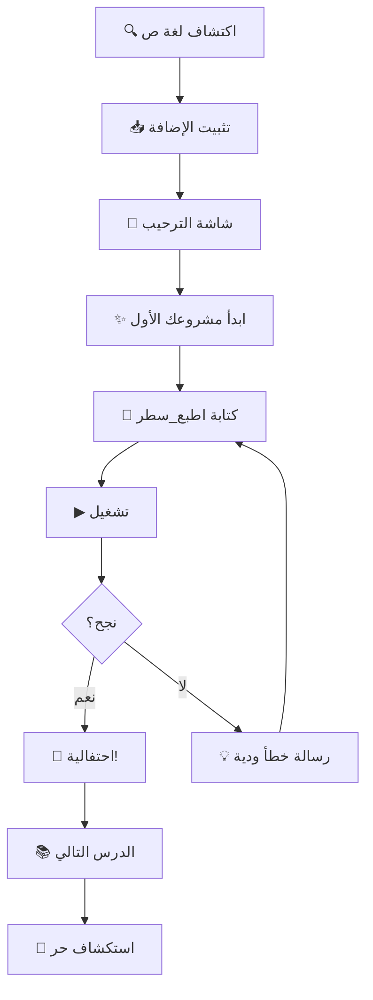
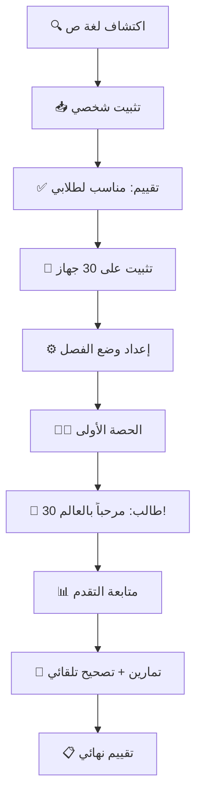

# وثيقة رحلات المستخدمين — إضافة لغة ص لـ VS Code

**الإصدار:** 1.0.0
**التاريخ:** 2026-04-19
**الحالة:** مسودة معتمدة

---

## 1. الملخص التنفيذي

هذه الوثيقة تحدد **4 رحلات مستخدم تفصيلية** لإضافة لغة ص لـ VS Code، مستندة إلى:
- تحليل UX عاطفي (Sally)
- تقييم جدوى تقنية (Bob)
- مصفوفة أولويات تجارية (Mo)
- سيناريوهات فشل واختبار (Eve)
- خطة تنفيذ مرحلية (PM)

### الشخصيات الأربع

| الرمز | الاسم | العمر | الخبرة | الهدف |
|-------|-------|-------|--------|-------|
| UJ-1 | أحمد | 16 سنة | مبتدئ | كتابة أول برنامج بالعربية |
| UJ-2 | منى | 28 سنة | 5 سنوات | بناء مشروع حقيقي إنتاجي |
| UJ-3 | أ. خالد | 42 سنة | معلم حاسب | تدريس 30 طالباً البرمجة |
| UJ-4 | سارة | 24 سنة | 3 سنوات | نشر حزم على sila-hub |

### القرار الاستراتيجي

> **أحمد أولاً، ثم خالد يجلب الباقي.**
> — خلاصة جلسة BMAD Party Mode

### ربط المتطلبات (Traceability)

| متطلب الرحلة | يُربط بـ FR في PRD الإضافة | ملاحظات |
|-------------|--------------------------|--------|
| UJ1-FR1 (Onboarding) | جديد — يضاف كـ FR-EXT-20 | غير موجود في PRD الحالي |
| UJ1-FR5 (Error Humanizer) | NFR-6.2 (رسائل خطأ عربية) | يحوّل NFR إلى FR قابل للتنفيذ |
| UJ2-FR1 (Go to Definition) | MVP-0: IntelliSense أساسي | تعميق للمتطلب الموجود |
| UJ3-FR1 (وضع الفصل) | جديد — يضاف كـ FR-EXT-21 | **scope جديد تماماً** — يحتاج موافقة |
| UJ3-FR2 (جلسة فصل) | جديد — يضاف كـ FR-EXT-22 | يعتمد على UJ3-FR1 |
| UJ4-FR2 (Publish Wizard) | MVP-2: متجر الحزم (sila-hub.dev) | تعميق للمتطلب الموجود |
| SHARED-FR1 (EventBus) | جديد — بنية تحتية مشتركة | **تبعية مسبقة** لـ Telemetry |

> ⚠️ المتطلبات الجديدة (FR-EXT-20 إلى FR-EXT-22) يجب إضافتها إلى `prd-vscode-extension.md`

### البنية التحتية المسبقة: نظام الأحداث (EventBus)

قبل Sprint 1، نحتاج بناء `event_bus.ts` — نظام أحداث خفيف يخدم:
- **القياس (Telemetry):** تتبع تقدم المستخدم لقياس KPIs
- **تقارير المعلم:** تجميع بيانات تقدم الطلاب
- **تحسين UX:** تحديد نقاط التعثر الفعلية

```typescript
// أحداث Sprint 1
EventBus.emit('onboarding.started', {})
EventBus.emit('onboarding.first_run_success', { timeMs: number })
EventBus.emit('onboarding.celebration_shown', {})
EventBus.emit('error.shown', { original: string, humanized: boolean })

// أحداث Sprint 2+
EventBus.emit('classroom.session_created', { teacherId: string })
EventBus.emit('classroom.student_joined', { sessionId: string })
EventBus.emit('classroom.exercise_completed', { studentId: string, lesson: number })
EventBus.emit('publish.package_published', { name: string, version: string })
```

**المعمارية:**
```
src/features/
├── core/
│   └── event_bus.ts       ← جديد — Sprint 0
├── onboarding/            ← جديد — Sprint 1
│   ├── welcome_view.ts
│   ├── first_project.ts
│   └── celebration.ts
├── language/
│   ├── error_humanizer.ts ← جديد — Sprint 1 (ملف مستقل)
│   └── error_lens.ts      ← تعديل — يستدعي error_humanizer
```

---

## 2. رحلة أحمد — "أول برنامج بالعربية" (UJ-1)

### 2.1 البطاقة الشخصية

- **الاسم:** أحمد
- **العمر:** 16 سنة
- **الموقع:** الرياض، المملكة العربية السعودية
- **الخبرة:** جرّب Python في المدرسة — شعر بحاجز اللغة الإنجليزية
- **الدافع:** يريد بناء لعبة بسيطة — بلغته
- **المزاج التقني:** متحمس لكن يُحبط بسرعة عند الأخطاء
- **الأجهزة:** Windows 11، لوحة مفاتيح عربية
- **اقتباس:** _"ليش ما أقدر أبرمج بالعربي؟"_

### 2.2 الرحلة التفصيلية

```
المرحلة 0: الاكتشاف
━━━━━━━━━━━━━━━━━━━━
→ يسمع عن "لغة ص" من صديق أو YouTube
→ يبحث "لغة برمجة عربية" في Google
→ يجد sad-lang.org
→ يرى "جرّب الآن في المتصفح" (Playground)
→ يجرّب — يطبع "مرحباً" — ✨ اللحظة السحرية الأولى

المرحلة 1: التثبيت
━━━━━━━━━━━━━━━━━━━━
→ يثبّت VS Code (إن لم يكن موجوداً)
→ يبحث "لغة ص" في Extensions Marketplace
→ ينقر "Install" — ثانيتان
→ 🎯 تظهر شاشة الترحيب (Welcome View) تلقائياً

المرحلة 2: البداية الأولى (الدقيقة السحرية)
━━━━━━━━━━━━━━━━━━━━━━━━━━━━━━━━━━━━━━━━━━
→ شاشة الترحيب تعرض: "مرحباً! هل تريد كتابة أول برنامج؟"
→ زر كبير: [✨ ابدأ مشروعك الأول]
→ يُنشأ ملف "رئيسي.ص" بكود جاهز:
   اطبع_سطر("مرحباً بالعالم! 🌍")
→ زر أخضر كبير: [▶ شغّل]
→ يرى النتيجة في الطرفية: "مرحباً بالعالم! 🌍"
→ 🎉 رسالة احتفالية: "مبروك! كتبت أول برنامج بالعربية!"

المرحلة 3: التعلم المتدرج
━━━━━━━━━━━━━━━━━━━━━━━━━━
→ شريط الترحيب يقترح: "هل تريد تعلم المزيد؟"
→ يدخل الدرس الأول: المتغيرات
→ يقرأ الشرح بالعربية → يطبّق التمرين
→ ينقر "تحقق" → ✅ أو 💡 تلميح ودي
→ يتقدم: شروط → حلقات → دوال → مصفوفات

المرحلة 4: الاستكشاف الحر
━━━━━━━━━━━━━━━━━━━━━━━━━━━
→ يكتب كوداً حراً — الإكمال الذكي يساعده بالعربية
→ يخطئ — رسالة ودية: "💡 نسيت إغلاق القوس — كلنا ننساها!"
→ يحفظ كوده → يشاركه مع صديقه
→ يعود غداً...
```

### 2.3 اللحظات السحرية (Magic Moments)

| اللحظة | الوصف | الشعور المستهدف |
|--------|-------|----------------|
| ✨ MM-1 | أول `اطبع_سطر` يعمل | "الحاسوب يتكلم لغتي!" |
| ✨ MM-2 | الإكمال الذكي يقترح بالعربية | "الأداة تفهمني" |
| ✨ MM-3 | رسالة خطأ ودية بالعربية | "الخطأ مو مشكلة — أقدر أصلحه" |
| ✨ MM-4 | إنهاء أول درس تعليمي | "أنا فعلاً أتعلم!" |
| ✨ MM-5 | بناء أول برنامج من الصفر | "أنا مبرمج!" |

### 2.4 نقاط الألم المحتملة

| النقطة | الخطورة | الحل |
|--------|---------|------|
| لا يعرف أين يبدأ بعد التثبيت | 🔴 حرجة | Onboarding Wizard تلقائي |
| رسالة خطأ بالإنجليزية من المترجم | 🔴 حرجة | Error Humanizer — طبقة ترجمة |
| إكمال ذكي ناقص أو خاطئ | 🟡 عالية | اختبارات شاملة للإكمال |
| لا يعرف كيف يحفظ/يشارك كوده | 🟡 عالية | أزرار حفظ ومشاركة واضحة |
| ملل من الدروس النصية | 🟡 متوسطة | تمارين تفاعلية + أمثلة مرئية |

### 2.5 المتطلبات الوظيفية

| الرمز | المتطلب | الأولوية |
|-------|---------|----------|
| UJ1-FR1 | شاشة ترحيب (Welcome View) تظهر عند أول تثبيت | P0 |
| UJ1-FR2 | زر "ابدأ مشروعك الأول" يُنشئ ملف بكود جاهز | P0 |
| UJ1-FR3 | زر تشغيل أخضر واضح في شريط الأدوات | P0 |
| UJ1-FR4 | رسالة احتفالية عند أول تشغيل ناجح | P0 |
| UJ1-FR5 | Error Humanizer — ترجمة أخطاء المترجم لرسائل ودية عربية (وضعان: مبتدئ بنبرة تشجيعية، محترف بنبرة دقيقة) | P0 |
| UJ1-FR5a | **مسبق:** جمع وترتيب أخطاء المترجم الحقيقية من `_compiler_test/` و `working_examples/` — أعلى 20 خطأ بالتكرار | P0 |
| UJ1-FR6 | نظام تعليمي تفاعلي مع تحقق فوري | P1 |
| UJ1-FR7 | شريط تقدم مرئي للتعلم | P1 |
| UJ1-FR8 | اقتراح الدرس التالي بناءً على المستوى | P2 |

### 2.6 معايير القبول

- [ ] **AC-1:** مستخدم جديد يكتب ويشغّل أول برنامج في ≤ 3 دقائق من التثبيت
- [ ] **AC-2:** شاشة الترحيب تظهر مرة واحدة فقط (مع خيار إعادة عرضها)
- [ ] **AC-3:** 100% من رسائل الأخطاء الشائعة (أعلى 20 خطأ **مُستخرجة من بيانات حقيقية**) مترجمة بنبرة ودية
- [ ] **AC-4:** الاحتفالية تظهر فقط عند أول تشغيل ناجح (لا تتكرر مزعجة)
- [ ] **AC-5:** النظام التعليمي يغطي 7 أقسام بـ 11+ درس
- [ ] **AC-6:** Error Humanizer يدعم وضعين: "مبتدئ" (نبرة تشجيعية + تلميحات) و"محترف" (نبرة دقيقة + اقتراح إصلاح تقني)
- [ ] **AC-7:** المسافات البادئة (indentation) تظهر من اليمين في وضع RTL
- [ ] **AC-8:** التعليقات العربية لا تنكسر عند word wrap
- [ ] **AC-9:** Breadcrumbs تقرأ من اليمين لليسار

### 2.7 سيناريوهات الفشل (Eve)

| السيناريو | التأثير | التخفيف |
|----------|--------|--------|
| أحمد يثبّت الإضافة بدون المترجم (sad.exe) | لا يستطيع التشغيل | كشف تلقائي + رسالة تثبيت واضحة |
| الإكمال الذكي يقترح كلمات خاطئة | يفقد الثقة | اختبارات regression لكل اقتراح |
| شاشة الترحيب لا تظهر (bug) | يضيع | اختبار E2E للتثبيت الأول |
| رسالة خطأ غير مترجمة تظهر | يظن المشكلة في الإضافة | fallback message عربي عام |

---

## 3. رحلة منى — "بناء مشروع حقيقي" (UJ-2)

### 3.1 البطاقة الشخصية

- **الاسم:** منى
- **العمر:** 28 سنة
- **الموقع:** عمّان، الأردن
- **الخبرة:** 5 سنوات TypeScript/Python — محترفة
- **الدافع:** تريد بناء API server بالعربية لمشروعها التجاري
- **المزاج التقني:** كفاءة عالية — لا صبر على الأدوات البطيئة
- **الأجهزة:** MacBook Pro + Windows workstation
- **اقتباس:** _"إذا الأداة ما توفرلي Go to Definition بثانية — أرجع لـ TypeScript"_

### 3.2 الرحلة التفصيلية

```
المرحلة 0: التقييم (أول 5 دقائق حاسمة)
━━━━━━━━━━━━━━━━━━━━━━━━━━━━━━━━━━━━━━━━━
→ تثبّت الإضافة من Marketplace
→ تفتح مشروع متعدد الملفات (10+ ملف .ص)
→ تختبر فوراً:
   ✓ Go to Definition — هل يعمل عبر الملفات؟
   ✓ Find All References — هل يجد كل الاستخدامات؟
   ✓ IntelliSense — هل يقترح أعضاء الصنف بعد "هذا."؟
   ✓ Error highlighting — هل يكشف الأخطاء في الوقت الحقيقي؟
→ 🎯 حكمها في 5 دقائق: "أداة جدية" أو "لعبة"

المرحلة 1: إعداد المشروع
━━━━━━━━━━━━━━━━━━━━━━━━━
→ تستخدم sad.newProject → تختار "مشروع كائني"
→ تنظّم بنية المجلدات: نماذج/ خدمات/ مسارات/ اختبارات/
→ تستورد مكتبات خارجية من sila-hub
→ تُعد إعدادات المشروع (ملف مشروع.ص أو مشروع.json)

المرحلة 2: التطوير اليومي
━━━━━━━━━━━━━━━━━━━━━━━━━━
→ تكتب كود — IntelliSense يكمل أسماء الدوال والأصناف
→ تستخدم Code Lens لرؤية عدد المراجع
→ تستخدم Breadcrumbs للتنقل السريع
→ تستخدم Smart Rename لإعادة التسمية الآمنة
→ تستخدم Code Review لاكتشاف المشاكل
→ 💡 تحتاج: Extract Method, Extract Variable, Move to File

المرحلة 2.5: التشغيل والاختبار الأولي
━━━━━━━━━━━━━━━━━━━━━━━━━━━━━━━━━━━━━━
→ تشغّل المشروع محلياً — تتحقق من النتائج
→ تكتشف خطأ في وقت التشغيل → تقرأ رسالة الخطأ
→ تراجع الكود → تصلح → تعيد التشغيل
→ تكتب اختبارات أولية للتأكد من الصحة
→ 🎯 الانتقال للتصحيح المتقدم فقط عند الحاجة

المرحلة 3: التصحيح المتقدم والاختبار
━━━━━━━━━━━━━━━━━━━━━━━━━━━━━━━━━━━━━━
→ تضع نقاط توقف (breakpoints)
→ تستخدم الـ Debugger (DAP) لتتبع المتغيرات
→ تشغّل الاختبارات من Test Explorer
→ ترى تغطية الكود

المرحلة 4: النشر والإنتاج
━━━━━━━━━━━━━━━━━━━━━━━━━━
→ تبني ملف تنفيذي أصلي بـ sadc
→ تنشر على الخادم (سحابي أو محلي)
→ تراقب الأداء
```

### 3.3 اللحظات السحرية

| اللحظة | الوصف | الشعور المستهدف |
|--------|-------|----------------|
| ✨ MM-1 | Go to Definition يعمل عبر 40 ملف بسرعة | "أداة حقيقية!" |
| ✨ MM-2 | Code Review يكتشف تسرب ذاكرة | "أنقذتني الأداة" |
| ✨ MM-3 | IntelliSense يكمل واجهات الأصناف | "تفهم الكود تبعي" |
| ✨ MM-4 | بناء ملف تنفيذي أصلي بنقرة واحدة | "أداء C++ بلغة عربية" |

### 3.4 نقاط الألم المحتملة

| النقطة | الخطورة | الحل |
|--------|---------|------|
| IntelliSense محدود مقارنة بـ TypeScript | 🔴 حرجة — تفقد الثقة فوراً | تحسين عمق الإكمال الذكي |
| لا يوجد Extract Method / Variable | 🟡 عالية — تبطئ الإنتاجية | بناء refactoring أساسي (يتطلب AST) |
| Go to Definition يفشل أحياناً | 🔴 حرجة | إصلاح parser + اختبارات multi-file |
| التشغيل السحابي يحتاج إعداد SSH معقد | 🟡 عالية | UX wrapper فوق cloud_manager.ts |
| لا CI/CD integration | 🟡 متوسطة | تكامل مستقبلي مع GitHub Actions |

### 3.5 المتطلبات الوظيفية

| الرمز | المتطلب | الأولوية |
|-------|---------|----------|
| UJ2-FR1 | Go to Definition عبر ملفات متعددة (≤ 500ms) | P0 |
| UJ2-FR2 | Find All References دقيق عبر المشروع الكامل | P0 |
| UJ2-FR3 | IntelliSense لأعضاء الأصناف والواجهات | P0 |
| UJ2-FR4 | Smart Rename آمن عبر الملفات | P1 |
| UJ2-FR5 | Code Review تلقائي مع 15+ قاعدة | P1 |
| UJ2-FR6 | Debugger (DAP) مع Variable Inspector | P1 |
| UJ2-FR7 | Extract Method refactoring | P2 |
| UJ2-FR8 | Extract Variable refactoring | P2 |
| UJ2-FR9 | تشغيل سحابي بنقرة واحدة (بدون إعداد SSH يدوي) | P2 |
| UJ2-FR10 | بناء ملف تنفيذي أصلي من VS Code | P2 |

### 3.6 معايير القبول

- [ ] **AC-1:** Go to Definition يعمل في مشروع 50+ ملف: P95 ≤ 200ms (ملفات مُفهرسة)، P95 ≤ 500ms (cold start)
- [ ] **AC-2:** IntelliSense يقترح ≥ 90% من أعضاء الصنف بعد "هذا."
- [ ] **AC-3:** Code Review يكتشف ≥ 5 أنماط مشاكل شائعة
- [ ] **AC-4:** Smart Rename لا يكسر الكود في أي سيناريو مختبر
- [ ] **AC-5:** Debugger يعرض المتغيرات العربية بشكل صحيح (RTL)

### 3.7 سيناريوهات الفشل (Eve)

| السيناريو | التأثير | التخفيف |
|----------|--------|--------|
| Go to Definition يفشل في مشروع كبير | تعتبر الأداة "لعبة" | اختبار مع 50+ ملف |
| SSH يتوقف بدون رسالة | تفقد الثقة في السحابي | timeout + رسالة عربية واضحة |
| الأداء يتدهور مع حجم المشروع | تتوقف عن الاستخدام | profiling + تحسين indexing |
| Smart Rename يكسر الكود | كارثة ثقة | اختبارات شاملة + undo |

---

## 4. رحلة أستاذ خالد — "30 طالب يبرمجون بالعربية" (UJ-3)

### 4.1 البطاقة الشخصية

- **الاسم:** أ. خالد المحمدي
- **العمر:** 42 سنة
- **الموقع:** جدة، معلم حاسب آلي — مدرسة ثانوية
- **الخبرة:** 15 سنة تدريس — يعلّم Scratch و Python (بصعوبة لغوية)
- **الدافع:** يحلم بتدريس البرمجة بالعربية — لأن طلابه يتعثرون في الإنجليزية
- **المزاج التقني:** مستخدم جيد لكنه ليس مطور — يحتاج بساطة
- **البيئة:** معمل حاسب — 30 جهاز Windows 10 — شبكة مدرسية
- **اقتباس:** _"لو كان عندي أداة تشرح البرمجة بالعربي — نصف مشكلاتي تنحل"_

### 4.2 الرحلة التفصيلية

```
المرحلة 0: الاكتشاف والتقييم
━━━━━━━━━━━━━━━━━━━━━━━━━━━━━
→ يسمع عن "لغة ص" في مؤتمر تعليمي أو تويتر
→ يجرّب Playground بنفسه — يُبهر
→ يثبّت الإضافة على جهازه الشخصي
→ يجرّب الدروس — يتأكد أنها مناسبة لطلابه
→ يقرر: "هذي اللي أبيها!"

المرحلة 1: إعداد المعمل
━━━━━━━━━━━━━━━━━━━━━━━━
→ سيناريو A (معمل مدرسة):
  → يثبّت VS Code + الإضافة + المترجم على 30 جهاز
  → 🔴 هنا التحدي: يحتاج تثبيت صامت (silent install) أو نشر مركزي (SCCM/GPO)
  → يُعد إعدادات موحدة (تعطيل ميزات متقدمة)
  → يتأكد كل جهاز يعمل
→ سيناريو B (BYOD — الطلاب يثبّتون على أجهزتهم):
  → خالد يشارك رابط تعليمات تثبيت بسيطة
  → كل طالب يثبّت على جهازه المحمول
  → 🔴 تحدي: اختلاف أنظمة التشغيل (Windows/Mac/ChromeOS)
  → 🎯 الحل: Playground كبديل فوري لمن واجه مشاكل

المرحلة 2: الحصة الأولى
━━━━━━━━━━━━━━━━━━━━━━━━
→ يفتح VS Code أمام الطلاب — يعرض شاشة الترحيب
→ "اليوم — نكتب أول برنامج بالعربي!"
→ الطلاب يتبعون: يفتحون ملف → يكتبون اطبع_سطر → يشغّلون
→ 🎉 30 شاشة تقول "مرحباً بالعالم!" — لحظة لن يُنسيها أحد
→ خالد يعطي تمرين: "غيّروا الرسالة لاسمكم"

المرحلة 3: التدريس المستمر
━━━━━━━━━━━━━━━━━━━━━━━━━━━
→ كل حصة = درس جديد من النظام التعليمي
→ 🔴 يحتاج: التحكم في أي درس يظهر للطلاب
→ 🔴 يحتاج: رؤية تقدم كل طالب (من أنهى ومن تعثر)
→ يعطي تمارين → الطلاب يحلون → يتحقق النظام تلقائياً
→ 🔴 يحتاج: تقارير عن الأخطاء الشائعة

المرحلة 4: التقييم
━━━━━━━━━━━━━━━━━━━
→ يجمع مشاريع الطلاب النهائية
→ 🔴 يحتاج: مقارنة التسليمات (كشف النسخ)
→ يقيّم بناءً على: أعمل أو لا + جودة الكود
→ يرسل النتائج للإدارة
```

### 4.3 اللحظات السحرية

| اللحظة | الوصف | الشعور المستهدف |
|--------|-------|----------------|
| ✨ MM-1 | 30 طالب يطبعون "مرحباً" بالعربية في نفس اللحظة | "هذا هو التعليم الحقيقي!" |
| ✨ MM-2 | طالب ضعيف في الإنجليزية ينجح لأول مرة | "أزلت حاجز اللغة!" |
| ✨ MM-3 | يرى تقدم الطلاب في لوحة واحدة | "أفهم فصلي" |
| ✨ MM-4 | نظام التحقق يصحح التمارين تلقائياً | "وفّرت ساعات تصحيح" |

### 4.4 نقاط الألم المحتملة

| النقطة | الخطورة | الحل |
|--------|---------|------|
| تثبيت على 30 جهاز مرهق | 🟡 عالية | سكريبت تثبيت صامت + وثائق |
| لا يستطيع رؤية تقدم الطلاب | 🔴 حرجة | Classroom Lite — لوحة بسيطة |
| لا يستطيع التحكم في المحتوى المتاح | 🟡 عالية | إعدادات "وضع الفصل" |
| طالب يغش بنسخ الكود | 🟡 متوسطة | مقارنة تسليمات (مستقبلي) |
| Live Share لا يتحمل 30 اتصال | 🟡 عالية | قياس + بديل خفيف |

### 4.5 المتطلبات الوظيفية

#### المرحلة الأولى: وضع الفصل (Sprint 2 — إعدادات فقط)

| الرمز | المتطلب | الأولوية |
|-------|---------|----------|
| UJ3-FR1 | "وضع الفصل" — إعداد يحدد الدروس المتاحة | P1 |
| UJ3-FR4 | سكريبت تثبيت صامت (PowerShell) للمعامل | P1 |
| UJ3-FR5 | إعدادات "تبسيط الواجهة" — إخفاء الميزات المتقدمة | P1 |

#### المرحلة الثانية: Classroom Lite (Sprint 3 — اتصال بسيط)

| الرمز | المتطلب | الأولوية |
|-------|---------|----------|
| UJ3-FR2 | إنشاء "جلسة فصل" — المعلم يشارك رابط | P2 |
| UJ3-FR3 | لوحة بسيطة تعرض: اسم الطالب + الدرس الحالي + حالة التمرين | P2 |

#### المرحلة الثانية: Teacher Dashboard (مستقبلي)

| الرمز | المتطلب | الأولوية |
|-------|---------|----------|
| UJ3-FR6 | لوحة تحكم ويب كاملة للمعلم | P3 |
| UJ3-FR7 | تقارير أخطاء شائعة في الفصل | P3 |
| UJ3-FR8 | مقارنة تسليمات (كشف النسخ) | P3 |
| UJ3-FR9 | إرسال تمارين مخصصة للطلاب | P3 |
| UJ3-FR10 | تكامل مع LMS (Google Classroom, etc.) | P4 |

### 4.6 معايير القبول (Classroom Lite)

- [ ] **AC-1:** معلم يُعد فصلاً في ≤ 5 دقائق
- [ ] **AC-2:** الطالب ينضم بنقرة واحدة (رابط أو رمز)
- [ ] **AC-3:** المعلم يرى حالة 30 طالب بدون تأخير ملحوظ
- [ ] **AC-4:** "وضع الفصل" يُخفي الميزات المتقدمة بنجاح
- [ ] **AC-5:** سكريبت التثبيت يعمل على Windows 10+ بدون أخطاء

### 4.7 الجدوى التقنية (Bob)

> **حكم Bob:** "وضع الفصل البسيط" ممكن بدون سيرفر. المعلم يُصدّر إعدادات JSON → يوزعها على الأجهزة. لوحة التقدم يمكن بناؤها عبر ملف مشترك على الشبكة المحلية أو Firebase Realtime Database (مجاني لـ 100 مستخدم). لوحة التحكم الكاملة = منتج منفصل يحتاج WebSocket + auth + dashboard → مؤجل.

### 4.8 سيناريوهات الفشل (Eve)

| السيناريو | التأثير | التخفيف |
|----------|--------|--------|
| شبكة المدرسة تمنع الاتصالات | الفصل ينهار | وضع offline — بدون سيرفر |
| 30 طالب يشغّلون الكود في نفس الوقت — الأجهزة تتجمد | فوضى | اختبار أداء على أجهزة ضعيفة |
| طالب يفتح Terminal ويعبث بالنظام | مشكلة أمنية | إعداد "تعطيل الطرفية" في وضع الفصل |
| المعلم ينسى كلمة المرور / الإعدادات | يضيع وقت الحصة | لا يحتاج حساب — ملف إعدادات فقط |

---

## 5. رحلة سارة — "نشر حزمة على sila-hub" (UJ-4)

### 5.1 البطاقة الشخصية

- **الاسم:** سارة الكندري
- **العمر:** 24 سنة
- **الموقع:** الكويت — مطورة حرة (freelancer)
- **الخبرة:** 3 سنوات JavaScript/Python — مبدعة
- **الدافع:** كتبت مكتبة رياضيات بلغة ص — تريد أن يستخدمها الآخرون
- **المزاج التقني:** مبدعة لكن لا تحب التعقيد الإداري
- **الأجهزة:** Windows 11 + WSL
- **اقتباس:** _"كتبت مكتبة حلوة — بس ما أعرف كيف أنشرها للناس"_

### 5.2 الرحلة التفصيلية

```
المرحلة 0: الإبداع
━━━━━━━━━━━━━━━━━━━
→ سارة كتبت مكتبة "رياضيات_متقدمة.ص" — 500 سطر
→ فيها: دوال مثلثات، مصفوفات، إحصاء
→ تريد مشاركتها مع المجتمع

المرحلة 1: التحضير للنشر
━━━━━━━━━━━━━━━━━━━━━━━━━
→ تحتاج: قالب مكتبة جاهز
→ 🎯 من داخل VS Code: أمر "sad.newLibrary" أو قالب "مكتبة جديدة"
→ يُنشأ: بيان_الحزمة.ص + اقرأني.md + اختبارات/ + أمثلة/
→ تنقل كودها إلى البنية الصحيحة
→ تكتب التوثيق — auto_doc.ts يساعد بتوليد هيكل التوثيق

المرحلة 2: الاختبار والجودة
━━━━━━━━━━━━━━━━━━━━━━━━━━━━
→ تكتب اختبارات لكل دالة
→ تشغّل Code Review — يكشف مشاكل محتملة
→ تصلح التحذيرات
→ تتأكد من التغطية

المرحلة 3: النشر
━━━━━━━━━━━━━━━━━
→ 🎯 من داخل VS Code: زر "انشر حزمتك على sila-hub"
→ Publish Wizard يظهر:
   - اسم الحزمة
   - الوصف
   - الإصدار
   - الكلمات المفتاحية
   - الترخيص
→ تنقر "انشر" → ✅ "تم النشر بنجاح!"
→ ✨ تحصل على رابط: sila-hub.dev/packages/رياضيات_متقدمة

المرحلة 4: المجتمع
━━━━━━━━━━━━━━━━━━━
→ ترى عدد التحميلات في الماركت داخل VS Code
→ شخص يفتح Issue — سؤال عن استخدام الدالة
→ ترد عليه — يشكرها
→ شخص يرسل PR — يضيف دالة جديدة
→ تراجعه وتدمجه
→ تنشر إصدار 1.1.0
→ ✨ مجتمعها يكبر
```

### 5.3 اللحظات السحرية

| اللحظة | الوصف | الشعور المستهدف |
|--------|-------|----------------|
| ✨ MM-1 | "تم نشر حزمتك!" — أول نشر ناجح | "أنا مساهمة في النظام البيئي!" |
| ✨ MM-2 | أول تحميل من شخص غريب | "شخص فعلاً يستخدم كودي!" |
| ✨ MM-3 | أول Issue أو PR من مساهم | "بدأ المجتمع!" |
| ✨ MM-4 | auto_doc يولّد توثيقاً جميلاً تلقائياً | "وفّر عليّ ساعات" |

### 5.4 نقاط الألم المحتملة

| النقطة | الخطورة | الحل |
|--------|---------|------|
| لا تعرف كيف تبدأ مكتبة | 🟡 عالية | قالب "مكتبة جديدة" في project_scaffolding.ts |
| النشر يحتاج CLI معقد | 🔴 حرجة | Publish Wizard داخل VS Code |
| لا ترى إحصائيات حزمتها | 🟡 عالية | لوحة إحصائيات في marketplace_view.ts |
| التوثيق يدوي ومرهق | 🟡 متوسطة | تكامل auto_doc مع عملية النشر |
| لا يمكن التراجع عن نشر خاطئ | 🟡 عالية | unpublish / deprecate في الماركت |

### 5.5 المتطلبات الوظيفية

| الرمز | المتطلب | الأولوية |
|-------|---------|----------|
| UJ4-FR1 | قالب "مكتبة جديدة" في project_scaffolding.ts | P1 |
| UJ4-FR2 | Publish Wizard — معالج نشر مرئي من VS Code | P1 |
| UJ4-FR3 | auto_doc يولّد README.md تلقائي من التعليقات | P1 |
| UJ4-FR4 | إحصائيات الحزمة (تحميلات، تقييمات) في marketplace_view.ts | P2 |
| UJ4-FR5 | Unpublish / Deprecate لإصدار معيب | P2 |
| UJ4-FR6 | تكامل auto_doc مع Publish Wizard — توثيق قبل النشر | P2 |
| UJ4-FR7 | إشعارات عند Issue/PR جديد على حزمتها | P3 |

### 5.6 معايير القبول

- [ ] **AC-1:** سارة تنشر حزمة من VS Code في ≤ 5 دقائق (بدون CLI)
- [ ] **AC-2:** قالب المكتبة يُنشئ بنية كاملة (بيان + readme + اختبارات + أمثلة)
- [ ] **AC-3:** auto_doc يولّد توثيقاً مقروءاً لـ ≥ 80% من الدوال العامة
- [ ] **AC-4:** الإحصائيات تظهر في ≤ 10 ثوانٍ من فتح لوحة الماركت
- [ ] **AC-5:** Unpublish يعمل بنجاح مع رسالة تأكيد واضحة

### 5.7 سيناريوهات الفشل (Eve)

| السيناريو | التأثير | التخفيف |
|----------|--------|--------|
| تنشر نسخة بها خطأ — لا يمكن التراجع | فقدان ثقة المستخدمين | unpublish + إصدار patch سريع |
| حزمتها تتعارض مع حزمة أخرى | ارتباك المستخدمين | نظام تبعيات مع version resolution |
| sila-hub API معطّل | لا يمكن النشر | رسالة خطأ واضحة + retry |
| شخص ينشر حزمة خبيثة بنفس الاسم | أمن | حجز أسماء + فحص أمني |
| حزمة تعتمد على حزمة أخرى → الحزمة الأخرى تُحذف (مشكلة left-pad) | انهيار سلسلة التبعيات | سياسة عدم حذف الحزم المُعتمد عليها + نسخ احتياطية + تحذير قبل الحذف |

---

## 6. مصفوفة الأولويات الشاملة

### Sprint 0 (بنية تحتية) — "الأساس" (~2 أيام)

| الرمز | الميزة | يخدم | الجهد |
|-------|--------|------|-------|
| SHARED-FR1 | EventBus — نظام أحداث خفيف | الكل | 🟢 منخفض |
| UJ1-FR5a | جمع وترتيب أخطاء المترجم الحقيقية (أعلى 20) | الكل | 🟢 منخفض |

### Sprint 1 (P0) — "الدقيقة الأولى" (~2 أسابيع)

| الرمز | الميزة | يخدم | الجهد | أيام العمل |
|-------|--------|------|-------|----------|
| UJ1-FR1 | Onboarding Wizard / Welcome View | أحمد | 🟢 منخفض | ~1.5 |
| UJ1-FR2 | زر "ابدأ مشروعك الأول" | أحمد | 🟢 منخفض | ~0.5 |
| UJ1-FR4 | رسالة احتفالية أول تشغيل | أحمد | 🟢 منخفض | ~0.5 |
| UJ1-FR5 | Error Humanizer (وضعان: مبتدئ + محترف) | الكل | 🟡 متوسط | ~5-7 |

### Sprint 1.5 — "ثقة منى" (~1 أسبوع)

| الرمز | الميزة | يخدم | الجهد | أيام العمل |
|-------|--------|------|-------|----------|
| UJ2-FR1 | Go to Definition عبر ملفات (P95 ≤ 200ms) | منى | 🟡 متوسط | ~3-4 |

### Sprint 2 (P1) — "النمو" (~2 أسابيع)

| الرمز | الميزة | يخدم | الجهد |
|-------|--------|------|-------|
| UJ3-FR1 | وضع الفصل (إعدادات فقط) | خالد | 🟢 منخفض |
| UJ3-FR4 | سكريبت تثبيت صامت | خالد | 🟢 منخفض |
| UJ3-FR5 | تبسيط الواجهة | خالد | 🟢 منخفض |
| UJ4-FR1 | قالب مكتبة جديدة | سارة | 🟢 منخفض |
| UJ4-FR2 | Publish Wizard | سارة | 🟡 متوسط |
| UJ1-FR6 | نظام تعليمي محسّن | أحمد + خالد | 🟡 متوسط |

### Sprint 3 (P2) — "العمق"

| الرمز | الميزة | يخدم | الجهد |
|-------|--------|------|-------|
| UJ3-FR2 | جلسة فصل بسيطة (Firebase/ملف مشترك) | خالد | 🟡 متوسط |
| UJ3-FR3 | لوحة تقدم الطلاب | خالد | 🟡 متوسط |
| UJ2-FR9 | تشغيل سحابي سهل | منى | 🟡 متوسط |
| UJ4-FR4 | إحصائيات الحزم | سارة | 🟢 منخفض |

### Sprint 4+ (P2+) — "الاحتراف"

| الرمز | الميزة | يخدم | الجهد |
|-------|--------|------|-------|
| UJ2-FR7 | Extract Method (يتطلب AST API من المترجم) | منى | 🔴 مرتفع |
| UJ2-FR10 | بناء أصلي من VS Code (مرتبط بمرحلة 4 في رحلة منى) | منى | 🟡 متوسط |
| UJ4-FR7 | إشعارات الحزم | سارة | 🟢 منخفض |

### مستقبلي (P3+) — "المنصة"

| الرمز | الميزة | يخدم | الجهد |
|-------|--------|------|-------|
| UJ3-FR6 | لوحة تحكم المعلم الكاملة | خالد | 🔴 مرتفع جداً |
| UJ3-FR10 | تكامل LMS | خالد | 🔴 مرتفع |

---

## 7. المخاطر الشاملة

| الرمز | المخاطرة | الاحتمال | التأثير | التخفيف | الرحلة |
|-------|---------|---------|--------|--------|--------|
| R-1 | رسائل المترجم غير معرّبة بالكامل | عالي | حرج | Error Humanizer + fallback عربي | الكل |
| R-2 | أداء IntelliSense يتدهور مع المشاريع الكبيرة | متوسط | عالي | اختبارات أداء + indexing محسّن | منى |
| R-3 | Live Share لا يتحمل 30 طالب | متوسط | عالي | قياس حدود + بديل محلي خفيف | خالد |
| R-4 | RTL يسبب مشاكل عرض في بعض السيناريوهات | عالي | متوسط | اختبارات RTL مخصصة | الكل |
| R-5 | sila-hub API غير مستقر | متوسط | عالي | retry + cache + offline mode | سارة |
| R-6 | المعلم لا يجد وقتاً لتعلم الأداة | عالي | عالي | فيديو 5 دقائق + وثائق مبسطة | خالد |
| R-7 | حزمة خبيثة تُنشر على sila-hub | منخفض | حرج | فحص أمني + حجز أسماء | سارة |

---

## 8. ميزات مشتركة عبر الرحلات

### 8.1 Error Humanizer (يخدم الجميع)

نظام ترجمة أخطاء المترجم إلى رسائل عربية ودية — **بوضعين:**

#### وضع "مبتدئ" (افتراضي لأحمد وطلاب خالد)

```
قبل: "error: unexpected token '}' at line 15"
بعد: "💡 يبدو أن هناك قوس زائد '}' في السطر 15 — كلنا ننسى الأقواس أحياناً! تحقق من إغلاق الكتل"

قبل: "error: undefined variable 'x'"
بعد: "💡 المتغير 'x' غير معرّف — هل نسيت تعريفه بـ 'متغير'؟ جرب: متغير x = 0"
```

#### وضع "محترف" (لمنى وسارة)

```
قبل: "error: unexpected token '}' at line 15"
بعد: "⚠️ رمز غير متوقع '}' — السطر 15. إصلاح مقترح: أزل القوس أو أضف كتلة مطابقة."

قبل: "error: type mismatch: expected number, got string"
بعد: "⚠️ عدم تطابق أنواع: متوقع رقم، حصلت على نص. استخدم إلى_رقم() للتحويل."
```

#### خطة جمع البيانات (مسبق — Sprint 0)

> **قبل** بناء Error Humanizer، يجب جمع أخطاء المترجم الحقيقية:
> 1. تشغيل أمثلة `working_examples/` و `_compiler_test/` وجمع رسائل الأخطاء
> 2. ترتيب الأخطاء بالتكرار → أعلى 20 خطأ
> 3. كتابة الترجمة الودية لكل خطأ (بالوضعين)
> 4. إنشاء ملف `error_map.json` يربط كل regex بالرسالة المترجمة

### 8.2 RTL-First Design (يخدم الجميع)

- كل عنصر UI يدعم RTL تلقائياً
- المسافات البادئة من اليمين
- التعليقات العربية تُعرض بشكل صحيح
- Breadcrumbs و Tree Views تتبع اتجاه الكتابة

### 8.3 أيقونات ورموز عربية

- رموز الإضافة = هوية بصرية عربية
- أيقونات الملفات تميّز `.ص` بوضوح
- ألوان السمة تدعم الخطوط العربية

---

## 9. خطة الاختبار (Eve)

### اختبارات الرحلة الكاملة (E2E)

| الرحلة | السيناريو | النوع |
|--------|----------|-------|
| أحمد | تثبيت → onboarding → أول برنامج → تشغيل → احتفال | E2E |
| أحمد | كتابة كود خاطئ → رسالة ودية → إصلاح | E2E |
| منى | فتح مشروع 50 ملف → Go to Definition → Smart Rename | E2E |
| خالد | إعداد وضع الفصل → إخفاء ميزات → مشاركة رابط | E2E |
| سارة | إنشاء مكتبة → توثيق تلقائي → نشر → رؤية إحصائيات | E2E |

### اختبارات الأداء

| القياس | الهدف | الأداة |
|--------|-------|--------|
| IntelliSense (P95) | < 200ms | benchmark script |
| Go to Definition (50 ملف) | < 500ms | benchmark script |
| تحميل المشروع | < 3s | benchmark script |
| عرض marketplace | < 2s | benchmark script |

### اختبارات إمكانية الوصول

- [ ] قارئ الشاشة (NVDA/JAWS) يقرأ واجهة الإضافة
- [ ] التنقل بلوحة المفاتيح يعمل لجميع الميزات
- [ ] الألوان تمر اختبار التباين WCAG AA
- [ ] RTL يعمل في جميع Webviews

### اختبارات RTL المخصصة

- [ ] المسافات البادئة (indentation) تظهر من اليمين في وضع RTL
- [ ] التعليقات العربية لا تنكسر عند word wrap
- [ ] Breadcrumbs تقرأ من اليمين لليسار
- [ ] Tree Views (sidebar) تتبع اتجاه RTL
- [ ] Webviews الداخلية (Onboarding, Classroom, Marketplace) تعرض RTL بشكل صحيح
- [ ] Error Lens يعرض الرسائل العربية بدون انعكاس
- [ ] IntelliSense popup يظهر النص العربي منسّقاً

### اختبارات Snapshot لـ Error Humanizer

- [ ] 100+ اختبار snapshot: مدخل (رسالة خام) → مخرج (رسالة ودية)
- [ ] اختبارات regression تمنع كسر الترجمات عند التحديث
- [ ] وضع "مبتدئ": رسالة تشجيعية + تلميح
- [ ] وضع "محترف": رسالة دقيقة + اقتراح إصلاح تقني
- [ ] Fallback عربي عام للرسائل غير المُترجمة

---

## 10. ملحق — رسم Mermaid لرحلات المستخدمين

### UJ-1: رحلة أحمد



### UJ-3: رحلة خالد



---

## 11. المراجع

- [prd.md](./prd.md) — وثيقة متطلبات لغة ص v1.1
- [prd-vscode-extension.md](./prd-vscode-extension.md) — وثيقة متطلبات إضافة VS Code
- [epics.md](./epics.md) — قصص الاستخدام والملاحم
- `vscode-extension/src/features/` — الكود المصدري للميزات الحالية

---

*تم إنشاء هذه الوثيقة بواسطة جلسة BMAD Party Mode — 2026-04-19*
*المشاركون: Sally (UX) + Bob (Engineering) + Mo (Product) + Eve (QA) + PM (Project)*

---

## 12. سجل المراجعات

| النسخة | التاريخ | التعديلات |
|--------|---------|----------|
| 1.0.0 | 2026-04-19 | الإصدار الأولي — 4 رحلات مستخدم |
| 1.1.0 | 2026-04-19 | تطبيق 10 توصيات من مراجعة Party Mode الجماعية |

### التعديلات المُطبّقة (v1.1.0):

| # | التوصية | المصدر | الحالة |
|---|---------|--------|--------|
| 1 | ✅ إضافة EventBus كبنية تحتية Sprint 0 | Arch | مُطبّق |
| 2 | ✅ جدول ربط Traceability بين UJ-FRs و PRD FRs | Paula | مُطبّق |
| 3 | ✅ خطة جمع أخطاء المترجم الحقيقية قبل Error Humanizer | Eve | مُطبّق |
| 4 | ✅ تأخير "جلسة الفصل" (UJ3-FR2) من Sprint 2 إلى Sprint 3 | Paula | مُطبّق |
| 5 | ✅ إضافة معايير قبول RTL (AC-7, AC-8, AC-9) | Eve | مُطبّق |
| 6 | ✅ Error Humanizer بوضعين: مبتدئ + محترف (AC-6) | Validator | مُطبّق |
| 7 | ✅ فصل Go to Definition إلى Sprint 1.5 + تحسين AC-1 | Validator | مُطبّق |
| 8 | ✅ إضافة مرحلة 2.5 لمنى (التشغيل والاختبار الأولي) | Validator | مُطبّق |
| 9 | ✅ إضافة سيناريو BYOD لخالد (المرحلة 1) | Validator | مُطبّق |
| 10 | ✅ إضافة سيناريو left-pad لسارة (سيناريوهات الفشل) | Eve | مُطبّق |
