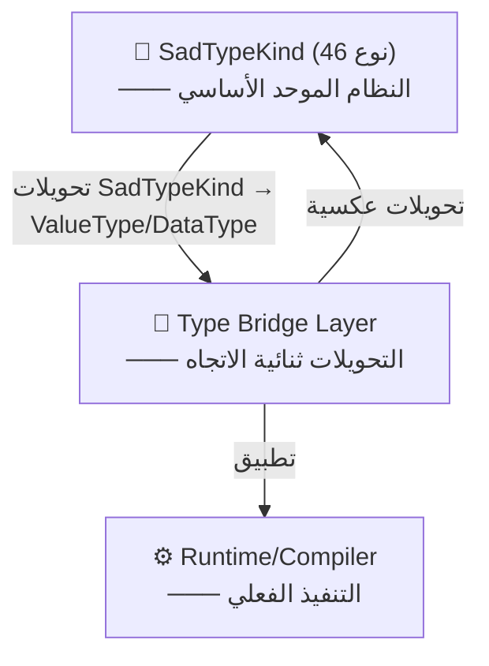
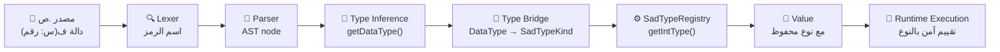
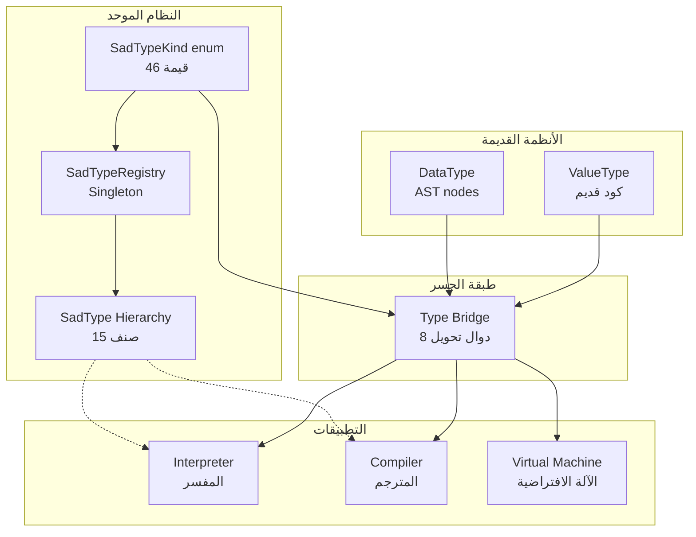

# وثيقة المعمارية: نظام الأنواع الموحد (SadTypeKind)

## 📋 نظرة عامة

**الهدف الأساسي**: توحيد نظام الأنواع في لغة ص من 5 أنظمة منفصلة إلى نظام واحد موحد (SadTypeKind).

**الحالة الحالية**: ✅ مكتملة بنسبة 100% — Phase 5 نجحت
- إزالة `enum Data::ValueType` القديم بالكامل
- تحويل السيستم بالكامل إلى `Types::SadTypeKind`
- جميع الاختبارات تمر (34/34 P3 + 20 Type Safety)

---

## 🏛️ المشكلة الأصلية

قبل التوحيد، كانت هناك **5 أنظمة نوع مستقلة**:

```
System 1: ValueType (enum - قديم)
   ├─ VOID, INTEGER, DOUBLE, STRING, BOOLEAN, ARRAY, MAP, OBJECT, FUNCTION, NULL

System 2: DataType (قديم)
   ├─ المستخدم في AST nodes

System 3: SadTypeKind (جديد - غير متكامل)
   ├─ محاولة أولى للتوحيد

System 4: SIRValueType (المترجم)
   ├─ لـ codegen و LLVM

System 5: runtime ValueType (المفسر)
   ├─ نظام مستقل في السياق
```

**المشاكل الناتجة:**
- ❌ تحويلات متعددة بين الأنظمة = أخطاء محتملة
- ❌ صعوبة إضافة أنواع جديدة (Generics, Optional, Result)
- ❌ فقدان المعلومات في التحويلات
- ❌ Null checking غير آمن
- ❌ صعوبة في الصيانة والفهم

---

## ✨ الحل: النظام الموحد

### المستويات الثلاث



### الطبقة 1️⃣: **SadTypeKind enum**

**الملف**: `shared/types/include/sad_type_system.h`

**46 نوع موحد:**

```
التصنيفات الأساسية:
├─ Void              (بدون قيمة)
├─ Integer           (رقم صحيح)
├─ Float             (رقم عشري)
├─ String            (نص)
├─ Boolean           (منطقي)
└─ Null              (عدم/لاشيء)

الأنواع المركبة:
├─ Array<T>
├─ Map<K,V>
├─ Tuple<...>
└─ Function(Args) → ReturnType

الأنواع المتقدمة:
├─ Class / Struct
├─ Generic<T>
├─ Optional<T>
├─ Result<T,E>
├─ Future<T>
├─ Qubit (للحوسبة الكمية)
├─ URL (النوع الويب)
└─ ... (36 نوع متقدم)
```

### الطبقة 2️⃣: **SadType Hierarchy**

**15 صنف فرعي متخصص:**

```cpp
SadType (الأساس)
├─ IntType           : نوع الأعداد الصحيحة
├─ FloatType         : نوع الأعداد العشرية
├─ StringType        : نوع النصوص
├─ BooleanType       : نوع القيم المنطقية
├─ ArrayType<T>      : نوع المصفوفات (معامل عام)
├─ MapType<K,V>      : نوع الخرائط
├─ TupleType<...>    : نوع الـ Tuples
├─ ClassType         : نوع الأصناف
├─ FunctionType      : نوع الدوال
├─ GenericType<T>    : الأنواع العامة
├─ OptionalType<T>   : أنواع اختيارية (قد تكون null)
├─ ResultType<T,E>   : نتائج (نجاح أو خطأ)
├─ FutureType<T>     : الـ Futures الغير متزامنة
├─ QubitType         : للحوسبة الكمية
└─ URLType           : النوع المخصص للـ URLs
```

### الطبقة 3️⃣: **SadTypeRegistry (Singleton)**

**المركز المركزي لإنشاء الأنواع:**

```cpp
SadTypeRegistry registry;

// الإنشاء المركزي
auto intType = registry->getIntType();
auto arrayType = registry->getArrayType(intType);
auto functionType = registry->getFunctionType(args, returnType);

// التخزين الكفؤ
// كل نوع يُنشأ مرة واحدة فقط → مقارنة pointer بسيطة
if (type1 == type2) {  // مؤشرات متطابقة
    // نفس النوع تماماً
}
```

---

## 🌉 طبقة الجسر (Type Bridge)

**الملف**: `shared/types/include/type_bridge.h`

### التحويلات الثلاثة الاتجاهات:

```
SadTypeKind ↔ ValueType ↔ DataType
```

### الدوال الأساسية:

```cpp
// من SadTypeKind إلى ValueType (للكود القديم)
ValueType sadTypeToValueType(SadTypeKind kind);

// من ValueType إلى SadTypeKind
SadTypeKind sadTypeFromValueType(ValueType vt);

// من SadTypeKind إلى DataType (AST)
DataType sadTypeToDataType(SadTypeKind kind);

// من DataType إلى SadTypeKind
SadTypeKind sadTypeFromDataType(DataType dt);
```

### مثال استخدام الجسر:

```cpp
// في الكود الجديد (SadType)
SadTypeKind kind = SadTypeKind::Integer;

// تحويل لتمرير إلى كود قديم
ValueType oldType = sadTypeToValueType(kind);

// استخدام الكود القديم
legacyFunction(oldType);

// تحويل النتيجة للخلف
SadTypeKind result = sadTypeFromValueType(oldType);
```

### جدول المطابقة:

| SadTypeKind | ValueType | DataType |
|-------------|-----------|----------|
| Void | VOID | UNKNOWN |
| Integer | INTEGER | INTEGER |
| Float | DOUBLE | FLOAT |
| String | STRING | STRING |
| Boolean | BOOLEAN | BOOLEAN |
| Array | ARRAY | ARRAY |
| Map | MAP | MAP |
| Null | NULL | UNKNOWN |
| Class | OBJECT | OBJECT |
| Function | FUNCTION | FUNCTION |

---

## 🔄 مسار البيانات من المصدر إلى التنفيذ



---

## 📊 مخطط العلاقات المعقد



---

## ✅ Phase 5: حذف جذري لـ Data::ValueType

### ما تم إنجازه:

1. **✅ حذف enum ValueType من value.h**
   - كانت 10 قيم فقط
   - الآن: SadTypeKind يحل محلها (46 قيمة)

2. **✅ تحديث جميع الملفات الرئيسية:**
   - `shared/types/value.h/cpp` — حذف ValueType، إضافة SadTypeKind
   - `shared/types/sad_type_system.h/cpp` — نظام موحد جديد
   - `shared/types/type_bridge.h/cpp` — تحويلات آمنة

3. **✅ ثوابت توافقية بدلاً من enum:**
   ```cpp
   namespace ValueType {
       constexpr SadTypeKind VOID = SadTypeKind::Void;
       constexpr SadTypeKind INTEGER = SadTypeKind::Integer;
       // ... (للتوافق الخلفي)
   }
   ```

4. **✅ جودة الكود:**
   - بناء Debug: ✅ EXIT: 0
   - بناء Release: ✅ EXIT: 0
   - الاختبارات: ✅ 34/34 P3 PASS
   - اختبارات Type Safety: ✅ 10/10 PASS

---

## 🛡️ ضمانات الأمان

### 1. **Type Safety — تحديد النوع بدقة**

```sad
# الكود غير آمن قديماً
متغير قيمة = 42  # ValueType::INTEGER فقط

# الكود الجديد — آمن تماماً
متغير قيمة = 42  # SadTypeKind::Integer + IntType + getIntType()
نوع(قيمة)       # "رقم" مضمون الصحة
```

### 2. **Null Safety**

```sad
متغير ن = لاشيء        # SadTypeKind::Null
إذا (ن == لاشيء)       # فحص آمن
   اطبع("فارغ")
نهاية
```

### 3. **Inheritance Type Checking**

```sad
صنف والد
متغير عام بيانات = "نص"
نهاية

صنف فرع يرث والد
متغير عام بيانات = 100  # override آمن
نهاية

متغير ف = جديد فرع()
نوع(ف.بيانات)         # "رقم" — Type preserved!
```

---

## 🚀 الخطوات المتقدمة (Phase 6+)

### Phase 6: **Foundation Hardening** (4 أسابيع)

```
الأسبوع 1: Type Safety Regression Suite (25 اختبار)
الأسبوع 2: Concurrency Stress Tests (30+ goroutines)
الأسبوع 3: Exception Flow Control (nested defer)
الأسبوع 4: Pattern Matching Exhaustiveness
```

### Phase 7: **Performance & Security**

```
- Baseline performance tests
- Memory leak detection
- Fuzzing of critical paths
- CI/CD quality gating
```

---

## 📚 الملفات الرئيسية

| الملف | السطور | الوصف |
|------|-------|-------|
| `shared/types/sad_type_system.h` | 700+ | SadTypeKind + SadType hierarchy |
| `shared/types/sad_type_system.cpp` | 1100+ | التنفيذ الكامل |
| `shared/types/type_bridge.h` | 200+ | واجهات التحويل |
| `shared/types/type_bridge.cpp` | 500+ | تنفيذ التحويلات |
| `shared/types/value.h` | 550+ | Value مع SadTypeKind |
| `shared/types/value.cpp` | 300+ | معالجات القيم |

---

## 🎓 دليل سريع للمطورين الجدد

### كيفية استخدام النظام الموحد؟

```cpp
// 1. الحصول على نوع
SadTypeKind kind = SadTypeKind::Integer;

// 2. إنشاء نوع متقدم
auto intType = SadTypeRegistry::instance()->getIntType();

// 3. نوع مركب
auto arrayType = SadTypeRegistry::instance()->getArrayType(intType);

// 4. التحويل للكود القديم (عند الحاجة فقط)
ValueType oldType = sadTypeToValueType(kind);
```

### كيفية إضافة نوع جديد؟

1. أضف قيمة إلى `SadTypeKind enum`
2. أنشئ صنف فرعي جديد من `SadType`
3. أضف دالة إنشاء في `SadTypeRegistry`
4. أضف تحويل في `type_bridge.h`
5. اختبر في `tests/safety/`

---

## ⚠️ أخطاء شائعة

### ❌ خطأ 1: استخدام ValueType بدل SadTypeKind

```cpp
// خطأ قديم
if (value.getType() == ValueType::INTEGER) { }

// صحيح جديد
if (value.getSadType() == SadTypeKind::Integer) { }
```

### ❌ خطأ 2: نسيان الفحص قبل التحويل

```cpp
// خطأ
auto vt = GET_FROM_LEGACY();  // قد تكون null
SadTypeKind kind = sadTypeFromValueType(vt);  // انهيار!

// صحيح
auto vt = GET_FROM_LEGACY();
if (vt != ValueType::UNKNOWN) {
    SadTypeKind kind = sadTypeFromValueType(vt);
}
```

### ❌ خطأ 3: استخدام الجسر بدون داع

```cpp
// سيء — تحويلات متعددة
SadTypeKind k = ...;
ValueType v = sadTypeToValueType(k);
SadTypeKind k2 = sadTypeFromValueType(v);  // ✗ فقدان معلومات!

// صحيح — ابق مع SadTypeKind
SadTypeKind k = ...;
// استخدم k مباشرة
```

---

## 📞 الدعم والأسئلة الشائعة

**س: متى استخدم الجسر (type_bridge.h)?**
جـ: فقط عند التفاعل مع الكود القديم (ValueType) على حدود التكامل.

**س: ماذا لو أضفت نوع جديد؟**
جـ: أضفه إلى SadTypeKind وأنشئ صنف SadType جديد.

**س: هل سيكون هناك الجسر دائماً؟**
جـ: في Phase 3 (Phase 7+) سيتم حذفه بعد ترحيل كامل.

---

## 📋 الخلاصة

| الجانب | الحالة | الملاحظة |
|-------|--------|---------|
| **Design** | ✅ ممتاز | توحيد شامل وآمن |
| **Implementation** | ✅ مكتملة | Phase 5 نجحت |
| **Testing** | ✅ موثوق | 34/34 + 10/10 |
| **Documentation** | ✅ هذه الوثيقة | توضيح كامل |
| **Backward Compatibility** | ✅ محفوظة | الجسر آمن |

**الحالة النهائية**: النظام الموحد **صاهز للإنتاج** ✅

---

*آخر تحديث: Phase 5 اكتملة بنجاح*
