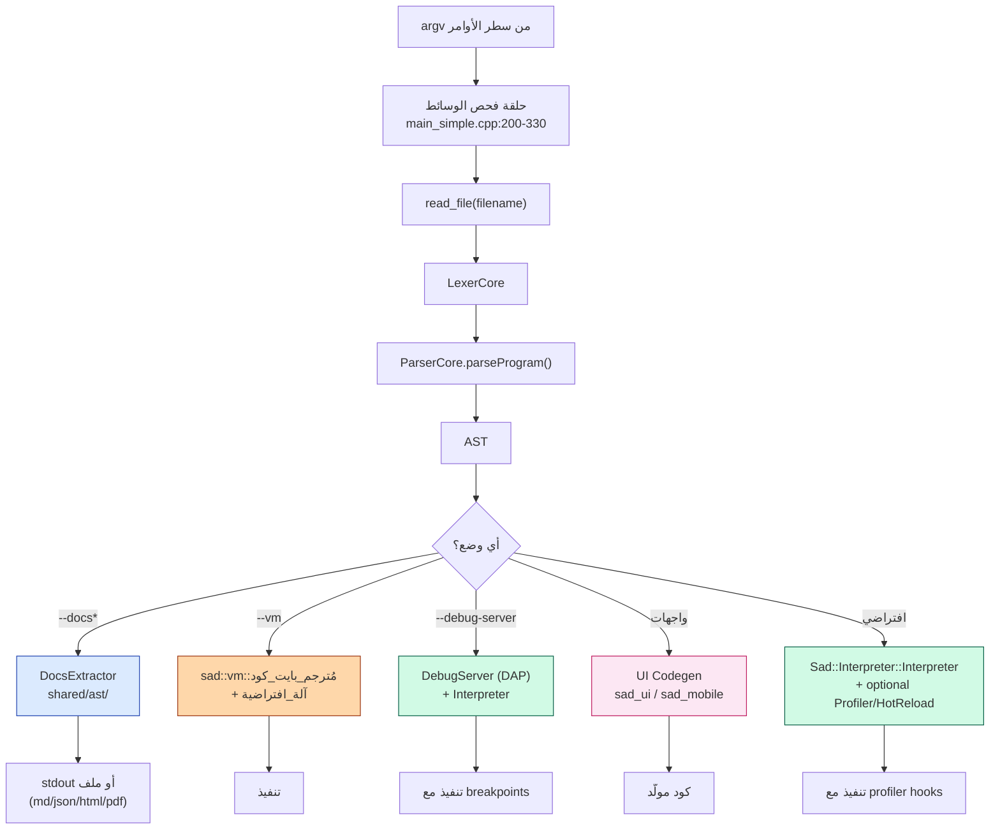
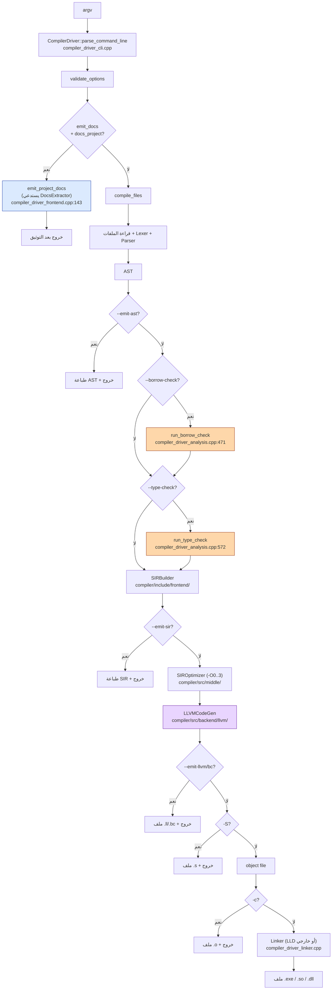

# خارطة ميزات CLI ومسارات تنفيذها — `sad` و `sadc`

> **تاريخ التحديث:** 29 أبريل 2026
> **الغرض:** تفكيك بنية المشروع — تحديد كل خيار سطر أوامر يدعمه `sad.exe` و `sadc.exe`، ومسار تنفيذه الفعلي في الكود.
>
> **المصادر الأساسية للتحقق:**
> - [tools/compiler/main_simple.cpp](tools/compiler/main_simple.cpp) — `main()` الخاص بـ `sad.exe`
> - [tools/compiler/compiler_driver_cli.cpp](tools/compiler/compiler_driver_cli.cpp) — معالج وسائط `sadc.exe`
> - [tools/compiler/compiler_driver_frontend.cpp](tools/compiler/compiler_driver_frontend.cpp) — مسار توثيق sadc
> - [tools/compiler/compiler_driver_analysis.cpp](tools/compiler/compiler_driver_analysis.cpp) — مسارات الفحص في sadc
> - [tools/compiler/compiler_driver_backend.cpp](tools/compiler/compiler_driver_backend.cpp) — مسارات الإخراج LLVM
> - [cmake/executables.cmake](cmake/executables.cmake) — كيفية بناء كل executable

---

## 🟩 خارطة ميزات `sad.exe` (المفسر الأساسي)

> **مُنشأ من:** `tools/compiler/main_simple.cpp` (ملف واحد)
> **يربط بـ:** `sad_core` + `sad_vm` + `sad_type_system` + `sad_semantic` + `sad_network` + `sad_http` + `sad_websocket` + `sad_mobile` + `sad_ui` + `sad_profiler_lib` + `sad_rt_runtime`
>
> ⚠️ **ملاحظة معمارية:** `sad.exe` يجمع كل المكتبات في برنامج واحد، فهو "المفسر الشامل" — يدعم تنفيذ مباشر، VM، تنميط، DAP، توثيق، توليد UI.

### جدول الميزات والمسارات

| الخيار | البديل العربي | الفئة | المسار في الكود | المكتبة الفعلية |
|---|---|---|---|---|
| `<file.ص>` (افتراضي) | — | تنفيذ | `Sad::Interpreter::Interpreter::execute()` | `sad_core` (= `interpreter/`) |
| `--vm` | `--آلة` | تنفيذ بايت كود | `sad::vm::مُترجم_بايت_كود` ← `sad::vm::آلة_افتراضية::نفّذ()` | `sad_vm` |
| `--vm-trace` | `--تتبع-آلة` | VM | `vm.عيّن_وضع_التتبع(true)` | `sad_vm` |
| `--vm-disasm` | `--فك-بايتكود` | VM | `sad::vm::مفكك_البايت_كود::فكّك_وحدة()` | `sad_vm` |
| `--ownership` | `--ملكية` | فحص | `options.enableOwnership = true` → `OwnershipManager` | `sad_core` |
| `--debug-ownership` | `--تتبع-ملكية` | فحص | `options.ownershipDebugMode = true` | `sad_core` |
| `--type-check` | `--فحص-أنواع` | فحص | `options.enableTypeCheck = true` → `TypeChecker` | `sad_semantic_shared` (طبقة 0!) |
| `--debug-types` | `--تنقيح-أنواع` | فحص | `options.typeCheckDebugMode = true` | `sad_semantic_shared` |
| `--strict-types` | `--أنواع-صارمة` | فحص | `options.typeCheckStrictMode = true` | `sad_semantic_shared` |
| `--security` | `--أمان` | فحص | `options.enableSecurity = true` | `sad_core` |
| `--debug-security` | `--تنقيح-أمان` | فحص | `options.securityDebugMode = true` | `sad_core` |
| `--strict-security` | `--أمان-صارم` | فحص | `options.securityStrictMode = true` | `sad_core` |
| `--debug` | — | تنقيح | `options.enableDebugMode = true` | `sad_core` |
| `--debug-server` | — | تنقيح | `Sad::Debug::DebugServer::run(filename)` (DAP عبر stdin/stdout) | `sad_core` (interpreter/include/debug/) |
| `--profile` | `--تنميط` | تنميط | `Sad::Tools::ProfilerCore` + hooks | `sad_profiler_lib` |
| `--profile-format=<fmt>` | — | تنميط | `profOpts.outputFormat` (text/json/html) | `sad_profiler_lib` |
| `--profile-output=<f>` | — | تنميط | `profOpts.outputFile` | `sad_profiler_lib` |
| `--profile-top=<n>` | — | تنميط | `profOpts.topFunctionsCount` | `sad_profiler_lib` |
| `--hot-reload` | `--مراقبة` | إعادة تحميل | `options.enableHotReload = true` → `HotReloadEngine` | `shared/hot_reload/` |
| `--docs` | `--وثّق` | توثيق | `Sad::AST::DocsExtractor::extractMarkdown()` | `shared/ast/` (طبقة 0!) |
| `--docs-out=<f>` | — | توثيق | كتابة إلى ملف بدل stdout | `shared/ast/` |
| `--docs-project=<dir>` | — | توثيق | `DocsExtractor::collectSadFiles()` + `extractProjectMarkdown()` | `shared/ast/` |
| `--docs-project-name=<n>` | — | توثيق | عنوان المشروع المعروض | `shared/ast/` |
| `--docs-format=<fmt>` | — | توثيق | `markdown\|json\|html\|pdf` → `extractJson/Html/PrintableHtml` + `PdfExporter` | `shared/ast/` |
| `--docs-exclude=` | — | توثيق | استبعاد ملفات (قابل للتكرار) | `shared/ast/` |
| `--ownership` (مكرر) | — | — | (مذكور مرتين في help — نفس الخيار) | — |
| `واجهات <ملف>` | — | UI | توليد كود واجهات (DSL خاص — "واجهات" كلمة سياقية) | `sad_ui` + `sad_mobile` |
| `--منصة=desktop\|android\|ios\|web` | — | UI | اختيار المنصة | `sad_ui` |
| `--سطح-المكتب` | — | UI | SDL2 codegen | `sad_ui` |
| `--اندرويد` | — | UI | Jetpack Compose codegen | `sad_mobile` (compose) |
| `--ايفون` | — | UI | SwiftUI codegen | `sad_mobile` (swiftui) |
| `--ويب` | — | UI | HTML/CSS/JS codegen | `sad_ui` (web) |
| `--opt-stats` / `-v` | — | متفرقات | `showOptStats = true` | `sad_core` |
| `--help` / `-h` | — | متفرقات | `print_help()` | — |
| `--version` / `-v` | — | متفرقات | طباعة الإصدار | — |

### مخطط مسارات `sad.exe` المتفرعة

### اكتشافات معمارية مهمة في `sad.exe`

| # | الاكتشاف | الدلالة |
|---|---|---|
| 1 | `--docs` لا يُشغّل المفسر إطلاقاً | استخراج ساكن من AST عبر `shared/` |
| 2 | `--vm` لا يُشغّل المفسر إطلاقاً | مسار مستقل تماماً (`sad_vm`) — لكنه في نفس البرنامج التنفيذي! |
| 3 | `--type-check` يستخدم `sad_semantic_shared` (طبقة 0) | فحص الأنواع موحَّد بين المفسر والمترجم |
| 4 | `--debug-server` يستخدم `Sad::Debug::DebugServer` المربوط بـ `interpreter` | DAP حصري للمسار 1 |
| 5 | `--profile` و `--hot-reload` حصريان للمفسر | لا توجد نظائرهما في `sadc` |
| 6 | `واجهات` ليست ميزة CLI نقية بل DSL يُعالَج عبر parser خاص | تُترجم لكود native للمنصة المستهدفة |

---

## 🟪 خارطة ميزات `sadc.exe` (المترجم الأصلي)

> **مُنشأ من:** `tools/compiler/main.cpp` + 13 ملف `compiler_driver_*.cpp`
> **يربط بـ:** `sad_shared` + `sad_compiler` + `sad_mobile` + `${LLVM_LIBS}` (+ `${LLD_LIBS}` اختيارياً)
>
> ⚠️ **ملاحظة:** `sadc` لا يربط بـ `sad_core` ولا `sad_vm` — مسار 3 معزول تماماً عن المسارين 1 و 2 على مستوى المكتبات.

### الفئة 1: التحكم في الإخراج

| الخيار | المسار في الكود | المخرج | الطبقة |
|---|---|---|---|
| `-o <file>` | `compiler_driver_cli.cpp:194` → `options.output_file` | اسم ملف الإخراج | — |
| `-c` | `compiler_driver_cli.cpp:282` → `options.compile_only` | ملف `.o` فقط (بلا ربط) | LLVM |
| `-S` | `compiler_driver_cli.cpp:286` → `options.emit_assembly` | ملف assembly | LLVM |
| `--emit-llvm` | `compiler_driver_cli.cpp:290` → `options.emit_llvm_ir` | ملف `.ll` (LLVM IR نصي) | LLVM |
| `--emit-bc` | `compiler_driver_cli.cpp:294` → `options.emit_llvm_bc` | ملف `.bc` (LLVM bitcode) | LLVM |
| `--emit-ast` | `compiler_driver_cli.cpp:308` → يُعالج في `compiler_driver_analysis.cpp:372` | طباعة AST | `shared/ast` |
| `--emit-sir` | `compiler_driver_cli.cpp:312` → يُعالج في `compiler_driver_backend.cpp:591` | طباعة SIR | `compiler/include/frontend/sir/` |
| `--shared` | `compiler_driver_cli.cpp:298` → `options.shared_library` | مكتبة مشتركة `.so/.dll` | LLVM + linker |

### الفئة 2: التحسين

| الخيار | المسار | الطبقة |
|---|---|---|
| `-O0` | `options.optimization_level = 0` | `sad_optimizer` |
| `-O1` | `options.optimization_level = 1` | `sad_optimizer` |
| `-O2` (افتراضي) | `options.optimization_level = 2` | `sad_optimizer` |
| `-O3` | `options.optimization_level = 3` | `sad_optimizer` |
| `-Os` | `options.optimize_for_size` | `sad_optimizer` |
| `-Oz` | `options.optimize_for_size_aggressive` | `sad_optimizer` |
| `--lto` / `--lto=full` | `options.lto_mode = Full` | LLVM LTO |
| `--lto=thin` | `options.lto_mode = Thin` | LLVM LTO |
| `--no-lto` | `options.lto_mode = None` | — |
| `-g` | `options.debug_info = true` | LLVM DWARF/PDB |
| `--time-passes` | `options.time_passes = true` | LLVM Pass Manager |

### الفئة 3: التوثيق (مطابق لـ `sad`)

> 🔁 **المسار مُتطابق تماماً مع `sad --docs`** — يستدعي نفس `Sad::AST::DocsExtractor` من `shared/ast/`.

| الخيار | المسار | الموقع |
|---|---|---|
| `--docs` / `--وثّق` | `compiler_driver_cli.cpp:330` → `options.emit_docs = true` | — |
| `--docs-out=<f>` | `options.docs_output_file` | — |
| `--docs-project=<dir>` | `options.docs_project_dir` → `compiler_driver_frontend.cpp:147` `emit_project_docs()` | — |
| `--docs-project-name=<n>` | `options.docs_project_name` | — |
| `--docs-format=<fmt>` | `options.docs_format` (markdown/json/html/pdf) | — |
| `--docs-exclude=` | `options.docs_excludes.push_back(...)` | — |

> **الكود الفعلي الذي يستدعي `DocsExtractor`:**
> [compiler_driver_frontend.cpp:140-260](tools/compiler/compiler_driver_frontend.cpp) — دالة `emit_project_docs()`

### الفئة 4: المنصة المستهدفة (Targeting)

| الخيار | المسار | الاستخدام |
|---|---|---|
| `--target=<triple>` | `options.target_triple` | LLVM Target Machine — `x86_64-pc-windows-msvc`, `aarch64-linux-android`, إلخ |
| `--freestanding` / `--no-std` / `--nostd` | `options.freestanding_mode = true` | `compiler/src/pipeline/no_std_mode.cpp` |
| `--no-main` / `--nomain` | `options.no_default_main` | تعطيل `main()` افتراضي |
| `--abort-on-panic` | `options.abort_on_panic` | استبدال unwinding بـ abort |
| `--linker-script=<f>` | `options.linker_script` | ملف `.ld` للرابط (نواة OS) |
| `--entry-point=<n>` | `options.entry_point_name` | اسم نقطة دخول مخصصة (مثل `_start`) |
| `--allow-alloc` | `options.allow_heap_alloc` | السماح بـ heap في freestanding |

### الفئة 5: الربط (Linking)

| الخيار | المسار | الوظيفة |
|---|---|---|
| `-L<path>` | `options.library_paths.push_back(...)` | مسار بحث المكتبات |
| `-l<lib>` | `options.libraries_to_link.push_back(...)` | ربط مكتبة محددة |
| `--static` | `options.static_linking` | ربط ثابت |
| `-T<script>` / `-T <script>` | `options.linker_script` | linker script |
| `--module` / `--وحدة` | بناء وحدة قابلة للاستيراد | `shared/modules/` |
| `--ui` / `--واجهات` + `--desktop/--android/--ios/--web` | `options.ui_target = ...` | توليد UI كما في `sad` |

### الفئة 6: فحص الملكية (Borrow Checking) — حصري لـ `sadc`

| الخيار | المسار | الطبقة |
|---|---|---|
| `--borrow-check` (افتراضي) / `--فحص-الاستعارة` / `--ملكية` | `options.borrow_check = true` → `compiler_driver_analysis.cpp:471` `run_borrow_check()` | `compiler/src/sema/borrow_checker_*.cpp` |
| `--no-borrow-check` / `--بدون-فحص-استعارة` | `options.borrow_check = false` | — |
| `--debug-borrow` / `--تنقيح-الاستعارة` | `options.borrow_debug = true` | — |
| `--arabic-borrow` / `--رسائل-عربية` | `options.borrow_arabic_msgs = true` (افتراضي) | — |
| `--english-borrow` | `options.borrow_arabic_msgs = false` | — |

### الفئة 7: فحص الأنواع المتقدم

| الخيار | المسار | الطبقة |
|---|---|---|
| `--type-check` (افتراضي) / `--فحص-الأنواع` | `options.type_check = true` → `compiler_driver_analysis.cpp:572` `run_type_check()` | `sad_semantic_shared` |
| `--no-type-check` / `--بدون-فحص-أنواع` | `options.type_check = false` | — |
| `--debug-types` / `--تنقيح-الأنواع` | `options.type_check_debug` | — |
| `--strict-types` / `--أنواع-صارمة` | `options.type_check_strict` | — |

### الفئة 8: متفرقات

| الخيار | المسار |
|---|---|
| `-v` / `--verbose` | `options.verbose = true` |
| `-Werror` | `options.warnings_as_errors = true` |
| `--color` / `--no-color` | `options.color_diagnostics` |
| `-h` / `--help` | `print_help()` |
| `--version` | طباعة الإصدار |

### مخطط مسار `sadc.exe`

---

## 🔍 جدول المقارنة بين `sad` و `sadc`

| الميزة | `sad` | `sadc` | ملاحظات |
|---|---|---|---|
| تنفيذ مباشر | ✅ افتراضي | ❌ | sadc يولّد، لا ينفّذ |
| تنفيذ بايت كود | ✅ `--vm` | ❌ | sadc لا يدعم VM |
| تنفيذ Native (AOT) | ❌ | ✅ افتراضي | sad لا يولّد ملفات تنفيذية |
| توثيق `--docs*` | ✅ كامل | ✅ كامل | **مسار مُتطابق بايتياً** |
| فحص الملكية | ✅ `--ownership` (runtime) | ✅ `--borrow-check` (compile-time) | مختلف معمارياً |
| فحص الأنواع | ✅ `--type-check` | ✅ `--type-check` (افتراضي) | نفس المُحرّك (`sad_semantic_shared`) |
| فحص الأمان | ✅ `--security` | ❌ | حصري للمفسر |
| تنميط الأداء | ✅ `--profile` | ❌ | حصري للمفسر |
| إعادة تحميل ساخن | ✅ `--hot-reload` | ❌ | حصري للمفسر |
| خادم تنقيح DAP | ✅ `--debug-server` | ❌ (يستخدم DWARF/PDB من LLVM) | DAP حصري للمفسر |
| توليد UI | ✅ `واجهات` | ✅ `--ui` / `--واجهات` | نفس المُحرّك (`sad_ui`) |
| Freestanding (نواة OS) | ❌ | ✅ `--freestanding` | حصري للمترجم |
| LTO | ❌ | ✅ `--lto` | حصري للمترجم |
| Cross-compilation | ❌ | ✅ `--target=` | حصري للمترجم |
| `--emit-ast` | ❌ مباشر | ✅ | sadc يطبع AST نصياً |
| `--emit-sir` | ❌ | ✅ | حصري للمترجم |
| `--emit-llvm` / `--emit-bc` | ❌ | ✅ | حصري للمترجم |
| Linker scripts (`.ld`) | ❌ | ✅ `--linker-script=` | لتطوير نواة OS |

---

## 🚨 خلاصة معمارية للتفكيك

### الميزات المشتركة (نفس الكود في كلا البرنامجين)

| الميزة | المكتبة المشتركة | السبب |
|---|---|---|
| Lexer + Parser + AST | `sad_shared` | الواجهة الأمامية موحدة |
| فحص الأنواع | `sad_semantic_shared` | TypeChecker موحد منذ Phase 3 (F-01) |
| استخراج التوثيق | `Sad::AST::DocsExtractor` (في `shared/ast/`) | تطابق بايتي مضمون |
| توليد UI | `sad_ui` + `sad_mobile` | يعمل على AST، لا يحتاج runtime |
| نظام الوحدات (modules) | `shared/modules/` | استيراد/تصدير |

### الميزات الحصرية لـ `sad` (المفسر)

- **Profiler** — يحتاج runtime hooks
- **Hot Reload** — يحتاج إعادة تنفيذ AST
- **Debug Server (DAP)** — مرتبط بـ `Interpreter::execute`
- **Security checks** — runtime sandboxing
- **VM bytecode execution** — `sad_vm` runtime

### الميزات الحصرية لـ `sadc` (المترجم)

- **Borrow checker** — تحليل ساكن قبل codegen
- **Freestanding mode** — توليد كود نواة OS
- **LTO** — تحسين وقت الربط (LLVM)
- **Cross-compilation** (`--target=`) — LLVM Target Machine
- **`--emit-llvm` / `--emit-bc` / `--emit-sir`** — مخرجات وسيطة
- **Linker scripts** — تخصيص layout الذاكرة
- **`-O0..-O3` / `-Os` / `-Oz`** — SIROptimizer + LLVM passes

### نقاط ازدواج محتملة (مرشحات للتوحيد)

| الميزة | الموقع في sad | الموقع في sadc | المقترح |
|---|---|---|---|
| فحص الملكية | runtime في `sad_core` | static في `compiler/src/sema/` | توحيد التحليل الساكن في `shared/semantic/` |
| توليد UI | `sad_ui` + معالج DSL في sad | `sad_ui` + معالج CLI في sadc | بالفعل موحد (المُحرّك في `sad_ui`) ✅ |
| `--type-check` | `sad_semantic_shared` | `sad_semantic_shared` | بالفعل موحد ✅ |
| `--docs*` | `shared/ast/docs_extractor` | `shared/ast/docs_extractor` | بالفعل موحد ✅ |

---

## 📋 قائمة المراجع للكود

| الميزة | الملف | السطر تقريباً |
|---|---|---|
| `sad` argv loop | `tools/compiler/main_simple.cpp` | 200-330 |
| `sad` interpreter setup | `tools/compiler/main_simple.cpp` | 670-720 |
| `sad` VM mode | `tools/compiler/main_simple.cpp` | 580-628 |
| `sad` debug server | `tools/compiler/main_simple.cpp` | 630-665 |
| `sad` docs single | `tools/compiler/main_simple.cpp` | 510-540 |
| `sad` docs project | `tools/compiler/main_simple.cpp` | 343-475 |
| `sadc` argv loop | `tools/compiler/compiler_driver_cli.cpp` | 169-580 |
| `sadc` help text | `tools/compiler/compiler_driver_cli.cpp` | 50-160 |
| `sadc` docs project | `tools/compiler/compiler_driver_frontend.cpp` | 140-260 |
| `sadc` borrow check | `tools/compiler/compiler_driver_analysis.cpp` | 471-570 |
| `sadc` type check | `tools/compiler/compiler_driver_analysis.cpp` | 572-... |
| `sadc` emit AST | `tools/compiler/compiler_driver_analysis.cpp` | 372 |
| `sadc` emit SIR | `tools/compiler/compiler_driver_backend.cpp` | 591 |
| `sad.exe` build def | `cmake/executables.cmake` | 10-60 |
| `sadc.exe` build def | `cmake/executables.cmake` | 168-260 |
