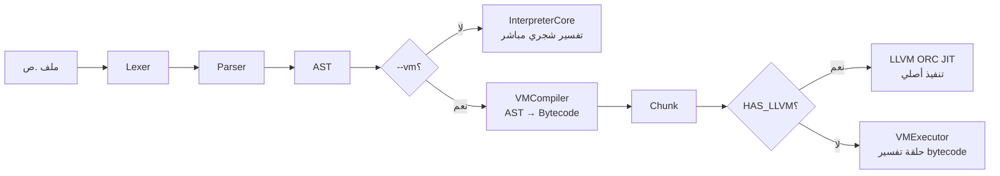
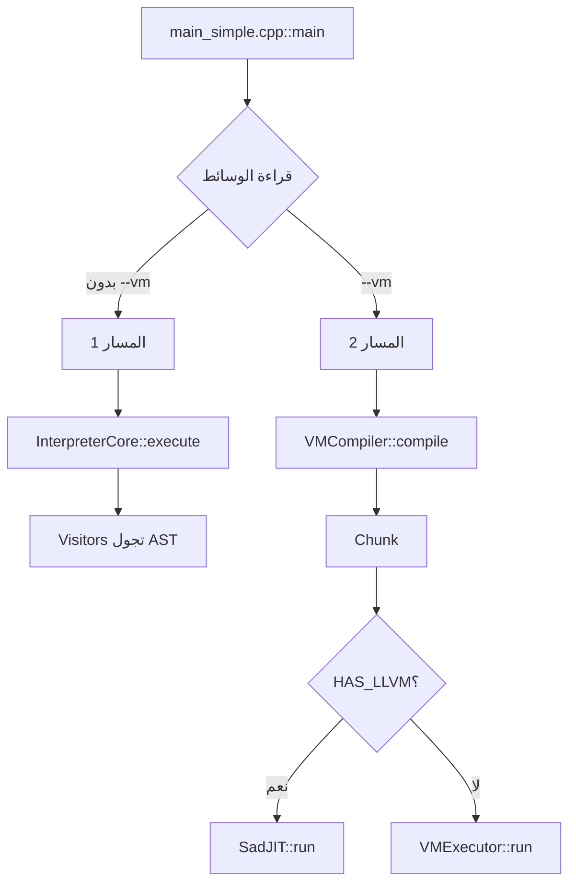

# تفكيك المسارين 1 و 2 — `interpreter/` + `vm/`

> **تاريخ التحديث:** 29 أبريل 2026
> **الغرض:** تفكيك مفصّل لمحرّكي التنفيذ في `sad.exe` ومقارنتهما.

---

## 🏗️ نظرة عامة

`sad.exe` يحوي **محركَين متوازيين** للتنفيذ — يُختار المحرك عبر CLI:

```
sad ملف.ص              # المسار 1: المفسر الشجري (افتراضي)
sad --vm ملف.ص         # المسار 2: الآلة الافتراضية + JIT اختياري
```

كلا المحركَين يأخذان نفس الـ AST من `Sad::Parser::ParserCore`، لكن يُعالجانه بطريقتين مختلفتين تماماً.



---

## 📊 المكتبات المُولَّدة

| المكتبة | الموقع | يحتوي |
|---|---|---|
| `sad_interpreter` | [interpreter/CMakeLists.txt:10](interpreter/CMakeLists.txt#L10) | نواة المفسر فقط (بدون builtins) |
| `sad_core` | [cmake/libraries.cmake:32](cmake/libraries.cmake#L32) | ALL_SOURCES (يحتوي interpreter + builtins + stdlib + low_level) |
| `sad_vm` | [vm/CMakeLists.txt:46](vm/CMakeLists.txt#L46) | Compiler + Executor + JIT + Opcodes |

> ⚠️ **اكتشاف ازدواج:** `sad_interpreter` و `sad_core` يحتويان على نفس ملفات `interpreter/src/` — `sad_core` يضمنها من خلال `INTERPRETER_SOURCES` في `sources.cmake`، و`sad_interpreter` يضمنها مباشرة. هذا للسماح للاختبارات (`test_interpreter_comprehensive`) بربط `sad_interpreter` فقط دون كل sad_core.

---

## 🔵 المسار 1 — `interpreter/` (المفسر الشجري)

### بنية المجلد

| المجلد | عدد الملفات | الغرض |
|---|---|---|
| `src/core/` | 1 | `interpreter_core.cpp` — نقطة الدخول الرئيسية |
| `src/visitors/` | ~22 | زوّار AST (تنفيذ التعابير والجمل) |
| `src/managers/` | 6 | مدراء النطاق والمتغيرات والدوال والأصناف والكائنات والملكية |
| `src/builtins/` | ~34 | تسجيل الدوال المضمنة (kernel + modules + UI) |
| `src/ui/` | ~15 | جسر UI الكامل (sad_ui bridge) |
| `src/oop/` | 1 | `interpreter_classes_fixed.cpp` — تنفيذ OOP |
| `src/debug/` | 1 | `debug_server.cpp` — خادم DAP للديباغ |
| `src/exception.cpp` | 1 | معالجة الاستثناءات في وقت التشغيل |

### المكونات الأساسية

#### 1. `InterpreterCore` (نقطة الدخول)

```cpp
class InterpreterCore {
    void execute(ASTNode* program);
    Value evaluateExpression(Expr* e);
    void executeStatement(Stmt* s);
    
    ScopeManager scopes_;
    VariableManager variables_;
    FunctionManager functions_;
    ClassManager classes_;
    ObjectManager objects_;
    OwnershipManager ownership_;
};
```

#### 2. Visitors (تنفيذ AST)

| Visitor | الملفات | المسؤولية |
|---|---|---|
| `ExpressionEvaluator` | `expression_evaluator_*.cpp` (~14 ملف) | تقييم التعابير |
| `StatementExecutor` | `statement_executor_*.cpp` (~10 ملفات) | تنفيذ الجمل |

تقسيمات `ExpressionEvaluator`:
- `_core` — basic dispatch
- `_binary_ops`, `_binary_logic` — العمليات الثنائية
- `_overloads` — تحميل العوامل
- `_calls`, `_calls_invoke`, `_calls_macro`, `_calls_user_func`, `_calls_dispatch` — استدعاءات الدوال
- `_oop`, `_oop_new`, `_oop_array_methods`, `_oop_string_map_methods`, `_oop_concurrency` — OOP
- `_members`, `_members_assign`, `_members_advanced` — وصول الأعضاء
- `_ui` — UI events

تقسيمات `StatementExecutor`:
- `statement_executor.cpp` — main dispatch
- `_control`, `_control_exceptions` — تحكم (إذا/بينما/حاول)
- `_functions`, `_functions_templates` — تعريفات
- `_oop`, `_oop_types`, `_oop_struct_test` — OOP
- `_modules` — استورد/صدّر

#### 3. Managers

| Manager | الغرض |
|---|---|
| `ScopeManager` | إدارة النطاقات (push/pop) |
| `VariableManager` | تخزين المتغيرات في كل نطاق |
| `FunctionManager` | سجل الدوال + closures |
| `ClassManager` | سجل الأصناف (مُشترك مع sadc) |
| `ObjectManager` | إدارة كائنات الأصناف |
| `OwnershipManager` | تتبع الملكية (Rust-like) |

#### 4. Builtins (~34 ملف!)

| الفئة | الملفات | الغرض |
|---|---|---|
| **Core** | `builtin_registry`, `builtin_core_io` | المسجِّل + I/O أساسي |
| **Modules** | `builtin_module_*` (~15 ملف) | strings, basics, math, async, maps, ffi, ... |
| **Kernel** | `builtin_kernel_*` (~12 ملف) | cpu, uefi, acpi, gpu, usb, storage, network, audio, ... |
| **Network** | `builtin_module_sockets`, `_http`, `_sadnet`, `_websocket` | مفاتيح API الشبكة |

#### 5. UI Bridge (~15 ملف)

جسر كامل لـ `sad_ui`: events, platform, builtins (state, timer, storage, dialog, audio, io, device, network, crypto, platform).

### اعتمادات `sad_interpreter`

```
sad_interpreter
├── sad_shared (Lexer, Parser, AST, Types, Errors, Modules)
└── sad_semantic_shared (Type Checker)
```

---

## 🟢 المسار 2 — `vm/` (الآلة الافتراضية)

### البنية المسطحة

> ✅ **بنية بسيطة جداً مقارنة بالمفسر** — 4 ملفات cpp فقط!

| الملف | الغرض |
|---|---|
| `src/sad_vm_opcodes.cpp` | تعريف ~80 opcode (PUSH, POP, ADD, JUMP, CALL, ...) |
| `src/sad_vm_compiler.cpp` | محوِّل AST → Bytecode (Chunk) |
| `src/sad_vm_executor.cpp` | حلقة التنفيذ (dispatch loop) |
| `src/sad_jit.cpp` | محرك JIT اختياري عبر LLVM ORC |

### المكونات الأساسية

#### 1. `Chunk` (وحدة البايت كود)

تخزّن:
- شريط التعليمات (`std::vector<uint8_t>`)
- pool الثوابت (`std::vector<Value>`)
- معلومات الترقيم (line numbers)

#### 2. `VMCompiler`

```cpp
class VMCompiler {
    Chunk compile(ASTNode* program);
    // يحوّل كل عقدة AST إلى تعليمات
    // يستخدم نفس Lexer/Parser من sad_shared
};
```

#### 3. `VMExecutor`

حلقة التنفيذ المبنية على المكدس (stack-based VM):

```cpp
while (ip < end) {
    OpCode op = decode(ip);
    switch (op) {
        case OP_PUSH_CONST: stack.push(constants[arg]); break;
        case OP_ADD: stack.push(pop() + pop()); break;
        case OP_JUMP: ip = arg; break;
        // ...
    }
}
```

#### 4. `SadJIT` (اختياري)

عند `HAS_LLVM=1`:
- يأخذ Chunk
- يحوّله إلى LLVM IR
- يُمرّره إلى ORC JIT engine
- ينفّذ الكود الأصلي مباشرة

### اعتمادات `sad_vm`

```
sad_vm
├── sad_shared (PUBLIC)
└── LLVM (PRIVATE, optional)
```

---

## 🔍 مقارنة المسارين

| الجانب | المسار 1 (Interpreter) | المسار 2 (VM) |
|---|---|---|
| **عدد ملفات cpp** | ~80 | 4 |
| **عدد سطور الكود تقريباً** | ~30,000 | ~3,500 |
| **استراتيجية التنفيذ** | Tree-walking (زوّار AST) | Stack-based bytecode |
| **سرعة التنفيذ** | بطيء (إعادة جولان شجرة AST) | متوسط (dispatch loop) |
| **سرعة JIT** | غير متوفر | أصلي (مع LLVM) |
| **دعم OOP** | ✅ كامل | ⚠️ جزئي |
| **دعم async/goroutines** | ✅ كامل | ⚠️ جزئي |
| **دعم UI (sad_ui)** | ✅ كامل | ❌ غير مدعوم |
| **دعم Network** | ✅ كامل | ⚠️ جزئي |
| **دعم Hot Reload** | ✅ | ❌ |
| **دعم Debug (DAP)** | ✅ | ❌ |
| **دعم Profiler** | ✅ | ⚠️ مدمج كـ profiler-only mode |
| **استهلاك الذاكرة** | عالي | منخفض |
| **زمن البدء** | بطيء (تحميل كل البنى) | سريع |
| **الحالة** | مستقر، الإنتاج الافتراضي | مستقر، يستخدم لـ benchmarks |

---

## 🚦 كيف يختار `sad.exe` المحرك؟

من [tools/compiler/main_simple.cpp:244](tools/compiler/main_simple.cpp#L244):

```cpp
else if (a == "--vm" || a == "--آلة") {
    use_vm = true;
}
else if (a == "--vm-trace" || a == "--تتبع-آلة") {
    vm_trace = true;
}
else if (a == "--vm-disasm" || a == "--فك-بايتكود") {
    vm_disasm = true;
}
```

### تدفق القرار



---

## 🚨 اكتشافات معمارية

### الاكتشاف 1: ازدواج `sad_interpreter` / `sad_core`

`sad_interpreter` (مكتبة منفصلة) و `sad_core` (مكتبة موحَّدة) كلاهما يضم نفس ملفات `interpreter/src/`. السبب:
- الاختبارات تربط `sad_interpreter` فقط (أخف)
- `sad.exe` يربط `sad_core` (شامل)

**نتيجة:** نفس الملفات تُترجم مرتين. **التحسين:** اجعل `sad_core` يربط `sad_interpreter` بدلاً من إعادة التضمين.

### الاكتشاف 2: VM بسيط بشكل لافت

4 ملفات فقط مقابل 80+ ملف للمفسر. هذا يعني:
- VM لا يدعم كل ميزات اللغة (OOP/async/UI ناقصة)
- VM يستفيد من `sad_shared` لـ AST/Parser فقط
- VM يحتاج جهداً كبيراً ليُساوي المفسر في الميزات

### الاكتشاف 3: JIT متاح فقط في VM وليس المفسر

LLVM ORC JIT مرتبط بـ `sad_vm` فقط. **التحسين المحتمل:** إضافة JIT للمفسر لتسريع hot paths.

### الاكتشاف 4: UI Bridge ضخم في المفسر

15 ملف cpp + ~5,000 سطر خصص فقط لربط المفسر بـ sad_ui. هذا يجعل المفسر **ثقيلاً جداً** للحالات التي لا تحتاج UI (مثل CLI tools).

**التحسين المقترح:** فصل UI Bridge إلى مكتبة `sad_interpreter_ui` اختيارية.

### الاكتشاف 5: Builtins متشتتة

34 ملف builtin في `interpreter/src/builtins/` + 4 ملفات في `shared/builtins/runtime/` + 9 وحدات في `stdlib/`. تنظيم معقد يستحق توثيقاً منفصلاً (وقد بدأنا في [architecture-stdlib-breakdown.md](architecture-stdlib-breakdown.md)).

### الاكتشاف 6: VM لا يستخدم نفس Builtins

VM له نظامه الخاص لـ opcodes — لا يستفيد من 34 ملف builtin في المفسر مباشرة. هذا يعني:
- استدعاء `اطبع()` في المفسر = `BuiltinRegistry::call("اطبع")`
- استدعاء `اطبع()` في VM = `OP_BUILTIN_PRINT` (تعليمة منفصلة)

### الاكتشاف 7: `interpreter_classes_fixed.cpp` اسم مريب

اسم يحوي "fixed" → دلالة على bug سابق. يستحق إعادة تسمية إلى `interpreter_oop.cpp`.

---

## 📋 ملخص تنفيذي

| المؤشر | المسار 1 (Interpreter) | المسار 2 (VM) |
|---|---|---|
| المكتبة | `sad_interpreter` (+ مكرر في `sad_core`) | `sad_vm` |
| نقطة الدخول الرئيسية | `InterpreterCore::execute` | `VMCompiler::compile` ثم `VMExecutor::run` أو `SadJIT::run` |
| Builtins | 34 ملف منفصل | ~80 opcode في sad_vm_opcodes.cpp |
| التغطية الميزة | 100% (الإنتاج) | ~70% (تجريبي) |
| السرعة النسبية | 1x (مرجع) | 2-3x (VM) أو 5-10x (JIT) |
| استخدامها | افتراضي | `--vm` صريح |

---

## 🔗 المراجع

- [docs/architecture-cli-features.md](docs/architecture-cli-features.md)
- [docs/architecture-tools-breakdown.md](docs/architecture-tools-breakdown.md)
- [docs/architecture-stdlib-breakdown.md](docs/architecture-stdlib-breakdown.md)
- [docs/architecture-shared-breakdown.md](docs/architecture-shared-breakdown.md)
- [interpreter/CMakeLists.txt](interpreter/CMakeLists.txt)
- [vm/CMakeLists.txt](vm/CMakeLists.txt)
- [tools/compiler/main_simple.cpp](tools/compiler/main_simple.cpp)
- [cmake/executables.cmake](cmake/executables.cmake)
- [cmake/sources.cmake](cmake/sources.cmake)
