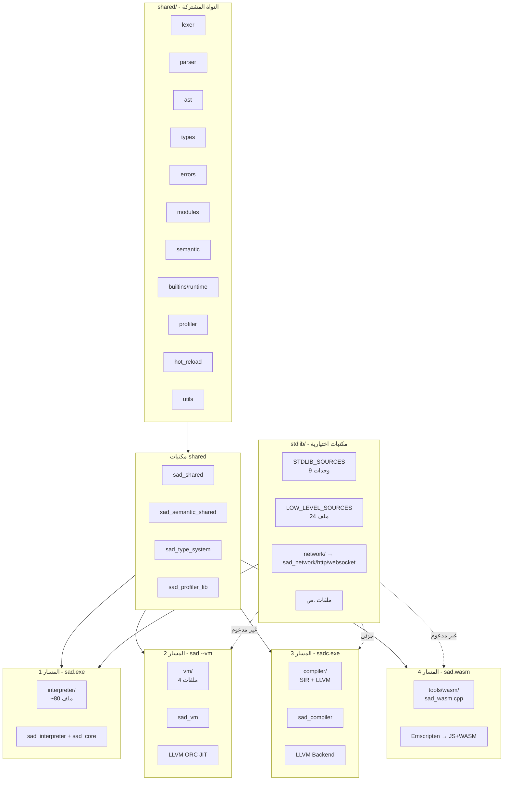

# 📘 الملخص الشامل للتفكيك المعماري — لغة ص

> **تاريخ التحديث:** 29 أبريل 2026
> **الإصدار:** v1.0
> **الغرض:** نقطة الدخول الموحَّدة لكل وثائق التفكيك المعماري — خريطة كاملة للمشروع.

---

## 🗺️ خريطة الوثائق

| # | الوثيقة | النطاق | الحالة |
|---|---|---|---|
| 1 | [project-overview.md v1.3.0](project-overview.md) | البنية الكاملة لـ 4 مسارات + Mermaid | ✅ |
| 2 | [architecture-cli-features.md](architecture-cli-features.md) | كل خيار CLI في sad/sadc → موقعه في الكود | ✅ |
| 3 | [architecture-tools-breakdown.md](architecture-tools-breakdown.md) | 11 برنامج تنفيذي في tools/ | ✅ |
| 4 | [architecture-stdlib-breakdown.md](architecture-stdlib-breakdown.md) | كل وحدة في stdlib/ + خارطة المسارات | ✅ |
| 5 | [architecture-shared-breakdown.md](architecture-shared-breakdown.md) | كل مكون في shared/ + اكتشافات الازدواج | ✅ |
| 6 | [architecture-interpreter-vm-breakdown.md](architecture-interpreter-vm-breakdown.md) | المسار 1 + 2 + المقارنة | ✅ |
| 7 | **هذه الوثيقة** | الملخص الموحَّد + الديون التقنية + التوصيات | ✅ |

---

## 🏛️ البنية الكلية في صفحة واحدة



---

## 📊 جدول المكتبات الكامل

| المكتبة | المصدر | المحتوى | يستخدمها |
|---|---|---|---|
| `sad_shared` | shared/CMakeLists.txt | Lexer+Parser+AST+Types+Errors+Modules | sad_core, sad_vm, sad_compiler, sad_interpreter |
| `sad_semantic_shared` | shared/semantic/ | Type Checker | sad_interpreter, sad_compiler |
| `sad_type_system` | shared/types/ | نظام الأنواع المتقدم | sad_shared, sad_semantic |
| `sad_profiler_lib` | tools/profiler/ | محرك التنميط | sad_core |
| `sad_core` | cmake/libraries.cmake | ALL_SOURCES (شامل) | sad.exe |
| `sad_interpreter` | interpreter/CMakeLists.txt | نواة المفسر فقط | اختبارات |
| `sad_vm` | vm/CMakeLists.txt | VM + JIT | sad.exe |
| `sad_compiler` | compiler/ | SIR + LLVM Backend | sadc.exe |
| `sad_semantic` | compiler/ | فاحص أنواع المترجم | sadc.exe |
| `sad_frontend` | compiler/ | واجهة sadc الأمامية | sadc.exe, اختبارات |
| `sad_network` | cmake/network.cmake | TCP/UDP/IPv4/IPv6 | sad_core |
| `sad_http` | cmake/network.cmake | HTTP client+server | sad_core |
| `sad_websocket` | cmake/network.cmake | WebSocket client+server | sad_core |
| `sad_ui` | sad_ui/CMakeLists.txt | نظام واجهات SDL2 | sad.exe |
| `sad_mobile` | cmake/executables.cmake | روابط iOS/Android | sad.exe |
| `sad_formatter` | cmake/executables.cmake | محرك تنسيق .ص | sad-fmt |
| `sad_ui_ir` | compiler/CMakeLists.txt | UI codegen IR | sadc |
| `sad_graphics_backend` | compiler/CMakeLists.txt | Graphics codegen | sadc |
| `sad_rt_runtime` | runtime/ | ABI/FFI runtime | sad.exe (اختياري) |

**المجموع: ~19 مكتبة ثابتة**

---

## 🎯 ملخص المسارات الأربعة

### المسار 1 — sad.exe (افتراضي)
- **المحرك:** Tree-walking interpreter
- **الملفات:** ~80 cpp
- **الميزات:** 100% (الإنتاج)
- **الاستخدام:** `sad ملف.ص`

### المسار 2 — sad --vm
- **المحرك:** Stack-based bytecode VM + JIT اختياري
- **الملفات:** 4 cpp
- **الميزات:** ~70% (تجريبي، بدون UI/Hot Reload)
- **الاستخدام:** `sad --vm ملف.ص`

### المسار 3 — sadc.exe
- **المحرك:** AST → SIR → LLVM IR → Native binary
- **الميزات:** كاملة + freestanding mode للنواة
- **الاستخدام:** `sadc ملف.ص -o ملف.exe`

### المسار 4 — sad.wasm (متصفح)
- **المحرك:** المفسر مُجمَّع لـ WebAssembly
- **الملفات:** sad_wasm.cpp فقط
- **الميزات:** أساسيات اللغة فقط (لا shared modules / network / disk)
- **الاستخدام:** JavaScript → `sadInterpreter.run(source)`

---

## 🚨 الديون التقنية المكتشفة (مرتبة حسب الأولوية)

### أولوية عالية 🔴

#### 1. ازدواج `sad_shared` ↔ `sad_core`
- **المشكلة:** نفس ملفات Lexer/Parser/AST/Types تُترجم مرتين
- **التأثير:** يضاعف وقت البناء، يزيد حجم الملف التنفيذي
- **الحل:** اجعل `sad_core` يربط `sad_shared` PUBLIC، أزل المُكرَّر من ALL_SOURCES
- **المرجع:** [architecture-shared-breakdown.md#الاكتشاف-1](architecture-shared-breakdown.md)

#### 2. ازدواج `sad_interpreter` ↔ `sad_core`
- **المشكلة:** نفس ملفات `interpreter/src/` تُترجم في المكتبتين
- **التأثير:** بناء أبطأ، حجم أكبر
- **الحل:** اجعل `sad_core` يربط `sad_interpreter` PUBLIC
- **المرجع:** [architecture-interpreter-vm-breakdown.md#الاكتشاف-1](architecture-interpreter-vm-breakdown.md)

#### 3. `sad_shared` يضم ملفاً من `interpreter/`
- **المشكلة:** انتهاك معماري — `class_manager.cpp` في shared CMakeLists
- **التأثير:** كسر مبدأ الفصل
- **الحل:** نقل `class_manager.cpp` إلى `shared/types/` أو `shared/managers/` جديد
- **المرجع:** [architecture-shared-breakdown.md#الاكتشاف-2](architecture-shared-breakdown.md)

### أولوية متوسطة 🟡

#### 4. تشتت تعريف stdlib
- **المشكلة:** stdlib مُعرَّف في 3 ملفات cmake مختلفة
- **التأثير:** صعوبة الصيانة، خطر الازدواج
- **الحل:** توحيد في `cmake/stdlib.cmake` واحد
- **المرجع:** [architecture-stdlib-breakdown.md#الاكتشاف-1](architecture-stdlib-breakdown.md)

#### 5. `LOW_LEVEL_SOURCES` يُجمَّع دائماً لكن نادر الاستخدام
- **المشكلة:** 24 ملف cpp تُجمَّع في `sad_core` لكنها للـ freestanding فقط
- **التأثير:** زيادة حجم `sad.exe` بدون داعي
- **الحل:** فصل إلى مكتبة `sad_low_level` تُربط فقط مع `sadc --freestanding`
- **المرجع:** [architecture-stdlib-breakdown.md#الاكتشاف-5](architecture-stdlib-breakdown.md)

#### 6. UI Bridge ضخم في المفسر
- **المشكلة:** 15 ملف cpp + ~5,000 سطر مدمجة في sad_interpreter
- **التأثير:** المفسر ثقيل حتى لـ CLI tools
- **الحل:** فصل إلى `sad_interpreter_ui` اختيارية
- **المرجع:** [architecture-interpreter-vm-breakdown.md#الاكتشاف-4](architecture-interpreter-vm-breakdown.md)

### أولوية منخفضة 🟢

#### 7. `crypto_builtins.cpp` معطَّل
- **المشكلة:** تعليق صريح في sources.cmake:223 يعطّله
- **الحل:** إصلاح نظام include أو حذف الملف
- **المرجع:** [architecture-stdlib-breakdown.md#الاكتشاف-3](architecture-stdlib-breakdown.md)

#### 9. `shared/profiler/` معزول عن `tools/profiler/`
- **المشكلة:** Header في shared/ والمكتبة في tools/
- **الحل:** توحيد في موقع واحد
- **المرجع:** [architecture-shared-breakdown.md#الاكتشاف-4](architecture-shared-breakdown.md)

#### 10. WASM لا يدعم stdlib عملياً
- **المشكلة:** كود `.ص` يستخدم `استورد رياضيات` لا يعمل في المتصفح
- **الحل:** تحديد subset من stdlib قابل للـ WASM وتجميعه فيه
- **المرجع:** [architecture-stdlib-breakdown.md#الاكتشاف-6](architecture-stdlib-breakdown.md)

---

## 📈 إحصائيات المشروع

| الفئة | العدد |
|---|---|
| **مكتبات ثابتة (.lib)** | ~19 |
| **برامج تنفيذية (.exe)** | 11 |
| **مسارات تنفيذ متوازية** | 4 |
| **ملفات cpp في shared/** | 98 |
| **ملفات cpp في interpreter/** | ~80 |
| **ملفات cpp في compiler/** | ~150+ |
| **ملفات cpp في vm/** | 4 |
| **ملفات cpp في stdlib/** | ~50 |
| **ملفات cpp في tools/** | ~30 |
| **ملفات cpp إجمالاً** | ~410+ |
| **كلمات محجوزة في اللغة** | 40 |
| **عوامل منطقية عربية** | 3 (و، أو، ليس) |

---

## 🎓 توصيات معمارية شاملة

### قصيرة المدى (يمكن تنفيذها فوراً)

1. ✅ توثيق كل ما سبق (مكتمل)
2. 🔧 إصلاح ازدواج `sad_shared`/`sad_core`
3. 🔧 نقل `class_manager.cpp` إلى shared/

### متوسطة المدى

5. 🏗️ توحيد `cmake/stdlib.cmake`
6. 🏗️ فصل `sad_low_level` كمكتبة منفصلة
7. 🏗️ فصل `sad_interpreter_ui` كمكتبة اختيارية
8. 🏗️ توحيد profiler في موقع واحد

### طويلة المدى

9. 🚀 إضافة JIT للمفسر (مثل VM)
10. 🚀 توسيع VM ليُساوي المفسر في الميزات
11. 🚀 تفعيل subset من stdlib في WASM
12. 🚀 إصلاح crypto_builtins.cpp

---

## 🏆 نقاط القوة المعمارية

رغم الديون التقنية، المشروع يتميز بـ:

1. ✅ **فصل واضح بين المسارات** — كل مسار له هدف محدد
2. ✅ **shared/ كنواة موحَّدة** — منع التكرار بين المفسر والمترجم
3. ✅ **نظام builtins lazy loading** — تحميل الوحدات عند الحاجة فقط
4. ✅ **دعم freestanding للنواة** — قدرة على بناء OS بلغة ص
5. ✅ **WebAssembly جاهز** — يعمل في المتصفح (subset)
6. ✅ **Smart Errors نظام تعليمي** — 24 ملف لتجربة مستخدم رائعة
7. ✅ **Type Checker مشترك** — حل ممتاز لـ F-01 (Phase 3)
8. ✅ **توثيق ثنائي اللغة في APIs** — معيار جودة عال

---

## 🔗 الوصول السريع للوثائق

```
docs/
├── project-overview.md ............................ نظرة عامة (v1.3.0)
├── architecture-cli-features.md .................. خارطة CLI
├── architecture-tools-breakdown.md ............... 11 برنامج tools/
├── architecture-stdlib-breakdown.md .............. تفكيك stdlib/
├── architecture-shared-breakdown.md .............. تفكيك shared/
├── architecture-interpreter-vm-breakdown.md ...... المسار 1 + 2
└── architecture-summary.md ....................... [أنت هنا] الملخص الشامل
```

---

## 📝 ما تبقى من تفكيك (للجلسات المستقبلية)

| المكون | الأهمية | الحالة |
|---|---|---|
| `compiler/` (SIR + LLVM) | 🔴 عالية | لم يُفكَّك بعد |
| `tools/lsp` + `tools/formatter` + `tools/repl` | 🟡 متوسطة | لم يُفكَّك بعد |
| `sad_ui/` | 🟡 متوسطة | لم يُفكَّك بعد |
| `runtime/` (freestanding ABI) | 🟢 منخفضة | لم يُفكَّك بعد |
| `tools/pkg` (مدير الحزم) | 🟢 منخفضة | لم يُفكَّك بعد |
| `network/`, `graphics/` | 🟢 منخفضة | لم يُفكَّك بعد |

---

**تاريخ آخر تحديث:** 29 أبريل 2026
**عدد الوثائق المُكتملة:** 7 من ~12 مخطَّطة
**النسبة المئوية للتفكيك:** ~58%
