# تفكيك مجلد `tools/` — البرامج التنفيذية وأهدافها

> **تاريخ التحديث:** 29 أبريل 2026
> **الغرض:** تحديد كل ملف تنفيذي فرعي في `tools/`، وما يفعله، وكيف يُبنى، وعلى أي مكتبات يعتمد.

---

## 📊 جدول البرامج التنفيذية

| البرنامج | المصدر | يربط بـ | يخدم | الغرض |
|---|---|---|---|---|
| `sad.exe` | `tools/compiler/main_simple.cpp` | sad_core, sad_vm, sad_type_system, sad_semantic, sad_network, sad_http, sad_websocket, sad_mobile, sad_ui, (sad_profiler_lib, sad_rt_runtime) | المسارات 1+2 (Interpreter+VM) | تنفيذ ملفات `.ص` مباشرة + كل الإمكانات |
| `sadc.exe` | `tools/compiler/main.cpp` + `compiler_driver_*.cpp` | sad_shared, sad_compiler, sad_mobile, LLVM_LIBS, (LLD) | المسار 3 (Compiler) | تجميع `.ص` إلى native executable |
| `sad-lsp.exe` | `tools/lsp/src/transport/lsp_main.cpp` + `json_rpc_transport.cpp` | sad_lsp_engine, nlohmann_json | الإيكوسيستم | خادم Language Server Protocol |
| `sad-fmt.exe` | `tools/formatter/fmt_main.cpp` + `compiler/src/format/sad_formatter*.cpp` | (لا شيء — يبني من المصدر مباشرة) | الإيكوسيستم | منسّق كود `.ص` |
| `sad-analizer.exe` | `tools/analizer/src/main.cpp` | sad_analizer_engine → sad_core | الإيكوسيستم | محلل ساكن متقدم |
| `sad-repl.exe` | `tools/repl/{main,repl_engine,history_manager,repl_commands}.cpp` | sad_core, sad_semantic | الإيكوسيستم | REPL تفاعلي |
| `sad-pkg.exe` | `tools/pkg/cli_v2.cpp` | (winhttp فقط على Windows) | الإيكوسيستم | مدير حزم |
| `sad-profiler.exe` | `tools/profiler/src/main.cpp` | sad_profiler_lib, sad_core, sad_semantic | الإيكوسيستم | تنميط مستقل (CLI dashboard) |
| `sad-apk.exe` | `tools/apk_builder/src/apk_builder.cpp` | (مستقل — لا يربط بأي مكتبة) | الإيكوسيستم Android | بناء حزم APK |
| `sad-android.exe` | `tools/android/...` (شرطي) | — | الإيكوسيستم Android | أداة Android |
| `sad_wasm.js/.wasm` | `tools/wasm/sad_wasm.cpp` (مع Emscripten) | (يبني المصدر بنفسه — Lexer+Parser+AST+Interpreter core) | WebAssembly | نسخة المتصفح |

---

## 🔍 تحليل كل أداة على حدة

### 1. `sad-lsp` — خادم LSP

**التركيب:**
- **مكتبة محرّك**: `sad_lsp_engine` (STATIC) — تحتوي على منطق LSP (completion, hover, diagnostics, semantic tokens, formatting)
- **برنامج تنفيذي**: `sad-lsp-server` — طبقة JSON-RPC + main()

**يربط بـ:** `sad_core` + `sad_formatter` + `nlohmann_json`

**التبعيات على الطبقات:**
- ✅ `shared/` (lexer/parser/ast/types/utils/errors)
- ✅ `compiler/include` (للوصول لـ semantic types)
- ⚠️ `sad_core` — يربط بالمفسر **رغم أنه لا ينفّذ كود!** (يستخدم AST visitors فقط)

**ميزات يدعمها (verified):**
- التكميل التلقائي
- `hover` معلومات
- التشخيص (`diagnostics`)
- رموز دلالية (`semantic tokens`)
- الانتقال للتعريف (`go to definition`)
- التنسيق (`formatting` — يستدعي `sad_formatter`)
- إعادة التسمية (`rename`)
- إجراءات الكود (`code actions`)

**مرشّح للتحسين:** يربط بـ `sad_core` بالكامل — يمكن استبدال ذلك بمكتبة فرعية فقط.

---

### 2. `sad-fmt` — منسّق الكود

**التركيب الفريد:**
- **لا يربط بأي مكتبة!** يبني من المصدر مباشرة:
  - `tools/formatter/fmt_main.cpp`
  - `compiler/src/format/sad_formatter.cpp`
  - `compiler/src/format/sad_formatter_rebuild.cpp`

**التبعيات على الطبقات:**
- ✅ `shared/` (lexer/parser/ast/types/errors)
- ✅ `compiler/include` (لـ formatter headers)

**سبب البناء المباشر:** المنسّق يحتاج فقط Lexer + Parser + AST formatting — لا يحتاج runtime ولا codegen. تجنّب ربط `sad_compiler` الكبير.

---

### 3. `sad-analizer` — المحلل الساكن المتقدم

**التركيب:**
- **مكتبة محرّك**: `sad_analizer_engine` (STATIC) — تحتوي:
  - `analyzer_engine.cpp` — منطق التحليل
  - `ast_analysis_visitor.cpp` — زائر AST
- **برنامج تنفيذي**: `sad-analizer` — مجرد main()

**يربط بـ:** `sad_core` (عبر `sad_analizer_engine`)

**التبعيات على الطبقات:**
- ✅ `shared/` (lexer/parser/ast/types/errors/utils)
- ⚠️ `sad_core` — نفس مشكلة LSP

**الميزات (verified):**
- اكتشاف الأخطاء النمطية
- اكتشاف الكود الميت
- اكتشاف الازدواج
- إحصائيات التعقيد

**مرشّح للتحسين:** فصل `sad_core` تماماً — يكفي `sad_shared` + `sad_semantic_shared`.

---

### 4. `sad-repl` — البيئة التفاعلية

**التركيب:**
- **برنامج مستقل**: `tools/repl/{main, repl_engine, history_manager, repl_commands}.cpp`

**يربط بـ:** `sad_core` + `sad_semantic`

**التبعيات على الطبقات:**
- ✅ `shared/` (lexer/parser/ast/types/errors/utils)
- ✅ `compiler/include`
- ✅ `sad_core` — **يستخدمه فعلاً للتنفيذ التفاعلي** (مبرّر)

**الميزات:**
- إدخال أسطر متعددة
- تاريخ الأوامر
- أوامر REPL خاصة (`.help`, `.exit`, `.vars`, إلخ)
- تنفيذ تفاعلي مع تخزين الحالة بين الأوامر

---

### 5. `sad-pkg` — مدير الحزم

**التركيب الفريد:**
- **برنامج بسيط**: ملف واحد `tools/pkg/cli_v2.cpp`
- **مكتبات**: `winhttp` فقط (Windows) — لا يربط بأي شيء من المشروع!

**التبعيات على الطبقات:**
- ❌ مستقل تماماً — لا يحتاج معرفة باللغة، فقط manifest parsing

**الميزات (من تحليل الملفات المجاورة):**
- `tools/pkg/dependency_resolver.h`
- `tools/pkg/http_client.h`
- `tools/pkg/registry_client_v2.h`
- `tools/pkg/toml_parser.h`
- `tools/pkg/manifests/` — قوالب
- استرداد الحزم من registry
- حل التبعيات
- TOML manifest parsing

**ملاحظة:** انفصاله الكامل يجعله الأخف وزناً — جيد معمارياً.

---

### 6. `sad-profiler` — منمّط الأداء

**التركيب:**
- **مكتبة**: `sad_profiler_lib` (في `shared/profiler/`) — منطق التنميط، يُربط أيضاً بـ `sad.exe`
- **برنامج تنفيذي**: `tools/profiler/src/main.cpp`

**يربط بـ:** `sad_profiler_lib` + `sad_core` + `sad_semantic` + (`ws2_32` على Windows)

**العلاقة مع `sad.exe`:** `sad --profile` يستخدم نفس `sad_profiler_lib` داخلياً. `sad-profiler` هو CLI مستقل لـ:
- تشغيل ملف مع تنميط
- عرض dashboards
- مقارنة runs

---

### 7. `sad-apk` — بناء APK

**التركيب الفريد:**
- **برنامج بسيط جداً**: ملف واحد `apk_builder.cpp`
- **بدون أي ربط** — مستقل تماماً!

**ما يفعله (verified من الكود):**
- ينشئ هيكل APK (manifest, resources, classes.dex)
- يحزم الموارد
- يوقّع APK (شرطي على JDK)

**العلاقة مع `sadc --android`:** `sadc` يولّد كود Kotlin/Compose، ثم `sad-apk` يبني APK من المخرج.

---

### 8. `sad_wasm` — WebAssembly

**التركيب الفريد:**
- **يبني المصدر مباشرة** بدون ربط بأي مكتبة من CMake العادي
- يستخدم Emscripten compiler خصيصاً (`emcmake`)
- يجمع: lexer_core + parser_core + ast_node + value + interpreter_core + statement_executor + expression_evaluator + builtin_functions + sad_wasm.cpp

**المخرجات:**
- `sad.js` — wrapper JavaScript
- `sad.wasm` — وحدة WebAssembly

**API المُصدَّر:**
- `_sad_execute(code)` — ينفّذ كود `.ص`
- `_sad_version()` — يعيد الإصدار
- `_malloc`, `_free` — إدارة الذاكرة

**ملاحظة:** هذا مسار رابع غير موثق في `project-overview.md`! المسار 4 = WebAssembly subset of interpreter.

---

## 🚨 اكتشافات معمارية مهمة

### الاكتشاف 1: `sad-fmt` و `sad-pkg` و `sad-apk` مستقلة تماماً

ثلاث أدوات لا تربط بـ `sad_core` ولا `sad_compiler`:
- `sad-fmt` — يبني المصدر مباشرة
- `sad-pkg` — مستقل (TOML + HTTP)
- `sad-apk` — مستقل (file IO فقط)

**نتيجة:** هذه الأدوات سريعة البناء جداً ولا تتأثر بتغييرات runtime.

### الاكتشاف 2: ازدواج الربط بـ `sad_core` في الأدوات الساكنة

`sad-lsp` و `sad-analizer` يربطان بـ `sad_core` رغم أنهما **لا ينفّذان أي كود**. هذا:
- يضخّم حجم البرنامج التنفيذي
- يطيل وقت البناء
- يربطهما بتغييرات المفسر

**التحسين المقترح:** تقسيم `sad_core` إلى:
- `sad_core_static` — visitors + AST utilities (بلا runtime)
- `sad_core_runtime` — actual interpreter execution

### الاكتشاف 3: WebAssembly = مسار رابع غير موثق

`sad_wasm` يستخدم نسخة مصغرة من المفسر — مسار مستقل عن المسارات الثلاثة الموثقة. يجب إضافته لـ `project-overview.md` كـ:
- **المسار 4**: Interpreter (WebAssembly subset) — للمتصفح فقط

### الاكتشاف 4: `sad-profiler` و `sad --profile` يتشاركان نفس المكتبة

`sad_profiler_lib` يُستخدم في:
1. `sad.exe` (`--profile` flag)
2. `sad-profiler.exe` (CLI مستقل)

هذا توحيد جيد ✅ — لا يحتاج تغيير.

### الاكتشاف 5: `sad-apk` لا يفهم لغة ص!

`sad-apk` ليس compiler — إنه packer. يأخذ مخرجات `sadc --android` ويحزمها. اسمه مضلِّل قليلاً — الأدق `sad-apk-packager`.

---

## 📋 خريطة شاملة للأدوات

```mermaid
graph TB
    subgraph Core["البرامج الأساسية"]
        SAD["sad.exe<br/>المفسر+VM"]
        SADC["sadc.exe<br/>المترجم AOT"]
    end

    subgraph DevTools["أدوات التطوير"]
        LSP["sad-lsp<br/>(Language Server)"]
        FMT["sad-fmt<br/>(Formatter)"]
        REPL["sad-repl<br/>(REPL)"]
        ANALYZER["sad-analizer<br/>(Static Analyzer)"]
    end

    subgraph Ecosystem["الإيكوسيستم"]
        PKG["sad-pkg<br/>(Package Manager)"]
        PROF["sad-profiler<br/>(Profiler CLI)"]
        APK["sad-apk<br/>(APK Builder)"]
        WASM["sad_wasm<br/>(Browser)"]
    end

    subgraph Libs["المكتبات الأساسية"]
        SHARED["sad_shared<br/>(Lexer+Parser+AST)"]
        SEM["sad_semantic_shared<br/>(TypeChecker)"]
        CORE["sad_core<br/>(=Interpreter)"]
        VM["sad_vm"]
        COMPILER["sad_compiler"]
        FORMATTER["sad_formatter"]
        PROFLIB["sad_profiler_lib"]
        ANALYZER_LIB["sad_analizer_engine"]
        LSP_ENGINE["sad_lsp_engine"]
    end

    SAD --> CORE
    SAD --> VM
    SAD --> SEM
    SAD --> PROFLIB

    SADC --> SHARED
    SADC --> COMPILER

    LSP --> LSP_ENGINE
    LSP_ENGINE --> CORE
    LSP_ENGINE --> FORMATTER

    FMT -.builds source.-> FORMATTER
    FMT -.uses headers.-> SHARED

    REPL --> CORE
    REPL --> SEM

    ANALYZER --> ANALYZER_LIB
    ANALYZER_LIB --> CORE

    PROF --> PROFLIB
    PROF --> CORE

    PKG -.standalone.-> PKG
    APK -.standalone.-> APK
    WASM -.builds source.-> SHARED
    WASM -.builds source.-> CORE

    style SAD fill:#d1fae5,stroke:#065f46
    style SADC fill:#e9d5ff,stroke:#6b21a8
    style WASM fill:#fde68a,stroke:#92400e
    style PKG fill:#fef3c7,stroke:#a16207
    style APK fill:#fef3c7,stroke:#a16207
    style FMT fill:#fef3c7,stroke:#a16207
```

---

## 📋 ملخص قابليات الأدوات وقت البناء

| الأداة | يحتاج LLVM؟ | يحتاج SDL2؟ | يحتاج Emscripten؟ | حجم تقريبي |
|---|---|---|---|---|
| `sad.exe` | ❌ | ✅ (UI) | ❌ | كبير (يحوي كل شيء) |
| `sadc.exe` | ✅ | ❌ | ❌ | كبير جداً (LLVM) |
| `sad-lsp` | ❌ | ❌ | ❌ | متوسط |
| `sad-fmt` | ❌ | ❌ | ❌ | صغير |
| `sad-repl` | ❌ | ❌ | ❌ | متوسط |
| `sad-analizer` | ❌ | ❌ | ❌ | متوسط |
| `sad-pkg` | ❌ | ❌ | ❌ | صغير جداً |
| `sad-profiler` | ❌ | ❌ | ❌ | متوسط |
| `sad-apk` | ❌ | ❌ | ❌ | صغير جداً |
| `sad_wasm` | ❌ | ❌ | ✅ | صغير (subset) |

---

## 🔗 المراجع

- [docs/architecture-cli-features.md](docs/architecture-cli-features.md) — خارطة CLI لـ sad/sadc
- [docs/project-overview.md](docs/project-overview.md) — النظرة المعمارية الكاملة
- [cmake/tools.cmake](cmake/tools.cmake) — تعريف بناء جميع الأدوات
- [cmake/executables.cmake](cmake/executables.cmake) — تعريف sad/sadc
- [cmake/wasm.cmake](cmake/wasm.cmake) — تعريف sad_wasm
