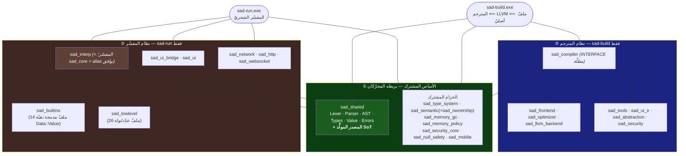

# خريطة حدود أهداف البناء — لغة ص

> **الغرض:** توثيق **الحدود الداخليّة** بين أهداف مكتبات CMake في monorepo لغة ص — أيُّ مكتبة *مشتركة* بين محرّكَي التنفيذ، وأيُّها *خاصّ* بأحدهما، وأين الحدّ **نظيفٌ بالربط لكنّه مسرَّبٌ بالتضمين**.
>
> **لماذا هذه الوثيقة؟** RFC [sadlang-rfcs#10](https://github.com/sadlang/sadlang-rfcs/blob/main/text/0010-unified-core-with-internal-boundaries.md) يوحّد قلب اللغة في monorepo **بحدود داخليّة** (لا فصل مستودعات). الحدود موجودة فعلًا في CMake لكنّها **غير موثَّقة** — فينشأ سوء فهم متكرّر («`sad_core` هو نواة اللغة»، «المترجم يربط `sad_core`») تصحّحه هذه الوثيقة بالخريطة المستخرَجة من الكود مباشرةً.
>
> **عدسة مختلفة عن الوثائق الأخرى:** [interpreter_compiler_layers.md](interpreter_compiler_layers.md) يفكّك *شجرة المصدر* (طبقات الكود). هذه الوثيقة تفكّك *رسم اعتماد الأهداف* (مَن يربط مَن في CMake). الأولى «ما الكود»، الثانية «ما حدود البناء».

---

## 1. الخلاصة في سطرين

1. **النواة الحقيقيّة للّغة = `sad_shared`** (المُحلّل اللفظيّ/النحويّ + AST + الأنواع + نظام القيمة `Data::Value` + الأخطاء + **المصدر المولَّد للحقيقة SoT**). هذا وحده هو الأساس الذي يبني عليه المحرّكان دلالات اللغة.
2. **`sad_core` سوء تسمية: هو المفسّر الشجريّ** (~90 ملفًّا من `interpreter/src` + المديرون)، **لا** نواة اللغة. **أُعيد تسميته `sad_interp`** (و`sad_core` صار alias توافق ريثما تُهاجَر المراجع — انظر §6).

---

## 2. الطبقات الثلاث

---

## 3. جدول الحدود (مستخرَج من CMake)

| الهدف | النوع | يربطه المفسّر `sad-run` | يربطه المترجم `sad-build` | التصنيف |
|---|---|:---:|:---:|---|
| **`sad_shared`** | STATIC | ✅ (عبر `sad_core`) | ✅ (مباشر) | **مشترك — أساس اللغة** |
| `sad_type_system` | STATIC | ✅ (مباشر) | ✅ (عبر `sad_compiler`) | مشترك — تحليل |
| `sad_semantic` (= `sad_ownership` alias) | STATIC | ✅ | ✅ | مشترك — تحليل |
| `sad_memory_gc` · `sad_memory_policy` | STATIC | ✅ | ✅ | مشترك — خدمات |
| `sad_security_core` | STATIC | ✅ | ✅ | مشترك — خدمات |
| `sad_null_safety` | STATIC | ✅ (مباشر) | ✅ (مباشر) | مشترك — خدمات |
| `sad_mobile` | STATIC | ✅ (مباشر) | ✅ (مباشر) | مشترك — منصّات |
| **`sad_core`** *(= المفسّر)* | STATIC | ✅ | ❌ | **مفسّر فقط** |
| `sad_runtime` *(خدمات وقت التشغيل)* | STATIC | ✅ (عبر `sad_core`) | ❌ | مفسّر فقط — يُرقَّى للحزام عند عودة الآلة الافتراضية |
| `sad_builtins` | STATIC | ✅ (عبر `sad_core`) | ❌ | مفسّر فقط |
| `sad_lowlevel` | STATIC | ✅ (عبر `sad_core`) | ❌ | مفسّر فقط |
| `sad_ui_bridge` · `sad_ui` | STATIC | ✅ | ❌ | مفسّر فقط |
| `sad_network` · `sad_http` · `sad_websocket` | STATIC | ✅ | ❌ | مفسّر فقط |
| **`sad_compiler`** | INTERFACE | ❌ | ✅ | **مترجم فقط** |
| `sad_frontend` · `sad_optimizer` · `sad_llvm_backend` | STATIC | ❌ | ✅ | مترجم فقط |
| `sad_tools` · `sad_ui_ir` · `sad_abstraction` · `sad_security` | STATIC | ❌ | ✅ | مترجم فقط |

**المصادر:** روابط التنفيذيّين في [apps/CMakeLists.txt](../../apps/CMakeLists.txt#L27) (sad-run) و[apps/CMakeLists.txt](../../apps/CMakeLists.txt#L145) (sad-build) — نُقلا من `cmake/executables.cmake` في المرحلة 3؛ روابط `sad_core` في [cmake/libraries.cmake](../../cmake/libraries.cmake)؛ مظلّة `sad_compiler` في [compiler/CMakeLists.txt](../../compiler/CMakeLists.txt#L607).

> **تصحيح سوء فهم شائع:** `sad-build` (المترجم) **لا يربط `sad_core`** — يربط `sad_shared` مباشرةً. المترجم لا يعرف المفسّر إطلاقًا. (الوثيقة الأقدم [interpreter_compiler_layers.md §7](interpreter_compiler_layers.md) تصوّر `sad_core` مظلّةً تحوي كلّ شيء — هذا متجاوَز؛ هذه الوثيقة هي المرجع.)

---

## 4. كيف يتطابق المحرّكان دون مشاركة التنفيذ؟

للمحرّكَين **مدمجات مستقلّة بالكامل عمدًا** — لأنّ بيئتَي التنفيذ مختلفتان جذريًّا:

| | المفسّر | المترجم |
|---|---|---|
| المدمجات | `sad_builtins` (تقييم C++ على `Data::Value` وقت التشغيل) | `compiler/src/frontend/builders/builtins_*.cpp` (توليد LLVM IR) |
| البيئة | تفسير شجريّ مباشر | كود أصليّ مُولَّد |

هذا **ليس ازدواجًا يجب حذفه** — بل تطبيقان لازمان لبيئتين. ما يضمن أنّهما يعطيان **نفس السلوك** ليس تشارُك التنفيذ، بل:

1. **مصدر حقيقة واحد (SoT):** كلاهما يشتقّ من `language-truth/*.yaml` عبر مولّدات `x.py gen` تنتج ملفّات مولَّدة في `sad_shared` (`builtin_registry.h` لأسماء/تواقيع المدمجات، `sadTypeKindArabicName` لأسماء الأنواع العربيّة: رقم/عشري/نص/منطقي/مصفوفة/خريطة/كائن/عدم/فراغ).
2. **بوّابة التكافؤ المزدوجة:** [tests/runner.py](../../tests/runner.py) يشغّل كلّ اختبار `.ص` بالمحرّكَين ويقارن المخرجات بِتًّا. الحدّ ≥86%؛ الحاليّ **95.4% (1988/2084، CONCERNS)**.

> أي تعديل سلوكيّ يجب أن يبدأ في `language-truth/` ثمّ يُعاد التوليد — لا تُحرّر الملفّات المولَّدة يدويًّا. حارس الانجراف `x.py gen --check` (بوّابة CI) يمنع تحرير المولَّد يدويًّا.

---

## 5. التسريب: أُغلق على مستويَي التصدير **والكتلة العامّة** (المرحلة 3)

كان تسريب ترويسات المفسّر يأتي من بابين: (أ) تصدير `sad_shared` لها `PUBLIC`، (ب) الكتلة العامّة `include_directories(... interpreter/include* ...)` في الجذر التي تمنحها لكلّ هدف. **أُغلق البابان معًا في المرحلة 3.**

**الباب (أ) — تصدير `sad_shared`** ([خطّة الاستخراج، خطوتا 2–3](sad_runtime-extraction-plan.md)): نُقلت ترويسة `ClassManager` (المواطن الأساس الوحيد الذي كان يبرّر التصدير) إلى `shared/types/`، فلم يَعُد أيُّ مصدرٍ في `sad_shared` يحتاج ترويسات المفسّر، وأُزيلت السطور الثلاثة من [shared/CMakeLists.txt](../../shared/CMakeLists.txt).

**الباب (ب) — الكتلة العامّة**: نُقلت مسارات `interpreter/include*` (الثمانية) من `include_directories` الجذر إلى **`sad_interp PUBLIC`** ([cmake/libraries.cmake](../../cmake/libraries.cmake))، فلا يراها إلا من يربط `sad_interp` (المفسّر + أدواته + اختباراته + `sad_ui_bridge` عبر `$<TARGET_PROPERTY>`). و`sad_runtime` (لا يربط `sad_interp`) يأخذها `PRIVATE`. ونوع الاستثناء المشترك `user_thrown.h` — الذي كان يُحتجَز في `interpreter/include` ويحتاجه `sad_builtins` — نُقل إلى `shared/errors/include` (موضعه الصحيح).

**النتيجة:** نظام المترجم (يربط `sad_shared` فقط، ولا `sad_interp`) لم يَعُد يَرى ترويسات المفسّر **لا بالتصدير ولا بالكتلة العامّة**. الحدّ نظيفٌ بنيويًّا الآن لا بالممارسة فقط. الحارس (§6) يبقى **وقائيًّا** يمنع أيّ انحدار مستقبليّ.

---

## 6. ما هو مقرَّر (يسلسله RFC #10)

| # | العمل | الحالة |
|---|---|---|
| 1 | **هذه الوثيقة** — خريطة الحدود | ✅ هنا |
| 2 | **تصحيح الاسم `sad_core` ← `sad_interp`** — الهدف الحقيقيّ صار `sad_interp`؛ `sad_core` alias توافق ([cmake/libraries.cmake](../../cmake/libraries.cmake)) | ✅ مطبَّق |
| 3 | **حارس تسريب التضمين** — [check_interpreter_boundary.py](../../scripts/codegen/check_interpreter_boundary.py) + [workflow](../../.github/workflows/interpreter-boundary.yml) يفشلان إن ضمّن نظام المترجم ترويسات `interpreter/`. **تقليم تصدير `sad_shared` التوافقيّ: أُنجز في المرحلة 3** (§5؛ نُقلت `ClassManager` إلى `shared/types/` وأُزيل التصدير). | ✅ مطبَّق (الحارس + التقليم) |
| 4 | **حارس طبقات الربط (G4)** — [check_layering.py](../../scripts/codegen/check_layering.py) + [workflow](../../.github/workflows/layering-lint.yml) يحلّلان رسمَ الربط في CMake ويفشلان إن ربط هدفٌ من أحد المحرّكَين هدفًا من المحرّك الآخر (أو ربط الأساس `sad_shared` محرّكًا). شقيق الحارس السابق لكن على مستوى **رسم الربط** لا التضمين. وقائيّ: الحدّ نظيفٌ اليوم (83 حافّة، صفر اختراق). | ✅ مطبَّق (المرحلة 3) |
| 5 | **تنفيذيّان رفيعان في `apps/`** — نُقلت نقاط دخول `sad-run`/`sad-build` من `cmake/executables.cmake` إلى [apps/CMakeLists.txt](../../apps/CMakeLists.txt) (ومصادر `main` إلى `apps/sad-run/` و`apps/sad-build/`)، فصار حدّ الطبقة L2 (التنفيذيّات تستهلك المكتبات ولا تُستهلَك) صريحًا. أُسقط مسار `vm/include` الميّت (حُذفت الآلة في #96). | ✅ مطبَّق (المرحلة 3) |
| 6 | **استخراج `sad_runtime`** — مكتبة ساكنة جديدة (`function_manager`+`object_manager`+`ownership_manager`) نُقلت مصادرها من `sad_core`؛ `sad_interp` يربطها PUBLIC (اتّجاه أحاديّ). موضع شقيق الآلة الافتراضية عند عودتها. انظر [خطّة الاستخراج](sad_runtime-extraction-plan.md). | ✅ مطبَّق (المرحلة 3) |
| 7 | **إغلاق الكتلة العامّة** — نُقلت مسارات `interpreter/include*` من `include_directories` الجذر إلى `sad_interp PUBLIC` (+ `sad_runtime PRIVATE`)، ونُقل `user_thrown.h` إلى `shared/errors/include`. الباب الثاني للتسريب أُغلق ⇒ المترجم لم يَعُد يرى ترويسات المفسّر بنيويًّا (§5). | ✅ مطبَّق (المرحلة 3) |

---

## 7. مراجع

- RFC الحاكم: [sadlang-rfcs#10 — قلب موحَّد بحدود داخلية](https://github.com/sadlang/sadlang-rfcs/blob/main/text/0010-unified-core-with-internal-boundaries.md)
- تفكيك شجرة المصدر (عدسة مكمّلة): [interpreter_compiler_layers.md](interpreter_compiler_layers.md)
- تفكيك الطبقة المشتركة: [shared_layer.md](shared_layer.md)
- منسّق البناء الذرّيّ: [x.py](../../x.py) (`build` / `gen` / `gen --check`)
- بوّابة التكافؤ المزدوجة: [tests/runner.py](../../tests/runner.py)
