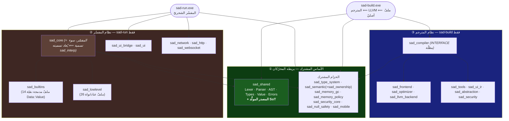

# خريطة حدود أهداف البناء — لغة ص

> **الغرض:** توثيق **الحدود الداخليّة** بين أهداف مكتبات CMake في monorepo لغة ص — أيُّ مكتبة *مشتركة* بين محرّكَي التنفيذ، وأيُّها *خاصّ* بأحدهما، وأين الحدّ **نظيفٌ بالربط لكنّه مسرَّبٌ بالتضمين**.
>
> **لماذا هذه الوثيقة؟** RFC [sadlang-rfcs#10](https://github.com/sadlang/sadlang-rfcs/blob/main/text/0010-unified-core-with-internal-boundaries.md) يوحّد قلب اللغة في monorepo **بحدود داخليّة** (لا فصل مستودعات). الحدود موجودة فعلًا في CMake لكنّها **غير موثَّقة** — فينشأ سوء فهم متكرّر («`sad_core` هو نواة اللغة»، «المترجم يربط `sad_core`») تصحّحه هذه الوثيقة بالخريطة المستخرَجة من الكود مباشرةً.
>
> **عدسة مختلفة عن الوثائق الأخرى:** [interpreter_compiler_layers.md](interpreter_compiler_layers.md) يفكّك *شجرة المصدر* (طبقات الكود). هذه الوثيقة تفكّك *رسم اعتماد الأهداف* (مَن يربط مَن في CMake). الأولى «ما الكود»، الثانية «ما حدود البناء».

---

## 1. الخلاصة في سطرين

1. **النواة الحقيقيّة للّغة = `sad_shared`** (المُحلّل اللفظيّ/النحويّ + AST + الأنواع + نظام القيمة `Data::Value` + الأخطاء + **المصدر المولَّد للحقيقة SoT**). هذا وحده هو الأساس الذي يبني عليه المحرّكان دلالات اللغة.
2. **`sad_core` سوء تسمية: هو المفسّر الشجريّ** (~90 ملفًّا من `interpreter/src` + المديرون)، **لا** نواة اللغة. مُقرَّر إعادة تسميته `sad_interp` (انظر §6).

---

## 2. الطبقات الثلاث



---

## 3. جدول الحدود (مستخرَج من CMake)

| الهدف | النوع | يربطه المفسّر `sad-run` | يربطه المترجم `sad-build` | التصنيف |
|---|---|:---:|:---:|---|
| **`sad_shared`** | STATIC | ✅ (عبر `sad_core`) | ✅ (مباشر) | **مشترك — أساس اللغة** |
| `sad_type_system` | STATIC | ✅ (مباشر) | ✅ (عبر `sad_compiler`) | مشترك — تحليل |
| `sad_semantic` (= `sad_ownership` alias) | STATIC | ✅ | ✅ | مشترك — تحليل |
| `sad_memory_gc` · `sad_memory_policy` | STATIC | ✅ | ✅ | مشترك — خدمات |
| `sad_security_core` | STATIC | ✅ | ✅ | مشترك — خدمات |
| `sad_null_safety` | STATIC | ✅ (مباشر) | ✅ (مباشر) | مشترك — خدمات |
| `sad_mobile` | STATIC | ✅ (مباشر) | ✅ (مباشر) | مشترك — منصّات |
| **`sad_core`** *(= المفسّر)* | STATIC | ✅ | ❌ | **مفسّر فقط** |
| `sad_builtins` | STATIC | ✅ (عبر `sad_core`) | ❌ | مفسّر فقط |
| `sad_lowlevel` | STATIC | ✅ (عبر `sad_core`) | ❌ | مفسّر فقط |
| `sad_ui_bridge` · `sad_ui` | STATIC | ✅ | ❌ | مفسّر فقط |
| `sad_network` · `sad_http` · `sad_websocket` | STATIC | ✅ | ❌ | مفسّر فقط |
| **`sad_compiler`** | INTERFACE | ❌ | ✅ | **مترجم فقط** |
| `sad_frontend` · `sad_optimizer` · `sad_llvm_backend` | STATIC | ❌ | ✅ | مترجم فقط |
| `sad_tools` · `sad_ui_ir` · `sad_abstraction` · `sad_security` | STATIC | ❌ | ✅ | مترجم فقط |

**المصادر:** روابط التنفيذيّين في [cmake/executables.cmake](../../cmake/executables.cmake#L19) (sad-run) و[cmake/executables.cmake](../../cmake/executables.cmake#L249) (sad-build)؛ روابط `sad_core` في [cmake/libraries.cmake](../../cmake/libraries.cmake)؛ مظلّة `sad_compiler` في [compiler/CMakeLists.txt](../../compiler/CMakeLists.txt#L610).

> **تصحيح سوء فهم شائع:** `sad-build` (المترجم) **لا يربط `sad_core`** — يربط `sad_shared` مباشرةً. المترجم لا يعرف المفسّر إطلاقًا. (الوثيقة الأقدم [interpreter_compiler_layers.md §7](interpreter_compiler_layers.md) تصوّر `sad_core` مظلّةً تحوي كلّ شيء — هذا متجاوَز؛ هذه الوثيقة هي المرجع.)

---

## 4. كيف يتطابق المحرّكان دون مشاركة التنفيذ؟

للمحرّكَين **مدمجات مستقلّة بالكامل عمدًا** — لأنّ بيئتَي التنفيذ مختلفتان جذريًّا:

| | المفسّر | المترجم |
|---|---|---|
| المدمجات | `sad_builtins` (تقييم C++ على `Data::Value` وقت التشغيل) | `compiler/src/frontend/builders/builtins_*.cpp` (توليد LLVM IR) |
| البيئة | تفسير شجريّ مباشر | كود أصليّ مُولَّد |

هذا **ليس ازدواجًا يجب حذفه** — بل تطبيقان لازمان لبيئتين. ما يضمن أنّهما يعطيان **نفس السلوك** ليس تشارُك التنفيذ، بل:

1. **مصدر حقيقة واحد (SoT):** كلاهما يشتقّ من `language-truth/*.yaml` عبر مولّدات `x.py gen` تنتج ملفّات مولَّدة في `sad_shared` (`builtin_registry.h` لأسماء/تواقيع المدمجات، `sadTypeKindArabicName` لأسماء الأنواع العربيّة: رقم/عشري/نص/منطقي/مصفوفة/خريطة/كائن/عدم/فراغ).
2. **بوّابة التكافؤ المزدوجة:** [tests/runner.py](../../tests/runner.py) يشغّل كلّ اختبار `.ص` بالمحرّكَين ويقارن المخرجات بِتًّا. الحدّ ≥86%؛ الحاليّ **92.8%**.

> أي تعديل سلوكيّ يجب أن يبدأ في `language-truth/` ثمّ يُعاد التوليد — لا تُحرّر الملفّات المولَّدة يدويًّا. حارس الانجراف `x.py gen --check` (بوّابة CI) يمنع تحرير المولَّد يدويًّا.

---

## 5. التسريب: نظيفٌ بالربط، مسرَّبٌ بالتضمين

الحدود **نظيفة على مستوى الربط** (الجدول أعلاه دقيق)، لكنّها **مسرَّبة على مستوى مسارات التضمين**:

[shared/CMakeLists.txt](../../shared/CMakeLists.txt#L116) يُصدّر ترويسات المفسّر كـ`PUBLIC` من `sad_shared`:

```cmake
# السطر 116 (في الكتلة «النظيفة»):
${CMAKE_SOURCE_DIR}/interpreter/include/managers   # ClassManager header

# السطور 119-131 تحت تعليق «للتوافق مع الكود القديم»:
${CMAKE_SOURCE_DIR}/interpreter/include
${CMAKE_SOURCE_DIR}/interpreter/include/managers
```

**الأثر:** أيُّ هدف يربط `sad_shared` — **ومنه نظام المترجم بأكمله** (`sad-build` يربط `sad_shared` مباشرةً) — يستطيع `#include` ترويسات المفسّر. الباب مفتوح.

**لكنّه تسريب كامن لا محقَّق:** فحص `compiler/src` و`compiler/include` أظهر أنّ **لا ملفّ مترجم يستغلّ هذا الباب فعلًا** (صفر `#include "interpreter/..."`). فالحدّ سليم اليوم بالممارسة، والخطر **مستقبليّ**: اقترانٌ عَرَضيّ قد يتسلّل بصمت.

لذلك فالحارس المقترَح (§6) **وقائيّ لا تصحيحيّ**: يثبّت الوضع السليم الحاليّ ويمنع انحداره.

---

## 6. ما هو مقرَّر (يسلسله RFC #10)

| # | العمل | الحالة |
|---|---|---|
| 1 | **هذه الوثيقة** — خريطة الحدود | ✅ هنا |
| 2 | **تصحيح الاسم `sad_core` ⟸ `sad_interp`** (إعادة التسمية إلى sad_interp) — يزيل سوء التسمية الجذريّ (الهدف مفسّر لا نواة) | مقرَّر |
| 3 | **حارس تسريب التضمين** — فحص CMake/CI يفشل إن ضمّن هدفٌ غير-مفسّر ترويسات `interpreter/`، ويُقلّم تصدير `sad_shared` للترويسات «التوافقيّة» تدريجيًّا | مقرَّر |

---

## 7. مراجع

- RFC الحاكم: [sadlang-rfcs#10 — قلب موحَّد بحدود داخلية](https://github.com/sadlang/sadlang-rfcs/blob/main/text/0010-unified-core-with-internal-boundaries.md)
- تفكيك شجرة المصدر (عدسة مكمّلة): [interpreter_compiler_layers.md](interpreter_compiler_layers.md)
- تفكيك الطبقة المشتركة: [shared_layer.md](shared_layer.md)
- منسّق البناء الذرّيّ: [x.py](../../x.py) (`build` / `gen` / `gen --check`)
- بوّابة التكافؤ المزدوجة: [tests/runner.py](../../tests/runner.py)
