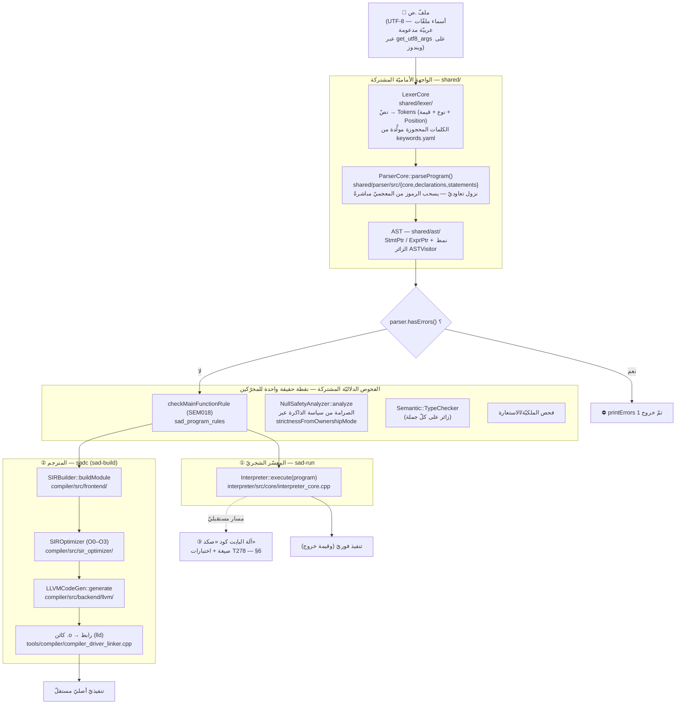
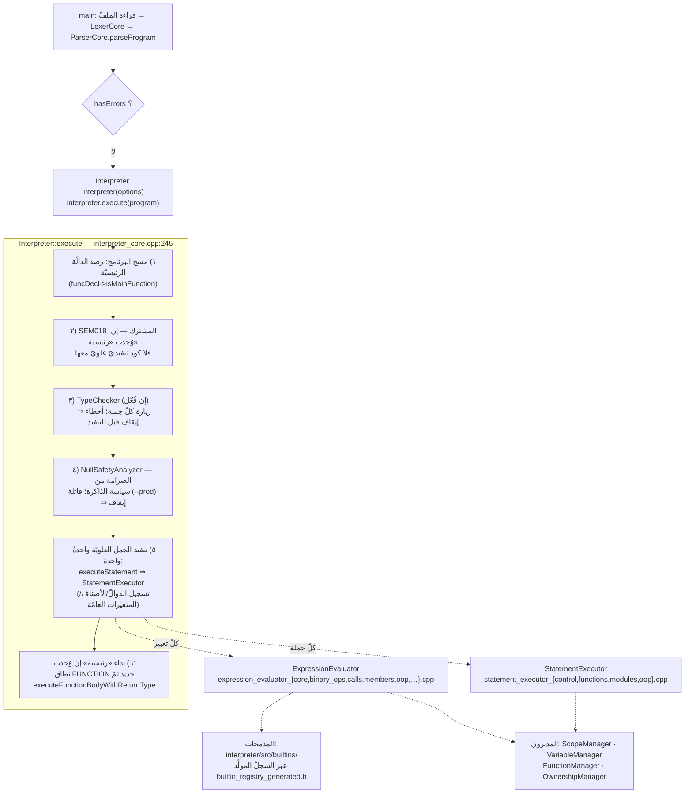
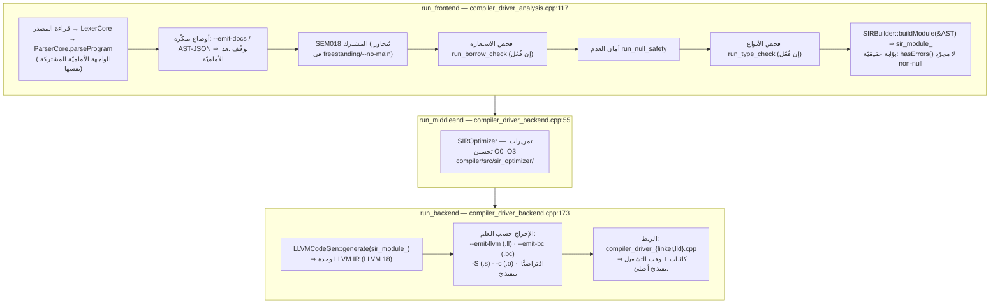
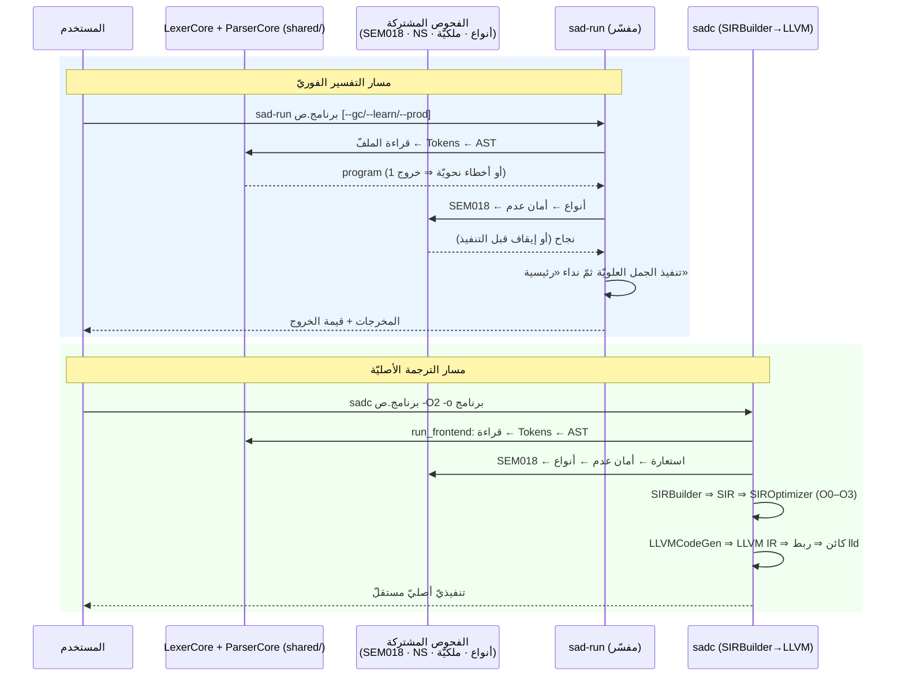

# مسار الكود — من قراءة ملفّ `.ص` إلى تنفيذه بالمحرّكات — لغة ص

> **الغرض:** توثيق الرحلة الكاملة لبرنامج `.ص` داخل هذا المستودع، خطوةً بخطوة
> وبأسماء الأصناف والملفّات الفعليّة: القراءة، فالواجهة الأماميّة المشتركة
> (المعجميّ → النحويّ → AST)، فالفحوص الدلاليّة المشتركة، ثمّ التفرّع إلى
> محرّكات التنفيذ: **① المفسّر الشجريّ** (`sad-run`)، **② المترجم** (`sadc`
> عبر SIR → LLVM → تنفيذيّ أصليّ)، **③ آلة البايت كود** (صيغة «صكد» — انظر
> حالتها الفعليّة في §6).
>
> **عدسة هذه الوثيقة:** تتبّع **تدفّق برنامج واحد** نهايةً-لنهاية (مَن يستدعي
> مَن وبأيّ ترتيب). لعدسة *حدود أهداف البناء* (مَن يربط مَن في CMake) انظر
> [cmake-target-boundaries.md](cmake-target-boundaries.md)، ولعدسة المهامّ
> والطبقات انظر مرجع المهارة
> [architecture.md](../../.github/skills/sad-lang-dev/references/architecture.md).

---

## 1. الخلاصة في ثلاثة أسطر

1. **الواجهة الأماميّة واحدة للجميع**: `LexerCore` ثمّ `ParserCore::parseProgram()`
   ينتجان AST الواحد نفسه (`shared/`) مهما كان محرّك التنفيذ.
2. **الفحوص الدلاليّة مكوّنات مشتركة** (قاعدة الرئيسيّة SEM018، أمان العدم،
   فاحص الأنواع، الملكيّة) يستدعيها المفسّر والمترجم من **نقطة الحقيقة نفسها**
   — هذا ما يمنع «تباعد المحرّكات».
3. **الاختلاف كلّه بعد AST**: المفسّر يمشي الشجرة مباشرةً (زوّار)؛ المترجم
   يخفضها `SIRBuilder` → `SIROptimizer` → `LLVMCodeGen` → ربط → تنفيذيّ.

---

## 2. الخريطة الكاملة

---

## 3. المسار المشترك — من الملفّ إلى شجرة مفحوصة

### 3.1 قراءة الملفّ
كلا المدخلَين ([apps/sad-run/main.cpp](../../apps/sad-run/main.cpp) و
[apps/sad-build/main.cpp](../../apps/sad-build/main.cpp)) يبدآن على ويندوز بضبط
`CP_UTF8` وجلب المعاملات عبر `sad::utf8::get_utf8_args()` — فأسماء الملفّات
العربيّة (`برنامج.ص`) تصل سليمة. ثمّ يُقرأ المصدر نصًّا كاملًا ويُسلَّم لمدير
الأخطاء (`ErrorManager::setSourceCode`) كي تعرض البلاغات لاحقًا سطر المصدر نفسه.

### 3.2 التحليل المعجميّ — `LexerCore`
[shared/lexer/](../../shared/lexer/) يحوّل النصّ إلى `Token`ات (نوع + قيمة +
`Position`). يتخطّى المسافات والتعليقات ويجمّع تعليقات التوثيق `##`. جدول
الكلمات المحجوزة **مولَّد** من `language-truth/keywords.yaml` إلى
`shared/lexer/generated/keywords_generated.*` (المبدأ الذهبيّ: SoT أوّلًا —
لا بيانات لغة مكتوبة يدويًّا في C++).

### 3.3 التحليل النحويّ — `ParserCore`
[shared/parser/](../../shared/parser/) نزول تعاوديّ: `parseProgram()` تكرّر
`parseDeclaration()` الذي يوزّع حسب الرمز إلى التصريحات/الجمل/التعابير
(ملفّات `src/{core,declarations,statements,specs,ui}/`). **المحلّل يسحب الرموز
من المعجميّ مباشرةً** (`ParserCore parser(lexer)`) — لا مرحلة وسيطة تجمع كلّ
الرموز أوّلًا. الناتج: `std::vector<StmtPtr>` — برنامجٌ كقائمة جمل علويّة من
عقد [shared/ast/](../../shared/ast/) (كلّ عقدة ترث `ASTNode` وتقبل `ASTVisitor`).

**بوّابة النحو**: `parser.hasErrors()` ⇒ طباعة الأخطاء والخروج — لا يصل AST
معطوب إلى أيّ محرّك.

### 3.4 الفحوص الدلاليّة — مكوّنات مشتركة (لا تباعد محرّكات)
الفحوص الآتية **يستدعيها المحرّكان كلاهما من المصدر نفسه**، وكلّ بلاغ يصدر
من كتالوج الأخطاء الموحّد (`ErrorCode::…` + placeholders — لا نصّ خطأ حرّ):

| الفحص | المكوّن المشترك | في المفسّر | في المترجم |
|---|---|---|---|
| قاعدة الرئيسيّة SEM018 | `sad_program_rules::checkMainFunctionRule` | [interpreter_core.cpp:301](../../interpreter/src/core/interpreter_core.cpp#L301) | [compiler_driver_analysis.cpp:506](../../tools/compiler/compiler_driver_analysis.cpp#L506) |
| أمان العدم NS | `NullSafetyAnalyzer` + `strictnessFromOwnershipMode` (الصرامة تُشتقّ من سياسة الذاكرة، لا تُبرمَج) | [interpreter_core.cpp:378](../../interpreter/src/core/interpreter_core.cpp#L378) | [compiler_driver_analysis.cpp:802](../../tools/compiler/compiler_driver_analysis.cpp#L802) |
| فحص الأنواع | `Semantic::TypeChecker` (زائر) | [interpreter_core.cpp:332](../../interpreter/src/core/interpreter_core.cpp#L332) | [compiler_driver_analysis.cpp:840](../../tools/compiler/compiler_driver_analysis.cpp#L840) |
| الملكيّة/الاستعارة | `OwnershipManager` / borrow check | خيار `enableOwnership` | `run_borrow_check` ([analysis:635](../../tools/compiler/compiler_driver_analysis.cpp#L635)) |

---

## 4. المحرّك ① — المفسّر الشجريّ (`sad-run`)

**نقطة الدخول**: [apps/sad-run/main.cpp](../../apps/sad-run/main.cpp) — بعد
أعلام سطر الأوامر (ومنها سياسة الذاكرة `--gc/--learn/--prod`) والأوضاع الخاصّة
(استخراج التوثيق `DocsExtractor`، خادم التصحيح DAP)، الوضع العاديّ:

- **الحالة** تعيش في أربعة مديرين يملكهم `InterpreterCore` (النطاقات،
  المتغيّرات، الدوالّ، الملكيّة)؛ التقييم والتنفيذ **زوّار** مقسّمون ملفًّا
  لكلّ مسؤوليّة (SRP) في `interpreter/{include,src}/visitors/`.
- **التزامن**: كلّ goroutine تعمل بـ`StatementExecutor` مستقلّ (بمديريه)،
  ويُشارَك `FunctionManager` للقراءة فقط؛ الالتقاط snapshot عبر
  `captureVisibleVariables()`.
- بعد كلّ جملة علويّة يُفحَص `ErrorManager::hasErrors()` — خطأ زمن تشغيل ⇒
  إيقاف بنتيجة فاشلة.

---

## 5. المحرّك ② — المترجم `sadc` (`sad-build`)

**نقطة الدخول**: [apps/sad-build/main.cpp](../../apps/sad-build/main.cpp) —
بعد الأوامر الفرعيّة (`بناء أندرويد`، `واجهة`، `حزم`) يسلّم لـ
`sad::driver::CompilerDriver::run` (التنفيذ في
[tools/compiler/](../../tools/compiler/) موزّعًا على ملفّات
`compiler_driver_{cli,frontend,analysis,backend,linker,lld}.cpp`):

- **لماذا SIR وسيط؟** يفصل دلالات الملكيّة/الأنواع/التعداد الجبريّ (~٩٠
  opcode في [sir_types.h](../../compiler/include/frontend/sir_types.h)) عن
  تفاصيل LLVM، ويتيح التحسين والتشخيص (`--emit-llvm`، SIR dumps).
- **codegen المدمجات** له نظير خلفيّ خاصّ في
  `compiler/src/backend/llvm/builders/builtins/` — الدالّة المضمّنة تُنفَّذ
  في المفسّر وتُولَّد في المترجم من **YAML SoT نفسه**.
- تعدّد الملفّات: عند الحاجة للربط يُترجَم كلّ مصدر إلى كائن ثمّ تُربَط
  الكائنات؛ صيغ الإخراج أحاديّة الوحدة (`--emit-llvm` وأخواتها) تُرفَض
  صراحةً مع مدخلات متعدّدة.

### الوضعُ (`--حرّ`) والهدفُ (`--هدف`) — أربعةُ محكّاتٍ لا يجوز خلطها

رايتان مستقلّتان تمامًا، وخلطُهما وَلَّد عائلةَ عيوبٍ كاملةً في خفض المدمجات
منخفضة المستوى:

| المحكّ | ما يقرّره | مِن أين يُقرأ |
|---|---|---|
| **الوضع** `--حرّ` | أتوجد libc؟ أتُبَثُّ بدائلُ `malloc`/`memcpy` داخل الوحدة؟ | `freestanding_` (رايةُ السائق) |
| **عرضُ المؤشّر** | `size_t` وتوقيعاتُ دوالّ المكتبة ووسائطُ نداء النظام | `getSizeType()` ← تخطيط بيانات الوحدة |
| **عرضُ السجلّ** | معاملاتُ الأسمبلي المضمَّن: سجلّاتُ التحكّم، `invlpg`، واصفاتُ الجداول | `getTargetGprType()` ← **معماريّةُ الثالوث** |
| **عائلةُ المعالج** | أيصحّ بثُّ التعليمة أصلًا (`cli`/`outb`/`rdtsc`)؟ | `findArchConstraint()` ← `arch_specific_opcodes.yaml` |

**الثلاثةُ الأخيرةُ ليست واحدًا**، وكلُّ خلطٍ بينها عطبٌ مقيس:

- **وضعٌ بدل عرضِ سجلّ**: كان خفضُ سجلّات التحكّم يتفرّع على `freestanding_`
  ثمّ يثبّت عرضَ i686، فيبثّ `mov %cr3, %eax` لهدفٍ ٦٤‑بتّيّ. نواةُ النحلة
  (٥٩٬٠٤٧ سطرًا) ولّدت IR كاملًا بصفر خطأٍ وصفر تحذير، ثمّ ردّ المُجمِّعُ
  **١٩ خطأً كلُّها `cannot compile inline asm`**.
- **عرضُ مؤشّرٍ بدل عرضِ سجلّ**: على `x86_64-…-gnux32` يعطي التخطيطُ
  `p:32:32` وسجلّاتُ المعالج ٦٤ — فاشتقاقُ العرض من المؤشّر يعيد إنتاج العطب
  نفسِه (`instruction requires: Not 64-bit mode`).
- **عرضُ سجلٍّ بدل عائلةِ معالج**: العرضُ الصحيحُ لا يجعل التعليمةَ موجودة.
  `عداد_الدورات()` بـ`--هدف=aarch64-unknown-elf` كان يخرج **بصفر** ويبثّ
  `rdtsc`.

**الحرّاس** (`tests/system/lowlevel_freestanding/`):

- `test_cpu_ctl_target_width.py` — عرضُ السجلّ على i686 وx86_64 وx32، **ويُجمِّع
  الناتجَ بـclang فعلًا** لا يقرأ نصَّ IR فقط. (الحارسُ الذي سبقه كان يقرأ
  النصَّ ولا يمرّر `--هدف`، فرأى `mov %cr0, reg32` على هدفٍ ٦٤‑بتّيٍّ وصدَّقه.)
- `test_arch_specific_opcodes_sot.py` — انجرافُ مصدر الحقيقة من طرفين: لا اسمَ
  ميّتًا فيه، **ولا مُصدِرَ x86 خارجَه**.
- `test_arch_gate.py` — **أثرُ** البوّابة لا جدولُها: رفضٌ خارجَ العائلة
  (aarch64، riscv64) **وقبولٌ داخلَها** (i686، x86_64). الحالةُ الموجبةُ ليست
  زينة: البوّابةُ رفضت i686 — معماريّةَ النواة — لأنّ اسمَها القانونيَّ `i386`،
  ولم يمسك ذلك إلّا هي.

> ⚠️ **مدى الحرّاس**: عرضُ السجلّ وعائلةُ المعالج في الأسمبلي **المولَّد من
> المدمجات**. ولا يشمل:
>
> 1. **شكلَ** البيانات التي يبنيها مصدرُ النواة (واصفُ الجدول ١٠ بايت في الوضع
>    الطويل مقابل ٦ في المحميّ) — تلك بلغة ص لا يمسُّها المترجم.
> 2. ~~**كتلةَ `تجميع … نهاية`**~~ — **أُغلِق (٢٠٢٦‑٠٨‑١٩)**. كان الدَّينُ: ملفُّ
>    اللهجة يُعلن `architectures: [i686]` والإعلانُ **لا يُبَثُّ في الرأس المولَّد
>    ولا يُفحَص عند الخفض**، فكتلةٌ فيها `عطّل_المقاطعات` و`أوقف` بـ
>    `--هدف=aarch64-unknown-elf` تخرج **بصفر** وتبثّ `cli` و`hlt` كما هما.
>    والذي كشفه أخيرًا ليس هذا النصَّ بل **توسيعُ التغطية**: حين صارت اختباراتُ
>    مصفوفةِ القواعدِ تُشغَّل على `macos-14-arm64` ماتت ثمانيةُ اختباراتٍ موجبةٍ في
>    المُجمِّعِ نفسِه (`unrecognized instruction mnemonic` على `cli` و`ltr w9` و
>    `lea 8(%ebx), %eax`)، بينما مرّ اثنا عشرَ اختبارًا سالبًا **بحقّ** — مرساةُ كلٍّ
>    منها رمزُ خطأٍ دلاليٍّ يسبق التوليد. 🔑 والدرس: الأخضرُ كان يقيس الطبقةَ
>    الدلاليّةَ وحدَها، والعطبُ في طبقةٍ لم يحرسها أحد.
>
>    الإغلاق: معجمٌ **لكلِّ معماريّة**
>    (`assembly_mnemonics/{i686,x86_64,aarch64,riscv64}.yaml`)
>    ومعه نكهةُ مُجمِّعِها (بادئةُ السجلِّ والثابت، ترتيبُ المعاملات، أصريحةٌ الوجهةُ
>    أم ضمنيّة، شكلُ العنونة) — يقرؤها الخافضُ من مصدرِ الحقيقةِ لا من حرفيّاتٍ
>    مبثوثةٍ فيه؛ والسائقُ يضبط المعماريّةَ الفاعلةَ من **ثالوثِ الهدف** قبل التحليل؛
>    وهدفٌ لا معجمَ له يُرفَض بـSEM044 يسمّيه بدل أن يُخفَض بمعجمِ غيرِه. ويحرسُه
>    `scripts/ci/check_asm_dialect_arch.py`: يقيس وسمَ `@arch` على المعجمِ **بشكلِ
>    المعاملاتِ لا بوجودِ الاسم** — لأنّ «اضرب» موجودةٌ في المعاجمِ الثلاثةِ وهي
>    أحاديّةُ المعاملِ على x86 وثلاثيّةٌ على AArch64 — ويحاكم الاتّجاهين: وسمٌ أضيقُ
>    يُخفي تغطيةً، وأوسعُ يُحمِّر منصّةً لا يصلح لها.

---

## 6. المحرّك ③ — آلة البايت كود «صكد» (الحالة الفعليّة)

بصدق الحالة الراهنة في الشجرة الحاليّة:

- **الموجود**: صيغة بايت كود معرَّفة برقم سحريّ «صكد» (`0xD8 0xB5 0xD9 0x83
  0xD8 0xAF`) وترقيم إصدار، مغطّاة باختبارات وحدة في
  [tests/unit/bytecode/test_bytecode.cpp](../../tests/unit/bytecode/test_bytecode.cpp)
  (المهمّة T278).
- **غير الموجود بعد**: لا مجلّد `vm/` ولا هدف CMake للآلة في الشجرة الحاليّة؛
  اختبارات الصيغة تحاكي تعريفات `format.h` محلّيًّا.
- **التصميم المقصود** (كما في دليل المطوّرين، فصل VM): آلة بايت كود **مرتبطة
  بالمفسّر** — مسار تنفيذ بديل أسرع من المشي الشجريّ الصرف دون المرور
  بـLLVM، مع ربطها بطبقة `runtime/` (ABI/FFI).

> عند اكتمالها يصير للشجرة ثلاثة مسارات تنفيذ حيّة: AST → مفسّر، AST →
> بايت كود → VM، AST → SIR → LLVM. حتى ذلك الحين، **المحرّكان الحيّان هما
> المفسّر والمترجم** — وكلّ ميزة لغويّة تُختبَر فيهما معًا (قاعدة BF-08:
> عمِلت في `sad-run` وفشلت في `sadc` ⇒ المشكلة في SIR/LLVM).

---

## 7. تسلسل نهاية-لنهاية (المساران الحيّان)

---

## 8. جدول مرجعيّ سريع

| المرحلة | الصنف / الدالّة | الملفّ المفتاح |
|---|---|---|
| الدخول (تفسير) | `main` | [apps/sad-run/main.cpp](../../apps/sad-run/main.cpp) |
| الدخول (ترجمة) | `main` → `CompilerDriver::run` | [apps/sad-build/main.cpp](../../apps/sad-build/main.cpp) + [tools/compiler/](../../tools/compiler/) |
| المعجميّ | `LexerCore` | `shared/lexer/` (+ `generated/keywords_generated.*`) |
| النحويّ | `ParserCore::parseProgram` | `shared/parser/include/parser_core.h` |
| AST | `ASTNode` + `ASTVisitor` | `shared/ast/include/` |
| قيم التشغيل | `Data::Value` (+ `SadTypeKind` المولَّد) | `shared/types/include/value.h` |
| SEM018 | `Semantic::checkMainFunctionRule` | `sad_program_rules` (مشترك) |
| أمان العدم | `NullSafetyAnalyzer::analyze` | مكوّن مشترك (الصرامة من سياسة الذاكرة) |
| فحص الأنواع | `Semantic::TypeChecker` | مكوّن مشترك (زائر) |
| تنفيذ المفسّر | `Interpreter::execute` | [interpreter/src/core/interpreter_core.cpp:245](../../interpreter/src/core/interpreter_core.cpp#L245) |
| الزوّار | `ExpressionEvaluator` / `StatementExecutor` | `interpreter/{include,src}/visitors/` |
| المدمجات (تفسير) | السجلّ المولَّد + التنفيذ | `shared/builtins/generated/` + `interpreter/src/builtins/` |
| خفض SIR | `SIRBuilder::buildModule` | `compiler/src/frontend/` + [sir_types.h](../../compiler/include/frontend/sir_types.h) |
| تحسين SIR | `SIROptimizer` | `compiler/src/sir_optimizer/` |
| توليد LLVM | `LLVMCodeGen::generate` | `compiler/src/backend/llvm/` (+ `builders/builtins/`) |
| الربط | `invoke_linker` / lld | `tools/compiler/compiler_driver_{linker,lld}.cpp` |
| بايت كود «صكد» | صيغة + اختبارات (T278) | [tests/unit/bytecode/](../../tests/unit/bytecode/) |

## 9. نقاط تشخيص عمليّة

- **اختلف سلوك المفسّر عن المترجم** ⇒ المشكلة في `SIRBuilder` أو `LLVMCodeGen`
  (BF-08) — الواجهة الأماميّة والفحوص مشتركة فلا تكون مصدر الاختلاف.
- ولّد الوسيط وافحصه: `sadc برنامج.ص --emit-llvm` (الكتلة الأولى، أنواع
  الحقول، `getelementptr`).
- بيانات اللغة (كلمة/مدمجة/خطأ/نوع) تُعدَّل في `language-truth/*.yaml` ثمّ
  يُعاد التوليد — لا تُحرَّر `*/generated/` يدويًّا (لكنّها متتبَّعة وتُودَع
  مع YAML في الدفعة نفسها).

---
**اقرأ بعدها:** [cmake-target-boundaries.md](cmake-target-boundaries.md)
(حدود الأهداف) · دليل المطوّرين `dev-guide` (فصول الأماميّة/الخلفيّة المفصّلة).
