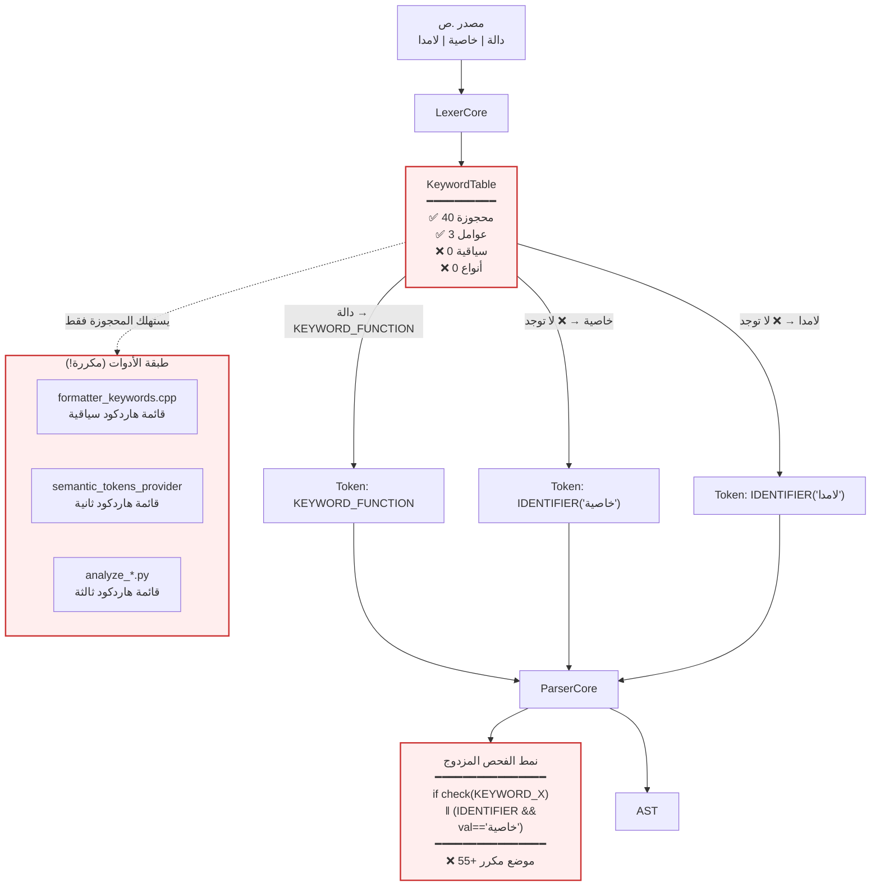
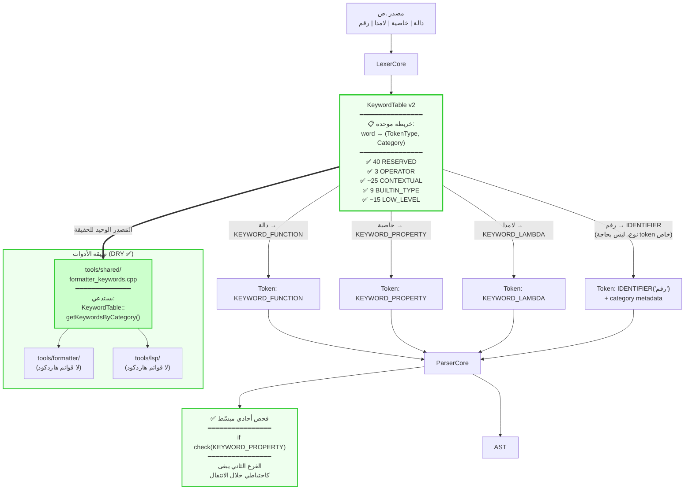

# خطة إعادة تصميم `Sad::Lexer::KeywordTable`

> **الإصدار:** 4.0 (الحل الجذري الكامل — YAML كمصدر حقيقة واحد)
> **الحالة:** v4 جاهزة للموافقة + التنفيذ
> **النطاق:** `data/`، `shared/lexer/`، `shared/parser/`، `tools/shared/`، `tools/formatter/`، `tools/lsp/`، CMake، CI
> **بناءً على:** توصية Dr. Quinn في الحفلة الثانية (Anti-pattern of Distributed Truth)

---

## ⚠️ ملحق v4 — مصدر حقيقة واحد (Single Source of Truth)

### الاكتشاف الجوهري

تشخيص Dr. Quinn كان دقيقاً: **v1, v2, v3 جميعها علاجات للعَرَض، ليست للسبب الجذري**.

السبب الجذري الحقيقي:
> **معجم اللغة موزَّع عبر عدة طبقات في الكود ⇒ كل طبقة تحوي نسخة من الحقيقة ⇒ التزامن يدوي ⇒ تكرار حتمي.**

الحل الجذري الوحيد: **مصدر بيانات واحد خارج الكود** ⇒ مُولِّد يُنشئ كل النسخ المطلوبة وقت البناء ⇒ صفر تكرار يدوي.

---

## التصميم النهائي v4

### الهيكل العام

```
┌────────────────────────────────────────────────────────────────────┐
│  📜 data/language/keywords.yaml  ← المصدر الوحيد المطلق للحقيقة     │
│                                                                    │
│  reserved:        # 40 — Lexer يُصدرها KEYWORD_*                    │
│    - word: دالة                                                     │
│      tokenType: KEYWORD_FUNCTION                                    │
│      role: block_opener                                             │
│      english: function                                              │
│    - word: ارجع                                                     │
│      tokenType: KEYWORD_RETURN                                      │
│      ...                                                            │
│                                                                    │
│  operators:       # 3 — OP_AND/OR/NOT                              │
│    - word: و                                                        │
│      tokenType: OP_AND                                              │
│                                                                    │
│  contextual:      # ~25 — Lexer يُصدر IDENTIFIER؛ parser سياقي     │
│    - word: خاصية                                                    │
│      tokenType: KEYWORD_PROPERTY                                    │
│      role: block_opener                                             │
│      english: property                                              │
│    - word: نفّذ                                                     │
│      tokenType: KEYWORD_IMPL                                        │
│      aliases: [نفذ]                                                  │
│      english: impl                                                  │
│                                                                    │
│  builtin_types:   # 9 — IDENTIFIER؛ يمكن استخدامها كأسماء          │
│    - word: رقم                                                      │
│      english: integer                                              │
│    - word: نص                                                       │
│      english: string                                               │
└────────────────────────────────────────────────────────────────────┘
                              │
                              ▼ (build-time, scripts/codegen/gen_keywords.py)
              ┌───────────────┴────────────────┐
              ▼                                ▼
   ┌──────────────────────┐         ┌──────────────────────┐
   │ keywords_generated.h │         │ keywords_generated.cpp│
   │ (KeywordCategory     │         │ (التهيئة الكاملة      │
   │  enum + APIs)        │         │  للجدول من YAML)      │
   └──────────────────────┘         └──────────────────────┘
                       │                      │
                       └──────────┬───────────┘
                                  ▼
              ┌──────────────────────────────────┐
              │   Sad::Lexer::KeywordTable       │
              │   (يستهلك الكود المولَّد فقط)      │
              └──────────────────────────────────┘
                              │
       ┌──────────────────────┼─────────────────────────┐
       ▼                      ▼                         ▼
  ┌─────────┐          ┌──────────┐              ┌──────────────┐
  │  Lexer  │          │  Parser  │              │ tools/shared │
  │         │          │          │              │              │
  │ getEntry│          │ check    │              │ getKeywords  │
  │ ()      │          │ Contextual│              │ ByCategory   │
  │         │          │ helper    │              │              │
  └─────────┘          └──────────┘              └──────────────┘
                              │                         │
                              ▼                         ▼
                     ┌──────────────┐          ┌──────────────┐
                     │ 0 كلمات      │          │ 0 قوائم      │
                     │ عربية في     │          │ هاردكود      │
                     │ كود C++      │          │              │
                     └──────────────┘          └──────────────┘
```

### مكونات v4

| المكون | الموقع | الوصف |
|--------|--------|-------|
| **مصدر الحقيقة** | `data/language/keywords.yaml` | معجم اللغة الكامل، صنف-حسب-فئة |
| **مخطط التحقق** | `data/language/keywords.schema.json` | JSON Schema يفحص بنية YAML وقت البناء |
| **المُولِّد** | `scripts/codegen/gen_keywords.py` | Python script يحوّل YAML ⇒ C++ |
| **الكود المُولَّد** | `shared/lexer/generated/keywords_generated.{h,cpp}` | لا يُحرَّر يدوياً، يُولَّد قبل البناء |
| **التكامل** | `cmake/codegen.cmake` | يضيف custom command للمُولِّد، إعادة توليد عند تغيير YAML |
| **الواجهة العامة** | `shared/lexer/include/lexer_keywords.h` | يُعيد توجيه إلى الكود المولَّد |
| **بوابة CI** | `.github/workflows/codegen-check.yml` | يضمن أن الكود المولَّد متزامن مع YAML |

### مثال YAML (مقتطف)

```yaml
# data/language/keywords.yaml
# (AR) المصدر الوحيد المطلق لكلمات لغة ص. لا تعدّل أي ملف keywords_generated.* مباشرة
# (EN) Single source of truth for Sad language lexicon. Never edit generated files directly.

version: "4.0"
language: "sad"

categories:
  reserved:
    description: "كلمات محجوزة دائماً، Lexer يُصدر KEYWORD_*"
    emittedByLexer: true
    keywords:
      - word: "دالة"
        tokenType: KEYWORD_FUNCTION
        roles: [block_opener]
        english: "function"
      - word: "نهاية"
        tokenType: KEYWORD_END
        roles: [block_closer]
        english: "end"
      # ... 38 آخرين

  operators:
    description: "عوامل منطقية تُلفظ كلمات"
    emittedByLexer: true
    keywords:
      - word: "و"
        tokenType: OP_AND
        english: "and"
      - word: "أو"
        tokenType: OP_OR
      - word: "ليس"
        tokenType: OP_NOT

  contextual:
    description: "كلمات سياقية: Lexer يُصدر IDENTIFIER، Parser يقرر سياقياً"
    emittedByLexer: false
    keywords:
      - word: "خاصية"
        tokenType: KEYWORD_PROPERTY
        roles: [block_opener]
        english: "property"
      - word: "نفّذ"
        tokenType: KEYWORD_IMPL
        aliases: ["نفذ"]
        roles: [block_opener]
        english: "impl"
      # ... ~23 آخرين

  builtin_types:
    description: "أسماء أنواع مدمجة، يمكن استخدامها كأسماء متغيرات"
    emittedByLexer: false
    keywords:
      - word: "رقم"
        english: "integer"
      - word: "نص"
        english: "string"
      # ... 7 آخرين
```

### المُولِّد (`scripts/codegen/gen_keywords.py`)

```python
"""
(AR) مُولِّد كود ج++ من keywords.yaml. يُستدعى من CMake وقت البناء.
(EN) C++ codegen from keywords.yaml. Invoked by CMake at build time.
"""
import yaml, json, sys
from pathlib import Path
from jsonschema import validate

def main(yaml_path, schema_path, header_out, source_out):
    data = yaml.safe_load(Path(yaml_path).read_text(encoding='utf-8'))
    schema = json.loads(Path(schema_path).read_text(encoding='utf-8'))
    validate(data, schema)  # G_VALIDATE: يتعطل إن YAML معطوبة

    emit_header(header_out, data)
    emit_source(source_out, data)

if __name__ == '__main__':
    main(*sys.argv[1:])
```

يُنتج:

**`keywords_generated.h`:**
```cpp
// AUTO-GENERATED FROM data/language/keywords.yaml — DO NOT EDIT
#pragma once
namespace Sad::Lexer::Generated {
enum class KeywordCategory : uint8_t {
    RESERVED, OPERATOR, CONTEXTUAL, BUILTIN_TYPE
};
struct KeywordEntry {
    std::string_view             primaryWord;
    TokenType                    type;
    KeywordCategory              category;
    bool                         emittedByLexer;
    std::vector<std::string_view> aliases;
    std::vector<std::string_view> roles;
};
const std::vector<KeywordEntry>& allEntries();
} // namespace Sad::Lexer::Generated
```

**`keywords_generated.cpp`:**
```cpp
// AUTO-GENERATED FROM data/language/keywords.yaml — DO NOT EDIT
#include "keywords_generated.h"
namespace Sad::Lexer::Generated {
const std::vector<KeywordEntry>& allEntries() {
    static const std::vector<KeywordEntry> entries = {
        {"دالة", TokenType::KEYWORD_FUNCTION, KeywordCategory::RESERVED, true, {}, {"block_opener"}},
        {"نهاية", TokenType::KEYWORD_END, KeywordCategory::RESERVED, true, {}, {"block_closer"}},
        // ... كل الإدخالات مولَّدة
        {"خاصية", TokenType::KEYWORD_PROPERTY, KeywordCategory::CONTEXTUAL, false, {}, {"block_opener"}},
        {"نفّذ", TokenType::KEYWORD_IMPL, KeywordCategory::CONTEXTUAL, false, {"نفذ"}, {"block_opener"}},
        {"رقم", TokenType::IDENTIFIER, KeywordCategory::BUILTIN_TYPE, false, {}, {}},
    };
    return entries;
}
} // namespace Sad::Lexer::Generated
```

### `KeywordTable` (يستهلك الكود المُولَّد)

```cpp
// shared/lexer/include/lexer_keywords.h
namespace Sad::Lexer {

class KeywordTable {
public:
    using Entry    = Generated::KeywordEntry;
    using Category = Generated::KeywordCategory;

    static void initialize();   // يبني الفهارس من Generated::allEntries()
    static bool isInitialized();

    // الـ8 دوال الأساسية (تطبيقاً لاقتراح Winston: API صغير)
    static std::optional<TokenType>      getType(std::string_view word);
    static std::optional<std::string_view> getKeyword(TokenType t);
    static std::optional<Entry>          getEntry(TokenType t);
    static std::optional<Entry>          getEntry(std::string_view word);
    static std::optional<Category>       getCategory(std::string_view word);
    static std::vector<std::string_view> getKeywordsByCategory(Category c);
    static const std::vector<std::string_view>& getKeywordsByRole(std::string_view role);
    static bool                          shouldEmitAsKeyword(std::string_view word);

private:
    static std::unordered_map<std::string_view, const Entry*> wordIndex_;
    static std::unordered_map<TokenType, const Entry*>        typeIndex_;
    static std::unordered_map<Category, std::vector<std::string_view>> byCategory_;
    static std::unordered_map<std::string_view, std::vector<std::string_view>> byRole_;
    static bool initialized_;
};

} // namespace Sad::Lexer
```

### Parser (helper موحد، 0 نصوص عربية)

```cpp
// shared/parser/include/core/parser_core.h
class ParserCore {
protected:
    bool checkContextual(TokenType type) const {
        if (check(type)) return true;
        if (!check(TokenType::IDENTIFIER)) return false;
        auto kw = KeywordTable::getKeyword(type);
        if (!kw) return false;
        if (current_.getValue() == *kw) return true;
        // فحص الأسماء البديلة
        auto entry = KeywordTable::getEntry(type);
        if (!entry) return false;
        for (auto& alias : entry->aliases) {
            if (current_.getValue() == alias) return true;
        }
        return false;
    }
    bool matchContextual(TokenType type) {
        if (checkContextual(type)) { advance(); return true; }
        return false;
    }
};
```

### CMake integration

```cmake
# cmake/codegen.cmake
find_package(Python3 REQUIRED COMPONENTS Interpreter)

set(KW_YAML    "${CMAKE_SOURCE_DIR}/data/language/keywords.yaml")
set(KW_SCHEMA  "${CMAKE_SOURCE_DIR}/data/language/keywords.schema.json")
set(KW_GEN_DIR "${CMAKE_BINARY_DIR}/generated/sad/lexer")
set(KW_GEN_H   "${KW_GEN_DIR}/keywords_generated.h")
set(KW_GEN_CPP "${KW_GEN_DIR}/keywords_generated.cpp")

add_custom_command(
    OUTPUT  ${KW_GEN_H} ${KW_GEN_CPP}
    COMMAND ${CMAKE_COMMAND} -E make_directory ${KW_GEN_DIR}
    COMMAND ${Python3_EXECUTABLE}
            ${CMAKE_SOURCE_DIR}/scripts/codegen/gen_keywords.py
            ${KW_YAML} ${KW_SCHEMA} ${KW_GEN_H} ${KW_GEN_CPP}
    DEPENDS ${KW_YAML} ${KW_SCHEMA}
            ${CMAKE_SOURCE_DIR}/scripts/codegen/gen_keywords.py
    COMMENT "Generating Sad lexicon C++ from YAML..."
    VERBATIM
)

add_custom_target(sad_keywords_codegen DEPENDS ${KW_GEN_H} ${KW_GEN_CPP})
```

### CI Gate (تطبيق توصية Murat)

```yaml
# .github/workflows/codegen-check.yml
name: Codegen Sync Check
on: [push, pull_request]
jobs:
  check-codegen:
    runs-on: ubuntu-latest
    steps:
      - uses: actions/checkout@v4
      - run: pip install pyyaml jsonschema
      - run: python scripts/codegen/gen_keywords.py
              data/language/keywords.yaml
              data/language/keywords.schema.json
              shared/lexer/generated/keywords_generated.h
              shared/lexer/generated/keywords_generated.cpp
      - name: Verify no manual drift
        run: git diff --exit-code shared/lexer/generated/
```

---

## مراحل تنفيذ v4 (مدمجة مع توصيات الحفلة)

### المرحلة 1 — البنية التحتية (Winston PR1)
1.1. إنشاء `data/language/keywords.yaml` و `keywords.schema.json`
1.2. كتابة `scripts/codegen/gen_keywords.py` + اختبار وحدوي
1.3. إعداد `cmake/codegen.cmake` ودمجه
1.4. اختبار توليد محلي يعمل

### المرحلة 2 — Lexer migration (Winston PR1)
2.1. إعادة كتابة `KeywordTable` لتستهلك `Generated::allEntries()`
2.2. الـ8 دوال العامة (Winston: API صغير)
2.3. **G7** اختبار خاصية: كل كلمة في فئة واحدة فقط
2.4. **G6** unit tests لـ `getEntry()`, `getKeywordsByCategory()`, `aliases`
2.5. **G5** grep على `shared/lexer/src/lexer_keywords.cpp` ⇒ صفر كلمات عربية بعد المسح
2.6. **G1** snapshot سلوكي للـ Lexer (Winston: حلقة وثقية بدل diff خام)

### المرحلة 3 — Parser helpers (Winston PR2 + Amelia)
3.1. إضافة `checkContextual` و `matchContextual` في `ParserCore`
3.2. **إنشاء ملف جديد `parser_contextual_checks.cpp`** (Amelia) لتقليل rebase conflicts
3.3. اختبار وحدوي للـ helpers مع جميع TokenType السياقية

### المرحلة 4 — Parser migration (Winston PR2)
4.1. استبدال 55+ موضع، **مرحلتين 50% + 50%** (Murat)
4.2. **G2** تشغيل comprehensive_tests بعد كل 50%
4.3. **G5** grep على `shared/parser/src/**/*.cpp` ⇒ صفر كلمات عربية حرفية

### المرحلة 5 — Tools migration (Winston PR3)
5.1. تحديث `tools/shared/src/formatter_keywords.cpp` ⇒ يستهلك `getKeywordsByCategory()` و `getKeywordsByRole()`
5.2. تحديث `tools/lsp/src/semantic_tokens_provider.cpp`
5.3. **G3** formatter tests 21/21
5.4. **G5** grep على `tools/**/*.cpp` ⇒ صفر قوائم هاردكود

### المرحلة 6 — اختبارات شاملة (Murat)
6.1. **G_REAL** اختبار 10 ملفات `.ص` حقيقية من `examples/` (مطلب Murat)
6.2. **G_UNICODE** اختبارات حدية: كلمات بطول 1، تطبيع Unicode، تشكيل
6.3. **G_CONFLICT** اختبارات تعارض aliases
6.4. **G_VALIDATE** فحص YAML schema يعمل ويرفض مدخلات سيئة

### المرحلة 7 — CI و توثيق
7.1. workflow `codegen-check.yml`
7.2. تحديث `CONTRIBUTING.md`: "لإضافة كلمة جديدة، عدّل `keywords.yaml` فقط"
7.3. تحديث `CHANGELOG.md`
7.4. مذكرة في `/memories/repo/`

---

## بوابات الجودة v4

| Gate | الفحص | المرحلة |
|------|--------|---------|
| **G_VALIDATE** | YAML schema يفحص البنية والأنواع | 1 + CI |
| **G1** snapshot | tokenize ملفات .ص قبل/بعد ⇒ diff = 0 (حلقة وثقية، Winston) | 2 |
| **G2** comprehensive | 900+/900+ pass | 4 |
| **G3** formatter | 21/21 pass | 5 |
| **G5** grep zero Arabic | regex يفحص shared/parser, tools/, lexer (عدا lexer_keywords.cpp) ⇒ 0 | 2,4,5 |
| **G6** unit categories | اختبارات لـ getEntry/getCategory/aliases | 2 |
| **G7** property single-category | كل كلمة في فئة واحدة بالضبط | 2 |
| **G_REAL** | 10 ملفات .ص حقيقية من examples/ تترجم بنفس السلوك | 6 |
| **G_UNICODE** | حالات حدية Unicode | 6 |
| **G_CONFLICT** | تعارض aliases مكتشف | 6 |
| **G_CI_SYNC** | git diff على generated/ بعد re-run codegen ⇒ 0 | CI |

> **محذوف من v3:** G4 (parser tests معطلة)، G8 (call_once — المشروع single-threaded حسب Amelia)

---

## ضمانات v4

| الضمان | الآلية |
|---------|---------|
| ✅ مصدر حقيقة **واحد** للمعجم | YAML — لا توجد نسخ يدوية في C++ |
| ✅ سلوك Lexer 1:1 قبل/بعد | G1 + G_REAL |
| ✅ سلوك Parser 1:1 قبل/بعد | G2 |
| ✅ صفر كلمات عربية في C++ خارج YAML | G5 + CI |
| ✅ إضافة كلمة جديدة = سطر واحد في YAML | بنيوياً |
| ✅ التزامن YAML/C++ مضمون | G_CI_SYNC |
| ✅ توسعة لمستقبلية (لغات أخرى، metadata إضافية) | YAML قابل للتوسع |

---

## مقارنة v3 vs v4

| المحور | v3 | v4 |
|--------|----|----|
| مصدر الحقيقة | `lexer_keywords.cpp` (يدوي) | `keywords.yaml` (مولَّد) |
| تكرار يدوي | KeywordEntry يُكتب يدوياً لكل كلمة | كل شيء مولَّد |
| إضافة كلمة جديدة | تعديل في `lexer_keywords.cpp` | تعديل في YAML فقط |
| دعم metadata غني | محدود | متاح (english, roles, aliases, ...) |
| دعم لغات أخرى مستقبلاً | إعادة هيكلة | إضافة `language: en` في YAML آخر |
| CI gate للتزامن | غير ضروري | مطلوب (G_CI_SYNC) |
| تكلفة تطوير أولية | متوسطة | أعلى (Python + CMake + Schema) |
| تكلفة صيانة طويلة الأمد | متوسطة (تكرار محتمل) | منخفضة جداً |
| المخاطرة (Murat) | 5.5/10 | **6/10** (codegen + CMake) |

---

## معايير القبول v4

- ✅ `data/language/keywords.yaml` تحوي 77+ كلمة موزعة على 4 فئات
- ✅ `gen_keywords.py` يولّد ملفات C++ صحيحة، اختبار وحدوي يمر
- ✅ CMake يستدعي المُولِّد تلقائياً عند تغيير YAML
- ✅ كل البوابات في الجدول أعلاه (G_VALIDATE, G1..G7, G_REAL, G_UNICODE, G_CONFLICT, G_CI_SYNC)
- ✅ grep على المشروع كله ⇒ 0 كلمات عربية حرفية في C++ (عدا `keywords_generated.cpp` و التعليقات)
- ✅ CI workflow `codegen-check.yml` يعمل
- ✅ `CONTRIBUTING.md` محدّث

---

## ما لم يدخل في v4 (مؤجَّل)

- LOW_LEVEL keywords (Phase 8/9): تُضاف لاحقاً إلى YAML عند تنفيذها في parser
- توليد كود لـ Python/Rust bindings: ممكن مستقبلاً عبر نفس YAML

---

## 🔧 v4.1 — تعديلات الحفلة الثالثة (إجماع Winston + Murat)

### 1. Python كاعتمادية بناء صريحة (Winston)

في الجذر `CMakeLists.txt`:
```cmake
find_package(Python3 3.9 REQUIRED COMPONENTS Interpreter)
if(NOT Python3_FOUND)
    message(FATAL_ERROR
        "Python 3.9+ is required for keyword codegen.\n"
        "Install: https://www.python.org/downloads/\n"
        "Then: pip install pyyaml jsonschema"
    )
endif()
```

### 2. التزام Generated Files + `.gitattributes` (Winston)

```gitattributes
# .gitattributes
shared/lexer/generated/keywords_generated.* linguist-generated=true
shared/lexer/generated/keywords_generated.* merge=ours
```

`generated/` تُلتزم في git (لا تُتجاهل) مع علامات تجعلها:
- مخفية في GitHub diff stats (linguist-generated)
- تأخذ تلقائياً نسخة الفرع الحالي عند merge conflicts (merge=ours) — لأن إعادة التوليد تحلها

### 3. FATAL_ERROR مع stderr الكامل في codegen (Winston)

```cmake
# cmake/codegen.cmake — تحديث
add_custom_command(
    OUTPUT  ${KW_GEN_H} ${KW_GEN_CPP}
    COMMAND ${CMAKE_COMMAND} -E make_directory ${KW_GEN_DIR}
    COMMAND ${CMAKE_COMMAND} -E env
        PYTHONIOENCODING=utf-8
        ${Python3_EXECUTABLE}
            ${CMAKE_SOURCE_DIR}/scripts/codegen/gen_keywords.py
            --yaml   ${KW_YAML}
            --schema ${KW_SCHEMA}
            --header ${KW_GEN_H}
            --source ${KW_GEN_CPP}
    DEPENDS ${KW_YAML} ${KW_SCHEMA}
            ${CMAKE_SOURCE_DIR}/scripts/codegen/gen_keywords.py
    COMMENT "Generating Sad lexicon C++ from data/language/keywords.yaml..."
    VERBATIM
)

# سكريبت bootstrap للتحقق من pip dependencies
add_custom_target(check_codegen_env
    COMMAND ${Python3_EXECUTABLE} -c
        "import yaml, jsonschema; print('codegen env OK')"
    COMMENT "Checking Python codegen environment..."
)
add_dependencies(sad_keywords_codegen check_codegen_env)
```

في `gen_keywords.py`: any exception ⇒ `print(traceback)` to stderr + `sys.exit(1)` ⇒ CMake يعرض الخطأ كاملاً.

### 4. CI Bootstrap منفصل (Murat)

```yaml
# .github/workflows/codegen-check.yml — تحديث
name: Codegen Sync Check
on: [push, pull_request]
jobs:
  check-codegen:
    runs-on: ubuntu-latest
    steps:
      - uses: actions/checkout@v4

      - uses: actions/setup-python@v5
        with:
          python-version: '3.9'

      # خطوة منفصلة — لو فشلت، CI يعرضها بوضوح
      - name: Bootstrap codegen environment
        id: bootstrap
        run: |
          pip install --upgrade pip
          pip install pyyaml jsonschema
          python -c "import yaml, jsonschema; print('codegen env OK')"

      - name: Regenerate keywords
        run: |
          python scripts/codegen/gen_keywords.py \
            --yaml   data/language/keywords.yaml \
            --schema data/language/keywords.schema.json \
            --header shared/lexer/generated/keywords_generated.h \
            --source shared/lexer/generated/keywords_generated.cpp

      - name: Verify no manual drift (G_CI_SYNC)
        run: git diff --exit-code shared/lexer/generated/
```

### 5. G3 (formatter) ⇒ warning-only (Murat)

في الـPR الذي يدمج tools/shared، اعتبر `test_formatter` warning بدلاً من blocker لمدة دورة واحدة. إذا استقر، أعِده blocker. (يقلل احتمال false-negative blocking المراجعة).

### بوابة جديدة: G_BOOTSTRAP

| Gate | الفحص | المرحلة |
|------|--------|---------|
| **G_BOOTSTRAP** 🆕 | `pip install pyyaml jsonschema` ينجح + import test | CI step منفصل (Murat) |

---

## ✅ القرار النهائي v4.1

- المخاطرة بعد التعديلات: **2.5/10** (Murat) — أدنى من v2 الأصلية (2/10) لكن مع قيمة معمارية أعلى بكثير
- الإجماع: 4/4 وكلاء (Winston, Amelia, Quinn, Murat) موافقون
- جاهزة للتنفيذ بمجرد موافقة المستخدم

---

> **الإصدارات السابقة (v1, v2, v3) محفوظة أدناه كمرجع تاريخي لمسار اتخاذ القرار.**

---

## v3 (مرجع تاريخي — حُلَّت بـ v4)

### v3 ملحق

### الاعتراض الذي أبطل v2

**v2 ترك 55+ موضع فحص مزدوج في parser تحوي كلمات عربية مكتوبة مباشرة في كود C++:**
```cpp
// مرفوض في v3:
if (check(TT::KEYWORD_PROPERTY) || (check(TT::IDENTIFIER) && current_.getValue() == "خاصية"))
```
هذا تكرار للكلمة العربية في مكانين:
1. `lexer_keywords.cpp` (المصدر المفترض)
2. `parser_*.cpp` (نسخة مكتوبة يدوياً)

**القانون الجديد (v3):** صفر كلمات عربية مكتوبة في كود C++ خارج `lexer_keywords.cpp`. كل مقارنة نصية مع كلمة عربية يجب أن تستهلك `KeywordTable` API.

---

## التصميم النهائي v3

### المبدأ الجوهري

`Sad::Lexer::KeywordTable` هو **المصدر الوحيد المطلق** لكل كلمة عربية في المشروع. أي ملف C++ يحتاج كلمة `"خاصية"` يحصل عليها عبر:
```cpp
KeywordTable::getKeyword(TokenType::KEYWORD_PROPERTY)
```
أو عبر دالة استعلام/مساعدة، **أبداً لا يكتبها كنص حرفي**.

### المعمارية v3

```
┌─────────────────────────────────────────────────────────────────────────┐
│                      Sad::Lexer::KeywordTable                            │
│                                                                          │
│  📚 lexicon_  →  unordered_map<TokenType, KeywordEntry>                  │
│      KeywordEntry { string word; KeywordCategory category;               │
│                     bool emittedByLexer; vector<string> aliases; }       │
│                                                                          │
│  📚 wordIndex_ →  unordered_map<string, TokenType>  (عكسي للبحث)        │
│                                                                          │
│  🔢 الفئات:                                                              │
│  • RESERVED      (40)  emittedByLexer=true  ← يُصدرها Lexer KEYWORD_*    │
│  • OPERATOR      (3)   emittedByLexer=true  ← يُصدرها OP_AND/OR/NOT      │
│  • CONTEXTUAL    (~25) emittedByLexer=false ← يُصدرها Lexer IDENTIFIER   │
│  • BUILTIN_TYPE  (9)   emittedByLexer=false ← يُصدرها Lexer IDENTIFIER   │
└─────────────────────────────────────────────────────────────────────────┘
                                  │
              ┌───────────────────┼───────────────────────┐
              ▼                   ▼                       ▼
       ┌───────────┐       ┌───────────┐         ┌─────────────┐
       │  Lexer    │       │  Parser   │         │ tools/shared│
       │           │       │           │         │             │
       │ يستهلك    │       │ يستهلك    │         │ يستهلك      │
       │ lexicon_  │       │ helpers   │         │ getKeywords │
       │ ل scan    │       │ checkCtx  │         │ ByCategory  │
       │           │       │ matchCtx  │         │             │
       └───────────┘       └───────────┘         └─────────────┘
                                  │                       │
                                  ▼                       ▼
                          ┌───────────┐            ┌──────────┐
                          │ 0 كلمات   │            │ 0 قوائم  │
                          │ عربية في  │            │ هاردكود  │
                          │ كود C++   │            │          │
                          └───────────┘            └──────────┘
```

### تعداد الفئات v3

```cpp
namespace Sad::Lexer {

enum class KeywordCategory : uint8_t {
    RESERVED     = 0,  // 40 — Lexer يُصدرها KEYWORD_*
    OPERATOR     = 1,  // 3  — Lexer يُصدرها OP_AND/OR/NOT
    CONTEXTUAL   = 2,  // ~25 — Lexer يُصدرها IDENTIFIER؛ parser يقرر سياقياً
    BUILTIN_TYPE = 3,  // 9  — Lexer يُصدرها IDENTIFIER؛ يمكن استخدامها كأسماء
};

struct KeywordEntry {
    std::string             primaryWord;   // الكلمة الرئيسية (مثل "خاصية")
    TokenType               type;          // KEYWORD_PROPERTY
    KeywordCategory         category;      // CONTEXTUAL
    bool                    emittedByLexer;// false للسياقية والأنواع
    std::vector<std::string> aliases;      // ["نفذ"، "نفّذ"] للسجل المتعدد
};

} // namespace Sad::Lexer
```

### الواجهة البرمجية v3

```cpp
class KeywordTable {
public:
    // ─── التهيئة ───
    static void initialize();
    static bool isInitialized();

    // ─── استعلامات أساسية (متوافقة مع APIs السابقة) ───
    static bool isKeyword(const std::string& word);             // any registered word
    static std::optional<TokenType> getType(const std::string& word);
    static std::optional<std::string> getKeyword(TokenType t);   // النص الأساسي
    static std::optional<KeywordEntry> getEntry(TokenType t);
    static std::optional<KeywordEntry> getEntry(const std::string& word);

    // ─── استعلامات الفئات ───
    static std::optional<KeywordCategory> getCategory(const std::string& word);
    static bool isContextualKeyword(const std::string& word);
    static bool isBuiltInTypeName(const std::string& word);
    static bool isReservedKeyword(const std::string& word);
    static bool isOperatorKeyword(const std::string& word);

    // ─── استعلامات بالفئة ───
    static std::vector<std::string>      getKeywordsByCategory(KeywordCategory);
    static std::vector<TokenType>        getTokenTypesByCategory(KeywordCategory);
    static std::vector<KeywordEntry>     getEntriesByCategory(KeywordCategory);

    // ─── استعلامات دلالية للأدوات ───
    static const std::vector<std::string>& getBlockOpeners();
    static const std::vector<std::string>& getBlockClosers();
    static const std::vector<std::string>& getInterBlockKeywords();
    static const std::vector<std::string>& getImportKeywords();

    // ─── دلالة للـ Lexer ───
    /// (AR) هل هذه الكلمة يجب أن يُصدرها Lexer كـ KEYWORD_X خاص؟
    /// (EN) Should the lexer emit a dedicated KEYWORD_X for this word?
    static bool shouldEmitAsKeyword(const std::string& word);

private:
    static std::unordered_map<TokenType, KeywordEntry> lexicon_;       // 🆕 unified
    static std::unordered_map<std::string, TokenType>  wordIndex_;     // عكسي
    static std::once_flag                              initFlag_;
};
```

### أمثلة الاستخدام في كل طبقة

#### 1. Lexer (`shared/lexer/src/lexer_core.cpp`)

```cpp
Token Lexer::scanIdentifier() {
    std::string word = readWord();
    auto entry = KeywordTable::getEntry(word);
    if (entry && entry->emittedByLexer) {
        return Token(entry->type, word, position);
    }
    return Token(TokenType::IDENTIFIER, word, position);
}
```

**نتيجة:** سلوك Lexer 1:1 مع اليوم — لأن `RESERVED` و `OPERATOR` فقط لها `emittedByLexer=true`، وهذه هي بالضبط الـ43 كلمة المسجَّلة حالياً.

#### 2. Parser — دالة مساعدة موحَّدة (`shared/parser/include/core/parser_core.h`)

```cpp
class ParserCore {
protected:
    // ───────────────────────────────────────────────────────────────
    // (AR) فحص رمز سياقي: ينجح إذا كان الرمز الحالي إما TokenType
    //      الخاص (RESERVED) أو IDENTIFIER بقيمة الكلمة المسجَّلة في
    //      KeywordTable للنوع المطلوب.
    // (EN) Check a contextual token: succeeds if the current token is
    //      either the dedicated TokenType OR an IDENTIFIER whose value
    //      equals the word registered in KeywordTable for that type.
    // ───────────────────────────────────────────────────────────────
    bool checkContextual(TokenType type) const {
        if (check(type)) return true;
        if (!check(TokenType::IDENTIFIER)) return false;
        auto kw = KeywordTable::getKeyword(type);
        return kw && current_.getValue() == *kw;
    }

    /// (AR) كـ checkContextual لكن يستهلك الرمز إذا تطابق
    bool matchContextual(TokenType type) {
        if (checkContextual(type)) { advance(); return true; }
        return false;
    }
};
```

#### 3. Parser — مواقع الاستدعاء (~55 موضع)

**قبل (مكرر، مع نص عربي):**
```cpp
if (check(TT::KEYWORD_PROPERTY) || (check(TT::IDENTIFIER) && current_.getValue() == "خاصية"))
if (check(TT::KEYWORD_DESTRUCTOR) || (check(TT::IDENTIFIER) && current_.getValue() == "هدم"))
if (check(TT::KEYWORD_OPERATOR) || (check(TT::IDENTIFIER) && current_.getValue() == "عامل"))
```

**بعد (موحَّد، 0 نصوص عربية):**
```cpp
if (checkContextual(TT::KEYWORD_PROPERTY)) ...
if (checkContextual(TT::KEYWORD_DESTRUCTOR)) ...
if (checkContextual(TT::KEYWORD_OPERATOR)) ...
```

**مكاسب فورية:**
- 55+ موضع → سطر واحد كل منها
- 0 كلمات عربية في `shared/parser/src/`
- إضافة كلمة سياقية جديدة = إضافة سطر واحد في `lexer_keywords.cpp` (لا تعديل في parser)

#### 4. Tools (`tools/shared/src/formatter_keywords.cpp`)

```cpp
const std::vector<std::string>& contextualKeywordsList() {
    static const auto kw = KeywordTable::getKeywordsByCategory(KeywordCategory::CONTEXTUAL);
    return kw;
}
const std::vector<std::string>& builtInTypeNamesList() {
    static const auto tn = KeywordTable::getKeywordsByCategory(KeywordCategory::BUILTIN_TYPE);
    return tn;
}
const std::set<std::string>& blockOpenersSet() {
    static const std::set<std::string> s(
        KeywordTable::getBlockOpeners().begin(),
        KeywordTable::getBlockOpeners().end());
    return s;
}
// ✅ صفر كلمات عربية مكتوبة هنا
```

### تصنيف block-openers/closers/inter في `KeywordTable`

التصنيف الدلالي للأدوات يُحسب من بيانات `KeywordEntry` نفسها:

```cpp
// داخل lexer_keywords.cpp:
const std::vector<std::string>& KeywordTable::getBlockOpeners() {
    static std::vector<std::string> openers = {
        getKeyword(TokenType::KEYWORD_FUNCTION).value(),
        getKeyword(TokenType::KEYWORD_CLASS).value(),
        getKeyword(TokenType::KEYWORD_STRUCT).value(),
        getKeyword(TokenType::KEYWORD_ENUM).value(),
        getKeyword(TokenType::KEYWORD_IF).value(),
        getKeyword(TokenType::KEYWORD_WHILE).value(),
        getKeyword(TokenType::KEYWORD_FOR).value(),
        getKeyword(TokenType::KEYWORD_MATCH).value(),
        getKeyword(TokenType::KEYWORD_TRY).value(),
        getKeyword(TokenType::KEYWORD_NAMESPACE).value(),
        getKeyword(TokenType::KEYWORD_TRAIT).value(),
        getKeyword(TokenType::KEYWORD_IMPL).value(),
        getKeyword(TokenType::KEYWORD_TEMPLATE).value(),
        getKeyword(TokenType::KEYWORD_MACRO).value(),
        getKeyword(TokenType::KEYWORD_EXTENSION).value(),
        getKeyword(TokenType::KEYWORD_TEST).value(),
        getKeyword(TokenType::KEYWORD_CONTRACT).value(),
        getKeyword(TokenType::KEYWORD_PROPERTY).value(),
        getKeyword(TokenType::KEYWORD_DESTRUCTOR).value(),
        getKeyword(TokenType::KEYWORD_MAIN).value(),
        getKeyword(TokenType::KEYWORD_LAMBDA).value(),
        getKeyword(TokenType::KEYWORD_ASYNC).value(),
        getKeyword(TokenType::KEYWORD_WITH).value(),
        getKeyword(TokenType::KEYWORD_CASE).value(),
        getKeyword(TokenType::KEYWORD_SELECT).value(),
    };
    return openers;
}
```

> **لاحظ:** كل اسم كلمة يأتي من `getKeyword(TokenType)` — صفر نصوص عربية مكتوبة.

---

## مراحل تنفيذ v3

| # | المرحلة | الملفات | المخاطرة |
|---|---------|---------|----------|
| **1** | إعادة تصميم `lexicon_`/`KeywordEntry`/APIs الجديدة في `lexer_keywords.h/cpp` | `shared/lexer/` | 🟡 متوسطة (إعادة كتابة الجدول) |
| **2** | تحديث `Lexer::scanIdentifier` لاستهلاك `getEntry()` | `shared/lexer/src/lexer_core.cpp` | 🟢 منخفضة |
| **3** | اختبار سلوكي صفري (snapshot tokenization) | `tests/lexer_snapshot/` | 🟢 (ضمانة) |
| **4** | إضافة `checkContextual`/`matchContextual` في ParserCore | `shared/parser/include/core/parser_core.h` | 🟢 منخفضة |
| **5** | استبدال جميع الـ55+ موضع بالدوال الجديدة | 6 ملفات في `shared/parser/src/` | 🟡 متوسطة (حجم) |
| **6** | تشغيل `comprehensive_tests` (900+ اختبار) | — | 🟡 متوسطة |
| **7** | تحديث `tools/shared/src/formatter_keywords.cpp` (حذف الهاردكود) | `tools/shared/` | 🟢 منخفضة |
| **8** | تشغيل `test_formatter` (21) | — | 🟢 منخفضة |
| **9** | تحديث `tools/lsp/src/semantic_tokens_provider.cpp` | `tools/lsp/` | 🟢 منخفضة |
| **10** | فحص نهائي بـ grep: 0 كلمات عربية في C++ خارج `lexer_keywords.cpp` | CI gate | 🟢 (ضمانة) |
| **11** | توثيق + CHANGELOG + memory note | `docs/`, `CHANGELOG.md` | 🟢 صفر |

---

## بوابات الجودة v3 (CI gates)

| Gate | الفحص | الأداة |
|------|--------|--------|
| **G1** Snapshot سلوكي | tokenize 20 ملف `.ص` قبل/بعد ⇒ diff = 0 | pytest |
| **G2** Comprehensive | 900+/900+ pass | ctest |
| **G3** Formatter | 21/21 pass | ctest |
| **G4** Parser tests | إن كان ممكناً تشغيلها | ctest |
| **G5** Zero Arabic in C++ | `grep -rP "[\\x{0600}-\\x{06FF}]+" --include="*.cpp" --include="*.h" -l` على `shared/parser/`, `tools/shared/`, `tools/formatter/`, `tools/lsp/` ⇒ يستثني التعليقات وstring في `lexer_keywords.cpp` ⇒ النتيجة 0 | regex script في CI |
| **G6** Unit tests للفئات | `getKeywordsByCategory(C).size()` لكل فئة | gtest |
| **G7** Property test | كل كلمة في `lexicon_` تنتمي لفئة واحدة | gtest |
| **G8** Thread-safety | `std::call_once` لـ `initialize()` | code review |

---

## ضمانات v3

| الضمان | التحقق |
|---------|---------|
| ✅ سلوك Lexer **مطابق 100%** قبل/بعد | G1 (snapshot) |
| ✅ سلوك Parser **مطابق 100%** قبل/بعد | G2 (comprehensive) |
| ✅ `لامدا`/`خاصية`/`هدم` تبقى صالحة كأسماء متغيرات | G6 + اختبار يدوي |
| ✅ صفر كلمات عربية في C++ خارج `lexer_keywords.cpp` | G5 (regex) |
| ✅ KeywordTable = المصدر الوحيد المطلق | بنيوياً (compile-time) |
| ✅ إضافة كلمة جديدة = سطر واحد في مكان واحد | بنيوياً |

---

## ما لم يدخل في v3 (مؤجَّل)

- **LOW_LEVEL keywords** (Phase 8/9): `KEYWORD_PACKED`, `KEYWORD_NAKED`, `KEYWORD_NORETURN`, `KEYWORD_REGISTER`, `KEYWORD_SECTION` غير منفّذة في parser ⇒ لا تُسجَّل حتى يكتمل تنفيذها كل واحدة على حدة.
- **توليد من YAML** (اقتراح Dr. Quinn في الجولة الأولى): مرحلة لاحقة بعد استقرار v3.

---

## معايير القبول v3

- ✅ `KeywordTable::lexicon_.size() >= 75` (40 RESERVED + 3 OPERATOR + ~25 CONTEXTUAL + 9 BUILTIN_TYPE)
- ✅ كل المعايير في "الضمانات" أعلاه (G1..G8)
- ✅ grep على `shared/parser/src/**/*.cpp` ⇒ 0 مطابقات لكلمات عربية حرفية
- ✅ grep على `tools/shared/src/formatter_keywords.cpp` ⇒ 0 قوائم كلمات هاردكود
- ✅ بناء كامل بدون تحذيرات جديدة

---

> **الإصدارات السابقة (v1, v2) محفوظة أدناه كمرجع تاريخي.**

---

---

## ⚠️ ملحق v2 — تصحيح جوهري بناءً على ملاحظات المستخدم

### الاعتراضان اللذان أبطلا v1

| الاعتراض | تأثيره على v1 |
|----------|----------------|
| **(1)** v1 كانت ستُحوّل الكلمات السياقية إلى محجوزة فعلياً (يصير `لامدا` لا يُسمح كاسم متغير) — وهذا يخالف فلسفة لغة ص الموثقة في `.github/copilot-instructions.md` التي تنص: *«الكلمات السياقية تعمل كمُعرّفات عادية خارج سياقها»*. | ❌ **مرفوض قطعياً** |
| **(2)** v1 كانت تفترض أن **جميع** الكلمات في تعداد `TokenType` (بما فيها LOW_LEVEL/Phase 8/9) مدعومة في parser، رغم أن بعضها (مثل `KEYWORD_PACKED`, `KEYWORD_NORETURN`, `KEYWORD_NAKED`, `KEYWORD_REGISTER`, `KEYWORD_SECTION`) **غير منفّذة**. تصنيفها كلمات معتمدة سيُضلل المستخدم والأدوات. | ❌ **يجب تقييد التسجيل بالمنفّذ فقط** |

### نتيجة الفحص الفعلي للـ parser (بعد grep على كل KEYWORD_*)

| الفئة | الحالة |
|-------|--------|
| 40 RESERVED | ✅ منفّذة 100% (سلوكها لن يتغيّر) |
| 3 OPERATOR (و، أو، ليس) | ✅ منفّذة 100% |
| ~25 CONTEXTUAL (خاصية، لامدا، هدم، عامل، رئيسية، حالة، سمة، نفّذ، امتداد، ماكرو، قالب، فضاء، نهاية_فضاء، نوع، حيث، اختبر، أنتج، مولد، باستخدام، نهاية_استخدام، ترجع، أجّل، أطلق، اختر، محكم، يتطلب، يضمن، عقد، واجهة، غير_متزامن، انتظر) | ✅ كلها منفّذة في parser عبر نمط الفحص المزدوج |
| 9 BUILTIN_TYPE (رقم، عشري، نص، منطقي، فراغ، عدم، مصفوفة، خريطة، أي) | ✅ منفّذة كأنواع — تبقى IDENTIFIER (سياسة اللغة) |
| LOW_LEVEL — KEYWORD_ASM | ⚠️ جزئية (فحص نوع فقط — `parser_main.cpp:1577`) |
| LOW_LEVEL — KEYWORD_PACKED, NORETURN, NAKED, REGISTER, SECTION, VOLATILE, SIZEOF, UNSAFE, LET, MUT, COMPTIME, MODULE, USE | ❌ غير منفّذة — في enum فقط |
| LOW_LEVEL types (ت8، ص16، …) | ❓ غير محسومة — تحتاج فحصاً منفصلاً |

---

## التصميم البديل v2 — جدولان منفصلان داخل `KeywordTable`

### الفكرة الجوهرية

```
┌──────────────────────────────────────────────────────────────────┐
│                  Sad::Lexer::KeywordTable                        │
│                                                                  │
│  ┌────────────────────────────┐   ┌──────────────────────────┐  │
│  │ keywords_                  │   │ wordCategories_          │  │
│  │ (للمحلل المعجمي فقط)      │   │ (للأدوات فقط)            │  │
│  │ ━━━━━━━━━━━━━━━━━━━━       │   │ ━━━━━━━━━━━━━━━━━━━     │  │
│  │ ✅ 40 RESERVED             │   │ ✅ 40 RESERVED            │  │
│  │ ✅ 3 OPERATOR              │   │ ✅ 3 OPERATOR             │  │
│  │ ❌ 0 CONTEXTUAL            │   │ ✅ ~25 CONTEXTUAL         │  │
│  │ ❌ 0 BUILTIN_TYPE          │   │ ✅ 9 BUILTIN_TYPE         │  │
│  │                            │   │ (LOW_LEVEL مستثنى الآن)   │  │
│  │ ⚠️ سلوك Lexer لا يتغيّر    │   │ ⚠️ Lexer لا يستهلكه       │  │
│  │     1:1 مع v1.0             │   │     ـ tooling فقط         │  │
│  └────────────────────────────┘   └──────────────────────────┘  │
│           ▲                                  ▲                   │
│           │ (يستهلك)                         │ (يستهلك)           │
│      LexerCore                       tools/shared, LSP, fmt      │
└──────────────────────────────────────────────────────────────────┘
```

### النتائج المضمونة في v2

| البُعد | النتيجة |
|--------|---------|
| سلوك Lexer | ✅ **0 تغيير** — `لامدا`، `خاصية`، `هدم` تبقى IDENTIFIER كما هي اليوم |
| سلوك Parser | ✅ **0 تغيير** — لا يُلمس parser إطلاقاً، الفحص المزدوج يبقى صحيحاً |
| استخدام `لامدا` كاسم متغير | ✅ **يبقى مسموحاً** (متطلب اللغة محفوظ) |
| المصدر الواحد للحقيقة في tools | ✅ تتحقق عبر `wordCategories_` |
| اختبارات التراجع | ✅ مخاطر صفرية تقريباً (لا تغيير سلوكي) |
| LOW_LEVEL غير المنفّذ | ✅ **مستثنى** من التسجيل في v2 — لا تضليل |

### تعداد الفئات v2 (مبسّط)

```cpp
namespace Sad::Lexer {
    enum class KeywordCategory : uint8_t {
        RESERVED      = 0,  // 40 — يُصدرها Lexer كـ KEYWORD_*
        OPERATOR      = 1,  // 3  — يُصدرها Lexer كـ OP_AND/OR/NOT
        CONTEXTUAL    = 2,  // ~25 — Lexer يُصدرها كـ IDENTIFIER (سلوك حالي محفوظ)
        BUILTIN_TYPE  = 3,  // 9  — Lexer يُصدرها كـ IDENTIFIER (سياسة اللغة)
    };
    // (LOW_LEVEL أُسقطت من v2 — تُضاف لاحقاً عند اكتمال تنفيذها)
}
```

### واجهة برمجية v2

```cpp
class KeywordTable {
public:
    // ── APIs قديمة (سلوك 1:1 — التوافق العكسي 100%) ──
    static void initialize();
    static bool isInitialized();
    static bool isKeyword(const std::string&);              // RESERVED + OPERATOR فقط (كما هو)
    static TokenType getKeywordType(const std::string&);    // (كما هو)
    static std::string getKeyword(TokenType);               // (كما هو)
    static std::vector<std::string> getAllKeywords();       // (كما هو — RESERVED + OPERATOR)

    // ── APIs جديدة (للأدوات فقط — لا يستخدمها Lexer) ──
    static std::optional<KeywordCategory> getCategory(const std::string& word);
    static bool isContextualKeyword(const std::string& word);
    static bool isBuiltInTypeName(const std::string& word);
    static std::vector<std::string> getKeywordsByCategory(KeywordCategory);
    static std::vector<std::string> getAllRegisteredWords(); // مجموع الجدولين

    // ── APIs دلالية للـ formatter ──
    static const std::vector<std::string>& getBlockOpeners();
    static const std::vector<std::string>& getBlockClosers();
    static const std::vector<std::string>& getInterBlockKeywords();
    static const std::vector<std::string>& getImportKeywords();

private:
    static std::unordered_map<std::string, TokenType> keywords_;          // كما هو
    static std::unordered_map<std::string, KeywordCategory> wordCategories_; // 🆕
    static bool initialized_;
};
```

### التغييرات المُلغاة من v1

| من v1 | الحالة في v2 |
|-------|--------------|
| دمج `keywords_` في خريطة `KeywordEntry` واحدة | ❌ مُلغى — جدولان منفصلان |
| تعديل `Lexer::scanIdentifier` لاستثناء BUILTIN_TYPE | ❌ مُلغى — Lexer لا يتغيّر |
| اعتبار CONTEXTUAL تُصدر `KEYWORD_X` | ❌ مُلغى — تبقى IDENTIFIER |
| تسجيل LOW_LEVEL (~20 كلمة) | ❌ مُلغى — مستثنى حتى يُنفَّذ كلٌ منها |
| المرحلة 6 (تنظيف parser) | ❌ مُلغى نهائياً — parser خارج النطاق |
| معيار قبول "≥75 إدخالاً في `keywords_`" | 🔁 مُحدّث: 43 في `keywords_` + ~37 في `wordCategories_` |

### معايير القبول v2

- ✅ `keywords_.size() == 43` (40 RESERVED + 3 OPERATOR) — **بدون تغيير عن اليوم**
- ✅ `wordCategories_.size() >= 75` (40 + 3 + ~25 + 9)
- ✅ `getKeywordsByCategory(CONTEXTUAL).size() >= 25`
- ✅ `getKeywordsByCategory(BUILTIN_TYPE).size() == 9`
- ✅ `tools/shared/src/formatter_keywords.cpp` لا يحتوي قائمة كلمات هاردكود (verified by grep)
- ✅ سلوك Lexer **مطابق 100%** لما قبل التغيير (اختبار: tokenize نفس مدخل قبل/بعد ⇒ نفس tokens)
- ✅ `comprehensive_tests` ناجح بالكامل
- ✅ `test_formatter` 21/21
- ✅ `parser_tests` (إن أمكن تشغيله) ناجح

### مراحل تنفيذ v2 (مختصرة)

| # | المرحلة | المخاطرة |
|---|---------|----------|
| 1 | إضافة `KeywordCategory` enum + `wordCategories_` map + APIs الجديدة في `lexer_keywords.h/cpp` | ⚪ صفر (إضافة فقط) |
| 2 | بناء `sad`+`sadc` + اختبار مدخن | ⚪ صفر |
| 3 | تحديث `tools/shared/src/formatter_keywords.cpp` لحذف القوائم الهاردكود | ⚪ منخفضة جداً |
| 4 | تشغيل `test_formatter` | ⚪ منخفضة |
| 5 | تشغيل `comprehensive_tests` (تأكيد عدم تراجع) | ⚪ منخفضة جداً (لا تغيير سلوكي) |
| 6 | تحديث `tools/lsp/` (إن استخدم قوائم هاردكود) | ⚪ منخفضة |
| 7 | توثيق + CHANGELOG | ⚪ صفر |

### قرار صريح حول LOW_LEVEL

LOW_LEVEL (Phase 8/9) **مؤجَّل** لدورة لاحقة. سبب التأجيل: تسجيل كلمة كـ "مفتاحية معتمدة" بينما parser لا يُنفّذها يُعطي إشارة كاذبة للأدوات والمستخدمين. عندما يكتمل تنفيذ كل كلمة من تلك القائمة في parser، تُنقل من "غير مسجَّلة" إلى `KeywordCategory::LOW_LEVEL` فردياً.

---

> **النص أدناه (v1) محفوظ كمرجع تاريخي** — التنفيذ سيتم وفق v2 أعلاه فقط.

---

---

## 1. الملخص التنفيذي

### 1.1 المشكلة (السبب الجذري)

`Sad::Lexer::KeywordTable` يسجل **40 كلمة محجوزة + 3 عوامل منطقية فقط** في خريطته الداخلية `keywords_`، رغم أن:

- لغة ص تحتوي عملياً على **~70+ كلمة مفتاحية** (40 محجوزة + 25 سياقية + 9 أنواع مدمجة + كلمات أنظمة منخفضة المستوى).
- تعداد `TokenType` في [token.h](shared/lexer/include/token.h) **يعرّف بالفعل** رموزاً لجميع الكلمات السياقية (`KEYWORD_ASYNC`, `KEYWORD_PROPERTY`, `KEYWORD_DESTRUCTOR`, `KEYWORD_LAMBDA`, `KEYWORD_TEMPLATE`، إلخ) — لكنها **لا تُسجَّل** في الجدول.
- النتيجة: المحلل المعجمي يُصدر `IDENTIFIER` لهذه الكلمات، فيلجأ المحلل النحوي إلى **نمط الفحص المزدوج** في **55+ موضع** في `shared/parser/`:
  ```cpp
  if (check(TT::KEYWORD_PROPERTY) || (check(TT::IDENTIFIER) && current_.getValue() == "خاصية"))
  ```

### 1.2 التأثير السلبي للوضع الحالي

| البُعد | المشكلة |
|--------|---------|
| **DRY (CW-19)** | الكلمة العربية مكررة في 55+ موضع (parser) + ملفات `tools/shared/`، `tools/lsp/`، `tools/formatter/` |
| **مصدر واحد للحقيقة** | لا يوجد — كل أداة تعيد تعريف قائمتها الخاصة بالكلمات السياقية |
| **التوسع (CW-20)** | إضافة كلمة سياقية جديدة تتطلب تعديل 3-5 ملفات مختلفة |
| **Tooling** | المنسق، LSP، المحلل الإحصائي — كل منها يحمل قائمة هاردكود |
| **الأداء** | فحص نصي `==` على UTF-8 في 55+ موضع بدلاً من مقارنة `enum` |

### 1.3 الهدف من إعادة التصميم

جعل `KeywordTable` **المصدر الوحيد للحقيقة** لجميع كلمات لغة ص، مصنفة حسب فئتها الدلالية، مع APIs استعلام شاملة تستهلكها كل الطبقات الأعلى (parser, formatter, LSP, tools).

---

## 2. خريطة المعمارية الحالية مقابل المقترحة

### 2.1 الوضع الحالي (المشكلة)



### 2.2 الوضع المقترح (الحل الجذري)



---

## 3. نظام التصنيف المقترح

### 3.1 تعداد الفئات (`KeywordCategory`)

```cpp
namespace Sad {
namespace Lexer {

enum class KeywordCategory : uint8_t {
    // ─────────────────────────────────────────────────────────
    // RESERVED — كلمات محجوزة لا يمكن استخدامها كمُعرّفات
    // المحلل المعجمي يُصدر TokenType محدداً لكل منها
    // ─────────────────────────────────────────────────────────
    RESERVED = 0,

    // ─────────────────────────────────────────────────────────
    // OPERATOR — عوامل منطقية كلمية (و، أو، ليس)
    // تُصدر OP_AND, OP_OR, OP_NOT
    // ─────────────────────────────────────────────────────────
    OPERATOR = 1,

    // ─────────────────────────────────────────────────────────
    // CONTEXTUAL — كلمات تكتسب معنى مفتاحياً في سياق محدد
    // ولكن يمكن استخدامها كمُعرّفات في سياقات أخرى
    // المحلل المعجمي يُصدر TokenType الموافق (KEYWORD_X)
    // المحلل النحوي يقرر بناءً على السياق
    // ─────────────────────────────────────────────────────────
    CONTEXTUAL = 2,

    // ─────────────────────────────────────────────────────────
    // BUILTIN_TYPE — أسماء أنواع مدمجة (رقم، نص، منطقي، …)
    // تبقى IDENTIFIER في المحلل المعجمي (يحتاجها كأسماء متغيرات)
    // لكن KeywordTable يعرف تصنيفها لأغراض الـ tooling
    // ─────────────────────────────────────────────────────────
    BUILTIN_TYPE = 3,

    // ─────────────────────────────────────────────────────────
    // LOW_LEVEL — كلمات برمجة الأنظمة (BeeOS، أنواع منخفضة)
    // ت8، ص16، @تجميع، @غير_آمن، إلخ
    // ─────────────────────────────────────────────────────────
    LOW_LEVEL = 4
};

} // namespace Lexer
} // namespace Sad
```

### 3.2 جدول الكلمات الكامل (مرجع)

#### الفئة 1: RESERVED (40 كلمة + 8 أسماء بديلة بدون تشكيل)

| # | الكلمة | TokenType | بديل |
|---|--------|-----------|------|
| 1-11 | دالة، ارجع، صنف، بنية، تعداد، يرث، نهاية، جديد، هذا، باني، الأساس | KEYWORD_FUNCTION..KEYWORD_SUPER | — |
| 12-18 | إذا، وإلا، بينما، لكل، في، توقف، استمر | KEYWORD_IF..KEYWORD_CONTINUE | اذا، والا |
| 19-21 | طابق، عندما، افتراضي | KEYWORD_MATCH, KEYWORD_WHEN, KEYWORD_DEFAULT | — |
| 22-25 | حاول، امسك، ارمي، أخيراً | KEYWORD_TRY..KEYWORD_FINALLY | أخيرا |
| 26-29 | عام، خاص، محمي، مجرد | KEYWORD_PUBLIC..KEYWORD_ABSTRACT | — |
| 30-33 | استورد، من، كـ، صدّر | KEYWORD_IMPORT..KEYWORD_EXPORT | صدر |
| 34-37 | متغير، ثابت، ساكن، خارجي | KEYWORD_VAR..KEYWORD_EXTERN | — |
| 38-40 | صحيح، خطأ، لاشيء | LITERAL_TRUE, LITERAL_FALSE, LITERAL_NULL | — |

#### الفئة 2: OPERATOR (3)
| الكلمة | TokenType |
|--------|-----------|
| و | OP_AND |
| أو | OP_OR |
| ليس | OP_NOT |

#### الفئة 3: CONTEXTUAL (~25 كلمة جديدة للتسجيل)

| الكلمة | TokenType الموجود | السياق الذي تكون فيه مفتاحية |
|--------|-------------------|------------------------------|
| غير_متزامن | KEYWORD_ASYNC | بعد `دالة` |
| انتظر | KEYWORD_AWAIT | قبل تعبير |
| لامدا | KEYWORD_LAMBDA | بداية تعبير دالة مجهولة |
| أنتج | KEYWORD_YIELD | داخل مولد |
| مولد | KEYWORD_GENERATOR | بعد `دالة` |
| باستخدام | KEYWORD_WITH | بداية كتلة موارد |
| نهاية_استخدام | KEYWORD_END_WITH | إغلاق كتلة باستخدام |
| سمة | KEYWORD_TRAIT | تعريف سمة |
| نفّذ، نفذ | KEYWORD_IMPL | تنفيذ سمة |
| قالب | KEYWORD_TEMPLATE | تعريف قالب |
| نوع | KEYWORD_TYPENAME | في معاملات قالب |
| حيث | KEYWORD_WHERE | قيود قالب/دالة |
| فضاء | KEYWORD_NAMESPACE | تعريف فضاء أسماء |
| نهاية_فضاء | KEYWORD_END_NAMESPACE | إغلاق فضاء |
| اختبر | KEYWORD_TEST | تعريف اختبار |
| خاصية | KEYWORD_PROPERTY | داخل صنف |
| احصل | KEYWORD_GET | داخل خاصية |
| عيّن | KEYWORD_SET | داخل خاصية |
| هدم | KEYWORD_DESTRUCTOR | داخل صنف |
| عامل | KEYWORD_OPERATOR | تحميل زائد |
| رئيسية | KEYWORD_MAIN | نقطة دخول |
| حالة | KEYWORD_CASE | داخل طابق |
| ترجع | KEYWORD_RETURNS | عقود برمجية |
| امتداد | KEYWORD_EXTENSION | طرق امتداد |
| ماكرو | KEYWORD_MACRO | تعريف ماكرو |
| أجّل | KEYWORD_DEFER | تنظيف مضمون |
| أطلق، اطلق | KEYWORD_GO | إطلاق goroutine |
| اختر | KEYWORD_SELECT | اختيار من قنوات |
| محكم | KEYWORD_SEALED | صنف غير قابل للوراثة |
| يتطلب | KEYWORD_REQUIRES | شرط مسبق |
| يضمن | KEYWORD_ENSURES | شرط لاحق |
| عقد | KEYWORD_CONTRACT | عقد ذكي |
| واجهة | KEYWORD_UI_DECL | مكوّن واجهة |

#### الفئة 4: BUILTIN_TYPE (9)
رقم، عشري، نص، منطقي، فراغ، عدم، مصفوفة، خريطة، أي  
**ملاحظة:** تبقى IDENTIFIER في المحلل المعجمي (لتُستخدم كأسماء متغيرات أيضاً)، لكن KeywordTable يعرف تصنيفها.

#### الفئة 5: LOW_LEVEL (~20 — Phase 8/9)
ت8، ت16، ت32، ت64، ص8، ص16، ص32، ص64، مؤشر، بايت، تجميع، متطاير، حجم، غير_آمن، محزوم، بلا_رجوع، عارية، سجل، قسم، دع، ذرّي، وحدة، استخدم، متغيّر، وقت_ترجمة، …

---

## 4. الواجهة البرمجية (API) الجديدة

### 4.1 ملف: `shared/lexer/include/lexer_keywords.h`

```cpp
namespace Sad {
namespace Lexer {

class KeywordTable {
public:
    // ═══════════════════════════════════════════════════════════
    // التهيئة (موجودة) — توسَّع لتسجيل جميع الفئات
    // ═══════════════════════════════════════════════════════════
    static void initialize();
    static bool isInitialized();

    // ═══════════════════════════════════════════════════════════
    // استعلامات قديمة (بقاء التوافق العكسي 100%)
    // ═══════════════════════════════════════════════════════════
    static bool isKeyword(const std::string& word);
    static TokenType getKeywordType(const std::string& word);
    static std::string getKeyword(TokenType type);
    static std::vector<std::string> getAllKeywords();

    // ═══════════════════════════════════════════════════════════
    // 🆕 استعلامات الفئات
    // ═══════════════════════════════════════════════════════════
    
    /// (AR) الحصول على فئة كلمة معينة
    /// (EN) Get the category of a given word
    /// @return الفئة، أو nullopt إن لم تكن كلمة مسجَّلة
    static std::optional<KeywordCategory> getCategory(const std::string& word);

    /// (AR) فحص إن كانت الكلمة سياقية
    static bool isContextualKeyword(const std::string& word);

    /// (AR) فحص إن كانت اسم نوع مدمج
    static bool isBuiltInTypeName(const std::string& word);

    /// (AR) فحص إن كانت كلمة منخفضة المستوى
    static bool isLowLevelKeyword(const std::string& word);

    /// (AR) جميع الكلمات في فئة معينة
    static std::vector<std::string> getKeywordsByCategory(KeywordCategory cat);

    /// (AR) جميع الكلمات في عدة فئات (دمج)
    static std::vector<std::string> getKeywordsByCategories(
        std::initializer_list<KeywordCategory> cats);

    // ═══════════════════════════════════════════════════════════
    // 🆕 تصنيف دلالي للأدوات (formatter, LSP)
    // ═══════════════════════════════════════════════════════════

    /// (AR) كلمات تفتح كتلة (تتبعها 'نهاية')
    static const std::vector<std::string>& getBlockOpeners();

    /// (AR) كلمات تغلق كتلة (نهاية، نهاية_فضاء، ...)
    static const std::vector<std::string>& getBlockClosers();

    /// (AR) كلمات تفصل بين أجزاء كتلة (وإلا، امسك، أخيراً، ...)
    static const std::vector<std::string>& getInterBlockKeywords();

    /// (AR) كلمات الاستيراد (استورد، من، كـ، صدّر)
    static const std::vector<std::string>& getImportKeywords();

private:
    struct KeywordEntry {
        TokenType type;
        KeywordCategory category;
    };
    static std::unordered_map<std::string, KeywordEntry> keywords_;
    static bool initialized_;
};

} // namespace Lexer
} // namespace Sad
```

### 4.2 ملف: `shared/lexer/src/lexer_keywords.cpp` (تحديث `initialize()`)

```cpp
void KeywordTable::initialize() {
    if (initialized_) return;

    using KC = KeywordCategory;
    auto reg = [&](const std::string& w, TokenType t, KC c) {
        keywords_[w] = {t, c};
    };

    // ── RESERVED (40 + 8 بدائل) ──
    reg("دالة", TokenType::KEYWORD_FUNCTION, KC::RESERVED);
    // ... جميع الكلمات الـ40
    
    // ── OPERATOR (3) ──
    reg("و",   TokenType::OP_AND, KC::OPERATOR);
    reg("أو",  TokenType::OP_OR,  KC::OPERATOR);
    reg("ليس", TokenType::OP_NOT, KC::OPERATOR);

    // ── CONTEXTUAL (~25) — جديد ──
    reg("غير_متزامن",  TokenType::KEYWORD_ASYNC,         KC::CONTEXTUAL);
    reg("انتظر",        TokenType::KEYWORD_AWAIT,         KC::CONTEXTUAL);
    reg("لامدا",        TokenType::KEYWORD_LAMBDA,        KC::CONTEXTUAL);
    reg("خاصية",        TokenType::KEYWORD_PROPERTY,      KC::CONTEXTUAL);
    reg("احصل",         TokenType::KEYWORD_GET,           KC::CONTEXTUAL);
    reg("عيّن",         TokenType::KEYWORD_SET,           KC::CONTEXTUAL);
    reg("هدم",          TokenType::KEYWORD_DESTRUCTOR,    KC::CONTEXTUAL);
    reg("عامل",         TokenType::KEYWORD_OPERATOR,      KC::CONTEXTUAL);
    reg("رئيسية",       TokenType::KEYWORD_MAIN,          KC::CONTEXTUAL);
    reg("حالة",         TokenType::KEYWORD_CASE,          KC::CONTEXTUAL);
    reg("سمة",          TokenType::KEYWORD_TRAIT,         KC::CONTEXTUAL);
    reg("نفّذ",         TokenType::KEYWORD_IMPL,          KC::CONTEXTUAL);
    reg("نفذ",          TokenType::KEYWORD_IMPL,          KC::CONTEXTUAL);
    reg("امتداد",       TokenType::KEYWORD_EXTENSION,     KC::CONTEXTUAL);
    reg("ماكرو",        TokenType::KEYWORD_MACRO,         KC::CONTEXTUAL);
    reg("قالب",         TokenType::KEYWORD_TEMPLATE,      KC::CONTEXTUAL);
    reg("فضاء",         TokenType::KEYWORD_NAMESPACE,     KC::CONTEXTUAL);
    reg("نهاية_فضاء",   TokenType::KEYWORD_END_NAMESPACE, KC::CONTEXTUAL);
    reg("نوع",          TokenType::KEYWORD_TYPENAME,      KC::CONTEXTUAL);
    reg("حيث",          TokenType::KEYWORD_WHERE,         KC::CONTEXTUAL);
    reg("اختبر",        TokenType::KEYWORD_TEST,          KC::CONTEXTUAL);
    reg("أنتج",         TokenType::KEYWORD_YIELD,         KC::CONTEXTUAL);
    reg("مولد",         TokenType::KEYWORD_GENERATOR,     KC::CONTEXTUAL);
    reg("باستخدام",     TokenType::KEYWORD_WITH,          KC::CONTEXTUAL);
    reg("نهاية_استخدام",TokenType::KEYWORD_END_WITH,      KC::CONTEXTUAL);
    reg("ترجع",         TokenType::KEYWORD_RETURNS,       KC::CONTEXTUAL);
    reg("أجّل",         TokenType::KEYWORD_DEFER,         KC::CONTEXTUAL);
    reg("أطلق",         TokenType::KEYWORD_GO,            KC::CONTEXTUAL);
    reg("اطلق",         TokenType::KEYWORD_GO,            KC::CONTEXTUAL);
    reg("اختر",         TokenType::KEYWORD_SELECT,        KC::CONTEXTUAL);
    reg("محكم",         TokenType::KEYWORD_SEALED,        KC::CONTEXTUAL);
    reg("يتطلب",        TokenType::KEYWORD_REQUIRES,      KC::CONTEXTUAL);
    reg("يضمن",         TokenType::KEYWORD_ENSURES,       KC::CONTEXTUAL);
    reg("عقد",          TokenType::KEYWORD_CONTRACT,      KC::CONTEXTUAL);
    reg("واجهة",        TokenType::KEYWORD_UI_DECL,       KC::CONTEXTUAL);

    // ── BUILTIN_TYPE (9) — لا تُصدر كـ KEYWORD_*! ──
    // مسجلة في الفئة فقط لأغراض الاستعلام (formatter/LSP)
    // المحلل المعجمي سيستثنيها من تصدير KEYWORD_* (انظر القسم 5.2)
    reg("رقم",      TokenType::IDENTIFIER, KC::BUILTIN_TYPE);
    reg("عشري",     TokenType::IDENTIFIER, KC::BUILTIN_TYPE);
    reg("نص",       TokenType::IDENTIFIER, KC::BUILTIN_TYPE);
    reg("منطقي",    TokenType::IDENTIFIER, KC::BUILTIN_TYPE);
    reg("فراغ",     TokenType::IDENTIFIER, KC::BUILTIN_TYPE);
    reg("عدم",      TokenType::IDENTIFIER, KC::BUILTIN_TYPE);
    reg("مصفوفة",   TokenType::IDENTIFIER, KC::BUILTIN_TYPE);
    reg("خريطة",    TokenType::IDENTIFIER, KC::BUILTIN_TYPE);
    reg("أي",       TokenType::IDENTIFIER, KC::BUILTIN_TYPE);

    // ── LOW_LEVEL (~20) — Phase 8/9 ──
    // (تُسجَّل لاحقاً عند الحاجة)

    initialized_ = true;
}
```

### 4.3 سلوك المحلل المعجمي (`Lexer::scanIdentifier`)

```cpp
// شبه-كود
Token Lexer::scanIdentifier() {
    std::string word = readWord();
    auto entry = KeywordTable::getEntry(word);
    
    if (!entry) {
        return Token(TokenType::IDENTIFIER, word);
    }
    
    // BUILTIN_TYPE تبقى IDENTIFIER (يمكن استخدامها كأسماء متغيرات)
    if (entry->category == KeywordCategory::BUILTIN_TYPE) {
        return Token(TokenType::IDENTIFIER, word);
    }
    
    // RESERVED, OPERATOR, CONTEXTUAL, LOW_LEVEL → يُصدر TokenType الخاص
    return Token(entry->type, word);
}
```

**الفرق الجوهري:** كلمات CONTEXTUAL ستُصدر الآن `KEYWORD_X` بدلاً من `IDENTIFIER`. هذا هو التغيير السلوكي الوحيد الذي يلامس parser.

---

## 5. تحليل الأثر (Impact Analysis — BF-05)

### 5.1 الملفات المتأثرة (مباشر)

| المسار | نوع التغيير | المخاطرة |
|--------|-------------|----------|
| `shared/lexer/include/lexer_keywords.h` | إضافة API + enum | ⚪ صفر (إضافة فقط) |
| `shared/lexer/src/lexer_keywords.cpp` | توسيع `initialize()` | 🟡 منخفضة |
| `shared/lexer/src/lexer_core.cpp` (`scanIdentifier`) | استثناء BUILTIN_TYPE | 🟡 منخفضة |
| `tools/shared/include/tools_shared/formatter_keywords.h` | تبسيط الواجهة | ⚪ منخفضة |
| `tools/shared/src/formatter_keywords.cpp` | حذف القوائم الهاردكود | ⚪ منخفضة |
| `tools/formatter/src/sad_formatter*.cpp` | لا تغيير (يستخدم Wrapper) | ⚪ صفر |
| `tools/lsp/src/semantic_tokens_provider.cpp` | استخدام API الجديد | 🟡 منخفضة |

### 5.2 الملفات المتأثرة (غير مباشر) — Parser

55+ موضع فحص مزدوج في 5 ملفات:
- `shared/parser/src/core/parser_main.cpp` — 22 موضع
- `shared/parser/src/core/parser_expressions.cpp` — 5 مواضع
- `shared/parser/src/statements/parser_advanced.cpp` — 14 موضع
- `shared/parser/src/statements/parser_statements.cpp` — 1 موضع
- `shared/parser/src/declarations/parser_declarations.cpp` — 8 مواضع
- `shared/parser/src/declarations/parser_oop.cpp` — 5 مواضع

**السلوك بعد التغيير:**

```cpp
// النمط الحالي (يبقى كما هو - لا حاجة للتعديل)
if (check(TT::KEYWORD_PROPERTY) || (check(TT::IDENTIFIER) && current_.getValue() == "خاصية"))
    ↓
// بعد تسجيل "خاصية" في KeywordTable كـ KEYWORD_PROPERTY:
// - الفرع الأول check(TT::KEYWORD_PROPERTY) سينجح فوراً
// - الفرع الثاني (IDENTIFIER + "خاصية") سيصبح dead code آمناً
```

**القرار المعماري:** نترك الفحص المزدوج كما هو (لا نعدل parser في هذه المرحلة). فوائد:
1. تخفيف المخاطر — لا تعديل في 55 موضع.
2. التوافق العكسي 100% — أي كود قديم يعتمد على IDENTIFIER يبقى يعمل.
3. تنظيف parser يصبح مهمة منفصلة (refactor تدريجي).

### 5.3 المخاطر المحتملة

| الخطر | الاحتمال | الأثر | التخفيف |
|------|----------|-------|---------|
| كسر اختبارات تستخدم كلمة سياقية كاسم متغير | 🟡 متوسط | يفشل اختبار | مسح شامل قبل التنفيذ + إصلاح الاختبارات |
| كود مستخدم خارجي يستخدم "لامدا" كاسم متغير | 🟢 منخفض | خطأ syntax | توثيق تغيير breaking في CHANGELOG |
| تعارض BUILTIN_TYPE مع متغير "رقم" | ⚪ صفر | لا يوجد | نُبقي BUILTIN_TYPE كـ IDENTIFIER |
| تباطؤ التهيئة (~70 إدخال بدلاً من 43) | ⚪ صفر | <1ms | لا يُذكر |

### 5.4 مسح أمثلة الكود (يجب تنفيذه قبل المرحلة 1)

```powershell
# البحث عن أي استخدام لكلمة سياقية كاسم متغير في:
# - examples/
# - tests/
# - stdlib/
# - sad_ui/
# - ملفات_التدريب/
```

سيُجرى هذا المسح في المرحلة 0 (البحث الاستكشافي) قبل أي تعديل كود.

---

## 6. خطة التنفيذ (مراحل)

### المرحلة 0 — مسح استكشافي (قبل أي تعديل)
1. مسح جميع `.ص` في المشروع للبحث عن استخدامات الكلمات السياقية كأسماء متغيرات/دوال.
2. مسح اختبارات parser (`parser_tests`, `oop_tests`) للبحث عن نفس الشيء.
3. توليد قائمة "الكلمات الآمنة للترقية" مقابل "الكلمات الخطرة".
4. **نقطة قرار:** عرض النتيجة على المستخدم — هل نُرقّي كل ~25 كلمة دفعة واحدة، أم نبدأ بـ "الآمنة" أولاً؟

### المرحلة 1 — توسيع `KeywordTable`
1. تعديل `lexer_keywords.h` — إضافة `KeywordCategory`، `KeywordEntry`، APIs الجديدة.
2. تعديل `lexer_keywords.cpp` — توسيع `initialize()`.
3. تعديل `lexer_core.cpp` — استثناء BUILTIN_TYPE من تصدير KEYWORD_*.
4. **اختبار:** بناء `sad` و`sadc` + تشغيل اختبار مدخن سريع (`اطبع_سطر("مرحبا")`).

### المرحلة 2 — تشغيل اختبارات التراجع
1. `comprehensive_tests` (900+ اختبار).
2. `parser_tests` (إن أمكن).
3. تشغيل أمثلة `examples/*.ص`.
4. **نقطة قرار:** أي اختبار يفشل → تشخيص الجذر (BF-04) — هل المشكلة في الترقية أم في كود الاختبار؟

### المرحلة 3 — تحديث `tools/shared/`
1. إعادة كتابة `formatter_keywords.cpp` لاستخدام `KeywordTable::getKeywordsByCategory()`.
2. حذف **جميع** القوائم الهاردكود.
3. **اختبار:** `test_formatter` (21 اختبار).

### المرحلة 4 — تحديث `tools/lsp/`
1. تحديث `semantic_tokens_provider.cpp` لاستخدام API الجديد.
2. **اختبار:** بناء `sad-lsp` + اختبار يدوي على ملف `.ص`.

### المرحلة 5 — توثيق
1. تحديث `docs/SAD_LANGUAGE_COMPLETE_REFERENCE.md`.
2. تحديث `.github/copilot-instructions.md` (إن لزم).
3. إضافة CHANGELOG entry.
4. تحديث `/memories/repo/` بدرس مستفاد.

### المرحلة 6 (اختيارية، مستقبلية) — تنظيف Parser
- استبدال نمط الفحص المزدوج بفحص أحادي تدريجياً.
- **لا تُنفَّذ** في هذه الدورة — مهمة منفصلة لتقليل المخاطر.

---

## 7. معايير القبول

- ✅ `KeywordTable` يحتوي على ≥75 إدخالاً (40 RESERVED + 3 OPERATOR + ~25 CONTEXTUAL + 9 BUILTIN_TYPE).
- ✅ `getKeywordsByCategory(CONTEXTUAL).size() >= 25`.
- ✅ `tools/shared/src/formatter_keywords.cpp` لا يحتوي على أي قائمة كلمات هاردكود (تتم بـ grep).
- ✅ جميع اختبارات `comprehensive_tests` ناجحة.
- ✅ `test_formatter` ناجح (21/21).
- ✅ `sad-run.exe examples/*.ص` يعمل بدون تراجع على عينة من 10 أمثلة.
- ✅ تنسيق ملف `.ص` يدوياً يُعطي نفس النتيجة قبل وبعد.

---

## 8. ملخص القرارات المعمارية

| القرار | السبب |
|--------|-------|
| **فئة جديدة** `KeywordCategory` بدلاً من جداول منفصلة | تنظيم منطقي + توسع سهل (CW-20) |
| **خريطة موحدة** `unordered_map<string, KeywordEntry>` بدلاً من خرائط متعددة | كفاءة + بساطة (CW-19) |
| **BUILTIN_TYPE تبقى IDENTIFIER** في المحلل المعجمي | للسماح باستخدامها كأسماء متغيرات (سياسة لغة ص الموثقة) |
| **عدم تعديل parser** في هذه الدورة | تخفيف المخاطر + البقاء ضمن نطاق واحد (BF-13) |
| **APIs استعلامية إضافية** (block openers/closers/inter) | يحتاجها formatter — أفضل من تركها في tools_shared |
| **التوافق العكسي 100%** للـ APIs الموجودة (`isKeyword`, `getKeyword`, …) | منع الكسر في كود مستهلك آخر (BF-15) |

---

## 9. الخطوة التالية المطلوبة

**انتظار موافقة المستخدم على:**
1. النطاق الكامل أعلاه ✅/❌
2. تصنيف الكلمات في القسم 3.2 (هل قائمة CONTEXTUAL كاملة وصحيحة؟)
3. نهج "عدم تعديل parser الآن" — أم نريد التنظيف الكامل في نفس الدورة؟
4. ترتيب المراحل في القسم 6.

> بعد الموافقة → التنفيذ يبدأ بـ **المرحلة 0** (المسح الاستكشافي).
