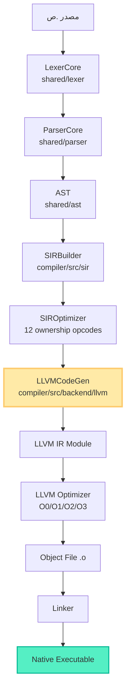
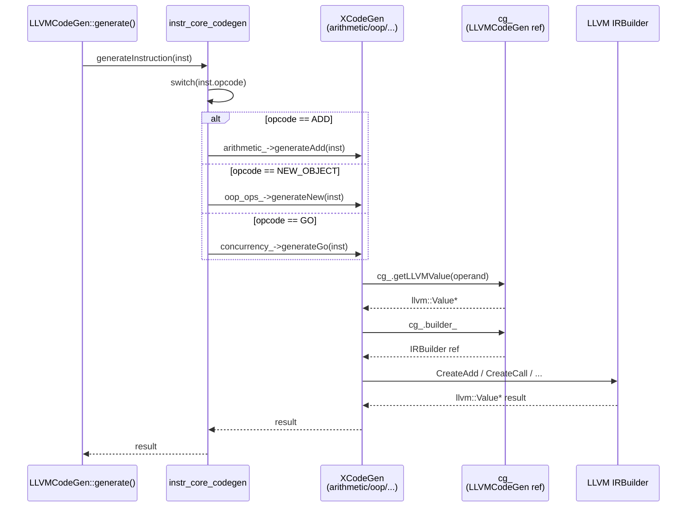
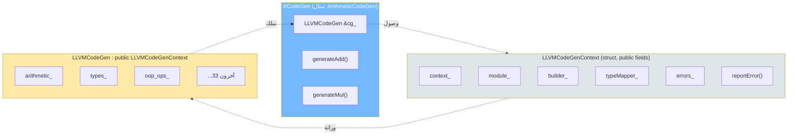
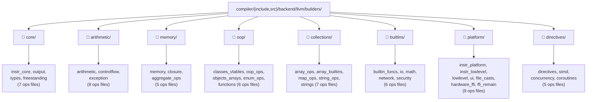
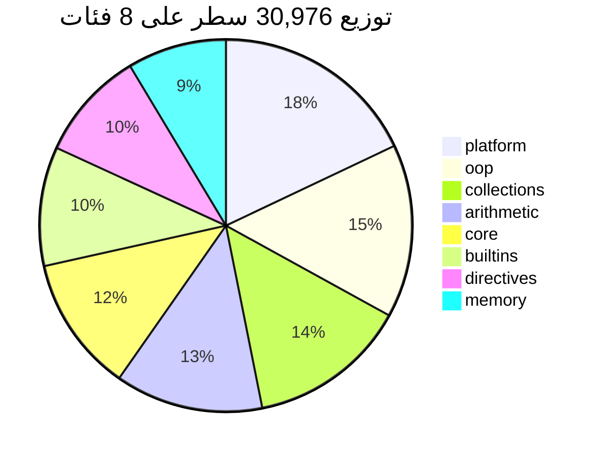

# مخططات Mermaid للبنية المعمارية

> ملحق لـ [compiler_architecture_phase10.md](compiler_architecture_phase10.md)

---

## 1. مخطط الطبقات الكلي للمترجم

---

## 2. البنية الداخلية لـ LLVMCodeGen (8 فئات / 36 sub-codegen)

```mermaid
flowchart TB
    LCG["<b>LLVMCodeGen</b><br/><i>: public LLVMCodeGenContext</i><br/>context_, module_, builder_,<br/>typeMapper_, errors_,<br/>reportError(), getLLVMValue()"]

    LCG --> CORE["<b>core/</b> 4 sub-codegens"]
    LCG --> ARITH["<b>arithmetic/</b> 3"]
    LCG --> MEM["<b>memory/</b> 3"]
    LCG --> OOP["<b>oop/</b> 5"]
    LCG --> COLL["<b>collections/</b> 5"]
    LCG --> BUILT["<b>builtins/</b> 5"]
    LCG --> PLAT["<b>platform/</b> 7"]
    LCG --> DIR["<b>directives/</b> 4"]

    CORE --> C1["instr_core"]
    CORE --> C2["output"]
    CORE --> C3["types"]
    CORE --> C4["freestanding"]

    ARITH --> A1["arithmetic"]
    ARITH --> A2["controlflow"]
    ARITH --> A3["exception"]

    MEM --> M1["memory"]
    MEM --> M2["closure"]
    MEM --> M3["aggregate_ops"]

    OOP --> O1["classes_vtables"]
    OOP --> O2["oop_ops"]
    OOP --> O3["objects_arrays"]
    OOP --> O4["enum_ops"]
    OOP --> O5["functions"]

    COLL --> L1["array_ops"]
    COLL --> L2["array_builtins"]
    COLL --> L3["map_ops"]
    COLL --> L4["string_ops"]
    COLL --> L5["strings"]

    BUILT --> B1["builtin_funcs"]
    BUILT --> B2["io_builtins"]
    BUILT --> B3["math_builtins"]
    BUILT --> B4["network_builtins"]
    BUILT --> B5["security_builtins"]

    PLAT --> P1["instr_platform"]
    PLAT --> P2["instr_lowlevel"]
    PLAT --> P3["lowlevel"]
    PLAT --> P4["ui"]
    PLAT --> P5["file_casts"]
    PLAT --> P6["hardware_ffi"]
    PLAT --> P7["ffi_remain"]

    DIR --> D1["directives"]
    DIR --> D2["simd"]
    DIR --> D3["concurrency"]
    DIR --> D4["coroutines"]

    style LCG fill:#ffeaa7,stroke:#e17055,stroke-width:3px
    style CORE fill:#a29bfe,color:#fff
    style ARITH fill:#fd79a8,color:#fff
    style MEM fill:#74b9ff,color:#fff
    style OOP fill:#55efc4
    style COLL fill:#ffeaa7
    style BUILT fill:#fab1a0
    style PLAT fill:#81ecec
    style DIR fill:#dfe6e9
```

---

## 3. تدفق توليد تعليمة SIR واحدة

---

## 4. علاقات الاعتمادية (Dependencies)

**ملاحظات:**
- `LLVMCodeGenContext` يحوي **حقول public فقط** — لا توجد `friend class` بعد Phase 8
- `LLVMCodeGen` يرث منه ويضيف 36 `unique_ptr<XCodeGen>`
- كل sub-codegen يحوي `LLVMCodeGen &cg_` ويصل لكل شيء عبره

---

## 5. هيكل المجلدات الفعلي (شجرة)

---

## 6. توزيع الأسطر حسب الفئة

---

## 7. مراحل التطور (Phases Timeline)

```mermaid
gantt
    title تطور بنية مولد LLVM
    dateFormat  X
    axisFormat  Phase %s

    section الاستخراج
    Phase 6 ownership opcodes      :p6, 0, 1
    Phase 7 first sub-codegens     :p7, 1, 1
    Phase 8 step 1-9 (25 sub)      :p8a, 2, 1
    Phase 8 step 10 mega           :p8b, 3, 1

    section التنظيف
    Phase 8 cleanup (friends)      :p8c, 4, 1
    Phase 9 TypesCodeGen extract   :p9, 5, 1

    section إعادة التنظيم
    Phase 10 8 subfolders          :crit, p10, 6, 1
    Phase 10 doc + diagrams        :active, p10d, 7, 1
```

---

**مرجع البيانات:** [compiler_architecture_phase10.md](compiler_architecture_phase10.md) §6 (الإحصائيات الكاملة)
