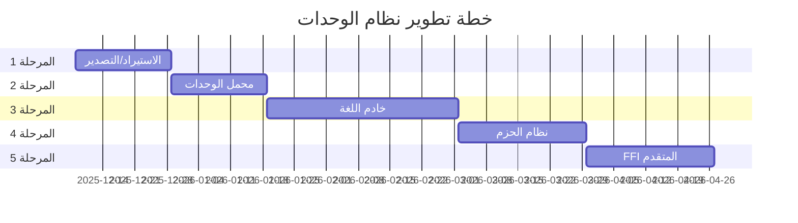

# خطة نظام الاستيراد والتصدير والوحدات - Import/Export & Modules System Plan

## 📋 نظرة عامة / Overview

**التاريخ / Date:** 8 ديسمبر 2025  
**الحالة / Status:** 🚧 قيد التخطيط / In Planning  
**الهدف / Goal:** تطوير نظام متكامل للوحدات، الاستيراد/التصدير، وخادم اللغة (Language Server)

---

## 🎯 الرؤية / Vision

### بالعربية
بناء نظام وحدات حديث وقوي للغة ص يشمل:
- **نظام استيراد/تصدير** شامل مع دعم الأنماط المتعددة
- **محمل وحدات ذكي** مع تخزين مؤقت وتحسينات
- **خادم لغة كامل** (LSP) لدعم IDEs
- **نظام حزم** لإدارة المكتبات الخارجية
- **FFI متقدم** للتكامل مع C/C++

### English
Build a modern and powerful module system for Sad language including:
- **Comprehensive import/export system** with multiple pattern support
- **Smart module loader** with caching and optimizations
- **Full language server** (LSP) for IDE support
- **Package system** for external library management
- **Advanced FFI** for C/C++ integration

---

## 📁 بنية الملفات / File Structure

```
docs/import_export_plan/
├── README.md                           # هذا الملف / This file
├── phase1_import_export.md             # المرحلة 1: نظام الاستيراد والتصدير
├── phase2_module_loader.md             # المرحلة 2: محمل الوحدات
├── phase3_language_server.md           # المرحلة 3: خادم اللغة
├── phase4_package_system.md            # المرحلة 4: نظام الحزم
├── phase5_ffi_advanced.md              # المرحلة 5: FFI المتقدم
├── implementation_guide.md             # دليل التنفيذ
├── testing_strategy.md                 # استراتيجية الاختبار
└── examples/                           # أمثلة عملية
    ├── basic_import.s
    ├── advanced_export.s
    ├── package_usage.s
    └── ffi_integration.cpp
```

---

## 🗂️ المراحل / Phases

### المرحلة 1: نظام الاستيراد والتصدير
**الوقت المقدر / Estimated Time:** 2-3 أسابيع

- ✅ استيراد أساسي: `استورد نموذج`
- ✅ استيراد انتقائي: `من نموذج استورد دالة`
- ✅ استيراد مع اسم مستعار: `استورد نموذج كـ اسم`
- ✅ استيراد شامل: `من نموذج استورد *`
- ✅ نظام التصدير: `صدر دالة/صنف/متغير`
- ⬜ استيراد ديناميكي: `__استورد__(اسم)`
- ⬜ إعادة تصدير: `صدر من نموذج`

**الملف:** [phase1_import_export.md](phase1_import_export.md)

---

### المرحلة 2: محمل الوحدات الذكي
**الوقت المقدر / Estimated Time:** 2-3 أسابيع

- ⬜ مسارات البحث المتعددة
- ⬜ التخزين المؤقت للوحدات
- ⬜ تحليل الاعتماديات
- ⬜ التحميل الكسول (Lazy Loading)
- ⬜ إعادة التحميل الساخن (Hot Reload)
- ⬜ حل التعارضات
- ⬜ إدارة الإصدارات

**الملف:** [phase2_module_loader.md](phase2_module_loader.md)

---

### المرحلة 3: خادم اللغة (LSP)
**الوقت المقدر / Estimated Time:** 4-6 أسابيع

- ⬜ بروتوكول LSP الأساسي
- ⬜ الإكمال التلقائي (Auto-completion)
- ⬜ الانتقال للتعريف (Go to Definition)
- ⬜ البحث عن المراجع (Find References)
- ⬜ تشخيص الأخطاء (Diagnostics)
- ⬜ إعادة التسمية (Rename)
- ⬜ التنسيق التلقائي (Formatting)
- ⬜ دعم Semantic Highlighting

**الملف:** [phase3_language_server.md](phase3_language_server.md)

---

### المرحلة 4: نظام الحزم
**الوقت المقدر / Estimated Time:** 3-4 أسابيع

- ⬜ ملف manifest (sad.json)
- ⬜ مدير الحزم (sad-pkg)
- ⬜ مستودع مركزي
- ⬜ إدارة الاعتماديات
- ⬜ Semantic Versioning
- ⬜ Lockfile (sad-lock.json)
- ⬜ Scripts للبناء والنشر

**الملف:** [phase4_package_system.md](phase4_package_system.md)

---

### المرحلة 5: FFI المتقدم
**الوقت المقدر / Estimated Time:** 3-4 أسابيع

- ✅ `@أصلي` للدوال الأصلية
- ⬜ ربط C++ التلقائي
- ⬜ دعم struct/class mapping
- ⬜ Callbacks من C++ إلى Sad
- ⬜ إدارة الذاكرة الآمنة
- ⬜ توليد bindings تلقائي
- ⬜ دعم shared libraries

**الملف:** [phase5_ffi_advanced.md](phase5_ffi_advanced.md)

---

## 📊 جدول زمني / Timeline



**إجمالي الوقت المقدر / Total Estimated Time:** 4-5 أشهر

---

## 🎓 المتطلبات / Requirements

### المعرفة التقنية / Technical Knowledge
- C++17 (للتنفيذ الأساسي)
- نظرية المترجمات (Compiler Theory)
- بروتوكول LSP (Language Server Protocol)
- أنظمة إدارة الحزم (Package Managers)
- FFI و Bindings

### الأدوات / Tools
- CMake (نظام البناء)
- LLVM (الخلفية)
- nlohmann/json (JSON parsing)
- GoogleTest (الاختبارات)
- clang-format (التنسيق)

---

## 🔗 الروابط / Links

- **المواصفات الحالية:** [08_modules_and_ffi.md](../language_spec/rules/08_modules_and_ffi.md)
- **خطة المكتبة القياسية:** [13_stdlib_and_modules_plan.md](../../plans/imp/13_stdlib_and_modules_plan.md)
- **خارطة الطريق:** [parser_improvements_roadmap.md](../../plans/status/parser_improvements_roadmap.md)

---

## 📈 مؤشرات النجاح / Success Metrics

- ✅ يمكن استيراد/تصدير الوحدات بسهولة
- ✅ تحميل سريع للوحدات (< 100ms لكل وحدة)
- ✅ دعم كامل في VS Code
- ✅ مستودع حزم يعمل
- ✅ FFI يعمل مع 90%+ من مكتبات C++
- ✅ تغطية اختبارات > 85%

---

## 🚀 الخطوات التالية / Next Steps

1. **قراءة المرحلة 1:** ابدأ بقراءة [phase1_import_export.md](phase1_import_export.md)
2. **مراجعة الكود الحالي:** افحص `src/lexer/lexer_keywords.cpp` و `src/parser/`
3. **تنفيذ الأساسيات:** ابدأ بتنفيذ الاستيراد الأساسي
4. **الاختبار المستمر:** اكتب اختبارات لكل ميزة
5. **التوثيق:** حدّث الوثائق مع كل تحديث

---

**معد الخطة / Plan Author:** GitHub Copilot  
**تاريخ آخر تحديث / Last Updated:** 8 ديسمبر 2025
