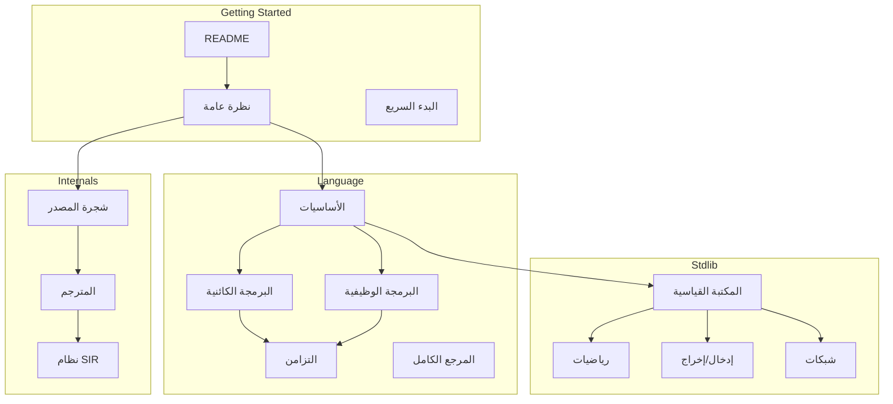

# فهرس وثائق لغة ص

> **آخر تحديث**: 17 أبريل 2026  
> **الإصدار**: 1.0.0

---

## 🚀 البدء السريع

| المستند | الوصف |
|---------|-------|
| [نظرة عامة على المشروع](project-overview.md) | ملخص شامل للمشروع ومكوناته |
| [README.md](../README.md) | دليل البداية السريعة |
| [المرجع الكامل للغة](SAD_LANGUAGE_COMPLETE_REFERENCE.md) | جميع قواعد اللغة |

---

## 📚 الوثائق الرئيسية

### أساسيات اللغة

| المستند | الوصف |
|---------|-------|
| [المرجع الكامل](SAD_LANGUAGE_COMPLETE_REFERENCE.md) | مواصفات اللغة الكاملة |
| [الأساسيات](01_الأساسيات.md) | المتغيرات والأنواع والعوامل |
| [التحكم بالتدفق](02_التحكم_بالتدفق.md) | الشروط والحلقات |
| [الدوال](03_الدوال.md) | تعريف واستدعاء الدوال |
| [المصفوفات والخرائط](04_المصفوفات_والخرائط.md) | هياكل البيانات |

### البرمجة المتقدمة

| المستند | الوصف |
|---------|-------|
| [البرمجة الكائنية](07_البرمجة_الكائنية.md) | الأصناف والوراثة والسمات |
| [مطابقة الأنماط](05_مطابقة_الأنماط.md) | Pattern Matching |
| [معالجة الأخطاء](06_معالجة_الأخطاء.md) | try/catch/finally |
| [البرمجة الوظيفية](08_البرمجة_الوظيفية.md) | Lambda والإغلاقات |
| [الماكروز](09_الماكروز.md) | نظام الماكروز |

### التزامن والتوازي

| المستند | الوصف |
|---------|-------|
| [التزامن](10_التزامن.md) | Goroutines والقنوات |
| [القنوات والاختيار](11_القنوات_والاختيار.md) | القنوات وجملة اختر |
| [أمان الخيوط](12_أمان_الخيوط.md) | Mutex وWaitGroup |

---

## 🏗️ البنية الداخلية

### 🔬 وثائق التفكيك المعماري (29 أبريل 2026 — أحدث)

> هذه السلسلة تُفكّك كل مكوّن في المشروع بدقة عالية وتربطه بمسار التنفيذ الفعلي والكود.

| المستند | المحتوى |
|---------|---------|
| [نظرة عامة على المشروع v1.3.0](project-overview.md) | **البنية الكاملة لـ 4 مسارات متوازية** + مخططات Mermaid + جدول مقارنة |
| [خارطة ميزات CLI](architecture-cli-features.md) | **كل خيار** في `sad` و `sadc` مع موقعه في الكود |
| [تفكيك أدوات tools/](architecture-tools-breakdown.md) | جميع الـ 11 برنامج تنفيذي في `tools/` (sad-lsp, sad-fmt, sad-repl, sad-pkg, ...) مع تبعياتهم |
| [دليل sad-check](sad-check-guide.md) | **فاحص الملكية الثابت** — جميع الأوضاع (--watch, --recursive, --summary, --json) + سيناريوهات CI |
| [تفكيك المكتبة القياسية stdlib/](architecture-stdlib-breakdown.md) | كل وحدة في `stdlib/` (string/math/io/network/low_level/...) — أي مكتبة C++ تجمعها وأي مسار يخدمها |
| [تفكيك النواة المشتركة shared/](architecture-shared-breakdown.md) | كل مكون في `shared/` (lexer/parser/ast/types/errors/semantic/modules/builtins/profiler/...) + اكتشافات الازدواج |
| [تفكيك المسارين 1 و 2 (Interpreter + VM)](architecture-interpreter-vm-breakdown.md) | تفكيك `interpreter/` و `vm/` مع مقارنة كاملة بين المحرّكَين |
| [📘 الملخص الشامل للتفكيك المعماري](architecture-summary.md) | **نقطة الدخول الموحَّدة** لكل وثائق التفكيك + 10 ديون تقنية + توصيات + إحصائيات |

### تحليل المشروع

| المستند | الوصف |
|---------|-------|
| [تحليل شجرة المصدر](source-tree-analysis.md) | بنية الكود المصدري |
| [هيكل المترجم](هيكل_المترجم.md) | مراحل الترجمة |
| [خريطة ميزات المترجم والأدوات](خريطة_ميزات_المترجم_والأدوات.md) | توزيع الميزات الفعلية بين `compiler_new` و `tools/compiler` |
| [جدول تتبّع ميزات المترجم](جدول_تتبع_ميزات_المترجم.md) | مصفوفة تفصيلية: Parser → Semantic → SIR → LLVM → Tooling |
| [التصنيف الرسمي لمسارات المترجم](تصنيف_مسارات_المترجم_رسميا.md) | قرار تنظيمي: إنتاجي/متوازٍ/تجريبي مع قواعد انتقال |
| [نظام SIR](sir-system.md) | التمثيل الوسيط |

### المكونات

| المكون | المستند |
|--------|---------|
| المحلل المعجمي | [Lexer API](api/lexer.md) |
| المحلل النحوي | [Parser API](api/parser.md) |
| شجرة AST | [AST Reference](api/ast.md) |
| نظام الأنواع | [Type System](api/types.md) |

---

## 📦 المكتبة القياسية

| المستند | الوصف |
|---------|-------|
| [دليل المكتبة القياسية](stdlib-guide.md) | جميع الوحدات والدوال |
| [الدوال المضمنة](builtins.md) | الدوال التلقائية |
| [وحدة الرياضيات](stdlib/math.md) | الدوال الرياضية |
| [وحدة النصوص](stdlib/string.md) | معالجة النصوص |
| [وحدة الملفات](stdlib/io.md) | الإدخال والإخراج |
| [وحدة الشبكات](stdlib/network.md) | HTTP والمقابس |
| [وحدة التشفير](stdlib/crypto.md) | الهاش والتشفير |
| [وحدة الرسوميات](stdlib/graphics.md) | SDL2 والرسم |

---

## 🛠️ الأدوات

| الأداة | المستند | الوصف |
|--------|---------|-------|
| `sad` | [دليل المفسر](tools/interpreter.md) | المفسر المباشر |
| `sadc` | [دليل المترجم](tools/compiler.md) | المترجم الأصلي |
| LSP | [خادم LSP](tools/lsp.md) | دعم المحررات |
| Formatter | [المنسق](tools/formatter.md) | تنسيق الكود |
| REPL | [الطرفية](tools/repl.md) | الطرفية التفاعلية |
| pkg | [مدير الحزم](tools/pkg.md) | إدارة الحزم |

---
## 🔒 الأمان

| المستند | الوصف |
|---------|-------|
| [الأمان الموحَّد](الأمان_الموحد.md) | نظام `shared/security`: SafeArithmetic، BoundsChecker، InputSanitizer (٢٥٣ موقع موحَّد) |
| [معمارية الذاكرة الموحَّدة](معمارية_الذاكرة_الموحدة.md) | خطة توحيد الملكية + GC + أوضاع `--dev/--prod/--learn` عبر جميع المسارات |

---
## 🧪 الاختبارات والجودة

| المستند | الوصف |
|---------|-------|
| [دليل الاختبارات](testing-guide.md) | كتابة وتشغيل الاختبارات |
| [اختبارات Dual](dual_execution_tests.md) | اختبار المفسر والمترجم |
| [معايير الجودة](quality-standards.md) | قواعد الكود |

---

## 👥 المساهمة

| المستند | الوصف |
|---------|-------|
| [CONTRIBUTING.md](../CONTRIBUTING.md) | دليل المساهمة |
| [CODE_OF_CONDUCT.md](../CODE_OF_CONDUCT.md) | قواعد السلوك |
| [CHANGELOG.md](../CHANGELOG.md) | سجل التغييرات |

---

## 📊 خريطة الوثائق

---

## 🔍 البحث السريع

### حسب الموضوع

| الموضوع | الوثائق |
|---------|---------|
| المتغيرات | [الأساسيات](01_الأساسيات.md) |
| الدوال | [الدوال](03_الدوال.md), [Lambda](08_البرمجة_الوظيفية.md) |
| الأصناف | [البرمجة الكائنية](07_البرمجة_الكائنية.md) |
| الشروط | [التحكم بالتدفق](02_التحكم_بالتدفق.md) |
| الحلقات | [التحكم بالتدفق](02_التحكم_بالتدفق.md) |
| الأخطاء | [معالجة الأخطاء](06_معالجة_الأخطاء.md) |
| التزامن | [التزامن](10_التزامن.md) |
| الرياضيات | [stdlib-guide](stdlib-guide.md#وحدة-الرياضيات-رياضيات) |
| الملفات | [stdlib-guide](stdlib-guide.md#وحدة-الملفات-ملفات) |

### حسب الكلمة المفتاحية

| الكلمة | الوثيقة |
|--------|---------|
| `دالة` | [الدوال](03_الدوال.md) |
| `صنف` | [البرمجة الكائنية](07_البرمجة_الكائنية.md) |
| `سمة` | [البرمجة الكائنية](07_البرمجة_الكائنية.md#السمات) |
| `طابق` | [مطابقة الأنماط](05_مطابقة_الأنماط.md) |
| `أطلق` | [التزامن](10_التزامن.md) |
| `قناة` | [القنوات](11_القنوات_والاختيار.md) |
| `لامدا` | [البرمجة الوظيفية](08_البرمجة_الوظيفية.md) |
| `ماكرو` | [الماكروز](09_الماكروز.md) |
| `أجّل` | [التأجيل](defer.md) |

---

## 📈 الإحصائيات

| المقياس | القيمة |
|---------|--------|
| عدد الوثائق | 1109 |
| عدد الأمثلة | 500+ |
| الكلمات المحجوزة | 40 |
| الكلمات السياقية | 25 |
| وحدات المكتبة | 30+ |
| عدد الاختبارات | 900+ |

---

*تم توليد هذا الفهرس تلقائياً — آخر تحديث: 17 أبريل 2026*
